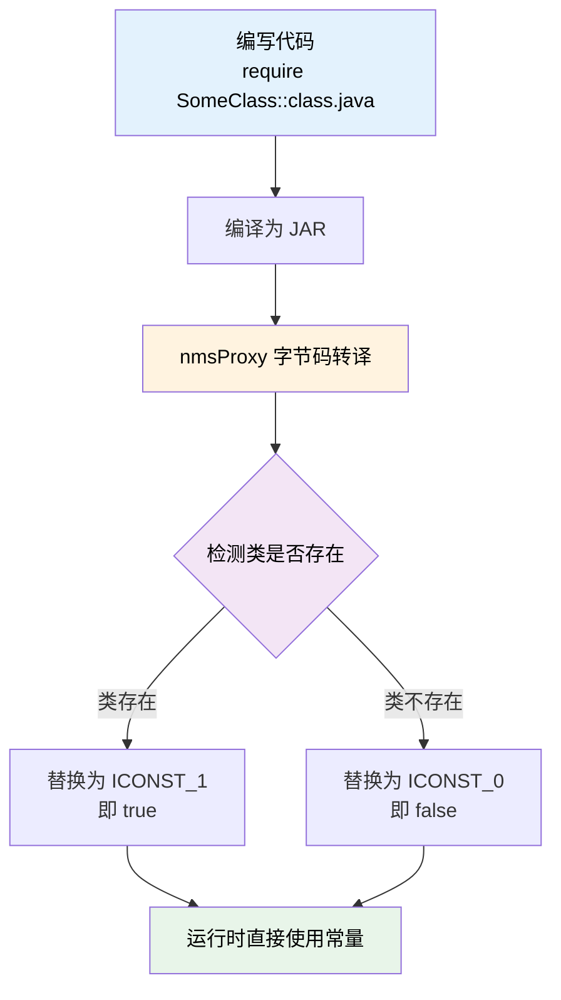

本次更新为 TabooLib 的 NMS 代理系统带来了革命性的改进，引入了全新的 `require` 函数，实现了运行时零性能开销的类存在性检查。同时还包含了对
Folia 服务端的支持改进和构建系统优化。

<!-- truncate -->

## 涉及的相关提交

### 主要功能更新

- [**d4a5f0ea**](https://github.com/TabooLib/taboolib/commit/d4a5f0ea5e4c0d625b3d84784aff06776de0ea9a)

  `feat(remap): implement require function and bytecode transformation for class existence checks`

  由 @黑 提交 - 实现了 `require` 函数和字节码转换，用于类存在性检查

- [**1e0d07a1**](https://github.com/TabooLib/taboolib/commit/1e0d07a11a9353f3e598e2b21599e35ed08c5cd0)

  `feat(bukkit-nms): 支持 Folia 的捕获玩家牌子输入`

  由 @嘿鹰 提交 - 增强了 NMSSign 模块，支持 Folia 服务端的玩家告示牌输入捕获

### 基础设施改进

- [**54cd96d4**](https://github.com/TabooLib/taboolib/commit/54cd96d4ff07c446b3fce7204cf68f0db0d9ebce)

  `feat(build): update Maven repository to use Aeolian Cloud with authentication`

  由 @黑 提交 - 添加风铃云（Aeolian Cloud）Maven 仓库镜像并支持身份验证

## 一句话简述更新

**引入零性能开销的类存在性检查机制，让跨版本 NMS 开发更简单、更高效。**

## 本次更新的重点

### 1. 全新的 require 函数 - 零性能开销的类检查

#### 背景问题

在编写跨版本 NMS 代码时，开发者经常需要根据类是否存在来决定使用哪个版本的实现。传统方法存在以下问题：

```kotlin
// ❌ 问题 1：硬编码版本号，难以维护
if (MinecraftVersion.versionId >= 12005) {
    // 使用 1.20.5+ 的类
}

// ❌ 问题 2：运行时反射检查，性能开销大
try {
    Class.forName("net.minecraft.network.protocol.game.ClientboundSystemChatPacket")
    // 类存在
} catch (e: ClassNotFoundException) {
    // 类不存在
}
```

#### 解决方案：require 函数

`require` 函数在**字节码转译阶段**完成类存在性检查，并直接替换为布尔常量：

```kotlin
// ✅ 新方式：编译时确定，零运行时开销
if (require(ClientboundSystemChatPacket::class.java)) {
    // 1.20.5+ 实现
    val packet = ClientboundSystemChatPacket(component, false)
    player.sendPacket(packet)
} else {
    // 旧版本实现
    player.sendMessage(message)
}
```

#### 工作原理



#### 技术实现

本次更新新增了以下核心组件：

1. **RemapRequire.kt** - 定义 `require` 标记函数
2. **RequireClassVisitor.kt** - ASM 类访问器，对每个方法应用转换
3. **RequireMethodVisitor.kt** - ASM 方法访问器，检测并替换 `require` 调用
4. **BufferedInstruction.kt** - 字节码指令缓冲数据结构

转译流程：

1. **检测模式**：识别 `LDC <Type>` → `GETSTATIC ::class.java` → `INVOKESTATIC require` 调用链
2. **类检查**：使用 `ClassHelper.getClass()` 尝试加载类
3. **常量替换**：
    - 类存在 → 替换整个调用链为 `ICONST_1`（true）
    - 类不存在 → 替换整个调用链为 `ICONST_0`（false）
4. **缓冲机制**：使用指令缓冲区确保正确识别调用模式

#### 性能优势

- **编译时确定**：类检查在字节码转译时完成，不在运行时执行
- **零运行时开销**：替换为布尔常量后，运行时只是简单的条件跳转
- **无异常开销**：避免了 `ClassNotFoundException` 的抛出和捕获
- **代码优化友好**：JVM 可以进一步优化分支代码

#### 适用场景

- ✅ 需要根据类是否存在来决定实现逻辑
- ✅ 同一方法需要兼容多个版本的 NMS 类
- ✅ 避免使用版本号硬编码
- ✅ 需要最优性能的场景

### 2. Folia 服务端支持改进

#### 更新内容

增强了 `NMSSign` 模块，支持在 Folia 服务端上捕获玩家的告示牌输入。

#### 技术细节

Folia 是 Paper 的多线程分支版本，采用了区域化的线程模型。本次更新确保了告示牌输入捕获功能在 Folia 的线程模型下正常工作：

- 正确处理 Folia 的区域调度器
- 适配 Folia 的事件监听机制
- 支持跨区域的玩家输入捕获

#### 影响范围

- `module/bukkit-nms/bukkit-nms-stable/src/main/kotlin/taboolib/module/nms/NMSSign.kt`
- 添加了 Folia 依赖支持

### 3. 构建系统优化

#### 更新内容

添加了风铃云（Aeolian Cloud）Maven 仓库镜像，作为 TabooProject 仓库的补充发布渠道。

#### 优势

- 提供额外的 Maven 仓库镜像，提高可用性
- 支持身份验证的安全访问
- 多镜像部署提升下载成功率

## 迁移指南

### 使用 require 函数

如果你正在维护跨版本的 NMS 代理实现，建议迁移到 `require` 函数：

**迁移前：**

```kotlin
class NMSChatImpl : NMSChat() {
    override fun sendMessage(player: Player, message: String) {
        if (MinecraftVersion.versionId >= 12005) {
            // 1.20.5+ 实现
        } else if (MinecraftVersion.versionId >= 11900) {
            // 1.19+ 实现
        } else {
            // 旧版本实现
        }
    }
}
```

**迁移后：**

```kotlin
class NMSChatImpl : NMSChat() {
    override fun sendMessage(player: Player, message: String) {
        if (require(ClientboundSystemChatPacket::class.java)) {
            // 1.20.5+ 实现（类存在时）
            val packet = ClientboundSystemChatPacket(component, false)
            player.sendPacket(packet)
        } else if (require(ClientboundChatPacket::class.java)) {
            // 1.19+ 实现（类存在时）
            val packet = ClientboundChatPacket(component, ChatType.SYSTEM, UUID.randomUUID())
            player.sendPacket(packet)
        } else {
            // 旧版本实现
            player.sendMessage(message)
        }
    }
}
```

### Folia 服务端支持

如果你的插件需要支持 Folia，现在可以使用 `NMSSign` 模块捕获玩家输入：

```kotlin
// 在 Folia 和 Paper/Spigot 上都能正常工作
NMSSign.instance.openSignEditor(player) { lines ->
    player.sendMessage("你输入了：${lines.joinToString()}")
}
```

## 文档更新

本次更新同步更新了以下文档：

- [NMS 代理系统 - require 函数](/docs/basic-tech/nms-proxy#7-运行时类存在性检查---require-函数)：新增了 `require`
  函数的详细使用说明和完整示例

## 致谢

感谢以下贡献者为本次更新做出的贡献：

- @黑 - 实现 `require` 函数和字节码转换系统
- @嘿鹰 - 添加 Folia 支持

---

如有问题或建议，欢迎在 [GitHub Issues](https://github.com/TabooLib/taboolib/issues) 反馈。
