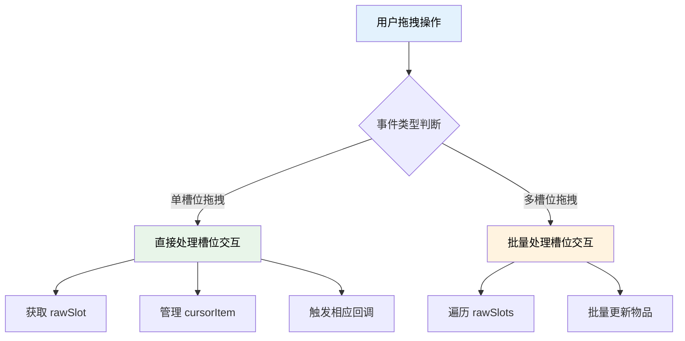
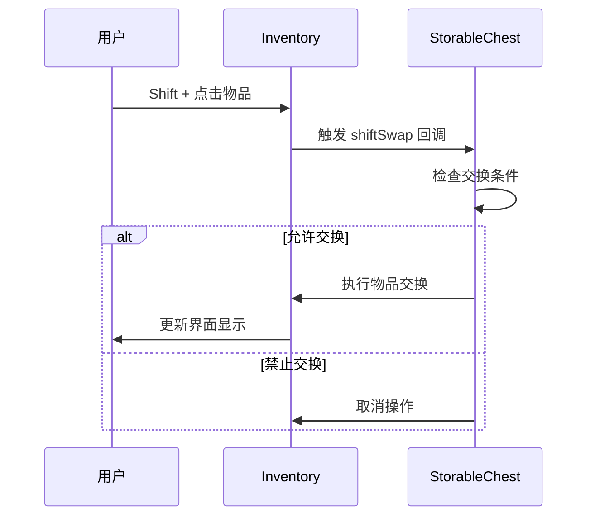

本次更新专注于增强 TabooLib 的 UI 交互系统和存储容器功能，改进了拖拽操作支持、物品交换机制，并优化了性能表现。同时还包含了时间循环模块的重构优化。

<!-- truncate -->

## 涉及的相关提交

### 主要功能更新

- [**a9b2d995**](https://github.com/TabooLib/taboolib/commit/a9b2d995ffe116027ca01857ae83f7ca50a8bf8e)

  `feat(ClickEvent): add drag support for single slot interactions and cursor item management`

  由 @黑 提交 - 为 ClickEvent 添加单槽位拖拽交互支持和光标物品管理

- [**bdb5af9a**](https://github.com/TabooLib/taboolib/commit/bdb5af9a18d03e55b998a7bd0930b0b57d95c026)

  `feat(StorableChest): add support for shift item swapping in inventory`

  由 @黑 提交 - 为 StorableChest 添加 Shift 键物品交换支持

- [**c3d0b0a6**](https://github.com/TabooLib/taboolib/commit/c3d0b0a65ac89d5369cbbb1c94ff305efc5fa8d3)

  `feat(StorableChest): enhance drag handling to support single slot interactions`

  由 @黑 提交 - 增强 StorableChest 拖拽处理，支持单槽位交互

- [**27977cf1**](https://github.com/TabooLib/taboolib/commit/27977cf12626026803c0575b6224eaf3e6c38a44)

  `feat(StorableChest): refactor build method and extract drag/click handling into separate functions`

  由 @黑 提交 - 重构 StorableChest 构建方法，将拖拽和点击处理分离为独立函数

### 基础设施改进

- [**4d51fda3**](https://github.com/TabooLib/taboolib/commit/4d51fda39a3105ec1361deb2eb1f1abff3879378)

  `feat(NMSScoreboard): enhance JSON component handling with version checks`

  由 @黑 提交 - 增强 NMSScoreboard 的 JSON 组件处理，添加版本检查

- [**e701c89e**](https://github.com/TabooLib/taboolib/commit/e701c89e397a28cc91b623cd323489a923cd3005)

  `refactor(TimeCycle): simplify start method and remove unused cacheMap`

  由 @黑 提交 - 简化 TimeCycle 的 start 方法并移除未使用的 cacheMap

## 一句话简述更新

**大幅改进 UI 交互体验，提供更流畅的拖拽操作和物品管理功能，让用户界面更直观、更易用。**

## 本次更新的重点

### 1. ClickEvent 拖拽支持增强

#### 背景问题

在之前的版本中，ClickEvent 对拖拽操作的支持有限，特别是对于单槽位的拖拽交互处理不够完善，开发者难以准确获取和处理用户的拖拽意图。

#### 解决方案

本次更新增强了 ClickEvent 对拖拽操作的支持，特别是在单槽位交互场景下的表现：

```kotlin
// 改进前：拖拽事件处理复杂
if (clickEvent.dragEvent().rawSlots.size == 1) {
    // 复杂的槽位判断逻辑
}

// 改进后：简洁的拖拽处理
val rawSlot = clickEvent.rawSlot // 直接获取拖拽槽位
val cursorItem = clickEvent.cursorItem // 获取光标物品
```

#### 技术实现



#### 核心特性

- **单槽位拖拽支持**：完善了对单个槽位拖拽操作的识别和处理
- **光标物品管理**：提供了便捷的光标物品获取和设置接口
- **统一的 API**：无论是点击还是拖拽，都使用相同的方法访问相关属性

### 2. StorableChest 物品交换功能

#### 背景问题

在使用可存储容器时，用户希望能够通过 Shift 键快速交换物品，提升操作效率。之前的实现缺少对这类交互的支持。

#### 解决方案

为 StorableChest 添加了 Shift 键物品交换功能，允许用户通过 Shift + 点击的方式快速交换物品位置。

#### 功能特性

```kotlin
StorableChest.create(5, "存储容器") {
    rule {
        // 定义 Shift 交换规则
        shiftSwap { inventory, itemStack, slot ->
            // 返回 true 允许交换，false 禁止交换
            itemStack.type != Material.BARRIER
        }

        // 定义首次存放位置
        firstSlot { inventory, itemStack ->
            // 返回优先存放的槽位
            inventory.firstEmpty()
        }
    }

    onBuild { _, _ ->
        // 其他构建逻辑
    }
}
```

#### 工作原理



### 3. StorableChest 架构重构

#### 背景问题

随着功能的增加，StorableChest 的构建方法变得臃肿，拖拽和点击处理逻辑耦合在一起，影响代码的可维护性。

#### 解决方案

对 StorableChest 的实现进行了架构重构，将拖拽和点击处理逻辑分离为独立的函数，提高了代码的可读性和可维护性。

#### 重构效果

```kotlin
// 重构前：所有逻辑混在一起
fun build(): Inventory {
    // 复杂的混合逻辑...
}

// 重构后：职责分离
fun build(): Inventory {
    return createInventory().apply {
        setupDragHandling()  // 拖拽处理
        setupClickHandling() // 点击处理
        setupItemSlots()     // 物品槽位设置
    }
}
```

#### 性能优势

- **代码可读性提升**：逻辑分离，更容易理解和维护
- **功能扩展性增强**：新功能可以独立添加而不影响其他部分
- **性能优化**：减少了不必要的重复计算

### 4. NMSScoreboard 版本兼容性改进

#### 背景问题

不同 Minecraft 版本对 JSON 组件的支持存在差异，需要根据版本进行适配处理，确保功能在不同版本下都能正常工作。

#### 解决方案

增强了 NMSScoreboard 的 JSON 组件处理逻辑，添加了版本检查机制，确保在不同版本下都能正确处理组件。

```kotlin
fun createComponent(text: String): Any {
    return when {
        // 高版本使用 JSON 组件
        MinecraftVersion.versionId >= 1130 -> {
            // JSON 组件处理逻辑
            createJsonComponent(text)
        }
        // 低版本使用传统文本
        else -> {
            // 传统文本处理逻辑
            createLegacyText(text)
        }
    }
}
```

### 5. TimeCycle 性能优化

#### 背景问题

TimeCycle 类中存在未使用的 cacheMap 字段，start 方法的实现也较为复杂，影响了类的简洁性和性能。

#### 解决方案

对 TimeCycle 进行了性能优化，移除了未使用的 cacheMap，简化了 start 方法的实现。

```java
// 优化前：复杂的缓存机制
private Map<String, Long> cacheMap = new HashMap<>();

public TimeCycle start(long start) {
    // 复杂的缓存计算...
}

// 优化后：简洁的实现
public TimeCycle start(long start) {
    // 直接计算，无缓存开销
    this.end = calculateEndTime(start);
    return this;
}
```

## 使用示例

### UI 拖拽交互示例

```kotlin
val chest = Chest.create(6, "拖拽示例") {
    onDrag { clickEvent ->
        // 处理拖拽事件
        val draggedSlots = clickEvent.dragEvent().rawSlots
        val cursorItem = clickEvent.cursorItem

        if (draggedSlots.size == 1) {
            // 单槽位拖拽
            val slot = draggedSlots.first()
            val currentItem = inventory.getItem(slot)

            // 自定义拖拽逻辑
            if (cursorItem != null && currentItem != null) {
                // 交换物品
                inventory.setItem(slot, cursorItem)
                clickEvent.cursorItem = currentItem
            }
        }

        clickEvent.isCancelled = true // 取消默认行为
    }
}
```

### 存储容器 Shift 交换示例

```kotlin
val storage = StorableChest.create(3, "物品存储") {
    rule {
        // 允许 Shift 交换非障碍物
        shiftSwap { inventory, itemStack, slot ->
            itemStack.type != Material.BARRIER
        }

        // 定义首次存放规则
        firstSlot { inventory, itemStack ->
            // 优先存放在第 1-9 槽位
            (0 until 9).firstOrNull { inventory.getItem(it) == null } ?: -1
        }

        // 物品写入回调
        writeItem { inventory, itemStack, slot, type ->
            if (type == BukkitClickType.SHIFT_LEFT || type == BukkitClickType.SHIFT_RIGHT) {
                // Shift 点击特殊处理
                println("物品 ${itemStack.type} 通过 Shift 点击放入槽位 $slot")
            }
        }
    }
}
```

## 迁移指南

### ClickEvent API 变更

**无破坏性变更**：现有代码无需修改即可使用新功能。

**推荐升级**：

```kotlin
// 升级前：复杂的拖拽槽位获取
fun getDraggedSlot(clickEvent: ClickEvent): Int {
    val dragEvent = clickEvent.dragEventOrNull()
    return dragEvent?.rawSlots?.firstOrNull() ?: -1
}

// 升级后：直接访问
val slot = clickEvent.rawSlot // 属性增强，自动处理拖拽和点击
```

### StorableChest 规则扩展

**新增功能**：现在可以为 StorableChest 定义 Shift 交换规则：

```kotlin
// 新增功能，无需迁移现有代码
StorableChest.create(3, "容器") {
    rule {
        // Shift 交换规则
        shiftSwap { inventory, itemStack, slot ->
            true // 允许所有物品的 Shift 交换
        }
    }
}
```

## 致谢

感谢以下贡献者为本次更新做出的贡献：

- @黑 - ClickEvent 拖拽增强、StorableChest 功能扩展、NMSScoreboard 版本兼容性改进、TimeCycle 优化

如有问题或建议，欢迎在 [GitHub Issues](https://github.com/TabooLib/taboolib/issues) 反馈。
