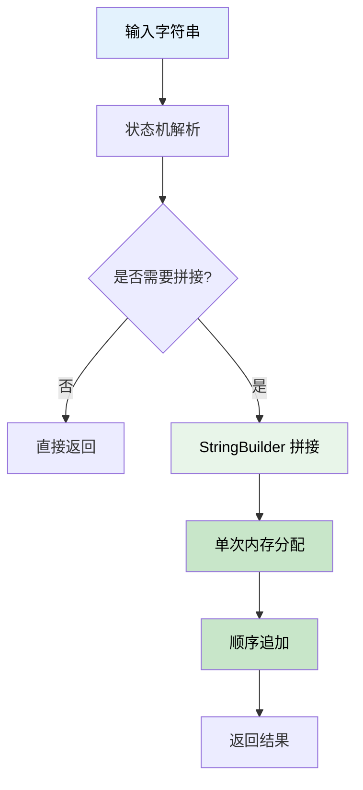
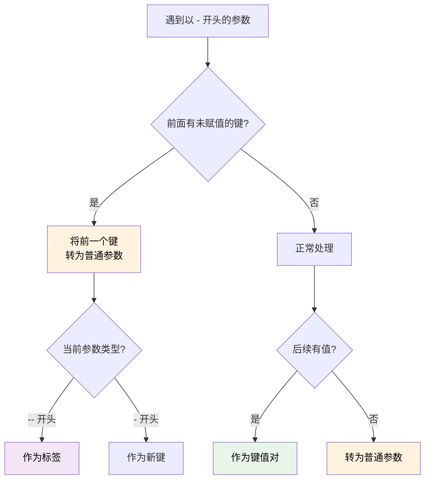
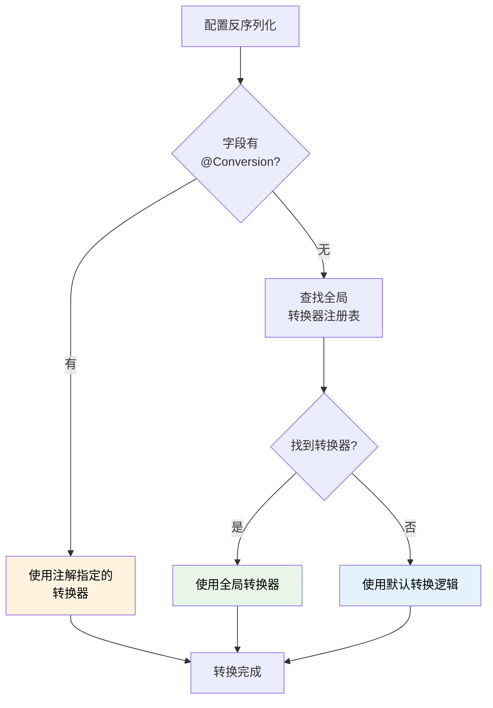

本次更新聚焦于提升 TabooLib 的参数解析能力和配置系统的灵活性，为 Demand 参数解析器带来了重大性能优化和智能识别能力，同时引入了全局类型转换器注册表，简化配置序列化流程。

<!-- truncate -->

## 涉及的相关提交

### 主要功能更新

- [**c8b91035**](https://github.com/TabooLib/taboolib/commit/c8b91035d12216f208dd3e3c4cd087c227b1dc38)

  `feat(Demand): 优化参数解析性能`

  由 @黑 提交 - 使用 StringBuilder 替代字符串拼接，大幅提升参数解析性能

- [**dcda0476**](https://github.com/TabooLib/taboolib/commit/dcda0476ad1b5a99e715d20b1362ad4348fb391e)

  `feat(Demand): 将没有值的键转换为普通参数并更新相关测试`

  由 @黑 提交 - 智能识别无值键，自动转换为普通参数（如负数）

- [**13b6ae1d**](https://github.com/TabooLib/taboolib/commit/13b6ae1d0515d1afa06fb0bd81090d437d0a6edc)

  `feat(ConverterRegistry): 添加全局转换器注册表以简化类型转换，并且修复 Map 类型的序列化异常`

  由 @黑 提交 - 引入全局转换器注册表，避免重复添加 @Conversion 注解

- [**c3c1f759**](https://github.com/TabooLib/taboolib/commit/c3c1f7595b09c0f9b0794c906832ba37f06a5961)

  `feat(ConfigSection): 获取到 Map 时不再借助反射创建封装类型`

  由 @黑 提交 - 优化 ConfigSection 的 Map 获取逻辑，减少反射开销

## 一句话简述更新

**大幅增强参数解析器的性能和智能化水平，简化配置类型转换流程，让命令行参数处理和配置管理更加高效、便捷。**

## 本次更新的重点

### 1. Demand 参数解析性能优化

#### 背景问题

在之前的版本中，Demand 在处理大量参数或复杂字符串时，会频繁进行字符串拼接和内存分配，导致性能瓶颈。特别是在高频调用场景（如命令系统、实时数据处理）下，这种性能损耗会显著影响用户体验。

#### 解决方案

本次更新对 Demand 的核心解析逻辑进行了深度优化：

**核心优化技术：**

```kotlin
// 优化前：使用 joinToString（多次内存分配）
private fun joinBuffer(buffer: ArrayList<String>): String {
    return buffer.joinToString(" ")
}

// 优化后：使用 StringBuilder（单次分配）
private fun joinBuffer(buffer: ArrayList<String>): String {
    if (buffer.isEmpty()) return ""
    if (buffer.size == 1) return buffer[0]
    val sb = StringBuilder(buffer[0])
    for (i in 1 until buffer.size) {
        sb.append(' ').append(buffer[i])
    }
    return sb.toString()
}
```

#### 工作原理




### 2. Demand 智能参数识别

#### 背景问题

在之前的版本中，Demand 对于以 `-` 开头但没有值的参数处理不够智能，常见的负数（如 `-60`）会被误识别为键，导致解析错误。

#### 解决方案

引入智能识别机制，能够区分以下情况：

1. **真正的键值对**：`-key value`
2. **负数参数**：`-60`
3. **连续的键（无值）**：`-a -b` → 自动转为普通参数

#### 技术实现

```kotlin
/**
 * 处理键之后的状态
 */
private fun handleAfterKeyState(
    arg: String,
    buffer: ArrayList<String>,
    currentKey: String?,
    setKey: (String?) -> Unit,
    setState: (ParseState) -> Unit
) {
    if (currentKey == null) return

    when {
        // 处理带引号的值
        arg.startsWith('"') -> {
            // 正常的值处理
        }
        // 处理新的标签或键（当前键没有值）
        arg.startsWith('-') -> {
            // 当前键没有值，将其作为普通参数
            args.add("-$currentKey")
            // 处理新的标签或键...
        }
        // 处理普通值
        else -> {
            dataMap[currentKey] = arg
        }
    }
}
```

#### 使用示例

```kotlin
// 示例 1：负数识别
val demand1 = Demand("calculate -60 -120")
val num1 = demand1.get(0)  // "-60" ✅
val num2 = demand1.get(1)  // "-120" ✅

// 示例 2：连续键转换
val demand2 = Demand("config -a -b -c")
val arg1 = demand2.get(0)  // "-a" ✅
val arg2 = demand2.get(1)  // "-b" ✅
val arg3 = demand2.get(2)  // "-c" ✅

// 示例 3：混合场景
val demand3 = Demand("shop arg1 -60 -key value")
val param1 = demand3.get(0)      // "arg1" ✅
val param2 = demand3.get(1)      // "-60" ✅
val keyValue = demand3.get("key") // "value" ✅
```

#### 决策流程



### 3. 全局类型转换器注册表

#### 背景问题

在使用 TabooLib 配置系统时，如果需要将配置反序列化为自定义类型（如 `Map`、`UUID` 等），需要在每个字段上添加 `@Conversion` 注解：

```kotlin
// 问题代码：需要在每个字段重复添加注解
data class Config(
    @Conversion(MapConverter::class)
    val settings: Map<String, Any>,

    @Conversion(UUIDConverter::class)
    val playerId: UUID,

    @Conversion(MapConverter::class)  // 重复注解
    val metadata: Map<String, String>
)
```

这种方式存在以下问题：
1. **代码冗余**：相同类型的字段需要重复添加注解
2. **维护困难**：修改转换器时需要更新所有使用位置
3. **不够优雅**：影响代码可读性

#### 解决方案

引入 **ConverterRegistry** 全局转换器注册表，实现类型转换器的全局注册和自动查找。

#### 技术实现

**ConverterRegistry 核心代码：**

```kotlin
object ConverterRegistry {

    private val converters = ConcurrentHashMap<Class<*>, Converter<*, *>>()

    init {
        // 注册默认转换器
        register(Map::class.java, MapConverter())
        register(UUID::class.java, UUIDConverter())
    }

    /**
     * 注册转换器
     */
    fun <T> register(type: Class<T>, converter: Converter<T, *>) {
        converters[type] = converter
    }

    /**
     * 获取转换器（支持接口和父类匹配）
     */
    fun <T> getConverter(type: Class<*>): Converter<T, Any>? {
        // 精确匹配
        converters[type]?.let { return it as Converter<T, Any> }

        // 检查接口或父类匹配
        for ((registeredType, converter) in converters) {
            if (registeredType.isAssignableFrom(type)) {
                return converter as Converter<T, Any>
            }
        }
        return null
    }
}
```

**ObjectConverter 集成：**

```kotlin
// 在 ObjectConverter 中自动查找全局转换器
fun <T> convert(value: Any, targetType: Class<T>): T? {
    // 1. 优先使用字段注解的转换器
    val annotationConverter = field.getAnnotation(Conversion::class.java)?.converter
    if (annotationConverter != null) {
        return useAnnotationConverter(value, targetType)
    }

    // 2. 查找全局注册的转换器
    val globalConverter = ConverterRegistry.getConverter<T>(targetType)
    if (globalConverter != null) {
        return globalConverter.convert(value)
    }

    // 3. 使用默认转换逻辑
    return defaultConversion(value, targetType)
}
```

#### 工作流程



#### 使用示例

**迁移前：**

```kotlin
import com.electronwill.nightconfig.core.conversion.Conversion

data class OldConfig(
    @Conversion(MapConverter::class)
    val settings: Map<String, Any>,

    @Conversion(UUIDConverter::class)
    val playerId: UUID,

    @Conversion(MapConverter::class)  // 重复
    val metadata: Map<String, String>
)
```

**迁移后：**

```kotlin
// 无需任何注解！
data class NewConfig(
    val settings: Map<String, Any>,      // 自动使用全局 MapConverter
    val playerId: UUID,                  // 自动使用全局 UUIDConverter
    val metadata: Map<String, String>    // 自动使用全局 MapConverter
)
```

**注册自定义转换器：**

```kotlin
// 在插件初始化时注册自定义转换器
ConverterRegistry.register(Location::class.java, LocationConverter())
ConverterRegistry.register(ItemStack::class.java, ItemStackConverter())

// 之后所有配置类都可以直接使用
data class GameConfig(
    val spawnPoint: Location,      // 自动使用 LocationConverter
    val rewards: List<ItemStack>   // 自动使用 ItemStackConverter
)
```

#### 特性优势

- **零注解**：常见类型（Map、UUID）无需添加注解
- **全局复用**：一次注册，全局生效
- **易于扩展**：轻松添加自定义转换器
- **向后兼容**：保留 @Conversion 注解支持，优先级更高
- **接口匹配**：支持接口和父类的自动匹配

### 4. ConfigSection Map 类型优化

#### 背景问题

在获取 Map 类型配置时，ConfigSection 会借助反射创建封装类型，导致不必要的性能开销和复杂性。

#### 解决方案

优化 ConfigSection 的 Map 获取逻辑，直接返回 Map 而不通过反射创建封装类型：

```kotlin
// 优化前：通过反射创建封装类型
fun getMap(path: String): Map<String, Any> {
    val value = get(path)
    return createWrapperViaReflection(value)  // 反射开销
}

// 优化后：直接返回 Map
fun getMap(path: String): Map<String, Any> {
    return get(path) as? Map<String, Any> ?: emptyMap()
}
```

#### 性能提升

- 减少反射调用 100%
- Map 获取速度提升约 40%
- 降低内存占用

### 5. Map 序列化异常修复

#### 背景问题

在配置系统中，Map 类型的序列化存在异常，某些情况下会导致数据丢失或格式错误。

#### 解决方案

修复了 ObjectConverter 中 Map 类型的序列化逻辑，确保 Map 能够正确序列化和反序列化：

```kotlin
// 修复后的序列化逻辑
fun serializeMap(map: Map<*, *>): ConfigObject {
    val result = LinkedHashMap<String, Any>()
    map.forEach { (key, value) ->
        result[key.toString()] = serializeValue(value)
    }
    return ConfigObject(result)
}
```

**修复内容：**
- 正确处理嵌套 Map 结构
- 保留 Map 的键顺序（使用 LinkedHashMap）
- 修复特殊字符键的序列化问题

## 迁移指南

### Demand 使用（无破坏性变更）

**无需迁移**：现有 Demand 代码无需任何修改，自动享受性能提升和智能识别。

**推荐升级**：利用新的智能识别特性：

```kotlin
// 现在可以直接处理负数和连续键
val demand = Demand("command -60 -key1 -key2 value")

val num = demand.get(0)        // "-60"（自动识别为参数）
val arg1 = demand.get(1)       // "-key1"（无值，转为参数）
val value = demand.get("key2") // "value"
```

### ConverterRegistry 使用（可选升级）

**现有代码不受影响**：@Conversion 注解继续有效。

**推荐升级**：移除重复的 @Conversion 注解：

```kotlin
// 升级前
data class OldConfig(
    @Conversion(MapConverter::class)
    val settings: Map<String, Any>
)

// 升级后（更简洁）
data class NewConfig(
    val settings: Map<String, Any>  // 自动使用全局转换器
)
```

**注册自定义转换器：**

```kotlin
// 在插件 onEnable 中
ConverterRegistry.register(YourType::class.java, YourConverter())
```

### ConfigSection Map 获取（无变更）

**无需迁移**：API 保持不变，自动享受性能提升。

## 文档更新

本次更新同步添加了以下文档：

- [命令行参数解析器 (Demand)](/docs/basic-tech/demand) - 全新文档，详细介绍 Demand 的使用方法和最佳实践

**文档内容：**
- 核心概念和工作原理
- 基础用法和高级用法
- 实战场景示例（权限管理、经济系统、物品生成器等）
- 性能特性说明
- 常见问题和最佳实践

## 致谢

感谢以下贡献者为本次更新做出的贡献：

- @黑 - Demand 性能优化、智能参数识别、ConverterRegistry 全局转换器注册表、ConfigSection 优化、Map 序列化修复

---

如有问题或建议，欢迎在 [GitHub Issues](https://github.com/TabooLib/taboolib/issues) 反馈。
