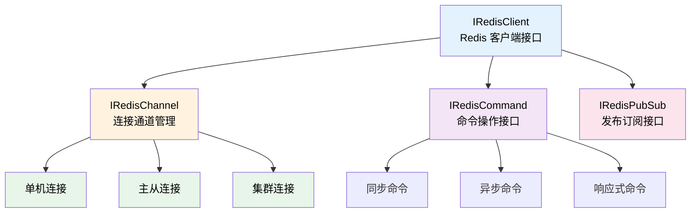

本次更新对 Lettuce Redis 模块进行了全面重构，引入更清晰的接口设计和更完善的集群支持，同时为命令系统添加了枚举类型参数支持，提升了开发体验。

<!-- truncate -->

## 涉及的相关提交

### 主要功能更新

- [**f86fd342**](https://github.com/TabooLib/taboolib/commit/f86fd3420a29b687904a263b9d5726a567215f19)

  `refactor(database): 重构 Redis 客户端实现并移除旧代码`

  由 @zhibei 提交 - 全面重构 Lettuce Redis 模块，引入清晰的接口设计和完善的集群支持

- [**bb18dd9e**](https://github.com/TabooLib/taboolib/commit/bb18dd9e53b57337f9f4b59876bfd6bdf30fdf25)

  `feat(command): 添加枚举类型的命令参数支持和建议功能`

  由 @zhibei 提交 - 为命令系统添加原生枚举类型参数支持，自动提供枚举值建议

- [**961812250**](https://github.com/TabooLib/taboolib/commit/961812250949a0ff3408e52b27c512c7b5054f0c)

  `feat(ui): 在 ClickEvent 中添加 view 属性以获取 InventoryView`

  由 @zhibei 提交 - 在 ClickEvent 中新增 view 属性，方便获取完整的 InventoryView 对象

### 基础设施改进

- [**039a3a25**](https://github.com/TabooLib/taboolib/commit/039a3a25333e1547dae49860fe95404255bb34fa)

  `feat(bukkit): 添加对 ItemName 的支持`

  由 @嘿鹰 提交 - ItemBuilder 支持读取和设置 ItemName（Minecraft 1.20.5+）

- [**535ff663**](https://github.com/TabooLib/taboolib/commit/535ff663eb7ec3a22971ae651599b0c3295cdcd5)

  `fix(bukkit-util): 修复 PropertyMap 获取兼容性问题`

  由 @Sting 提交 - 修复玩家头颅纹理属性获取的兼容性问题

- [**0acab40f**](https://github.com/TabooLib/taboolib/commit/0acab40f1f0d9867ef49114a4f461f8f31ccbaa3)

  `fix(kether): 修正 RemoteQuestContext 中的方法返回类型`

  由 @zhibei 提交 - 修正 RemoteQuestContext 部分方法的可空性标注

## 一句话简述更新

**Lettuce Redis 模块迎来全面重构，引入更现代化的接口设计和完善的集群支持，同时命令系统新增枚举参数支持，让开发更加便捷。**

## 本次更新的重点

### 1. Lettuce Redis 模块全面重构

#### 背景问题

在之前的版本中，Lettuce Redis 模块存在以下问题：

1. **接口设计不够清晰**：客户端类混杂了过多职责，缺少清晰的接口抽象
2. **集群支持不完善**：集群模式的配置和功能支持较为有限
3. **配置复杂度高**：配置结构不够直观，缺少完整的配置示例
4. **连接池管理混乱**：同步和异步连接池的管理逻辑耦合度高

#### 解决方案

本次更新对整个 Lettuce Redis 模块进行了全面重构，引入了清晰的接口分层设计：

**新的接口体系：**



#### 核心改进

**1. 新增接口定义**

```kotlin
// 客户端接口
interface IRedisClient {
    fun start(autoRelease: Boolean = true): CompletableFuture<Void>
}

// 命令操作接口
interface IRedisCommand {
    fun <T> useCommands(block: (RedisCommands<String, String>) -> T): T?
    fun <T> useAsyncCommands(block: (RedisAsyncCommands<String, String>) -> T): CompletableFuture<T?>
    fun <T> useReactiveCommands(block: (RedisReactiveCommands<String, String>) -> T): CompletableFuture<T?>
}

// 发布订阅接口
interface IRedisPubSub {
    fun <T> usePubSubCommands(block: (RedisPubSubCommands<String, String>) -> T): T?
    fun <T> usePubSubAsyncCommands(block: (RedisPubSubAsyncCommands<String, String>) -> T): T?
    fun <T> usePubSubReactiveCommands(block: (RedisPubSubReactiveCommands<String, String>) -> T): T?
}

// 连接通道接口
interface IRedisChannel {
    fun <T> useConnection(
        use: ((StatefulRedisConnection<String, String>) -> T)? = null,
        useCluster: ((StatefulRedisClusterConnection<String, String>) -> T)? = null
    ): T?

    fun <T> useAsyncConnection(
        use: ((StatefulRedisConnection<String, String>) -> T)? = null,
        useCluster: ((StatefulRedisClusterConnection<String, String>) -> T)? = null
    ): CompletableFuture<T?>
}
```

**2. 统一的配置系统**

引入了 `LettuceRedisConfig` 类来统一管理所有配置：

```kotlin
class LettuceRedisConfig(val configurationSection: ConfigurationSection) {
    // 基础连接配置
    val host: String
    val port: Int
    val password: String?
    val ssl: Boolean
    val timeout: Duration
    val database: Int

    // 线程池配置
    val ioThreadPoolSize: Int
    val computationThreadPoolSize: Int

    // 连接池配置
    val pool: Pool
    val asyncPool: AsyncPool

    // 哨兵模式配置
    val enableSentinel: Boolean
    val sentinel: Sentinel

    // 主从模式配置
    val enableSlaves: Boolean
    val slaves: Slaves

    // 集群模式配置
    val cluster: Cluster
}
```

**3. 完善的集群支持**

新增 `LettuceClusterRedisClient` 类，提供完整的 Redis 集群功能支持：

- 集群拓扑自动发现和刷新
- 自适应刷新触发器
- 动态刷新源支持
- 过时连接自动清理
- 集群重定向支持
- 节点成员关系验证

**4. 改进的连接池管理**

分离了同步和异步连接池的管理逻辑，提供更清晰的资源管理：

```kotlin
class LettuceRedisClient(val redisConfig: LettuceRedisConfig) {
    // 同步连接池
    lateinit var pool: GenericObjectPool<StatefulRedisConnection<String, String>>

    // 异步连接池
    lateinit var asyncPool: BoundedAsyncPool<StatefulRedisConnection<String, String>>

    // 主从同步连接池
    lateinit var masterReplicaPool: GenericObjectPool<StatefulRedisMasterReplicaConnection<String, String>>

    // 主从异步连接池
    lateinit var masterAsyncReplicaPool: BoundedAsyncPool<StatefulRedisMasterReplicaConnection<String, String>>
}
```

#### 使用示例

**单机模式：**

```kotlin
// 加载配置
val config = LettuceRedisConfig(configuration.getConfigurationSection("redis")!!)

// 创建客户端
val client = LettuceRedisClient(config)
client.start().join()

// 使用同步命令
client.useCommands { commands ->
    commands.set("key", "value")
    commands.get("key")
}

// 使用异步命令
client.useAsyncCommands { commands ->
    commands.set("key", "value")
}.thenAccept { result ->
    println("操作结果: $result")
}

// 使用发布订阅
client.usePubSubCommands { commands ->
    commands.subscribe("channel")
}
```

**集群模式：**

```kotlin
// 加载配置
val config = LettuceRedisConfig(configuration.getConfigurationSection("redis")!!)

// 创建集群客户端
val client = LettuceClusterRedisClient(config)
client.start().join()

// 使用集群命令
client.useClusterCommands { commands ->
    commands.set("key", "value")
    commands.get("key")
}
```

#### 配置文件示例

新增了完整的配置文件示例 `example.yml`，涵盖所有配置选项：

```yaml
redis:
  host: localhost
  port: 6379
  password: password
  ssl: false
  timeout: PT15S
  database: 0

  # 哨兵模式
  sentinel:
    enable: false
    masterId: master
    nodes:
      - "127.0.0.1:26379"

  # 主从模式
  slaves:
    enable: false
    readFrom: nearest  # master, masterPreferred, slave, slavePreferred, nearest, any

  # 集群模式
  cluster:
    enablePeriodicRefresh: false
    refreshPeriod: PT60S
    enableAdaptiveRefreshTrigger: []
    maxRedirects: 5

  # 连接池配置
  pool:
    maxTotal: 8
    maxIdle: 8
    minIdle: 0
    testOnBorrow: false
    maxWaitDuration: PT15S
    blockWhenExhausted: true
```

#### 依赖升级

- **Lettuce Core**: 升级至 6.6.0（支持最新 Redis 特性）
- **Apache Commons Pool2**: 升级至 2.12.1（改进连接池性能）

### 2. 命令系统枚举参数支持

#### 背景问题

在之前的版本中，命令系统虽然支持自定义参数类型，但对于枚举类型的处理不够便捷，开发者需要手动编写约束和建议逻辑。

#### 解决方案

本次更新为命令系统新增了原生的枚举类型参数支持，提供自动约束和自动建议功能。

#### 使用示例

```kotlin
enum class GameMode {
    SURVIVAL, CREATIVE, ADVENTURE, SPECTATOR
}

@CommandHeader("gamemode", ["gm"])
object GameModeCommand {
    @CommandBody
    val main = subCommand {
        // 使用枚举参数节点
        enum(GameMode.entries, "mode") {
            execute<Player> { sender, context, _ ->
                val mode = context["mode"]
                // mode 类型已自动约束为 GameMode 枚举值之一
                sender.gameMode = when (mode) {
                    "SURVIVAL" -> org.bukkit.GameMode.SURVIVAL
                    "CREATIVE" -> org.bukkit.GameMode.CREATIVE
                    "ADVENTURE" -> org.bukkit.GameMode.ADVENTURE
                    "SPECTATOR" -> org.bukkit.GameMode.SPECTATOR
                    else -> org.bukkit.GameMode.SURVIVAL
                }
            }
        }
    }
}
```

#### 技术实现

新增 `CommandComponent.enum()` 扩展函数和相关建议提供器：

```kotlin
@OptIn(ExperimentalStdlibApi::class)
fun CommandComponent.enum(
    enums: EnumEntries<*>,
    comment: String = "enum",
    suggest: List<String> = emptyList(),
    optional: Boolean = false,
    permission: String = "",
    dynamic: CommandComponentDynamic.() -> Unit = {}
): CommandComponentDynamic
```

命令解析时会自动：
1. 从枚举类获取所有可用值
2. 生成自动补全建议
3. 添加参数值约束验证

### 3. UI 系统 InventoryView 支持

#### 改进说明

在 `ClickEvent` 中新增 `view` 属性，方便直接获取 `InventoryView` 对象：

```kotlin
class ClickEvent {
    // 原有属性
    val clicker: Player
    val inventory: Inventory

    // 新增属性
    val view: InventoryView
}
```

#### 使用场景

```kotlin
buildMenu<Chest> {
    onClick { event ->
        // 获取 InventoryView
        val view = event.view

        // 访问上下界面
        val topInventory = view.topInventory
        val bottomInventory = view.bottomInventory

        // 获取标题
        val title = view.title
    }
}
```

### 4. ItemBuilder ItemName 支持

#### 改进说明

`ItemBuilder` 现在支持 Minecraft 1.20.5+ 的 `ItemName` 特性：

```kotlin
buildItem(Material.DIAMOND_SWORD) {
    // ItemName（原始 JSON 文本组件，不会被格式化）
    itemName = "{\"text\":\"Epic Sword\",\"color\":\"gold\"}"

    // DisplayName（传统显示名称，会被格式化）
    name = "&6Epic Sword"
}
```

:::note
`ItemName` 与 `DisplayName` 的区别：
- **ItemName**: Minecraft 1.20.5+ 引入，原始 JSON 文本组件，不会应用物品名称的斜体格式
- **DisplayName**: 传统显示名称，会自动应用斜体等格式
:::

### 5. 其他修复

#### PropertyMap 兼容性修复

修复了跨版本获取玩家头颅纹理属性时的兼容性问题，确保在不同 Minecraft 版本上都能正确读取头颅纹理。

#### Kether 类型标注修正

修正了 `RemoteQuestContext` 中部分方法的返回类型标注：
- `getExecutor()`: 返回类型从 `QuestExecutor?` 改为 `QuestExecutor`
- `RemoteVarTable.get()` 和 `getFuture()`: 返回类型改为可为空

## 迁移指南

### Lettuce Redis 模块迁移

#### 旧版用法

```kotlin
// 旧版：使用旧的客户端类
val redis = SingleClient(...)
redis.useCommands { commands ->
    commands.set("key", "value")
}
```

#### 新版用法

```kotlin
// 新版：使用新的接口和配置
val config = LettuceRedisConfig(configuration.getConfigurationSection("redis")!!)
val client = LettuceRedisClient(config)
client.start().join()

client.useCommands { commands ->
    commands.set("key", "value")
}
```

:::warning[破坏性变更]
本次重构移除了旧的客户端实现类：
- `SingleClient` → 使用 `LettuceRedisClient`
- `ClusterClient` → 使用 `LettuceClusterRedisClient`
- `MasterSlaveClient` → 使用 `LettuceRedisClient` 并启用 `slaves` 配置
:::

### 配置文件迁移

旧版配置需要根据新的配置结构进行调整，具体请参考 `example.yml` 和 `clusters/cluster0.yml` 示例文件。

主要变更：
1. 连接池配置结构调整
2. 新增异步连接池配置
3. 集群配置项增加
4. 超时时间使用 Duration 格式（如 `PT15S`）

## 文档更新

本次更新同步更新了以下文档：

- **Lettuce Redis 模块文档**：新增完整的接口说明和使用示例
- **命令系统文档**：新增枚举参数节点的使用说明
- **UI 系统文档**：更新 ClickEvent 的属性说明
- **ItemBuilder 文档**：新增 ItemName 支持说明

## 致谢

感谢以下贡献者为本次更新做出的贡献：

- @zhibei - Redis 模块重构、命令系统枚举支持、UI 系统改进、Kether 类型修正
- @嘿鹰 - ItemBuilder ItemName 支持
- @Sting - PropertyMap 兼容性修复

---

如有问题或建议，欢迎在 [GitHub Issues](https://github.com/TabooLib/taboolib/issues) 反馈。
