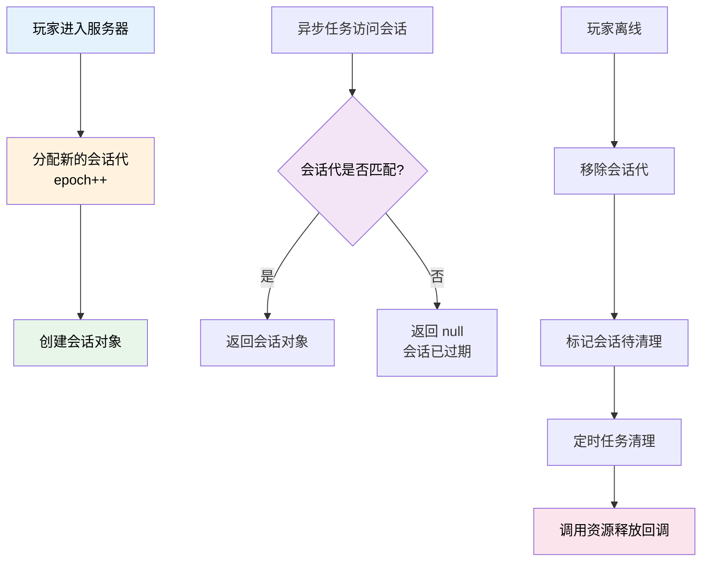

本次更新新增了 PlayerSessionMap 玩家会话管理容器，提供线程安全的玩家会话存储和自动清理机制，简化了玩家数据管理的复杂度。

<!-- truncate -->

## 涉及的相关提交

### 主要功能更新

- [**bfeb2d1a**](https://github.com/TabooLib/taboolib/commit/bfeb2d1acc100d37238f30757d97ff103afcc966)

  `新增 PlayerSessionMap 容器`

  由 @黑 提交 - 新增线程安全的玩家会话管理容器，支持自动生命周期管理

- [**b2803503**](https://github.com/TabooLib/taboolib/commit/b28035033130fa1d5e648a66940331f691a7a71d)

  `feat(PlayerSessionMap): 添加会话移除回调以支持资源释放`

  由 @黑 提交 - 为会话对象添加移除回调机制，方便释放资源

- [**468431ae**](https://github.com/TabooLib/taboolib/commit/468431ae36476fec6a29507694c64dbbb08e04b7)

  `feat(PlayerSessionMap): 调整事件优先级`

  由 @黑 提交 - 优化事件监听优先级，确保会话生命周期管理的正确性

- [**00117ad1**](https://github.com/TabooLib/taboolib/commit/00117ad1e1ee55a3c7e59341fe05fe593372dfb5)

  `feat(PlayerSessionMap): 添加会话对象的写入、检查和遍历功能`

  由 @黑 提交 - 增强会话容器的操作能力，支持主动写入、检查和遍历

- [**1c0dbc5c**](https://github.com/TabooLib/taboolib/commit/1c0dbc5cb59737585201a00340e2c572311173fb)

  `feat(PlayerSessionMap): 添加手动释放模式和不安全获取方法`

  由 @黑 提交 - 支持手动控制会话释放时机，增加不安全获取方法用于特殊场景

### 基础设施改进

- [**8acd4319**](https://github.com/TabooLib/taboolib/commit/8acd4319d244714b98d145b074e9e77b69dc3ee0)

  `fix(build.gradle.kts): 修改 Maven 仓库地址为 HTTP`

  由 @黑 提交 - 调整构建配置中的 Maven 仓库地址

## 一句话简述更新

**新增 PlayerSessionMap 容器，提供线程安全、自动生命周期管理的玩家会话存储方案，彻底解决异步场景下的玩家数据管理难题。**

## 本次更新的重点

### 1. PlayerSessionMap 玩家会话管理容器

#### 背景问题

在开发插件时，经常需要为每个玩家维护一些会话数据（如临时状态、缓存数据等）。传统的实现方式存在诸多问题：

1. **线程安全问题**：使用普通的 `HashMap` 存储玩家数据时，在异步场景下容易出现并发问题
2. **内存泄漏风险**：玩家离线后如果忘记清理数据，会导致内存泄漏
3. **异步竞态问题**：玩家快速重连时，异步任务可能会在玩家离线后仍然创建或访问旧会话
4. **资源释放困难**：会话对象持有的资源（如数据库连接、文件句柄）难以在合适的时机释放

#### 解决方案

PlayerSessionMap 是一个专为 Bukkit 插件设计的玩家会话管理容器，通过会话代（epoch）机制和自动生命周期管理，彻底解决了上述问题。

#### 工作原理



**核心特性：**

1. **会话代机制**：每个玩家进入服务器时分配一个递增的会话代，离线时移除。任何与当前代不一致的会话都被视为过期
2. **自动生命周期管理**：玩家离线时自动清理所有相关会话，无需手动维护
3. **线程安全**：基于 `ConcurrentHashMap` 实现，支持并发访问
4. **延迟清理策略**：采用标记 + 定时清扫的方式批量移除过期会话，减少哈希表抖动
5. **资源释放回调**：会话对象可实现 `PlayerSessionClosable` 接口，在移除时自动释放资源

#### 使用示例

**基础用法：**

```kotlin
import taboolib.platform.util.PlayerSessionMap

// 定义玩家会话数据类
data class PlayerData(
    val loginTime: Long,
    var money: Double,
    var level: Int
)

// 创建会话容器
val playerSessions = PlayerSessionMap<PlayerData> {
    // 默认工厂函数：玩家首次访问时自动创建
    PlayerData(
        loginTime = System.currentTimeMillis(),
        money = 0.0,
        level = 1
    )
}

// 获取或创建玩家会话
@EventHandler
fun onPlayerJoin(event: PlayerJoinEvent) {
    val player = event.player

    // 使用默认工厂
    val data = playerSessions.getOrCreate(player)
    player.sendMessage("欢迎回来！你的等级：${data?.level}")
}

// 访问玩家会话
fun getPlayerMoney(player: Player): Double {
    return playerSessions[player]?.money ?: 0.0
}

// 修改会话数据
fun addMoney(player: Player, amount: Double) {
    playerSessions[player]?.let { data ->
        data.money += amount
    }
}
```

**自定义工厂函数：**

```kotlin
// 使用自定义工厂函数加载玩家数据
submit(async = true) {
    val data = playerSessions.getOrCreate(player) {
        // 从数据库加载玩家数据
        database.loadPlayerData(player.uniqueId) ?: PlayerData(
            loginTime = System.currentTimeMillis(),
            money = 0.0,
            level = 1
        )
    }

    // 回到主线程使用数据
    submit(async = false) {
        player.sendMessage("数据加载完成！金币：${data?.money}")
    }
}
```

**资源释放回调：**

```kotlin
// 实现 PlayerSessionClosable 接口
data class PlayerCache(
    val database: Connection,
    val fileHandle: File
) : PlayerSessionClosable {

    override fun onSessionRemove(uuid: UUID) {
        // 玩家离线时自动调用，释放资源
        try {
            database.close()
            fileHandle.delete()
        } catch (e: Exception) {
            warning("资源释放失败: ${e.message}")
        }
    }
}

// 使用带资源的会话
val caches = PlayerSessionMap<PlayerCache> { uuid ->
    PlayerCache(
        database = createConnection(),
        fileHandle = File("cache_$uuid.dat")
    )
}
```

**主动写入会话：**

```kotlin
// 直接设置会话数据（不使用工厂）
val customData = PlayerData(
    loginTime = System.currentTimeMillis(),
    money = 1000.0,
    level = 10
)

// 写入会话，返回旧值
val oldData = playerSessions[player] = customData
```

**检查和遍历：**

```kotlin
// 检查玩家是否有会话
if (player in playerSessions) {
    println("玩家 ${player.name} 有会话数据")
}

// 遍历所有有效会话
playerSessions.forEach { uuid, data ->
    println("玩家 $uuid 的等级：${data.level}")
}

// 获取会话数量
val count = playerSessions.size()
println("当前在线玩家会话数：$count")

// 使用序列操作
val richPlayers = playerSessions.entries()
    .filter { (_, data) -> data.money > 10000 }
    .map { (uuid, data) -> uuid to data.money }
    .toList()
```

**手动释放模式：**

```kotlin
// 创建容器时启用手动释放模式
val manualSessions = PlayerSessionMap<PlayerData>(
    defaultFactory = { uuid -> loadFromDatabase(uuid) },
    manualRelease = true  // 玩家离线时不自动清理
)

// 需要手动调用 remove 释放会话
fun saveAndRelease(player: Player) {
    val data = manualSessions.remove(player)
    data?.let {
        saveToDatabase(player.uniqueId, it)
    }
}
```

**不安全获取（用于调试）：**

```kotlin
// 不检查会话是否过期，直接获取原始数据
val rawData = playerSessions.unsafeGet(player)

// 注意：此方法可能返回已过期的会话，仅用于调试或特殊场景
```

#### 技术实现

**核心数据结构：**

```kotlin
class PlayerSessionMap<V : Any>(
    private val defaultFactory: ((UUID) -> V)? = null,
    private val manualRelease: Boolean = false,
) {
    // 使用 ConcurrentHashMap 存储会话
    private val store = ConcurrentHashMap<UUID, SessionEntry<V>>()

    // 会话条目，包含会话代和值
    private class SessionEntry<V>(
        val epoch: Long,         // 会话代
        val value: V,            // 会话值
        var pendingRemoval: Boolean = false  // 待清理标记
    )
}
```

**会话代管理：**

```kotlin
object PlayerSessionLifecycle {
    // 会话代计数器
    val epochCounter = AtomicLong(0)

    // UUID -> 会话代 映射
    val epochs = ConcurrentHashMap<UUID, Long>()

    // 玩家进入时分配新会话代
    @SubscribeEvent(EventPriority.LOWEST)
    fun onJoin(event: PlayerJoinEvent) {
        val uuid = event.player.uniqueId
        val epoch = epochCounter.incrementAndGet()
        epochs[uuid] = epoch
    }

    // 玩家离线时清理会话代
    @SubscribeEvent(EventPriority.MONITOR)
    fun onQuit(event: PlayerQuitEvent) {
        val uuid = event.player.uniqueId
        val epoch = epochs.remove(uuid) ?: return
        // 通知所有容器清理该玩家的会话
        maps.forEach { it.invalidate(uuid, epoch) }
    }
}
```

**延迟清理策略：**

```kotlin
// 定时清理任务（每秒执行一次）
@Schedule(period = 20, async = true)
fun sweepPending() {
    maps.forEach { it.cleanupPending() }
}

// 清理已标记的过期会话
fun cleanupPending() {
    store.entries.removeIf { (uuid, entry) ->
        // 检查是否待清理或会话代不匹配
        if (entry.pendingRemoval || isExpired(uuid, entry.epoch)) {
            entry.invokeRemovalCallback(uuid)
            true
        } else {
            false
        }
    }
}
```

#### 性能优化

1. **有界重试机制**：创建会话时最多重试 4 次，避免会话代频繁变化导致无限循环
2. **延迟清理**：采用标记 + 批量清理的策略，减少 `HashMap` 结构修改频率
3. **惰性初始化**：只在至少存在一个容器时才启用生命周期管理
4. **轻量让步**：重试时使用 `LockSupport.parkNanos(1ms)` 避免 CPU 忙等

#### 适用场景

- ✅ 玩家临时状态存储（如战斗状态、商店界面数据）
- ✅ 玩家数据缓存（从数据库加载后缓存在内存）
- ✅ 玩家会话资源管理（如数据库连接、文件句柄）
- ✅ 异步任务中的玩家数据访问
- ✅ 需要自动生命周期管理的任何玩家相关数据

#### 最佳实践

**推荐做法：**

```kotlin
// ✅ 使用工厂函数延迟创建
val sessions = PlayerSessionMap<PlayerData> { uuid ->
    loadFromDatabase(uuid)
}

// ✅ 在异步环境中安全访问
submit(async = true) {
    val data = sessions[player]  // 线程安全，会话代自动校验
    data?.let {
        // 处理数据
    }
}

// ✅ 实现资源释放回调
class ResourceHolder : PlayerSessionClosable {
    override fun onSessionRemove(uuid: UUID) {
        // 释放资源
    }
}

// ✅ 检查会话存在性后再操作
if (player in sessions) {
    val data = sessions[player]
    // 使用数据
}
```

**避免的做法：**

```kotlin
// ❌ 不要在离线后访问会话
@EventHandler
fun onQuit(event: PlayerQuitEvent) {
    submit(async = true, delay = 100) {
        // 玩家已离线，会话已被清理
        val data = sessions[event.player]  // 返回 null
    }
}

// ❌ 不要假设会话一定存在
val data = sessions[player]!!  // 可能抛出 NPE

// ✅ 应该使用安全调用
val data = sessions[player] ?: return
```

### 2. SyncExecutor 改进

将 `sync()` 和 `runSync()` 函数中的 `future.get()` 改为 `future.join()`，避免抛出受检异常。

#### 变更对比

```kotlin
// 旧版
fun <T> sync(func: () -> T): T {
    val future = CompletableFuture<T>()
    submit { future.complete(func()) }
    return future.get()  // 抛出 ExecutionException, InterruptedException
}

// 新版
fun <T> sync(func: () -> T): T {
    val future = CompletableFuture<T>()
    submit { future.complete(func()) }
    return future.join()  // 只抛出 CompletionException（运行时异常）
}
```

#### 影响

- **向后兼容**：对大多数使用场景无影响
- **异常处理**：不再需要捕获受检异常，代码更简洁
- **错误传播**：内部异常会被包装为 `CompletionException` 抛出

## 迁移指南

本次更新为新增功能，不涉及破坏性变更。如果你之前使用 `HashMap` 或 `ConcurrentHashMap` 存储玩家数据，可以考虑迁移到 `PlayerSessionMap`：

### 从 HashMap 迁移

#### 旧版实现

```kotlin
// 旧版：手动管理玩家数据
val playerData = HashMap<UUID, PlayerData>()

@EventHandler
fun onJoin(event: PlayerJoinEvent) {
    playerData[event.player.uniqueId] = PlayerData()
}

@EventHandler
fun onQuit(event: PlayerQuitEvent) {
    // 需要手动清理
    playerData.remove(event.player.uniqueId)
}

// 异步访问不安全
submit(async = true) {
    val data = playerData[player.uniqueId]  // 可能并发问题
}
```

#### 新版实现

```kotlin
// 新版：自动管理生命周期
val playerSessions = PlayerSessionMap<PlayerData> {
    PlayerData()
}

@EventHandler
fun onJoin(event: PlayerJoinEvent) {
    // 自动创建，无需手动添加
    val data = playerSessions.getOrCreate(event.player)
}

// 无需监听退出事件，自动清理

// 异步访问安全
submit(async = true) {
    val data = playerSessions[player]  // 线程安全，自动过期检查
}
```

## 文档更新

本次更新新增了以下文档：

- **PlayerSessionMap 使用文档**：完整的使用指南和最佳实践

## 致谢

感谢以下贡献者为本次更新做出的贡献：

- @黑 - PlayerSessionMap 容器实现

---

如有问题或建议，欢迎在 [GitHub Issues](https://github.com/TabooLib/taboolib/issues) 反馈。
