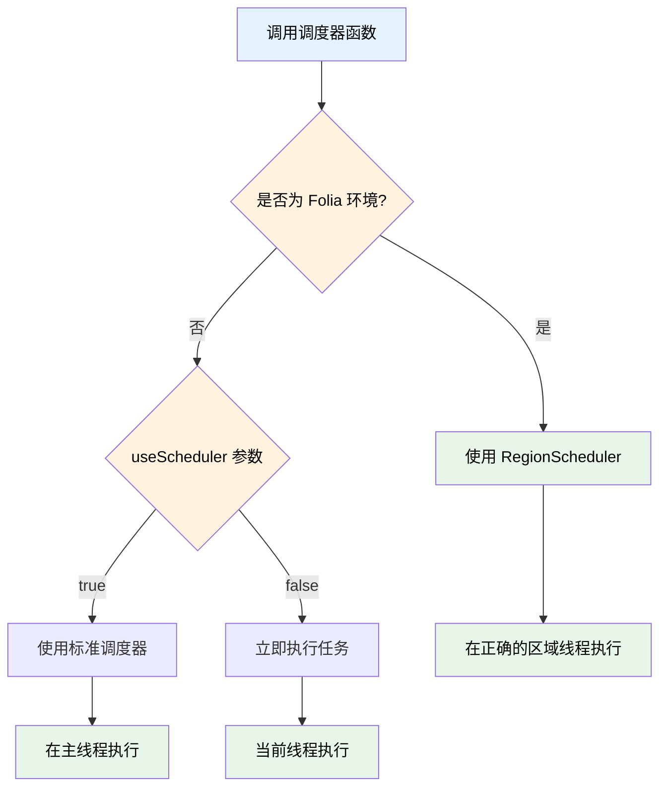

本次更新带来了 Folia 区域调度器的完整支持、混合服务端（CatServer）的兼容性改进，以及多项实用功能增强。

<!-- truncate -->

## 涉及的相关提交

### 主要功能更新

- [**3b3cd67d**](https://github.com/TabooLib/taboolib/commit/3b3cd67d97f10481c55a580444a8d09e2f9c4ebf)

  `feat(FoliaExecutor): 新增 Folia 区域调度器相关函数`

  由 @lynn 提交 - 为 Location、Entity、Block、Chunk 和 World 提供 Folia 安全的调度器扩展函数

- [**bafb19b7**](https://github.com/TabooLib/taboolib/commit/bafb19b736d1ebe9195fce140c9b091a35f81e96) / [**a1abd597**](https://github.com/TabooLib/taboolib/commit/a1abd59728f5f150c2d99253388ecaa980cbfac1)

  `feat(nms): 添加对混合服务端的支持并优化发包逻辑`

  由 @嘿鹰 提交 - 新增 CatServer 检测与兼容，使用原生反射避免类加载冲突

- [**92d33458**](https://github.com/TabooLib/taboolib/commit/92d334588d70dbab42cf64696c3481783339e012)

  `feat(ContainerOperator): 更新数据方法支持选择是否使用主键定位`

  由 @黑 提交 - 为 update 和 updateByKey 方法新增 usePrimaryKey 参数

- [**23aee297**](https://github.com/TabooLib/taboolib/commit/23aee29700a67c360551a92d276b1133a39b11d3)

  `Add replacePlaceholder methods for String and List`

  由 @枫溪 提交 - 新增不传入玩家参数的 replacePlaceholder 扩展函数

### 基础设施改进

- [**92d33458**](https://github.com/TabooLib/taboolib/commit/92d334588d70dbab42cf64696c3481783339e012)

  `feat(ContainerOperator): 更新数据方法支持选择是否使用主键定位`

  由 @黑 提交 - 优化日志输出函数（info、severe、warning）的容错处理

## 一句话简述更新

**让 TabooLib 在 Folia 多线程环境下更易用，同时增强对混合服务端的兼容性**

## 本次更新的重点

### 1. Folia 区域调度器 - 线程安全的位置相关任务调度

#### 背景问题

Folia 是 Paper 的多线程分支，采用区域化线程模型。在 Folia 环境下，传统的调度器无法安全地操作特定位置的游戏对象（如实体、方块等），必须使用 RegionScheduler 在正确的区域线程中执行任务。

之前开发者需要手动检测 Folia 环境并编写大量分支代码，代码复杂且容易出错。

#### 解决方案

新增 `FoliaExecutor.kt` 文件，为常见的游戏对象提供统一的调度器扩展函数。这些函数会自动检测运行环境：

- 在 Folia 环境下使用 RegionScheduler
- 在普通环境下使用标准调度器
- 支持立即执行模式（useScheduler = false）

#### 工作原理



#### 支持的对象类型

本次更新为以下对象添加了 `runTask` 和 `submit` 扩展函数：

- **Location**：在指定位置执行任务
- **Entity**：在实体所在位置执行任务
- **Block**：在方块所在位置执行任务
- **Chunk**：在区块中心位置执行任务
- **World**：在指定世界坐标执行任务

#### 使用示例

**在实体位置执行任务：**

```kotlin title="EntityTask.kt" showLineNumbers
import taboolib.platform.util.runTask
import taboolib.platform.util.submit

// 立即在实体位置执行任务（Folia 安全）
entity.runTask(Runnable {
    entity.teleport(targetLocation)
})

// 延迟 20 tick 后执行
entity.submit(delay = 20) {
    entity.remove()
}

// 每 20 tick 重复执行
entity.submit(period = 20) {
    entity.world.spawnParticle(Particle.FLAME, entity.location, 10)
}
```

**在方块位置执行任务：**

```kotlin title="BlockTask.kt" showLineNumbers
import taboolib.platform.util.submit

// 在方块位置执行任务
block.submit(now = false, delay = 10) {
    block.type = Material.AIR
}
```

**在世界坐标执行任务：**

```kotlin title="WorldTask.kt" showLineNumbers
import taboolib.platform.util.runTask

// 在指定世界坐标执行任务
world.runTask(x = 100.0, z = 200.0, executor = Runnable {
    world.createExplosion(100.0, 64.0, 200.0, 4.0f)
})
```

**代码说明：**
- `runTask`：执行一次性任务，返回 PlatformTask
- `submit`：支持延迟和周期执行，参数与 TabooLib 标准调度器一致
- `useScheduler`：在非 Folia 环境下控制是否使用调度器（默认 true）
- `async`：是否异步执行（异步任务不受 Folia 区域限制）

:::tip[最佳实践]
在操作游戏世界中的对象时，优先使用这些扩展函数而不是全局 `submit`。这样可以确保你的插件在 Folia 和传统服务端都能正常工作。
:::

:::info[兼容性]
这些扩展函数在非 Folia 环境下会自动降级为标准调度器，无需担心兼容性问题。
:::

### 2. 混合服务端支持 - CatServer 兼容性改进

#### 背景问题

CatServer 等混合服务端使用自己的重混淆系统，在运行时动态转换类名和方法名。TabooLib 的 Reflex API 在获取方法或字段时会尝试加载类型信息，这会触发 `Class.forName()` 加载混淆的类名，导致 CatServer 的 remapper 抛出 `ClassNotFoundException`。

#### 解决方案

在 NMS 模块中实现了两级兼容策略：

1. **服务端检测**：新增 `MinecraftVersion.isCatServer` 属性，通过检测特征类来识别混合服务端
2. **回退方案**：在混合服务端环境下使用原生 Java 反射，避免触发类型加载

#### 技术实现

**服务端检测（MinecraftVersion.kt:69-77）：**

```kotlin title="MinecraftVersion.kt" showLineNumbers
/**
 * 是否为 CatServer
 * 这些服务端使用自己的重混淆系统，可能与 TabooLib 的 NMS 重映射不兼容
 */
val isCatServer by unsafeLazy {
    try {
        // 检测 CatServer
        Class.forName("catserver.server.CatServer")
        return@unsafeLazy true
    } catch (_: ClassNotFoundException) {
    }
    false
}
```

**发包方法兼容（PacketSender.kt:111-152）：**

在混合服务端下，`getSendPacketMethodHybrid` 方法使用原生反射查找 sendPacket 方法：

1. 优先查找接受 Packet 基类或接口的方法（更通用）
2. 支持多种方法名：`send`、`sendPacket`、`a`（混淆名）
3. 如果找不到通用方法，尝试精确匹配具体数据包类型
4. 提供详细的异常信息便于调试

**连接获取兼容（PacketSender.kt:185-241）：**

`getConnectionHybrid` 方法避免使用 Reflex 的 `getProperty`，改用原生反射：

1. 先尝试常见的字段名：`connection`、`playerConnection`、`b`、`c`
2. 如果找不到，遍历所有字段查找包含 "Connection" 的类型
3. 缓存成功找到的连接对象

#### 兼容性对比

| 方法 | 标准服务端 | 混合服务端 |
|------|-----------|-----------|
| 获取连接 | Reflex getProperty | 原生反射 + 多重查找 |
| 查找方法 | ReflexClass.getMethod | 原生反射 + 类型判断 |
| 类型加载 | 自动加载 | 避免触发 Class.forName |

:::warning[注意事项]
虽然本次更新改进了混合服务端的兼容性，但混合服务端的运行环境复杂多变，如遇到问题请在 GitHub Issues 反馈具体的错误信息。
:::

### 3. ContainerOperator 灵活的数据定位方式

#### 新增功能

为 `update` 和 `updateByKey` 方法新增 `usePrimaryKey` 参数，允许开发者选择是否使用 `@Id` 注解定位数据。

#### 使用场景

**场景一：仅使用自定义条件更新**

```kotlin title="UpdateWithoutId.kt" showLineNumbers
// 数据类
data class PlayerData(
    @Id val uuid: UUID,
    var name: String,
    var level: Int
)

// 更新时不使用 @Id，仅使用自定义条件
container.get<PlayerData>().update(
    data = PlayerData(uuid = someUuid, name = "NewName", level = 10),
    usePrimaryKey = false
) {
    "level" gt 5 // 仅更新等级大于 5 的记录
}
```

**场景二：使用 @Id 和 @Key 双重定位**

```kotlin title="UpdateByKey.kt" showLineNumbers
data class PlayerHome(
    @Id val username: UUID,
    @Key val serverName: String,
    var world: String,
    var x: Double,
    var y: Double,
    var z: Double
)

// 使用 @Id 和 @Key 定位（默认行为）
container.get<PlayerHome>().updateByKey(home)

// 仅使用 @Key 定位，忽略 @Id
container.get<PlayerHome>().updateByKey(home, usePrimaryKey = false)
```

**代码说明：**
- `usePrimaryKey = true`（默认）：使用 `@Id` 字段作为查询条件
- `usePrimaryKey = false`：不使用 `@Id` 字段，完全依赖自定义 filter 或 `@Key` 字段

:::tip[最佳实践]
如果你的数据表有复合主键或需要基于业务条件更新数据，可以将 `usePrimaryKey` 设为 false，使用自定义 filter 实现精确控制。
:::

### 4. PlaceholderAPI 扩展 - 无玩家占位符替换

#### 新增功能

为 `String` 和 `List<String>` 添加了不需要传入玩家参数的 `replacePlaceholder()` 扩展函数。

#### 使用场景

适用于替换不依赖玩家数据的全局占位符，如服务器统计信息、在线人数等。

**使用示例：**

```kotlin title="PlaceholderUsage.kt" showLineNumbers
import taboolib.platform.compat.replacePlaceholder

// 替换单个字符串中的占位符
val message = "当前在线: %server_online%".replacePlaceholder()

// 替换列表中的占位符
val messages = listOf(
    "服务器 TPS: %server_tps%",
    "在线玩家: %server_online%"
).replacePlaceholder()
```

**代码说明：**
- 内部调用 `PlaceholderAPI.setPlaceholders(null, ...)`
- 如果 PlaceholderAPI 不存在，返回原始字符串（容错处理）

:::info[补充信息]
原有的 `replacePlaceholder(player)` 和 `replacePlaceholder(offlinePlayer)` 方法仍然保留，用于替换玩家相关的占位符。
:::

### 5. 日志输出优化 - 更好的容错处理

#### 改进内容

优化了 `info()`、`severe()` 和 `warning()` 函数的实现，当 PlatformIO 服务不可用时，自动降级为 PrimitiveIO 输出。

#### 技术细节

**修改前：**

```kotlin
fun info(vararg message: Any?) {
    PlatformFactory.getService<PlatformIO>().info(*message)
}
```

**修改后：**

```kotlin
fun info(vararg message: Any?) {
    val service = PlatformFactory.getServiceOrNull<PlatformIO>()
    if (service != null) {
        service.info(*message)
    } else {
        message.forEach { PrimitiveIO.println(it) }
    }
}
```

**代码说明：**
- 使用 `getServiceOrNull` 代替 `getService`，避免服务不可用时抛出异常
- 降级方案确保日志始终能够输出，提升插件在特殊环境下的稳定性

:::tip[最佳实践]
这个改进对开发者透明，无需修改任何代码。你的插件在各种环境下都能正常输出日志。
:::

## 迁移指南

### Folia 区域调度器

如果你的插件需要支持 Folia，建议将位置相关的调度器替换为新的扩展函数：

**迁移前：**

```kotlin
submit(now = false, async = false, delay = 20) {
    entity.remove()
}
```

**迁移后：**

```kotlin
entity.submit(delay = 20) {
    entity.remove()
}
```

### ContainerOperator 更新方法

如果你需要使用自定义条件而不依赖 `@Id` 定位数据：

**迁移前：**

```kotlin
// 之前无法实现，只能通过 @Id 定位
container.get<PlayerData>().update(data) {
    "level" gt 5
}
// 实际上会使用 @Id 和 filter 的组合条件
```

**迁移后：**

```kotlin
// 现在可以不使用 @Id，仅使用 filter
container.get<PlayerData>().update(data, usePrimaryKey = false) {
    "level" gt 5
}
```

## 文档更新

本次更新同步更新了以下文档：

- 即将新增：[Folia 区域调度器使用指南]
- 即将更新：[数据库 PTC-Object 文档] - 增加 usePrimaryKey 参数说明
- 即将更新：[PlaceholderAPI 集成文档] - 增加无玩家参数的用法

## 致谢

感谢以下贡献者为本次更新做出的贡献：

- @lynn - 实现了完整的 Folia 区域调度器扩展函数
- @嘿鹰 - 解决了混合服务端的 NMS 兼容性问题
- @黑 - 增强了 ContainerOperator 的灵活性和日志输出的稳定性
- @枫溪 - 扩展了 PlaceholderAPI 的使用场景

---

如有问题或建议，欢迎在 [GitHub Issues](https://github.com/TabooLib/taboolib/issues) 反馈。
