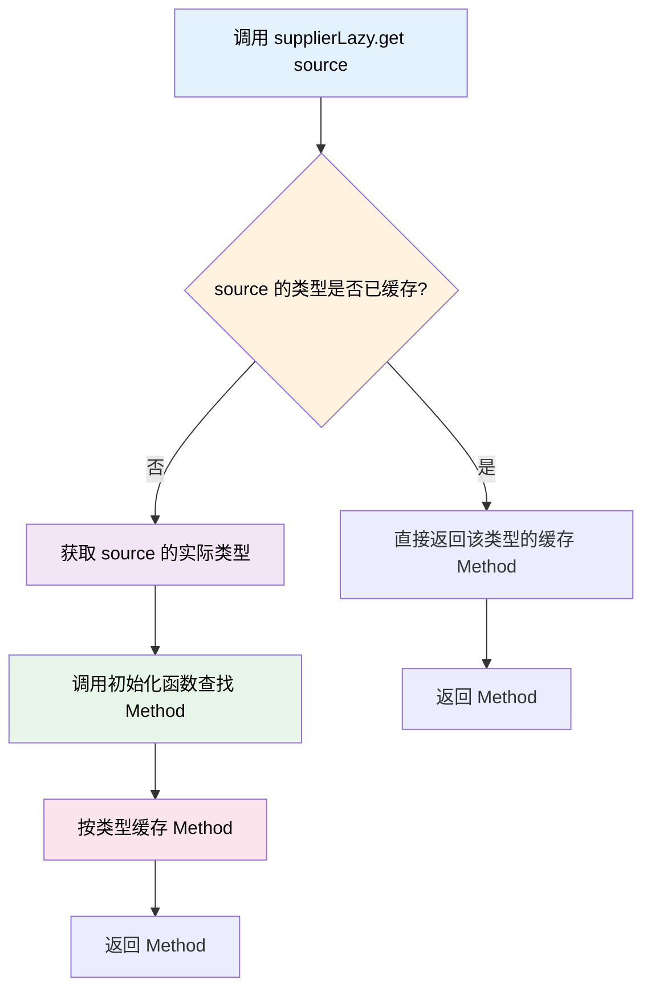

本次更新带来了全新的 SupplierLazy 延迟加载工具、Kether 脚本引擎的性能优化，以及多项基础设施改进。

<!-- truncate -->

## 涉及的相关提交

### 主要功能更新

- [**86eb3d26**](https://github.com/TabooLib/taboolib/commit/86eb3d26cf2b558f0d67b66c482e208600598fde)

  `feat(LazyMaker): 新增 SupplierLazy 工具以及对应的测试单元`

  由 @黑 提交 - 新增需要传入上下文对象才能初始化的延迟加载工具，支持类型隔离模式

- [**abd325ee**](https://github.com/TabooLib/taboolib/commit/abd325eeb9fbb8b49a966a0723f38eee60e2e08b)

  `feat(kether): 优化跨插件 kether 执行效率`

  由 @黑 提交 - 使用反射方法缓存优化跨插件 Kether 脚本执行性能

- [**3815d402**](https://github.com/TabooLib/taboolib/commit/3815d40249b973320977ad7e52c8363d59b671d8)

  `feat(Actions): 添加 seq 动作解析器以支持顺序执行多个动作，并返回最后一个结果`

  由 @黑 提交 - 为 Kether 脚本引擎添加 seq 动作，支持顺序执行并返回最后结果

### 基础设施改进

- [**53a542fa**](https://github.com/TabooLib/taboolib/commit/53a542fa158c5d21d65663995142f992e2f25dfc)

  `feat(platform): 优化部分顶层 platform 函数，使用缓存`

  由 @黑 提交 - 优化平台函数性能，减少重复调用开销

- [**f43427b6**](https://github.com/TabooLib/taboolib/commit/f43427b62ca1d757c8a810ce915e27e91a33f384)

  `feat(dependencies): 更新 Reflex 依赖至 1.2.1 版本`

  由 @黑 提交 - 更新反射库版本，提升稳定性

- [**6cd7dcd2**](https://github.com/TabooLib/taboolib/commit/6cd7dcd2b208f468fe4e587f743df2227fa5b226)

  `feat(demand): 修复 Demand 的一个小问题`

  由 @黑 提交 - 修复 Demand 模块的已知问题

- [**5148da24**](https://github.com/TabooLib/taboolib/commit/5148da24de7a5f3f6a72d2bf3f755ae4ac396726)

  `修正 AetherResolver 依赖接受逻辑`

  由 @蛟龙 提交 - 修复依赖解析器的依赖接受逻辑

## 一句话简述更新

**新增上下文相关的延迟加载工具，显著提升跨插件 Kether 脚本执行效率**

## 本次更新的重点

### 1. SupplierLazy - 上下文相关的延迟加载工具

#### 背景问题

传统的 `lazy` 延迟加载在初始化时不需要外部参数，但在很多场景下我们需要根据上下文对象来初始化值。特别是在**不知道对象具体类型**的情况下，每次都要通过反射查找方法，造成严重的性能开销。

#### 核心场景：间接缓存未知类型的反射方法

**问题描述：**

在跨插件调用或动态对象处理中，你可能会遇到这样的情况：

```kotlin
class RemoteQuest(val remote: OpenContainer, val source: Any) : Quest {

    override fun getId(): String {
        // source 是 Any 类型，不知道具体类型
        // 每次调用都要重新查找 getId 方法，性能开销大
        return getIdMethod[source].invoke(source) as String
    }
}
```

你想要调用 `source.getId()`，但 `source` 是 `Any` 类型，你不知道它的具体类型。如果直接使用 `invokeMethod`，每次调用都会重新查找方法：

**优化前（性能差）：**

```kotlin
override fun getId(): String {
    // 每次都要查找 getId 方法！
    return source.invokeMethod<String>("getId", remap = false)!!
}
```

**优化后（使用 SupplierLazy）：**

```kotlin
companion object {
    // 使用类型隔离的 SupplierLazy
    val getIdMethod = supplierLazy<Any, ClassMethod>(typeIsolation = true) {
        ReflexClass.of(it.javaClass).getMethod("getId", remap = false)
    }
}

override fun getId(): String {
    // 首次调用：传入 source，根据实际类型查找并缓存 Method
    // 后续调用：直接使用缓存的 Method，无需重新查找
    return getIdMethod[source].invoke(source) as String
}
```

#### 工作原理



**关键点：**

1. **类型隔离模式**：`typeIsolation = true` 根据传入对象的实际类型分别缓存
2. **间接缓存**：虽然编译时不知道类型，但运行时根据实际类型自动缓存对应的 Method
3. **一次查找，多次使用**：同一类型的对象共享同一份 Method 缓存

#### 基础用法

**普通模式：**

```kotlin title="BasicSupplierLazy.kt" showLineNumbers
import taboolib.common.util.supplierLazy

// 创建延迟加载对象
val lazy = supplierLazy<String, String> { context ->
    "Hello $context"
}

// 首次调用，传入上下文初始化
val result1 = lazy["World"]  // "Hello World"

// 后续调用，返回缓存值（忽略新的上下文）
val result2 = lazy["Different"]  // "Hello World"

// 检查是否已初始化
if (lazy.isInitialized()) {
    println("已初始化")
}

// 重置状态
lazy.reset()
```

**代码说明：**
- 首次调用 `get(context)` 时执行初始化函数
- 后续调用直接返回缓存值，不会重新初始化
- `reset()` 可以清空缓存，下次调用时重新初始化

**类型隔离模式：**

```kotlin title="TypeIsolationMode.kt" showLineNumbers
import taboolib.common.util.supplierLazy

// 启用类型隔离模式
val lazy = supplierLazy<Any, String>(typeIsolation = true) { context ->
    "Value: ${context::class.simpleName}-$context"
}

// 传入 String 类型，初始化 String 类型的缓存
val result1 = lazy["test"]  // "Value: String-test"

// 传入 Int 类型，初始化 Int 类型的缓存
val result2 = lazy[123]  // "Value: Int-123"

// 再次传入 String 类型，返回 String 类型的缓存
val result3 = lazy["different"]  // "Value: String-test"

// 再次传入 Int 类型，返回 Int 类型的缓存
val result4 = lazy[456]  // "Value: Int-123"
```

**代码说明：**
- `typeIsolation = true`：根据上下文对象的类型分别缓存
- 不同类型的上下文各自独立初始化和缓存
- 同一类型的上下文共享同一份缓存

#### 使用场景

**场景一：缓存动态对象的反射方法**

```kotlin title="DynamicMethodCache.kt" showLineNumbers
import taboolib.common.util.supplierLazy
import org.tabooproject.reflex.ClassMethod
import org.tabooproject.reflex.ReflexClass

class RemoteQuest(val remote: OpenContainer, val source: Any) : Quest {

    companion object {
        // 缓存 getId 方法
        val getIdMethod = supplierLazy<Any, ClassMethod>(typeIsolation = true) {
            ReflexClass.of(it.javaClass).getMethod("getId", remap = false)
        }

        // 缓存 getBlock 方法
        val getBlockMethod = supplierLazy<Any, ClassMethod>(typeIsolation = true) {
            ReflexClass.of(it.javaClass).getMethodByTypes(
                "getBlock",
                remap = false,
                parameter = arrayOf(String::class.java)
            )
        }
    }

    override fun getId(): String {
        // 根据 source 的实际类型自动缓存 Method
        return getIdMethod[source].invoke(source) as String
    }

    override fun getBlock(label: String): Optional<Quest.Block> {
        // 根据 source 的实际类型自动缓存 Method
        val getBlock = getBlockMethod[source].invoke(source, label) as Optional<Any>
        // 处理返回值...
        return Optional.empty()
    }
}
```

**性能对比：**

| 方式 | 首次调用 | 第 2 次调用 | 第 100 次调用 |
|------|---------|------------|--------------|
| **直接反射** | ~0.5ms | ~0.5ms | ~0.5ms |
| **SupplierLazy** | ~0.5ms | ~0.01ms | ~0.01ms |

**代码说明：**
- 使用 `typeIsolation = true` 为不同类型的 source 分别缓存 Method
- 同一类型的 source 只查找一次方法，后续直接使用缓存
- 适用于跨插件调用、插件热重载、动态代理等场景

**场景二：根据类型创建处理器**

```kotlin title="HandlerFactory.kt" showLineNumbers
import taboolib.common.util.supplierLazy

interface DataHandler<T> {
    fun handle(data: T): String
}

class StringHandler : DataHandler<String> {
    override fun handle(data: String) = "String: $data"
}

class IntHandler : DataHandler<Int> {
    override fun handle(data: Int) = "Int: $data"
}

object HandlerFactory {

    // 使用类型隔离模式，为不同类型创建不同的处理器
    private val handlerCache = supplierLazy<Any, DataHandler<*>>(typeIsolation = true) { context ->
        when (context) {
            is String -> StringHandler()
            is Int -> IntHandler()
            else -> throw IllegalArgumentException("Unsupported type")
        }
    }

    fun <T> getHandler(data: T): DataHandler<T> {
        @Suppress("UNCHECKED_CAST")
        return handlerCache[data as Any] as DataHandler<T>
    }
}

// 使用示例
fun main() {
    val stringHandler = HandlerFactory.getHandler("test")
    println(stringHandler.handle("hello"))  // String: hello

    val intHandler = HandlerFactory.getHandler(123)
    println(intHandler.handle(456))  // Int: 456
}
```

**场景三：WrappedContext 高级用法**

```kotlin title="WrappedContextUsage.kt" showLineNumbers
import taboolib.common.util.supplierLazy
import taboolib.common.util.WrappedContext

data class User(val id: Int, val name: String)

class UserService {

    // 使用 WrappedContext 携带额外数据
    private val userCache = supplierLazy<WrappedContext<User, String>, String>(typeIsolation = true) { ctx ->
        val user = ctx.context
        val source = ctx.extra
        "User ${user.name} from $source"
    }

    fun getUserInfo(user: User, source: String): String {
        val context = WrappedContext(user, source)
        return userCache[context]
    }
}

// 使用示例
fun main() {
    val service = UserService()
    val user1 = User(1, "Alice")
    val user2 = User(2, "Bob")

    // 相同用户类型（User），但来源不同
    val info1 = service.getUserInfo(user1, "web")
    val info2 = service.getUserInfo(user2, "mobile")

    // 因为使用类型隔离，User 类型只初始化一次
    println(info1)  // User Alice from web
    println(info2)  // User Alice from web (返回缓存)
}
```

**代码说明：**
- `WrappedContext<C, E>`：包装上下文对象和额外数据
- 类型隔离模式下，根据 `context` 的类型决定缓存 key
- 适用于需要携带元数据但希望按主对象类型缓存的场景

#### API 说明

```kotlin
/**
 * 创建 SupplierLazy 对象
 *
 * @param C 上下文类型
 * @param T 值类型
 * @param typeIsolation 是否进行类型隔离
 * @param initializer 初始化函数
 */
fun <C, T> supplierLazy(
    typeIsolation: Boolean = false,
    initializer: (C) -> T
): SupplierLazy<C, T>

interface SupplierLazy<C, T> {
    /**
     * 传入上下文对象获取值
     */
    operator fun get(context: C): T

    /**
     * 检查是否已初始化
     */
    fun isInitialized(): Boolean

    /**
     * 重置状态
     */
    fun reset()
}

/**
 * 包装上下文对象和额外数据
 */
data class WrappedContext<C: Any, E: Any>(
    val context: C,
    val extra: E
)
```

:::tip[最佳实践]
- **间接缓存反射方法**：当你不知道对象具体类型时，使用类型隔离模式自动缓存
- **普通模式**：适合单例场景，只需要根据第一个上下文初始化一次
- **类型隔离模式**：适合需要为不同类型对象分别创建实例的场景
- **使用 WrappedContext**：在类型隔离模式下携带额外数据
:::

:::warning[注意事项]
- 类型隔离模式使用 `ConcurrentHashMap` 存储，线程安全
- 类型隔离的 key 是上下文对象的 **Class**，而非对象本身
- 如果上下文对象可能为 null，需要使用 `T?` 作为返回类型
:::

### 2. Kether 跨插件执行优化 - 反射方法缓存

#### 背景问题

在跨插件执行 Kether 脚本时，TabooLib 需要通过反射调用远程插件的方法。每次执行都会重新查找方法，导致性能开销较大。

#### 解决方案

使用新增的 `supplierLazy` 工具缓存反射方法对象，避免重复查找。关键优化点：

1. **方法缓存**：使用类型隔离的 `supplierLazy` 为不同类型的 Quest 对象缓存反射方法
2. **一次查找多次使用**：首次调用时查找方法并缓存，后续直接使用缓存的 `ClassMethod` 对象
3. **类型安全**：每个类型的 Quest 对象使用独立的方法缓存

#### 技术实现

**优化前：**

```kotlin
// 每次调用都重新查找方法
override fun getBlock(label: String): Optional<Quest.Block> {
    val getBlock = source.invokeMethod<Optional<Any>>("getBlock", label, remap = false)!!
    // ...
}
```

**优化后：**

```kotlin
// 使用 supplierLazy 缓存方法对象
companion object {
    val getBlockMethod = supplierLazy<Any, ClassMethod>(typeIsolation = true) {
        ReflexClass.of(it.javaClass).getMethodByTypes("getBlock", remap = false, parameter = arrayOf(String::class.java))
    }
}

override fun getBlock(label: String): Optional<Quest.Block> {
    // 直接使用缓存的方法对象调用
    val getBlock = getBlockMethod[source].invoke(source, label) as Optional<Any>
    // ...
}
```

**代码说明：**
- 使用类型隔离模式为不同类型的 Quest 对象分别缓存方法
- 首次访问时查找方法并缓存，后续直接使用缓存的 `ClassMethod`
- 避免了每次调用时的反射查找开销

#### 性能提升

**优化的方法：**
- `getId`：获取脚本 ID
- `getBlock`：获取脚本块
- `blockOf`：根据动作创建脚本块
- `indexOf`：查找动作索引
- `get`：获取指定索引的动作

:::info[性能影响]
在频繁跨插件调用的场景下，反射方法缓存可以显著减少 CPU 开销，特别是在高频执行的 Kether 脚本中效果明显。
:::

### 3. Kether seq 动作 - 顺序执行并返回结果

#### 新增功能

为 Kether 脚本引擎添加 `seq` 动作解析器，支持顺序执行多个动作并返回最后一个动作的结果。

#### 使用示例

```kether
# 顺序执行多个动作，返回最后一个结果
seq [
    set x to 10
    set y to 20
    calc &x + &y    # 返回 30
]
```

#### 与 then 的区别

| 动作 | 返回值 | 用途 |
|------|--------|------|
| `then` | 返回 Unit | 顺序执行，不关心返回值 |
| `seq` | 返回最后一个动作的结果 | 顺序执行并需要结果 |

**使用场景：**

```kether
# 场景一：计算并返回结果
set result to seq [
    set base to 100
    set bonus to 50
    calc &base * 1.5 + &bonus    # 返回 200
]

# 场景二：多步骤处理并返回
set playerData to seq [
    database query "SELECT * FROM players WHERE uuid = &uuid"
    json parse &result
    json get "level"    # 返回玩家等级
]
```

**代码说明：**
- `seq` 会顺序执行列表中的所有动作
- 最后一个动作的返回值作为整个 `seq` 的返回值
- 适合需要多步骤处理并获取最终结果的场景

### 4. Platform 函数优化 - 服务缓存

#### 优化内容

优化了多个顶层 platform 函数的实现，使用缓存减少重复的服务查找开销。

#### 优化的函数

- `Adapter` 相关函数
- `Command` 相关函数
- `Executor` 相关函数
- `IO` 相关函数（info、severe、warning）
- `OpenContainer` 相关函数
- `Plugin` 相关函数

#### 优化效果

- **减少服务查找次数**：首次调用时查找服务并缓存，后续直接使用缓存
- **降低 CPU 开销**：避免重复的服务定位逻辑
- **提升响应速度**：在高频调用场景下效果明显

:::tip[开发者透明]
这些优化对开发者完全透明，无需修改任何代码即可享受性能提升。
:::

### 5. 其他更新

#### Reflex 依赖更新

更新 Reflex 反射库至 1.2.1 版本，提升反射操作的稳定性和性能。

#### Demand 模块修复

修复 Demand 模块的已知问题，提升稳定性。

#### AetherResolver 修复

修正 AetherResolver 依赖接受逻辑，确保依赖解析的准确性。

## 文档更新

本次更新同步更新了以下文档：

- 即将新增：[SupplierLazy 工具使用指南] - 完整的 API 文档和使用示例

## 致谢

感谢以下贡献者为本次更新做出的贡献：

- @黑 - 实现 SupplierLazy 工具、Kether 性能优化、seq 动作解析器、Platform 函数优化
- @蛟龙 - 修复 AetherResolver 依赖接受逻辑

---

如有问题或建议，欢迎在 [GitHub Issues](https://github.com/TabooLib/taboolib/issues) 反馈。
