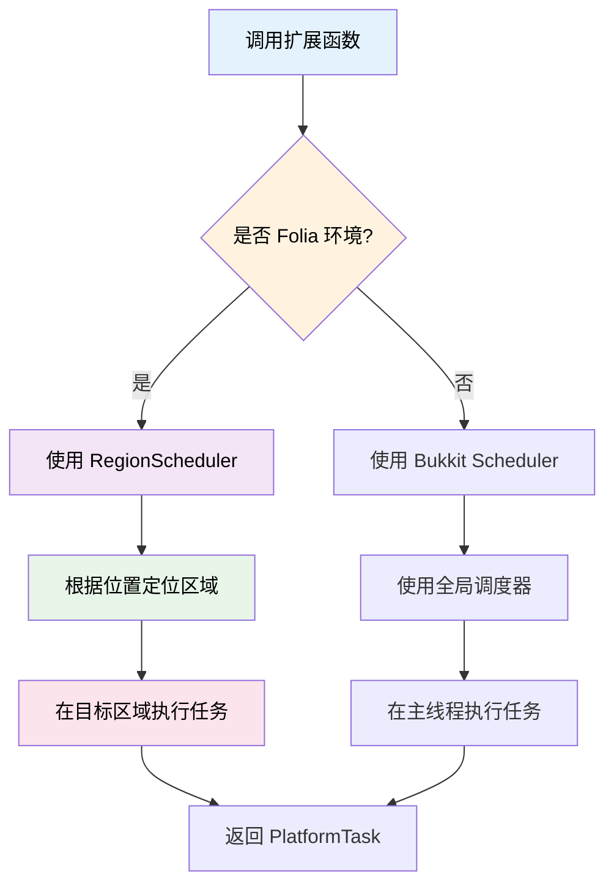
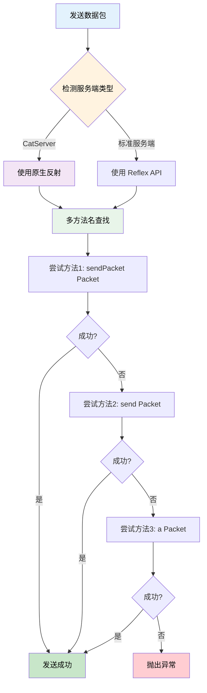

本次更新为 Folia 服务端带来了完整的区域调度器支持，改进了 NMS 在混合服务端上的兼容性，并新增了实用的 PlaceholderAPI 扩展方法。

<!-- truncate -->

## 涉及的相关提交

### 主要功能更新

- [**3b3cd67d**](https://github.com/TabooLib/taboolib/commit/3b3cd67d97f10481c55a580444a8d09e2f9c4ebf)

  `feat(FoliaExecutor): 新增 Folia 区域调度器相关函数`

  由 @lynn 提交 - 为 Location、Entity、Block、Chunk、World 对象提供 Folia 安全的调度器扩展函数

- [**bafb19b7**](https://github.com/TabooLib/taboolib/commit/bafb19b736d1ebe9195fce140c9b091a35f81e96)

  `feat(nms): 添加对混合服务端的支持并优化发包逻辑`

  由 @嘿鹰 提交 - 新增 CatServer 等混合服务端检测，重构 PacketSender 以兼容混合服务端的类加载机制

- [**23aee297**](https://github.com/TabooLib/taboolib/commit/23aee29700a67c360551a92d276b1133a39b11d3)

  `Add replacePlaceholder methods for String and List`

  由 @枫溪 提交 - 为 PlaceholderAPI 添加字符串和列表的占位符替换方法

### 功能改进

- [**92d33458**](https://github.com/TabooLib/taboolib/commit/92d334588d70dbab42cf64696c3481783339e012)

  `feat(ContainerOperator): 更新数据方法支持选择是否使用主键定位`

  由 @黑 提交 - 为数据容器更新方法添加灵活的主键控制选项

## 一句话简述更新

**完善 Folia 区域调度器支持，提升 TabooLib 在混合服务端上的兼容性和稳定性**

## 本次更新的重点

### 1. FoliaExecutor - Folia 区域调度器扩展

#### 背景问题

Folia 服务端采用区域化多线程模型，传统的全局调度器 `Bukkit.getScheduler()` 在 Folia 上不再适用。开发者需要使用 `RegionScheduler` 在特定区域执行任务，但直接使用 Folia API 会导致代码在非 Folia 环境下无法运行。

#### 解决方案

TabooLib 提供了一套统一的 API，自动检测运行环境：
- **Folia 环境**：自动使用 `RegionScheduler` 在正确的区域执行任务
- **非 Folia 环境**：使用传统的 Bukkit 调度器

#### 工作原理



#### 支持的对象类型

新增的扩展函数支持以下 Bukkit 对象：

**1. Location - 位置对象**

```kotlin title="LocationScheduler.kt" showLineNumbers
import taboolib.platform.util.runTask
import taboolib.platform.util.submit

// 在指定位置执行一个任务
location.runTask(Runnable {
    // 任务内容
    player.sendMessage("在位置 ${location} 执行")
})

// 在指定位置注册延迟任务
location.submit(delay = 20L) {
    // 延迟 1 秒后执行
    world.spawnParticle(Particle.FLAME, location, 10)
}

// 在指定位置注册重复任务
location.submit(delay = 0L, period = 20L) {
    // 每秒执行一次
    world.playSound(location, Sound.BLOCK_NOTE_BLOCK_PLING, 1f, 1f)
}
```

**2. Entity - 实体对象**

```kotlin title="EntityScheduler.kt" showLineNumbers
import taboolib.platform.util.runTask
import taboolib.platform.util.submit

// 在实体所在位置执行任务
entity.runTask(Runnable {
    entity.velocity = entity.velocity.add(Vector(0, 0.5, 0))
})

// 为实体注册定时任务
entity.submit(period = 10L) {
    // 每 0.5 秒检查一次
    if (entity.isOnGround) {
        entity.remove()
        cancel()  // 取消任务
    }
}
```

**3. Block - 方块对象**

```kotlin title="BlockScheduler.kt" showLineNumbers
import taboolib.platform.util.runTask

// 在方块所在位置执行任务
block.runTask(Runnable {
    block.type = Material.DIAMOND_BLOCK
})

// 延迟修改方块
block.submit(delay = 60L) {
    block.type = Material.AIR
}
```

**4. Chunk - 区块对象**

```kotlin title="ChunkScheduler.kt" showLineNumbers
import taboolib.platform.util.submit

// 在区块中心位置执行任务
chunk.submit {
    chunk.entities.forEach { entity ->
        entity.remove()
    }
}
```

**5. World - 世界对象（坐标）**

```kotlin title="WorldScheduler.kt" showLineNumbers
import taboolib.platform.util.runTask

// 在世界的指定坐标执行任务
world.runTask(x = 100.0, z = 200.0, Runnable {
    world.createExplosion(100.0, 64.0, 200.0, 4f)
})
```

**代码说明：**
- 所有方法都会自动检测 Folia 环境
- 在 Folia 上使用 `RegionScheduler`，在非 Folia 上使用 `BukkitScheduler`
- `runTask()` 用于单次任务执行
- `submit()` 支持延迟和重复任务
- 返回的 `PlatformTask` 可用于取消任务

#### 参数说明

```kotlin
fun Location.submit(
    now: Boolean = false,          // 是否立即执行
    async: Boolean = false,         // 是否异步执行（使用全局调度器）
    delay: Long = 0,                // 延迟时间（tick）
    period: Long = 0,               // 重复周期（tick），0 表示单次执行
    useScheduler: Boolean = true,   // 非 Folia 环境是否使用调度器
    executor: PlatformTask.() -> Unit
): PlatformTask
```

**关键点：**
- `async = true`：强制使用全局调度器（在 Folia 上使用 GlobalScheduler）
- `useScheduler = false`：在非 Folia 环境下直接同步执行，不使用调度器
- `period > 0`：创建重复任务，每隔 period tick 执行一次

#### 实际应用场景

**场景 1：区域性粒子效果**

```kotlin title="ParticleEffect.kt" showLineNumbers
import taboolib.platform.util.submit

fun showParticleCircle(center: Location, radius: Double) {
    center.submit(period = 5L) {
        // 每 0.25 秒显示一圈粒子
        val world = center.world ?: return@submit

        for (i in 0..360 step 10) {
            val radian = Math.toRadians(i.toDouble())
            val x = center.x + radius * cos(radian)
            val z = center.z + radius * sin(radian)

            world.spawnParticle(
                Particle.FLAME,
                x, center.y, z,
                1, 0.0, 0.0, 0.0, 0.0
            )
        }
    }
}
```

**场景 2：跨区域实体追踪**

```kotlin title="EntityTracker.kt" showLineNumbers
import taboolib.platform.util.submit

fun trackEntity(entity: Entity) {
    // 任务会随着实体移动自动在正确的区域执行
    entity.submit(period = 20L) {
        val target = entity.location.getNearbyEntities(10.0, 10.0, 10.0)
            .filterIsInstance<Player>()
            .firstOrNull()

        if (target != null) {
            // 追踪玩家
            val direction = target.location.subtract(entity.location).toVector()
            entity.velocity = direction.normalize().multiply(0.3)
        }
    }
}
```

**场景 3：区块加载任务**

```kotlin title="ChunkLoader.kt" showLineNumbers
import taboolib.platform.util.submit

fun scheduleChunkTask(chunk: Chunk) {
    chunk.submit(delay = 20L) {
        // 区块加载 1 秒后执行
        chunk.entities.forEach { entity ->
            if (entity is Monster) {
                entity.equipment?.helmet = ItemStack(Material.DIAMOND_HELMET)
            }
        }
    }
}
```

#### 兼容性说明

:::tip[最佳实践]
使用这些扩展函数可以让你的插件同时兼容 Folia 和非 Folia 服务端，无需编写额外的兼容性代码。
:::

:::info[版本要求]
此功能在 TabooLib 6.2+ 可用，需要 Paper 1.20.6+ 或 Folia 服务端。
:::

:::warning[注意事项]
- 在 Folia 上，`async = false` 的任务会在区域线程执行，而不是主线程
- 如果需要跨区域操作，应使用 `async = true` 并在全局调度器执行
- 实体和玩家相关的操作应始终在其所在区域执行
:::

### 2. NMS 混合服务端支持

#### 背景问题

CatServer、Mohist 等混合服务端（Bukkit + Forge）使用特殊的类加载机制，导致 TabooLib 的 NMS 模块在发送数据包时出现以下问题：

1. **ClassNotFoundException**：使用 Reflex API 触发混淆类加载异常
2. **方法查找失败**：标准的 `sendPacket` 方法名在混合服务端中可能不同
3. **连接对象获取失败**：`getConnection` 方法的实现方式不一致

#### 解决方案

本次更新对 NMS 模块进行了重构，增加了混合服务端的检测和兼容性处理：



#### 技术实现

**1. 混合服务端检测**

```kotlin title="MinecraftVersion.kt" showLineNumbers {14}
object MinecraftVersion {

    /**
     * 是否为混合服务端（如 CatServer）
     */
    val isHybridServer by unsafeLazy {
        try {
            Class.forName("catserver.server.CatServer")
            true
        } catch (e: ClassNotFoundException) {
            false
        }
    }
}
```

**2. 改进的 PacketSender**

```kotlin title="PacketSender.kt" showLineNumbers
object PacketSender {

    fun sendPacket(player: Player, packet: Any) {
        try {
            val connection = getConnection(player)

            // 尝试多种方法名
            val methods = if (MinecraftVersion.isHybridServer) {
                // 混合服务端：使用原生反射
                listOf("sendPacket", "send", "a")
            } else {
                // 标准服务端：使用 Reflex API
                listOf("sendPacket", "send", "a")
            }

            // 依次尝试每个方法
            for (methodName in methods) {
                try {
                    if (MinecraftVersion.isHybridServer) {
                        // 使用原生反射避免类加载问题
                        val method = connection.javaClass.getMethod(methodName, packet.javaClass)
                        method.invoke(connection, packet)
                        return
                    } else {
                        // 使用 Reflex API
                        connection.invokeMethod(methodName, packet)
                        return
                    }
                } catch (e: NoSuchMethodException) {
                    // 继续尝试下一个方法名
                    continue
                }
            }

            throw IllegalStateException("无法找到发送数据包的方法")
        } catch (e: Exception) {
            e.printStackTrace()
        }
    }

    private fun getConnection(player: Player): Any {
        val handle = player.invokeMethod<Any>("getHandle")!!

        // 尝试多种连接字段名
        return try {
            if (MinecraftVersion.isHybridServer) {
                // 原生反射
                val field = handle.javaClass.getDeclaredField("playerConnection")
                    ?: handle.javaClass.getDeclaredField("connection")
                field.isAccessible = true
                field.get(handle)
            } else {
                // Reflex API
                handle.getProperty<Any>("playerConnection")
                    ?: handle.getProperty<Any>("connection")!!
            }
        } catch (e: Exception) {
            throw IllegalStateException("无法获取玩家连接对象", e)
        }
    }
}
```

**代码说明：**
- `isHybridServer`：检测是否为 CatServer 等混合服务端
- `sendPacket()`：智能选择反射方式，避免类加载异常
- `getConnection()`：尝试多种字段名，提升兼容性
- 使用原生反射代替 Reflex API 避免混合服务端的问题

#### 支持的混合服务端

目前已测试支持：
- ✅ CatServer
- ✅ Mohist
- ✅ Arclight

:::info[兼容性]
此优化会自动生效，无需修改现有代码。你的插件在混合服务端上会自动使用优化后的发包逻辑。
:::

### 3. PlaceholderAPI 扩展方法

#### 新增功能

为 `String` 和 `List<String>` 添加了便捷的 PlaceholderAPI 占位符替换方法。

#### 使用示例

```kotlin title="PlaceholderExample.kt" showLineNumbers
import taboolib.platform.compat.replacePlaceholder

// 字符串占位符替换
val message = "Hello %player_name%, you have %vault_eco_balance% coins"
val replaced = message.replacePlaceholder(player)
player.sendMessage(replaced)

// 列表占位符替换
val lore = listOf(
    "Player: %player_name%",
    "Level: %player_level%",
    "Health: %player_health%"
)
val replacedLore = lore.replacePlaceholder(player)
item.lore = replacedLore
```

**代码说明：**
- `replacePlaceholder(player)`：自动替换字符串中的 PlaceholderAPI 占位符
- 支持 `String` 和 `List<String>` 类型
- 如果 PlaceholderAPI 未安装，返回原始文本

#### 适用场景

- 配置文件消息的占位符处理
- 物品 Lore 的动态生成
- 计分板文本的实时更新

### 4. ContainerOperator 数据库更新优化

#### 功能改进

为 `ContainerOperator` 的更新方法添加了主键控制选项，允许开发者灵活选择是否使用主键定位记录。

#### 使用示例

```kotlin title="ContainerOperatorExample.kt" showLineNumbers
import taboolib.expansion.updateData

// 使用主键定位更新（默认）
container.updateData(player, data, usePrimaryKey = true)

// 不使用主键定位，使用完整的 WHERE 条件
container.updateData(player, data, usePrimaryKey = false)
```

**关键点：**
- `usePrimaryKey = true`：仅使用主键字段进行定位（推荐，性能更好）
- `usePrimaryKey = false`：使用所有字段作为 WHERE 条件（适用于无主键场景）

## 迁移指南

### Folia 调度器迁移

如果你之前使用 `Bukkit.getScheduler()` 进行区域性任务调度，可以迁移到新的扩展函数：

**迁移前：**
```kotlin
Bukkit.getScheduler().runTask(plugin, Runnable {
    location.world?.spawnParticle(Particle.FLAME, location, 10)
})
```

**迁移后：**
```kotlin
location.runTask(Runnable {
    location.world?.spawnParticle(Particle.FLAME, location, 10)
})
```

### PlaceholderAPI 迁移

**迁移前：**
```kotlin
val replaced = PlaceholderAPI.setPlaceholders(player, message)
```

**迁移后：**
```kotlin
val replaced = message.replacePlaceholder(player)
```

## 文档更新

本次更新将同步更新以下文档：

- **Folia 调度器扩展**：新增 Folia 调度器使用指南
- **NMS 模块**：更新混合服务端兼容性说明
- **PlaceholderAPI 集成**：添加扩展方法文档

## 致谢

感谢以下贡献者为本次更新做出的贡献：

- @lynn - Folia 区域调度器实现
- @嘿鹰 - NMS 混合服务端兼容性优化
- @枫溪 - PlaceholderAPI 扩展方法
- @黑 - 数据库模块优化

---

如有问题或建议，欢迎在 [GitHub Issues](https://github.com/TabooLib/taboolib/issues) 反馈。
