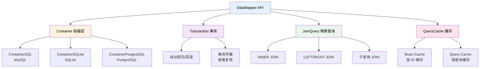
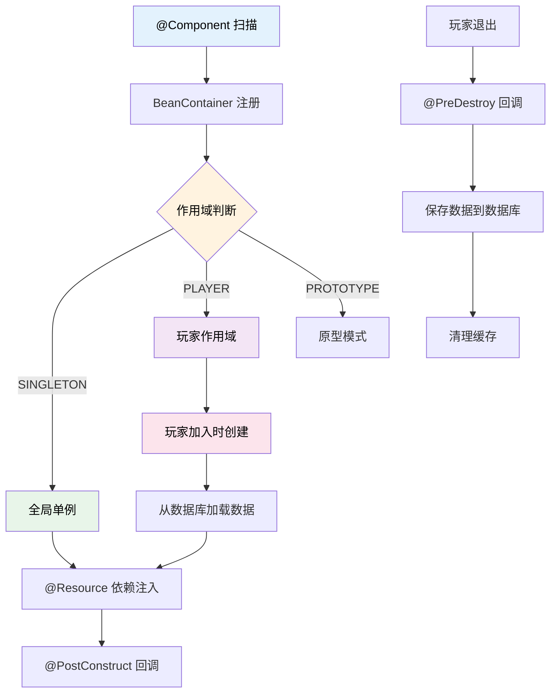

本次更新是 TabooLib 近期最大规模的一次更新，涉及 249 个文件、超过 22000 行新增代码。核心亮点包括 PTC Object ORM 框架的全面重构、database-ioc 模块重写为真正的 IoC 容器、Hytale 平台支持、零开销 NMS dynamic 指令，以及寻路系统和 UI 系统的大幅优化。

<!-- truncate -->

## 涉及的相关提交

### PTC Object ORM 重构

- [**74d85082**](https://github.com/TabooLib/taboolib/commit/74d85082)

  `优化寻路，优化 ptc-object 模块`

  由 @黑 提交 - PTC Object 基础架构优化

- [**62eb811f**](https://github.com/TabooLib/taboolib/commit/62eb811f)

  `只有在没有 @Id 字段时才自动添加 id 主键`

  由 @黑 提交 - 改进自动主键逻辑

- [**a7bae97a**](https://github.com/TabooLib/taboolib/commit/a7bae97a)

  `ptc-object 支持事务`

  由 @黑 提交 - 新增事务支持

- [**d21c7a78**](https://github.com/TabooLib/taboolib/commit/d21c7a78)

  `feat(database): 拓展 database-ptc-object 增加快捷操作工具`

  由 @Ray_Hughes 提交 - 新增 DataMapper API 和快捷操作

- [**6f144a67**](https://github.com/TabooLib/taboolib/commit/6f144a67)

  `feat(database): 添加容器类型子表支持与 Collection Accessor API`

  由 @Ray_Hughes 提交 - List/Set/Map 子表和数据库代理

- [**97244b88**](https://github.com/TabooLib/taboolib/commit/97244b88)

  `feat(database): 新增 @Ignore 注解、集合 CustomType 和事务传播`

  由 @Ray_Hughes 提交 - @Ignore 注解、集合序列化、嵌套事务

- [**e5b19910**](https://github.com/TabooLib/taboolib/commit/e5b19910)

  `feat(database): 手动建表、版本迁移、PostgreSQL Schema 支持`

  由 @Ray_Hughes 提交 - 手动建表、版本迁移机制、Schema 支持

### Database IoC 容器重写

- [**57a2b0f1**](https://github.com/TabooLib/taboolib/commit/57a2b0f1)

  `feat(database): 重写 database-ioc 模块为真正的 IoC 容器`

  由 @Ray_Hughes 提交 - 完全重写为 Spring-like IoC 容器

### Hytale 平台支持

- [**16d06d2d**](https://github.com/TabooLib/taboolib/commit/16d06d2d)

  `适配 hytale`

  由 @黑 提交 - 新增 Hytale 平台基础适配

- [**783ec22f**](https://github.com/TabooLib/taboolib/commit/783ec22f)

  `hytale 事件适配`

  由 @黑 提交 - Hytale 事件系统适配

- [**101f8263**](https://github.com/TabooLib/taboolib/commit/101f8263)

  `Hytale @SubscribeEvent 支持 eventKey 参数并修改默认类型为 NORMAL`

  由 @黑 提交 - 完善 Hytale 事件订阅

### NMS 系统改进

- [**7bb45f0f**](https://github.com/TabooLib/taboolib/commit/7bb45f0f)

  `nms-proxy 模块新增 dynamic 指令`

  由 @黑 提交 - 零开销 NMS 动态调用

- [**6e4117b0**](https://github.com/TabooLib/taboolib/commit/6e4117b0)

  `不依赖登入监听器的数据包注入实现`

  由 @Micalhl 提交 - MeteorInjector 替代 LightInjector

- [**a5d5e67f**](https://github.com/TabooLib/taboolib/commit/a5d5e67f)

  `把三个高版本的 ItemTag 实现模块合并为一个模块`

  由 @Micalhl 提交 - 合并 ItemTag 模块

- [**2dd72ca5**](https://github.com/TabooLib/taboolib/commit/2dd72ca5)

  `新增 VersionAdaptor 并优化计分板逻辑`

  由 @黑 提交 - 版本适配分发器，消除级联 try-catch

### 寻路系统优化

- [**9d239039**](https://github.com/TabooLib/taboolib/commit/9d239039)

  `优化寻路`

  由 @黑 提交 - 路径平滑算法、方块类型处理器系统

### UI 系统重构

- [**59027629**](https://github.com/TabooLib/taboolib/commit/59027629)

  `fix: 重构 StorableChest 内部逻辑`

  由 @黑 提交 - StorableChest 交互处理重构

- [**2dafd23a**](https://github.com/TabooLib/taboolib/commit/2dafd23a)

  `feat(ui): 添加菜单槽位锁定功能以支持交互限制`

  由 @zhibei 提交 - lockSlots 功能

- [**5b677e08**](https://github.com/TabooLib/taboolib/commit/5b677e08)

  `feat(ui): 添加对 Shift+点击的限量与条件规则支持`

  由 @zhibei 提交 - Shift 点击限量处理

### 基础设施改进

- [**7d5235d5**](https://github.com/TabooLib/taboolib/commit/7d5235d5)

  `feat(ClassVisitor): 添加 @Requires 注解以支持条件注入`

  由 @黑 提交 - 条件注入系统

- [**8d511953**](https://github.com/TabooLib/taboolib/commit/8d511953)

  `feat(ClassVisitorHandler): 支持检测避免重定向的感叹号`

  由 @lynn 提交 - ClassVisitor 优化

- [**700430a0**](https://github.com/TabooLib/taboolib/commit/700430a0)

  `feat(configuration): 添加 KeyedLazy 和 ReloadAwareLazy 懒加载委托类`

  由 @zhibei 提交 - 配置感知的懒加载

- [**e7afd8b8**](https://github.com/TabooLib/taboolib/commit/e7afd8b8)

  `feat(database): 添加 PostgreSQL 支持并升级 MySQL 驱动`

  由 @Ray_Hughes 提交 - PostgreSQL 数据库支持

- [**fef7b7fe**](https://github.com/TabooLib/taboolib/commit/fef7b7fe)

  `feat(database-lettuce-redis): 升级 Lettuce 至 7.2.1 并添加同步启动方法`

  由 @zhibei 提交 - Lettuce Redis 升级

### Bug 修复

- [**16459046**](https://github.com/TabooLib/taboolib/commit/16459046)

  `feat(FoliaExecutor): 修复 Folia 实体调度器相关函数`

  由 @米咔噜 提交 - Folia 调度器修复

- [**fa94b997**](https://github.com/TabooLib/taboolib/commit/fa94b997)

  `fix: 修复 @Parallel 的 "runOn" 参数读取错误，修复 CommandLineParser 解析 "-" 异常`

  由 @黑 提交

- [**36b59f7d**](https://github.com/TabooLib/taboolib/commit/36b59f7d)

  `修复 remap 缓存问题，支持新版本的玩家皮肤脸部显示`

  由 @Jie-150 提交

- [**46432b3d**](https://github.com/TabooLib/taboolib/commit/46432b3d)

  `fix(file-watcher): 修复文件监听路径解析问题`

  由 @嘿鹰 提交

- [**08de2cf9**](https://github.com/TabooLib/taboolib/commit/08de2cf9)

  `fix(configuration): 修复 getMap 方法泛型 K 无法正确转换非 String 类型的问题`

  由 @嘿鹰 提交

## 一句话简述更新

**PTC Object 进化为完整 ORM 框架，IoC 容器全面重写，TabooLib 正式迈入 Hytale 时代。**

## 本次更新的重点

### 1. PTC Object ORM 框架重构 - 从简单容器到完整 ORM

#### 背景问题

旧版 PTC Object 仅提供基础的 CRUD 操作，开发者需要通过 `container.get<T>()` 获取操作器后手动调用各种方法，缺乏事务支持、联表查询、分页、缓存等企业级 ORM 功能。

#### 解决方案

全新的 PTC Object 引入了 DataMapper API，提供类似 MyBatis-Plus 的开发体验，同时保持轻量级的设计理念。

#### 架构总览



#### 核心新功能

**1. DataMapper 属性委托（来自 [Ptc-Test](https://github.com/TabooLib/Ptc-Test)）**

```kotlin title="Database.kt" showLineNumbers
/** 玩家家园 Mapper —— 无缓存（默认） */
val homeMapper by mapper<PlayerHome>(db(file = "test.db"))

/** 玩家统计 Mapper —— 与 homeMapper 共用数据源，用于 JOIN 联查 */
val statsMapper by mapper<PlayerStats>(db(file = "test.db"))

/** 带缓存的 Mapper —— L2 双层缓存 */
val cachedHomeMapper by mapper<PlayerHome>(db(file = "test_cached.db")) {
    cache {
        beanCache { maximumSize = 100; expireAfterWrite = 60 }
        queryCache { maximumSize = 50; expireAfterWrite = 60 }
    }
}
```

**2. 基础 CRUD（来自 Ptc-Test）**

```kotlin title="TestBasic.kt" showLineNumbers
val home = PlayerHome("test_basic", "lobby", "world", 1.0, 2.0, 3.0, true)
homeMapper.insert(home)
val found = homeMapper.findById("test_basic")
val updated = found!!.copy(world = "world_nether", x = 10.0)
homeMapper.update(updated)
homeMapper.deleteById("test_basic")
```

**3. 事务支持（来自 Ptc-Test）**

```kotlin title="TestTransaction.kt" showLineNumbers
val result = homeMapper.transaction {
    insert(PlayerHome("tx_user_1", "lobby", "world", 0.0, 64.0, 0.0, true))
    insert(PlayerHome("tx_user_2", "survival", "world", 100.0, 64.0, 100.0, false))
    val home = findById("tx_user_1")
    if (home != null) update(home.copy(world = "world_nether"))
    findById("tx_user_1") != null
}
```

**4. 多表联查（来自 Ptc-Test）**

```kotlin title="TestJoin.kt" showLineNumbers
val results = homeMapper.join {
    innerJoin<PlayerStats> {
        on("player_home.username" eq pre("player_stats.username"))
    }
    selectAs(
        "player_home.username" to "username",
        "player_stats.kills" to "kills",
        "player_stats.deaths" to "deaths"
    )
    where { "player_home.username" eq "join_user" }
}.execute()
```

**5. 新增注解**

| 注解 | 作用 |
|------|------|
| `@Ignore` | 字段不参与数据库读写，使用 Kotlin 默认值 |
| `@LinkTable` | 外键关联，支持多层嵌套和级联保存 |
| `@ColumnType` | 显式指定 SQL/SQLite/PostgreSQL 列类型 |
| `@TableName(schema=)` | PostgreSQL Schema 支持 |

**6. 容器类型子表**

List、Set、Map 字段自动创建子表，通过数据库代理直接操作：

```kotlin title="容器类型" showLineNumbers
val props: MutableMap<String, String?> = mapper.mapOf("player1", "props")
props["key1"] = "value1"   // → SQL INSERT/UPDATE
val tags: MutableList<String?> = mapper.listOf("player1", "tags")
tags.add("newTag")         // → SQL INSERT
```

### 2. Database IoC 容器重写 - 从数据容器到依赖注入

#### 背景问题

旧版 database-ioc 基于 Linker 模式（`linkedIOCMap<T>()`），需要手动管理玩家数据的加载/保存时机，缺乏依赖注入能力，类型不安全。

#### 解决方案

全新的 IoC 容器采用 Spring-like 设计，通过注解驱动实现自动生命周期管理和依赖注入。

#### 工作原理



#### 使用示例（来自 [IOC-Test](https://github.com/TabooLib/IOC-Test)）

```kotlin title="CurrencyData.kt" showLineNumbers
@Component(scope = BeanScope.PLAYER)
class CurrencyData : PlayerData() {
    /** 钻石 */
    var diamond: Int = 0
    /** 绿宝石 */
    var emerald: Int = 0
    /** 嘻嘻币 */
    var xixiCoin: Int = 0
}
```

```kotlin title="CurrencyManager.kt" showLineNumbers
@Component(scope = BeanScope.PLAYER)
class CurrencyManager : PlayerOperator<CurrencyData>() {

    enum class Type(val display: String) {
        DIAMOND("钻石"), EMERALD("绿宝石"), XIXI_COIN("嘻嘻币");
    }

    fun get(type: Type): Int = when (type) {
        Type.DIAMOND -> data.diamond
        Type.EMERALD -> data.emerald
        Type.XIXI_COIN -> data.xixiCoin
    }

    fun add(type: Type, amount: Int) {
        set(type, get(type) + amount)
    }

    fun set(type: Type, value: Int) {
        when (type) {
            Type.DIAMOND -> { data.diamond = value; update(CurrencyData::diamond) }
            Type.EMERALD -> { data.emerald = value; update(CurrencyData::emerald) }
            Type.XIXI_COIN -> { data.xixiCoin = value; update(CurrencyData::xixiCoin) }
        }
    }

    fun topDiamond(limit: Int = 10) = top("diamond", limit)

    override fun onLoad() { /* 玩家上线，数据已从数据库加载 */ }
    override fun onSave() { /* 定时保存 / 退出前保存 */ }
    override fun onQuit() { /* 玩家退出后的清理逻辑 */ }
}
```

```kotlin title="ShopService.kt" showLineNumbers
@Component
class ShopService {

    private val items = mutableMapOf<String, ShopItem>()

    @PostConstruct
    fun init() {
        register(ShopItem("bread", "面包", 5, CurrencyManager.Type.DIAMOND, "恢复饥饿值"))
        register(ShopItem("sword", "铁剑", 20, CurrencyManager.Type.DIAMOND, "一把普通的铁剑"))
    }

    fun buy(player: Player, itemId: String): String {
        val item = items[itemId] ?: return "商品不存在: $itemId"
        val manager = player.ioc<CurrencyManager>() ?: return "数据未加载"
        if (!manager.has(item.currency, item.price)) {
            return "余额不足"
        }
        manager.take(item.currency, item.price)
        return "购买成功: ${item.name}"
    }
}
```

```kotlin title="ShopCommand.kt" showLineNumbers
// 使用 player.ioc<T>() 获取玩家作用域 Bean
val mgr = sender.ioc<CurrencyManager>()
mgr?.add(CurrencyManager.Type.DIAMOND, 100)

// 使用 BeanContainer.getBean() 获取全局单例 Bean
val service = BeanContainer.getBean(ShopService::class.java)
service?.buy(sender, "bread")
```

### 3. Hytale 平台支持

TabooLib 正式支持 Hytale 平台，新增完整的平台适配层：

- `HytalePlugin` - 插件入口，支持完整生命周期
- `HytaleAdapter` - 跨平台适配（玩家、命令发送者、坐标转换）
- `HytaleListener` - 事件监听，支持同步/异步/ECS 实体事件
- `HytaleEventType` - 7 种事件订阅类型（Normal、Global、Async 等）
- `@SubscribeEvent` 支持 `eventKey` 参数进行事件过滤

### 4. NMS dynamic 指令 - 零开销 NMS 调用

#### 背景问题

传统的 NMS 调用需要通过反射或 nmsProxy，存在运行时性能开销。

#### 解决方案

新增 `dynamic()` 函数，在字节码转换阶段将调用替换为直接 JVM 指令，运行时与手写 NMS 代码完全等价。


支持 7 种操作码：INVOKEVIRTUAL、INVOKESTATIC、INVOKESPECIAL、GETFIELD、PUTFIELD、GETSTATIC、PUTSTATIC。

### 5. MeteorInjector - 新一代数据包注入

替代旧版 LightInjector，不再依赖玩家登入监听器，使用 Netty Channel 管道直接注入，支持自动清理和线程安全。

### 6. 寻路系统优化

- **路径平滑**：实现 String Pulling（拉绳法）算法，去除多余拐点，路径更自然
- **方块类型处理器**：新增 `BlockTypeHandler` 接口，支持自定义方块类型判断和优先级
- **内置处理器**：门、栅栏门、台阶、楼梯、活板门、睡莲、营火等特殊方块
- **对角线移动优化**：改进高度容差判断

### 7. StorableChest UI 重构

- 将交互处理拆分为 5 个专用处理器（Place、Pickup、Swap、ShiftClick、Drag）
- 新增 `lockSlots()` 槽位锁定功能
- 新增 `autoStack()` 自动堆叠
- 新增 `mergeSlots()` 自定义合并槽位顺序
- 改进 Shift 点击的限量与条件规则

### 8. @Requires 条件注入注解

控制类是否参与 ClassVisitor 注入，支持 4 种条件：

```kotlin title="条件注入" showLineNumbers
@Requires(classes = ["com.example.SomePlugin"])  // 要求类存在
@Requires(missingClasses = ["com.old.Legacy"])    // 要求类不存在
@Requires(systemProperty = ["mode=production"])   // 系统属性判断
@Requires(env = ["ENABLE_FEATURE!=false"])         // 环境变量判断
```

### 9. 其他改进

- **PostgreSQL 支持**：新增 `database-postgresql` 模块和 `ContainerPostgreSQL`
- **Configuration 懒加载**：`KeyedLazy` 和 `ReloadAwareLazy` 委托，配置重载时自动失效
- **Lettuce Redis 升级**：升级至 7.2.1，新增 `startSync()` 和 `stop()` 方法
- **VersionAdaptor**：消除级联 try-catch，首次调用确定策略后缓存，零开销
- **Demand 支持单引号**：解析器现在支持单引号包裹的参数值
- **ItemTag 模块合并**：三个高版本 ItemTag 实现合并为 `bukkit-nms-tag-modern`
- **XSeries 更新**：支持 1.21.8，更新 XItemStack、XSound、XParticle 等
- **Chest UI 增强**：新增 `onInventoryCreate` / `onFinalBuild` 回调
- **物品属性修改器**：`bukkit-util` 新增 `ItemBuilder` 属性修改器支持

## 迁移指南

### PTC Object 迁移

旧版 API 仍然可用，但推荐迁移到新的 DataMapper API：

**迁移前：**
```kotlin
val container = persistentContainer { new<PlayerHome>() }
val homes = container.get<PlayerHome>().find(playerUUID)
container.get<PlayerHome>().insert(listOf(home))
container.get<PlayerHome>().updateByKey(home)
```

**迁移后（来自 [Ptc-Test](https://github.com/TabooLib/Ptc-Test)）：**
```kotlin
val homeMapper by mapper<PlayerHome>(db(file = "test.db"))
val homes = homeMapper.findAll("test_basic")
homeMapper.insert(home)
homeMapper.updateByKey(home)
```

### Database IoC 迁移

**迁移前：**
```kotlin
@Component(index = "id")
data class PlayerData(var id: String? = null, var coins: Int = 0)
var dataManager = linkedIOCMap<PlayerData>()
// 手动监听玩家加入/退出
```

**迁移后（来自 [IOC-Test](https://github.com/TabooLib/IOC-Test)）：**
```kotlin
@Component(scope = BeanScope.PLAYER)
class CurrencyData : PlayerData() {
    var diamond: Int = 0
    var emerald: Int = 0
}
// 自动管理生命周期，使用 player.ioc<CurrencyData>() 访问
```

## 文档更新

本次更新同步更新了以下文档：

- [持久化对象容器（PTC Object）](/docs/expanding-technology/persistent-container)：完全重写，覆盖 DataMapper API、事务、联表查询、缓存等所有新功能

## 致谢

感谢以下贡献者为本次更新做出的贡献：

- @黑 - PTC Object 事务支持、Hytale 平台适配、NMS dynamic 指令、寻路优化、@Requires 注解、StorableChest 重构、VersionAdaptor
- @Ray_Hughes - DataMapper API、Collection Accessor、@Ignore 注解、版本迁移、PostgreSQL 支持、IoC 容器重写
- @zhibei - UI lockSlots 功能、Shift 点击限量、Configuration 懒加载、Lettuce Redis 升级
- @Micalhl - MeteorInjector、ItemTag 模块合并
- @lynn - ClassVisitorHandler 优化、XSeries 更新、Folia 调度器修复
- @Jie / @Jie-150 - NBT 1.20.5+ 支持、remap 缓存修复
- @嘿鹰 - Nashorn ASM 依赖、文件监听修复、配置 getMap 修复
- @L1-An - 物品属性修改器
- @BingZi-233 - OpenResult 依赖优化
- @纸杯gg - 数据源 KeepaliveTime 配置
- @zzzyyylllty - XItemStack custommodeldata 修复

---

如有问题或建议，欢迎在 [GitHub Issues](https://github.com/TabooLib/taboolib/issues) 反馈。
