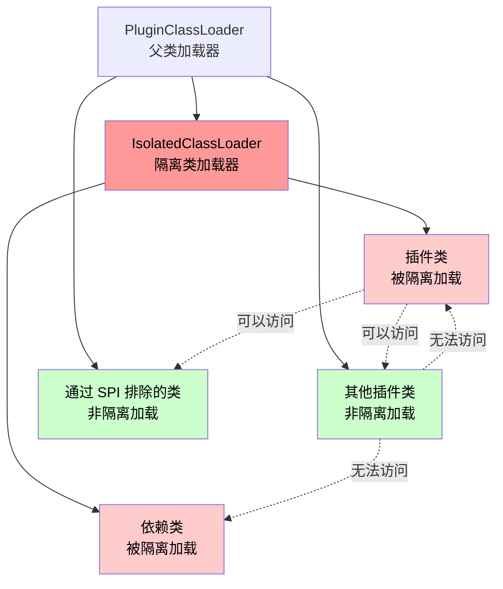

# 沙盒模式隔离类加载器

## 引言

在像 Bukkit 这样多个插件共存并且可以互相访问的环境中，如何避免依赖冲突是一个重要的问题。

TabooLib 默认的解决方案是通过 **relocate 重定向**改变依赖的包名来避免冲突，比如把 1.7.21 版本的 kotlin 包名重定向为 `kotlin1721` 来避免不同版本 Kotlin 标准库的冲突。

但是有些场景使用重定向可能会出问题，这时可以使用**沙盒模式**，即 `IsolatedClassLoader` 隔离类加载器来避免依赖冲突，同时不需要 relocate 重定向。

:::warning 最后的手段
沙盒模式是迫不得已而为之。如果 relocate 可以解决问题，请优先使用 TabooLib 默认的 relocate 解决方案。
:::

## 应用场景

### 何时使用沙盒模式？

1. **使用了 kotlin-reflect 等不能 relocate 的依赖**
   - 比如 JetBrains 的 ORM 框架 [Exposed](https://github.com/JetBrains/Exposed) 就需要 kotlin-reflect 依赖

2. **把插件作为加载器去加载附属插件**
   - 并为附属插件直接提供 Kotlin API，因此不能 relocate kotlin

3. **加载 Kotlin Script（kts 脚本）**
   - 需要没有 relocate 的 kotlin 环境

## 注意事项

:::danger 隔离的代价
一旦开启沙盒模式，使用 IsolatedClassLoader 加载的所有类均**不可以被其他插件访问**，这也正是"沙盒"和"隔离"的意思。
:::

### 沙盒的特性

- ✅ **沙盒内部的类**可以访问沙盒外部的类
- ❌ **沙盒外部的类**无法访问沙盒内部的类

### 解决方案

可以通过 **SPI 配置排除的类和包**，使其非隔离加载，从而为其他插件提供 API。详见下文 [通过 SPI 排除指定类和包](#通过-spi-排除指定类和包)。

## 开始使用

### TabooLib 6.1 及以上版本

#### 1. 配置 build.gradle.kts

```kotlin title="build.gradle.kts"
taboolib {
    env {
        // 开启隔离类加载器（沙盒模式）
        enableIsolatedClassLoader = true
    }
    version {
        // 跳过 kotlin 重定向
        skipKotlinRelocate = true
    }
}
```

:::info 配置说明
- `enableIsolatedClassLoader = true` - 启用沙盒模式
- `skipKotlinRelocate = true` - 跳过 Kotlin 标准库的重定向
:::

### TabooLib 6.0 版本

参考 PR: [#293 - add IsolatedClassLoader](https://github.com/TabooLib/taboolib/pull/293)

## 通过 SPI 排除指定类和包

### 什么是 SPI？

SPI 即 **Service Provider Interface**，是 JDK 内置的一种服务提供发现机制。它通过将接口实现类的全限定名配置在文件中，由服务加载器读取配置文件，实现了接口与实现类的解耦。

### 使用方法

#### 步骤 1：创建配置类

新建一个 **Java 类**（不能是 Kotlin 类）实现 `taboolib.common.classloader.IsolatedClassLoaderConfig` 接口：

```java title="IsolatedConfig.java"
package com.example.myplugin;

import taboolib.common.classloader.IsolatedClassLoaderConfig;
import java.util.Set;

public class IsolatedConfig implements IsolatedClassLoaderConfig {

    @Override
    public Set<String> excludedClasses() {
        // 返回排除的类的全限定名（包名.类名）
        return Set.of(
            "com.example.myplugin.api.MyAPI",
            "com.example.myplugin.api.MyInterface"
        );
    }

    @Override
    public Set<String> excludedPackages() {
        // 返回排除的包名（最好以 . 结尾）
        return Set.of(
            "com.example.myplugin.api."
        );
    }
}
```

:::tip 接口方法
- `excludedClasses()` - 返回排除的类的全限定名
- `excludedPackages()` - 返回排除的包名（建议以 `.` 结尾）
:::

#### 步骤 2：创建 SPI 配置文件

1. 在 `resources` 目录下新建 `META-INF/services` 目录

2. 在其中新建文件：`项目包名.taboolib.common.classloader.IsolatedClassLoaderConfig`

   :::caution 注意包名重定向
   如果不确定正确的文件名，可以反编译 build 出来的 jar 文件，查看 `IsolatedClassLoaderConfig` 这个类被 relocate 到哪里了。
   :::

3. 在该文件中填写实现类的全限定名（包名.类名）

```text title="META-INF/services/[relocate包名].taboolib.common.classloader.IsolatedClassLoaderConfig"
com.example.myplugin.IsolatedConfig
```

### 注意事项

:::warning 重要限制
1. **排除的类和包中最好只提供接口**
   - 不能调用任何自身被隔离加载的类
   - 不能调用自身加载的依赖
   - 不能调用 Kotlin 标准库中的内容（因为它们都是被隔离加载的）

2. **排除的类和包最好使用 Java 编写**
   - 使用 Kotlin 时请严格遵守第 1 条注意事项
   - 确保 Kotlin 编译后产生的 class 字节码没有调用任何 Kotlin 标准库中的函数
:::

参考 PR: [#360 - 允许通过 SPI 排除指定类或包](https://github.com/TabooLib/taboolib/pull/360)

## 优秀实践

### 完整的 API 提供方案

下面是一个推荐的项目结构和实现方式：

#### 1. 创建 API 包结构

```
src/main/java/
└── io/github/username/project/
    ├── api/                      # API 包（非隔离加载）
    │   ├── ProjectAPI.java       # 主 API 接口
    │   ├── ProjectAPIProvider.java  # API 提供者
    │   └── interfaces/           # 其他接口
    │       ├── IUniversalItemRegistry.java
    │       ├── IGuideElementRegistry.java
    │       └── ...
    └── impl/                     # 实现包（隔离加载）
        └── ProjectAPIImpl.kt     # API 实现类
```

#### 2. 定义主 API 接口

```java title="api/ProjectAPI.java"
package io.github.username.project.api;

public interface ProjectAPI {

    IUniversalItemRegistry getUniversalItemRegistry();

    IGuideElementRegistry getGuideElementRegistry();

    IClassRegistry<IGuideElementState> getGuideElementStateRegistry();

    IClassRegistry<IGuideReward> getGuideRewardRegistry();

    IShiningGuide getShiningGuide();

    IGuideTeamManager getGuideTeamManager();

    IMachineRegistry getMachineRegistry();

    IBlueprintEditor getBlueprintEditor();
}
```

#### 3. 创建 API 提供者

```java title="api/ProjectAPIProvider.java"
package io.github.username.project.api;

public class ProjectAPIProvider {

    private static ProjectAPI api = null;

    public static void setAPI(ProjectAPI instance) {
        api = instance;
    }

    public static ProjectAPI getAPI() {
        if (api == null) {
            throw new IllegalStateException(
                "ProjectAPI has not finished loading, or failed to load!"
            );
        }
        return api;
    }
}
```

:::tip Kotlin 单例版本
也可以使用 Kotlin 的 `object` 单例：

```kotlin title="api/ProjectAPIProvider.kt"
package io.github.username.project.api

object ProjectAPIProvider {
    internal var api: ProjectAPI? = null

    fun api(): ProjectAPI {
        return api ?: throw IllegalStateException(
            "ProjectAPI has not finished loading, or failed to load!"
        )
    }
}
```
:::

#### 4. 实现 API 接口

```kotlin title="impl/ProjectAPIImpl.kt"
package io.github.username.project.impl

import io.github.username.project.api.*

class ProjectAPIImpl : ProjectAPI {

    override fun getUniversalItemRegistry(): IUniversalItemRegistry =
        UniversalItemRegistry

    override fun getGuideElementRegistry(): IGuideElementRegistry =
        GuideElementRegistry

    override fun getGuideElementStateRegistry(): IClassRegistry<IGuideElementState> =
        GuideElementStateRegistry

    override fun getGuideRewardRegistry(): IClassRegistry<IGuideReward> =
        GuideRewardRegistry

    override fun getShiningGuide(): IShiningGuide = ShiningGuide

    override fun getGuideTeamManager(): IGuideTeamManager = GuideTeamManager

    override fun getMachineRegistry(): IMachineRegistry = MachineRegistry

    override fun getBlueprintEditor(): IBlueprintEditor = BlueprintEditor
}
```

#### 5. 在插件主类初始化 API

```kotlin title="Project.kt"
package io.github.username.project

import io.github.username.project.api.ProjectAPI
import io.github.username.project.api.ProjectAPIProvider
import io.github.username.project.impl.ProjectAPIImpl
import org.bukkit.Bukkit
import org.bukkit.plugin.ServicePriority
import taboolib.common.platform.Plugin

object Project : Plugin() {

    override fun onEnable() {
        // 初始化 API
        val api = ProjectAPIImpl()
        ProjectAPIProvider.setAPI(api)

        // 注册到 Bukkit 服务管理器
        Bukkit.getServicesManager().register(
            ProjectAPI::class.java,
            api,
            plugin,
            ServicePriority.Normal
        )
    }
}
```

:::info Bukkit 服务管理器
`Bukkit.getServicesManager().register` 是 Bukkit 提供的服务注册方法，可以让其他插件通过服务管理器获取你的 API。

参考: [RarityEG's Plugin Dev Tutorial - 注册到 Bukkit](https://plugin-diary.pages.dev/#/AC-2?id=%e6%b3%a8%e5%86%8c%e5%88%b0-bukkit)
:::

#### 6. 在其他插件中获取 API

##### 方法一：使用 ProjectAPIProvider

```java title="Java"
import io.github.username.project.api.ProjectAPI;
import io.github.username.project.api.ProjectAPIProvider;

ProjectAPI api = ProjectAPIProvider.getAPI();
```

```kotlin title="Kotlin"
import io.github.username.project.api.ProjectAPI
import io.github.username.project.api.ProjectAPIProvider

val api: ProjectAPI = ProjectAPIProvider.api()
```

##### 方法二：使用 Bukkit ServicesManager

```java title="Java"
import io.github.username.project.api.ProjectAPI;
import org.bukkit.Bukkit;
import org.bukkit.plugin.RegisteredServiceProvider;

RegisteredServiceProvider<ProjectAPI> rsp =
    Bukkit.getServicesManager().getRegistration(ProjectAPI.class);
ProjectAPI api = rsp.getProvider();
```

```kotlin title="Kotlin"
import io.github.username.project.api.ProjectAPI
import org.bukkit.Bukkit

val rsp = Bukkit.getServicesManager()
    .getRegistration(ProjectAPI::class.java)
val api: ProjectAPI = rsp.provider
```

##### 方法三：使用 Kotlin 属性委托

```kotlin
object BukkitApiGetter {
    inline operator fun <reified T> getValue(
        ref: Any?,
        property: KProperty<*>
    ): T {
        return Bukkit.getServicesManager()
            .getRegistration(T::class.java)?.provider
            ?: throw IllegalStateException("Service not found: ${T::class.java.name}")
    }
}

// 使用方式
object Test {
    val myAPI: ProjectAPI by BukkitApiGetter
    val anotherAPI: YourAPI by BukkitApiGetter
}
```

## 原理详述

### 类加载器

类加载是 Java 虚拟机的一种机制，用于将类的二进制数据读入内存并解析成 `Class` 对象。每个 Java 类都必须由某个类加载器加载到内存中。Java 类加载器是通过**双亲委派模型**实现的，这种模型可以保证同一个类只会被同一个类加载器加载。

### 双亲委派机制

JVM 双亲委派机制是 Java 类加载器的一种工作机制，它的核心思想是：

1. 当一个类加载器收到类加载请求时，首先将这个请求**委托给父类加载器**去完成
2. 依次递归下去，如果父类加载器可以完成该加载任务，就成功返回
3. 只有父类加载器无法完成此加载请求时（找不到此类），子加载器才会尝试自己去加载

这种机制使得 Java 的核心 API 能确保在各种环境和应用中保持稳定。

### IsolatedClassLoader 打破双亲委派机制

让我们看看 TabooLib 的实现（源码位置：`common/src/main/java/taboolib/common/classloader/IsolatedClassLoader.java:93`）：

```java
public Class<?> loadClass(String name, boolean resolve, boolean checkParents)
        throws ClassNotFoundException {
    synchronized (getClassLoadingLock(name)) {
        Class<?> findClass = findLoadedClass(name);

        // 在检查父类加载器之前先检查隔离的类和库：
        //   - 防止访问其他插件的类
        //   - 防止使用旧的补丁类（这些类在重新加载后仍然存在于内存中）
        if (findClass == null && !excludedClasses.contains(name)) {
            boolean flag = true;
            for (String excludedPackage : excludedPackages) {
                if (name.startsWith(excludedPackage)) {
                    flag = false;
                    break;
                }
            }
            if (flag) {
                findClass = findClassOrNull(name);
            }
        }

        // 找不到再委托给父类加载器
        if (findClass == null && checkParents) {
            findClass = loadClassFromParentOrNull(name);
        }

        if (findClass == null) {
            throw new ClassNotFoundException(name);
        }

        if (resolve) {
            resolveClass(findClass);
        }
        return findClass;
    }
}
```

### 打破双亲委派的意义

- **IsolatedClassLoader 加载类时先尝试自己加载**，如果找不到类再委托给父类加载器加载
- 从而**打破了双亲委派机制**，允许相同全限定名的类在 JVM 中共存

### 为什么插件自身的类也要被隔离加载？

你可能会有疑问：为什么不只让需要的依赖隔离加载，而插件自身的类非隔离加载呢？这样既能避免依赖冲突，其他插件又能访问本插件的类。

:::caution 原因
**JVM 的类加载机制决定的：**

1. JVM 加载类时并不是一次性全都加载进内存中的，而是**哪个类被调用了就去加载哪个类**
2. JVM 是用**调用类（当前类）的类加载器**去加载被调用的类
3. 这就导致了要想访问到被隔离的依赖，那插件自身的类必须也被隔离加载
:::

### 沙盒隔离的形成



- **Bukkit 使用 PluginClassLoader 加载所有插件的类**从而实现不同插件的互相访问
- **被 IsolatedClassLoader 加载的类**虽然可以访问其父类加载器 PluginClassLoader 加载的类（自身通过 SPI 排除的类和其他插件的类）
- 但是 **PluginClassLoader 加载的类却无法访问 IsolatedClassLoader 加载的类**
- 从而形成了一个**隔离的沙盒环境**

## 总结

### 何时使用沙盒模式？

| 场景 | 是否使用沙盒模式 |
|------|-----------------|
| 普通依赖冲突 | ❌ 使用 relocate |
| kotlin-reflect 等不能 relocate 的依赖 | ✅ 使用沙盒模式 |
| 加载 Kotlin Script（kts） | ✅ 使用沙盒模式 |
| 作为加载器加载附属插件并提供 Kotlin API | ✅ 使用沙盒模式 |

### 关键要点

1. ✅ 沙盒模式通过打破双亲委派机制实现类隔离
2. ✅ 可以通过 SPI 配置排除类和包，为其他插件提供 API
3. ⚠️ 排除的类和包最好只提供接口，使用 Java 编写
4. ⚠️ 沙盒内的类无法被外部访问，这是隔离的代价

## 相关链接

- [GitHub PR #293 - add IsolatedClassLoader](https://github.com/TabooLib/taboolib/pull/293)
- [GitHub PR #360 - 允许通过 SPI 排除指定类或包](https://github.com/TabooLib/taboolib/pull/360)
- [RarityEG's Plugin Dev Tutorial - 注册到 Bukkit](https://plugin-diary.pages.dev/#/AC-2?id=%e6%b3%a8%e5%86%8c%e5%88%b0-bukkit)
- [IsolatedClassLoader 源码](https://github.com/TabooLib/taboolib/blob/master/common/src/main/java/taboolib/common/classloader/IsolatedClassLoader.java)
