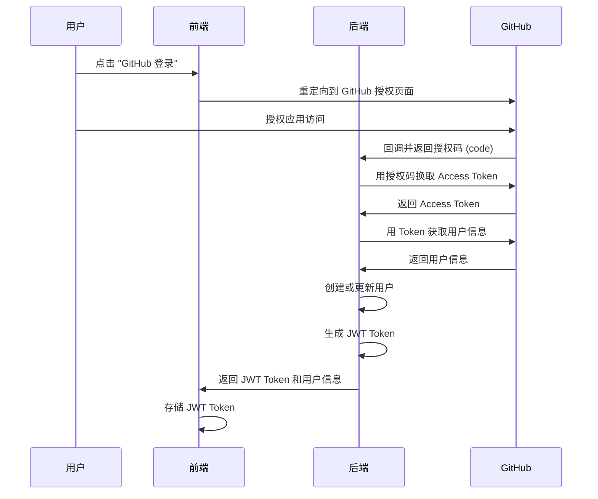

# GitHub OAuth2 认证

TabooWiki 后端使用 GitHub OAuth2 进行用户认证，无需用户名密码，通过 GitHub 账号即可快速登录。

## 认证流程



## API 端点

### 1. 获取 OAuth2 登录链接

**端点:** `GET /api/auth/oauth2/login`

**响应:**
```json
{
  "success": true,
  "message": "请使用 GitHub OAuth2 登录",
  "oauthUrl": "http://localhost:8080/oauth2/authorization/github"
}
```

**前端使用:**
```javascript
// 跳转到 GitHub 登录
window.location.href = response.oauthUrl;
```

### 2. OAuth2 登录回调

**端点:** `GET /api/auth/oauth2/success?code=xxx`

**参数:**
- `code`: GitHub 授权码（由 GitHub 自动添加）

**响应:**
```json
{
  "success": true,
  "message": "OAuth2 登录成功",
  "token": "eyJhbGciOiJIUzI1NiIsInR5cCI6IkpXVCJ9...",
  "user": {
    "id": 1,
    "username": "octocat",
    "nickname": "The Octocat",
    "avatarUrl": "https://avatars.githubusercontent.com/u/583231",
    "githubId": 583231,
    "githubUsername": "octocat",
    "githubUrl": "https://github.com/octocat",
    "company": "@github",
    "bio": "How people build software.",
    "publicRepos": 8,
    "isAdmin": false
  }
}
```

## 工作原理

### 1. 用户授权

当用户点击登录按钮时，前端将用户重定向到 GitHub OAuth2 授权页面：

```
https://github.com/login/oauth/authorize?
  client_id=YOUR_CLIENT_ID&
  redirect_uri=http://skfrp.maplex.top/api/auth/oauth2/success&
  scope=read:user,user:email
```

### 2. 获取授权码

用户授权后，GitHub 会重定向到配置的回调地址，并附带授权码：

```
http://skfrp.maplex.top/api/auth/oauth2/success?code=AUTHORIZATION_CODE
```

### 3. 换取 Access Token

后端接收到授权码后，调用 GitHub API 换取 Access Token：

```http
POST https://github.com/login/oauth/access_token
Content-Type: application/x-www-form-urlencoded

client_id=YOUR_CLIENT_ID&
client_secret=YOUR_CLIENT_SECRET&
code=AUTHORIZATION_CODE&
redirect_uri=http://skfrp.maplex.top/api/auth/oauth2/success
```

### 4. 获取用户信息

使用 Access Token 调用 GitHub API 获取用户信息：

```http
GET https://api.github.com/user
Authorization: Bearer ACCESS_TOKEN
User-Agent: TabooWiki-Backend
```

### 5. 创建或更新用户

- 如果是新用户（GitHub ID 不存在），创建新用户记录
- 如果是老用户，更新用户信息（昵称、头像、GitHub Token 等）

### 6. 生成 JWT Token

为用户生成 JWT Token，包含以下信息：

```json
{
  "sub": "octocat",        // 用户名
  "userId": 1,             // 用户 ID
  "isAdmin": false,        // 是否管理员
  "iat": 1730000000,       // 签发时间
  "exp": 1730086400        // 过期时间（默认 24 小时）
}
```

## 前端集成示例

### Vue 3 示例

```vue
<template>
  <div class="login-page">
    <button @click="handleGitHubLogin">
      <i class="fab fa-github"></i>
      使用 GitHub 登录
    </button>
  </div>
</template>

<script setup>
import { ref } from 'vue'
import axios from 'axios'
import { useRouter } from 'vue-router'

const router = useRouter()

const handleGitHubLogin = async () => {
  try {
    const response = await axios.get('/api/auth/oauth2/login')
    // 重定向到 GitHub 授权页面
    window.location.href = response.data.oauthUrl
  } catch (error) {
    console.error('获取登录链接失败:', error)
  }
}

// 处理 OAuth2 回调（在 App.vue 或路由守卫中）
const handleOAuth2Callback = async () => {
  const urlParams = new URLSearchParams(window.location.search)
  const code = urlParams.get('code')

  if (code) {
    try {
      const response = await axios.get(`/api/auth/oauth2/success?code=${code}`)

      if (response.data.success) {
        // 存储 JWT Token
        localStorage.setItem('jwt_token', response.data.token)
        localStorage.setItem('user_info', JSON.stringify(response.data.user))

        // 跳转到首页
        router.push('/')
      }
    } catch (error) {
      console.error('登录失败:', error)
      router.push('/login')
    }
  }
}
</script>
```

### React 示例

```jsx
import { useNavigate } from 'react-router-dom';
import axios from 'axios';

function LoginPage() {
  const navigate = useNavigate();

  const handleGitHubLogin = async () => {
    try {
      const response = await axios.get('/api/auth/oauth2/login');
      window.location.href = response.data.oauthUrl;
    } catch (error) {
      console.error('获取登录链接失败:', error);
    }
  };

  return (
    <div className="login-page">
      <button onClick={handleGitHubLogin}>
        <i className="fab fa-github"></i>
        使用 GitHub 登录
      </button>
    </div>
  );
}

// OAuth2 回调处理（在 App.js 中）
useEffect(() => {
  const urlParams = new URLSearchParams(window.location.search);
  const code = urlParams.get('code');

  if (code) {
    axios.get(`/api/auth/oauth2/success?code=${code}`)
      .then(response => {
        if (response.data.success) {
          localStorage.setItem('jwt_token', response.data.token);
          localStorage.setItem('user_info', JSON.stringify(response.data.user));
          navigate('/');
        }
      })
      .catch(error => {
        console.error('登录失败:', error);
        navigate('/login');
      });
  }
}, []);
```

## 配置说明

### 后端配置

在 `application.yml` 中配置 GitHub OAuth2：

```yaml
spring:
  security:
    oauth2:
      client:
        registration:
          github:
            client-id: YOUR_GITHUB_CLIENT_ID
            client-secret: YOUR_GITHUB_CLIENT_SECRET
            scope:
              - read:user
              - user:email

app:
  redirect_url: http://skfrp.maplex.top/api/auth/oauth2/success
  frontend-url: http://localhost:3000

jwt:
  secret: your-secret-key-must-be-at-least-256-bits
  expiration: 86400000  # 24 小时（毫秒）
```

### GitHub 应用配置

1. 登录 GitHub，进入 **Settings** → **Developer settings** → **OAuth Apps**
2. 点击 **New OAuth App**
3. 填写应用信息：
   - **Application name**: TabooWiki
   - **Homepage URL**: `http://skfrp.maplex.top`
   - **Authorization callback URL**: `http://skfrp.maplex.top/api/auth/oauth2/success`
4. 创建后获取 **Client ID** 和 **Client Secret**

## 安全建议

1. **HTTPS**: 生产环境必须使用 HTTPS
2. **Client Secret**: 不要在前端暴露 Client Secret
3. **JWT Secret**: 使用至少 256 位的随机密钥
4. **Token 存储**: 推荐使用 HttpOnly Cookie 存储 JWT Token
5. **CORS**: 正确配置 CORS 策略，避免跨域攻击

## 常见问题

### Q1: 登录后回调失败？

检查 GitHub 应用的 **Authorization callback URL** 是否配置正确，必须与后端配置的 `redirect_url` 完全一致。

### Q2: 获取不到用户信息？

确保在 GitHub OAuth 应用中申请了 `read:user` 和 `user:email` 权限。

### Q3: JWT Token 过期怎么办？

前端应该监听 401 错误，提示用户重新登录。或者实现 Token 刷新机制。
