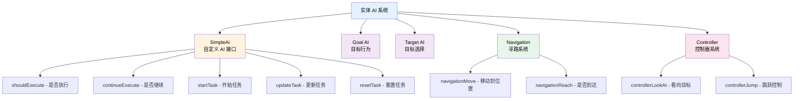
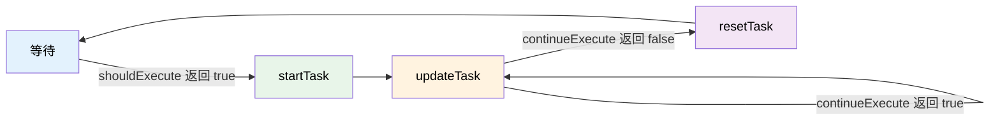

# 实体 AI 控制

TabooLib 提供了一套简单易用的实体 AI 控制系统，允许你自定义实体的行为逻辑、寻路、视角控制等功能，而无需深入了解 NMS 底层实现。

## 核心概念

实体 AI 系统主要包含以下几个核心部分：



- **SimpleAi**: 自定义 AI 的基础接口，通过实现该接口来创建自定义行为
- **Goal AI**: 实体的目标行为（如移动、攻击、逃跑等）
- **Target AI**: 实体的目标选择逻辑（如寻找最近的玩家、选择攻击目标等）
- **Navigation**: 寻路系统，控制实体的移动
- **Controller**: 控制器系统，控制实体的视角和跳跃

:::info[Goal AI 与 Target AI 的区别]

- **Goal AI**: 定义实体"做什么"（移动、攻击、逃跑等行为）
- **Target AI**: 定义实体"选择谁"（选择攻击目标、跟随目标等）

两者通常配合使用，Target AI 选择目标后，Goal AI 执行具体行为。

:::

## 自定义 AI

### 创建自定义 AI

通过继承 `SimpleAi` 类来创建自定义 AI：

```kotlin title="FollowPlayerAi.kt" showLineNumbers
import org.bukkit.entity.LivingEntity
import org.bukkit.entity.Player
import taboolib.module.ai.SimpleAi
import taboolib.module.ai.navigationMove
import taboolib.module.ai.controllerLookAt

/**
 * 跟随玩家的 AI
 */
class FollowPlayerAi(
    val entity: LivingEntity,  // 实体本身
    val target: Player,         // 跟随的目标玩家
    val speed: Double = 1.0     // 移动速度
) : SimpleAi() {

    // highlight-next-line
    override fun shouldExecute(): Boolean {
        // 判断是否应该执行这个 AI
        // 当实体距离玩家超过 3 格时开始跟随
        return entity.location.distance(target.location) > 3.0
    }

    // highlight-next-line
    override fun continueExecute(): Boolean {
        // 判断是否继续执行
        // 当实体距离玩家小于 2 格时停止跟随
        return entity.location.distance(target.location) > 2.0
    }

    override fun startTask() {
        // AI 开始时执行（可选）
        entity.sendMessage("开始跟随 ${target.name}")
    }

    // highlight-next-line
    override fun updateTask() {
        // 每 tick 执行一次（核心逻辑）
        // 让实体看向玩家
        entity.controllerLookAt(target)
        // 移动到玩家位置
        entity.navigationMove(target.location, speed)
    }

    override fun resetTask() {
        // AI 结束时执行（可选）
        entity.sendMessage("停止跟随")
    }
}
```

**代码说明：**
- `shouldExecute()`: 判断 AI 是否应该开始执行（必须实现）
- `continueExecute()`: 判断 AI 是否应该继续执行（默认调用 `shouldExecute()`）
- `startTask()`: AI 开始时执行一次（可选）
- `updateTask()`: 每 tick 执行一次，包含 AI 的核心逻辑（可选）
- `resetTask()`: AI 结束时执行一次（可选）

### AI 生命周期



1. 系统不断检查 `shouldExecute()`
2. 当返回 `true` 时，调用 `startTask()` 开始任务
3. 每 tick 调用 `updateTask()` 更新任务
4. 每 tick 检查 `continueExecute()`，返回 `false` 时调用 `resetTask()` 结束任务
5. 回到步骤 1

## AI 管理

### 添加 AI

为实体添加自定义 AI：

```kotlin title="添加 AI 示例" showLineNumbers
import org.bukkit.entity.Zombie
import taboolib.module.ai.addGoalAi
import taboolib.module.ai.addTargetAi

fun setupZombieAi(zombie: Zombie, player: Player) {
    // 添加 Goal AI（目标行为）
    // 优先级 1，数字越小优先级越高
    zombie.addGoalAi(FollowPlayerAi(zombie, player, speed = 1.2), priority = 1)

    // 添加 Target AI（目标选择）
    zombie.addTargetAi(FindNearestPlayerAi(zombie), priority = 1)
}
```

**特性：**
- 优先级数字越小，优先级越高
- 同一优先级的 AI 按照添加顺序执行
- 高优先级的 AI 会阻止低优先级 AI 的执行

### 替换 AI

根据优先级或类名替换现有 AI：

```kotlin title="替换 AI 示例"
import taboolib.module.ai.replaceGoalAi
import taboolib.module.ai.replaceTargetAi

// 根据优先级替换 Goal AI
zombie.replaceGoalAi(NewFollowAi(zombie, player), priority = 1)

// 根据类名替换 Goal AI
zombie.replaceGoalAi(
    ai = NewFollowAi(zombie, player),
    priority = 1,
    name = "FollowPlayerAi"
)

// 替换 Target AI
zombie.replaceTargetAi(NewTargetAi(zombie), priority = 1)
```

**使用场景：**
- 动态修改实体行为
- 覆盖原版 AI 逻辑
- 实现状态切换（如战斗/非战斗状态）

### 移除 AI

根据优先级或类名移除 AI：

```kotlin title="移除 AI 示例"
import taboolib.module.ai.removeGoalAi
import taboolib.module.ai.removeTargetAi
import taboolib.module.ai.clearGoalAi
import taboolib.module.ai.clearTargetAi

// 根据优先级移除
zombie.removeGoalAi(priority = 1)
zombie.removeTargetAi(priority = 1)

// 根据类名移除
zombie.removeGoalAi(name = "FollowPlayerAi")
zombie.removeTargetAi(name = "FindNearestPlayerAi")

// 清空所有 AI
zombie.clearGoalAi()
zombie.clearTargetAi()
```

### 获取和设置 AI

获取或批量设置实体的 AI：

```kotlin title="获取和设置 AI"
import taboolib.module.ai.getGoalAi
import taboolib.module.ai.getTargetAi
import taboolib.module.ai.setGoalAi
import taboolib.module.ai.setTargetAi

// 获取所有 AI
val goalAis = zombie.getGoalAi()
val targetAis = zombie.getTargetAi()

// 复制 AI 到另一个实体
val anotherZombie: Zombie = ...
anotherZombie.setGoalAi(goalAis)
anotherZombie.setTargetAi(targetAis)
```

**适用场景：**
- 批量复制实体行为
- 保存和恢复 AI 状态
- 实体模板系统

## 寻路系统

### 移动到位置

让实体移动到指定位置：

```kotlin title="寻路示例" showLineNumbers
import org.bukkit.Location
import taboolib.module.ai.navigationMove
import taboolib.module.ai.navigationReach

val targetLocation: Location = ...

// 移动到目标位置（默认速度 0.2）
zombie.navigationMove(targetLocation)

// 指定移动速度
zombie.navigationMove(targetLocation, speed = 1.5)

// 移动到另一个实体
val player: Player = ...
zombie.navigationMove(player, speed = 1.0)

// 检查是否到达目标
if (zombie.navigationReach()) {
    zombie.sendMessage("已到达目标位置！")
}
```

**代码说明：**
- `navigationMove()`: 设置寻路目标，返回是否成功设置路径
- `speed`: 移动速度，通常在 0.2 ~ 2.0 之间，默认 0.2
- `navigationReach()`: 检查实体是否到达目标位置

:::tip[速度建议]

不同实体类型的建议速度：
- 僵尸/骷髅: 0.8 ~ 1.2
- 村民: 0.6 ~ 1.0
- 苦力怕: 1.0 ~ 1.5
- 末影人: 1.2 ~ 2.0

速度过高可能导致实体穿墙或寻路异常。

:::

### 实战示例：巡逻 AI

```kotlin title="PatrolAi.kt" showLineNumbers
import org.bukkit.Location
import org.bukkit.entity.LivingEntity
import taboolib.module.ai.SimpleAi
import taboolib.module.ai.navigationMove
import taboolib.module.ai.navigationReach

/**
 * 巡逻 AI - 在多个点之间循环移动
 */
class PatrolAi(
    val entity: LivingEntity,
    val points: List<Location>,  // 巡逻点列表
    val speed: Double = 0.8
) : SimpleAi() {

    private var currentIndex = 0  // 当前目标点索引
    private var hasSetPath = false  // 是否已设置路径

    override fun shouldExecute(): Boolean {
        return points.isNotEmpty()
    }

    override fun updateTask() {
        val targetPoint = points[currentIndex]

        // 如果还没设置路径，先设置
        if (!hasSetPath) {
            hasSetPath = entity.navigationMove(targetPoint, speed)
        }

        // 检查是否到达目标点
        if (entity.navigationReach()) {
            // 切换到下一个巡逻点
            currentIndex = (currentIndex + 1) % points.size
            hasSetPath = false
        }
    }

    override fun resetTask() {
        hasSetPath = false
    }
}
```

## 控制器系统

### 视角控制

控制实体看向目标：

```kotlin title="视角控制示例"
import org.bukkit.Location
import org.bukkit.entity.Player
import taboolib.module.ai.controllerLookAt

val targetLocation: Location = ...
val targetPlayer: Player = ...

// 让实体看向指定位置
zombie.controllerLookAt(targetLocation)

// 让实体看向另一个实体
zombie.controllerLookAt(targetPlayer)

// 实战：让实体盯着玩家看
class StaringAi(
    val entity: LivingEntity,
    val target: Player
) : SimpleAi() {

    override fun shouldExecute(): Boolean {
        return entity.location.distance(target.location) < 10.0
    }

    override fun updateTask() {
        // 每 tick 更新视角朝向玩家
        entity.controllerLookAt(target)
    }
}
```

**特性：**
- 自动平滑转向目标
- 支持指定坐标或实体
- 不影响实体的移动

### 跳跃控制

控制实体的跳跃行为：

```kotlin title="跳跃控制示例"
import taboolib.module.ai.controllerJumpReady
import taboolib.module.ai.controllerJumpCurrent

// 让实体准备跳跃
zombie.controllerJumpReady()

// 检查实体是否正在跳跃
if (zombie.controllerJumpCurrent()) {
    zombie.sendMessage("正在跳跃！")
}

// 实战：遇到障碍物自动跳跃
class AutoJumpAi(val entity: LivingEntity) : SimpleAi() {

    override fun shouldExecute(): Boolean {
        // 检查前方是否有障碍物
        val frontBlock = entity.getTargetBlock(null, 2)
        return frontBlock.type.isSolid
    }

    override fun updateTask() {
        if (!entity.controllerJumpCurrent()) {
            entity.controllerJumpReady()
        }
    }
}
```

## 最佳实践示例

### 完整示例：NPC 护卫系统

```kotlin title="GuardSystem.kt" showLineNumbers
import org.bukkit.Location
import org.bukkit.entity.LivingEntity
import org.bukkit.entity.Mob
import org.bukkit.entity.Player
import taboolib.module.ai.*

/**
 * 守卫 AI - 保护特定区域，驱逐入侵者
 */
class GuardAi(
    val entity: Mob,
    val guardPoint: Location,   // 守卫点
    val guardRadius: Double = 10.0  // 警戒半径
) : SimpleAi() {

    private var intruder: Player? = null  // 入侵者

    override fun shouldExecute(): Boolean {
        // 寻找警戒范围内的玩家
        intruder = entity.world.players
            .filter { it.location.distance(guardPoint) < guardRadius }
            .minByOrNull { it.location.distance(entity.location) }

        return intruder != null
    }

    override fun continueExecute(): Boolean {
        // 入侵者离开或死亡时停止
        val player = intruder ?: return false
        return player.isOnline
            && !player.isDead
            && player.location.distance(guardPoint) < guardRadius
    }

    override fun startTask() {
        // 发现入侵者时的行为
        entity.isAggressive = true
        intruder?.sendMessage("§c守卫：离开这里！")
    }

    override fun updateTask() {
        val player = intruder ?: return

        // 看向入侵者
        entity.controllerLookAt(player)

        // 如果距离较远，追逐入侵者
        if (entity.location.distance(player.location) > 3.0) {
            entity.navigationMove(player, speed = 1.2)
        }
        // 如果距离较近，设置攻击目标
        else {
            entity.target = player
        }
    }

    override fun resetTask() {
        // 入侵者离开后返回守卫点
        entity.isAggressive = false
        entity.target = null
        entity.navigationMove(guardPoint, speed = 0.8)
    }
}

/**
 * 返回守卫点 AI
 */
class ReturnToGuardPointAi(
    val entity: LivingEntity,
    val guardPoint: Location
) : SimpleAi() {

    override fun shouldExecute(): Boolean {
        // 距离守卫点超过 2 格且没有目标时返回
        return entity.location.distance(guardPoint) > 2.0
            && (entity as? Mob)?.target == null
    }

    override fun updateTask() {
        entity.navigationMove(guardPoint, speed = 0.8)

        // 到达守卫点后看向正前方
        if (entity.navigationReach()) {
            entity.controllerLookAt(guardPoint.clone().add(0.0, 0.0, 5.0))
        }
    }
}

// 使用示例
fun setupGuard(guard: Mob, guardPoint: Location) {
    // 清除原有 AI
    guard.clearGoalAi()
    guard.clearTargetAi()

    // 添加守卫 AI（优先级 1 - 最高）
    guard.addGoalAi(GuardAi(guard, guardPoint, guardRadius = 15.0), priority = 1)

    // 添加返回 AI（优先级 2 - 次要）
    guard.addGoalAi(ReturnToGuardPointAi(guard, guardPoint), priority = 2)
}
```

### 完整示例：宠物跟随系统

```kotlin title="PetSystem.kt" showLineNumbers
import org.bukkit.entity.LivingEntity
import org.bukkit.entity.Player
import org.bukkit.metadata.FixedMetadataValue
import taboolib.module.ai.*
import taboolib.platform.BukkitPlugin

/**
 * 宠物跟随 AI
 */
class PetFollowAi(
    val entity: LivingEntity,
    val owner: Player,
    val followDistance: Double = 3.0  // 跟随距离
) : SimpleAi() {

    private var stuckTicks = 0  // 卡位计时器
    private var lastLocation = entity.location.clone()

    override fun shouldExecute(): Boolean {
        // 距离主人超过跟随距离时开始跟随
        val distance = entity.location.distance(owner.location)
        return distance > followDistance && distance < 30.0
    }

    override fun continueExecute(): Boolean {
        // 距离主人小于 2 格或超过 30 格时停止
        val distance = entity.location.distance(owner.location)
        return distance > 2.0 && distance < 30.0
    }

    override fun updateTask() {
        // 看向主人
        entity.controllerLookAt(owner)

        // 检测卡位
        if (lastLocation.distance(entity.location) < 0.5) {
            stuckTicks++
            // 卡位超过 3 秒（60 ticks），传送到主人身边
            if (stuckTicks > 60) {
                entity.teleport(owner.location)
                stuckTicks = 0
                return
            }
        } else {
            stuckTicks = 0
        }
        lastLocation = entity.location.clone()

        // 距离较近时慢速跟随，距离较远时快速跟随
        val distance = entity.location.distance(owner.location)
        val speed = when {
            distance > 15.0 -> 1.8  // 远距离快速追赶
            distance > 8.0 -> 1.2   // 中距离正常速度
            else -> 0.8             // 近距离慢速跟随
        }

        entity.navigationMove(owner.location, speed)
    }

    override fun resetTask() {
        stuckTicks = 0
    }
}

/**
 * 宠物坐下 AI（停止所有行为）
 */
class PetSitAi(val entity: LivingEntity) : SimpleAi() {

    override fun shouldExecute(): Boolean {
        return entity.hasMetadata("pet_sitting")
    }

    override fun startTask() {
        // 坐下时取消所有移动
        entity.velocity = entity.velocity.zero()
    }

    override fun updateTask() {
        // 持续取消移动
        entity.velocity = entity.velocity.zero()
    }
}

// 宠物管理器
object PetManager {

    /**
     * 召唤宠物
     */
    fun summonPet(owner: Player, entity: LivingEntity) {
        // 标记为宠物
        entity.setMetadata("pet_owner", FixedMetadataValue(BukkitPlugin.getInstance(), owner.uniqueId.toString()))

        // 清除原有 AI
        entity.clearGoalAi()
        entity.clearTargetAi()

        // 添加宠物 AI
        entity.addGoalAi(PetSitAi(entity), priority = 1)  // 坐下优先级最高
        entity.addGoalAi(PetFollowAi(entity, owner), priority = 2)  // 跟随次之

        owner.sendMessage("§a宠物已召唤！右键宠物让它坐下/站起。")
    }

    /**
     * 切换宠物坐下/站立状态
     */
    fun toggleSit(entity: LivingEntity) {
        if (entity.hasMetadata("pet_sitting")) {
            entity.removeMetadata("pet_sitting", BukkitPlugin.getInstance())
        } else {
            entity.setMetadata("pet_sitting", FixedMetadataValue(BukkitPlugin.getInstance(), true))
        }
    }
}
```

## 常见问题

### 如何让实体停止移动？

有两种方式：

```kotlin
// 方法 1：清除所有 Goal AI（会移除所有行为）
entity.clearGoalAi()

// 方法 2：添加一个空 AI 覆盖移动行为
class StopAi : SimpleAi() {
    override fun shouldExecute() = true
    override fun updateTask() {
        // 什么都不做
    }
}
entity.addGoalAi(StopAi(), priority = 0)  // 优先级 0 最高
```

### AI 不执行怎么办？

检查以下几点：

1. **优先级冲突**：高优先级 AI 可能阻止了低优先级 AI
   ```kotlin
   // 查看所有 AI
   entity.getGoalAi().forEach { println(it) }
   ```

2. **shouldExecute 返回 false**：检查条件是否正确
   ```kotlin
   override fun shouldExecute(): Boolean {
       println("检查执行条件") // 添加日志
       return true
   }
   ```

3. **实体类型不支持**：某些实体（如盔甲架）不支持 AI

### 如何实现实体传送回守卫点？

结合 metadata 和计时器：

```kotlin
class TeleportBackAi(
    val entity: LivingEntity,
    val guardPoint: Location,
    val maxDistance: Double = 50.0
) : SimpleAi() {

    private var outOfRangeTicks = 0

    override fun shouldExecute(): Boolean {
        return entity.location.distance(guardPoint) > maxDistance
    }

    override fun updateTask() {
        outOfRangeTicks++

        // 超出范围 5 秒后传送回去
        if (outOfRangeTicks > 100) {
            entity.teleport(guardPoint)
            outOfRangeTicks = 0
        }
    }

    override fun resetTask() {
        outOfRangeTicks = 0
    }
}
```

### 如何让 AI 只在特定条件下执行？

使用 metadata 或自定义标记：

```kotlin
import org.bukkit.metadata.FixedMetadataValue
import taboolib.platform.BukkitPlugin

// 设置标记
entity.setMetadata("can_follow", FixedMetadataValue(BukkitPlugin.getInstance(), true))

// AI 中检查标记
override fun shouldExecute(): Boolean {
    return entity.hasMetadata("can_follow")
        && entity.getMetadata("can_follow")[0].asBoolean()
}

// 移除标记
entity.removeMetadata("can_follow", BukkitPlugin.getInstance())
```

### 寻路系统在不同世界是否有效？

`navigationMove()` 只在同一世界有效。跨世界移动需要手动传送：

```kotlin
override fun updateTask() {
    // 检查是否在同一世界
    if (entity.world.uid != target.world.uid) {
        entity.teleport(target.location)
    } else {
        entity.navigationMove(target.location, speed)
    }
}
```

### 如何防止实体卡位？

参考宠物系统示例，使用卡位检测：

```kotlin
private var stuckTicks = 0
private var lastLocation = entity.location.clone()

override fun updateTask() {
    // 位置变化小于 0.5 格视为卡位
    if (lastLocation.distance(entity.location) < 0.5) {
        stuckTicks++
        if (stuckTicks > 60) {  // 卡位 3 秒
            entity.teleport(targetLocation)  // 直接传送
        }
    } else {
        stuckTicks = 0
    }
    lastLocation = entity.location.clone()
}
```

:::tip[最佳实践]

1. **优先级规划**：将关键 AI（如坐下、停止）设置为高优先级（小数字）
2. **性能优化**：避免在 `updateTask()` 中进行大量计算，使用计时器控制执行频率
3. **异常处理**：始终检查目标实体是否有效、是否在线
4. **卡位检测**：对于长距离移动，务必添加卡位检测和传送逻辑
5. **清理 AI**：实体移除时记得清理 AI，避免内存泄漏

:::
