# Bukkit 工具集

TabooLib 为 Bukkit API 提供了一套丰富的扩展工具集，涵盖物品、位置、事件、聊天、实体等常见操作，让你用更简洁的代码实现复杂功能。

:::tip[为什么使用 Bukkit 工具集？]

- **简洁易用**：扩展函数风格，代码更优雅
- **功能完善**：覆盖物品、位置、事件、聊天等常见场景
- **类型安全**：Kotlin 类型系统保证安全性
- **跨版本兼容**：自动处理不同版本的 API 差异

:::

## 功能概览

```mermaid
graph TB
    A[Bukkit 工具集] --> B[物品工具<br/>ItemBuilder]
    A --> C[位置工具<br/>Location Utils]
    A --> D[聊天输入<br/>Chat Input]
    A --> E[事件工具<br/>Event Utils]
    A --> F[玩家工具<br/>Player Utils]
    A --> G[实体工具<br/>Entity Utils]
    A --> H[头颅工具<br/>Skull Utils]
    A --> I[背包工具<br/>Inventory Utils]

    B --> B1[buildItem - 物品构建器]
    B --> B2[modifyMeta - 元数据编辑]
    B --> B3[replaceName/Lore - 文本替换]
    B --> B4[isAir/isNotAir - 空气判断]

    C --> C1[toBukkitLocation - 位置转换]
    C --> C2[toProxyLocation - 反向转换]

    D --> D1[nextChat - 捕获聊天]
    D --> D2[nextChatInTick - 限时输入]
    D --> D3[inputBook - 书本输入]

    E --> E1[isRightClick - 右键判断]
    E --> E2[isLeftClick - 左键判断]
    E --> E3[isMainhand - 主手判断]

    F --> F1[giveItem - 给予物品]
    F --> F2[title - 发送标题]
    F --> F3[actionBar - 动作栏]
    F --> F4[getEmptySlot - 空槽位]

    style A fill:#e3f2fd,color:#000000
    style B fill:#fff3e0,color:#000000
    style C fill:#f3e5f5,color:#000000
    style D fill:#e8f5e9,color:#000000
    style E fill:#fce4ec,color:#000000
    style F fill:#fff9c4,color:#000000
    style G fill:#f3e5f5,color:#000000
    style H fill:#e0f2f1,color:#000000
    style I fill:#fce4ec,color:#000000
```



## 物品工具

### 物品构建器

使用 `buildItem()` DSL 快速构建物品：

```kotlin title="物品构建示例" showLineNumbers
import org.bukkit.Material
import org.bukkit.enchantments.Enchantment
import org.bukkit.inventory.ItemFlag
import taboolib.platform.util.buildItem

fun createDiamondSword(): ItemStack {
    // highlight-start
    return buildItem(Material.DIAMOND_SWORD) {
        name = "§6传说之剑"
        lore += "§7攻击力 +10"
        lore += "§7暴击率 +5%"
        lore += ""
        lore += "§e右键释放技能"

        // 添加附魔
        enchant(Enchantment.DAMAGE_ALL, 5)
        enchant(Enchantment.FIRE_ASPECT, 2)

        // 添加物品标签
        flags += ItemFlag.HIDE_ENCHANTS
        flags += ItemFlag.HIDE_ATTRIBUTES

        // 设置损耗值
        damage = 10

        // 设置数量
        amount = 1

        // 设置是否无法破坏
        isUnbreakable = true

        // 隐藏无法破坏标签
        flags += ItemFlag.HIDE_UNBREAKABLE
    }
    // highlight-end
}
```

**代码说明：**
- `buildItem()`: 创建物品构建器
- `name`: 设置物品名称（支持颜色代码）
- `lore`: 物品描述列表
- `enchant()`: 添加附魔
- `flags`: 隐藏特定信息的标签
- `damage`: 设置损耗值
- `isUnbreakable`: 设置无法破坏

### 物品元数据编辑

编辑已有物品的元数据：

```kotlin title="元数据编辑示例" showLineNumbers
import org.bukkit.inventory.ItemStack
import org.bukkit.inventory.meta.ItemMeta
import taboolib.platform.util.modifyMeta
import taboolib.platform.util.modifyLore

fun upgradeItem(item: ItemStack): ItemStack {
    // highlight-start
    // 编辑物品元数据
    return item.modifyMeta<ItemMeta> {
        // 修改名称
        setDisplayName("§6§l强化 +10 ${displayName}")

        // 编辑描述
        modifyLore {
            add(0, "§e§l【已强化】")
            add("§7强化等级: +10")
        }
    }
    // highlight-end
}

// 快捷编辑描述
fun addLoreToItem(item: ItemStack): ItemStack {
    // highlight-next-line
    return item.modifyLore {
        add("")
        add("§7获得时间: 2025-01-01")
        add("§7所有者: 坏黑")
    }
}
```

**代码说明：**
- `modifyMeta<T>()`: 编辑物品元数据，支持泛型类型
- `modifyLore()`: 快捷编辑物品描述

### 文本替换

替换物品名称和描述中的文本：

```kotlin title="文本替换示例" showLineNumbers
import taboolib.platform.util.replaceName
import taboolib.platform.util.replaceLore

fun personalizeItem(item: ItemStack, playerName: String, level: Int): ItemStack {
    return item
        // highlight-next-line
        .replaceName("%player%", playerName)  // 替换名称中的占位符
        // highlight-next-line
        .replaceLore(mapOf(
            "%player%" to playerName,
            "%level%" to level.toString(),
            "%date%" to "2025-01-01"
        ))
}

// 使用示例
val template = buildItem(Material.DIAMOND) {
    name = "§6%player% 的钻石"
    lore += "§7等级: %level%"
    lore += "§7获得时间: %date%"
}

val personalizedItem = personalizeItem(template, "坏黑", 99)
// 结果: §6坏黑 的钻石
//       §7等级: 99
//       §7获得时间: 2025-01-01
```

### 物品判断

判断物品是否为空气：

```kotlin title="空气判断示例"
import taboolib.platform.util.isAir
import taboolib.platform.util.isNotAir

// 判断 ItemStack
val item: ItemStack? = player.inventory.itemInMainHand
if (item.isAir()) {
    player.sendMessage("你手上没有物品")
}

// 判断 Material
val material: Material? = block.type
if (material.isNotAir()) {
    player.sendMessage("方块不是空气")
}

// 配合智能类型转换
fun processItem(item: ItemStack?) {
    if (item.isNotAir()) {
        // 这里 item 会被智能转换为非空类型
        item.amount += 1
    }
}
```

**特性：**
- 支持 `ItemStack?` 和 `Material?` 类型
- 使用 Kotlin 契约（Contract）实现智能类型转换
- `isAir()` 返回 false 时，对象自动转换为非空类型

### 物品信息检查

检查物品名称和描述：

```kotlin title="物品信息检查" showLineNumbers
import taboolib.platform.util.hasName
import taboolib.platform.util.hasLore

fun checkSpecialItem(item: ItemStack): Boolean {
    // 检查是否有名称
    if (!item.hasName()) {
        return false
    }

    // 检查名称是否包含特定文本
    if (item.hasName("传说")) {
        player.sendMessage("这是传说物品！")
    }

    // 检查是否有描述
    if (item.hasLore()) {
        player.sendMessage("物品有描述")
    }

    // 检查描述是否包含特定文本
    if (item.hasLore("§7稀有度")) {
        player.sendMessage("物品有稀有度描述")
    }

    return true
}
```

## 位置工具

### 位置转换

在 TabooLib Location 和 Bukkit Location 之间转换：

```kotlin title="位置转换示例" showLineNumbers
import org.bukkit.Location as BukkitLocation
import taboolib.common.util.Location as ProxyLocation
import taboolib.platform.util.toBukkitLocation
import taboolib.platform.util.toProxyLocation

// Bukkit Location 转换为 TabooLib Location
val bukkitLoc: BukkitLocation = player.location
// highlight-next-line
val proxyLoc: ProxyLocation = bukkitLoc.toProxyLocation()

// TabooLib Location 转换为 Bukkit Location
val targetLoc: ProxyLocation = ProxyLocation(world, 0.0, 64.0, 0.0)
// highlight-next-line
val bukkitTarget: BukkitLocation = targetLoc.toBukkitLocation()

// 使用场景：粒子特效
createCircle(player.location.toProxyLocation()) { location ->
    player.world.spawnParticle(
        Particle.FLAME,
        location.toBukkitLocation(),  // 转换回 Bukkit Location
        1
    )
}
```

**为什么需要转换？**
- TabooLib 的跨平台模块使用统一的 `Location` 类型
- Bukkit API 使用 `org.bukkit.Location` 类型
- 工具函数提供无缝转换

## 聊天输入工具

### 捕获玩家聊天输入

使用 `nextChat()` 捕获玩家的下一条聊天消息：

```kotlin title="聊天输入示例" showLineNumbers
import org.bukkit.entity.Player
import taboolib.platform.util.nextChat

fun renameItem(player: Player, item: ItemStack) {
    player.sendMessage("§a请在聊天栏输入新的物品名称：")

    // highlight-start
    player.nextChat {
        // 取消聊天事件，不让消息发送到公屏
        isCancelled = true

        // 获取玩家输入的内容
        val newName = message

        // 处理输入
        item.modifyMeta<ItemMeta> {
            setDisplayName("§6$newName")
        }

        player.sendMessage("§a物品名称已修改为: §6$newName")
    }
    // highlight-end
}
```

**代码说明：**
- `nextChat()`: 捕获玩家的下一条聊天消息
- `isCancelled = true`: 阻止消息发送到公屏
- `message`: 玩家输入的内容
- Lambda 参数类型为 `AsyncPlayerChatEvent`

### 限时输入

使用 `nextChatInTick()` 设置输入超时：

```kotlin title="限时输入示例" showLineNumbers
import taboolib.platform.util.nextChatInTick

fun requestPassword(player: Player) {
    player.sendMessage("§e请在 10 秒内输入密码：")

    // highlight-start
    player.nextChatInTick(
        tick = 200,  // 10 秒（200 tick）
        cancel = true  // 取消聊天事件
    ) {
        val password = message

        if (password == "123456") {
            player.sendMessage("§a密码正确！")
        } else {
            player.sendMessage("§c密码错误！")
        }
    }
    // highlight-end

    // 超时提示
    submit(delay = 200) {
        player.sendMessage("§c输入超时")
    }
}
```

**参数说明：**
- `tick`: 超时时间（单位：tick，20 tick = 1 秒）
- `cancel`: 是否取消聊天事件（不发送到公屏）

### 书本输入

使用 `inputBook()` 让玩家通过书本输入多行文本：

```kotlin title="书本输入示例" showLineNumbers
import taboolib.platform.util.inputBook

fun editDescription(player: Player, item: ItemStack) {
    // highlight-start
    player.inputBook(
        display = "编辑物品描述",
        disposable = true,  // 编辑后自动销毁书本
        content = listOf(
            "在这里输入物品描述",
            "支持多行文本",
            "每行会自动分段"
        )
    ) { lines ->
        // lines 是玩家输入的所有行
        item.modifyLore {
            clear()
            addAll(lines.map { "§7$it" })
        }

        player.sendMessage("§a物品描述已更新")
    }
    // highlight-end
}

// 可重用书本（编辑后不销毁）
fun createNote(player: Player) {
    player.inputBook(
        display = "笔记本",
        disposable = false  // 编辑后保留书本
    ) { lines ->
        // 保存笔记到数据库
        saveNote(player, lines)
    }
}
```

**参数说明：**
- `display`: 书本显示名称
- `disposable`: 是否一次性（编辑后销毁）
- `content`: 预填充的内容
- Lambda 参数为 `List<String>`，包含玩家输入的所有行

**适用场景：**
- 多行文本编辑
- 公告编辑
- 任务描述设置
- 邮件内容输入

## 事件工具

### 鼠标点击判断

便捷地判断玩家交互事件中的鼠标操作：

```kotlin title="鼠标点击判断" showLineNumbers
import org.bukkit.event.player.PlayerInteractEvent
import taboolib.platform.util.isRightClick
import taboolib.platform.util.isLeftClick
import taboolib.platform.util.isMainhand

@SubscribeEvent
fun onPlayerInteract(event: PlayerInteractEvent) {
    val player = event.player
    val item = event.item ?: return

    // 判断是否右键点击
    // highlight-next-line
    if (event.isRightClick()) {
        player.sendMessage("§a你右键点击了")
    }

    // 判断是否左键点击
    // highlight-next-line
    if (event.isLeftClick()) {
        player.sendMessage("§c你左键点击了")
    }

    // 判断是否主手操作
    // highlight-next-line
    if (event.isMainhand()) {
        player.sendMessage("§e你使用主手操作")
    }

    // 组合判断：右键主手物品
    if (event.isRightClick() && event.isMainhand()) {
        if (item.hasName("传说之剑")) {
            player.sendMessage("§6释放技能！")
            // 执行技能逻辑...
        }
    }
}
```

**扩展函数：**
- `isRightClick()`: 判断是否右键点击（右键方块或空气）
- `isLeftClick()`: 判断是否左键点击（左键方块或空气）
- `isMainhand()`: 判断是否主手操作（1.9+ 版本）

## 玩家工具

### 给予物品

安全地给予玩家物品，背包满时自动掉落：

```kotlin title="给予物品示例" showLineNumbers
import org.bukkit.Material
import org.bukkit.entity.Player
import taboolib.platform.util.giveItem

fun rewardPlayer(player: Player) {
    val rewards = listOf(
        buildItem(Material.DIAMOND) { amount = 10 },
        buildItem(Material.GOLD_INGOT) { amount = 64 },
        buildItem(Material.EMERALD) { amount = 5 }
    )

    // highlight-start
    // 给予单个物品
    player.giveItem(rewards[0])

    // 给予多个物品
    player.giveItem(rewards)

    // 重复给予相同物品
    player.giveItem(rewards[0], repeat = 5)  // 给予 5 次
    // highlight-end

    player.sendMessage("§a奖励已发放！")
}
```

**特性：**
- 背包满时自动掉落到地上
- 支持批量给予
- 支持重复给予
- 不会修改原始物品的数量

### 标题和动作栏

发送标题、副标题和动作栏消息：

```kotlin title="消息发送示例" showLineNumbers
import taboolib.platform.util.title
import taboolib.platform.util.actionBar
import taboolib.platform.util.sendActionBar

fun showWelcome(player: Player) {
    // highlight-start
    // 发送标题（使用默认时间）
    player.title("§6欢迎来到服务器", "§e祝你游戏愉快")

    // 发送标题（自定义时间）
    player.title(
        title = "§c警告",
        subTitle = "§7你正在进入危险区域",
        fadeIn = 10,   // 淡入 0.5 秒
        stay = 60,     // 停留 3 秒
        fadeOut = 20   // 淡出 1 秒
    )

    // 发送动作栏消息
    player.actionBar("§e金币: 1000  §c生命值: 20/20")
    player.sendActionBar("§a经验值: 100/1000")  // 别名方法
    // highlight-end
}

// 实战示例：技能冷却提示
fun showSkillCooldown(player: Player, cooldown: Int) {
    repeat(cooldown) { remaining ->
        submit(delay = (cooldown - remaining) * 20L) {
            player.actionBar("§c技能冷却: ${remaining + 1} 秒")
        }
    }
}
```

### 背包空槽位

获取玩家背包的空槽位数量：

```kotlin title="空槽位检查" showLineNumbers
import taboolib.platform.util.getEmptySlot

fun checkInventorySpace(player: Player, items: List<ItemStack>) {
    // highlight-start
    // 获取空槽位数量
    val emptySlots = player.getEmptySlot()

    // 获取可存放的物品总数（每个槽位 64 个）
    val totalCapacity = player.getEmptySlot(isItemAmount = true)

    // 包含装备栏的空槽位
    val emptyWithEquipment = player.getEmptySlot(hasEquipment = true)
    // highlight-end

    if (emptySlots < items.size) {
        player.sendMessage("§c背包空间不足！需要 ${items.size} 个空槽位")
        return
    }

    player.sendMessage("§a背包有 $emptySlots 个空槽位")
    player.giveItem(items)
}
```

**参数说明：**
- `hasEquipment`: 是否计算装备栏（头盔、胸甲、护腿、靴子、副手）
- `isItemAmount`: 返回可存放的物品总数而非槽位数

### 其他玩家工具

```kotlin title="其他玩家工具"
import taboolib.platform.util.feed
import taboolib.platform.util.saturate
import taboolib.platform.util.getUsingItem

// 恢复饥饿值
player.feed()  // 饥饿值恢复到 20

// 恢复饱和度
player.saturate()  // 饱和度恢复到 20.0

// 获取玩家正在使用的特定材质物品
val diamond = player.getUsingItem(Material.DIAMOND)
if (diamond != null) {
    player.sendMessage("你手上拿着钻石")
}
```

## 实体工具

### 实体基础操作

```kotlin title="实体操作示例" showLineNumbers
import org.bukkit.entity.LivingEntity
import org.bukkit.entity.Damageable
import taboolib.platform.util.kill
import taboolib.platform.util.groundBlock
import taboolib.platform.util.groundBlockType

fun handleEntity(entity: LivingEntity) {
    // highlight-start
    // 使实体死亡（设置生命值为 0）
    if (entity is Damageable) {
        entity.kill()
    }

    // 获取实体脚下的方块
    val block = entity.groundBlock
    player.sendMessage("实体站在 ${block.type} 上")

    // 获取实体脚下方块的材质
    val blockType = entity.groundBlockType
    if (blockType == Material.GRASS_BLOCK) {
        player.sendMessage("实体在草地上")
    }
    // highlight-end
}
```

### 装备管理

```kotlin title="装备管理示例" showLineNumbers
import taboolib.platform.util.getEquipment
import taboolib.platform.util.setEquipment
import taboolib.type.BukkitEquipment

fun equipEntity(entity: LivingEntity) {
    // highlight-start
    // 获取装备
    val helmet = entity.getEquipment(BukkitEquipment.HELMET)
    val chestplate = entity.getEquipment(BukkitEquipment.CHESTPLATE)
    val mainHand = entity.getEquipment(BukkitEquipment.HAND)

    // 设置装备
    entity.setEquipment(BukkitEquipment.HELMET, buildItem(Material.DIAMOND_HELMET))
    entity.setEquipment(BukkitEquipment.CHESTPLATE, buildItem(Material.DIAMOND_CHESTPLATE))
    entity.setEquipment(BukkitEquipment.LEGGINGS, buildItem(Material.DIAMOND_LEGGINGS))
    entity.setEquipment(BukkitEquipment.BOOTS, buildItem(Material.DIAMOND_BOOTS))
    entity.setEquipment(BukkitEquipment.HAND, buildItem(Material.DIAMOND_SWORD))
    entity.setEquipment(BukkitEquipment.OFF_HAND, buildItem(Material.SHIELD))
    // highlight-end
}
```

**装备槽位：**
- `HELMET`: 头盔
- `CHESTPLATE`: 胸甲
- `LEGGINGS`: 护腿
- `BOOTS`: 靴子
- `HAND`: 主手
- `OFF_HAND`: 副手

### 安全实体引用

使用 `SafeEntity` 包装实体，防止实体失效：

```kotlin title="安全实体引用" showLineNumbers
import taboolib.platform.util.safely

fun trackEntity(entity: LivingEntity) {
    // highlight-start
    // 转换为安全实体
    val safeEntity = entity.safely()

    // 5 秒后执行操作（实体可能已经失效）
    submit(delay = 100) {
        // 获取实体（失效时会尝试重新获取）
        val current = safeEntity.get()
        current.sendMessage("5 秒过去了")

        // 获取实体（失效时返回 null）
        val currentOrNull = safeEntity.getOrNull()
        if (currentOrNull != null) {
            currentOrNull.sendMessage("实体依然有效")
        }

        // 检查实体是否有效
        if (safeEntity.isValid()) {
            player.sendMessage("实体依然存在")
        }
    }
    // highlight-end
}
```

**适用场景：**
- 延迟任务中操作实体
- 异步任务中引用实体
- 需要跨越多个 tick 的实体操作

## 头颅工具

### 应用头颅纹理

使用 `BukkitSkull` 工具类为物品应用自定义头颅纹理：

```kotlin title="头颅纹理示例" showLineNumbers
import org.bukkit.Material
import org.bukkit.inventory.ItemStack
import taboolib.platform.util.BukkitSkull

fun createCustomSkull(): ItemStack {
    // highlight-start
    // 方式 1：使用玩家名称
    val playerSkull = BukkitSkull.applySkull("坏黑")

    // 方式 2：使用纹理 Base64
    val base64Texture = "eyJ0ZXh0dXJlcyI6eyJTS0lOIjp7InVybCI6Imh0dHA6Ly90ZXh0dXJlcy5taW5lY3JhZnQubmV0L3RleHR1cmUvYmFkYzA0OGE3Y2U3OGY3ZGFkNzJhMDdkYTI3ZDg1YzA5MTY4ODFlNTUyMmVlZWQxZTNkYWYyMTdhMzhjMWEifX19"
    val customSkull = BukkitSkull.applySkull(base64Texture)

    // 方式 3：使用纹理 ID（会自动编码）
    val textureId = "badc048a7ce78f7dad72a07da27d85c0916881e5522eeed1e3daf217a38c1a"
    val skull = BukkitSkull.applySkull(textureId)

    // 方式 4：在已有物品上应用纹理
    val item = buildItem(Material.PLAYER_HEAD) {
        name = "§6自定义头颅"
    }
    BukkitSkull.applySkull(item, textureId)
    // highlight-end

    return skull
}
```

**参数说明：**
- 输入长度 ≤ 20：视为玩家名称
- 输入长度 60-100：视为纹理 ID，自动编码
- 输入长度 > 100：视为完整 Base64 纹理数据

**版本兼容：**
- 自动适配 1.12-1.21+ 所有版本
- 1.18.2+ 使用 `PlayerProfile` API
- 1.18.1 及以下使用 `GameProfile` 反射

### 获取头颅纹理

从头颅物品中提取纹理数据：

```kotlin title="获取纹理示例"
import org.bukkit.inventory.meta.SkullMeta
import taboolib.platform.util.BukkitSkull

fun getSkullTexture(item: ItemStack): String {
    val meta = item.itemMeta as? SkullMeta ?: return ""

    // highlight-next-line
    val textureBase64 = BukkitSkull.getSkullValue(meta)

    if (textureBase64.isNotEmpty()) {
        player.sendMessage("§a头颅纹理: $textureBase64")
    }

    return textureBase64
}
```

## 背包工具

### 物品匹配与检查

检查背包中是否有符合条件的物品：

```kotlin title="物品匹配示例" showLineNumbers
import org.bukkit.inventory.Inventory
import taboolib.platform.util.hasItem
import taboolib.platform.util.checkItem

fun checkQuestItems(player: Player): Boolean {
    val inventory = player.inventory

    // highlight-start
    // 检查是否有 10 个钻石
    val hasDiamonds = inventory.hasItem(10) { item ->
        item.type == Material.DIAMOND
    }

    // 检查是否有特定名称的物品
    val hasQuestItem = inventory.hasItem(1) { item ->
        item.hasName("§6任务物品")
    }

    // 检查并移除物品
    val removed = player.checkItem(
        item = buildItem(Material.DIAMOND),
        amount = 10,
        remove = true  // 检查通过后自动移除
    )
    // highlight-end

    return hasDiamonds && hasQuestItem && removed
}
```

### 移除和统计物品

从背包中移除或统计符合条件的物品：

```kotlin title="物品操作示例" showLineNumbers
import taboolib.platform.util.takeItem
import taboolib.platform.util.countItem

fun collectItems(inventory: Inventory) {
    val collectedItems = mutableListOf<ItemStack>()

    // highlight-start
    // 移除符合条件的物品
    val success = inventory.takeItem(
        amount = 5,
        takeList = collectedItems  // 记录移除的物品
    ) { item ->
        item.type == Material.GOLD_INGOT
    }

    if (success) {
        player.sendMessage("§a成功移除 ${collectedItems.size} 个金锭")
    }

    // 统计符合条件的物品总数
    val diamondCount = inventory.countItem { item ->
        item.type == Material.DIAMOND
    }
    player.sendMessage("§7背包中有 $diamondCount 个钻石")
    // highlight-end
}
```

**代码说明：**
- `hasItem()`: 检查是否有足够数量的物品
- `takeItem()`: 移除指定数量的物品，返回是否成功
- `countItem()`: 统计符合条件的物品总数
- `checkItem()`: 检查并可选择性移除物品

## 常见问题

### 如何批量构建物品？

使用 `buildItem()` 配合集合操作：

```kotlin
val items = listOf(
    Material.DIAMOND_SWORD,
    Material.DIAMOND_AXE,
    Material.DIAMOND_PICKAXE
).map { material ->
    buildItem(material) {
        name = "§6传说级 ${material.name}"
        enchant(Enchantment.DURABILITY, 3)
        isUnbreakable = true
    }
}
```

### 如何在物品上添加自定义数据？

使用 NBT 或 PersistentDataContainer：

```kotlin
// 使用 TabooLib NBT（推荐）
import taboolib.module.nms.ItemTag

val item = buildItem(Material.DIAMOND) {
    name = "§6特殊钻石"
}
val tag = ItemTag.fromItem(item)
tag["custom_id"] = "special_diamond"
tag["level"] = 10
tag.saveTo(item)

// 使用 PersistentDataContainer（原版 API）
item.modifyMeta<ItemMeta> {
    persistentDataContainer.set(
        NamespacedKey(plugin, "custom_id"),
        PersistentDataType.STRING,
        "special_diamond"
    )
}
```

### nextChat 和 nextChatInTick 的区别？

```kotlin
// nextChat：永久监听，直到玩家输入
player.nextChat {
    // 玩家输入后触发
}

// nextChatInTick：限时监听，超时后自动取消
player.nextChatInTick(tick = 200) {  // 10 秒
    // 玩家在 10 秒内输入后触发
}
// 10 秒后不再监听
```

### 如何防止聊天输入泄露到公屏？

在回调函数中设置 `isCancelled = true`：

```kotlin
player.nextChat {
    // highlight-next-line
    isCancelled = true  // 阻止消息发送到公屏

    val password = message
    // 处理密码...
}
```

### 如何获取纹理 ID？

访问 [Minecraft-Heads](https://minecraft-heads.com/) 网站：

1. 找到喜欢的头颅
2. 点击头颅查看详情
3. 找到 "Minecraft URL" 或 "Value"
4. 复制其中的纹理 ID（长度约 64 个字符）

示例：
```
URL: http://textures.minecraft.net/texture/badc048a7ce78f7dad72a07da27d85c0916881e5522eeed1e3daf217a38c1a
纹理 ID: badc048a7ce78f7dad72a07da27d85c0916881e5522eeed1e3daf217a38c1a
```

### 如何让物品发光但不显示附魔？

```kotlin
val item = buildItem(Material.DIAMOND_SWORD) {
    name = "§6发光之剑"

    // 添加附魔让物品发光
    enchant(Enchantment.DURABILITY, 1)

    // highlight-next-line
    // 隐藏附魔信息
    flags += ItemFlag.HIDE_ENCHANTS
}
```

### giveItem 和原版 addItem 的区别？

```kotlin
// 原版 addItem：背包满时返回剩余物品，不会掉落
val remaining = player.inventory.addItem(item)
if (remaining.isNotEmpty()) {
    // 需要手动处理剩余物品
}

// TabooLib giveItem：背包满时自动掉落到地上
player.giveItem(item)  // 无需处理剩余物品
```

### 如何检查玩家是否在线后再操作？

使用 `SafeEntity`：

```kotlin
val safePlayer = player.safely()

submit(delay = 100, async = true) {
    // 异步任务中安全获取玩家
    val current = safePlayer.getOrNull() ?: return@submit
    current.sendMessage("异步任务完成")
}
```

:::tip[最佳实践]

1. **物品构建**：优先使用 `buildItem()` DSL 而非手动构建
2. **背包操作**：使用 `giveItem()` 自动处理掉落，无需手动检查空间
3. **聊天输入**：敏感信息输入务必设置 `isCancelled = true`
4. **实体引用**：跨 tick 操作使用 `safely()` 包装
5. **头颅纹理**：使用纹理 ID 而非完整 Base64，代码更简洁

:::

## 总结

Bukkit 工具集提供了：

✅ **物品工具**：buildItem DSL、元数据编辑、文本替换、空气判断

✅ **位置工具**：Location 无缝转换

✅ **聊天输入**：nextChat 聊天捕获、nextChatInTick 限时输入、inputBook 书本输入

✅ **事件工具**：isRightClick、isLeftClick、isMainhand 便捷判断

✅ **玩家工具**：giveItem 安全给予、title/actionBar 消息、getEmptySlot 空槽位检查

✅ **实体工具**：kill 使死亡、groundBlock 脚下方块、装备管理、SafeEntity 安全引用

✅ **头颅工具**：applySkull 应用纹理、跨版本兼容

✅ **背包工具**：hasItem/takeItem/countItem 物品匹配与操作

简化 Bukkit API 操作，让代码更优雅高效！

:::tip[Folia 调度器]
如果你需要在 Folia 环境下安全地操作游戏对象，请查看 [调度器文档](/docs/basic-tech/scheduler#folia-区域调度器) 中的 Folia 区域调度器章节。
:::

