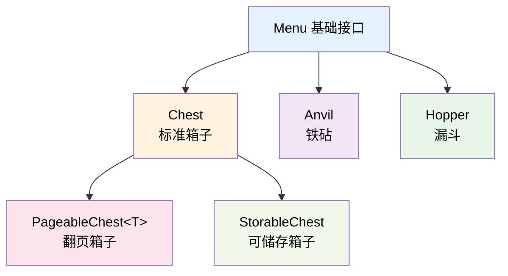

# 箱子菜单

TabooLib 提供了一套强大且易用的箱子界面（GUI）系统，让你可以通过简洁的 Kotlin DSL 语法快速构建交互式菜单。本模块支持多种容器类型，包括标准箱子、翻页箱子、可储存箱子、铁砧和漏斗等。

## 模块导入

在你的 `build.gradle.kts` 文件中添加以下配置：

```kotlin
taboolib {
    subproject = true
    install(BukkitUI)
}
```

**模块依赖：** 本模块需要在 Bukkit 平台上运行。

## 核心概念解析

### 菜单类型层次

TabooLib 的菜单系统提供了五种容器类型，它们都继承自基础的 `Menu` 接口：



- **Chest**：标准箱子容器，1-6 行可配置，支持字符布局映射
- **PageableChest**：翻页箱子，用于展示列表数据，支持翻页功能
- **StorableChest**：可储存箱子，允许玩家放入和取出物品
- **Anvil**：铁砧容器，支持重命名回调
- **Hopper**：漏斗容器，固定 5 格

### 字符布局映射系统

TabooLib 使用字符映射的方式来定义菜单布局，这是一种直观且易于维护的方式：

```
player.openMenu<Chest>("我的菜单") {
    rows(3)  // 3 行 = 27 格

    map(
        "####B####",  // 第 1 行：# 代表边框，B 代表按钮
        "#  @@@  #",  // 第 2 行：. 代表物品槽位，空格代表空位
        "####X####"   // 第 3 行：X 代表关闭按钮
    )
}
```

布局可视化：

**字符说明：**
- `#`：边框装饰物品
- `B`：功能按钮
- `@`：物品展示槽位
- `X`：关闭按钮
- 空格：空位

每个字符对应一类物品，通过 `set()` 方法设置物品和点击事件。

### 生命周期流程

一个菜单的完整生命周期如下：

```
1. 构建阶段 (Build)
   ↓
   openMenu<Chest>() 创建菜单
   ↓
   map() 设置布局
   ↓
   set() 设置物品
   ↓
   onClick() 设置点击回调
   ↓
   onBuild() 触发构建回调
   ↓
2. 显示阶段 (Display)
   ↓
   玩家看到菜单界面
   ↓
3. 交互阶段 (Interact)
   ↓
   玩家点击物品
   ↓
   onClick() 回调执行
   ↓
4. 关闭阶段 (Close)
   ↓
   玩家关闭菜单
   ↓
   onClose() 触发关闭回调
```

## 快速开始

### 第一个简单菜单

让我们创建一个最简单的箱子菜单：

```kotlin
import org.bukkit.Material
import org.bukkit.entity.Player
import taboolib.library.xseries.XMaterial
import taboolib.module.ui.openMenu
import taboolib.module.ui.type.Chest
import taboolib.platform.util.buildItem

fun Player.openSimpleMenu() {
    openMenu<Chest>("我的第一个菜单") {
        // 设置行数 (1-6 行)
        rows(3)

        // 设置物品
        set(13, buildItem(XMaterial.DIAMOND) {
            name = "§b点击我！"
            lore += "§7这是一个示例物品"
        }) {
            // 点击回调
            clicker.sendMessage("§a你点击了钻石！")
        }
    }
}
```

**代码说明：**
- `openMenu<Chest>()`：创建并打开一个标准箱子菜单
- `rows(3)`：设置菜单为 3 行（27 个格子）
- `set(13, ...)`：在第 13 号槽位（第二行中间）设置物品
- `buildItem()`：使用 TabooLib 的物品构建器创建物品
- 最后的 lambda `{ ... }`：设置点击事件回调

**关键点：**
- 槽位索引从 0 开始，第一行是 0-8，第二行是 9-17，第三行是 18-26
- 默认情况下所有点击都会被取消（物品不会被拿走）
- `clicker` 是点击菜单的玩家

## 字符布局映射（map）

### 使用 map() 设置布局

`map()` 方法允许你使用字符来可视化地定义菜单布局，这比直接使用槽位索引更直观：

```kotlin
fun Player.openLayoutMenu() {
    openMenu<Chest>("布局示例") {
        rows(5)

        // 使用字符定义布局
        map(
            "#########",
            "# # # # #",
            "# ..... #",
            "# # # # #",
            "###@X@###"
        )

        // 设置各个字符对应的物品
        set('#', XMaterial.BLACK_STAINED_GLASS_PANE) { name = "§7边框" }
        set('.', XMaterial.CHEST) { name = "§e物品格" }
        set('@', XMaterial.ARROW) { name = "§a功能按钮" }

        // 设置 X 字符的物品和点击事件
        set('X', buildItem(XMaterial.BARRIER) {
            name = "§c关闭菜单"
        }) {
            // 点击 X 时关闭菜单
            clicker.closeInventory()
        }
    }
}
```

**代码说明：**
- `map()` 接受多个字符串参数，每个字符串代表一行
- 每个字符串必须是 9 个字符长度（对应 9 个格子）
- 相同字符会设置相同的物品
- 空格字符表示空槽位
- `map()` 会自动根据行数设置 `rows()`，所以你可以省略 `rows()` 调用

**布局解析：**

```
字符映射到槽位：
#  #  #  #  #  #  #  #  #    →  槽位 0-8
#     #     #     #     #    →  槽位 9-17
#  .  .  .  .  .  .  .  #    →  槽位 18-26
#     #     #     #     #    →  槽位 27-35
#  #  #  @  X  @  #  #  #    →  槽位 36-44
```

### set() 方法的多种用法

`set()` 方法提供了多种重载形式：

```kotlin
openMenu<Chest>("set 方法示例") {
    map(
        "ABCDEFGH ",
        "         "
    )

    // 1. 通过字符设置物品
    set('A', buildItem(XMaterial.DIAMOND) {
        name = "§b钻石"
    })

    // 2. 通过字符设置物品和点击事件
    set('B', buildItem(XMaterial.EMERALD) {
        name = "§a绿宝石"
    }) {
        clicker.sendMessage("点击了绿宝石")
    }

    // 3. 通过字符使用 XMaterial 快捷设置
    set('C', XMaterial.GOLD_INGOT) {
        name = "§6金锭"
        lore += "§7使用 XMaterial 设置"
    }

    // 4. 通过字符设置动态物品
    set('D') {
        buildItem(XMaterial.CLOCK) {
            name = "§e当前时间"
            lore += "§7${System.currentTimeMillis()}"
        }
    }

    // 5. 通过槽位索引直接设置（不使用字符）
    set(8, buildItem(XMaterial.BARRIER) {
        name = "§c关闭"
    }) {
        clicker.closeInventory()
    }
}
```

**关键点：**
- 使用字符设置时，所有该字符对应的格子都会被设置相同的物品
- 使用 `set(Char)` 方法设置的物品，在菜单打开前就已经确定
- 使用 `set(Char) { lambda }` 形式的物品是动态生成的，每次打开菜单时重新生成
- 槽位索引和字符可以混用

### 获取字符对应的槽位

你可以在回调中获取字符对应的槽位信息：

```kotlin
openMenu<Chest>("槽位查询") {
    map(
        "A A A A A",
        "  BBBBB  "
    )

    set('A', XMaterial.RED_WOOL) { name = "§cA" }
    set('B', XMaterial.BLUE_WOOL) { name = "§9B" }

    onBuild { player, inv ->
        // 获取 'A' 字符对应的所有槽位
        val slotsA = getSlots('A')  // [0, 2, 4, 6, 8]

        // 获取 'B' 字符对应的第一个槽位
        val firstSlotB = getFirstSlot('B')  // 11

        // 根据槽位索引获取对应的字符
        val char = getSlot(0)  // 'A'

        player.sendMessage("A 字符槽位: $slotsA")
    }
}
```

**API 说明：**
- `getSlots(char: Char)`: 返回该字符对应的所有槽位列表
- `getFirstSlot(char: Char)`: 返回该字符对应的第一个槽位，如果不存在返回 -1
- `getSlot(slot: Int)`: 返回该槽位对应的字符，如果不存在返回空格 `' '`

## Chest 标准箱子

### 基础配置

Chest 是最基础的箱子容器，提供了丰富的配置选项：

```kotlin
fun Player.openConfigurableMenu() {
    openMenu<Chest>("配置示例") {
        // 设置行数 (1-6)
        rows(4)

        // 锁定手部动作（默认为 true）
        // 当设置为 true 时，玩家无法丢弃物品、使用数字键等
        handLocked(true)

        // 自定义 MenuHolder
        holder { menu ->
            // 你可以返回自定义的 MenuHolder
            MenuHolder(menu)
        }

        map(
            "#########",
            "#       #",
            "#       #",
            "#########"
        )

        set('#', XMaterial.GRAY_STAINED_GLASS_PANE) { name = " " }
    }
}
```

**参数说明：**
- `rows(rows: Int)`：设置箱子行数，取值范围 1-6
- `handLocked(locked: Boolean)`：是否锁定玩家手部操作，默认为 `true`
- `holder(func: (menu: Chest) -> MenuHolder)`：自定义 MenuHolder 创建逻辑

**关键点：**
- 当 `handLocked` 为 `true` 时，玩家无法将菜单中的物品拿出或进行数字键交换
- `rows()` 可以省略，如果使用了 `map()`，行数会自动根据 `map()` 的行数设置

### 点击事件处理

Chest 提供了三种方式来处理点击事件：

```kotlin
fun Player.openClickMenu() {
    openMenu<Chest>("点击事件示例") {
        rows(3)

        map(
            "##  A  ##",
            "## BBB ##",
            "##  C  ##"
        )

        set('#', XMaterial.GRAY_STAINED_GLASS_PANE) { name = " " }

        // 1. 绑定到特定字符
        onClick('A') {
            clicker.sendMessage("§a你点击了 A 位置")
            // isCancelled 默认为 true
        }

        // 2. 绑定到特定槽位
        onClick(13) {
            clicker.sendMessage("§b你点击了第 13 号槽位")
        }

        // 3. 监听整个页面的点击（不自动取消）
        onClick(lock = false) {
            clicker.sendMessage("§7你点击了槽位: $rawSlot")
            // 不会自动取消，需要手动设置
            isCancelled = true
        }

        // 设置物品并同时绑定点击事件
        set('C', buildItem(XMaterial.EMERALD) {
            name = "§a点击领取奖励"
        }) {
            clicker.sendMessage("§a领取成功！")
        }
    }
}
```

**代码说明：**
- `onClick(char: Char, callback)`：监听指定字符的点击，自动取消事件
- `onClick(slot: Int, callback)`：监听指定槽位的点击，自动取消事件
- `onClick(lock: Boolean, callback)`：监听全局点击，`lock` 为 `true` 时自动取消事件
- `set(char/slot, item) { onClick }`：设置物品时同时绑定点击事件

**ClickEvent 可用属性：**
- `clicker: Player`：点击玩家
- `inventory: Inventory`：当前箱子的 Inventory
- `rawSlot: Int`：点击的槽位索引（**2025-10-28 增强**）
- `slot: Char`：点击位置对应的字符
- `isCancelled: Boolean`：是否取消事件
- `currentItem: ItemStack?`：被点击的物品
- `cursorItem: ItemStack?`：光标上的物品（**2025-10-28 添加**）
- `clickEvent(): InventoryClickEvent`：获取原始点击事件
- `clickType: ClickType`：点击类型（CLICK, DRAG, VIRTUAL）
- `dragEvent(): InventoryDragEvent`：获取拖拽事件（**2025-10-28 增强**）

### 访问原始点击事件

如果你需要访问 Bukkit 的原始点击事件来获取更多信息：

```kotlin
onClick(13) {
    // 获取原始的 InventoryClickEvent
    val event = clickEvent()

    when (event.click) {
        ClickType.LEFT -> clicker.sendMessage("§a左键点击")
        ClickType.RIGHT -> clicker.sendMessage("§e右键点击")
        ClickType.SHIFT_LEFT -> clicker.sendMessage("§bShift + 左键")
        ClickType.MIDDLE -> clicker.sendMessage("§d鼠标中键")
        else -> {}
    }

    // 访问更多原始事件信息
    val action = event.action  // InventoryAction
    val cursor = event.cursor  // 光标上的物品
}
```

**关键点：**
- 使用 `clickEvent()` 获取 Bukkit 原始事件
- 只有 `ClickType.CLICK` 时才能调用 `clickEvent()`，否则会抛出异常
- 使用 `clickEventOrNull()` 进行安全的类型转换

### 拖拽交互处理

```kotlin
fun Player.openDragMenu() {
    openMenu<Chest>("拖拽示例") {
        rows(3)

        map(
            "###@###",
            "#######",
            "###X###"
        )

        set('#', XMaterial.BLACK_STAINED_GLASS_PANE) { name = " " }
        set('@', buildItem(XMaterial.HOPPER) { name = "§a拖拽区域" })
        set('X', buildItem(XMaterial.BARRIER) { name = "§c关闭" }) {
            clicker.closeInventory()
        }

        // 处理点击事件
        onClick {
            when (clickType) {
                ClickType.CLICK -> {
                    clicker.sendMessage("§e点击了槽位 $slot")
                }
                ClickType.DRAG -> {
                    val rawSlot = rawSlot
                    val cursorItem = cursorItem

                    if (rawSlot != -1) {
                        clicker.sendMessage("§a单槽位拖拽到 $rawSlot")
                        clicker.sendMessage("§b光标物品: ${cursorItem?.type ?: "空"}")

                        // 自定义拖拽逻辑
                        if (cursorItem != null && cursorItem.type != Material.AIR) {
                            // 将光标物品放入槽位
                            currentItem = cursorItem
                            // 清空光标
                            this.cursorItem = null
                        }
                    } else {
                        clicker.sendMessage("§c多槽位拖拽（未处理）")
                    }

                    isCancelled = true // 取消默认拖拽行为
                }
                else -> {}
            }
        }

        // 或者使用专用的拖拽处理方法
        onDrag { clickEvent ->
            val dragEvent = clickEvent.dragEvent()
            val draggedSlots = dragEvent.rawSlots

            clicker.sendMessage("§e拖拽了 ${draggedSlots.size} 个槽位")

            if (draggedSlots.size == 1) {
                val slot = draggedSlots.first()
                val cursorItem = clickEvent.cursorItem

                clicker.sendMessage("§a拖拽到槽位 $slot")

                // 处理单槽位拖拽
                if (cursorItem != null) {
                    inventory.setItem(slot, cursorItem)
                    clickEvent.cursorItem = null
                }
            }

            isCancelled = true
        }
    }
}
```

**拖拽处理的核心特性：**

1. **统一的属性访问**：
   - `rawSlot`：自动处理点击和拖拽的槽位索引
   - `cursorItem`：统一访问光标物品，支持点击和拖拽

2. **灵活的处理方式**：
   - 在 `onClick` 中通过 `clickType` 判断事件类型
   - 使用专用的 `onDrag` 方法处理拖拽事件
   - 支持自定义拖拽逻辑

3. **单槽位拖拽优化**：
   ```kotlin
   // 检测是否为单槽位拖拽
   if (clickType == ClickType.DRAG && rawSlot != -1) {
       // 单槽位拖拽处理
       // rawSlot 直接返回目标槽位
   }
   ```

**代码说明：**
- `onDrag { }`：专用拖拽事件处理器
- `cursorItem`：可读写的光标物品属性
- `rawSlot`：智能槽位索引，单槽位拖拽时返回具体槽位
- `isCancelled = true`：取消默认拖拽行为，实现自定义逻辑

:::tip[最佳实践]
对于复杂的拖拽交互，推荐：
1. 使用 `onDrag` 方法专门处理拖拽事件
2. 检查 `rawSlot` 来区分单槽位和多槽位拖拽
3. 通过 `cursorItem` 属性管理光标物品
4. 设置 `isCancelled = true` 来实现自定义拖拽逻辑
:::

### 生命周期回调

Chest 提供了构建和关闭两个生命周期回调：

```kotlin
fun Player.openLifecycleMenu() {
    openMenu<Chest>("生命周期示例") {
        rows(3)

        // 页面构建时触发（同步执行）
        onBuild { player, inventory ->
            player.sendMessage("§a菜单正在构建...")

            // 在这里可以动态设置物品
            inventory.setItem(13, buildItem(XMaterial.CLOCK) {
                name = "§e当前时间"
                lore += "§7${System.currentTimeMillis()}"
            })
        }

        // 页面构建时触发（异步执行）
        // highlight-start
        onBuild(async = true) { player, inventory ->
            // 异步获取数据（不阻塞主线程）
            val data = fetchDataFromDatabase(player)

            // 异步操作完成后更新物品
            submit {
                inventory.setItem(14, buildItem(XMaterial.BOOK) {
                    name = "§b数据"
                    lore += data.toString()
                })
            }
        }
        // highlight-end

        // 页面关闭时触发
        onClose { event ->
            val player = event.player as Player
            player.sendMessage("§c菜单已关闭")

            // 可以在这里返还物品
            event.returnItems(listOf(10, 11, 12))
        }

        map(
            "#########",
            "#        #",
            "#########"
        )

        set('#', XMaterial.GRAY_STAINED_GLASS_PANE) { name = " " }
    }
}
```

**代码说明：**
- `onBuild(async: Boolean = false, callback)`：菜单构建时触发
  - `async = false`：在主线程同步执行
  - `async = true`：在异步线程执行，适合耗时操作
- `onClose(once: Boolean = true, skipUpdateTitle: Boolean = true, callback)`：菜单关闭时触发
  - `once`：是否只触发一次，默认 `true`（防止客户端重复触发）
  - `skipUpdateTitle`：使用 `updateTitle()` 时是否跳过关闭回调，默认 `true`

**关键点：**
- `onBuild` 可以多次调用，所有回调都会执行
- 同步的 `onBuild` 先执行，然后执行异步的 `onBuild`
- 异步操作中修改 Inventory 需要使用 `submit {}` 切换回主线程
- `onClose` 接收 `InventoryCloseEvent` 参数

### 动态更新标题

你可以在菜单打开后动态更新标题：

```kotlin
fun Player.openDynamicTitleMenu() {
    openMenu<Chest>("初始标题") {
        rows(3)

        map(
            "#########",
            "####U####",
            "#########"
        )

        set('#', XMaterial.GRAY_STAINED_GLASS_PANE) { name = " " }

        set('U', buildItem(XMaterial.NAME_TAG) {
            name = "§e更新标题"
            lore += "§7点击更新菜单标题"
        }) {
            // 更新标题
            updateTitle("§a新标题 - ${System.currentTimeMillis()}")
        }
    }
}
```

**代码说明：**
- `updateTitle(title: String)`：动态更新菜单标题
- 更新标题时会重新构建整个菜单，但不会触发 `onClose` 回调（如果 `skipUpdateTitle = true`）
- 菜单会保持打开状态，玩家不会感知到关闭和重开的过程

**注意事项：**
- 频繁调用 `updateTitle()` 可能导致性能问题
- 更新标题时会重新执行 `onBuild` 回调
- 虚拟化菜单的标题更新行为可能不同

## PageableChest 翻页箱子

### 基础用法

PageableChest 用于展示列表数据，支持翻页功能。它是泛型类型 `PageableChest<T>`，可以展示任何类型的元素：

```kotlin
data class Item(val name: String, val price: Int)

fun Player.openShopMenu() {
    // 商品列表
    val items = listOf(
        Item("钻石剑", 100),
        Item("钻石镐", 80),
        Item("钻石铲", 60),
        Item("钻石斧", 70),
        Item("附魔书", 50),
        // ... 更多商品
    )

    openMenu<PageableChest<Item>>("商店") {
        rows(6)

        map(
            "#########",
            "#@@@@@@@#",
            "#@@@@@@@#",
            "#@@@@@@@#",
            "#@@@@@@@#",
            "###B#C###"
        )

        set('#', XMaterial.GRAY_STAINED_GLASS_PANE) { name = " " }

        // 设置可用槽位（通过字符）
        slotsBy('@')

        // 设置元素列表
        elements { items }

        // 生成每个元素对应的物品
        onGenerate { player, element, index, slot ->
            buildItem(XMaterial.DIAMOND_SWORD) {
                name = "§e${element.name}"
                lore += "§7价格: §6${element.price} 金币"
                lore += "§7索引: §b$index"
                lore += "§7槽位: §a$slot"
            }
        }

        // 元素点击事件
        onClick { event, element ->
            event.clicker.sendMessage("§a你购买了: ${element.name}")
        }

        // 设置下一页按钮
        setNextPage(49) { page, hasNextPage ->
            buildItem(if (hasNextPage) XMaterial.ARROW else XMaterial.GRAY_STAINED_GLASS_PANE) {
                name = if (hasNextPage) "§a下一页" else "§7没有下一页了"
                lore += "§7当前页: §e${page + 1}"
            }
        }

        // 设置上一页按钮
        setPreviousPage(47) { page, hasPreviousPage ->
            buildItem(if (hasPreviousPage) XMaterial.ARROW else XMaterial.GRAY_STAINED_GLASS_PANE) {
                name = if (hasPreviousPage) "§a上一页" else "§7已经是第一页了"
                lore += "§7当前页: §e${page + 1}"
            }
        }
    }
}
```

**代码说明：**
- `PageableChest<Item>`：泛型参数 `Item` 是列表元素的类型
- `slotsBy('@')`：设置 `@` 字符对应的槽位为可用槽位
- `elements { list }`：提供元素列表
- `onGenerate { player, element, index, slot -> ItemStack }`：为每个元素生成对应的物品
  - `player`：打开菜单的玩家
  - `element`：当前元素
  - `index`：元素在当前页的索引（0 开始）
  - `slot`：物品显示的槽位
- `onClick { event, element -> }`：元素点击事件，接收 `ClickEvent` 和元素对象
- `setNextPage(slot, callback)`：设置下一页按钮
- `setPreviousPage(slot, callback)`：设置上一页按钮

### 页面配置

PageableChest 提供了丰富的页面配置选项：

```kotlin
fun Player.openConfiguredPageableMenu() {
    openMenu<PageableChest<String>>("配置示例") {
        rows(5)

        // 设置初始页数（默认为 0）
        page(0)

        // 锁定所有位置（默认为 true）
        // 如果为 true，元素所在的槽位也会被锁定，只能触发 onClick 回调
        menuLocked(true)

        // 方式 1：通过字符设置可用槽位
        map(
            "#########",
            "#@@@@@@@#",
            "#@@@@@@@#",
            "#########",
            "###<#>###"
        )
        slotsBy('@')

        // 方式 2：手动指定槽位列表
        // slots(listOf(10, 11, 12, 13, 14, 15, 16, 19, 20, 21, 22, 23, 24, 25))

        set('#', XMaterial.BLACK_STAINED_GLASS_PANE) { name = " " }

        elements { listOf("A", "B", "C", "D", "E", "F", "G") }

        onGenerate { _, element, _, _ ->
            buildItem(XMaterial.PAPER) {
                name = "§e元素: $element"
            }
        }

        onClick { event, element ->
            event.clicker.sendMessage("点击了: $element")
        }

        // 设置翻页按钮（支持循环翻页）
        setNextPage(40, roll = true) { page, hasNext ->
            buildItem(XMaterial.ARROW) {
                name = "§a下一页"
                lore += if (hasNext) "§7点击前往下一页" else "§7点击返回第一页（循环）"
            }
        }

        setPreviousPage(38, roll = true) { page, hasPrevious ->
            buildItem(XMaterial.ARROW) {
                name = "§a上一页"
                lore += if (hasPrevious) "§7点击返回上一页" else "§7点击前往最后一页（循环）"
            }
        }

        // 页面切换回调
        onPageChange { player ->
            player.sendMessage("§e切换到第 ${page + 1} 页")
        }
    }
}
```

**API 说明：**
- `page(page: Int)`：设置初始页数，从 0 开始
- `menuLocked(locked: Boolean)`：是否锁定所有槽位，默认 `true`
- `slots(slots: List<Int>)`：手动设置可用槽位列表
- `slotsBy(char: Char)`：通过字符设置可用槽位（推荐）
- `setNextPage(slot, roll, callback)`：设置下一页按钮，`roll` 为 `true` 时支持循环翻页
- `setPreviousPage(slot, roll, callback)`：设置上一页按钮，`roll` 为 `true` 时支持循环翻页
- `onPageChange { player -> }`：页面切换回调
- `hasPreviousPage(): Boolean`：是否有上一页
- `hasNextPage(): Boolean`：是否有下一页

### 动态元素列表

元素列表可以是动态的，每次打开菜单时重新获取：

```kotlin
fun Player.openDynamicMenu() {
    openMenu<PageableChest<Player>>("在线玩家列表") {
        rows(6)

        map(
            "#########",
            "#@@@@@@@#",
            "#@@@@@@@#",
            "#@@@@@@@#",
            "#@@@@@@@#",
            "###<#>###"
        )

        set('#', XMaterial.GRAY_STAINED_GLASS_PANE) { name = " " }
        slotsBy('@')

        // 动态获取在线玩家列表
        elements {
            Bukkit.getOnlinePlayers().toList()
        }

        onGenerate { _, player, _, _ ->
            buildItem(XMaterial.PLAYER_HEAD) {
                name = "§e${player.name}"
                lore += "§7等级: §a${player.level}"
                lore += "§7生命值: §c${player.health}/${player.maxHealth}"
            }
        }

        onClick { event, targetPlayer ->
            event.clicker.sendMessage("§a你点击了: ${targetPlayer.name}")
            event.clicker.teleport(targetPlayer.location)
        }

        // 刷新按钮
        set(40, buildItem(XMaterial.COMPASS) {
            name = "§a刷新列表"
        }) {
            // 重置元素列表缓存
            resetElementsCache()
            // 重新打开菜单
            clicker.openDynamicMenu()
        }

        setNextPage(49) { _, hasNext ->
            buildItem(if (hasNext) XMaterial.ARROW else XMaterial.BARRIER) {
                name = if (hasNext) "§a下一页" else "§7没有下一页"
            }
        }

        setPreviousPage(47) { _, hasPrevious ->
            buildItem(if (hasPrevious) XMaterial.ARROW else XMaterial.BARRIER) {
                name = if (hasPrevious) "§a上一页" else "§7没有上一页"
            }
        }
    }
}
```

**关键点：**
- `elements { }` 返回的列表会被缓存，不会每次翻页都重新获取
- 使用 `resetElementsCache()` 重置缓存，下次打开时会重新获取
- 元素列表的缓存在每次调用 `build()` 时更新

### 异步生成物品

对于需要耗时操作的物品生成（如从数据库加载数据），可以使用异步生成：

```kotlin
fun Player.openAsyncMenu() {
    openMenu<PageableChest<String>>("异步加载") {
        rows(4)

        map(
            "#########",
            "#@@@@@@@#",
            "#@@@@@@@#",
            "###<#>###"
        )

        set('#', XMaterial.GRAY_STAINED_GLASS_PANE) { name = " " }
        slotsBy('@')

        elements { listOf("uuid1", "uuid2", "uuid3", "uuid4") }

        // 异步生成物品
        onGenerate(async = true) { player, uuid, index, slot ->
            // 这里执行异步操作（不阻塞主线程）
            val playerData = loadPlayerDataFromDatabase(uuid)

            // 返回物品
            buildItem(XMaterial.PLAYER_HEAD) {
                name = "§e${playerData.name}"
                lore += "§7UUID: §7$uuid"
                lore += "§7数据加载完成"
            }
        }

        onClick { event, uuid ->
            event.clicker.sendMessage("点击了 UUID: $uuid")
        }

        setNextPage(30) { _, hasNext ->
            buildItem(if (hasNext) XMaterial.ARROW else XMaterial.BARRIER) {
                name = if (hasNext) "§a下一页" else "§7没有下一页"
            }
        }

        setPreviousPage(28) { _, hasPrevious ->
            buildItem(if (hasPrevious) XMaterial.ARROW else XMaterial.BARRIER) {
                name = if (hasPrevious) "§a上一页" else "§7没有上一页"
            }
        }
    }
}
```

**代码说明：**
- `onGenerate(async = true) { }`：在异步线程中生成物品
- 异步生成适合需要从数据库、网络等耗时操作加载数据的场景
- 异步生成的物品会在加载完成后自动设置到对应的槽位

**注意事项：**
- 异步生成时不要直接访问 Bukkit API，除非使用 `submit {}` 切换到主线程
- 异步操作完成前，对应槽位会显示空气方块
- 不要在异步回调中执行过长的操作，避免玩家等待时间过长

## 虚拟化功能

### 什么是虚拟化

虚拟化菜单是一种特殊的菜单类型，它不使用 Bukkit 原生的 Inventory 系统，而是通过数据包模拟箱子界面。虚拟化菜单的主要特点：

- **隐藏玩家背包**：可以完全隐藏玩家自己的背包
- **自动锁定**：虚拟化菜单会自动阻止所有点击行为
- **跨版本兼容**：更好的跨版本兼容性

### 基础虚拟化

最简单的虚拟化用法：

```kotlin
fun Player.openVirtualMenu() {
    openMenu<Chest>("虚拟化菜单") {
        rows(3)

        // 启用虚拟化
        virtualize()

        map(
            "#########",
            "#   A   #",
            "#########"
        )

        set('#', XMaterial.GRAY_STAINED_GLASS_PANE) { name = " " }

        set('A', buildItem(XMaterial.DIAMOND) {
            name = "§b虚拟化的钻石"
            lore += "§7这是一个虚拟化菜单"
        }) {
            clicker.sendMessage("§a点击了虚拟化物品")
        }
    }
}
```

**代码说明：**
- `virtualize()`：启用虚拟化，会自动阻止所有点击行为
- 虚拟化菜单中的物品无法被拿出
- 玩家背包仍然可见，但无法与之交互

### 隐藏玩家背包

使用 `hidePlayerInventory()` 可以完全隐藏玩家的背包：

```kotlin
fun Player.openHiddenInventoryMenu() {
    openMenu<Chest>("隐藏背包菜单") {
        rows(3)

        // 隐藏玩家背包（自动启用虚拟化）
        hidePlayerInventory()

        map(
            "#########",
            "#  ABC  #",
            "#########"
        )

        set('#', XMaterial.BLACK_STAINED_GLASS_PANE) { name = " " }

        set('A', XMaterial.DIAMOND) {
            name = "§b钻石"
        }

        set('B', XMaterial.EMERALD) {
            name = "§a绿宝石"
        }

        set('C', XMaterial.GOLD_INGOT) {
            name = "§6金锭"
        }

        onClick { event ->
            event.clicker.sendMessage("§7点击了槽位: ${event.rawSlot}")
        }
    }
}
```

**代码说明：**
- `hidePlayerInventory()`：隐藏玩家背包并启用虚拟化
- 玩家只能看到菜单内容，看不到自己的背包
- 适合制作全屏显示的界面

### 自定义虚拟背包内容

你可以自定义虚拟化时显示的背包内容：

```kotlin
fun Player.openCustomVirtualMenu() {
    openMenu<Chest>("自定义虚拟背包") {
        rows(6)

        // 自定义虚拟背包内容（36 个槽位）
        val customInventory = (0 until 36).map {
            when (it % 3) {
                0 -> buildItem(XMaterial.RED_STAINED_GLASS_PANE) { name = "§c红色" }
                1 -> buildItem(XMaterial.GREEN_STAINED_GLASS_PANE) { name = "§a绿色" }
                else -> buildItem(XMaterial.BLUE_STAINED_GLASS_PANE) { name = "§9蓝色" }
            }
        }

        virtualize(customInventory)

        map(
            "#########",
            "#       #",
            "#   C   #",
            "#       #",
            "#########",
            "#########"
        )

        set('#', XMaterial.GRAY_STAINED_GLASS_PANE) { name = " " }

        set('C', buildItem(XMaterial.COMPASS) {
            name = "§e关闭菜单"
        }) {
            clicker.closeInventory()
        }
    }
}
```

**代码说明：**
- `virtualize(storageContents: List<ItemStack>?)`：启用虚拟化并自定义背包内容
- 传入的列表应该包含 36 个元素（对应玩家背包的 36 个格子）
- 如果传入 `null`，则显示玩家真实的背包内容（但无法交互）

### 虚拟化的 PageableChest

PageableChest 也支持虚拟化：

```kotlin
fun Player.openVirtualPageableMenu() {
    openMenu<PageableChest<String>>("虚拟化翻页菜单") {
        rows(6)

        // 隐藏玩家背包
        hidePlayerInventory()

        map(
            "#########",
            "#@@@@@@@#",
            "#@@@@@@@#",
            "#@@@@@@@#",
            "#@@@@@@@#",
            "###<#>###"
        )

        set('#', XMaterial.BLACK_STAINED_GLASS_PANE) { name = " " }
        slotsBy('@')

        elements {
            ('A'..'Z').map { it.toString() }
        }

        onGenerate { _, element, index, _ ->
            buildItem(XMaterial.PAPER) {
                name = "§e元素 $element"
                lore += "§7索引: $index"
            }
        }

        onClick { event, element ->
            event.clicker.sendMessage("§a点击了元素: $element")
        }

        setNextPage(40) { _, hasNext ->
            buildItem(if (hasNext) XMaterial.ARROW else XMaterial.BARRIER) {
                name = if (hasNext) "§a下一页" else "§7最后一页"
            }
        }

        setPreviousPage(38) { _, hasPrevious ->
            buildItem(if (hasPrevious) XMaterial.ARROW else XMaterial.BARRIER) {
                name = if (hasPrevious) "§a上一页" else "§7第一页"
            }
        }
    }
}
```

**关键点：**
- 虚拟化的 PageableChest 翻页时会重新构建虚拟界面
- 所有交互都通过虚拟事件处理，性能更好
- 适合需要大量翻页操作的场景

### 虚拟化注意事项

**重要提示：**

1. **关闭方式**：
   ```kotlin
   // ❌ 错误：使用 player.closeInventory() 不会触发 onClose 回调
   set('X', ...) {
       clicker.closeInventory()  // 虚拟化菜单不推荐这样关闭
   }

   // ✅ 正确：虚拟化菜单建议不设置 onClose，或者使用其他方式处理关闭逻辑
   ```

2. **性能考虑**：
   - 虚拟化菜单使用数据包通信，在高频更新时可能有网络开销
   - 不要在虚拟化菜单中进行过于频繁的物品更新

3. **兼容性**：
   - 虚拟化功能在某些特殊版本上可能有兼容性问题
   - 建议在目标服务器版本上充分测试

4. **适用场景**：
   - 需要完全控制界面显示的场景
   - 需要隐藏玩家背包的场景
   - 大量翻页操作的列表界面

## 扩展方法

TabooLib 提供了一系列实用的扩展方法，用于处理复杂的交互场景。这些扩展方法主要用于 `ClickEvent` 和 `InventoryCloseEvent`。

### returnItems - 返还物品

在菜单关闭时返还特定槽位的物品给玩家：

```kotlin
fun Player.openTemporaryStorageMenu() {
    openMenu<Chest>("临时存储") {
        rows(3)

        map(
            "#########",
            "# ..... #",
            "#########"
        )

        set('#', XMaterial.GRAY_STAINED_GLASS_PANE) { name = " " }

        // 设置可放置物品的槽位（空槽位）
        // 玩家可以将物品放入这些槽位

        onClose { event ->
            // 返还指定槽位的物品
            val slots = listOf(10, 11, 12, 13, 14, 15, 16)
            event.returnItems(slots)

            val player = event.player as Player
            player.sendMessage("§a物品已返还到你的背包")
        }
    }
}
```

**代码说明：**
- `InventoryCloseEvent.returnItems(slots: List<Int>)`：返还指定槽位的物品
- 物品会自动添加到玩家背包，如果背包满了会掉落在地上
- 常用于临时存储、制作台等场景

### lockSlots - 锁定槽位

锁定特定槽位的交互，防止玩家对这些槽位进行操作：

```kotlin
fun Player.openPartialLockMenu() {
    openMenu<Chest>("部分锁定菜单") {
        rows(3)

        map(
            "#########",
            "# ABC   #",
            "#########"
        )

        set('#', XMaterial.GRAY_STAINED_GLASS_PANE) { name = " " }
        set('A', XMaterial.DIAMOND) { name = "§b锁定的钻石" }
        set('B', XMaterial.EMERALD) { name = "§a锁定的绿宝石" }
        set('C', XMaterial.GOLD_INGOT) { name = "§6锁定的金锭" }

        onClick(lock = false) { event ->
            // 锁定前三行的所有槽位（0-26）
            val lockedSlots = (0..26).toList()
            event.lockSlots(lockedSlots)

            // 现在只有第 27-53 槽位可以交互（玩家背包）
        }
    }
}
```

**代码说明：**
- `ClickEvent.lockSlots(rawSlots: List<Int>, reverse: Boolean = false)`：锁定指定槽位
  - `rawSlots`：要锁定的槽位列表
  - `reverse`：反向锁定，如果为 `true`，则只保留 `rawSlots` 中的槽位可交互
- 锁定的槽位无法被点击、拖拽或进行任何交互
- 自动阻止 `MOVE_TO_OTHER_INVENTORY` 和 `COLLECT_TO_CURSOR` 等操作

**反向锁定示例：**

```kotlin
onClick(lock = false) { event ->
    // 反向锁定：只允许槽位 10-16 可以交互
    val allowedSlots = (10..16).toList()
    event.lockSlots(allowedSlots, reverse = true)
}
```

### conditionSlot - 条件槽位

创建条件槽位，只有满足条件的物品才能放入或取出：

```kotlin
fun Player.openConditionalMenu() {
    openMenu<Chest>("条件槽位菜单") {
        rows(3)

        map(
            "#########",
            "# A   B #",
            "#########"
        )

        set('#', XMaterial.GRAY_STAINED_GLASS_PANE) { name = " " }

        // A 槽位：只能放入钻石相关物品
        set('A', buildItem(XMaterial.DIAMOND_BLOCK) {
            name = "§b钻石槽位"
            lore += "§7只能放入钻石相关物品"
        })

        // B 槽位：只能放入食物
        set('B', buildItem(XMaterial.BREAD) {
            name = "§6食物槽位"
            lore += "§7只能放入食物"
        })

        onClick(lock = false) { event ->
            val diamondSlot = getFirstSlot('A')
            val foodSlot = getFirstSlot('B')

            // 钻石槽位条件：只能放入钻石相关物品
            event.conditionSlot(diamondSlot,
                condition = { put, out ->
                    // put: 要放入的物品，out: 要取出的物品
                    if (put != null) {
                        put.type.name.contains("DIAMOND")
                    } else {
                        true  // 允许取出
                    }
                },
                failedCallback = {
                    event.clicker.sendMessage("§c只能放入钻石相关物品！")
                }
            )

            // 食物槽位条件：只能放入可食用物品
            event.conditionSlot(foodSlot,
                condition = { put, out ->
                    if (put != null) {
                        put.type.isEdible
                    } else {
                        true
                    }
                },
                failedCallback = {
                    event.clicker.sendMessage("§c只能放入食物！")
                }
            )
        }
    }
}
```

**代码说明：**
- `ClickEvent.conditionSlot(rawSlot: Int, condition: (put: ItemStack?, out: ItemStack?) -> Boolean, failedCallback: () -> Unit)`
  - `rawSlot`：槽位索引
  - `condition`：条件检查函数，返回 `true` 表示允许操作
    - `put`：要放入的物品（null 表示不放入）
    - `out`：要取出的物品（null 表示不取出）
  - `failedCallback`：条件检查失败时的回调
- 自动处理各种点击类型（左键、右键、Shift 点击、拖拽等）
- 返回 `Boolean` 值，`true` 表示操作被允许，`false` 表示操作被阻止

**支持的操作类型：**
- 普通点击（SWAP_WITH_CURSOR, PICKUP_ALL, PLACE_ALL）
- 部分放置/拾取（PICKUP_HALF, PICKUP_ONE, PLACE_ONE, PLACE_SOME）
- 快捷键交换（HOTBAR_SWAP）
- 拖拽（DRAG）

### amountCondition - 数量限制

限制槽位的最大堆叠数量：

```kotlin
fun Player.openAmountLimitMenu() {
    openMenu<Chest>("数量限制菜单") {
        rows(3)

        map(
            "#########",
            "# A   B #",
            "#########"
        )

        set('#', XMaterial.GRAY_STAINED_GLASS_PANE) { name = " " }

        set('A', buildItem(XMaterial.CHEST) {
            name = "§e限制 10 个"
            lore += "§7最多只能放 10 个物品"
        })

        set('B', buildItem(XMaterial.BARREL) {
            name = "§e限制 1 个"
            lore += "§7最多只能放 1 个物品"
        })

        onClick(lock = false) { event ->
            val slotA = getFirstSlot('A')
            val slotB = getFirstSlot('B')

            // A 槽位：最多 10 个
            event.amountCondition(slotA, amount = 10) {
                event.clicker.sendMessage("§c该槽位最多只能放 10 个物品！")
            }

            // B 槽位：最多 1 个（单个物品）
            event.amountCondition(slotB, amount = 1) {
                event.clicker.sendMessage("§c该槽位只能放 1 个物品！")
            }
        }
    }
}
```

**代码说明：**
- `ClickEvent.amountCondition(rawSlot: Int, amount: Int, failedCallback: () -> Unit)`
  - `rawSlot`：槽位索引
  - `amount`：允许的最大数量
  - `failedCallback`：超过数量限制时的回调
- 返回 `Boolean` 值，`true` 表示数量符合要求，`false` 表示超过限制
- 自动处理各种放置操作（放置全部、放置一个、放置部分等）

### 组合使用扩展方法

扩展方法可以组合使用，创建更复杂的交互逻辑：

```kotlin
fun Player.openAdvancedMenu() {
    openMenu<Chest>("高级交互菜单") {
        rows(4)

        map(
            "#########",
            "# ABC   #",
            "#   D   #",
            "#########"
        )

        set('#', XMaterial.GRAY_STAINED_GLASS_PANE) { name = " " }

        set('A', buildItem(XMaterial.DIAMOND) {
            name = "§b钻石槽（最多 10 个）"
        })

        set('B', buildItem(XMaterial.EMERALD) {
            name = "§a绿宝石槽（最多 5 个）"
        })

        set('C', buildItem(XMaterial.GOLD_INGOT) {
            name = "§6金锭槽（最多 1 个）"
        })

        onClick(lock = false) { event ->
            val slotA = getFirstSlot('A')
            val slotB = getFirstSlot('B')
            val slotC = getFirstSlot('C')

            // 组合条件：钻石槽位只能放钻石，且最多 10 个
            if (event.conditionSlot(slotA, { put, _ ->
                put == null || put.type.name.contains("DIAMOND")
            }, {
                event.clicker.sendMessage("§c只能放入钻石！")
            })) {
                event.amountCondition(slotA, 10) {
                    event.clicker.sendMessage("§c最多 10 个！")
                }
            }

            // 绿宝石槽位
            if (event.conditionSlot(slotB, { put, _ ->
                put == null || put.type.name.contains("EMERALD")
            }, {
                event.clicker.sendMessage("§c只能放入绿宝石！")
            })) {
                event.amountCondition(slotB, 5) {
                    event.clicker.sendMessage("§c最多 5 个！")
                }
            }

            // 金锭槽位：单个物品
            if (event.conditionSlot(slotC, { put, _ ->
                put == null || put.type.name.contains("GOLD_INGOT")
            }, {
                event.clicker.sendMessage("§c只能放入金锭！")
            })) {
                event.amountCondition(slotC, 1) {
                    event.clicker.sendMessage("§c只能放 1 个！")
                }
            }

            // 锁定其他所有槽位
            val allowedSlots = listOf(slotA, slotB, slotC)
            event.lockSlots(allowedSlots, reverse = true)
        }

        onClose { event ->
            // 关闭时返还物品
            val slots = listOf(getFirstSlot('A'), getFirstSlot('B'), getFirstSlot('C'))
            event.returnItems(slots)
        }
    }
}
```

**关键点：**
- 扩展方法返回 `Boolean` 值，可以用于链式判断
- 先执行 `conditionSlot` 检查物品类型，再执行 `amountCondition` 检查数量
- 使用 `lockSlots` 防止玩家操作其他槽位
- 使用 `returnItems` 在关闭时返还物品

## 其他容器类型

除了标准的 Chest 和 PageableChest，TabooLib 还提供了其他特殊类型的容器。

### Anvil - 铁砧容器

Anvil 容器可以让玩家输入文本，常用于重命名或文本输入场景：

```kotlin
fun Player.openAnvilInput() {
    openMenu<Anvil>("请输入名称") {
        // 铁砧容器固定 3 个槽位
        // 槽位 0: 输入槽
        // 槽位 1: 材料槽
        // 槽位 2: 输出槽

        // 设置输入槽的初始物品（带默认文本）
        set(0, buildItem(XMaterial.PAPER) {
            name = "默认名称"
        })

        // 监听重命名事件
        onRename { player, text, inventory ->
            player.sendMessage("§a你输入了: $text")

            // 可以在这里验证输入
            if (text.length > 16) {
                player.sendMessage("§c名称太长！最多 16 个字符")
                return@onRename
            }

            // 更新输出槽的物品
            inventory.setItem(2, buildItem(XMaterial.NAME_TAG) {
                name = "§e$text"
                lore += "§7你输入的名称"
            })
        }

        // 点击输出槽
        onClick(2) {
            val item = inventory.getItem(2)
            if (item != null && item.type != Material.AIR) {
                clicker.inventory.addItem(item)
                clicker.sendMessage("§a已确认输入")
                clicker.closeInventory()
            }
        }
    }
}
```

**代码说明：**
- Anvil 容器固定 3 个槽位
- `onRename(callback: (Player, String, Inventory) -> Unit)`：监听玩家输入文本
  - `player`：玩家
  - `text`：玩家输入的文本
  - `inventory`：铁砧的 Inventory
- 铁砧容器常用于需要玩家输入文本的场景
- 输入的文本通过 `onRename` 回调获取

**适用场景：**
- 玩家重命名物品
- 输入数字或文本
- 搜索功能
- 创建自定义名称

### Hopper - 漏斗容器

Hopper 容器是固定 5 个槽位的小型容器：

```kotlin
fun Player.openHopperMenu() {
    openMenu<Hopper>("快速选择") {
        // Hopper 固定 5 个槽位（0-4）

        map(" ABCD ")  // 5 个字符对应 5 个槽位

        set('A', buildItem(XMaterial.DIAMOND_SWORD) {
            name = "§b战斗"
        }) {
            clicker.sendMessage("§a选择了战斗模式")
            clicker.closeInventory()
        }

        set('B', buildItem(XMaterial.DIAMOND_PICKAXE) {
            name = "§e采矿"
        }) {
            clicker.sendMessage("§a选择了采矿模式")
            clicker.closeInventory()
        }

        set('C', buildItem(XMaterial.WHEAT) {
            name = "§2农业"
        }) {
            clicker.sendMessage("§a选择了农业模式")
            clicker.closeInventory()
        }

        set('D', buildItem(XMaterial.FISHING_ROD) {
            name = "§9钓鱼"
        }) {
            clicker.sendMessage("§a选择了钓鱼模式")
            clicker.closeInventory()
        }
    }
}
```

**代码说明：**
- Hopper 容器固定 5 个槽位（0-4）
- 使用 `map()` 时，字符串长度必须是 5
- 继承自 Chest，支持所有 Chest 的功能
- 适合制作简单的选择菜单或快捷菜单

**适用场景：**
- 快速选择菜单
- 模式切换
- 简单的选项列表

### StorableChest - 可储存箱子

StorableChest 允许玩家放入和取出物品，并提供了规则系统来控制物品的存取：

```kotlin
fun Player.openStorableMenu() {
    openMenu<StorableChest>("存储箱") {
        rows(3)

        map(
            "#########",
            "# ..... #",
            "#########"
        )

        set('#', XMaterial.GRAY_STAINED_GLASS_PANE) { name = " " }

        // 定义存储规则
        rule {
            // 定义可存储的槽位（10-16）
            checkSlot(10..16) { inventory, itemStack ->
                // 检查是否可以放入该物品
                // 返回 true 允许，false 拒绝
                when {
                    itemStack.type.name.contains("DIAMOND") -> true
                    itemStack.type.name.contains("EMERALD") -> true
                    itemStack.type.name.contains("GOLD") -> true
                    else -> {
                        (event.whoClicked as Player).sendMessage("§c只能存储贵重物品！")
                        false
                    }
                }
            }

            // 定义首个可用槽位（用于 Shift 快速放入）
            firstSlot { inventory, itemStack ->
                // 返回首个可用的槽位索引
                (10..16).firstOrNull { slot ->
                    val item = inventory.getItem(slot)
                    item == null || item.type == Material.AIR
                } ?: -1
            }

            // 物品写入回调
            writeItem { inventory, itemStack, slot, clickType ->
                // 当物品被放入时触发
                (event.whoClicked as Player).sendMessage("§a物品已存储到槽位 $slot")
            }

            // 物品读取回调
            readItem { inventory, slot ->
                // 返回该槽位的物品
                inventory.getItem(slot)
            }

            // Shift 交换规则（2025-10-27 添加）
            shiftSwap { inventory, itemStack, slot ->
                // 控制是否允许 Shift 键交换物品
                // 返回 true 允许交换，false 禁止交换
                when {
                    itemStack.type == Material.BARRIER -> false // 禁止交换障碍物
                    itemStack.type.name.contains("DIAMOND") -> true // 允许交换钻石物品
                    else -> true // 默认允许
                }
            }
        }

        onClose { event ->
            // 关闭时返还物品
            event.returnItems((10..16).toList())
        }
    }
}
```

**代码说明：**
- `rule { }`：定义存储规则
  - `checkSlot(intRange: IntRange, callback)`：检查槽位是否可以放入物品
  - `checkSlot(slot: Int, callback)`：检查单个槽位
  - `checkSlot(callback)`：自定义检查逻辑
  - `firstSlot { }`：定义首个可用槽位（用于 Shift 快速放入）
  - `writeItem { }`：物品写入回调
  - `readItem { }`：物品读取回调
  - `shiftSwap { }`：**（2025-10-27 添加）** 定义 Shift 键物品交换规则
- StorableChest 继承自 Chest，支持所有 Chest 的功能
- 规则系统提供了细粒度的物品存取控制

**完整示例 - 背包扩展：**

```kotlin
fun Player.openBackpackExtension() {
    openMenu<StorableChest>("背包扩展") {
        rows(5)

        map(
            "#########",
            "#@@@@@@@#",
            "#@@@@@@@#",
            "#@@@@@@@#",
            "#########"
        )

        set('#', XMaterial.BLACK_STAINED_GLASS_PANE) { name = " " }

        val storageSlots = (10..34).toList()

        rule {
            // 允许所有物品存储
            checkSlot { inventory, itemStack, slot ->
                slot in storageSlots
            }

            // 首个可用槽位
            firstSlot { inventory, itemStack ->
                storageSlots.firstOrNull { slot ->
                    val item = inventory.getItem(slot)
                    item == null || item.type == Material.AIR
                } ?: -1
            }

            // 写入物品时保存到数据库
            writeItem { inventory, itemStack, slot, clickType ->
                savePlayerStorageData(this@openBackpackExtension, slot, itemStack)
            }

            // 读取物品时从数据库加载
            readItem { inventory, slot ->
                loadPlayerStorageData(this@openBackpackExtension, slot)
            }
        }

        onBuild { player, inventory ->
            // 从数据库加载物品
            storageSlots.forEach { slot ->
                val item = loadPlayerStorageData(player, slot)
                if (item != null) {
                    inventory.setItem(slot, item)
                }
            }
        }

        onClose { event ->
            // 保存所有物品到数据库
            storageSlots.forEach { slot ->
                val item = event.inventory.getItem(slot)
                if (item != null && item.type != Material.AIR) {
                    savePlayerStorageData(event.player as Player, slot, item)
                } else {
                    clearPlayerStorageData(event.player as Player, slot)
                }
            }
        }
    }
}

// 示例：数据存储函数
fun savePlayerStorageData(player: Player, slot: Int, item: ItemStack) {
    // 保存到数据库或配置文件
}

fun loadPlayerStorageData(player: Player, slot: Int): ItemStack? {
    // 从数据库或配置文件加载
    return null
}

fun clearPlayerStorageData(player: Player, slot: Int) {
    // 清除数据
}
```

**适用场景：**
- 背包扩展
- 仓库系统
- 个人储物箱
- 需要持久化存储的容器

## 实战示例

本节提供完整的、可直接使用的实战示例，展示如何组合使用各种功能。

### 示例 1：完整的商店系统

一个包含分类、翻页、购买确认的完整商店系统：

```kotlin
import org.bukkit.entity.Player
import taboolib.common.platform.function.submit
import taboolib.library.xseries.XMaterial
import taboolib.module.ui.openMenu
import taboolib.module.ui.type.Chest
import taboolib.module.ui.type.PageableChest
import taboolib.platform.util.buildItem

// 商品数据类
data class ShopItem(
    val id: String,
    val name: String,
    val material: XMaterial,
    val price: Int,
    val description: List<String>
)

// 商店管理器
object ShopManager {

    private val shopItems = listOf(
        ShopItem("diamond_sword", "钻石剑", XMaterial.DIAMOND_SWORD, 500, listOf("§7强力的武器")),
        ShopItem("diamond_pickaxe", "钻石镐", XMaterial.DIAMOND_PICKAXE, 400, listOf("§7高效的工具")),
        ShopItem("golden_apple", "金苹果", XMaterial.GOLDEN_APPLE, 100, listOf("§7恢复生命值")),
        ShopItem("enchanted_book", "附魔书", XMaterial.ENCHANTED_BOOK, 300, listOf("§7随机附魔")),
        // ... 更多商品
    )

    // 打开主菜单
    fun Player.openShopMain() {
        openMenu<Chest>("§8§l商店") {
            rows(3)

            map(
                "#########",
                "# A B C #",
                "#########"
            )

            set('#', XMaterial.GRAY_STAINED_GLASS_PANE) { name = " " }

            // 武器分类
            set('A', buildItem(XMaterial.DIAMOND_SWORD) {
                name = "§b§l武器商店"
                lore += "§7点击查看所有武器"
                lore += "§e共 10 件商品"
            }) {
                clicker.openShopCategory("武器")
            }

            // 工具分类
            set('B', buildItem(XMaterial.DIAMOND_PICKAXE) {
                name = "§e§l工具商店"
                lore += "§7点击查看所有工具"
                lore += "§e共 8 件商品"
            }) {
                clicker.openShopCategory("工具")
            }

            // 消耗品分类
            set('C', buildItem(XMaterial.GOLDEN_APPLE) {
                name = "§6§l消耗品商店"
                lore += "§7点击查看所有消耗品"
                lore += "§e共 15 件商品"
            }) {
                clicker.openShopCategory("消耗品")
            }
        }
    }

    // 打开分类商店
    fun Player.openShopCategory(category: String) {
        openMenu<PageableChest<ShopItem>>("§8§l$category 商店") {
            rows(6)

            map(
                "#########",
                "#@@@@@@@#",
                "#@@@@@@@#",
                "#@@@@@@@#",
                "#@@@@@@@#",
                "###B#R###"
            )

            set('#', XMaterial.BLACK_STAINED_GLASS_PANE) { name = " " }
            slotsBy('@')

            // 获取该分类的商品
            elements { shopItems }

            // 生成商品物品
            onGenerate { player, item, index, slot ->
                buildItem(item.material) {
                    name = "§e${item.name}"
                    lore += ""
                    item.description.forEach { lore += it }
                    lore += ""
                    lore += "§7价格: §6${item.price} 金币"
                    lore += ""
                    lore += "§a左键点击购买"
                    lore += "§eShift + 左键购买 x10"
                }
            }

            // 商品点击
            onClick { event, item ->
                event.isCancelled = true

                val amount = if (event.clickEvent().isShiftClick) 10 else 1
                val totalPrice = item.price * amount

                // 打开购买确认界面
                event.clicker.openPurchaseConfirm(item, amount, totalPrice)
            }

            // 返回按钮
            set('B', buildItem(XMaterial.ARROW) {
                name = "§a返回主菜单"
            }) {
                clicker.openShopMain()
            }

            // 刷新按钮
            set('R', buildItem(XMaterial.COMPASS) {
                name = "§e刷新商店"
                lore += "§7点击重新加载商品"
            }) {
                resetElementsCache()
                clicker.openShopCategory(category)
            }

            // 翻页按钮
            setNextPage(50) { _, hasNext ->
                buildItem(if (hasNext) XMaterial.ARROW else XMaterial.BARRIER) {
                    name = if (hasNext) "§a下一页" else "§7没有下一页"
                }
            }

            setPreviousPage(48) { _, hasPrevious ->
                buildItem(if (hasPrevious) XMaterial.ARROW else XMaterial.BARRIER) {
                    name = if (hasPrevious) "§a上一页" else "§7没有上一页"
                }
            }
        }
    }

    // 购买确认界面
    fun Player.openPurchaseConfirm(item: ShopItem, amount: Int, totalPrice: Int) {
        openMenu<Chest>("§8§l购买确认") {
            rows(3)

            map(
                "#########",
                "# I C X #",
                "#########"
            )

            set('#', XMaterial.GRAY_STAINED_GLASS_PANE) { name = " " }

            // 商品展示
            set('I', buildItem(item.material) {
                name = "§e${item.name}"
                lore += ""
                lore += "§7数量: §e$amount"
                lore += "§7总价: §6$totalPrice 金币"
            })

            // 确认按钮
            set('C', buildItem(XMaterial.GREEN_CONCRETE) {
                name = "§a§l确认购买"
                lore += "§7点击确认购买"
            }) {
                // 检查玩家金币
                val playerMoney = getPlayerMoney(clicker)
                if (playerMoney < totalPrice) {
                    clicker.sendMessage("§c你的金币不足！需要 $totalPrice，但你只有 $playerMoney")
                    clicker.closeInventory()
                    return@set
                }

                // 扣除金币
                removePlayerMoney(clicker, totalPrice)

                // 给予物品
                val itemStack = buildItem(item.material) {
                    name = "§e${item.name}"
                    amount = amount
                }
                clicker.inventory.addItem(itemStack)

                clicker.sendMessage("§a购买成功！花费 §6$totalPrice §a金币")
                clicker.closeInventory()
            }

            // 取消按钮
            set('X', buildItem(XMaterial.RED_CONCRETE) {
                name = "§c§l取消购买"
                lore += "§7点击返回商店"
            }) {
                clicker.closeInventory()
            }
        }
    }

    // 示例：获取玩家金币
    private fun getPlayerMoney(player: Player): Int {
        // 这里应该接入你的经济系统
        return 1000
    }

    // 示例：扣除玩家金币
    private fun removePlayerMoney(player: Player, amount: Int) {
        // 这里应该接入你的经济系统
    }
}
```

**功能特点：**
- 分类浏览商品
- 翻页展示大量商品
- 批量购买（Shift + 点击）
- 购买确认界面
- 金币系统集成

### 示例 2：任务管理系统

一个完整的任务接取、追踪、提交系统：

```kotlin
import org.bukkit.entity.Player
import taboolib.library.xseries.XMaterial
import taboolib.module.ui.openMenu
import taboolib.module.ui.type.Chest
import taboolib.module.ui.type.PageableChest
import taboolib.platform.util.buildItem

// 任务数据类
data class Quest(
    val id: String,
    val name: String,
    val description: List<String>,
    val requirement: String,
    val reward: Int,
    val icon: XMaterial
)

data class QuestProgress(
    val questId: String,
    var progress: Int,
    val target: Int
)

object QuestManager {

    private val quests = listOf(
        Quest("kill_zombie", "僵尸猎人", listOf("§7击杀 10 只僵尸"), "击杀僵尸", 100, XMaterial.ZOMBIE_HEAD),
        Quest("mine_diamond", "钻石矿工", listOf("§7挖掘 5 个钻石矿"), "挖掘钻石", 200, XMaterial.DIAMOND_ORE),
        Quest("craft_sword", "铁匠学徒", listOf("§7制作 3 把铁剑"), "制作铁剑", 50, XMaterial.IRON_SWORD),
        // ... 更多任务
    )

    // 打开任务主界面
    fun Player.openQuestMain() {
        openMenu<Chest>("§8§l任务中心") {
            rows(3)

            map(
                "#########",
                "# A B C #",
                "#########"
            )

            set('#', XMaterial.GRAY_STAINED_GLASS_PANE) { name = " " }

            // 可接任务
            set('A', buildItem(XMaterial.BOOK) {
                name = "§a§l可接任务"
                lore += "§7查看所有可接取的任务"
                lore += "§e${quests.size} 个任务"
            }) {
                clicker.openQuestAvailable()
            }

            // 进行中的任务
            set('B', buildItem(XMaterial.WRITABLE_BOOK) {
                name = "§e§l进行中"
                lore += "§7查看正在进行的任务"
                lore += "§e${getPlayerActiveQuests(clicker).size} 个任务"
            }) {
                clicker.openQuestActive()
            }

            // 已完成的任务
            set('C', buildItem(XMaterial.WRITTEN_BOOK) {
                name = "§6§l已完成"
                lore += "§7查看已完成的任务"
                lore += "§e${getPlayerCompletedQuests(clicker).size} 个任务"
            }) {
                clicker.openQuestCompleted()
            }
        }
    }

    // 可接任务列表
    fun Player.openQuestAvailable() {
        openMenu<PageableChest<Quest>>("§8§l可接任务") {
            rows(6)

            map(
                "#########",
                "#@@@@@@@#",
                "#@@@@@@@#",
                "#@@@@@@@#",
                "#@@@@@@@#",
                "###B#####"
            )

            set('#', XMaterial.BLACK_STAINED_GLASS_PANE) { name = " " }
            slotsBy('@')

            elements { quests }

            onGenerate { player, quest, _, _ ->
                buildItem(quest.icon) {
                    name = "§e${quest.name}"
                    lore += ""
                    quest.description.forEach { lore += it }
                    lore += ""
                    lore += "§7奖励: §6${quest.reward} 金币"
                    lore += ""
                    lore += "§a点击接取任务"
                }
            }

            onClick { event, quest ->
                // 接取任务
                acceptQuest(event.clicker, quest)
                event.clicker.sendMessage("§a已接取任务: §e${quest.name}")

                // 刷新界面
                submit(delay = 1) {
                    event.clicker.openQuestAvailable()
                }
            }

            set('B', buildItem(XMaterial.ARROW) {
                name = "§a返回"
            }) {
                clicker.openQuestMain()
            }

            setNextPage(50) { _, hasNext ->
                buildItem(if (hasNext) XMaterial.ARROW else XMaterial.BARRIER) {
                    name = if (hasNext) "§a下一页" else "§7没有下一页"
                }
            }

            setPreviousPage(48) { _, hasPrevious ->
                buildItem(if (hasPrevious) XMaterial.ARROW else XMaterial.BARRIER) {
                    name = if (hasPrevious) "§a上一页" else "§7没有上一页"
                }
            }
        }
    }

    // 进行中的任务
    fun Player.openQuestActive() {
        openMenu<PageableChest<QuestProgress>>("§8§l进行中的任务") {
            rows(6)

            map(
                "#########",
                "#@@@@@@@#",
                "#@@@@@@@#",
                "#@@@@@@@#",
                "#@@@@@@@#",
                "###B#####"
            )

            set('#', XMaterial.BLACK_STAINED_GLASS_PANE) { name = " " }
            slotsBy('@')

            elements { getPlayerActiveQuests(this@openQuestActive) }

            onGenerate { player, progress, _, _ ->
                val quest = quests.find { it.id == progress.questId } ?: return@onGenerate buildItem(XMaterial.BARRIER) { name = "§c任务不存在" }

                val percentage = (progress.progress.toDouble() / progress.target * 100).toInt()

                buildItem(quest.icon) {
                    name = "§e${quest.name}"
                    lore += ""
                    quest.description.forEach { lore += it }
                    lore += ""
                    lore += "§7进度: §e${progress.progress}§7/§e${progress.target} §7(§a$percentage%§7)"
                    lore += ""
                    if (progress.progress >= progress.target) {
                        lore += "§a§l任务已完成！点击提交"
                        shiny()
                    } else {
                        lore += "§7继续完成任务目标"
                    }
                }
            }

            onClick { event, progress ->
                val quest = quests.find { it.id == progress.questId } ?: return@onClick

                if (progress.progress >= progress.target) {
                    // 提交任务
                    completeQuest(event.clicker, quest)
                    event.clicker.sendMessage("§a任务完成！获得 §6${quest.reward} §a金币")

                    submit(delay = 1) {
                        event.clicker.openQuestActive()
                    }
                } else {
                    event.clicker.sendMessage("§c任务尚未完成")
                }
            }

            set('B', buildItem(XMaterial.ARROW) {
                name = "§a返回"
            }) {
                clicker.openQuestMain()
            }

            setNextPage(50) { _, hasNext ->
                buildItem(if (hasNext) XMaterial.ARROW else XMaterial.BARRIER) {
                    name = if (hasNext) "§a下一页" else "§7没有下一页"
                }
            }

            setPreviousPage(48) { _, hasPrevious ->
                buildItem(if (hasPrevious) XMaterial.ARROW else XMaterial.BARRIER) {
                    name = if (hasPrevious) "§a上一页" else "§7没有上一页"
                }
            }
        }
    }

    // 示例：获取玩家进行中的任务
    private fun getPlayerActiveQuests(player: Player): List<QuestProgress> {
        // 这里应该从数据库或配置文件加载
        return listOf(
            QuestProgress("kill_zombie", 5, 10),
            QuestProgress("mine_diamond", 2, 5)
        )
    }

    // 示例：获取玩家已完成的任务
    private fun getPlayerCompletedQuests(player: Player): List<Quest> {
        // 这里应该从数据库或配置文件加载
        return listOf()
    }

    // 示例：接取任务
    private fun acceptQuest(player: Player, quest: Quest) {
        // 保存到数据库
    }

    // 示例：完成任务
    private fun completeQuest(player: Player, quest: Quest) {
        // 给予奖励并保存到数据库
    }

    fun Player.openQuestCompleted() {
        // 类似的实现
    }
}
```

**功能特点：**
- 任务分类管理
- 进度追踪
- 完成状态显示
- 自动刷新界面
- 任务提交和奖励发放

## 常见问题

### 如何区分不同的菜单类型？

五种菜单类型的区别：

- **Chest**：标准箱子，1-6 行可配置，最基础的容器类型
- **PageableChest**：继承自 Chest，增加了翻页功能和元素管理，适合展示列表数据
- **StorableChest**：继承自 Chest，增加了存储规则系统，允许玩家放入和取出物品
- **Anvil**：铁砧容器，固定 3 个槽位，支持文本输入
- **Hopper**：漏斗容器，固定 5 个槽位，适合小型快捷菜单

**选择建议：**
- 简单展示内容 → 使用 `Chest`
- 展示大量列表数据 → 使用 `PageableChest`
- 需要玩家存储物品 → 使用 `StorableChest`
- 需要文本输入 → 使用 `Anvil`
- 小型快捷选择 → 使用 `Hopper`

### 为什么我的物品点击后会被拿走？

这是因为没有设置点击锁定。解决方法：

```kotlin
// 方法 1：使用 onClick(lock = true)
onClick(lock = true) {
    // 自动取消事件，物品不会被拿走
    clicker.sendMessage("点击了物品")
}

// 方法 2：手动设置 isCancelled
onClick(lock = false) {
    isCancelled = true  // 手动取消事件
    clicker.sendMessage("点击了物品")
}

// 方法 3：使用 onClick(char) 或 onClick(slot)
onClick('A') {
    // 自动取消事件
    clicker.sendMessage("点击了 A")
}
```

**关键点：**
- `onClick(lock = true)` 会自动设置 `isCancelled = true`
- `onClick(char)` 和 `onClick(slot)` 会自动取消事件
- `handLocked(true)` 只锁定手部操作，不影响点击事件

### 如何在菜单中获取玩家的点击信息？

ClickEvent 提供了丰富的信息：

```kotlin
onClick { event ->
    // 获取点击的玩家
    val player = event.clicker

    // 获取点击的槽位
    val slot = event.rawSlot

    // 获取点击位置对应的字符
    val char = event.slot

    // 获取被点击的物品
    val item = event.currentItem

    // 获取点击类型
    val clickType = event.clickType  // CLICK, DRAG, VIRTUAL

    // 获取原始 Bukkit 事件（只有 CLICK 类型可用）
    if (event.clickType == ClickType.CLICK) {
        val bukkitEvent = event.clickEvent()
        val action = bukkitEvent.action  // 具体的点击动作
        val isShift = bukkitEvent.isShiftClick
        val isLeft = bukkitEvent.isLeftClick
    }
}
```

### PageableChest 的元素列表何时更新？

元素列表在以下时机更新：

1. **打开菜单时**：调用 `build()` 方法时会执行 `elements { }` 回调
2. **手动重置**：调用 `resetElementsCache()` 方法清除缓存
3. **翻页时**：不会重新获取元素列表，使用缓存的数据

```kotlin
openMenu<PageableChest<String>>("动态列表") {
    elements {
        // 这个回调在 build() 时执行，结果会被缓存
        Bukkit.getOnlinePlayers().map { it.name }
    }

    // 刷新按钮
    set(40, buildItem(XMaterial.COMPASS) { name = "刷新" }) {
        // 清除缓存
        resetElementsCache()
        // 重新打开菜单（会重新执行 elements 回调）
        clicker.openDynamicMenu()
    }
}
```

### 如何实现菜单的自动刷新？

使用 `onBuild` 结合 `submit` 实现定时刷新：

```kotlin
openMenu<Chest>("自动刷新菜单") {
    rows(3)

    map(
        "#########",
        "####I####",
        "#########"
    )

    set('#', XMaterial.GRAY_STAINED_GLASS_PANE) { name = " " }

    onBuild { player, inventory ->
        // 启动定时刷新任务
        submit(period = 20L) {  // 每秒执行一次
            // 检查菜单是否还打开
            if (inventory.viewers.isEmpty()) {
                cancel()  // 菜单已关闭，取消任务
                return@submit
            }

            // 更新物品
            val slot = getFirstSlot('I')
            inventory.setItem(slot, buildItem(XMaterial.CLOCK) {
                name = "§e当前时间"
                lore += "§7${System.currentTimeMillis()}"
            })
        }
    }
}
```

**注意事项：**
- 记得在菜单关闭时取消定时任务（检查 `inventory.viewers.isEmpty()`）
- 频繁更新物品可能影响性能
- 只更新需要变化的物品，不要刷新整个菜单

### 虚拟化菜单和普通菜单有什么区别？

主要区别：

| 特性 | 普通菜单 | 虚拟化菜单 |
|------|---------|-----------|
| 实现方式 | Bukkit Inventory API | 数据包模拟 |
| 玩家背包 | 可见且可交互 | 可隐藏或只读 |
| 性能 | 较好 | 略低（数据包通信） |
| 关闭回调 | 正常触发 | `player.closeInventory()` 不触发 |
| 兼容性 | 完美 | 部分版本可能有问题 |

**使用建议：**
- 大多数情况使用普通菜单
- 需要隐藏玩家背包时使用虚拟化
- 需要完全控制界面显示时使用虚拟化

### 如何在 PageableChest 中获取当前页码？

在 PageableChest 的回调中可以直接访问 `page` 属性：

```kotlin
openMenu<PageableChest<String>>("翻页菜单") {
    // ... 配置

    onBuild { inventory ->
        // 在这里可以访问当前页码
        player.sendMessage("当前页: ${page + 1}")  // page 从 0 开始
    }

    onPageChange { player ->
        // 页面切换时触发
        player.sendMessage("切换到第 ${page + 1} 页")
    }

    // 在标题中显示页码
    // PageableChest 的 createTitle() 会自动替换 %p 为页码
    // 标题中使用 "商店 - 第 %p 页" 会自动显示为 "商店 - 第 1 页"
}
```

### map() 和直接使用槽位索引有什么区别？

两种方式可以混用，但 `map()` 更直观：

```kotlin
// 使用 map()：可视化布局
openMenu<Chest>("使用 map") {
    map(
        "#########",
        "# ABC   #",
        "#########"
    )

    set('A', XMaterial.DIAMOND) { name = "钻石" }
    set('B', XMaterial.EMERALD) { name = "绿宝石" }
    set('C', XMaterial.GOLD_INGOT) { name = "金锭" }
}

// 直接使用槽位索引
openMenu<Chest>("使用索引") {
    rows(3)

    set(10, XMaterial.DIAMOND) { name = "钻石" }
    set(11, XMaterial.EMERALD) { name = "绿宝石" }
    set(12, XMaterial.GOLD_INGOT) { name = "金锭" }
}

// 混合使用
openMenu<Chest>("混合使用") {
    map(
        "#########",
        "#       #",
        "#########"
    )

    set('#', XMaterial.GRAY_STAINED_GLASS_PANE) { name = " " }
    set(13, XMaterial.COMPASS) { name = "中心按钮" }  // 直接使用索引
}
```

**推荐：**
- 固定布局的菜单使用 `map()`，更易于维护
- 动态位置的物品使用槽位索引
- 两者可以在同一个菜单中混用

### 如何处理菜单之间的跳转？

菜单跳转的最佳实践：

```kotlin
// 定义扩展函数便于管理
fun Player.openMainMenu() {
    openMenu<Chest>("主菜单") {
        // ...
        set('A', ...) {
            clicker.openShopMenu()  // 跳转到商店
        }
    }
}

fun Player.openShopMenu() {
    openMenu<Chest>("商店") {
        // ...
        set('B', ...) {
            clicker.openMainMenu()  // 返回主菜单
        }
    }
}

// 使用时
player.openMainMenu()
```

**关键点：**
- 使用扩展函数组织不同的菜单
- 在点击回调中调用其他菜单函数
- 菜单会自动关闭当前菜单并打开新菜单
- 不需要手动调用 `closeInventory()`

### 扩展方法必须在什么时候使用？

扩展方法（如 `conditionSlot`、`lockSlots`）必须在 `onClick(lock = false)` 回调中使用：

```kotlin
// ✅ 正确：在 onClick(lock = false) 中使用
onClick(lock = false) { event ->
    event.lockSlots(listOf(0, 1, 2))
    event.conditionSlot(10, { put, _ -> put?.type == Material.DIAMOND }) {
        event.clicker.sendMessage("只能放钻石")
    }
}

// ❌ 错误：在 onClick(lock = true) 中使用
onClick(lock = true) { event ->
    // 这里已经自动取消了事件，扩展方法无法正常工作
    event.lockSlots(listOf(0, 1, 2))  // 不会生效
}

// ❌ 错误：在 onClick(char) 中使用
onClick('A') { event ->
    // 这里也已经自动取消了事件
    event.lockSlots(listOf(0, 1, 2))  // 不会生效
}
```

**原因：**
- `onClick(lock = true)` 和 `onClick(char/slot)` 会自动设置 `isCancelled = true`
- 扩展方法需要在事件未被取消时才能正确处理各种交互

### 如何调试菜单中的问题？

调试技巧：

```kotlin
openMenu<Chest>("调试菜单") {
    onClick { event ->
        // 打印调试信息
        println("槽位: ${event.rawSlot}")
        println("字符: ${event.slot}")
        println("点击类型: ${event.clickType}")
        println("物品: ${event.currentItem?.type}")

        // 发送给玩家
        event.clicker.sendMessage("调试: 槽位=${event.rawSlot}, 字符=${event.slot}")

        // 检查事件是否被取消
        if (event.isCancelled) {
            println("事件已被取消")
        }
    }

    onBuild { player, inventory ->
        println("菜单构建完成")
        println("菜单大小: ${inventory.size}")
    }

    onClose { event ->
        println("菜单关闭")
    }
}
```

**常见问题排查：**
- 物品被拿走 → 检查 `isCancelled` 是否设置
- 点击没反应 → 检查 `onClick` 的槽位/字符是否正确
- 菜单不刷新 → 检查是否正确使用 `submit` 切换到主线程
- 虚拟化菜单关闭回调不触发 → 这是已知问题，使用其他方式处理

### 如何保存菜单中的数据？

在 `onClose` 回调中保存数据：

```kotlin
openMenu<Chest>("数据保存") {
    rows(3)

    onClose { event ->
        val player = event.player as Player

        // 遍历特定槽位保存数据
        (10..16).forEach { slot ->
            val item = event.inventory.getItem(slot)
            if (item != null && item.type != Material.AIR) {
                // 保存到数据库或配置文件
                saveItemData(player, slot, item)
            }
        }

        player.sendMessage("§a数据已保存")
    }
}

// 加载数据
openMenu<Chest>("数据加载") {
    rows(3)

    onBuild { player, inventory ->
        // 从数据库或配置文件加载
        (10..16).forEach { slot ->
            val item = loadItemData(player, slot)
            if (item != null) {
                inventory.setItem(slot, item)
            }
        }
    }
}
```

**最佳实践：**
- 使用 `onClose` 保存数据
- 使用 `onBuild` 加载数据
- 对于 StorableChest，使用 `rule { writeItem { } }` 实时保存
- 保存前验证数据有效性

