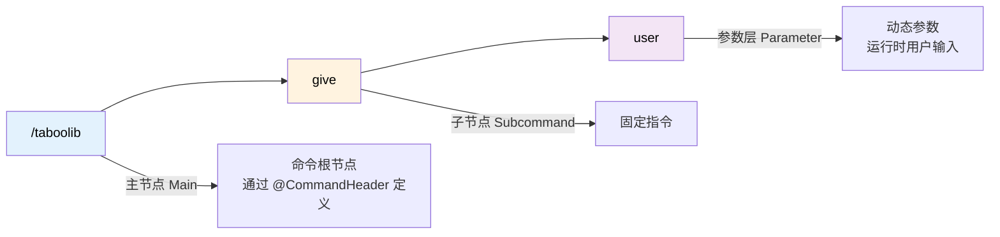

# 命令系统

## 命令结构解析

一个命令由主节点、子节点和参数层组成。以命令 `/taboolib give <user>` 为例：



- **主节点**: `/taboolib` - 命令的根节点，通过 `@CommandHeader` 定义
- **子节点**: `give` - 固定的子命令，通过 `@CommandBody` 定义
- **参数层**: `<user>` - 动态参数，在运行时由用户输入

## 创建基础命令

### 定义主节点

使用 `@CommandHeader` 注解定义命令的主节点：

```kotlin
@CommandHeader(
    name = "taboolib",              // 主命令名称
    aliases = ["tl"],               // 命令别名
    description = "TabooLib 主命令", // 命令描述
    permission = "taboolib.command" // 所需权限
)
object TestCommand {
    // 子命令将在这里定义
}
```

### 定义子命令

使用 `@CommandBody` 和 `subCommand` 创建子命令：

```kotlin
@CommandHeader("taboolib", ["tl"], permission = "taboolib.command")
object TestCommand {

    @CommandBody
    val give = subCommand {
        // 定义参数 user (字符串类型)
        dynamic("user") {
            // highlight-start
            execute<CommandSender> { sender, context, argument ->
                // 获取参数值
                val user = context["user"]
                sender.sendMessage("Hello, $user")
            }
            // highlight-end
        }
    }
}
```

**代码说明：**
- `@CommandBody`：标记这是一个命令体
- `subCommand {}`：创建子命令的 DSL 函数
- `dynamic("user")`：创建一个名为 "user" 的动态字符串参数
- `execute<CommandSender>`：定义命令执行逻辑
  - `sender`：命令发送者
  - `context`：命令上下文，用于获取参数
  - `argument`：当前参数的原始值

## 参数类型详解

TabooLib 提供了多种参数类型，适应不同的使用场景。

### 字符串类型 (String)

最基础的参数类型，接受任意字符串输入。

```kotlin
dynamic("user") {
    execute<CommandSender> { sender, context, argument ->
        val user = context["user"]  // 直接获取字符串
        sender.sendMessage("Hello, $user")
    }
}
```

**适用场景：** 玩家名称、文本输入、路径等

### 整数类型 (Int)

自动验证输入是否为整数，并提供类型安全的获取方法。

```kotlin
int("amount") {
    execute<CommandSender> { sender, context, argument ->
        val amount = context.int("amount")  // 获取整数值
        sender.sendMessage("数量: $amount")
    }
}
```

**特性：**
- 自动约束输入必须为整数
- 输入非整数时自动提示错误
- 使用 `context.int()` 获取，返回 `Int` 类型

**适用场景：** 数量、等级、ID 等

### 浮点数类型 (Double)

支持小数点的数字参数。

```kotlin
decimal("amount") {
    execute<CommandSender> { sender, context, argument ->
        val amount = context.double("amount")  // 获取浮点数值
        sender.sendMessage("金额: $amount")
    }
}
```

**特性：**
- 自动约束输入必须为数字（支持小数）
- 使用 `context.double()` 获取，返回 `Double` 类型

**适用场景：** 金钱、倍率、坐标等

### 玩家类型 (Player)

自动补全在线玩家名称，并提供玩家对象。

```kotlin
player("user") {
    execute<CommandSender> { sender, context, argument ->
        val user = context.player("user")  // 获取 ProxyPlayer 对象

        // 转换为 Bukkit 的 Player 对象（如果需要）
        val bukkitPlayer = user.cast<Player>()

        sender.sendMessage("目标玩家: ${user.name}")
    }
}
```

**特性：**
- 自动补全在线玩家
- 自动验证玩家是否在线
- 返回 `ProxyPlayer` 对象（跨平台）

**适用场景：** 传送、物品发送、玩家管理等

### 布尔类型 (Boolean)

接受 true/false 输入，并自动补全。

```kotlin
bool("选项") {
    execute<Player> { sender, context, argument ->
        val option = context.bool("选项")  // 获取布尔值
        UI.open(sender, xxx, option)
    }
}
```

**特性：**
- 自动补全 `true` 和 `false`
- 支持简写：`t`/`1` 表示 true，其他表示 false
- 使用 `context.bool()` 获取，返回 `Boolean` 类型

**适用场景：** 开关选项、模式切换等

## 参数层级与可选参数

### 可选参数 - 实现命令省略

当你希望某个参数可以省略时，可以在同一层级定义多个 `execute`：

**需求示例：**
```
/taboolib give xxx  → 给 xxx 发送消息
/taboolib give      → 给命令执行者自己发送消息
```

**实现代码：**

```kotlin
@CommandBody
val give = subCommand {
    // 带参数的执行逻辑
    dynamic("user") {
        execute<CommandSender> { sender, context, argument ->
            val user = context["user"]
            sender.sendMessage("Hello, $user")
        }
    }

    // 无参数的执行逻辑
    execute<CommandSender> { sender, context, argument ->
        sender.sendMessage("Hello, MySelf")
    }
}
```

**执行流程：**
1. 输入 `/taboolib give Steve` → 匹配到 `dynamic("user")`，执行第一个 execute
2. 输入 `/taboolib give` → 没有参数，跳过 `dynamic("user")`，执行第二个 execute

### 多层参数嵌套

你可以在参数内继续嵌套参数，构建复杂的命令结构：

```kotlin
@CommandBody
val teleport = subCommand {
    player("目标玩家") {
        player("传送到") {
            execute<CommandSender> { sender, context, argument ->
                val target = context.player("目标玩家")
                val destination = context.player("传送到")
                // 执行传送逻辑
            }
        }
        execute<Player> { sender, context, argument ->
            val target = context.player("目标玩家")
            // 传送到命令发送者位置
        }
    }
}
```

**命令示例：**
- `/taboolib teleport Steve Alex` - 将 Steve 传送到 Alex
- `/taboolib teleport Steve` - 将 Steve 传送到命令发送者

## 参数补全与约束

### 自定义参数补全

为参数提供动态的补全建议，提升用户体验。

**示例：商店插件的商店名补全**

```kotlin
@CommandBody(permission = "shop.open")
val open = subCommand {
    dynamic("商店名") {
        // 定义补全逻辑
        suggestion<CommandSender>(uncheck = true) { sender, context ->
            // 返回商店名称列表
            ShopManager.getShopNameList()
        }

        // 嵌套参数：目标玩家
        player("目标玩家") {
            execute<CommandSender> { sender, context, argument ->
                val player = context.player("目标玩家").cast<Player>()
                UIShopInfo.open(player, context["商店名"])
            }
        }

        // 不带目标玩家参数
        execute<Player> { sender, context, argument ->
            UIShopInfo.open(sender, context["商店名"])
        }
    }
}
```

**关键点：**

```kotlin
suggestion<CommandSender>(uncheck = true) { sender, context ->
    ShopManager.getShopNameList()  // 返回 List<String>
}
```

- `suggestion`：定义补全逻辑
- `uncheck = true`：**仅作为提示，不强制约束**（允许输入列表外的值）
- `uncheck = false`（默认）：强制约束，只能输入列表中的值
- 返回值：`List<String>` - 补全建议列表

### 参数约束 (Restrict)

使用 `restrict` 可以自定义验证逻辑：

```kotlin
dynamic("商店名") {
    restrict<CommandSender> { sender, context, argument ->
        // 返回 true 表示参数有效，false 表示无效
        ShopManager.shopExists(argument)
    }
    execute<CommandSender> { sender, context, argument ->
        val shopName = context["商店名"]
        sender.sendMessage("打开商店: $shopName")
    }
}
```

**与 `suggestion` 的区别：**
- `suggestion`：提供补全建议，可以不约束
- `restrict`：强制验证输入，不符合条件的输入会被拒绝

## 权限控制

### 主命令权限

```kotlin
@CommandHeader(
    name = "admin",
    permission = "myplugin.admin"  // 主命令权限
)
object AdminCommand {
    // ...
}
```

### 子命令权限

```kotlin
@CommandBody(permission = "shop.open")
val open = subCommand {
    // 只有拥有 shop.open 权限的玩家才能执行
}
```

### 参数层权限

```kotlin
player("目标玩家", permission = "shop.open.others") {
    execute<CommandSender> { sender, context, argument ->
        // 需要额外权限才能为其他玩家打开商店
    }
}
```

## 简单命令注册

对于简单的单一命令，可以使用 `simpleCommand` 快速注册，无需注解。

### 基础用法

```kotlin
@Awake(LifeCycle.ENABLE)
fun registerCommands() {
    simpleCommand("day") { sender, args ->
        Bukkit.getWorld("world")?.time = 1000
        sender.sendMessage("已设置为白天")
    }
}
```

**特点：**
- 无需 `@CommandHeader` 和 `@CommandBody`
- 适合简单的单一功能命令
- 在 `LifeCycle.ENABLE` 阶段注册

### 带参数的简单命令

```kotlin
@Awake(LifeCycle.ENABLE)
fun registerCommands() {
    simpleCommand("heal") { sender, args ->
        if (sender !is Player) {
            sender.sendMessage("只有玩家可以执行此命令")
            return@simpleCommand
        }

        sender.health = sender.maxHealth
        sender.sendMessage("已恢复生命值")
    }
}
```

## 最佳实践示例

### 完整的商店插件命令

```kotlin
@CommandHeader(
    name = "shop",
    aliases = ["商店"],
    description = "商店系统",
    permission = "shop.use"
)
object ShopCommand {

    @CommandBody
    val open = subCommand {
        dynamic("商店名") {
            // 补全商店列表
            suggestion<CommandSender>(uncheck = true) { sender, context ->
                ShopManager.getShopNameList()
            }

            // 为其他玩家打开商店
            player("目标玩家", permission = "shop.open.others") {
                execute<CommandSender> { sender, context, argument ->
                    val shopName = context["商店名"]
                    val target = context.player("目标玩家")

                    UIShopInfo.open(target.cast<Player>(), shopName)
                    sender.sendMessage("已为 ${target.name} 打开商店: $shopName")
                }
            }

            // 为自己打开商店
            execute<Player> { sender, context, argument ->
                val shopName = context["商店名"]
                UIShopInfo.open(sender, shopName)
            }
        }

        // 打开默认商店
        execute<Player> { sender, context, argument ->
            UIShopInfo.open(sender, "default")
        }
    }

    @CommandBody(permission = "shop.admin")
    val reload = subCommand {
        execute<CommandSender> { sender, context, argument ->
            ShopManager.reload()
            sender.sendMessage("商店配置已重载")
        }
    }
}
```

### 带数量参数的给予物品命令

```kotlin
@CommandBody
val give = subCommand {
    player("目标玩家") {
        dynamic("物品ID") {
            // 补全物品 ID
            suggestion<CommandSender>(uncheck = false) { sender, context ->
                Material.values().map { it.name.toLowerCase() }
            }

            int("数量") {
                execute<CommandSender> { sender, context, argument ->
                    val target = context.player("目标玩家")
                    val itemId = context["物品ID"]
                    val amount = context.int("数量")

                    // 给予物品逻辑
                    giveItem(target, itemId, amount)
                    sender.sendMessage("已给予 ${target.name} $amount 个 $itemId")
                }
            }

            // 数量默认为 1
            execute<CommandSender> { sender, context, argument ->
                val target = context.player("目标玩家")
                val itemId = context["物品ID"]

                giveItem(target, itemId, 1)
                sender.sendMessage("已给予 ${target.name} 1 个 $itemId")
            }
        }
    }
}
```

## 高级特性

### 自定义命令建议提供器

TabooLib 6.2 引入了命令建议提供器接口，允许你统一定制所有类型参数的建议行为。

#### 建议提供器接口

```kotlin
import taboolib.common.platform.command.component.CommandSuggestProvider
import taboolib.common.platform.command.component.CommandComponentDynamic

// highlight-start
interface CommandSuggestProvider {
    /**
     * 提供整数类型的建议
     */
    fun provideIntSuggest(
        component: CommandComponentDynamic,
        comment: String,
        suggest: List<String>
    )

    /**
     * 提供小数类型的建议
     */
    fun provideDecimalSuggest(
        component: CommandComponentDynamic,
        comment: String,
        suggest: List<String>
    )

    /**
     * 提供布尔类型的建议
     */
    fun provideBoolSuggest(
        component: CommandComponentDynamic,
        comment: String
    )

    /**
     * 提供玩家类型的建议
     */
    fun providePlayerSuggest(
        component: CommandComponentDynamic,
        comment: String,
        suggest: List<String>
    )
}
// highlight-end
```

#### 默认实现

TabooLib 提供了默认实现 `DefaultCommandSuggestProvider`：

```kotlin
class DefaultCommandSuggestProvider : CommandSuggestProvider {

    override fun provideIntSuggest(
        component: CommandComponentDynamic,
        comment: String,
        suggest: List<String>
    ) {
        // 如果没有额外建议则约束参数输入
        if (suggest.isEmpty()) {
            component.restrictInt()
        } else {
            component.suggestUncheck { suggest }
        }
    }

    override fun provideDecimalSuggest(
        component: CommandComponentDynamic,
        comment: String,
        suggest: List<String>
    ) {
        if (suggest.isEmpty()) {
            component.restrictDouble()
        } else {
            component.suggestUncheck { suggest }
        }
    }

    override fun provideBoolSuggest(
        component: CommandComponentDynamic,
        comment: String
    ) {
        component.suggestBoolean()
    }

    override fun providePlayerSuggest(
        component: CommandComponentDynamic,
        comment: String,
        suggest: List<String>
    ) {
        component.suggestPlayers(suggest)
    }
}
```

#### 自定义建议提供器

**方式一：通过 ServiceLoader（推荐）**

1. 创建自定义实现：

```kotlin
package com.example.plugin.command

import taboolib.common.platform.command.component.CommandSuggestProvider
import taboolib.common.platform.command.component.CommandComponentDynamic
import taboolib.common.platform.command.suggestUncheck

class CustomSuggestProvider : CommandSuggestProvider {

    override fun provideIntSuggest(
        component: CommandComponentDynamic,
        comment: String,
        suggest: List<String>
    ) {
        // 自定义整数建议逻辑
        component.suggestUncheck {
            if (suggest.isNotEmpty()) {
                suggest
            } else {
                // 提供默认建议范围
                listOf("1", "10", "100", "1000")
            }
        }
    }

    override fun provideDecimalSuggest(
        component: CommandComponentDynamic,
        comment: String,
        suggest: List<String>
    ) {
        component.suggestUncheck {
            if (suggest.isNotEmpty()) {
                suggest
            } else {
                listOf("0.5", "1.0", "1.5", "2.0")
            }
        }
    }

    override fun provideBoolSuggest(
        component: CommandComponentDynamic,
        comment: String
    ) {
        // 自定义布尔值建议（支持中文）
        component.suggestUncheck {
            listOf("true", "false", "是", "否")
        }
    }

    override fun providePlayerSuggest(
        component: CommandComponentDynamic,
        comment: String,
        suggest: List<String>
    ) {
        // 添加特殊选项
        component.suggestUncheck {
            val players = suggest.ifEmpty {
                // 默认在线玩家列表
                onlinePlayers().map { it.name }
            }
            // 添加特殊选项
            listOf("@a", "@p", "@r") + players
        }
    }
}
```

2. 创建 ServiceLoader 配置文件：

在 `src/main/resources/META-INF/services/` 目录下创建文件：

**文件名：** `taboolib.common.platform.command.component.CommandSuggestProvider`

**文件内容：**
```
com.example.plugin.command.CustomSuggestProvider
```

**方式二：手动设置**

```kotlin
import taboolib.common.LifeCycle
import taboolib.common.platform.Awake
import taboolib.common.platform.command.component.CommandSuggestProviderLoader

@Awake(LifeCycle.CONST)
fun setupSuggestProvider() {
    CommandSuggestProviderLoader.setProvider(CustomSuggestProvider())
}
```

#### 使用场景

自定义建议提供器的典型应用场景：

**场景 1：统一添加范围提示**

```kotlin
class RangeSuggestProvider : CommandSuggestProvider {
    override fun provideIntSuggest(
        component: CommandComponentDynamic,
        comment: String,
        suggest: List<String>
    ) {
        component.suggestUncheck {
            if (suggest.isNotEmpty()) {
                suggest
            } else {
                // 根据注释提取范围
                when {
                    "1-10" in comment -> (1..10).map { it.toString() }
                    "1-100" in comment -> listOf("1", "10", "50", "100")
                    else -> listOf("1", "5", "10")
                }
            }
        }
    }
    // ... 其他方法
}
```

使用：

```kotlin
int("数量", comment = "1-10") {  // 自动提供 1-10 的建议
    execute<Player> { sender, context, argument ->
        val count = context.int("数量")
        sender.sendMessage("数量: $count")
    }
}
```

**场景 2：多语言支持**

```kotlin
class I18nSuggestProvider : CommandSuggestProvider {
    override fun provideBoolSuggest(
        component: CommandComponentDynamic,
        comment: String
    ) {
        component.suggestUncheck {
            when (getPlayerLanguage(component.sender)) {
                "zh_CN" -> listOf("真", "假", "是", "否")
                "en_US" -> listOf("true", "false", "yes", "no")
                else -> listOf("true", "false")
            }
        }
    }
    // ... 其他方法
}
```

**场景 3：上下文感知建议**

```kotlin
class ContextAwareSuggestProvider : CommandSuggestProvider {
    override fun providePlayerSuggest(
        component: CommandComponentDynamic,
        comment: String,
        suggest: List<String>
    ) {
        component.suggestUncheck {
            when (comment) {
                "附近玩家" -> getNearbyPlayers(component.sender)
                "队友" -> getTeamMembers(component.sender)
                "好友" -> getFriends(component.sender)
                else -> onlinePlayers().map { it.name }
            }
        }
    }
    // ... 其他方法
}
```

使用：

```kotlin
player("目标", comment = "附近玩家") {  // 只建议附近的玩家
    execute<Player> { sender, context, argument ->
        // ...
    }
}
```

#### 加载机制

建议提供器使用 Java ServiceLoader 机制加载：

```kotlin
object CommandSuggestProviderLoader {
    private var provider: CommandSuggestProvider? = null

    fun getProvider(): CommandSuggestProvider {
        if (provider == null) {
            provider = loadProvider()
        }
        return provider!!
    }

    fun setProvider(provider: CommandSuggestProvider) {
        this.provider = provider
    }

    fun reload() {
        provider = loadProvider()
    }

    private fun loadProvider(): CommandSuggestProvider {
        return try {
            val loader = ServiceLoader.load(CommandSuggestProvider::class.java)
            // 获取第一个自定义实现，如果没有则使用默认实现
            loader.firstOrNull() ?: DefaultCommandSuggestProvider()
        } catch (_: Exception) {
            DefaultCommandSuggestProvider()
        }
    }
}
```

**特性：**
- 自动发现：通过 ServiceLoader 自动加载实现
- 优先级：自定义实现优先于默认实现
- 热重载：可以通过 `reload()` 方法重新加载
- 手动设置：可以通过 `setProvider()` 手动指定

#### 最佳实践

1. **保持一致性**：在整个插件中使用统一的建议风格
2. **避免过度建议**：建议列表不应过长，保持在 10 个以内
3. **上下文感知**：根据命令上下文提供相关建议
4. **性能优化**：避免在建议方法中执行耗时操作
5. **用户友好**：提供有意义的建议值，而非随机数据

## 常见问题

### 如何获取参数的原始值？

使用 `context[参数名]` 获取字符串形式，或使用对应的类型方法：
- `context.int("参数名")` → Int
- `context.double("参数名")` → Double
- `context.bool("参数名")` → Boolean
- `context.player("参数名")` → ProxyPlayer

### 如何判断玩家是否输入了某个可选参数？

```kotlin
val userInput = context.getOrNull("user")
if (userInput != null) {
    // 玩家输入了参数
} else {
    // 玩家没有输入参数
}
```

### `uncheck = true` 和 `uncheck = false` 的区别？

- `uncheck = true`：仅作为**补全提示**，玩家可以输入任意值
- `uncheck = false`：**强制约束**，玩家只能输入建议列表中的值

### 如何限制命令只能由玩家执行？

在 `execute` 中使用 `<Player>` 泛型：

```kotlin
execute<Player> { sender, context, argument ->
    // sender 必定是 Player
    sender.sendMessage("你好，${sender.name}")
}
```
