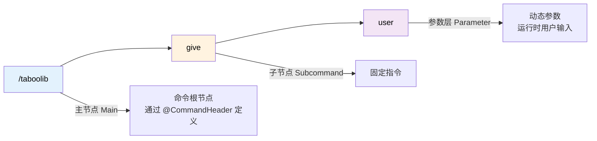
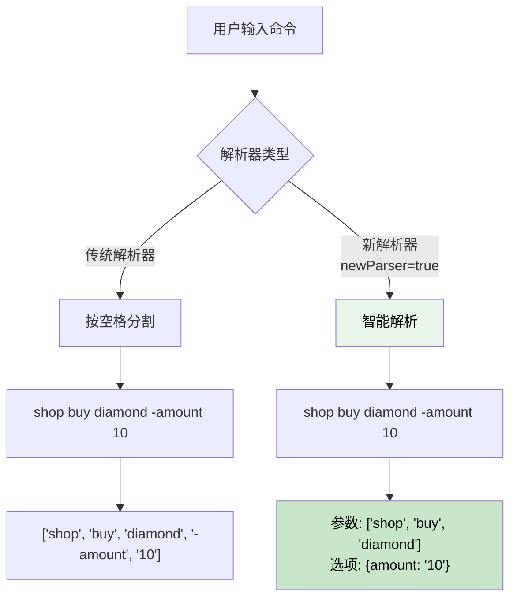
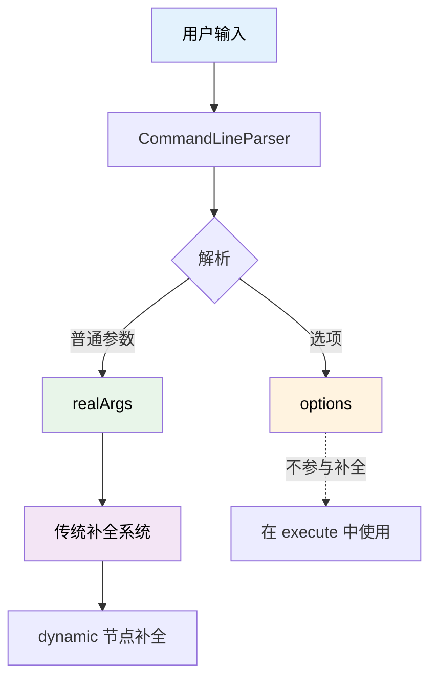

# 命令系统

## 命令结构解析

一个命令由主节点、子节点和参数层组成。以命令 `/taboolib give <user>` 为例：



- **主节点**: `/taboolib` - 命令的根节点，通过 `@CommandHeader` 定义
- **子节点**: `give` - 固定的子命令，通过 `@CommandBody` 定义
- **参数层**: `<user>` - 动态参数，在运行时由用户输入

## 创建基础命令

### 定义主节点

使用 `@CommandHeader` 注解定义命令的主节点：

```kotlin
@CommandHeader(
    name = "taboolib",              // 主命令名称
    aliases = ["tl"],               // 命令别名
    description = "TabooLib 主命令", // 命令描述
    permission = "taboolib.command" // 所需权限
)
object TestCommand {
    // 子命令将在这里定义
}
```

### 定义子命令

使用 `@CommandBody` 和 `subCommand` 创建子命令：

```kotlin
@CommandHeader("taboolib", ["tl"], permission = "taboolib.command")
object TestCommand {

    @CommandBody
    val give = subCommand {
        // 定义参数 user (字符串类型)
        dynamic("user") {
            // highlight-start
            execute<CommandSender> { sender, context, argument ->
                // 获取参数值
                val user = context["user"]
                sender.sendMessage("Hello, $user")
            }
            // highlight-end
        }
    }
}
```

**代码说明：**
- `@CommandBody`：标记这是一个命令体
- `subCommand {}`：创建子命令的 DSL 函数
- `dynamic("user")`：创建一个名为 "user" 的动态字符串参数
- `execute<CommandSender>`：定义命令执行逻辑
    - `sender`：命令发送者
    - `context`：命令上下文，用于获取参数
    - `argument`：当前参数的原始值

## 参数类型详解

TabooLib 提供了多种参数类型，适应不同的使用场景。

### 字符串类型 (String)

最基础的参数类型，接受任意字符串输入。

```kotlin
dynamic("user") {
    execute<CommandSender> { sender, context, argument ->
        val user = context["user"]  // 直接获取字符串
        sender.sendMessage("Hello, $user")
    }
}
```

**适用场景：** 玩家名称、文本输入、路径等

### 整数类型 (Int)

自动验证输入是否为整数，并提供类型安全的获取方法。

```kotlin
int("amount") {
    execute<CommandSender> { sender, context, argument ->
        val amount = context.int("amount")  // 获取整数值
        sender.sendMessage("数量: $amount")
    }
}
```

**特性：**
- 自动约束输入必须为整数
- 输入非整数时自动提示错误
- 使用 `context.int()` 获取，返回 `Int` 类型

**适用场景：** 数量、等级、ID 等

### 浮点数类型 (Double)

支持小数点的数字参数。

```kotlin
decimal("amount") {
    execute<CommandSender> { sender, context, argument ->
        val amount = context.double("amount")  // 获取浮点数值
        sender.sendMessage("金额: $amount")
    }
}
```

**特性：**
- 自动约束输入必须为数字（支持小数）
- 使用 `context.double()` 获取，返回 `Double` 类型

**适用场景：** 金钱、倍率、坐标等

### 玩家类型 (Player)

自动补全在线玩家名称，并提供玩家对象。

```kotlin
player("user") {
    execute<CommandSender> { sender, context, argument ->
        val user = context.player("user")  // 获取 ProxyPlayer 对象

        // 转换为 Bukkit 的 Player 对象（如果需要）
        val bukkitPlayer = user.cast<Player>()

        sender.sendMessage("目标玩家: ${user.name}")
    }
}
```

**特性：**
- 自动补全在线玩家
- 自动验证玩家是否在线
- 返回 `ProxyPlayer` 对象（跨平台）

**适用场景：** 传送、物品发送、玩家管理等

### 布尔类型 (Boolean)

接受 true/false 输入，并自动补全。

```kotlin
bool("选项") {
    execute<Player> { sender, context, argument ->
        val option = context.bool("选项")  // 获取布尔值
        UI.open(sender, xxx, option)
    }
}
```

**特性：**
- 自动补全 `true` 和 `false`
- 支持简写：`t`/`1` 表示 true，其他表示 false
- 使用 `context.bool()` 获取，返回 `Boolean` 类型

**适用场景：** 开关选项、模式切换等

### 枚举类型 (Enum)

自动从枚举类获取所有可用值，提供自动补全和约束验证。

```kotlin
enum class GameMode {
    SURVIVAL, CREATIVE, ADVENTURE, SPECTATOR
}

@CommandBody
val gamemode = subCommand {
    enum(GameMode.entries, "mode") {
        execute<Player> { sender, context, _ ->
            // 获取枚举字符串值
            val mode = context["mode"]

            // 或者转换为枚举对象
            val gameMode = GameMode.valueOf(mode)

            sender.sendMessage("游戏模式已切换为: $mode")
        }
    }
}
```

**特性：**
- 自动从枚举类提取所有可用值作为补全建议
- 自动约束输入必须为枚举值之一
- 支持额外的自定义建议（通过 `suggest` 参数）
- 使用 `context["参数名"]` 获取字符串值

**使用示例：**

```kotlin
enum class Difficulty {
    PEACEFUL, EASY, NORMAL, HARD
}

@CommandBody
val difficulty = subCommand {
    enum(Difficulty.entries, "level") {
        execute<CommandSender> { sender, context, _ ->
            val level = Difficulty.valueOf(context["level"])

            when (level) {
                Difficulty.PEACEFUL -> sender.sendMessage("难度设置为：和平")
                Difficulty.EASY -> sender.sendMessage("难度设置为：简单")
                Difficulty.NORMAL -> sender.sendMessage("难度设置为：普通")
                Difficulty.HARD -> sender.sendMessage("难度设置为：困难")
            }
        }
    }
}
```

**高级用法：添加额外建议**

```kotlin
enum class WeatherType {
    CLEAR, RAIN, THUNDER
}

@CommandBody
val weather = subCommand {
    // 除了枚举值外，还会补全 "sunny" 和 "storm"
    enum(
        enums = WeatherType.entries,
        comment = "weather",
        suggest = listOf("sunny", "storm")
    ) {
        execute<CommandSender> { sender, context, _ ->
            val weather = context["weather"]

            // 处理额外建议值
            val actualWeather = when (weather) {
                "sunny" -> WeatherType.CLEAR
                "storm" -> WeatherType.THUNDER
                else -> WeatherType.valueOf(weather)
            }

            sender.sendMessage("天气已设置为: $actualWeather")
        }
    }
}
```

**适用场景：** 模式选择、难度设置、类型筛选等固定选项

### 字面量类型 (Literal)

Literal 类型用于定义固定的子命令节点，类似于 `@CommandBody` 定义的子命令，但可以在参数层级中灵活使用。

```kotlin
@CommandBody
val config = subCommand {
    // 使用 literal 定义固定的子命令选项
    literal("reload", "rl") {
        execute<CommandSender> { sender, context, argument ->
            ConfigManager.reload()
            sender.sendMessage("配置已重载")
        }
    }

    literal("save") {
        execute<CommandSender> { sender, context, argument ->
            ConfigManager.save()
            sender.sendMessage("配置已保存")
        }
    }

    literal("reset") {
        execute<CommandSender> { sender, context, argument ->
            ConfigManager.reset()
            sender.sendMessage("配置已重置")
        }
    }
}
```

**命令示例：**
- `/mycommand config reload` - 重载配置
- `/mycommand config rl` - 使用别名重载配置
- `/mycommand config save` - 保存配置
- `/mycommand config reset` - 重置配置

**特性：**
- `aliases`：支持多个别名，如 `literal("reload", "rl")`
- `optional`：是否为可选节点（默认 false）
- `permission`：该节点所需的权限
- `hidden`：是否在补全列表中隐藏（默认 false）
- 可以嵌套使用，构建多层级命令结构

**进阶示例：嵌套 literal 构建复杂命令**

```kotlin
@CommandBody
val admin = subCommand {
    literal("player") {
        literal("kick") {
            player("目标玩家") {
                execute<CommandSender> { sender, context, argument ->
                    val target = context.player("目标玩家")
                    target.cast<Player>().kickPlayer("已被管理员踢出")
                    sender.sendMessage("已踢出玩家: ${target.name}")
                }
            }
        }

        literal("ban") {
            player("目标玩家") {
                execute<CommandSender> { sender, context, argument ->
                    val target = context.player("目标玩家")
                    // 执行封禁逻辑
                    sender.sendMessage("已封禁玩家: ${target.name}")
                }
            }
        }
    }

    literal("server", "srv") {
        literal("stop") {
            execute<CommandSender> { sender, context, argument ->
                sender.sendMessage("服务器即将关闭...")
                // 执行关闭逻辑
            }
        }

        literal("restart", "reboot") {
            execute<CommandSender> { sender, context, argument ->
                sender.sendMessage("服务器即将重启...")
                // 执行重启逻辑
            }
        }
    }
}
```

**命令结构：**
```
/mycommand admin player kick <玩家>
/mycommand admin player ban <玩家>
/mycommand admin server stop
/mycommand admin srv restart
/mycommand admin srv reboot
```

**Literal vs Dynamic 的选择：**

| 场景 | 推荐类型 | 原因 |
|------|---------|------|
| 固定的几个选项（如 reload/save/reset） | `literal` | 明确的命令结构，更好的补全体验 |
| 用户输入的数据（如玩家名、商店名） | `dynamic` | 动态内容，需要运行时确定 |
| 枚举值（如 true/false、模式选择） | `literal` 或专用类型 | literal 提供精确匹配，专用类型提供类型安全 |

**带权限的 Literal 示例：**

```kotlin
literal("debug", permission = "myplugin.admin.debug") {
    execute<CommandSender> { sender, context, argument ->
        sender.sendMessage("调试信息: ...")
    }
}

literal("normal") {
    execute<CommandSender> { sender, context, argument ->
        sender.sendMessage("普通功能")
    }
}
```

只有拥有 `myplugin.admin.debug` 权限的玩家才能看到和使用 `debug` 子命令。

**隐藏 Literal 示例：**

```kotlin
literal("secret", hidden = true) {
    execute<CommandSender> { sender, context, argument ->
        sender.sendMessage("你发现了隐藏命令！")
    }
}
```

`hidden = true` 使得该命令不会出现在 Tab 补全列表中，但仍然可以执行。

**适用场景：** 固定子命令、多级命令菜单、带别名的命令选项

### 世界类型 (World)

自动补全服务器中的世界名称，支持 `~` 代表当前玩家所在世界。

```kotlin
world("世界名") {
    execute<Player> { sender, context, argument ->
        val worldName = context.world("世界名")
        sender.sendMessage("目标世界: $worldName")
    }
}
```

**特性：**
- 自动补全所有已加载的世界名称
- 支持 `~` 代表玩家当前世界
- 使用 `context.world()` 获取，返回 `String` 类型

**适用场景：** 传送命令、世界管理、跨世界操作

### 坐标类型 (XYZ)

快速定义三维坐标参数，支持相对坐标（`~` 语法）。

```kotlin
xyz("x", "y", "z") {
    execute<Player> { sender, context, argument ->
        val x = context.x("x")
        val y = context.y("y")
        val z = context.z("z")

        sender.sendMessage("目标坐标: $x, $y, $z")
        sender.teleport(Location(sender.world, x, y, z))
    }
}
```

**特性：**
- 自动创建三个浮点数参数
- 支持相对坐标：`~` 表示玩家当前位置，`~10` 表示偏移10格
- 自动补全玩家当前坐标
- 使用 `context.x()`, `context.y()`, `context.z()` 获取，返回 `Double` 类型

**命令示例：**
- `/tp 100 64 200` - 传送到绝对坐标
- `/tp ~ ~10 ~` - 传送到当前X/Z，向上10格
- `/tp ~5 ~ ~-3` - X+5, Z-3

**适用场景：** 传送命令、设置坐标点、区域选择

### 欧拉角类型 (Euler)

定义视角参数（yaw 和 pitch）。

```kotlin
euler("yaw", "pitch") {
    execute<Player> { sender, context, argument ->
        val yaw = context.yaw("yaw")
        val pitch = context.pitch("pitch")

        val loc = sender.location.clone()
        loc.yaw = yaw
        loc.pitch = pitch
        sender.teleport(loc)
    }
}
```

**特性：**
- 自动创建两个浮点数参数
- 支持相对角度：`~45` 表示在当前基础上旋转45度
- 自动补全玩家当前视角
- 使用 `context.yaw()`, `context.pitch()` 获取，返回 `Float` 类型

**适用场景：** 设置视角、相机控制、精确传送

### 完整位置类型 (Location)

组合世界、坐标和视角的完整位置参数。

```kotlin
location() {
    execute<Player> { sender, context, argument ->
        val loc = context.location()
        sender.teleport(loc)
        sender.sendMessage("已传送到: ${loc.world} ${loc.x} ${loc.y} ${loc.z}")
    }
}
```

**特性：**
- 自动创建 `world`, `x`, `y`, `z`, `yaw`, `pitch` 六个参数
- 支持相对坐标和相对视角
- 使用 `context.location()` 获取，返回 `Location` 对象

**自定义参数名：**

```kotlin
location(
    world = "目标世界",
    x = "X坐标",
    y = "Y坐标",
    z = "Z坐标",
    yaw = "偏航角",
    pitch = "俯仰角",
    euler = true  // 是否包含视角参数
) {
    execute<Player> { sender, context, argument ->
        val loc = context.location("目标世界", "X坐标", "Y坐标", "Z坐标", "偏航角", "俯仰角")
        sender.teleport(loc)
    }
}
```

**命令示例：**
```
/tp world 100 64 200 90 0
/tp ~ ~ ~10 ~ ~ ~
```

**适用场景：** 完整传送命令、设置出生点、保存位置

### 不带世界的位置类型 (LocationWithoutWorld)

仅包含坐标和视角，自动使用玩家当前世界。

```kotlin
locationWithoutWorld() {
    execute<Player> { sender, context, argument ->
        val loc = context.locationWithoutWorld()
        sender.teleport(loc)
        sender.sendMessage("已传送到当前世界的: ${loc.x} ${loc.y} ${loc.z}")
    }
}
```

**特性：**
- 自动创建 `x`, `y`, `z`, `yaw`, `pitch` 五个参数
- 自动使用玩家当前世界
- 支持相对坐标和相对视角
- 使用 `context.locationWithoutWorld()` 获取，返回 `Location` 对象

**与 Location 的区别：**
- `location()` - 需要指定世界，6个参数
- `locationWithoutWorld()` - 使用当前世界，5个参数

**命令示例：**
```
/setpos 100 64 200 90 0
/setpos ~ ~10 ~ ~ ~
```

**适用场景：** 同一世界内的传送、设置家、保存坐标点

## 参数层级与可选参数

### 可选参数 - 实现命令省略

当你希望某个参数可以省略时，可以在同一层级定义多个 `execute`：

**需求示例：**
```
/taboolib give xxx  → 给 xxx 发送消息
/taboolib give      → 给命令执行者自己发送消息
```

**实现代码：**

```kotlin
@CommandBody
val give = subCommand {
    // 带参数的执行逻辑
    dynamic("user") {
        execute<CommandSender> { sender, context, argument ->
            val user = context["user"]
            sender.sendMessage("Hello, $user")
        }
    }

    // 无参数的执行逻辑
    execute<CommandSender> { sender, context, argument ->
        sender.sendMessage("Hello, MySelf")
    }
}
```

**执行流程：**
1. 输入 `/taboolib give Steve` → 匹配到 `dynamic("user")`，执行第一个 execute
2. 输入 `/taboolib give` → 没有参数，跳过 `dynamic("user")`，执行第二个 execute

### 多层参数嵌套

你可以在参数内继续嵌套参数，构建复杂的命令结构：

```kotlin
@CommandBody
val teleport = subCommand {
    player("目标玩家") {
        player("传送到") {
            execute<CommandSender> { sender, context, argument ->
                val target = context.player("目标玩家")
                val destination = context.player("传送到")
                // 执行传送逻辑
            }
        }
        execute<Player> { sender, context, argument ->
            val target = context.player("目标玩家")
            // 传送到命令发送者位置
        }
    }
}
```

**命令示例：**
- `/taboolib teleport Steve Alex` - 将 Steve 传送到 Alex
- `/taboolib teleport Steve` - 将 Steve 传送到命令发送者

## 参数补全与约束

### 自定义参数补全

为参数提供动态的补全建议，提升用户体验。

**示例：商店插件的商店名补全**

```kotlin
@CommandBody(permission = "shop.open")
val open = subCommand {
    dynamic("商店名") {
        // 定义补全逻辑
        suggestion<CommandSender>(uncheck = true) { sender, context ->
            // 返回商店名称列表
            ShopManager.getShopNameList()
        }

        // 嵌套参数：目标玩家
        player("目标玩家") {
            execute<CommandSender> { sender, context, argument ->
                val player = context.player("目标玩家").cast<Player>()
                UIShopInfo.open(player, context["商店名"])
            }
        }

        // 不带目标玩家参数
        execute<Player> { sender, context, argument ->
            UIShopInfo.open(sender, context["商店名"])
        }
    }
}
```

**关键点：**

```kotlin
suggestion<CommandSender>(uncheck = true) { sender, context ->
    ShopManager.getShopNameList()  // 返回 List<String>
}
```

- `suggestion`：定义补全逻辑
- `uncheck = true`：**仅作为提示，不强制约束**（允许输入列表外的值）
- `uncheck = false`（默认）：强制约束，只能输入列表中的值
- 返回值：`List<String>` - 补全建议列表

### 参数约束 (Restrict)

使用 `restrict` 可以自定义验证逻辑：

```kotlin
dynamic("商店名") {
    restrict<CommandSender> { sender, context, argument ->
        // 返回 true 表示参数有效，false 表示无效
        ShopManager.shopExists(argument)
    }
    execute<CommandSender> { sender, context, argument ->
        val shopName = context["商店名"]
        sender.sendMessage("打开商店: $shopName")
    }
}
```

**与 `suggestion` 的区别：**
- `suggestion`：提供补全建议，可以不约束
- `restrict`：强制验证输入，不符合条件的输入会被拒绝

## 权限控制

### 主命令权限

```kotlin
@CommandHeader(
    name = "admin",
    permission = "myplugin.admin"  // 主命令权限
)
object AdminCommand {
    // ...
}
```

### 子命令权限

```kotlin
@CommandBody(permission = "shop.open")
val open = subCommand {
    // 只有拥有 shop.open 权限的玩家才能执行
}
```

### 参数层权限

```kotlin
player("目标玩家", permission = "shop.open.others") {
    execute<CommandSender> { sender, context, argument ->
        // 需要额外权限才能为其他玩家打开商店
    }
}
```

## 简单命令注册

对于简单的单一命令，可以使用 `simpleCommand` 快速注册，无需注解。

### 基础用法

```kotlin
@Awake(LifeCycle.ENABLE)
fun registerCommands() {
    simpleCommand("day") { sender, args ->
        Bukkit.getWorld("world")?.time = 1000
        sender.sendMessage("已设置为白天")
    }
}
```

**特点：**
- 无需 `@CommandHeader` 和 `@CommandBody`
- 适合简单的单一功能命令
- 在 `LifeCycle.ENABLE` 阶段注册

### 带参数的简单命令

```kotlin
@Awake(LifeCycle.ENABLE)
fun registerCommands() {
    simpleCommand("heal") { sender, args ->
        if (sender !is Player) {
            sender.sendMessage("只有玩家可以执行此命令")
            return@simpleCommand
        }

        sender.health = sender.maxHealth
        sender.sendMessage("已恢复生命值")
    }
}
```

## 最佳实践示例

### 完整的商店插件命令

```kotlin
@CommandHeader(
    name = "shop",
    aliases = ["商店"],
    description = "商店系统",
    permission = "shop.use"
)
object ShopCommand {

    @CommandBody
    val open = subCommand {
        dynamic("商店名") {
            // 补全商店列表
            suggestion<CommandSender>(uncheck = true) { sender, context ->
                ShopManager.getShopNameList()
            }

            // 为其他玩家打开商店
            player("目标玩家", permission = "shop.open.others") {
                execute<CommandSender> { sender, context, argument ->
                    val shopName = context["商店名"]
                    val target = context.player("目标玩家")

                    UIShopInfo.open(target.cast<Player>(), shopName)
                    sender.sendMessage("已为 ${target.name} 打开商店: $shopName")
                }
            }

            // 为自己打开商店
            execute<Player> { sender, context, argument ->
                val shopName = context["商店名"]
                UIShopInfo.open(sender, shopName)
            }
        }

        // 打开默认商店
        execute<Player> { sender, context, argument ->
            UIShopInfo.open(sender, "default")
        }
    }

    @CommandBody(permission = "shop.admin")
    val reload = subCommand {
        execute<CommandSender> { sender, context, argument ->
            ShopManager.reload()
            sender.sendMessage("商店配置已重载")
        }
    }
}
```

### 带数量参数的给予物品命令

```kotlin
@CommandBody
val give = subCommand {
    player("目标玩家") {
        dynamic("物品ID") {
            // 补全物品 ID
            suggestion<CommandSender>(uncheck = false) { sender, context ->
                Material.values().map { it.name.toLowerCase() }
            }

            int("数量") {
                execute<CommandSender> { sender, context, argument ->
                    val target = context.player("目标玩家")
                    val itemId = context["物品ID"]
                    val amount = context.int("数量")

                    // 给予物品逻辑
                    giveItem(target, itemId, amount)
                    sender.sendMessage("已给予 ${target.name} $amount 个 $itemId")
                }
            }

            // 数量默认为 1
            execute<CommandSender> { sender, context, argument ->
                val target = context.player("目标玩家")
                val itemId = context["物品ID"]

                giveItem(target, itemId, 1)
                sender.sendMessage("已给予 ${target.name} 1 个 $itemId")
            }
        }
    }
}
```

## 高级特性

### 自定义命令建议提供器

TabooLib 6.2 引入了命令建议提供器接口，允许你统一定制所有类型参数的建议行为。

#### 建议提供器接口

```kotlin
import taboolib.common.platform.command.component.CommandSuggestProvider
import taboolib.common.platform.command.component.CommandComponentDynamic

// highlight-start
interface CommandSuggestProvider {
    /**
     * 提供整数类型的建议
     */
    fun provideIntSuggest(
        component: CommandComponentDynamic,
        comment: String,
        suggest: List<String>
    )

    /**
     * 提供小数类型的建议
     */
    fun provideDecimalSuggest(
        component: CommandComponentDynamic,
        comment: String,
        suggest: List<String>
    )

    /**
     * 提供布尔类型的建议
     */
    fun provideBoolSuggest(
        component: CommandComponentDynamic,
        comment: String
    )

    /**
     * 提供玩家类型的建议
     */
    fun providePlayerSuggest(
        component: CommandComponentDynamic,
        comment: String,
        suggest: List<String>
    )
}
// highlight-end
```

#### 默认实现

TabooLib 提供了默认实现 `DefaultCommandSuggestProvider`：

```kotlin
class DefaultCommandSuggestProvider : CommandSuggestProvider {

    override fun provideIntSuggest(
        component: CommandComponentDynamic,
        comment: String,
        suggest: List<String>
    ) {
        // 如果没有额外建议则约束参数输入
        if (suggest.isEmpty()) {
            component.restrictInt()
        } else {
            component.suggestUncheck { suggest }
        }
    }

    override fun provideDecimalSuggest(
        component: CommandComponentDynamic,
        comment: String,
        suggest: List<String>
    ) {
        if (suggest.isEmpty()) {
            component.restrictDouble()
        } else {
            component.suggestUncheck { suggest }
        }
    }

    override fun provideBoolSuggest(
        component: CommandComponentDynamic,
        comment: String
    ) {
        component.suggestBoolean()
    }

    override fun providePlayerSuggest(
        component: CommandComponentDynamic,
        comment: String,
        suggest: List<String>
    ) {
        component.suggestPlayers(suggest)
    }
}
```

#### 自定义建议提供器

**方式一：通过 ServiceLoader（推荐）**

1. 创建自定义实现：

```kotlin
package com.example.plugin.command

import taboolib.common.platform.command.component.CommandSuggestProvider
import taboolib.common.platform.command.component.CommandComponentDynamic
import taboolib.common.platform.command.suggestUncheck

class CustomSuggestProvider : CommandSuggestProvider {

    override fun provideIntSuggest(
        component: CommandComponentDynamic,
        comment: String,
        suggest: List<String>
    ) {
        // 自定义整数建议逻辑
        component.suggestUncheck {
            if (suggest.isNotEmpty()) {
                suggest
            } else {
                // 提供默认建议范围
                listOf("1", "10", "100", "1000")
            }
        }
    }

    override fun provideDecimalSuggest(
        component: CommandComponentDynamic,
        comment: String,
        suggest: List<String>
    ) {
        component.suggestUncheck {
            if (suggest.isNotEmpty()) {
                suggest
            } else {
                listOf("0.5", "1.0", "1.5", "2.0")
            }
        }
    }

    override fun provideBoolSuggest(
        component: CommandComponentDynamic,
        comment: String
    ) {
        // 自定义布尔值建议（支持中文）
        component.suggestUncheck {
            listOf("true", "false", "是", "否")
        }
    }

    override fun providePlayerSuggest(
        component: CommandComponentDynamic,
        comment: String,
        suggest: List<String>
    ) {
        // 添加特殊选项
        component.suggestUncheck {
            val players = suggest.ifEmpty {
                // 默认在线玩家列表
                onlinePlayers().map { it.name }
            }
            // 添加特殊选项
            listOf("@a", "@p", "@r") + players
        }
    }
}
```

2. 创建 ServiceLoader 配置文件：

在 `src/main/resources/META-INF/services/` 目录下创建文件：

**文件名：** `taboolib.common.platform.command.component.CommandSuggestProvider`

**文件内容：**
```
com.example.plugin.command.CustomSuggestProvider
```

**方式二：手动设置**

```kotlin
import taboolib.common.LifeCycle
import taboolib.common.platform.Awake
import taboolib.common.platform.command.component.CommandSuggestProviderLoader

@Awake(LifeCycle.CONST)
fun setupSuggestProvider() {
    CommandSuggestProviderLoader.setProvider(CustomSuggestProvider())
}
```

#### 使用场景

自定义建议提供器的典型应用场景：

**场景 1：统一添加范围提示**

```kotlin
class RangeSuggestProvider : CommandSuggestProvider {
    override fun provideIntSuggest(
        component: CommandComponentDynamic,
        comment: String,
        suggest: List<String>
    ) {
        component.suggestUncheck {
            if (suggest.isNotEmpty()) {
                suggest
            } else {
                // 根据注释提取范围
                when {
                    "1-10" in comment -> (1..10).map { it.toString() }
                    "1-100" in comment -> listOf("1", "10", "50", "100")
                    else -> listOf("1", "5", "10")
                }
            }
        }
    }
    // ... 其他方法
}
```

使用：

```kotlin
int("数量", comment = "1-10") {  // 自动提供 1-10 的建议
    execute<Player> { sender, context, argument ->
        val count = context.int("数量")
        sender.sendMessage("数量: $count")
    }
}
```

**场景 2：多语言支持**

```kotlin
class I18nSuggestProvider : CommandSuggestProvider {
    override fun provideBoolSuggest(
        component: CommandComponentDynamic,
        comment: String
    ) {
        component.suggestUncheck {
            when (getPlayerLanguage(component.sender)) {
                "zh_CN" -> listOf("真", "假", "是", "否")
                "en_US" -> listOf("true", "false", "yes", "no")
                else -> listOf("true", "false")
            }
        }
    }
    // ... 其他方法
}
```

**场景 3：上下文感知建议**

```kotlin
class ContextAwareSuggestProvider : CommandSuggestProvider {
    override fun providePlayerSuggest(
        component: CommandComponentDynamic,
        comment: String,
        suggest: List<String>
    ) {
        component.suggestUncheck {
            when (comment) {
                "附近玩家" -> getNearbyPlayers(component.sender)
                "队友" -> getTeamMembers(component.sender)
                "好友" -> getFriends(component.sender)
                else -> onlinePlayers().map { it.name }
            }
        }
    }
    // ... 其他方法
}
```

使用：

```kotlin
player("目标", comment = "附近玩家") {  // 只建议附近的玩家
    execute<Player> { sender, context, argument ->
        // ...
    }
}
```

#### 加载机制

建议提供器使用 Java ServiceLoader 机制加载：

```kotlin
object CommandSuggestProviderLoader {
    private var provider: CommandSuggestProvider? = null

    fun getProvider(): CommandSuggestProvider {
        if (provider == null) {
            provider = loadProvider()
        }
        return provider!!
    }

    fun setProvider(provider: CommandSuggestProvider) {
        this.provider = provider
    }

    fun reload() {
        provider = loadProvider()
    }

    private fun loadProvider(): CommandSuggestProvider {
        return try {
            val loader = ServiceLoader.load(CommandSuggestProvider::class.java)
            // 获取第一个自定义实现，如果没有则使用默认实现
            loader.firstOrNull() ?: DefaultCommandSuggestProvider()
        } catch (_: Exception) {
            DefaultCommandSuggestProvider()
        }
    }
}
```

**特性：**
- 自动发现：通过 ServiceLoader 自动加载实现
- 优先级：自定义实现优先于默认实现
- 热重载：可以通过 `reload()` 方法重新加载
- 手动设置：可以通过 `setProvider()` 手动指定

#### 最佳实践

1. **保持一致性**：在整个插件中使用统一的建议风格
2. **避免过度建议**：建议列表不应过长，保持在 10 个以内
3. **上下文感知**：根据命令上下文提供相关建议
4. **性能优化**：避免在建议方法中执行耗时操作
5. **用户友好**：提供有意义的建议值，而非随机数据

## 常见问题

### 如何获取参数的原始值？

使用 `context[参数名]` 获取字符串形式，或使用对应的类型方法：
- `context.int("参数名")` → Int
- `context.double("参数名")` → Double
- `context.bool("参数名")` → Boolean
- `context.player("参数名")` → ProxyPlayer

### 如何判断玩家是否输入了某个可选参数？

```kotlin
val userInput = context.getOrNull("user")
if (userInput != null) {
    // 玩家输入了参数
} else {
    // 玩家没有输入参数
}
```

### `uncheck = true` 和 `uncheck = false` 的区别？

- `uncheck = true`：仅作为**补全提示**，玩家可以输入任意值
- `uncheck = false`：**强制约束**，玩家只能输入建议列表中的值

### 如何限制命令只能由玩家执行？

在 `execute` 中使用 `<Player>` 泛型：

```kotlin
execute<Player> { sender, context, argument ->
    // sender 必定是 Player
    sender.sendMessage("你好，${sender.name}")
}
```

## 新一代命令解析器 (newParser)

TabooLib 提供了更强大的新一代命令解析器，支持 **类 Unix 命令行风格** 的参数解析，让命令系统能够处理选项（options）和参数（arguments）的组合。

### 什么是新命令解析器？

传统的命令解析器只能按顺序处理参数，而新命令解析器基于 **Demand** 的设计思想，能够识别和处理：

- **选项（Options）**：以 `-` 开头的键值对，如 `-name value` 或 `-amount=10`
- **参数（Arguments）**：普通的位置参数，如 `player1 player2`
- **引号字符串**：使用单引号或双引号包裹的字符串，支持空格
- **转义字符**：使用反斜杠转义特殊字符

**对比示例：**



### 启用新命令解析器

在 `@CommandHeader` 中设置 `newParser = true`：

```kotlin
@CommandHeader(
    name = "shop",
    aliases = ["商店"],
    description = "商店系统",
    permission = "shop.use",
    newParser = true  // 启用新命令解析器
)
object ShopCommand {
    // 命令定义...
}
```

### 解析规则详解

新命令解析器遵循以下解析规则：

#### 1. 选项格式

选项以 `-` 开头，有两种赋值方式：

```kotlin
// 方式 1：使用等号
/shop buy -item=diamond_sword -amount=10

// 方式 2：使用冒号
/shop buy -item:diamond_sword -amount:10

// 方式 3：空格分隔（值会被下一个参数填充）
/shop buy -item diamond_sword -amount 10
```

**解析结果：**
```kotlin
options = {
    "item" to "diamond_sword",
    "amount" to "10"
}
```

#### 2. 无值选项（标志）

选项可以不带值，作为布尔标志使用：

```kotlin
/shop buy diamond_sword --confirm --silent

// 解析结果
options = {
    "confirm" to "",
    "silent" to ""
}
```

#### 3. 参数与选项混合

参数（不带 `-` 前缀）和选项可以混合使用：

```kotlin
/shop buy diamond_sword wooden_shield -amount 5 --confirm

// 解析结果
args = ["buy", "diamond_sword", "wooden_shield"]
options = {
    "amount" to "5",
    "confirm" to ""
}
```

#### 4. 引号字符串

使用单引号或双引号包裹包含空格的字符串：

```kotlin
/shop buy -name="Diamond Sword of Fire" -desc='A powerful weapon'

// 解析结果
options = {
    "name" to "Diamond Sword of Fire",
    "desc" to "A powerful weapon"
}
```

#### 5. 转义字符

使用反斜杠转义特殊字符：

```kotlin
/shop buy -name="Sword \"Legendary\"" -path='C:\\Users\\Player'

// 解析结果
options = {
    "name" to "Sword \"Legendary\"",
    "path" to "C:\\Users\\Player"
}
```

**支持转义的字符：** `'`、`"`、`=`、`-`、`:`、`\`

### 在命令中使用选项

#### 检查选项是否存在

```kotlin
@CommandBody
val buy = subCommand {
    execute<Player> { sender, context, argument ->
        // 检查是否有 -confirm 选项
        if (context.hasOption("confirm")) {
            // 跳过确认步骤
        }

        // 检查是否有 -silent 选项
        val silent = context.hasOption("silent")
        if (!silent) {
            sender.sendMessage("购买成功")
        }
    }
}
```

#### 获取选项值

```kotlin
@CommandBody
val buy = subCommand {
    execute<Player> { sender, context, argument ->
        // 获取单个选项值
        val itemName = context.option("item")
        if (itemName == null) {
            sender.sendMessage("请指定物品: -item <物品名>")
            return@execute
        }

        // 获取带默认值的选项
        val amount = context.option("amount")?.toIntOrNull() ?: 1

        // 购买逻辑
        purchaseItem(sender, itemName, amount)
    }
}
```

#### 支持选项别名

使用多个键名查找选项值（返回第一个存在的）：

```kotlin
@CommandBody
val buy = subCommand {
    execute<Player> { sender, context, argument ->
        // 支持 -a 或 -amount
        val amount = context.option("a", "amount")?.toIntOrNull() ?: 1

        // 支持 -i 或 -item
        val item = context.option("i", "item") ?: run {
            sender.sendMessage("请指定物品: -item <物品名> 或 -i <物品名>")
            return@execute
        }

        sender.sendMessage("购买 $amount 个 $item")
    }
}
```

#### 获取所有选项

```kotlin
@CommandBody
val debug = subCommand {
    execute<CommandSender> { sender, context, argument ->
        val allOptions = context.options()

        sender.sendMessage("所有选项:")
        allOptions.forEach { (key, value) ->
            sender.sendMessage("  -$key = $value")
        }
    }
}
```

### 完整示例：商店购买命令

```kotlin
@CommandHeader(
    name = "shop",
    permission = "shop.use",
    newParser = true  // 启用新解析器
)
object ShopCommand {

    @CommandBody
    val buy = subCommand {
        execute<Player> { sender, context, argument ->
            // 获取物品名称（支持别名）
            val itemName = context.option("item", "i") ?: run {
                sender.sendMessage("使用方法: /shop buy -item <物品名> [-amount <数量>] [--confirm]")
                return@execute
            }

            // 获取数量（默认为 1）
            val amount = context.option("amount", "a")?.toIntOrNull() ?: 1
            if (amount <= 0 || amount > 64) {
                sender.sendMessage("数量必须在 1-64 之间")
                return@execute
            }

            // 检查是否跳过确认
            val skipConfirm = context.hasOption("confirm") || context.hasOption("c")

            // 检查是否静默模式
            val silent = context.hasOption("silent") || context.hasOption("s")

            // 获取商品信息
            val item = ShopManager.getItem(itemName)
            if (item == null) {
                if (!silent) sender.sendMessage("物品不存在: $itemName")
                return@execute
            }

            // 计算价格
            val totalPrice = item.price * amount

            // 确认购买
            if (!skipConfirm) {
                sender.sendMessage("确认购买 $amount 个 ${item.displayName}？")
                sender.sendMessage("总价: $totalPrice 金币")
                sender.sendMessage("使用 --confirm 或 -c 跳过确认")
                return@execute
            }

            // 检查余额
            if (economy.getBalance(sender) < totalPrice) {
                if (!silent) sender.sendMessage("余额不足")
                return@execute
            }

            // 执行购买
            economy.withdrawPlayer(sender, totalPrice)
            sender.inventory.addItem(item.itemStack.clone().apply {
                this.amount = amount
            })

            if (!silent) {
                sender.sendMessage("成功购买 $amount 个 ${item.displayName}")
            }
        }
    }

    @CommandBody
    val sell = subCommand {
        execute<Player> { sender, context, argument ->
            // 获取物品名称
            val itemName = context.option("item", "i") ?: run {
                sender.sendMessage("使用方法: /shop sell -item <物品名> [-amount <数量>]")
                return@execute
            }

            // 获取数量（默认为全部）
            val amount = context.option("amount", "a")?.toIntOrNull()

            // 出售逻辑...
        }
    }
}
```

**命令使用示例：**

```bash
# 基础购买
/shop buy -item diamond_sword -amount 5

# 使用别名
/shop buy -i diamond_sword -a 5

# 跳过确认
/shop buy -i diamond_sword -a 5 --confirm

# 静默模式 + 跳过确认
/shop buy -i diamond_sword -a 5 -c -s

# 使用等号赋值
/shop buy -item=diamond_sword -amount=5 --confirm

# 使用冒号赋值
/shop buy -item:diamond_sword -amount:5

# 带空格的物品名
/shop buy -item="Diamond Sword" -amount=1
```

### 实战场景：传送命令

```kotlin
@CommandHeader(
    name = "tp",
    permission = "server.tp",
    newParser = true
)
object TeleportCommand {

    @CommandBody
    val main = subCommand {
        execute<Player> { sender, context, argument ->
            // 获取坐标（支持选项或参数）
            val x = context.option("x")?.toDoubleOrNull()
            val y = context.option("y")?.toDoubleOrNull()
            val z = context.option("z")?.toDoubleOrNull()

            if (x == null || y == null || z == null) {
                sender.sendMessage("使用方法: /tp -x <X> -y <Y> -z <Z> [-world <世界>]")
                return@execute
            }

            // 获取世界（默认当前世界）
            val worldName = context.option("world", "w") ?: sender.world.name
            val world = Bukkit.getWorld(worldName)

            if (world == null) {
                sender.sendMessage("世界不存在: $worldName")
                return@execute
            }

            // 传送
            val location = Location(world, x, y, z)

            // 检查是否有视角选项
            context.option("yaw")?.toFloatOrNull()?.let { location.yaw = it }
            context.option("pitch")?.toFloatOrNull()?.let { location.pitch = it }

            sender.teleport(location)

            // 检查是否静默
            if (!context.hasOption("silent")) {
                sender.sendMessage("已传送到: ${location.blockX}, ${location.blockY}, ${location.blockZ}")
            }
        }
    }
}
```

**命令使用示例：**

```bash
# 传送到坐标
/tp -x 100 -y 64 -z 200

# 指定世界
/tp -x 100 -y 64 -z 200 -world world_nether

# 带视角
/tp -x 100 -y 64 -z 200 -yaw 90 -pitch 0

# 使用别名
/tp -x 100 -y 64 -z 200 -w world_nether

# 静默传送
/tp -x 100 -y 64 -z 200 --silent
```

### 新旧解析器对比

| 特性 | 传统解析器 | 新解析器 (newParser=true) |
|------|-----------|-------------------------|
| 参数格式 | 按顺序位置 | 支持选项和参数混合 |
| 选项支持 | ❌ 不支持 | ✅ 支持 `-key value` |
| 参数别名 | ❌ 不支持 | ✅ 支持多个键名查找 |
| 引号字符串 | ❌ 不支持 | ✅ 支持单引号和双引号 |
| 转义字符 | ❌ 不支持 | ✅ 支持反斜杠转义 |
| 使用复杂度 | 简单 | 中等 |
| 适用场景 | 简单命令 | 复杂参数命令 |

### 何时使用新解析器？

**推荐使用新解析器的场景：**

- ✅ 命令有多个可选参数
- ✅ 参数顺序不固定
- ✅ 需要支持参数别名（如 `-a` 和 `-amount`）
- ✅ 需要处理带空格的字符串
- ✅ 需要布尔标志（如 `--confirm`、`--silent`）

**推荐使用传统解析器的场景：**

- ✅ 命令参数简单且固定
- ✅ 参数按顺序输入
- ✅ 不需要选项功能
- ✅ 保持向后兼容

### 迁移指南

如果你想将现有命令迁移到新解析器：

**迁移前（传统解析器）：**

```kotlin
@CommandHeader(name = "shop")
object ShopCommand {

    @CommandBody
    val buy = subCommand {
        dynamic("物品名") {
            int("数量") {
                execute<Player> { sender, context, argument ->
                    val itemName = context["物品名"]
                    val amount = context.int("数量")
                    // 购买逻辑
                }
            }
        }
    }
}
```

**迁移后（新解析器）：**

```kotlin
@CommandHeader(
    name = "shop",
    newParser = true  // 启用新解析器
)
object ShopCommand {

    @CommandBody
    val buy = subCommand {
        execute<Player> { sender, context, argument ->
            // 使用选项代替位置参数
            val itemName = context.option("item", "i") ?: run {
                sender.sendMessage("使用方法: /shop buy -item <物品名> [-amount <数量>]")
                return@execute
            }

            val amount = context.option("amount", "a")?.toIntOrNull() ?: 1

            // 购买逻辑（保持不变）
        }
    }
}
```

**优势：**
- 参数顺序不再重要：`/shop buy -item sword -amount 5` 和 `/shop buy -amount 5 -item sword` 效果相同
- 支持参数别名：`-a` 和 `-amount` 都可以
- 支持可选参数：不提供 `-amount` 时使用默认值
- 更好的用户体验：类似 Linux 命令行工具

### 注意事项

:::warning[兼容性考虑]

启用 `newParser = true` 后，命令解析行为会发生变化：

```kotlin
// 传统解析器
/shop buy diamond 5
// 解析为: args = ["buy", "diamond", "5"]

// 新解析器（newParser = true）
/shop buy diamond 5
// 解析为: args = ["buy", "diamond", "5"], options = {}

// 新解析器 + 选项
/shop buy -item diamond -amount 5
// 解析为: args = ["buy"], options = {"item": "diamond", "amount": "5"}
```

建议在启用新解析器时，同时更新命令使用说明和帮助信息。

:::

:::tip[最佳实践]

1. **统一风格**：在同一个插件中，统一使用传统解析器或新解析器
2. **提供帮助**：使用新解析器时，提供详细的使用说明
3. **参数验证**：始终验证选项值的有效性（如数字范围、必需选项）
4. **支持别名**：为常用选项提供短别名（如 `-a` 代替 `-amount`）
5. **合理默认值**：为可选参数提供合理的默认值

:::

### API 参考

**CommandContext 新增方法（newParser = true 时可用）：**

```kotlin
// 检查选项是否存在
fun hasOption(id: String): Boolean

// 获取选项值（支持多个键名，返回第一个存在的）
fun option(vararg id: String): String?

// 获取所有选项
fun options(): Map<String, String>
```

**异常处理：**

```kotlin
try {
    val value = context.option("key")
} catch (e: IllegalStateException) {
    // 当前命令未启用 newParser
    sender.sendMessage("此命令不支持选项功能")
}
```

### Tab 补全支持

#### 新解析器的补全机制

使用 `newParser=true` 时，TabooLib 会自动将用户输入解析为：
- **普通参数（args）**：不带 `-` 前缀的参数
- **选项（options）**：`-key value` 格式的键值对

补全系统会对解析后的普通参数进行补全，**选项部分会被自动过滤**。

#### 工作原理



**示例说明：**

```bash
# 用户输入（正在输入最后一个参数）
/shop buy -item diamond -amount 10 St

# CommandLineParser 解析结果
realArgs = ["buy", "St"]              # 补全系统看到的参数
options = {"item": "diamond", "amount": "10"}  # 不参与补全
```

#### 补全实现方式

**方式一：使用传统 dynamic() 节点（推荐）**

即使使用 `newParser=true`，传统的 `dynamic()` 节点仍然有效：

```kotlin
@CommandHeader(
    name = "shop",
    permission = "shop.use",
    newParser = true  // 启用新解析器
)
object ShopCommand {

    @CommandBody
    val buy = subCommand {
        // 定义普通参数的补全
        dynamic("物品名") {
            // 补全物品名
            suggestion<CommandSender>(uncheck = true) { sender, context ->\
                listOf("diamond_sword", "iron_ingot", "golden_apple")
            }

            execute<Player> { sender, context, argument ->\
                // 获取普通参数
                val itemName = context["物品名"]

                // 获取选项
                val amount = context.option("amount", "a")?.toIntOrNull() ?: 1
                val price = context.option("price", "p")?.toDoubleOrNull() ?: 0.0

                // 执行购买
                purchaseItem(sender, itemName, amount, price)
            }
        }
    }
}
```

**命令使用示例：**

```bash
# 补全普通参数
/shop buy <Tab>                    # 补全: diamond_sword, iron_ingot, golden_apple
/shop buy dia<Tab>                 # 补全: diamond_sword
/shop buy diamond_sword <Tab>      # 进入下一层节点或执行

# 选项不影响补全
/shop buy -amount 10 dia<Tab>      # 仍然补全: diamond_sword
/shop buy -a 10 -p 100 dia<Tab>    # 仍然补全: diamond_sword
```

**核心原理：**

```kotlin
// CommandContext.kt 源码（简化）
val lineParser = if (newParser) CommandLineParser(rawArgs.joinToString(" ")).parse() else null

val realArgs = if (lineParser != null) {
    lineParser.args.toTypedArray()  // 只保留普通参数
} else {
    rawArgs
}

// 补全系统使用 realArgs 进行补全
fun suggest(context: CommandContext<*>): List<String>? {
    // 遍历 realArgs，查找匹配的节点
    val current = context.realArgs[cur]
    // 返回 dynamic() 节点的 suggestion
}
```

#### 实战示例：商店系统

```kotlin
@CommandHeader(
    name = "shop",
    permission = "shop.use",
    newParser = true
)
object ShopCommand {

    @CommandBody
    val buy = subCommand {
        // 第一个普通参数：物品名
        dynamic("物品名") {
            suggestion<CommandSender>(uncheck = true) { sender, context ->\
                // 补全商店中的物品
                ShopManager.getItemNames()
            }

            // 第二个普通参数：目标玩家（可选）
            player("目标玩家", permission = "shop.buy.others") {
                execute<CommandSender> { sender, context, argument ->\
                    val itemName = context["物品名"]
                    val target = context.player("目标玩家")

                    // 选项参数
                    val amount = context.option("amount", "a")?.toIntOrNull() ?: 1
                    val price = context.option("price", "p")?.toDoubleOrNull()
                    val silent = context.hasOption("silent") || context.hasOption("s")

                    // 执行购买
                    executePurchase(target.cast<Player>(), itemName, amount, price, silent)

                    if (!silent) {
                        sender.sendMessage("已为 ${target.name} 购买 $amount 个 $itemName")
                    }
                }
            }

            // 为自己购买
            execute<Player> { sender, context, argument ->\
                val itemName = context["物品名"]
                val amount = context.option("amount", "a")?.toIntOrNull() ?: 1
                val price = context.option("price", "p")?.toDoubleOrNull()

                executePurchase(sender, itemName, amount, price, false)
                sender.sendMessage("成功购买 $amount 个 $itemName")
            }
        }
    }
}
```

**补全行为：**

```bash
# 补全第一个参数：物品名
/shop buy <Tab>
→ diamond_sword, iron_ingot, golden_apple

# 补全第二个参数：玩家名
/shop buy diamond_sword <Tab>
→ Notch, Steve, Alex

# 选项不影响补全
/shop buy -amount 10 <Tab>
→ diamond_sword, iron_ingot, golden_apple

/shop buy -amount 10 diamond_sword <Tab>
→ Notch, Steve, Alex

# 混合顺序
/shop buy diamond_sword -amount 10 <Tab>
→ Notch, Steve, Alex
```

#### 多层参数补全

```kotlin
@CommandBody
val teleport = subCommand {
    // 第一个参数：玩家名
    player("目标玩家") {
        // 第二个参数：世界名
        world("世界") {
            execute<CommandSender> { sender, context, argument ->\
                val target = context.player("目标玩家")
                val world = context.world("世界")

                // 从选项获取坐标
                val x = context.option("x")?.toDoubleOrNull() ?: 0.0
                val y = context.option("y")?.toDoubleOrNull() ?: 64.0
                val z = context.option("z")?.toDoubleOrNull() ?: 0.0

                val location = Location(Bukkit.getWorld(world), x, y, z)
                target.cast<Player>().teleport(location)
            }
        }
    }
}
```

**补全行为：**

```bash
# 第一层补全：玩家名
/tp <Tab>
→ Notch, Steve, Alex

# 第二层补全：世界名
/tp Notch <Tab>
→ world, world_nether, world_the_end

# 选项不影响层级
/tp -x 100 <Tab>
→ Notch, Steve, Alex

/tp -x 100 Notch <Tab>
→ world, world_nether, world_the_end

/tp Notch -y 64 <Tab>
→ world, world_nether, world_the_end
```

#### 注意事项

:::warning[补全限制]

**选项本身无法补全：**

使用 `newParser=true` 时，TabooLib 不会自动补全选项键名（如 `-item`、`-amount`）：

```bash
/shop buy -<Tab>     # 不会补全为 -item, -amount
/shop buy --<Tab>    # 不会补全为 --confirm, --silent
```

如果需要补全选项键名，有以下解决方案：

1. **提供帮助信息**：在命令描述或错误提示中说明可用选项
2. **使用 literal 节点**：将常用选项作为子命令（不推荐，失去了 newParser 的灵活性）
3. **编写文档**：在插件文档中详细说明可用选项

:::

:::tip[最佳实践]

**组合使用普通参数和选项：**

```kotlin
@CommandBody
val give = subCommand {
    // 必需参数使用 dynamic 节点（有补全）
    player("目标玩家") {
        dynamic("物品名") {
            suggestion<CommandSender> { sender, context ->\
                Material.values().map { it.name.lowercase() }
            }

            execute<CommandSender> { sender, context, argument ->\
                val target = context.player("目标玩家")
                val itemName = context["物品名"]

                // 可选参数使用选项（无补全，但更灵活）
                val amount = context.option("amount", "a")?.toIntOrNull() ?: 1
                val name = context.option("name", "n")
                val lore = context.option("lore", "l")?.split("|")

                // 创建物品
                val item = createItem(itemName, amount, name, lore)
                target.cast<Player>().inventory.addItem(item)
            }
        }
    }
}
```

**推荐原则：**
- ✅ 必需参数 → 使用 `dynamic()` 节点（有补全提示）
- ✅ 可选参数 → 使用选项（更灵活，不需要顺序）
- ✅ 布尔标志 → 使用选项（如 `--confirm`、`--silent`）

:::

#### 对比：传统解析器 vs 新解析器

| 特性 | 传统解析器 | 新解析器 (newParser=true) |
|------|-----------|-------------------------|
| 参数补全 | ✅ 支持所有 dynamic 节点 | ✅ 支持所有 dynamic 节点 |
| 选项补全 | ❌ 不支持选项 | ❌ 选项键名无法补全 |
| 补全逻辑 | 基于位置顺序 | 基于解析后的普通参数 |
| 使用复杂度 | 简单 | 中等（需理解解析机制） |
| 适用场景 | 固定顺序参数 | 灵活选项 + 核心参数 |

#### 完整示例：物品生成器

```kotlin
@CommandHeader(
    name = "item",
    permission = "item.admin",
    newParser = true
)
object ItemCommand {

    @CommandBody
    val give = subCommand {
        // 必需参数 1：目标玩家（有补全）
        player("目标玩家") {
            // 必需参数 2：物品类型（有补全）
            dynamic("物品类型") {
                suggestion<CommandSender> { sender, context ->\
                    Material.values()
                        .filter { it.isItem }
                        .map { it.name.lowercase() }
                }

                execute<CommandSender> { sender, context, argument ->\
                    val target = context.player("目标玩家").cast<Player>()
                    val materialName = context["物品类型"]

                    val material = Material.getMaterial(materialName.uppercase()) ?: run {
                        sender.sendMessage("无效的物品类型: $materialName")
                        return@execute
                    }

                    // 可选选项（无补全，但灵活）
                    val amount = context.option("amount", "a")?.toIntOrNull() ?: 1
                    val displayName = context.option("name", "n")
                    val lore = context.option("lore", "l")?.split("|")
                    val enchants = context.option("enchant", "e")?.split(",")

                    val glow = context.hasOption("glow") || context.hasOption("g")
                    val unbreakable = context.hasOption("unbreakable") || context.hasOption("u")

                    // 创建物品
                    val item = ItemStack(material, amount)
                    val meta = item.itemMeta ?: return@execute

                    // 设置显示名称
                    displayName?.let { meta.setDisplayName(it.replace("&", "§")) }

                    // 设置 Lore
                    lore?.let { meta.lore = it.map { line -> line.replace("&", "§") } }

                    // 添加附魔
                    enchants?.forEach { enchantStr ->
                        val parts = enchantStr.split(":")
                        val enchant = Enchantment.getByName(parts[0].uppercase())
                        val level = parts.getOrNull(1)?.toIntOrNull() ?: 1
                        enchant?.let { meta.addEnchant(it, level, true) }
                    }

                    // 设置光效
                    if (glow) {
                        meta.addEnchant(Enchantment.LUCK, 1, true)
                        meta.addItemFlags(ItemFlag.HIDE_ENCHANTS)
                    }

                    // 设置无法破坏
                    if (unbreakable) {
                        meta.isUnbreakable = true
                        meta.addItemFlags(ItemFlag.HIDE_UNBREAKABLE)
                    }

                    item.itemMeta = meta

                    // 给予物品
                    target.inventory.addItem(item)
                    sender.sendMessage("已给予 ${target.name} ${amount} 个 ${material.name}")
                }
            }
        }
    }
}
```

**使用示例：**

```bash
# 基础使用（有补全）
/item give <Tab>              # 补全玩家名: Notch, Steve
/item give Notch <Tab>        # 补全物品: diamond_sword, iron_ingot

# 带选项使用（选项无补全，但可以灵活组合）
/item give Notch diamond_sword -amount 5
/item give Notch diamond_sword -a 5 -name "&bMystic Sword" --glow
/item give Notch diamond_sword -name "Fire Blade" -lore "&cDamage: +10|&eRarity: Legendary" -enchant "sharpness:5,fire_aspect:2" --unbreakable

# 选项顺序无关紧要
/item give -a 5 Notch -name "Sword" diamond_sword --glow
/item give Notch -a 5 diamond_sword -name "Sword"
```

**补全行为：**

```bash
# 第一层：玩家名补全
/item give <Tab>
→ Notch, Steve, Alex

/item give -a 5 <Tab>         # 选项被过滤，补全玩家名
→ Notch, Steve, Alex

# 第二层：物品类型补全
/item give Notch <Tab>
→ diamond_sword, iron_ingot, golden_apple, ...

/item give Notch -a 5 <Tab>   # 选项被过滤，补全物品类型
→ diamond_sword, iron_ingot, golden_apple, ...

/item give -a 5 Notch -name "Test" <Tab>
→ diamond_sword, iron_ingot, golden_apple, ...
```

#### 总结

使用 `newParser=true` 时的补全机制：

**✅ 支持的补全：**
- `dynamic()` 节点定义的普通参数
- `player()`、`int()`、`world()` 等专用类型节点
- `suggestion()` 方法提供的自定义补全

**❌ 不支持的补全：**
- 选项键名（如 `-item`、`-amount`）
- 选项值（必须手动输入）

**最佳实践：**
1. **必需参数** → 使用 `dynamic()` 节点（获得补全支持）
2. **可选参数** → 使用选项（更灵活，但无补全）
3. **提供文档** → 在帮助信息中说明可用选项
4. **合理组合** → 核心参数用节点，辅助参数用选项
