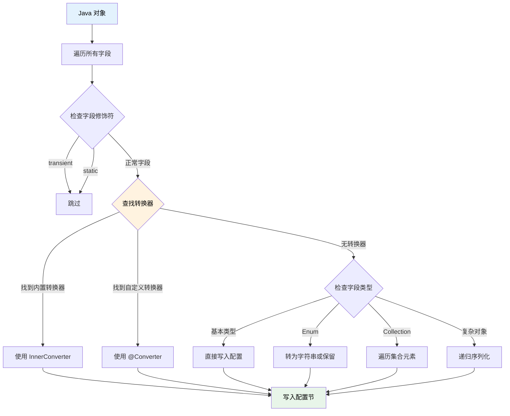
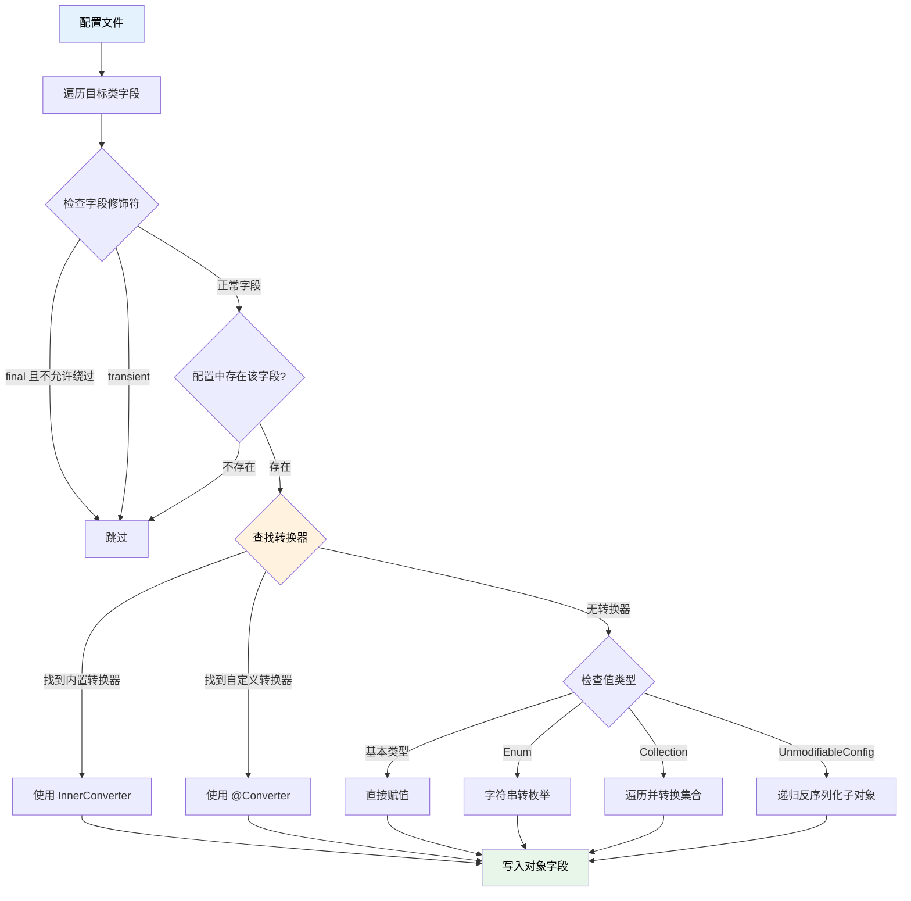

# 配置文件

## 基本概念

TabooLib 提供了强大的配置文件管理系统，支持多种配置格式，并提供了丰富的扩展方法来简化配置文件的读写操作。

**核心特点：**
- 支持 YAML、TOML、JSON、HOCON 等多种格式
- 自动释放和加载配置文件
- 支持文件监听和自动重载
- 提供丰富的扩展方法
- 支持配置序列化和反序列化

## 配置文件类型

TabooLib 支持以下配置文件格式：

| 类型 | 说明 | 扩展名 |
|-----|------|--------|
| `Type.YAML` | YAML 格式（推荐） | `.yml`, `.yaml` |
| `Type.TOML` | TOML 格式 | `.toml`, `.tml` |
| `Type.JSON` | JSON 格式 | `.json` |
| `Type.JSON_MINIMAL` | 精简 JSON 格式 | `.json` |
| `Type.HOCON` | HOCON 格式 | `.conf` |

## 注解式配置 @Config

### 基础用法

使用 `@Config` 注解在 `object` 类的字段上声明配置文件：

```kotlin
object MyPlugin {

    @Config
    lateinit var config: Configuration

    @Awake(LifeCycle.ENABLE)
    fun onEnable() {
        println(config.getString("message"))
    }
}
```

**工作流程：**
1. TabooLib 在插件初始化时扫描 `@Config` 注解
2. 从插件资源中释放 `config.yml` 到插件数据目录
3. 自动加载配置文件到 `config` 字段
4. 可以直接使用配置对象读写数据

### 注解参数详解

`@Config` 注解的完整签名：

```kotlin
annotation class Config(
    val value: String = "config.yml",     // 资源文件路径
    val target: String = "",              // 目标文件路径
    val migrate: Boolean = false,         // 是否迁移配置
    val autoReload: Boolean = false,      // 是否自动重载
    val concurrent: Boolean = true,       // 是否支持并发
)
```

**参数说明：**

#### value

资源文件的路径，默认为 `config.yml`。

```kotlin
@Config("settings.yml")
lateinit var settings: Configuration
```

TabooLib 会从插件 JAR 包的资源目录中提取该文件。

#### target

目标文件路径，默认与 `value` 相同。

```kotlin
@Config(value = "config.yml", target = "mydata/config.yml")
lateinit var config: Configuration
```

**使用场景：** 当你希望资源文件和保存位置不同时使用，例如将配置保存到子目录。

#### migrate

是否迁移配置，默认为 `false`。

```kotlin
@Config(migrate = true)
lateinit var config: Configuration
```

**说明：** 启用后，TabooLib 会自动将旧版本配置的值迁移到新版本配置中。

#### autoReload

是否监听文件变动并自动重载，默认为 `false`。

```kotlin
@Config(autoReload = true)
lateinit var config: Configuration

@Awake(LifeCycle.ENABLE)
fun onEnable() {
    config.onReload {
        println("配置文件已重载")
    }
}
```

**使用场景：** 开发环境下可以实时修改配置文件并立即生效，无需重启服务器。

#### concurrent

是否支持并发访问，默认为 `true`。

```kotlin
@Config(concurrent = false)
lateinit var config: Configuration
```

**说明：**
- `true`（推荐）：使用线程安全的并发配置，适合多线程环境
- `false`：使用普通 LinkedHashMap，性能稍好，但不支持并发

## 手动加载配置文件

### 从文件加载

使用 `Configuration.loadFromFile()` 手动加载配置文件：

```kotlin
val config = Configuration.loadFromFile(File(getDataFolder(), "config.yml"))
```

**完整签名：**

```kotlin
fun loadFromFile(
    file: File,                           // 配置文件
    type: Type? = null,                   // 配置类型（null 时自动识别）
    concurrent: Boolean = true            // 是否支持并发
): Configuration
```

**示例：**

```kotlin
// 自动识别类型（根据扩展名）
val yamlConfig = Configuration.loadFromFile(File("config.yml"))

// 手动指定类型
val tomlConfig = Configuration.loadFromFile(File("config.toml"), Type.TOML)

// 不支持并发
val simpleConfig = Configuration.loadFromFile(File("config.yml"), concurrent = false)
```

### 从字符串加载

使用 `Configuration.loadFromString()` 从字符串加载配置：

```kotlin
val yaml = """
    name: TabooLib
    version: 6.2.0
""".trimIndent()

val config = Configuration.loadFromString(yaml, Type.YAML)
println(config.getString("name"))  // TabooLib
```

**完整签名：**

```kotlin
fun loadFromString(
    contents: String,                     // 配置内容
    type: Type = Type.YAML,               // 配置类型
    concurrent: Boolean = true            // 是否支持并发
): Configuration
```

### 从流加载

#### 从 Reader 加载

```kotlin
val reader = File("config.yml").bufferedReader()
val config = Configuration.loadFromReader(reader, Type.YAML)
```

#### 从 InputStream 加载

```kotlin
val inputStream = File("config.yml").inputStream()
val config = Configuration.loadFromInputStream(inputStream, Type.YAML)
```

### 创建空配置

使用 `Configuration.empty()` 创建一个空配置：

```kotlin
val config = Configuration.empty(Type.YAML)
config["name"] = "TabooLib"
config["version"] = "6.2.0"
```

## 配置文件的读写

### 基础读取

TabooLib 的配置系统继承自 `ConfigurationSection` 接口，提供了丰富的读取方法：

```kotlin
@Config
lateinit var config: Configuration

@Awake(LifeCycle.ENABLE)
fun test() {
    // 获取字符串
    val name = config.getString("name")

    // 获取整数
    val level = config.getInt("level")

    // 获取布尔值
    val enabled = config.getBoolean("enabled")

    // 获取双精度浮点数
    val price = config.getDouble("price")

    // 获取字符串列表
    val items = config.getStringList("items")

    // 获取子节点
    val database = config.getConfigurationSection("database")
    val host = database?.getString("host")
}
```

### 基础写入

使用 `set()` 方法写入配置：

```kotlin
@Config
lateinit var config: Configuration

@Awake(LifeCycle.ENABLE)
fun test() {
    // 设置字符串
    config["name"] = "TabooLib"

    // 设置整数
    config["level"] = 10

    // 设置列表
    config["items"] = listOf("apple", "banana", "orange")

    // 设置子节点
    config["database.host"] = "localhost"
    config["database.port"] = 3306

    // 保存到文件
    config.saveToFile()
}
```

**注意：** 修改配置后需要手动调用 `saveToFile()` 才会保存到磁盘。

### 保存配置文件

#### 保存到原文件

```kotlin
config.saveToFile()
```

#### 保存到指定文件

```kotlin
config.saveToFile(File(getDataFolder(), "backup.yml"))
```

#### 保存为字符串

```kotlin
val content = config.saveToString()
println(content)
```

## 扩展方法

TabooLib 为配置文件提供了大量实用的扩展方法，极大简化了常见操作。

### 颜色相关扩展

#### getStringColored

获取文本并自动上色（支持 `&` 和 `§` 颜色代码）：

```kotlin
// config.yml:
// message: "&aHello &b&lWorld"

val message = config.getStringColored("message")
player.sendMessage(message)  // 显示彩色文本
```

**函数签名：**

```kotlin
fun ConfigurationSection.getStringColored(node: String): String?
```

**特性：**
- 自动将 `&` 和 `§` 颜色代码转换为 Minecraft 颜色
- 返回 `null` 如果节点不存在
- 使用 TabooLib 的 `colored()` 扩展

#### getStringListColored

获取文本列表并自动上色：

```kotlin
// config.yml:
// messages:
//   - "&aLine 1"
//   - "&bLine 2"
//   - "&cLine 3"

val messages = config.getStringListColored("messages")
messages.forEach { player.sendMessage(it) }
```

**函数签名：**

```kotlin
fun ConfigurationSection.getStringListColored(node: String): List<String>
```

### 坐标相关扩展

#### setLocation

将 `Location` 对象保存到配置文件：

```kotlin
val location = Location("world", 100.0, 64.0, 200.0, 90f, 0f)
config.setLocation("spawn", location)
config.saveToFile()
```

**保存格式：**

```yaml
spawn:
  world: world
  x: 100.0
  y: 64.0
  z: 200.0
  yaw: 90.0
  pitch: 0.0
```

**函数签名：**

```kotlin
fun ConfigurationSection.setLocation(path: String, location: Location)
```

#### getLocation

从配置文件读取 `Location` 对象：

```kotlin
val spawn = config.getLocation("spawn")
if (spawn != null) {
    player.teleport(spawn)
}
```

**函数签名：**

```kotlin
fun ConfigurationSection.getLocation(path: String): Location?
```

**返回值：** 如果节点不存在或格式错误，返回 `null`。

### 映射与转换扩展

#### map - 键值映射

将配置节点映射为 `Map`，并对每个键值对进行转换：

```kotlin
// config.yml:
// prices:
//   apple: 10
//   banana: 5
//   orange: 8

val prices = config.map("prices") { name, value ->
    name.uppercase() to (value as Int) * 2
}
// 结果：{APPLE=20, BANANA=10, ORANGE=16}
```

**函数签名：**

```kotlin
fun <V> ConfigurationSection.map(transform: (String, Any) -> V): Map<String, V>
fun <V> ConfigurationSection.map(node: String, transform: (String, Any) -> V): Map<String, V>
```

#### mapValue - 值映射

只对值进行转换，保留原始键：

```kotlin
val upperPrices = config.mapValue("prices") { value ->
    (value as Int) * 2
}
// 结果：{apple=20, banana=10, orange=16}
```

**函数签名：**

```kotlin
fun <V> ConfigurationSection.mapValue(transform: (Any) -> V): Map<String, V>
fun <V> ConfigurationSection.mapValue(node: String, transform: (Any) -> V): Map<String, V>
```

#### mapSection - 配置节映射

将每个子节点作为 `ConfigurationSection` 进行转换：

```kotlin
// config.yml:
// players:
//   Steve:
//     health: 20
//     level: 5
//   Alex:
//     health: 18
//     level: 7

data class PlayerData(val health: Int, val level: Int)

val players = config.mapSection("players") { section ->
    PlayerData(
        health = section.getInt("health"),
        level = section.getInt("level")
    )
}
// 结果：{Steve=PlayerData(health=20, level=5), Alex=PlayerData(health=18, level=7)}
```

**函数签名：**

```kotlin
fun <V> ConfigurationSection.mapSection(transform: (ConfigurationSection) -> V): Map<String, V>
fun <V> ConfigurationSection.mapSection(node: String, transform: (ConfigurationSection) -> V): Map<String, V>
```

#### mapListAs - 列表映射

将配置列表映射为自定义对象列表：

```kotlin
// config.yml:
// items:
//   - name: Sword
//     damage: 10
//   - name: Axe
//     damage: 8

data class Item(val name: String, val damage: Int)

val items = config.mapListAs("items") { map ->
    Item(
        name = map["name"] as String,
        damage = map["damage"] as Int
    )
}
// 结果：[Item(name=Sword, damage=10), Item(name=Axe, damage=8)]
```

**函数签名：**

```kotlin
fun <T> ConfigurationSection.mapListAs(path: String, transform: (Map<String, Any?>) -> T): MutableList<T>
```

#### asMap - 转换为 Map

将任意对象转换为 `Map<String, Any?>`：

```kotlin
val config = Configuration.empty()
config["name"] = "TabooLib"
config["version"] = "6.2.0"

val map = config.asMap()
// 结果：{name=TabooLib, version=6.2.0}
```

**函数签名：**

```kotlin
fun Any?.asMap(): Map<String, Any?>
```

### 配置合并扩展

#### mergeTo

将一个配置文件合并到另一个配置文件：

```kotlin
val config1 = Configuration.empty()
config1["name"] = "TabooLib"
config1["settings.debug"] = true

val config2 = Configuration.empty()
config2["version"] = "6.2.0"
config2["settings.debug"] = false

// 合并 config1 到 config2，覆盖重复键
config1.mergeTo(config2, overwrite = true)

println(config2.getString("name"))            // TabooLib
println(config2.getBoolean("settings.debug")) // true（被覆盖）
```

**函数签名：**

```kotlin
fun ConfigurationSection.mergeTo(section: ConfigurationSection, overwrite: Boolean = true): ConfigurationSection
```

**参数说明：**
- `section`：目标配置节
- `overwrite`：是否覆盖相同的键（默认 `true`）

**使用场景：** 合并默认配置和用户配置，或者合并多个配置文件。

### 序列化与反序列化扩展

#### serialize - 对象序列化

将任意对象序列化为配置节：

```kotlin
data class PlayerData(
    val name: String,
    val level: Int,
    val inventory: List<String>
)

val playerData = PlayerData("Steve", 10, listOf("Sword", "Shield"))
// highlight-next-line
val section = Configuration.serialize(playerData)

// 方式 1：复制到 Configuration 根节点
val config = Configuration.loadFromFile(File(getDataFolder(), "player.yml"))
section.getKeys(false).forEach { key ->
    config[key] = section[key]
}
config.saveToFile()

// 方式 2：使用 setObject 保存到指定节点（推荐）
val config2 = Configuration.loadFromFile(File(getDataFolder(), "player2.yml"))
config2.setObject("playerData", playerData)
config2.saveToFile()
```

**方式 1 保存结果（数据在根节点）：**

```yaml
name: Steve
level: 10
inventory:
  - Sword
  - Shield
```

**方式 2 保存结果（数据在子节点）：**

```yaml
playerData:
  name: Steve
  level: 10
  inventory:
    - Sword
    - Shield
```

**函数签名：**

```kotlin
fun serialize(obj: Any, type: Type = Type.YAML, concurrent: Boolean = true): ConfigurationSection
```

**说明：** `serialize` 返回的是 `ConfigurationSection`（不包含文件信息），需要将其内容复制到 `Configuration` 对象后才能保存。两种方式的区别在于数据存储的位置不同。

## 序列化与反序列化深度解析

### 工作原理

TabooLib 的配置序列化基于 Night-Config 的 `ObjectConverter`，通过 Java 反射自动将对象字段与配置节点进行映射。

#### 序列化流程



#### 反序列化流程



### 支持的类型

TabooLib 的序列化系统支持以下类型的自动转换：

| 类型分类 | 具体类型 | 说明 |
|---------|---------|------|
| **基本类型** | `String`, `Int`, `Double`, `Boolean`, `Long`, `Float`, `Short`, `Byte` | 直接支持 |
| **集合类型** | `List`, `ArrayList`, `Set`, `Collection` | 支持嵌套集合 |
| **映射类型** | `Map` | 需要使用内置的 `MapConverter` |
| **枚举类型** | `Enum` | 自动转换为字符串（或保留原值） |
| **UUID** | `UUID` | 使用内置的 `UUIDConverter` |
| **自定义对象** | 任意 data class 或 POJO | 递归序列化 |

### 字段修饰符处理

#### transient 字段

被 `transient` 修饰的字段默认会被跳过：

```kotlin
data class PlayerData(
    val name: String,
    val level: Int,
    @Transient val cachedValue: String = "" // 不会被序列化
)
```

#### final 字段

反序列化时，`final` 字段默认会被写入（`bypassFinal = true`）：

```kotlin
data class Config(
    val version: Int = 1,        // 会被反序列化覆盖
    var lastModified: Long = 0   // 会被反序列化覆盖
)
```

#### static 字段

静态字段会被自动跳过，不参与序列化和反序列化。

### 自定义转换器

#### 使用内置转换器

TabooLib 内置了两个转换器：

##### UUID 转换器

自动将 `UUID` 与 `String` 互相转换：

```kotlin
data class PlayerData(
    val uuid: UUID,  // 自动使用 UUIDConverter
    val name: String
)

val data = PlayerData(UUID.randomUUID(), "Steve")
val config = Configuration.loadFromFile(File("player.yml"))
config.setObject("player", data)
config.saveToFile()
```

**保存结果：**

```yaml
player:
  uuid: "550e8400-e29b-41d4-a716-446655440000"
  name: "Steve"
```

##### Map 转换器

保持 `Map` 类型的字段为 Map 格式：

```kotlin
data class ServerConfig(
    val settings: Map<String, Any>  // 自动使用 MapConverter
)
```

#### 使用 @Converter 注解

:::warning[开发中功能]
自定义 `@Converter` 注解支持正在开发中，当前版本只能通过修改 `ObjectConverter.getConverter()` 方法来扩展转换器。
:::

#### 使用 InnerConverter（伴生对象转换器）

`InnerConverter` 是一种更强大的转换机制，允许在类的伴生对象中定义 `toField` 和 `fromField` 方法：

```kotlin
data class Location(
    val world: String,
    val x: Double,
    val y: Double,
    val z: Double
) {
    companion object {
        @JvmStatic
        fun toField(field: Field, value: Any, root: ConfigurationSection): ConvertResult {
            // value 是从配置文件读取的值
            // 返回 ConvertResult.Success(转换后的对象)
            return if (value is Map<*, *>) {
                val loc = Location(
                    value["world"] as String,
                    (value["x"] as Number).toDouble(),
                    (value["y"] as Number).toDouble(),
                    (value["z"] as Number).toDouble()
                )
                ConvertResult.Success(loc)
            } else {
                ConvertResult.Failure(IllegalArgumentException("Invalid location format"))
            }
        }

        @JvmStatic
        fun fromField(field: Field, value: Any, root: Any): ConvertResult {
            // value 是 Location 对象
            // 返回 ConvertResult.Success(Map) 以写入配置
            return if (value is Location) {
                val map = mapOf(
                    "world" to value.world,
                    "x" to value.x,
                    "y" to value.y,
                    "z" to value.z
                )
                ConvertResult.Success(map)
            } else {
                ConvertResult.Skip
            }
        }
    }
}
```

**使用示例：**

```kotlin
data class GameData(
    val spawnPoint: Location  // 自动使用 InnerConverter
)

val data = GameData(Location("world", 0.0, 64.0, 0.0))
val config = Configuration.loadFromFile(File("game.yml"))
config.setObject("data", data)
config.saveToFile()
```

**保存结果：**

```yaml
data:
  spawnPoint:
    world: world
    x: 0.0
    y: 64.0
    z: 0.0
```

**ConvertResult 说明：**

| 类型 | 说明 | 使用场景 |
|-----|------|---------|
| `ConvertResult.Success(value)` | 转换成功，返回转换后的值 | 正常转换 |
| `ConvertResult.Failure(exception)` | 转换失败，打印异常并跳过该字段 | 数据格式错误 |
| `ConvertResult.Skip` | 跳过此字段的转换，使用默认处理 | 不需要特殊处理 |

### @ConfigNode 注解

使用 `@ConfigNode` 可以自定义字段在配置文件中的路径：

```kotlin
data class DatabaseConfig(
    @ConfigNode("database.mysql.host")
    val host: String = "localhost",

    @ConfigNode("database.mysql.port")
    val port: Int = 3306
)

val config = Configuration.loadFromFile(File("config.yml"))
config.setObject("", DatabaseConfig())  // 根节点
config.saveToFile()
```

**保存结果：**

```yaml
database:
  mysql:
    host: localhost
    port: 3306
```

### 集合类型的序列化

#### 简单集合

```kotlin
data class ItemList(
    val items: List<String>,
    val prices: Map<String, Double>
)

val data = ItemList(
    items = listOf("Apple", "Banana", "Orange"),
    prices = mapOf("Apple" to 10.0, "Banana" to 5.0)
)
```

**保存结果：**

```yaml
items:
  - Apple
  - Banana
  - Orange
prices:
  Apple: 10.0
  Banana: 5.0
```

#### 复杂对象集合

```kotlin
data class Item(val name: String, val price: Double)

data class Shop(
    val items: List<Item>
)

val shop = Shop(
    items = listOf(
        Item("Sword", 100.0),
        Item("Shield", 50.0)
    )
)

val config = Configuration.loadFromFile(File("shop.yml"))
config.setObject("shop", shop)
config.saveToFile()
```

**保存结果：**

```yaml
shop:
  items:
    - name: Sword
      price: 100.0
    - name: Shield
      price: 50.0
```

#### 嵌套集合

```kotlin
data class Matrix(
    val data: List<List<Int>>
)

val matrix = Matrix(
    data = listOf(
        listOf(1, 2, 3),
        listOf(4, 5, 6),
        listOf(7, 8, 9)
    )
)
```

**保存结果：**

```yaml
data:
  - [1, 2, 3]
  - [4, 5, 6]
  - [7, 8, 9]
```

### ignoreConstructor 参数

当类没有无参构造函数或构造函数有副作用时，可以使用 `ignoreConstructor` 参数：

```kotlin
data class ComplexData(val id: Int) {
    init {
        println("Constructor called!")  // 有副作用
    }
}

val config = Configuration.loadFromFile(File("data.yml"))
// 使用 unsafeInstance() 创建对象，跳过构造函数
val data = config.toObject<ComplexData>(ignoreConstructor = true)
```

:::warning[使用注意]
使用 `ignoreConstructor = true` 会跳过对象的构造函数和 `init` 块，字段的默认值也不会被初始化。仅在必要时使用。
:::

### 常见序列化问题

#### 为什么某些字段没有被序列化？

检查以下几点：

1. 字段是否被 `transient` 修饰
2. 字段是否为 `static`（静态字段不会被序列化）
3. 字段类型是否被配置格式支持（如 YAML 不直接支持所有类型）

#### 如何序列化接口类型？

接口类型无法直接序列化，需要使用具体实现类：

```kotlin
// ❌ 错误
data class Config(
    val handler: Runnable  // 接口类型无法序列化
)

// ✅ 正确
data class Config(
    val handlerClass: String  // 保存类名，运行时再实例化
)
```

#### 如何处理循环引用？

TabooLib 的序列化不支持循环引用，会导致 `StackOverflowError`：

```kotlin
// ❌ 循环引用
data class Node(
    val value: Int,
    var next: Node? = null
)

val node1 = Node(1)
val node2 = Node(2)
node1.next = node2
node2.next = node1  // 循环引用！

// ✅ 使用 transient 或 ID 引用
data class Node(
    val value: Int,
    val nextId: Int? = null  // 使用 ID 而非直接引用
)
```

#### deserialize - 配置反序列化

从配置节反序列化为对象：

```kotlin
data class PlayerData(
    val name: String,
    val level: Int,
    val inventory: List<String>
)

val config = Configuration.loadFromFile(File("player.yml"))
// highlight-next-line
val playerData = Configuration.deserialize<PlayerData>(config)

println(playerData.name)      // Steve
println(playerData.level)     // 10
println(playerData.inventory) // [Sword, Shield]
```

**函数签名：**

```kotlin
inline fun <reified T> deserialize(section: ConfigurationSection, ignoreConstructor: Boolean = false): T
```

**参数说明：**
- `section`：配置节
- `ignoreConstructor`：是否忽略构造函数（使用 `unsafeInstance`）

#### toObject - 转换为对象

直接将配置节转换为对象（扩展方法）：

```kotlin
val config = Configuration.loadFromFile(File("player.yml"))
val playerData = config.toObject<PlayerData>()
```

**函数签名：**

```kotlin
inline fun <reified T> ConfigurationSection.toObject(ignoreConstructor: Boolean = false): T
```

#### getObject - 获取并反序列化

获取子节点并反序列化为对象：

```kotlin
// config.yml:
// database:
//   host: localhost
//   port: 3306
//   user: root

data class DatabaseConfig(
    val host: String,
    val port: Int,
    val user: String
)

val dbConfig = config.getObject<DatabaseConfig>("database")
```

**函数签名：**

```kotlin
inline fun <reified T> ConfigurationSection.getObject(key: String, ignoreConstructor: Boolean = false): T
```

#### setObject - 序列化并写入

将对象序列化后写入配置：

```kotlin
data class DatabaseConfig(val host: String, val port: Int, val user: String)

val dbConfig = DatabaseConfig("localhost", 3306, "root")
config.setObject("database", dbConfig)
config.saveToFile()
```

**保存结果：**

```yaml
database:
  host: localhost
  port: 3306
  user: root
```

**函数签名：**

```kotlin
fun ConfigurationSection.setObject(key: String, obj: Any)
```

## 文件监听与自动重载

### 使用 @Config 自动重载

最简单的方式是在 `@Config` 注解中启用 `autoReload`：

```kotlin
@Config(autoReload = true)
lateinit var config: Configuration

@Awake(LifeCycle.ENABLE)
fun onEnable() {
    config.onReload {
        println("配置文件已重载")
        // 重新加载配置相关的数据
        reloadSettings()
    }
}
```

### 手动使用 FileWatcher

使用 `FileWatcher` 监听任意文件的变动：

```kotlin
val file = File(getDataFolder(), "data.yml")

FileWatcher.INSTANCE.addSimpleListener(file) { changedFile ->
    println("文件已变动: ${changedFile.name}")
    // 执行重载逻辑
    reload(changedFile)
}
```

**函数签名：**

```kotlin
fun addSimpleListener(
    file: File,                           // 要监听的文件
    runnable: Consumer<File>,             // 文件变动时执行的回调
    runImmediately: Boolean = false       // 是否立即执行一次回调
): Unit
```

**特性：**
- 支持监听文件和目录
- 监听文件的创建、修改、删除事件
- 500ms 检查间隔（可配置）

### 监听整个目录

监听目录下所有文件的变动：

```kotlin
val folder = File(getDataFolder(), "configs")

FileWatcher.INSTANCE.addSimpleListener(folder) { changedFile ->
    println("目录中的文件已变动: ${changedFile.name}")
    // 处理目录中的文件变动
}
```

### 移除监听器

```kotlin
val file = File(getDataFolder(), "config.yml")
FileWatcher.INSTANCE.removeListener(file)
```

## 配置重载回调

### onReload 回调

注册配置重载时执行的回调：

```kotlin
@Config
lateinit var config: Configuration

@Awake(LifeCycle.ENABLE)
fun onEnable() {
    config.onReload {
        println("配置已重载")
    }
}
```

**使用场景：** 当配置重载时，重新加载依赖于配置的数据（如命令、功能开关等）。

### 手动重载配置

调用 `reload()` 方法手动重载配置：

```kotlin
config.reload()
```

**说明：** 重新从磁盘加载配置文件，并触发所有 `onReload` 回调。

## 配置文件类型转换

### changeType - 变更配置类型

将配置文件从一种格式转换为另一种格式：

```kotlin
val config = Configuration.loadFromFile(File("config.yml"), Type.YAML)

// 转换为 JSON 格式
config.changeType(Type.JSON)

// 保存为 JSON 文件
config.saveToFile(File("config.json"))
```

**函数签名：**

```kotlin
fun changeType(type: Type)
```

**使用场景：** 迁移配置文件格式，或者需要以不同格式导出配置。

## 释放资源文件

### releaseResourceFile

从插件 JAR 包中释放资源文件到数据目录：

```kotlin
// 释放 config.yml 到插件数据目录
val configFile = releaseResourceFile("config.yml")

// 释放并覆盖已存在的文件
val langFile = releaseResourceFile("lang/en_US.yml", replace = true)

// 释放到指定位置
val dataFile = releaseResourceFile("data.yml", target = "mydata/data.yml")
```

**函数签名：**

```kotlin
fun releaseResourceFile(
    source: String,                       // 资源文件源路径
    replace: Boolean = false,             // 是否覆盖已存在的文件
    target: String = source               // 目标路径（相对于数据目录）
): File
```

**使用场景：** 释放默认配置文件、语言文件等插件资源。

### releaseResourceFolder

释放整个资源目录：

```kotlin
// 释放 lang/ 目录下的所有文件
releaseResourceFolder("lang/")

// 释放并覆盖已存在的文件
releaseResourceFolder("configs/", replace = true)
```

**函数签名：**

```kotlin
fun releaseResourceFolder(prefix: String, replace: Boolean = false)
```

## 最佳实践示例

### 示例 1：完整的配置管理

```kotlin
object MyPlugin {

    @Config("config.yml", autoReload = true)
    lateinit var config: Configuration

    @Config("lang/zh_CN.yml")
    lateinit var lang: Configuration

    @Awake(LifeCycle.ENABLE)
    fun onEnable() {
        // 注册重载回调
        config.onReload {
            info("配置文件已重载")
            reloadSettings()
        }

        // 读取配置
        val debug = config.getBoolean("debug")
        val message = lang.getStringColored("messages.welcome")

        info("调试模式: $debug")
        info("欢迎消息: $message")
    }

    fun reloadSettings() {
        // 重新加载配置相关的数据
        val maxPlayers = config.getInt("max-players", 100)
        info("最大玩家数: $maxPlayers")
    }

    @Awake(LifeCycle.DISABLE)
    fun onDisable() {
        // 保存配置
        config.saveToFile()
    }
}
```

### 示例 2：数据库配置管理

```kotlin
object DatabaseModule {

    data class DatabaseConfig(
        val host: String = "localhost",
        val port: Int = 3306,
        val database: String = "minecraft",
        val username: String = "root",
        val password: String = ""
    )

    @Config("database.yml")
    lateinit var config: Configuration

    lateinit var dbConfig: DatabaseConfig

    @Awake(LifeCycle.ENABLE)
    fun loadDatabase() {
        // 从配置文件反序列化数据库配置
        dbConfig = config.toObject<DatabaseConfig>()

        info("数据库地址: ${dbConfig.host}:${dbConfig.port}")
        info("数据库名称: ${dbConfig.database}")

        // 连接数据库
        connectDatabase(dbConfig)
    }

    fun connectDatabase(config: DatabaseConfig) {
        // 数据库连接逻辑
    }
}
```

### 示例 3：玩家数据管理

```kotlin
object PlayerDataManager {

    data class PlayerData(
        var level: Int = 1,
        var exp: Int = 0,
        var lastLogin: Long = System.currentTimeMillis()
    )

    fun savePlayerData(player: Player, data: PlayerData) {
        val config = Configuration.empty()
        config.setObject("data", data)
        config.saveToFile(File(getDataFolder(), "players/${player.uniqueId}.yml"))
    }

    fun loadPlayerData(player: Player): PlayerData {
        val file = File(getDataFolder(), "players/${player.uniqueId}.yml")
        if (!file.exists()) {
            return PlayerData()
        }
        val config = Configuration.loadFromFile(file)
        return config.getObject("data")
    }
}
```

### 示例 4：多配置文件管理

```kotlin
object ConfigManager {

    @Config("config.yml", autoReload = true)
    lateinit var mainConfig: Configuration

    @Config("items.yml")
    lateinit var itemsConfig: Configuration

    @Config("shops.yml")
    lateinit var shopsConfig: Configuration

    data class ShopItem(val name: String, val price: Double, val stock: Int)

    @Awake(LifeCycle.ENABLE)
    fun loadConfigs() {
        // 加载主配置
        val debug = mainConfig.getBoolean("debug", false)

        // 加载商店物品
        val items = shopsConfig.mapSection("items") { section ->
            ShopItem(
                name = section.getString("name") ?: "Unknown",
                price = section.getDouble("price", 0.0),
                stock = section.getInt("stock", 0)
            )
        }

        info("已加载 ${items.size} 个商店物品")
    }
}
```

### 示例 5：配置迁移

```kotlin
object ConfigMigration {

    @Config("config.yml")
    lateinit var config: Configuration

    @Awake(LifeCycle.ENABLE)
    fun migrateConfig() {
        // 检查配置版本
        val version = config.getInt("config-version", 1)

        if (version < 2) {
            info("正在迁移配置到 v2...")

            // 添加新字段
            if (!config.contains("new-feature.enabled")) {
                config["new-feature.enabled"] = true
                config["new-feature.value"] = 100
            }

            // 更新版本号
            config["config-version"] = 2
            config.saveToFile()

            info("配置迁移完成")
        }
    }
}
```

### 示例 6：配置合并

```kotlin
object ConfigMerger {

    @Awake(LifeCycle.ENABLE)
    fun mergeConfigs() {
        // 加载默认配置
        val defaultConfig = Configuration.loadFromString(
            """
            settings:
              debug: false
              max-players: 100
            messages:
              welcome: "Welcome!"
            """.trimIndent()
        )

        // 加载用户配置
        val userConfig = Configuration.loadFromFile(File(getDataFolder(), "config.yml"))

        // 合并配置（用户配置优先）
        userConfig.mergeTo(defaultConfig, overwrite = false)

        // 保存合并后的配置
        defaultConfig.saveToFile(File(getDataFolder(), "config.yml"))
    }
}
```

## 常见问题

### 如何读取嵌套配置？

使用点号 `.` 分隔路径：

```kotlin
// config.yml:
// database:
//   mysql:
//     host: localhost
//     port: 3306

val host = config.getString("database.mysql.host")
val port = config.getInt("database.mysql.port")
```

或者使用 `getConfigurationSection`：

```kotlin
val mysql = config.getConfigurationSection("database.mysql")
val host = mysql?.getString("host")
val port = mysql?.getInt("port")
```

### 如何保存配置时保持注释？

TabooLib 的配置系统基于 Night-Config，不支持保留 YAML 注释。如果需要保留注释，可以：

1. 使用 `SecuredFile`（兼容模式）
2. 使用外部 YAML 库（如 SnakeYAML）
3. 在资源文件中提供完整的注释版本

### 配置文件格式自动识别如何工作？

`Configuration.loadFromFile()` 根据文件扩展名自动识别格式：

| 扩展名 | 格式 |
|--------|------|
| `.yml`, `.yaml` | YAML |
| `.toml`, `.tml` | TOML |
| `.json` | JSON |
| `.conf` | HOCON |

如果扩展名无法识别，会使用默认的 YAML 格式。

### 如何处理配置不存在的情况？

使用默认值参数：

```kotlin
val debug = config.getBoolean("debug", false)
val maxPlayers = config.getInt("max-players", 100)
val message = config.getString("message", "Default message")
```

或者使用 `contains()` 检查：

```kotlin
if (config.contains("debug")) {
    val debug = config.getBoolean("debug")
}
```

### 为什么配置修改后没有保存？

必须手动调用 `saveToFile()` 才会保存到磁盘：

```kotlin
config["key"] = "value"
config.saveToFile()  // 不要忘记保存
```

### @Config 注解的配置文件在哪里？

1. TabooLib 从 JAR 包的资源目录中提取文件
2. 保存到插件数据目录（`plugins/<插件名>/`）
3. 例如：`plugins/MyPlugin/config.yml`

### 如何同时监听多个配置文件？

使用多个 `@Config` 注解：

```kotlin
@Config("config.yml", autoReload = true)
lateinit var config: Configuration

@Config("data.yml", autoReload = true)
lateinit var data: Configuration

@Awake(LifeCycle.ENABLE)
fun onEnable() {
    config.onReload { info("config.yml 已重载") }
    data.onReload { info("data.yml 已重载") }
}
```

### 配置序列化支持哪些类型？

支持以下类型：
- 基本类型：`String`, `Int`, `Double`, `Boolean`, `Long`, `Float`
- 集合类型：`List`, `Set`, `Map`
- 嵌套对象：自定义数据类
- 可选类型：支持默认值

不支持的类型：
- 函数类型
- 接口类型（除非提供实现）
- 泛型擦除的复杂类型

### 如何在配置中存储 UUID？

将 UUID 转换为字符串存储：

```kotlin
// 保存
config["player-uuid"] = player.uniqueId.toString()
config.saveToFile()

// 读取
val uuidString = config.getString("player-uuid")
val uuid = UUID.fromString(uuidString)
```

### concurrent 参数什么时候设置为 false？

- **设置为 true（推荐）**：多线程环境，异步读写配置
- **设置为 false**：单线程环境，仅主线程访问配置，性能要求高

大多数情况下使用默认的 `true` 即可。
