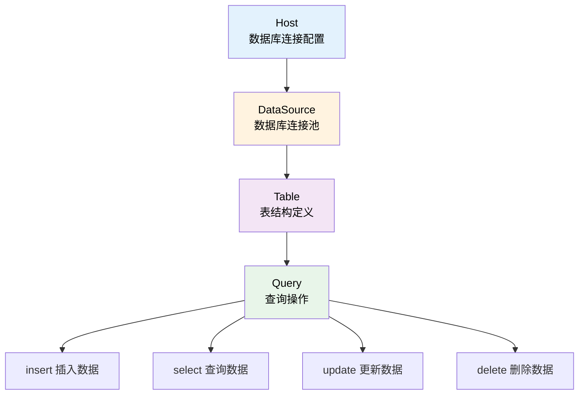

# 数据库

Database 模块是 TabooLib 提供的数据库操作工具，通过 DSL（领域特定语言）简化 SQL 操作，支持类型安全的查询构建和结果获取。

## 核心概念解析

Database 模块由四个核心部分组成，它们相互配合完成数据库操作：



- **Host**：数据库连接配置，包含主机地址、端口、用户名、密码等信息
- **DataSource**：数据库连接池，负责管理和复用数据库连接
- **Table**：表对象，描述数据库表的结构（列名、类型、约束等）
- **Query**：查询操作，提供 DSL 风格的增删改查方法

## 数据库连接配置

### 创建 Host 对象

**方式 1：从配置文件读取**

在配置文件中定义数据库连接信息：

```yaml
database:
  host: 127.0.0.1
  port: 3306
  user: root
  password: root123
  database: minecraft_server
```

然后在代码中读取配置创建 Host：

```kotlin
val host = config.getHost("database")
```

**代码说明：**
- `config.getHost()`：从配置文件读取数据库配置并创建 Host 对象
- 配置路径 `"database"` 对应 YAML 中的配置节点

**方式 2：手动创建 Host**

你也可以直接在代码中创建 Host 对象：

```kotlin
val host = HostSQL(
    host = "127.0.0.1",
    port = "3306",
    user = "root",
    password = "root123",
    database = "minecraft_server"
)
```

**适用场景：** 需要动态配置数据库连接或多数据源切换时使用

### 创建 DataSource

使用 Host 创建数据库连接池：

```kotlin
val dataSource by lazy { host.createDataSource() }
```

**关键点：**
- 使用 `by lazy` 延迟初始化，避免在插件加载时立即建立数据库连接
- `createDataSource()` 会自动创建 HikariCP 连接池
- DataSource 会在插件卸载时自动关闭，无需手动释放

**为什么使用延迟初始化？**

```kotlin
// ✅ 正确 - 使用 lazy 延迟初始化
val dataSource by lazy { host.createDataSource() }

// ❌ 错误 - 立即初始化可能导致插件加载时连接失败
val dataSource = host.createDataSource()  // 如果数据库未启动会导致插件加载失败
```

## 定义表结构

在操作数据库之前，需要先定义表的结构。如果你不熟悉 SQL，可以把数据库理解为 Excel 表格，我们需要定义每一列的名称、类型和约束。

### 基础表结构

创建一个简单的用户数据表：

```kotlin
val table = Table("user_data", host) {
    // 自增主键 ID
    add { id() }

    // 用户 UUID（36 字符，建立索引）
    add("user") {
        type(ColumnTypeSQL.VARCHAR, 36) {
            options(ColumnOptionSQL.KEY)
        }
    }

    // 数据键名（64 字符，建立索引）
    add("key") {
        type(ColumnTypeSQL.VARCHAR, 64) {
            options(ColumnOptionSQL.KEY)
        }
    }

    // 数据值（128 字符）
    add("value") {
        type(ColumnTypeSQL.VARCHAR, 128)
    }
}
```

**代码说明：**
- `Table(表名, Host对象)`：创建表对象
- `add { id() }`：添加自增主键列
- `add("列名")`：添加普通列
- `type(类型, 长度)`：指定列的数据类型和长度
- `options(选项)`：设置列的约束选项（如索引、非空等）

**表结构可视化：**

```
user_data 表
┌────┬──────────────────────────────────────┬──────────────────┬────────────────┐
│ id │ user                                 │ key              │ value          │
├────┼──────────────────────────────────────┼──────────────────┼────────────────┤
│ 1  │ 550e8400-e29b-41d4-a716-446655440000 │ money            │ 1000           │
│ 2  │ 550e8400-e29b-41d4-a716-446655440000 │ level            │ 5              │
│ 3  │ 6ba7b810-9dad-11d1-80b4-00c04fd430c8 │ money            │ 500            │
└────┴──────────────────────────────────────┴──────────────────┴────────────────┘
  ↑           ↑                                   ↑                  ↑
自增ID    玩家UUID (索引)                     数据键 (索引)       数据值
```

### 常用数据类型

TabooLib 提供了丰富的 SQL 数据类型：

**整数类型：**

```kotlin
add("level") {
    type(ColumnTypeSQL.INT)  // 整数类型，范围 -2,147,483,648 到 2,147,483,647
}

add("id") {
    type(ColumnTypeSQL.BIGINT) {  // 长整数类型
        options(
            ColumnOptionSQL.UNSIGNED,        // 无符号（只存储非负数）
            ColumnOptionSQL.AUTO_INCREMENT,  // 自动递增
            ColumnOptionSQL.PRIMARY_KEY      // 主键
        )
    }
}
```

**字符串类型：**

```kotlin
add("name") {
    type(ColumnTypeSQL.VARCHAR, 32)  // 可变长度字符串，最多 32 字符
}

add("description") {
    type(ColumnTypeSQL.TEXT)  // 长文本，最多 65,535 字符
}
```

**小数类型：**

```kotlin
add("money") {
    type(ColumnTypeSQL.DECIMAL, 10, 2)  // 精确小数，10 位数字，2 位小数
}

add("ratio") {
    type(ColumnTypeSQL.DOUBLE)  // 双精度浮点数
}
```

**日期时间类型：**

```kotlin
add("created_at") {
    type(ColumnTypeSQL.TIMESTAMP)  // 时间戳
}

add("birthday") {
    type(ColumnTypeSQL.DATE)  // 日期（不含时间）
}
```

**特性：** 详细的类型列表请参考 `ColumnTypeSQL.kt`

### 列约束选项

为列添加约束，控制数据的存储规则：

```kotlin
add("email") {
    type(ColumnTypeSQL.VARCHAR, 64) {
        options(
            ColumnOptionSQL.NOTNULL,      // 不允许为空
            ColumnOptionSQL.UNIQUE_KEY    // 唯一索引（不允许重复）
        )
    }
}

add("username") {
    type(ColumnTypeSQL.VARCHAR, 32) {
        options(
            ColumnOptionSQL.KEY,          // 普通索引（加快查询速度）
            ColumnOptionSQL.NOTNULL       // 不允许为空
        )
    }
}
```

**常用选项：**
- `PRIMARY_KEY`：主键（唯一且非空）
- `UNIQUE_KEY`：唯一索引（不允许重复值）
- `KEY`：普通索引（提升查询性能）
- `NOTNULL`：非空约束
- `AUTO_INCREMENT`：自动递增（仅用于整数类型）
- `UNSIGNED`：无符号数（仅存储非负数）

### id() 函数详解

`id()` 是一个快捷函数，用于创建标准的自增主键：

```kotlin
fun id() {
    name = "id"
    type = ColumnTypeSQL.BIGINT
    extra {
        options = arrayOf(
            ColumnOptionSQL.UNSIGNED,         // 无符号
            ColumnOptionSQL.NOTNULL,          // 非空
            ColumnOptionSQL.AUTO_INCREMENT,   // 自动递增
            ColumnOptionSQL.PRIMARY_KEY       // 主键
        )
    }
}
```

**关键点：**
- 使用 `BIGINT` 类型，支持更大的数值范围
- 自动递增，插入数据时无需手动指定 ID
- 作为主键，保证每行数据的唯一性

### 创建数据表

定义表结构后，需要在数据库中实际创建表：

```kotlin
// 如果表不存在则创建
table.createTable(dataSource)

// 强制创建（会删除已存在的表）
table.createTable(dataSource, checkExists = false)
```

**适用场景：** 通常在插件初始化时调用，确保数据库表存在

## 数据操作（CRUD）

CRUD 是数据库操作的四个基本功能：Create（创建）、Read（读取）、Update（更新）、Delete（删除）。

### 初始化数据库管理类

建议将数据库操作封装到一个类中，便于管理：

```kotlin
object UserDatabase {

    // 读取配置
    val host = config.getHost("database")

    // 创建数据源（延迟初始化）
    val dataSource by lazy { host.createDataSource() }

    // 定义表结构
    val table = Table("user_data", host) {
        add { id() }
        add("user") {
            type(ColumnTypeSQL.VARCHAR, 36) {
                options(ColumnOptionSQL.KEY)
            }
        }
        add("key") {
            type(ColumnTypeSQL.VARCHAR, 64) {
                options(ColumnOptionSQL.KEY)
            }
        }
        add("value") {
            type(ColumnTypeSQL.VARCHAR, 128)
        }
    }

    init {
        // 创建表（如果不存在）
        table.createTable(dataSource)
    }
}
```

**代码说明：**
- 使用 `object` 创建单例对象
- 在 `init` 块中初始化表结构
- 所有数据库操作都在这个类中实现

### 插入数据 (INSERT)

将数据插入到数据库表中：

```kotlin
fun add(user: String, key: String, value: String) {
    table.insert(dataSource, "user", "key", "value") {
        value(user, key, value)
    }
}
```

**代码说明：**
- `insert(dataSource, 列名...)`：指定要插入数据的列
- `value(...)`：提供对应列的值（顺序必须与列名一致）
- 无需指定 `id` 列，因为它会自动递增

**调用示例：**

```kotlin
UserDatabase.add(
    player.uniqueId.toString(),
    "money",
    "1000"
)
```

**插入多条数据：**

```kotlin
fun addBatch(user: String, data: Map<String, String>) {
    table.insert(dataSource, "user", "key", "value") {
        data.forEach { (k, v) ->
            value(user, k, v)
        }
    }
}
```

**重复时更新（ON DUPLICATE KEY UPDATE）：**

当插入的数据存在唯一键冲突时，自动更新已有数据：

```kotlin
fun addOrUpdate(user: String, key: String, value: String) {
    table.insert(dataSource, "user", "key", "value") {
        value(user, key, value)

        // 如果 (user, key) 组合已存在，则更新 value
        onDuplicateKeyUpdate {
            update("value", value)
        }
    }
}
```

**适用场景：** 当表的多个列组合建立了唯一索引时使用

### 查询数据 (SELECT)

从数据库中读取数据。

#### 查询单个值

```kotlin
fun get(user: String, key: String): String? {
    // highlight-start
    return table.select(dataSource) {
        rows("value")                        // 查询 value 列
        where("user" eq user and ("key" eq key))  // 过滤条件
        limit(1)                             // 限制返回 1 条
    }.firstOrNull {
        getString("value")                   // 获取 value 字段的值
    }
    // highlight-end
}
```

**代码说明：**
- `rows("列名")`：指定要查询的列
- `where { 条件 }`：设置过滤条件
- `limit(1)`：限制结果数量
- `firstOrNull { }`：获取第一条结果，如果没有则返回 `null`
- `getString("列名")`：获取字符串类型的值

**调用示例：**

```kotlin
val money = UserDatabase.get(player.uniqueId.toString(), "money")
player.sendMessage("你的金币: ${money ?: "0"}")
```

#### 查询列表

```kotlin
fun getList(user: String): Map<String, String> {
    return table.select(dataSource) {
        rows("key", "value")                 // 查询 key 和 value 列
        where("user" eq user)                // 过滤条件
    }.map {
        getString("key") to getString("value")  // 将结果映射为 Pair
    }.toMap()
}
```

**代码说明：**
- `map { }`：遍历所有查询结果
- `to`：创建键值对
- `toMap()`：转换为 Map 集合

**调用示例：**

```kotlin
val userData = UserDatabase.getList(player.uniqueId.toString())
userData.forEach { (key, value) ->
    player.sendMessage("$key: $value")
}
```

#### 获取不同类型的值

```kotlin
// 获取整数
val level = table.select(dataSource) {
    rows("level")
    where("user" eq userUUID)
}.firstOrNull {
    getInt("level")  // 返回 Int 类型
}

// 获取浮点数
val ratio = table.select(dataSource) {
    rows("ratio")
    where("user" eq userUUID)
}.firstOrNull {
    getDouble("ratio")  // 返回 Double 类型
}

// 获取布尔值
val enabled = table.select(dataSource) {
    rows("enabled")
    where("user" eq userUUID)
}.firstOrNull {
    getBoolean("enabled")  // 返回 Boolean 类型
}
```

**常用方法：**
- `getString(列名)`：获取字符串
- `getInt(列名)`：获取整数
- `getLong(列名)`：获取长整数
- `getDouble(列名)`：获取双精度浮点数
- `getBoolean(列名)`：获取布尔值
- `getBytes(列名)`：获取字节数组

#### 判断数据是否存在

```kotlin
fun exists(user: String, key: String): Boolean {
    return table.find(dataSource) {
        where("user" eq user and ("key" eq key))
    }
}
```

**代码说明：**
- `find()`：判断是否存在符合条件的数据，返回 `Boolean`
- 比 `select()` 更高效，因为它只判断存在性而不返回数据

### 更新数据 (UPDATE)

修改数据库中已存在的数据：

```kotlin
fun set(user: String, key: String, value: String) {
    table.update(dataSource) {
        set("value", value)                  // 设置要更新的字段和值
        where("user" eq user and ("key" eq key))  // 过滤条件
    }
}
```

**代码说明：**
- `set(列名, 新值)`：指定要更新的列和新值
- `where { 条件 }`：指定要更新的行（未指定条件会更新所有行，请谨慎使用！）

**更新多个字段：**

```kotlin
fun updateUser(user: String, money: Int, level: Int) {
    table.update(dataSource) {
        set("money", money)
        set("level", level)
        set("updated_at", System.currentTimeMillis())
        where("user" eq user)
    }
}
```

**调用示例：**

```kotlin
UserDatabase.set(
    player.uniqueId.toString(),
    "money",
    "2000"
)
```

### 删除数据 (DELETE)

从数据库中删除数据：

```kotlin
fun delete(user: String, key: String) {
    table.delete(dataSource) {
        where("user" eq user and ("key" eq key))
    }
}
```

**代码说明：**
- `delete(dataSource) { where {...} }`：删除符合条件的行
- 未指定 `where` 条件会删除整个表的数据，请务必小心！

**删除用户的所有数据：**

```kotlin
fun deleteAll(user: String) {
    table.delete(dataSource) {
        where("user" eq user)
    }
}
```

**调用示例：**

```kotlin
// 删除特定数据
UserDatabase.delete(player.uniqueId.toString(), "money")

// 删除玩家所有数据
UserDatabase.deleteAll(player.uniqueId.toString())
```

## 高级查询功能

### 过滤条件（WHERE）

过滤条件用于筛选符合特定条件的数据。

#### 基础比较运算符

```kotlin
where {
    "money" eq 1000            // 等于
    "level" gt 10              // 大于
    "level" gte 10             // 大于等于
    "level" lt 50              // 小于
    "level" lte 50             // 小于等于
}
```

**支持的运算符：**
- `eq`：等于（equals）
- `gt`：大于（greater than）
- `gte`：大于等于（greater than or equal）
- `lt`：小于（less than）
- `lte`：小于等于（less than or equal）
- `like`：模糊匹配（SQL LIKE）

#### 逻辑运算符

```kotlin
// AND（且） - 两种写法
where("user" eq userUUID and ("key" eq "money"))

where {
    "user" eq userUUID
    and {
        "key" eq "money"
    }
}

// OR（或）
where {
    or {
        "type" eq "gold"
        "type" eq "silver"
    }
}

// NOT（非）
where {
    not("status" eq "banned")
}
```

**关键点：**
- 多个条件默认使用 `AND` 连接
- 使用 `or { }` 构建"或"条件
- 使用 `not()` 构建"非"条件

#### 范围查询

```kotlin
// IN - 值在集合中
where {
    "status" inside arrayOf("active", "pending", "processing")
}

// BETWEEN - 值在范围内
where {
    "level" between (10 to 50)
}
```

#### 模糊匹配

```kotlin
// 右模糊（推荐，性能更好）
where {
    "name" like "Steve%"  // 匹配 Steve 开头的名称
}

// 左模糊
where {
    "name" like "%Steve"  // 匹配 Steve 结尾的名称
}

// 全模糊
where {
    "name" like "%Steve%"  // 匹配包含 Steve 的名称
}
```

**性能提示：** 右模糊查询可以使用索引，性能更好；左模糊和全模糊无法使用索引，查询较慢

#### 引用其他列的值

使用 `pre()` 函数引用列名而不是值：

```kotlin
where {
    "id" eq pre("other_table.id")  // id 等于 other_table 表的 id 列
}
```

### 结果处理

#### 限制结果数量

```kotlin
table.select(dataSource) {
    rows("*")
    where("type" eq "user")
    limit(10)       // 只返回前 10 条
    offset(20)      // 跳过前 20 条
}
```

**适用场景：** 实现分页查询

#### 排序

```kotlin
// 升序排序（ASC）
table.select(dataSource) {
    rows("*")
    orderBy("level", Order.Type.ASC)
}

// 降序排序（DESC）
table.select(dataSource) {
    rows("*")
    orderBy("money", Order.Type.DESC)
}

// 类型转换排序
table.select(dataSource) {
    rows("*")
    orderBy("value", Order.Type.DESC) {
        castType = "SIGNED"  // 将字符串转换为数字排序
    }
}
```

**特性：** 多次调用 `orderBy()` 可实现多列排序

#### 分组聚合

```kotlin
// 按 user 分组，统计每个用户的记录数
table.select(dataSource) {
    rows("user")
    groupBy("user")
}

// 求和
table.select(dataSource) {
    sum("amount", "total_amount")  // 将 amount 列求和，结果存为 total_amount
    groupBy("user")
}.map {
    getString("user") to getInt("total_amount")
}
```

#### 去重

```kotlin
// 返回不重复的用户列表
table.select(dataSource) {
    distinct("user")
}
```

**与 rows 的区别：**
- `rows()`：查询所有数据（可能包含重复值）
- `distinct()`：查询不重复的数据

### 表连接（JOIN）

连接多个表进行复杂查询。

#### 内连接（INNER JOIN）

返回两表的交集（都有匹配的数据）：

```kotlin
table.select(dataSource) {
    rows("user_data.user", "user_info.name")

    innerJoin("user_info") {
        "user_data.user" eq pre("user_info.user")
    }

    where("user_data.key" eq "money")
}
```

**执行流程：**
1. 连接 `user_data` 和 `user_info` 表
2. 通过 `user` 列匹配两表的数据
3. 只返回两表都存在的数据

#### 左连接（LEFT JOIN）

返回左表的所有数据，右表匹配不到则为空：

```kotlin
table.select(dataSource) {
    rows("*")

    leftJoin("user_info") {
        "user_data.user" eq pre("user_info.user")
    }
}
```

**执行流程：**
- 返回 `user_data` 表的所有数据
- 如果 `user_info` 中有匹配的数据，则附加到结果中
- 如果 `user_info` 中没有匹配数据，对应字段为 `null`

#### 右连接（RIGHT JOIN）

返回右表的所有数据，左表匹配不到则为空：

```kotlin
table.select(dataSource) {
    rows("*")

    rightJoin("user_info") {
        "user_data.user" eq pre("user_info.user")
    }
}
```

### 工作空间（Workspace）

在同一个连接中执行多个操作，提升性能：

```kotlin
table.workspace(dataSource) {
    // 更新操作 1
    update {
        set("money", 1000)
        where("user" eq userUUID)
    }

    // 更新操作 2
    update {
        set("level", 10)
        where("user" eq userUUID)
    }

    // 查询操作（会在执行时立即查询）
    select {
        rows("money")
        where("user" eq userUUID)
    }.firstOrNull {
        info("当前金币: ${getInt("money")}")
    }
}.run()  // 必须调用 run() 来执行
```

**关键点：**
- 所有操作共享一个数据库连接
- 减少连接建立和关闭的开销
- 必须调用 `run()` 才会执行

**性能对比：**

```kotlin
// ❌ 每次操作都建立新连接（慢）
table.update(dataSource) { set("money", 1000); where("user" eq uuid) }
table.update(dataSource) { set("level", 10); where("user" eq uuid) }
table.select(dataSource) { rows("money"); where("user" eq uuid) }

// ✅ 使用 workspace 复用连接（快）
table.workspace(dataSource) {
    update { set("money", 1000); where("user" eq uuid) }
    update { set("level", 10); where("user" eq uuid) }
    select { rows("money"); where("user" eq uuid) }
}.run()
```

### 事务（Transaction）

事务确保一组操作要么全部成功，要么全部失败，保证数据一致性。

#### 基础事务

```kotlin
val result = table.transaction(dataSource) {
    // 扣除玩家 A 的金币
    update {
        set("money", pre("money") - 100)
        where("user" eq playerA)
    }

    // 增加玩家 B 的金币
    update {
        set("money", pre("money") + 100)
        where("user" eq playerB)
    }
}

if (result.isSuccess) {
    // 事务成功
    playerA.sendMessage("转账成功")
} else {
    // 事务失败，所有操作已回滚
    playerA.sendMessage("转账失败: ${result.exceptionOrNull()?.message}")
}
```

**事务特性：**
- **原子性**：所有操作作为一个整体，要么全部执行，要么全部不执行
- **一致性**：事务前后数据库状态保持一致
- **隔离性**：并发事务相互不干扰
- **持久性**：事务提交后，数据永久保存

**与 workspace 的区别：**
- `workspace`：仅复用连接，操作之间独立
- `transaction`：使用数据库事务，保证原子性

#### 事务的最佳实践

```kotlin
/**
 * 安全的金币转账函数
 */
fun transfer(from: String, to: String, amount: Int): Boolean {
    val result = table.transaction(dataSource) {
        // 检查转出方余额是否足够
        val balance = select {
            rows("money")
            where("user" eq from)
        }.firstOrNull {
            getInt("money")
        } ?: 0

        if (balance < amount) {
            error("余额不足")  // 抛出异常，触发回滚
        }

        // 扣除转出方金币
        update {
            set("money", pre("money") - amount)
            where("user" eq from)
        }

        // 增加接收方金币
        update {
            set("money", pre("money") + amount)
            where("user" eq to)
        }
    }

    return result.isSuccess
}
```

**关键点：**
- 在事务中使用 `error()` 或抛出异常会自动回滚
- 事务结束时自动提交或回滚，无需手动操作
- 使用 `pre()` 引用列值进行计算

## 最佳实践示例

### 完整的玩家数据管理系统

以下是一个完整的玩家数据管理系统示例，展示了如何组织和使用数据库操作：

```kotlin
object PlayerDataManager {

    // 数据库配置
    private val host = config.getHost("database")
    private val dataSource by lazy { host.createDataSource() }

    // 定义玩家数据表
    private val table = Table("player_data", host) {
        add { id() }

        add("uuid") {
            type(ColumnTypeSQL.VARCHAR, 36) {
                options(ColumnOptionSQL.UNIQUE_KEY, ColumnOptionSQL.NOTNULL)
            }
        }

        add("name") {
            type(ColumnTypeSQL.VARCHAR, 32) {
                options(ColumnOptionSQL.NOTNULL)
            }
        }

        add("money") {
            type(ColumnTypeSQL.DECIMAL, 10, 2) {
                options(ColumnOptionSQL.NOTNULL)
            }
        }

        add("level") {
            type(ColumnTypeSQL.INT) {
                options(ColumnOptionSQL.NOTNULL)
            }
        }

        add("last_login") {
            type(ColumnTypeSQL.TIMESTAMP)
        }
    }

    init {
        // 初始化表结构
        table.createTable(dataSource)
    }

    /**
     * 创建或更新玩家数据
     */
    fun createOrUpdate(player: Player) {
        table.insert(dataSource, "uuid", "name", "money", "level", "last_login") {
            value(
                player.uniqueId.toString(),
                player.name,
                0.0,
                1,
                System.currentTimeMillis()
            )

            // 如果玩家已存在，更新名称和登录时间
            onDuplicateKeyUpdate {
                update("name", player.name)
                update("last_login", System.currentTimeMillis())
            }
        }
    }

    /**
     * 获取玩家金币
     */
    fun getMoney(uuid: String): Double {
        return table.select(dataSource) {
            rows("money")
            where("uuid" eq uuid)
        }.firstOrNull {
            getDouble("money")
        } ?: 0.0
    }

    /**
     * 设置玩家金币
     */
    fun setMoney(uuid: String, amount: Double) {
        table.update(dataSource) {
            set("money", amount)
            where("uuid" eq uuid)
        }
    }

    /**
     * 增加玩家金币
     */
    fun addMoney(uuid: String, amount: Double) {
        table.update(dataSource) {
            set("money", pre("money") + amount)
            where("uuid" eq uuid)
        }
    }

    /**
     * 玩家之间转账（使用事务保证安全）
     */
    fun transfer(from: String, to: String, amount: Double): Result<Unit> {
        return table.transaction(dataSource) {
            // 检查转出方余额
            val balance = select {
                rows("money")
                where("uuid" eq from)
            }.firstOrNull {
                getDouble("money")
            } ?: 0.0

            if (balance < amount) {
                error("余额不足，当前余额: $balance")
            }

            // 扣除转出方金币
            update {
                set("money", pre("money") - amount)
                where("uuid" eq from)
            }

            // 增加接收方金币
            update {
                set("money", pre("money") + amount)
                where("uuid" eq to)
            }
        }
    }

    /**
     * 获取金币排行榜（前 10 名）
     */
    fun getTopPlayers(): List<Pair<String, Double>> {
        return table.select(dataSource) {
            rows("name", "money")
            orderBy("money", Order.Type.DESC)
            limit(10)
        }.map {
            getString("name") to getDouble("money")
        }
    }

    /**
     * 批量更新玩家等级
     */
    fun levelUpPlayers(minMoney: Double) {
        table.workspace(dataSource) {
            // 查询符合条件的玩家
            val players = select {
                rows("uuid")
                where("money" gte minMoney and ("level" lt 10))
            }.map { getString("uuid") }

            // 批量升级
            players.forEach { uuid ->
                update {
                    set("level", pre("level") + 1)
                    where("uuid" eq uuid)
                }
            }
        }.run()
    }

    /**
     * 删除长时间未登录的玩家数据
     */
    fun cleanInactivePlayers(days: Int) {
        val cutoffTime = System.currentTimeMillis() - (days * 24 * 60 * 60 * 1000L)

        table.delete(dataSource) {
            where("last_login" lt cutoffTime)
        }
    }
}
```

**代码说明：**
- 使用 `object` 单例模式管理数据库操作
- 所有方法都封装了具体的数据库操作逻辑
- 使用事务保证转账操作的安全性
- 使用 `workspace` 优化批量更新性能

### 使用示例

```kotlin
// 玩家加入时创建或更新数据
@EventHandler
fun onPlayerJoin(event: PlayerJoinEvent) {
    val player = event.player
    PlayerDataManager.createOrUpdate(player)
}

// 查询玩家金币
@CommandBody
val money = subCommand {
    execute<Player> { sender, _, _ ->
        val amount = PlayerDataManager.getMoney(sender.uniqueId.toString())
        sender.sendMessage("你的金币: %.2f".format(amount))
    }
}

// 转账命令
@CommandBody
val pay = subCommand {
    player("目标玩家") {
        decimal("金额") {
            execute<Player> { sender, context, _ ->
                val target = context.player("目标玩家")
                val amount = context.double("金额")

                val result = PlayerDataManager.transfer(
                    sender.uniqueId.toString(),
                    target.uniqueId.toString(),
                    amount
                )

                if (result.isSuccess) {
                    sender.sendMessage("转账成功！")
                    target.cast<Player>().sendMessage("收到转账: $amount")
                } else {
                    sender.sendMessage("转账失败: ${result.exceptionOrNull()?.message}")
                }
            }
        }
    }
}

// 金币排行榜
@CommandBody
val top = subCommand {
    execute<CommandSender> { sender, _, _ ->
        val topPlayers = PlayerDataManager.getTopPlayers()

        sender.sendMessage("=== 金币排行榜 ===")
        topPlayers.forEachIndexed { index, (name, money) ->
            sender.sendMessage("${index + 1}. $name - %.2f".format(money))
        }
    }
}
```

## 常见问题

### 如何处理 NULL 值？

```kotlin
// 插入 NULL 值
table.insert(dataSource, "user", "key", "value") {
    value(uuid, "optional_field", null)  // 使用 null
}

// 更新为 NULL
table.update(dataSource) {
    set("value", null)
    where("user" eq uuid)
}

// 查询 NULL 值
table.select(dataSource) {
    rows("*")
    where("value" eq null)  // 自动转换为 IS NULL
}

// 获取可能为 NULL 的值
val value = table.select(dataSource) {
    rows("value")
    where("user" eq uuid)
}.firstOrNull {
    getString("value")  // 可能返回 null
} ?: "默认值"
```

### 如何执行原始 SQL 语句？

TabooLib Database 模块主要提供 DSL 方式操作，如果需要执行原始 SQL，可以直接使用 JDBC：

```kotlin
dataSource.connection.use { conn ->
    val sql = "SELECT * FROM user_data WHERE money > ?"
    conn.prepareStatement(sql).use { statement ->
        statement.setDouble(1, 1000.0)
        val resultSet = statement.executeQuery()

        while (resultSet.next()) {
            val name = resultSet.getString("name")
            val money = resultSet.getDouble("money")
            println("$name: $money")
        }
    }
}
```

### 如何进行分页查询？

```kotlin
fun getPage(page: Int, pageSize: Int): List<PlayerData> {
    val offset = page * pageSize

    return table.select(dataSource) {
        rows("*")
        orderBy("id", Order.Type.ASC)
        limit(pageSize)
        offset(offset)
    }.map {
        PlayerData(
            getString("uuid"),
            getString("name"),
            getDouble("money"),
            getInt("level")
        )
    }
}
```

### 如何优化查询性能？

**1. 为常用查询字段添加索引**

```kotlin
add("user") {
    type(ColumnTypeSQL.VARCHAR, 36) {
        options(ColumnOptionSQL.KEY)  // 添加索引
    }
}
```

**2. 使用 `limit` 限制结果数量**

```kotlin
// ✅ 好的做法
table.select(dataSource) {
    rows("*")
    where("type" eq "user")
    limit(100)  // 限制最多返回 100 条
}

// ❌ 不好的做法
table.select(dataSource) {
    rows("*")
    where("type" eq "user")
}  // 可能返回数百万条数据
```

**3. 只查询需要的列**

```kotlin
// ✅ 好的做法
table.select(dataSource) {
    rows("id", "name")  // 只查询需要的列
    where("uuid" eq uuid)
}

// ❌ 不好的做法
table.select(dataSource) {
    rows("*")  // 查询所有列，浪费带宽
    where("uuid" eq uuid)
}
```

**4. 使用批量操作代替循环**

```kotlin
// ✅ 好的做法 - 批量插入
table.insert(dataSource, "uuid", "name", "money") {
    players.forEach { player ->
        value(player.uuid, player.name, player.money)
    }
}

// ❌ 不好的做法 - 循环插入
players.forEach { player ->
    table.insert(dataSource, "uuid", "name", "money") {
        value(player.uuid, player.name, player.money)
    }
}
```

### 连接池配置如何调整？

TabooLib 使用 HikariCP 作为连接池，可以通过配置文件调整：

在 `config.yml` 中添加：

```yaml
database:
  host: 127.0.0.1
  port: 3306
  user: root
  password: root123
  database: minecraft_server

# HikariCP 连接池配置
hikari:
  maximum-pool-size: 10        # 最大连接数
  minimum-idle: 5              # 最小空闲连接数
  connection-timeout: 30000    # 连接超时（毫秒）
  idle-timeout: 600000         # 空闲超时（毫秒）
  max-lifetime: 1800000        # 连接最大生命周期（毫秒）
```

### 如何支持 SQLite？

TabooLib 也支持 SQLite 数据库：

```kotlin
// 创建 SQLite Host
val host = HostSQLite(File(plugin.dataFolder, "data.db"))

// 后续操作与 MySQL 相同
val dataSource by lazy { host.createDataSource() }
val table = Table("player_data", host) {
    // 表结构定义
}
```

**与 MySQL 的区别：**
- SQLite 使用文件存储，不需要独立的数据库服务器
- 部分高级特性可能不支持
- 适合小型服务器或单机插件

### 数据库操作是否线程安全？

**是的，但需要注意：**

```kotlin
// ✅ 安全 - 异步执行数据库操作
submit(async = true) {
    val money = PlayerDataManager.getMoney(uuid)
    // 在主线程中使用结果
    submit(async = false) {
        player.sendMessage("金币: $money")
    }
}

// ❌ 危险 - 在主线程中执行耗时的数据库操作
val money = PlayerDataManager.getMoney(uuid)  // 可能导致服务器卡顿
```

**建议：**
- 将数据库操作放在异步线程中执行
- 使用 TabooLib 的 `submit()` 函数进行线程调度
- 避免在主线程中执行耗时查询

## 高级优化技巧

### 联合索引的使用

联合索引（复合索引）是在多个列上创建的索引，能显著提升多条件查询的性能。

#### 创建联合索引

```kotlin
val table = Table("player_data", host) {
    add { id() }

    add("uuid") {
        type(ColumnTypeSQL.VARCHAR, 36)
    }

    add("type") {
        type(ColumnTypeSQL.VARCHAR, 32)
    }

    add("value") {
        type(ColumnTypeSQL.VARCHAR, 128)
    }

    // 创建联合索引 (uuid, type)
    index(
        name = "idx_uuid_type",                    // 索引名称
        columns = listOf("uuid", "type"),          // 索引列（顺序很重要！）
        unique = false,                            // 是否唯一索引
        checkExists = true                         // 检查索引是否存在
    )
}

// 或者在表创建后单独创建索引
table.createIndex(
    dataSource = dataSource,
    name = "idx_uuid_type",
    columns = listOf("uuid", "type"),
    unique = false
)
```

**代码说明：**
- `name`：索引的唯一名称
- `columns`：参与索引的列，**顺序非常重要**
- `unique`：是否为唯一索引（不允许重复值）
- `checkExists`：是否检查索引已存在（避免重复创建）

#### 联合索引的最左前缀原则

联合索引遵循最左前缀原则，查询时必须从索引的第一个列开始：

```kotlin
// 假设有联合索引 (uuid, type, value)

// ✅ 能使用索引 - 使用了最左列 uuid
table.select(dataSource) {
    rows("*")
    where("uuid" eq userUUID)
}

// ✅ 能使用索引 - 使用了 (uuid, type)
table.select(dataSource) {
    rows("*")
    where("uuid" eq userUUID and ("type" eq "money"))
}

// ✅ 能使用索引 - 使用了完整的 (uuid, type, value)
table.select(dataSource) {
    rows("*")
    where("uuid" eq userUUID and ("type" eq "money") and ("value" gte "100"))
}

// ❌ 不能使用索引 - 跳过了第一列 uuid
table.select(dataSource) {
    rows("*")
    where("type" eq "money")
}

// ❌ 不能使用索引 - 跳过了第一列 uuid
table.select(dataSource) {
    rows("*")
    where("type" eq "money" and ("value" gte "100"))
}
```

**最佳实践：**
1. 将查询频率最高的列放在联合索引的最前面
2. 将选择性高（值分散）的列放在前面
3. 根据实际查询场景设计索引顺序

#### 联合索引的实战案例

**场景：玩家数据查询系统**

```kotlin
// 表结构设计
val table = Table("player_activity", host) {
    add { id() }

    add("uuid") {
        type(ColumnTypeSQL.VARCHAR, 36)
    }

    add("server") {
        type(ColumnTypeSQL.VARCHAR, 32)
    }

    add("activity_type") {
        type(ColumnTypeSQL.VARCHAR, 32)
    }

    add("timestamp") {
        type(ColumnTypeSQL.BIGINT)
    }

    // 联合索引 1: (uuid, timestamp) - 用于查询玩家的历史记录
    index("idx_uuid_timestamp", listOf("uuid", "timestamp"))

    // 联合索引 2: (server, activity_type, timestamp) - 用于查询服务器活动统计
    index("idx_server_activity_time", listOf("server", "activity_type", "timestamp"))
}

// 高效查询：玩家最近的活动记录（使用索引 1）
fun getPlayerRecentActivities(uuid: String, limit: Int): List<Activity> {
    return table.select(dataSource) {
        rows("*")
        where("uuid" eq uuid)
        orderBy("timestamp", Order.Type.DESC)
        limit(limit)
    }.map {
        // 处理结果...
    }
}

// 高效查询：特定服务器的活动统计（使用索引 2）
fun getServerActivityStats(server: String, activityType: String, startTime: Long): Int {
    return table.select(dataSource) {
        rows("*")
        where {
            "server" eq server
            and {
                "activity_type" eq activityType
                "timestamp" gte startTime
            }
        }
    }.size
}
```

### 复杂查询优化

#### 使用子查询优化

有时需要先筛选出一部分数据，再进行进一步处理：

```kotlin
// 需求：查询金币排名前 10 的玩家的详细信息

// ❌ 低效方式 - 查询全部数据后排序
val topPlayers = table.select(dataSource) {
    rows("*")
    orderBy("money", Order.Type.DESC)
}.take(10)  // 在应用层过滤，效率低

// ✅ 高效方式 - 在数据库层面限制结果
val topPlayers = table.select(dataSource) {
    rows("*")
    orderBy("money", Order.Type.DESC)
    limit(10)  // 数据库层面限制，效率高
}
```

#### 使用 HAVING 子句过滤聚合结果

```kotlin
// 查询金币总和超过 10000 的玩家
table.select(dataSource) {
    rows("uuid")
    sum("money", "total_money")
    groupBy("uuid")
    // 注意：WHERE 过滤原始数据，HAVING 过滤聚合后的数据
}.filter {
    getDouble("total_money") > 10000.0  // 在应用层过滤
}
```

**性能对比：**
- 在数据库层面过滤（使用 `limit`、`offset`）比在应用层过滤（使用 `take`、`drop`）更高效
- 尽量让数据库完成计算工作，减少数据传输量

#### 复杂条件组合

```kotlin
// 需求：查询满足以下任一条件的玩家：
// 1. 金币 > 1000 且等级 > 10
// 2. VIP 等级 > 5

table.select(dataSource) {
    rows("*")
    where {
        or {
            and {
                "money" gt 1000.0
                "level" gt 10
            }
            "vip_level" gt 5
        }
    }
}

// 生成的 SQL：
// SELECT * FROM player_data
// WHERE ((money > ? AND level > ?) OR vip_level > ?)
```

#### 范围查询优化

```kotlin
// 需求：查询某个时间范围内的活动记录

// ✅ 推荐方式 - 使用 BETWEEN
table.select(dataSource) {
    rows("*")
    where {
        "timestamp" between (startTime to endTime)
    }
}

// ✅ 也可以使用比较运算符
table.select(dataSource) {
    rows("*")
    where {
        "timestamp" gte startTime
        and {
            "timestamp" lte endTime
        }
    }
}

// ❌ 不推荐 - 查询所有数据后过滤
table.select(dataSource) {
    rows("*")
}.filter {
    val ts = getLong("timestamp")
    ts in startTime..endTime
}
```

### 批量操作优化

#### 批量插入优化

```kotlin
// 需求：插入 10000 条玩家记录

// ❌ 最差方式 - 每次插入一条（10000 次数据库连接）
players.forEach { player ->
    table.insert(dataSource, "uuid", "name", "money") {
        value(player.uuid, player.name, player.money)
    }
}

// ✅ 较好方式 - 批量插入（1 次数据库连接）
table.insert(dataSource, "uuid", "name", "money") {
    players.forEach { player ->
        value(player.uuid, player.name, player.money)
    }
}

// ✅ 最佳方式 - 分批插入（避免单次插入过多导致超时）
players.chunked(1000).forEach { chunk ->
    table.insert(dataSource, "uuid", "name", "money") {
        chunk.forEach { player ->
            value(player.uuid, player.name, player.money)
        }
    }
}
```

**性能对比（10000 条数据）：**
- 逐条插入：约 50-100 秒
- 批量插入：约 1-2 秒
- 分批插入：约 2-3 秒（更稳定）

#### 批量更新优化

```kotlin
// 需求：更新大量玩家的数据

// ❌ 低效方式 - 循环更新
players.forEach { player ->
    table.update(dataSource) {
        set("money", player.money)
        where("uuid" eq player.uuid)
    }
}

// ✅ 高效方式 - 使用 workspace 批量更新
table.workspace(dataSource) {
    players.forEach { player ->
        update {
            set("money", player.money)
            where("uuid" eq player.uuid)
        }
    }
}.run()

// ✅ 最高效方式 - 使用事务批量更新
table.transaction(dataSource) {
    players.forEach { player ->
        update {
            set("money", player.money)
            where("uuid" eq player.uuid)
        }
    }
}
```

**关键区别：**
- 普通循环：每次都建立新连接
- Workspace：复用连接，但操作独立
- Transaction：复用连接且原子性保证

#### IN 查询优化

```kotlin
// 需求：查询指定 UUID 列表的玩家数据

val uuids = listOf("uuid1", "uuid2", "uuid3", ...) // 可能有几百个

// ❌ 低效方式 - 循环查询
val players = uuids.map { uuid ->
    table.select(dataSource) {
        rows("*")
        where("uuid" eq uuid)
    }.firstOrNull()
}

// ✅ 高效方式 - 使用 IN 查询
val players = table.select(dataSource) {
    rows("*")
    where {
        "uuid" inside uuids.toTypedArray()
    }
}

// ✅ 超大列表 - 分批查询（避免 IN 列表过长）
val players = uuids.chunked(1000).flatMap { chunk ->
    table.select(dataSource) {
        rows("*")
        where {
            "uuid" inside chunk.toTypedArray()
        }
    }
}
```

**性能建议：**
- IN 查询的列表长度建议控制在 1000 以内
- 超过 1000 个建议分批查询
- 如果经常需要大批量查询，考虑使用表连接（JOIN）

### 查询结果缓存

对于频繁查询且不经常变化的数据，可以使用缓存：

```kotlin
object PlayerCacheManager {

    // 简单的内存缓存
    private val cache = ConcurrentHashMap<String, CachedData>()
    private val cacheTimeout = 5 * 60 * 1000L  // 5 分钟过期

    data class CachedData(
        val data: Any,
        val timestamp: Long
    )

    /**
     * 带缓存的查询
     */
    fun getPlayerData(uuid: String): PlayerData? {
        // 检查缓存
        val cached = cache[uuid]
        if (cached != null && System.currentTimeMillis() - cached.timestamp < cacheTimeout) {
            return cached.data as PlayerData
        }

        // 缓存未命中，查询数据库
        val data = table.select(dataSource) {
            rows("*")
            where("uuid" eq uuid)
        }.firstOrNull {
            PlayerData(
                getString("uuid"),
                getString("name"),
                getDouble("money"),
                getInt("level")
            )
        }

        // 更新缓存
        if (data != null) {
            cache[uuid] = CachedData(data, System.currentTimeMillis())
        }

        return data
    }

    /**
     * 清除缓存
     */
    fun invalidate(uuid: String) {
        cache.remove(uuid)
    }

    /**
     * 清除所有过期缓存
     */
    fun cleanExpiredCache() {
        val now = System.currentTimeMillis()
        cache.entries.removeIf { now - it.value.timestamp >= cacheTimeout }
    }
}
```

**缓存策略：**
- 对于读多写少的数据使用缓存
- 更新数据时记得清除对应缓存
- 定期清理过期缓存避免内存泄漏
- 可以使用 Guava Cache、Caffeine 等专业缓存库

### 连接池优化

根据服务器负载调整连接池配置：

```yaml
# 小型服务器（< 50 人）
hikari:
  maximum-pool-size: 5
  minimum-idle: 2
  connection-timeout: 30000

# 中型服务器（50-200 人）
hikari:
  maximum-pool-size: 10
  minimum-idle: 5
  connection-timeout: 30000

# 大型服务器（> 200 人）
hikari:
  maximum-pool-size: 20
  minimum-idle: 10
  connection-timeout: 30000
```

**配置说明：**
- `maximum-pool-size`：最大连接数，过大会增加数据库负担
- `minimum-idle`：最小空闲连接数，保证快速响应
- `connection-timeout`：获取连接的超时时间
- `idle-timeout`：连接空闲多久后被回收
- `max-lifetime`：连接的最大生命周期

### 数据库设计最佳实践

#### 选择合适的数据类型

```kotlin
// ✅ 好的设计
add("uuid") {
    type(ColumnTypeSQL.VARCHAR, 36)  // UUID 固定 36 字符
}

add("money") {
    type(ColumnTypeSQL.DECIMAL, 10, 2)  // 精确的金钱计算
}

add("is_vip") {
    type(ColumnTypeSQL.BOOLEAN)  // 布尔值
}

// ❌ 不好的设计
add("uuid") {
    type(ColumnTypeSQL.VARCHAR, 255)  // 浪费空间
}

add("money") {
    type(ColumnTypeSQL.DOUBLE)  // 浮点数精度问题
}

add("is_vip") {
    type(ColumnTypeSQL.VARCHAR, 10)  // 用字符串存储布尔值
}
```

#### 避免过度范式化

```kotlin
// ❌ 过度范式化 - 需要多次查询
// player_data 表
fun getPlayerLevel(uuid: String): Int {
    val playerId = getPlayerId(uuid)  // 第一次查询
    return getLevel(playerId)          // 第二次查询
}

// ✅ 适度冗余 - 一次查询
// 直接在 player_data 表中存储常用字段
fun getPlayerData(uuid: String): PlayerData {
    return table.select(dataSource) {
        rows("uuid", "name", "money", "level")
        where("uuid" eq uuid)
    }.first()  // 一次查询获取所有数据
}
```

**平衡原则：**
- 经常一起查询的数据可以放在同一张表
- 适度的数据冗余可以提升性能
- 避免过度拆分表导致大量 JOIN 操作

