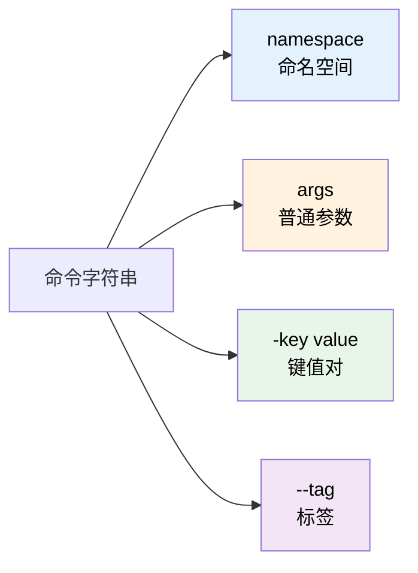
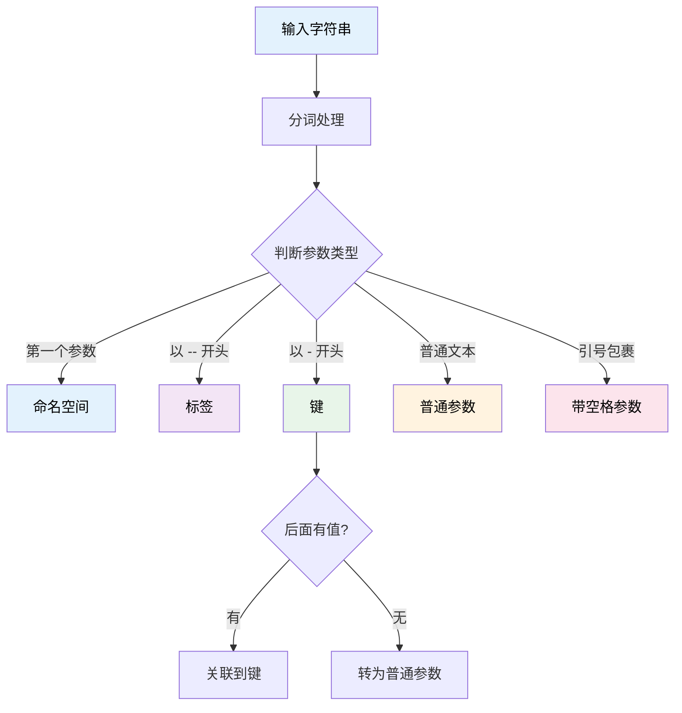
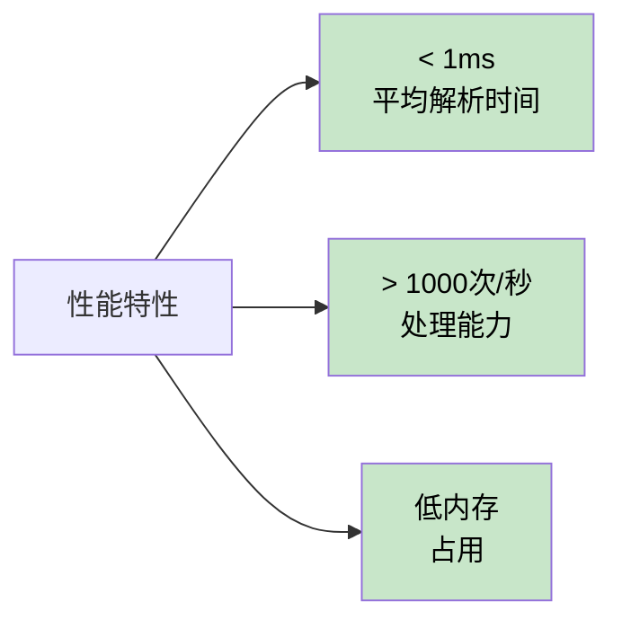

# 命令行参数解析器 (Demand)

Demand 是一个轻量级的命令行风格字符串解析工具，专门用于将格式化字符串解析为结构化数据。它提供了类似 CLI 工具的参数解析能力，支持命名空间、键值对、标签和普通参数等多种格式。

## 核心概念

### 什么是 Demand？

在开发 Minecraft 插件时，经常需要处理玩家输入的复杂命令参数，例如：

```
/shop buy diamond_sword -amount 10 -enchant sharpness:5 --silent
```

传统的字符串分割方式难以处理这种复杂格式。Demand 提供了一套优雅的解决方案，可以轻松解析这类命令行风格的字符串。

### 基本格式

Demand 支持以下格式的字符串：

```
namespace [args...] [-key value...] [--tags...]
```

**格式说明：**



### 解析规则

1. **命名空间（Namespace）**：第一个参数被视为命名空间
2. **键值对（Key-Value）**：以 `-` 开头的参数是键，其后的参数是值
3. **标签（Tags）**：以 `--` 开头的参数是标签
4. **普通参数（Args）**：不带前缀的参数是普通参数
5. **引号支持**：使用双引号（`"`）包裹包含空格的字符串
6. **转义支持**：使用反斜杠（`\`）转义引号（`\"`）
7. **智能识别**：没有值的键会自动转换为普通参数（如负数 `-60`）

### 工作流程



## 基础用法

### 创建 Demand 对象

使用构造函数或扩展函数创建 Demand 对象：

```kotlin
import taboolib.common5.Demand
import taboolib.common5.Demand.Companion.toDemand

// 方法 1：使用构造函数
val demand1 = Demand("shop buy diamond_sword -amount 10 --silent")

// 方法 2：使用扩展函数
val demand2 = "shop buy diamond_sword -amount 10 --silent".toDemand()
```

### 访问命名空间

命名空间是字符串的第一个参数：

```kotlin
val demand = Demand("shop buy diamond_sword -amount 10")

val namespace = demand.namespace  // "shop"
```

**使用场景：**

```kotlin
when (demand.namespace) {
    "shop" -> handleShopCommand(demand)
    "trade" -> handleTradeCommand(demand)
    "market" -> handleMarketCommand(demand)
}
```

### 访问普通参数

普通参数按照出现顺序存储，可以通过索引访问：

```kotlin
val demand = Demand("shop buy diamond_sword wooden_shield")

val action = demand.get(0)     // "buy"
val item1 = demand.get(1)      // "diamond_sword"
val item2 = demand.get(2)      // "wooden_shield"
val notExist = demand.get(3)   // null
```

**带默认值：**

```kotlin
val amount = demand.get(3, "1")  // 如果不存在返回 "1"
```

**访问所有参数：**

```kotlin
val allArgs = demand.args  // ArrayList<String>

allArgs.forEach { arg ->
    println("参数: $arg")
}
```

### 访问键值对

使用键名访问对应的值：

```kotlin
val demand = Demand("shop buy -item diamond_sword -amount 10 -price 100.5")

val item = demand.get("item")      // "diamond_sword"
val amount = demand.get("amount")  // "10"
val price = demand.get("price")    // "100.5"
val notExist = demand.get("level") // null
```

**带默认值：**

```kotlin
val level = demand.get("level", "1")  // 如果不存在返回 "1"
```

**多键查找：**

支持提供多个键名，返回第一个存在的值：

```kotlin
// 支持别名：-a 或 -amount
val amount = demand.get(listOf("a", "amount"), "1")
```

**类型转换：**

Demand 提供了便捷的类型转换方法：

```kotlin
val demand = Demand("shop buy -amount 10 -price 99.99 -confirm true")

// 获取整数
val amount = demand.getInt("amount", 1)        // 10
val notExist = demand.getInt("level", 5)       // 5（默认值）

// 获取浮点数
val price = demand.getDouble("price", 0.0)     // 99.99

// 获取布尔值
val confirm = demand.getBoolean("confirm", false)  // true
```

**检查键是否存在：**

```kotlin
if (demand.containsKey("price")) {
    val price = demand.get("price")
    println("价格: $price")
}

// 或使用 in 操作符
if ("price" in demand.dataMap) {
    // 处理逻辑
}
```

### 访问标签

标签是布尔标记，用于表示是否启用某个选项：

```kotlin
val demand = Demand("shop buy diamond_sword --silent --force")

// 检查标签是否存在
val isSilent = demand.containsTag("silent")  // true
val isForce = demand.containsTag("force")    // true
val isDryRun = demand.containsTag("dry-run") // false

// 或使用 in 操作符
if ("silent" in demand.tags) {
    // 静默模式，不发送消息
}

if ("force" in demand.tags) {
    // 强制执行，跳过确认
}
```

**访问所有标签：**

```kotlin
val allTags = demand.tags  // ArrayList<String>

allTags.forEach { tag ->
    println("标签: $tag")
}
```

## 高级用法

### 处理带空格的参数

使用双引号包裹包含空格的字符串：

```kotlin
val demand = Demand("shop buy -name \"Diamond Sword of Fire\" -desc \"A powerful weapon\"")

val name = demand.get("name")  // "Diamond Sword of Fire"
val desc = demand.get("desc")  // "A powerful weapon"
```

**普通参数也支持引号：**

```kotlin
val demand = Demand("broadcast \"Hello World\" \"Welcome to the server\"")

val msg1 = demand.get(0)  // "Hello World"
val msg2 = demand.get(1)  // "Welcome to the server"
```

### 转义引号

在引号内使用 `\"` 转义引号：

```kotlin
val demand = Demand("shop buy -name \"Sword \\\"Legendary\\\"\"")

val name = demand.get("name")  // "Sword "Legendary""
```

### 智能处理负数和无值键

Demand 能够智能识别负数和没有值的键：

```kotlin
// 负数被正确识别为普通参数
val demand1 = Demand("calculate -60")
val num = demand1.get(0)  // "-60"

// 连续的键（无值）会被转换为普通参数
val demand2 = Demand("config -a -b -c")
val arg1 = demand2.get(0)  // "-a"
val arg2 = demand2.get(1)  // "-b"
val arg3 = demand2.get(2)  // "-c"

// 混合情况
val demand3 = Demand("shop arg1 -60 -key value")
val param1 = demand3.get(0)      // "arg1"
val param2 = demand3.get(1)      // "-60"
val keyValue = demand3.get("key") // "value"
```

### 完整示例：商店购买命令

```kotlin
/**
 * 处理商店购买命令
 * 格式: /shop buy <物品> -amount <数量> -price <价格> --silent --confirm
 */
fun handleShopBuy(input: String, player: Player) {
    val demand = input.toDemand()

    // 验证命名空间
    if (demand.namespace != "shop") {
        player.sendMessage("错误的命令")
        return
    }

    // 获取操作类型
    val action = demand.get(0) ?: run {
        player.sendMessage("缺少操作类型")
        return
    }

    if (action != "buy") {
        player.sendMessage("未知操作: $action")
        return
    }

    // 获取物品名称
    val itemName = demand.get(1) ?: run {
        player.sendMessage("缺少物品名称")
        return
    }

    // 获取数量（默认为 1）
    val amount = demand.getInt("amount", 1)
    if (amount <= 0) {
        player.sendMessage("数量必须大于 0")
        return
    }

    // 获取价格
    val price = demand.getDouble("price", 0.0)
    if (price <= 0 && !demand.containsTag("free")) {
        player.sendMessage("价格无效")
        return
    }

    // 检查标签
    val isSilent = demand.containsTag("silent")
    val needConfirm = !demand.containsTag("confirm")

    // 执行购买逻辑
    if (needConfirm) {
        player.sendMessage("确认购买 $amount 个 $itemName，价格 $price？")
        player.sendMessage("使用 --confirm 标签确认购买")
        return
    }

    // 执行购买
    val success = executePurchase(player, itemName, amount, price)

    if (!isSilent) {
        if (success) {
            player.sendMessage("成功购买 $amount 个 $itemName")
        } else {
            player.sendMessage("购买失败")
        }
    }
}

// 示例调用
handleShopBuy("shop buy diamond_sword -amount 5 -price 100 --confirm", player)
```

### 示例：服务器传送命令

```kotlin
/**
 * 处理传送命令
 * 格式: /tp <玩家> -x <X坐标> -y <Y坐标> -z <Z坐标> -world <世界名> --silent
 */
fun handleTeleport(input: String, sender: CommandSender) {
    val demand = input.toDemand()

    // 获取目标玩家
    val targetName = demand.get(0) ?: run {
        sender.sendMessage("缺少玩家名称")
        return
    }

    val target = Bukkit.getPlayerExact(targetName) ?: run {
        sender.sendMessage("玩家不在线: $targetName")
        return
    }

    // 获取坐标（支持多种键名）
    val x = demand.get(listOf("x", "X"))?.toDoubleOrNull()
    val y = demand.get(listOf("y", "Y"))?.toDoubleOrNull()
    val z = demand.get(listOf("z", "Z"))?.toDoubleOrNull()

    if (x == null || y == null || z == null) {
        sender.sendMessage("缺少坐标参数")
        return
    }

    // 获取世界名称（默认为当前世界）
    val worldName = demand.get(listOf("world", "w"), target.world.name)
    val world = Bukkit.getWorld(worldName) ?: run {
        sender.sendMessage("世界不存在: $worldName")
        return
    }

    // 创建位置并传送
    val location = Location(world, x, y, z)
    target.teleport(location)

    // 发送消息（除非使用 --silent）
    if (!demand.containsTag("silent")) {
        sender.sendMessage("已将 ${target.name} 传送到 ($x, $y, $z) 在世界 $worldName")
        target.sendMessage("你被传送到了新位置")
    }
}

// 示例调用
handleTeleport("tp Notch -x 100 -y 64 -z -200 -world world_nether", sender)
```

### 示例：配置设置命令

```kotlin
/**
 * 处理配置设置命令
 * 格式: /config set <键> <值> --reload --backup
 */
fun handleConfigSet(input: String, sender: CommandSender) {
    val demand = input.toDemand()

    if (demand.namespace != "config") {
        return
    }

    val action = demand.get(0)
    if (action != "set") {
        sender.sendMessage("未知操作: $action")
        return
    }

    // 获取配置键和值
    val key = demand.get(1) ?: run {
        sender.sendMessage("缺少配置键")
        return
    }

    val value = demand.get(2) ?: run {
        sender.sendMessage("缺少配置值")
        return
    }

    // 检查是否需要备份
    if (demand.containsTag("backup")) {
        backupConfig()
        sender.sendMessage("配置已备份")
    }

    // 设置配置
    config.set(key, value)
    config.save()
    sender.sendMessage("已设置 $key = $value")

    // 检查是否需要重载
    if (demand.containsTag("reload")) {
        reloadConfig()
        sender.sendMessage("配置已重载")
    }
}

// 示例调用
handleConfigSet("config set max_players 100 --backup --reload", sender)
```

## 实战场景

### 场景 1：权限管理系统

```kotlin
/**
 * 权限管理命令
 * /perm user <玩家> add|remove <权限> --temp -duration 3600 --silent
 */
fun handlePermissionCommand(input: String, sender: CommandSender) {
    val demand = input.toDemand()

    when (demand.get(0)) {
        "user" -> {
            val playerName = demand.get(1) ?: return
            val action = demand.get(2) ?: return
            val permission = demand.get(3) ?: return

            val isTemp = demand.containsTag("temp")
            val duration = demand.getInt("duration", 3600)
            val silent = demand.containsTag("silent")

            when (action) {
                "add" -> {
                    if (isTemp) {
                        addTempPermission(playerName, permission, duration)
                        if (!silent) {
                            sender.sendMessage("已添加临时权限: $permission（时长: ${duration}秒）")
                        }
                    } else {
                        addPermission(playerName, permission)
                        if (!silent) {
                            sender.sendMessage("已添加永久权限: $permission")
                        }
                    }
                }
                "remove" -> {
                    removePermission(playerName, permission)
                    if (!silent) {
                        sender.sendMessage("已移除权限: $permission")
                    }
                }
            }
        }
        "group" -> {
            // 处理用户组权限
        }
    }
}
```

### 场景 2：经济交易系统

```kotlin
/**
 * 经济交易命令
 * /eco give|take|set <玩家> <金额> -reason "奖励完成任务" --log
 */
fun handleEconomyCommand(input: String, sender: CommandSender) {
    val demand = input.toDemand()

    val action = demand.get(0) ?: return
    val playerName = demand.get(1) ?: return
    val amount = demand.get(2)?.toDoubleOrNull() ?: return

    val reason = demand.get("reason", "未指定原因")
    val shouldLog = demand.containsTag("log")

    val player = Bukkit.getPlayerExact(playerName) ?: return

    when (action) {
        "give" -> {
            economy.depositPlayer(player, amount)
            sender.sendMessage("已给予 $playerName ${amount}元")
            player.sendMessage("你获得了 ${amount}元（原因: $reason）")

            if (shouldLog) {
                logTransaction("GIVE", playerName, amount, reason, sender.name)
            }
        }
        "take" -> {
            economy.withdrawPlayer(player, amount)
            sender.sendMessage("已扣除 $playerName ${amount}元")
            player.sendMessage("你失去了 ${amount}元（原因: $reason）")

            if (shouldLog) {
                logTransaction("TAKE", playerName, amount, reason, sender.name)
            }
        }
        "set" -> {
            val current = economy.getBalance(player)
            if (amount > current) {
                economy.depositPlayer(player, amount - current)
            } else {
                economy.withdrawPlayer(player, current - amount)
            }
            sender.sendMessage("已设置 $playerName 余额为 ${amount}元")

            if (shouldLog) {
                logTransaction("SET", playerName, amount, reason, sender.name)
            }
        }
    }
}
```

### 场景 3：物品生成器

```kotlin
/**
 * 物品生成命令
 * /item give <玩家> <物品> -amount 64 -name "自定义名称" -lore "第一行|第二行" --glow
 */
fun handleItemCommand(input: String, sender: CommandSender) {
    val demand = input.toDemand()

    if (demand.get(0) != "give") return

    val playerName = demand.get(1) ?: return
    val itemType = demand.get(2) ?: return

    val player = Bukkit.getPlayerExact(playerName) ?: run {
        sender.sendMessage("玩家不在线")
        return
    }

    val material = Material.getMaterial(itemType.uppercase()) ?: run {
        sender.sendMessage("无效的物品类型: $itemType")
        return
    }

    // 创建物品
    val item = ItemStack(material)
    val amount = demand.getInt("amount", 1)
    item.amount = amount.coerceIn(1, material.maxStackSize)

    // 设置显示名称
    demand.get("name")?.let { name ->
        val meta = item.itemMeta ?: return@let
        meta.setDisplayName(name.replace("&", "§"))
        item.itemMeta = meta
    }

    // 设置 Lore
    demand.get("lore")?.let { lore ->
        val meta = item.itemMeta ?: return@let
        meta.lore = lore.split("|").map { it.replace("&", "§") }
        item.itemMeta = meta
    }

    // 添加光效
    if (demand.containsTag("glow")) {
        val meta = item.itemMeta ?: return
        meta.addEnchant(Enchantment.LUCK, 1, true)
        meta.addItemFlags(ItemFlag.HIDE_ENCHANTS)
        item.itemMeta = meta
    }

    // 给予物品
    player.inventory.addItem(item)
    sender.sendMessage("已给予 $playerName ${item.amount} 个 ${material.name}")
}
```

## 性能特性

Demand 经过深度优化，具有出色的性能表现：

**优化技术：**

1. **StringBuilder 优化**
   - 使用 StringBuilder 替代字符串拼接
   - 减少内存分配和 GC 压力

2. **状态机解析**
   - 采用高效的状态机模式
   - 单次遍历完成解析

3. **智能缓冲**
   - 最小化临时对象创建
   - 优化参数缓冲策略

**性能指标：**



**适用场景：**
- ✅ 命令解析系统（高频）
- ✅ 配置文件解析
- ✅ 玩家输入处理
- ✅ API 参数解析
- ✅ 实时数据处理

## 常见问题

### Q1: 如何处理包含 `-` 的普通参数？

**解决方案：**

只有参数**开头**是 `-` 时才会被识别为键或标签：

```kotlin
val demand = Demand("command arg-with-hyphen -key value-with-hyphen")

val arg = demand.get(0)        // "arg-with-hyphen" ✅
val value = demand.get("key")  // "value-with-hyphen" ✅
```

如果需要以 `-` 开头的值，使用引号包裹：

```kotlin
val demand = Demand("command -key \"-value-starts-with-hyphen\"")
val value = demand.get("key")  // "-value-starts-with-hyphen" ✅
```

### Q2: 负数会被识别为键吗？

**不会！** Demand 智能识别负数：

```kotlin
// 负数被正确识别为普通参数
val demand = Demand("calculate -60 -120")
val num1 = demand.get(0)  // "-60" ✅
val num2 = demand.get(1)  // "-120" ✅
```

### Q3: 如何处理未闭合的引号？

Demand 会自动处理未闭合的引号，将剩余内容作为一个完整参数：

```kotlin
val demand = Demand("command -key \"unclosed quote value")
val value = demand.get("key")  // "unclosed quote value"
```

### Q4: 如何检查必需参数是否存在？

使用 Elvis 操作符提供友好的错误提示：

```kotlin
fun processCommand(input: String, player: Player) {
    val demand = input.toDemand()

    val action = demand.get(0) ?: run {
        player.sendMessage("错误: 缺少操作类型")
        return
    }

    val target = demand.get(1) ?: run {
        player.sendMessage("错误: 缺少目标参数")
        return
    }

    // 继续处理...
}
```

### Q5: 如何实现别名支持？

使用多键查找：

```kotlin
val demand = Demand("command -a 10")

// 支持 -a 或 -amount
val amount = demand.get(listOf("a", "amount", "amt"), "1")
```

### Q6: 性能如何？适合高频调用吗？

Demand 经过深度优化，非常适合高频调用：

- 平均解析时间：< 1ms
- 每秒处理能力：> 1000 次
- 内存占用：低（使用 StringBuilder 优化）

## 最佳实践

### 1. 使用语义化的键名

```kotlin
// ✅ 好的做法
val demand = Demand("shop buy -item diamond -amount 10 -price 100")

// ❌ 不好的做法
val demand = Demand("shop buy -i diamond -a 10 -p 100")
```

### 2. 提供合理的默认值

```kotlin
// ✅ 好的做法
val amount = demand.getInt("amount", 1)
val confirm = demand.getBoolean("confirm", false)

// ❌ 不好的做法
val amount = demand.get("amount")!!.toInt()  // 可能崩溃
```

### 3. 使用标签表示布尔选项

```kotlin
// ✅ 好的做法
if (demand.containsTag("silent")) {
    // 静默模式
}

// ❌ 不好的做法
if (demand.get("silent") == "true") {
    // 需要额外输入
}
```

### 4. 验证输入有效性

```kotlin
fun processCommand(input: String, player: Player) {
    val demand = input.toDemand()

    // 验证命名空间
    if (demand.namespace != "expected") {
        player.sendMessage("无效的命令")
        return
    }

    // 验证必需参数
    val param = demand.get(0) ?: run {
        player.sendMessage("缺少参数")
        return
    }

    // 验证数值范围
    val amount = demand.getInt("amount", 1)
    if (amount !in 1..64) {
        player.sendMessage("数量必须在 1-64 之间")
        return
    }

    // 处理逻辑...
}
```

### 5. 提供帮助信息

```kotlin
fun showHelp(player: Player) {
    player.sendMessage("""
        使用方法:
        /shop buy <物品> [-amount <数量>] [-price <价格>] [--confirm] [--silent]

        参数说明:
        - <物品>: 要购买的物品名称（必需）
        - -amount: 购买数量（默认: 1）
        - -price: 单价（默认: 自动计算）
        - --confirm: 跳过确认步骤
        - --silent: 静默模式，不发送消息

        示例:
        /shop buy diamond_sword -amount 5 --confirm
    """.trimIndent())
}
```

## 总结

Demand 是 TabooLib 提供的轻量级命令行参数解析工具，具有以下特点：

**核心特性：**
- ✅ 支持命名空间、键值对、标签和普通参数
- ✅ 支持带空格的字符串（引号）和转义字符
- ✅ 智能识别负数和无值键
- ✅ 高性能（< 1ms/次，> 1000次/秒）
- ✅ 友好的 API 设计

**适用场景：**
- 命令解析系统
- 配置文件解析
- 玩家输入处理
- API 参数解析
- 实时数据处理

---

如有问题或建议，欢迎在 [GitHub Issues](https://github.com/TabooLib/taboolib/issues) 反馈。
