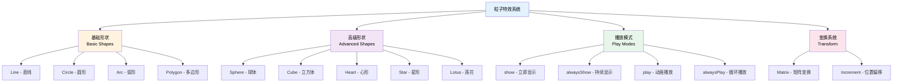

# 粒子特效系统

TabooLib 提供了一套功能强大且易用的粒子特效系统，让你可以轻松创建各种炫酷的粒子效果，无需复杂的数学计算。

:::tip[为什么使用 TabooLib Effect？]

- **开箱即用**：20+ 种预设形状（圆、线、球、心形等）
- **灵活可控**：支持动态播放、矩阵变换、位置偏移
- **性能优化**：异步渲染、可控粒子密度
- **简洁 API**：Kotlin DSL 风格，链式调用

:::

## 功能概览



## 快速开始

### 第一个粒子效果

创建一个简单的圆形粒子效果：

```kotlin title="简单圆形示例" showLineNumbers
import org.bukkit.Particle
import org.bukkit.entity.Player
import taboolib.module.effect.createCircle
import taboolib.platform.util.toBukkitLocation

fun showCircle(player: Player) {
    // highlight-start
    // 创建一个圆形特效
    val circle = createCircle(
        origin = player.location.toBukkitLocation().toProxyLocation(), // 圆心位置
        radius = 2.0,    // 半径 2 格
        step = 0.1       // 粒子间隔
    ) { location ->
        // 在每个位置生成粒子
        player.world.spawnParticle(
            Particle.FLAME,
            location.toBukkitLocation(),
            1  // 粒子数量
        )
    }
    // highlight-end

    // 显示特效
    circle.show()
}
```

**代码说明：**
- `createCircle()`: 创建圆形特效对象
- `origin`: 圆心位置（支持 TabooLib 的 `Location`）
- `radius`: 圆的半径（单位：格）
- `step`: 粒子之间的角度间隔，越小粒子越密集
- `spawner`: Lambda 表达式，定义如何生成粒子
- `show()`: 立即显示特效

### ParticleSpawner 详解

`ParticleSpawner` 是特效系统的核心，用于定义粒子的生成方式：

```kotlin title="ParticleSpawner 示例"
import org.bukkit.Particle
import org.bukkit.Color

// 方式 1：简洁的 Lambda 写法（推荐）
val circle = createCircle(player.location.toProxyLocation()) { location ->
    player.world.spawnParticle(Particle.FLAME, location.toBukkitLocation(), 1)
}

// 方式 2：完整的接口实现
val circle2 = createCircle(
    origin = player.location.toProxyLocation(),
    spawner = object : ParticleSpawner {
        override fun spawn(location: Location) {
            player.world.spawnParticle(Particle.REDSTONE, location.toBukkitLocation(), 1,
                Particle.DustOptions(Color.RED, 1.0f))
        }
    }
)

// 方式 3：可重用的 Spawner
class FlameSpawner(val world: World) : ParticleSpawner {
    override fun spawn(location: Location) {
        world.spawnParticle(Particle.FLAME, location.toBukkitLocation(), 1)
    }
}

val spawner = FlameSpawner(player.world)
val circle3 = createCircle(player.location.toProxyLocation(), spawner = { spawner.spawn(it) })
```

## 基础形状

### 直线 (Line)

连接两点的直线：

```kotlin title="直线特效" showLineNumbers
import taboolib.module.effect.createLine

fun createLineEffect(player: Player, start: Location, end: Location) {
    val line = createLine(
        start = start,
        end = end,
        step = 0.1  // 粒子密度
    ) { location ->
        player.world.spawnParticle(Particle.END_ROD, location.toBukkitLocation(), 1)
    }

    line.show()
}

// 实战示例：技能指示器
fun showSkillIndicator(player: Player, targetLocation: Location) {
    val start = player.eyeLocation.toProxyLocation()
    val end = targetLocation

    createLine(start, end, step = 0.2) { location ->
        player.world.spawnParticle(
            Particle.REDSTONE,
            location.toBukkitLocation(),
            1,
            Particle.DustOptions(Color.YELLOW, 0.8f)
        )
    }.show()
}
```

**参数说明：**
- `start`: 起点位置
- `end`: 终点位置
- `step`: 粒子间距（单位：格），越小越密集

**适用场景：**
- 技能指示线
- 连接效果
- 轨迹显示

### 圆形 (Circle)

平面圆形特效：

```kotlin title="圆形特效" showLineNumbers
import taboolib.module.effect.createCircle

fun createMagicCircle(player: Player) {
    val circle = createCircle(
        origin = player.location.toProxyLocation(),
        radius = 3.0,    // 半径 3 格
        step = 1.0       // 角度步长
    ) { location ->
        player.world.spawnParticle(Particle.ENCHANTMENT_TABLE, location.toBukkitLocation(), 1)
    }

    // 持续显示（每 tick 刷新）
    circle.period = 1L
    circle.alwaysShow()

    // 5 秒后关闭
    submit(delay = 100) {
        circle.turnOffTask()
    }
}

// 实战示例：多层魔法阵
fun showMagicCircles(player: Player) {
    val center = player.location.toProxyLocation()

    // 内圈 - 红色
    createCircle(center, radius = 2.0, step = 0.5) { loc ->
        player.world.spawnParticle(Particle.REDSTONE, loc.toBukkitLocation(), 1,
            Particle.DustOptions(Color.RED, 1.0f))
    }.apply {
        period = 2L
        alwaysShow()
    }

    // 中圈 - 金色
    createCircle(center, radius = 3.0, step = 0.5) { loc ->
        player.world.spawnParticle(Particle.REDSTONE, loc.toBukkitLocation(), 1,
            Particle.DustOptions(Color.ORANGE, 1.0f))
    }.apply {
        period = 2L
        alwaysShow()
    }

    // 外圈 - 白色
    createCircle(center, radius = 4.0, step = 0.5) { loc ->
        player.world.spawnParticle(Particle.REDSTONE, loc.toBukkitLocation(), 1,
            Particle.DustOptions(Color.WHITE, 1.0f))
    }.apply {
        period = 2L
        alwaysShow()
    }
}
```

**参数说明：**
- `origin`: 圆心位置
- `radius`: 半径（单位：格）
- `step`: 角度步长（单位：度），推荐 0.5 ~ 2.0

### 弧形 (Arc)

圆的一部分：

```kotlin title="弧形特效" showLineNumbers
import taboolib.module.effect.createArc

fun createArcEffect(player: Player) {
    val arc = createArc(
        origin = player.location.toProxyLocation(),
        startAngle = 0.0,   // 起始角度
        angle = 180.0,      // 弧度角度（180度 = 半圆）
        radius = 2.0,
        step = 1.0
    ) { location ->
        player.world.spawnParticle(Particle.FLAME, location.toBukkitLocation(), 1)
    }

    arc.show()
}

// 实战示例：扇形攻击范围指示
fun showAttackRange(player: Player) {
    val center = player.location.toProxyLocation()

    // 创建 90 度扇形
    createArc(
        origin = center,
        startAngle = -45.0,  // 从 -45 度开始
        angle = 90.0,        // 扫过 90 度
        radius = 5.0,
        step = 0.5
    ) { location ->
        player.world.spawnParticle(
            Particle.REDSTONE,
            location.toBukkitLocation(),
            1,
            Particle.DustOptions(Color.RED, 0.5f)
        )
    }.show()
}
```

**参数说明：**
- `startAngle`: 起始角度（0度 = 正东方向）
- `angle`: 弧跨越的角度
- 其他参数同 Circle

### 多边形 (Polygon)

正多边形特效：

```kotlin title="多边形特效" showLineNumbers
import taboolib.module.effect.createPolygon

fun createPolygonEffect(player: Player, sides: Int) {
    val polygon = createPolygon(
        origin = player.location.toProxyLocation(),
        radius = 2.0,
        sides = sides,   // 边数（3=三角形，4=正方形，5=五边形...）
        step = 0.1
    ) { location ->
        player.world.spawnParticle(Particle.VILLAGER_HAPPY, location.toBukkitLocation(), 1)
    }

    polygon.show()
}

// 实战示例：五芒星法阵
fun showPentagram(player: Player) {
    val center = player.location.toProxyLocation()

    // 外圈五边形
    createPolygon(center, radius = 3.0, sides = 5, step = 0.05) { loc ->
        player.world.spawnParticle(Particle.FLAME, loc.toBukkitLocation(), 1)
    }.apply {
        period = 2L
        alwaysShow()
    }

    // 内圈五角星（需要自定义，这里简化为五边形）
    createPolygon(center, radius = 1.5, sides = 5, step = 0.05) { loc ->
        player.world.spawnParticle(Particle.ENCHANTMENT_TABLE, loc.toBukkitLocation(), 1)
    }.apply {
        period = 2L
        alwaysShow()
    }
}
```

**参数说明：**
- `sides`: 边数（必须 ≥ 3）
- `radius`: 外接圆半径

### 实心圆 (FilledCircle)

填充的圆形区域：

```kotlin title="实心圆特效" showLineNumbers
import taboolib.module.effect.createFilledCircle

fun createFilledCircleEffect(player: Player) {
    val filledCircle = createFilledCircle(
        origin = player.location.toProxyLocation(),
        radius = 2.0,
        sample = 200  // 粒子数量
    ) { location ->
        player.world.spawnParticle(Particle.REDSTONE, location.toBukkitLocation(), 1,
            Particle.DustOptions(Color.BLUE, 0.5f))
    }

    filledCircle.show()
}

// 实战示例：技能范围指示
fun showSkillArea(player: Player, center: Location, radius: Double) {
    createFilledCircle(
        origin = center,
        radius = radius,
        sample = (radius * 50).toInt()  // 根据半径动态调整粒子数
    ) { location ->
        player.world.spawnParticle(
            Particle.REDSTONE,
            location.toBukkitLocation(),
            1,
            Particle.DustOptions(Color.fromRGB(255, 200, 0), 0.3f)  // 半透明金色
        )
    }.show()
}
```

**参数说明：**
- `sample`: 粒子总数（而非密度）
- 粒子数越多越平滑，但性能消耗越大

## 高级形状

### 球体 (Sphere)

三维球形特效：

```kotlin title="球体特效" showLineNumbers
import taboolib.module.effect.createSphere

fun createSphereEffect(player: Player) {
    val sphere = createSphere(
        origin = player.location.add(0.0, 2.0, 0.0).toProxyLocation(),
        radius = 1.5,
        sample = 300  // 粒子数量
    ) { location ->
        player.world.spawnParticle(Particle.END_ROD, location.toBukkitLocation(), 1)
    }

    sphere.period = 5L
    sphere.alwaysShow()
}

// 实战示例：护盾效果
fun showShieldEffect(player: Player) {
    createSphere(
        origin = player.location.toProxyLocation(),
        radius = 2.0,
        sample = 400
    ) { location ->
        player.world.spawnParticle(
            Particle.REDSTONE,
            location.toBukkitLocation(),
            1,
            Particle.DustOptions(Color.AQUA, 0.8f)
        )
    }.apply {
        period = 3L
        alwaysShow()

        // 10 秒后消失
        submit(delay = 200) {
            turnOffTask()
        }
    }
}
```

### 立方体 (Cube)

三维立方体框架：

```kotlin title="立方体特效" showLineNumbers
import taboolib.module.effect.createCube

fun createCubeEffect(player: Player) {
    val min = player.location.toProxyLocation()
    val max = min.clone().add(3.0, 3.0, 3.0)

    val cube = createCube(
        min = min,
        max = max,
        step = 0.2  // 边框粒子间距
    ) { location ->
        player.world.spawnParticle(Particle.FLAME, location.toBukkitLocation(), 1)
    }

    cube.show()
}

// 实战示例：区域选择框
fun showSelectionBox(player: Player, pos1: Location, pos2: Location) {
    createCube(pos1, pos2, step = 0.3) { location ->
        player.world.spawnParticle(
            Particle.REDSTONE,
            location.toBukkitLocation(),
            1,
            Particle.DustOptions(Color.YELLOW, 0.6f)
        )
    }.apply {
        period = 10L
        alwaysShow()
    }
}
```

### 心形 (Heart)

浪漫的心形特效：

```kotlin title="心形特效" showLineNumbers
import taboolib.module.effect.createHeart

fun createHeartEffect(player: Player) {
    val heart = createHeart(
        xScaleRate = 1.0,  // X 轴缩放
        yScaleRate = 1.0,  // Y 轴缩放
        origin = player.location.add(0.0, 2.0, 0.0).toProxyLocation(),
        period = 2L
    ) { location ->
        player.world.spawnParticle(
            Particle.HEART,
            location.toBukkitLocation(),
            1
        )
    }

    heart.alwaysShow()
}
```

### 星形 (Star)

五角星特效：

```kotlin title="星形特效" showLineNumbers
import taboolib.module.effect.createStar

fun createStarEffect(player: Player) {
    val star = createStar(
        origin = player.location.add(0.0, 3.0, 0.0).toProxyLocation(),
        radius = 2.0,
        step = 0.1
    ) { location ->
        player.world.spawnParticle(Particle.END_ROD, location.toBukkitLocation(), 1)
    }

    star.period = 2L
    star.alwaysShow()
}
```

### 莲花 (Lotus)

优雅的莲花特效：

```kotlin title="莲花特效" showLineNumbers
import taboolib.module.effect.createLotus

fun createLotusEffect(player: Player) {
    val lotus = createLotus(
        origin = player.location.toProxyLocation(),
        period = 2L
    ) { location ->
        player.world.spawnParticle(Particle.VILLAGER_HAPPY, location.toBukkitLocation(), 1)
    }

    lotus.alwaysShow()
}
```

## 播放模式

### show() - 立即显示

一次性显示完整特效：

```kotlin title="立即显示模式"
val circle = createCircle(player.location.toProxyLocation(), radius = 2.0) { loc ->
    player.world.spawnParticle(Particle.FLAME, loc.toBukkitLocation(), 1)
}

// 立即显示所有粒子
circle.show()
```

**特性：**
- 同步执行
- 一次性显示所有粒子
- 适合静态效果

### alwaysShow() - 持续显示

周期性刷新特效：

```kotlin title="持续显示模式" showLineNumbers
val circle = createCircle(player.location.toProxyLocation(), radius = 2.0) { loc ->
    player.world.spawnParticle(Particle.FLAME, loc.toBukkitLocation(), 1)
}

// highlight-start
// 设置刷新周期（单位：tick，20 tick = 1 秒）
circle.period = 5L  // 每 5 tick 刷新一次

// 开始持续显示
circle.alwaysShow()
// highlight-end

// 稍后关闭
submit(delay = 100) {
    circle.turnOffTask()
}
```

**特性：**
- 周期性重新绘制
- 适合需要持续存在的效果
- 可以随时关闭

### alwaysShowAsync() - 异步持续显示

异步版本的持续显示，避免阻塞主线程：

```kotlin title="异步持续显示"
val circle = createCircle(player.location.toProxyLocation(), radius = 2.0) { loc ->
    player.world.spawnParticle(Particle.FLAME, loc.toBukkitLocation(), 1)
}

circle.period = 2L
// highlight-next-line
circle.alwaysShowAsync()  // 异步执行
```

:::warning[异步注意事项]

异步模式下粒子生成代码会在异步线程执行，某些 Bukkit API 可能不安全。建议仅在性能要求高的场景使用。

:::

### play() / alwaysPlay() - 动画播放

逐点播放特效（适用于实现了 `Playable` 接口的特效）：

```kotlin title="动画播放模式" showLineNumbers
val line = createLine(start, end, step = 0.1) { loc ->
    player.world.spawnParticle(Particle.FLAME, loc.toBukkitLocation(), 1)
}

line.period = 1L

// 方式 1：一次性播放动画
line.play()

// 方式 2：循环播放动画
line.alwaysPlay()

// 方式 3：异步循环播放
line.alwaysPlayAsync()
```

**区别：**
- `show()`: 一次性显示所有点
- `play()`: 逐点播放，播放一次后停止
- `alwaysPlay()`: 逐点循环播放

## 变换系统

### 位置偏移 (Increment)

为特效添加位置偏移：

```kotlin title="位置偏移示例" showLineNumbers
val circle = createCircle(player.location.toProxyLocation(), radius = 2.0) { loc ->
    player.world.spawnParticle(Particle.FLAME, loc.toBukkitLocation(), 1)
}

// highlight-start
// 设置 XYZ 偏移量
circle.setIncrementX(1.0)   // 向东偏移 1 格
circle.setIncrementY(2.0)   // 向上偏移 2 格
circle.setIncrementZ(0.5)   // 向南偏移 0.5 格
// highlight-end

circle.show()

// 实战示例：浮空魔法阵
fun createFloatingCircle(player: Player) {
    createCircle(player.location.toProxyLocation(), radius = 2.0) { loc ->
        player.world.spawnParticle(Particle.ENCHANTMENT_TABLE, loc.toBukkitLocation(), 1)
    }.apply {
        setIncrementY(3.0)  // 在玩家头顶 3 格处显示
        period = 2L
        alwaysShow()
    }
}
```

### 矩阵变换 (Matrix)

使用矩阵实现旋转、缩放等高级变换：

```kotlin title="矩阵旋转示例" showLineNumbers
import taboolib.module.effect.math.Matrixs

val circle = createCircle(player.location.toProxyLocation(), radius = 2.0) { loc ->
    player.world.spawnParticle(Particle.FLAME, loc.toBukkitLocation(), 1)
}

// highlight-start
// 绕 Y 轴旋转 45 度
val rotationMatrix = Matrixs.rotateY(Math.toRadians(45.0))
circle.addMatrix(rotationMatrix)
// highlight-end

circle.show()

// 实战示例：旋转魔法阵
fun createRotatingCircle(player: Player) {
    val center = player.location.toProxyLocation()
    var angle = 0.0

    submit(period = 1L) {
        // 创建圆形
        val circle = createCircle(center, radius = 2.0, step = 0.5) { loc ->
            player.world.spawnParticle(Particle.FLAME, loc.toBukkitLocation(), 1)
        }

        // 每次增加旋转角度
        angle += 5.0
        if (angle >= 360.0) angle = 0.0

        // 应用旋转矩阵
        circle.addMatrix(Matrixs.rotateY(Math.toRadians(angle)))
        circle.show()
    }
}
```

**常用矩阵变换：**
- `Matrixs.rotateX(radians)`: 绕 X 轴旋转
- `Matrixs.rotateY(radians)`: 绕 Y 轴旋转
- `Matrixs.rotateZ(radians)`: 绕 Z 轴旋转

## 完整示例

### 技能特效系统

```kotlin title="SkillEffectSystem.kt" showLineNumbers
import org.bukkit.Color
import org.bukkit.Location
import org.bukkit.Particle
import org.bukkit.entity.Player
import taboolib.common.platform.function.submit
import taboolib.module.effect.*
import taboolib.module.effect.math.Matrixs
import taboolib.platform.util.toProxyLocation

/**
 * 技能特效管理器
 */
object SkillEffectSystem {

    /**
     * 火球术 - 发射一个火球轨迹
     */
    fun castFireball(player: Player, targetLocation: Location) {
        val start = player.eyeLocation.toProxyLocation()
        val end = targetLocation.toProxyLocation()

        // 创建火球轨迹线
        createLine(start, end, step = 0.3) { location ->
            player.world.spawnParticle(Particle.FLAME, location.toBukkitLocation(), 3, 0.1, 0.1, 0.1, 0.0)
            player.world.spawnParticle(Particle.LAVA, location.toBukkitLocation(), 1)
        }.apply {
            period = 1L
            alwaysPlay()  // 逐点播放，模拟飞行

            // 3 秒后停止
            submit(delay = 60) {
                turnOffTask()
            }
        }
    }

    /**
     * 治疗术 - 玩家脚下的治疗法阵
     */
    fun castHeal(player: Player) {
        val center = player.location.toProxyLocation()

        // 内圈 - 绿色
        createCircle(center, radius = 1.5, step = 0.3) { loc ->
            player.world.spawnParticle(
                Particle.REDSTONE, loc.toBukkitLocation(), 1,
                Particle.DustOptions(Color.LIME, 1.0f)
            )
        }.apply {
            period = 2L
            alwaysShow()
        }

        // 外圈 - 白色
        createCircle(center, radius = 2.5, step = 0.3) { loc ->
            player.world.spawnParticle(
                Particle.REDSTONE, loc.toBukkitLocation(), 1,
                Particle.DustOptions(Color.WHITE, 1.0f)
            )
        }.apply {
            period = 2L
            alwaysShow()
        }

        // 中心上升粒子
        submit(period = 5L) {
            createLine(
                start = center,
                end = center.clone().add(0.0, 3.0, 0.0),
                step = 0.2
            ) { loc ->
                player.world.spawnParticle(Particle.VILLAGER_HAPPY, loc.toBukkitLocation(), 1)
            }.show()
        }

        // 5 秒后消失
        submit(delay = 100) {
            // 清除特效（实际项目中需要保存特效引用）
        }
    }

    /**
     * 冰冻术 - 球形冰冻特效
     */
    fun castFreeze(player: Player, target: Location) {
        val center = target.toProxyLocation()

        // 外层冰球
        createSphere(center, radius = 2.0, sample = 300) { loc ->
            player.world.spawnParticle(
                Particle.REDSTONE, loc.toBukkitLocation(), 1,
                Particle.DustOptions(Color.AQUA, 0.5f)
            )
        }.apply {
            period = 3L
            alwaysShow()
        }

        // 内层冰球
        createSphere(center, radius = 1.0, sample = 150) { loc ->
            player.world.spawnParticle(
                Particle.SNOWBALL, loc.toBukkitLocation(), 1
            )
        }.apply {
            period = 3L
            alwaysShow()
        }

        // 3 秒后消失
        submit(delay = 60) {
            // 清除特效
        }
    }

    /**
     * 雷击术 - 闪电柱效果
     */
    fun castLightning(player: Player, targetLocation: Location) {
        val bottom = targetLocation.toProxyLocation()
        val top = bottom.clone().add(0.0, 20.0, 0.0)

        // 主闪电柱
        createLine(bottom, top, step = 0.2) { loc ->
            player.world.spawnParticle(Particle.END_ROD, loc.toBukkitLocation(), 1)
            player.world.spawnParticle(
                Particle.REDSTONE, loc.toBukkitLocation(), 1,
                Particle.DustOptions(Color.fromRGB(200, 200, 255), 1.5f)
            )
        }.apply {
            period = 1L
            alwaysPlay()

            // 1 秒后消失
            submit(delay = 20) {
                turnOffTask()
            }
        }

        // 地面冲击波
        var radius = 0.5
        submit(period = 1L) {
            if (radius > 5.0) {
                cancel()
                return@submit
            }

            createCircle(bottom, radius = radius, step = 0.3) { loc ->
                player.world.spawnParticle(
                    Particle.REDSTONE, loc.toBukkitLocation(), 1,
                    Particle.DustOptions(Color.YELLOW, 0.8f)
                )
            }.show()

            radius += 0.3
        }
    }

    /**
     * 召唤术 - 复杂的召唤法阵
     */
    fun castSummon(player: Player) {
        val center = player.location.toProxyLocation()
        var angle = 0.0

        // 旋转的外圈
        submit(period = 1L) {
            if (angle >= 360.0) {
                cancel()
                return@submit
            }

            // 外圈五边形
            createPolygon(center, radius = 3.0, sides = 5, step = 0.05) { loc ->
                player.world.spawnParticle(
                    Particle.REDSTONE, loc.toBukkitLocation(), 1,
                    Particle.DustOptions(Color.PURPLE, 1.0f)
                )
            }.apply {
                addMatrix(Matrixs.rotateY(Math.toRadians(angle)))
            }.show()

            // 内圈星形
            createStar(center, radius = 1.5, step = 0.05) { loc ->
                player.world.spawnParticle(
                    Particle.REDSTONE, loc.toBukkitLocation(), 1,
                    Particle.DustOptions(Color.YELLOW, 1.0f)
                )
            }.apply {
                addMatrix(Matrixs.rotateY(Math.toRadians(-angle)))
            }.show()

            angle += 5.0
        }

        // 中心上升螺旋
        submit(delay = 20, period = 2L) {
            var height = 0.0
            var spiralAngle = 0.0

            submit(period = 1L) {
                if (height > 5.0) {
                    cancel()
                    return@submit
                }

                val x = Math.cos(Math.toRadians(spiralAngle)) * 0.5
                val z = Math.sin(Math.toRadians(spiralAngle)) * 0.5
                val loc = center.clone().add(x, height, z)

                player.world.spawnParticle(Particle.END_ROD, loc.toBukkitLocation(), 1)

                height += 0.1
                spiralAngle += 15.0
            }
        }
    }
}

// 使用示例
fun onPlayerCastSkill(player: Player, skillName: String, target: Location?) {
    when (skillName) {
        "fireball" -> target?.let { SkillEffectSystem.castFireball(player, it) }
        "heal" -> SkillEffectSystem.castHeal(player)
        "freeze" -> target?.let { SkillEffectSystem.castFreeze(player, it) }
        "lightning" -> target?.let { SkillEffectSystem.castLightning(player, it) }
        "summon" -> SkillEffectSystem.castSummon(player)
    }
}
```

### 装饰特效系统

```kotlin title="DecorationEffectSystem.kt" showLineNumbers
import org.bukkit.Location
import org.bukkit.Particle
import org.bukkit.entity.Player
import taboolib.common.platform.function.submit
import taboolib.module.effect.*
import taboolib.platform.util.toProxyLocation

/**
 * 装饰特效管理器
 */
object DecorationEffectSystem {

    /**
     * 传送门特效
     */
    fun createPortal(location: Location) {
        val center = location.toProxyLocation()

        // 外圈旋转粒子
        var angle = 0.0
        submit(period = 1L) {
            createCircle(center, radius = 1.5, step = 0.5) { loc ->
                location.world?.spawnParticle(Particle.PORTAL, loc.toBukkitLocation(), 1)
            }.apply {
                setIncrementY(angle / 180.0)  // 上下浮动
                show()
            }

            angle += 5.0
            if (angle >= 360.0) angle = 0.0
        }

        // 内部填充
        submit(period = 5L) {
            createFilledCircle(center, radius = 1.2, sample = 50) { loc ->
                location.world?.spawnParticle(Particle.END_ROD, loc.toBukkitLocation(), 1)
            }.show()
        }
    }

    /**
     * 喷泉特效
     */
    fun createFountain(location: Location) {
        val bottom = location.toProxyLocation()

        submit(period = 2L) {
            // 水柱
            createLine(
                start = bottom,
                end = bottom.clone().add(0.0, 3.0, 0.0),
                step = 0.2
            ) { loc ->
                location.world?.spawnParticle(Particle.WATER_DROP, loc.toBukkitLocation(), 3, 0.1, 0.1, 0.1, 0.0)
            }.show()

            // 顶部水花
            createCircle(bottom.clone().add(0.0, 3.0, 0.0), radius = 0.5, step = 0.3) { loc ->
                location.world?.spawnParticle(Particle.WATER_SPLASH, loc.toBukkitLocation(), 2)
            }.show()
        }
    }

    /**
     * 篝火特效
     */
    fun createCampfire(location: Location) {
        val center = location.toProxyLocation()

        submit(period = 3L) {
            // 火焰
            createLine(
                start = center,
                end = center.clone().add(0.0, 1.5, 0.0),
                step = 0.1
            ) { loc ->
                location.world?.spawnParticle(Particle.FLAME, loc.toBukkitLocation(), 1, 0.1, 0.1, 0.1, 0.01)
            }.show()

            // 烟雾
            location.world?.spawnParticle(
                Particle.SMOKE_NORMAL,
                center.clone().add(0.0, 1.5, 0.0).toBukkitLocation(),
                5, 0.1, 0.3, 0.1, 0.01
            )
        }
    }

    /**
     * 星空特效
     */
    fun createStarfield(player: Player) {
        val center = player.location.add(0.0, 10.0, 0.0).toProxyLocation()

        submit(period = 10L) {
            // 随机生成星星
            repeat(20) {
                val randomX = (Math.random() - 0.5) * 20
                val randomY = (Math.random() - 0.5) * 10
                val randomZ = (Math.random() - 0.5) * 20

                val starLoc = center.clone().add(randomX, randomY, randomZ)

                player.world.spawnParticle(
                    Particle.END_ROD,
                    starLoc.toBukkitLocation(),
                    1
                )
            }
        }
    }
}
```

## 常见问题

### 如何提高粒子密度？

调整 `step` 参数：

```kotlin
// 低密度（性能友好）
createCircle(origin, step = 2.0) { ... }

// 中等密度（推荐）
createCircle(origin, step = 0.5) { ... }

// 高密度（性能消耗较大）
createCircle(origin, step = 0.1) { ... }
```

### 如何停止持续播放的特效？

使用 `turnOffTask()` 方法：

```kotlin
val circle = createCircle(origin) { ... }
circle.period = 5L
circle.alwaysShow()

// 需要停止时
circle.turnOffTask()
```

:::tip[最佳实践]

建议将特效对象保存到 Map 中，方便管理：

```kotlin
val activeEffects = mutableMapOf<UUID, ParticleObj>()

// 创建特效
val effect = createCircle(...).apply { alwaysShow() }
activeEffects[player.uniqueId] = effect

// 清理特效
activeEffects[player.uniqueId]?.turnOffTask()
activeEffects.remove(player.uniqueId)
```

:::

### 特效不显示怎么办？

检查以下几点：

1. **粒子类型是否正确**
   ```kotlin
   // ✅ 正确
   Particle.FLAME

   // ❌ 某些版本可能不支持的粒子
   Particle.DUST_COLOR_TRANSITION  // 1.17+
   ```

2. **Location 是否正确转换**
   ```kotlin
   // ✅ 正确
   createCircle(bukkitLocation.toProxyLocation()) { ... }

   // ❌ 错误 - 直接使用 Bukkit Location
   createCircle(bukkitLocation) { ... }  // 类型不匹配
   ```

3. **spawner 是否正确调用**
   ```kotlin
   // ✅ 正确
   createCircle(origin) { location ->
       player.world.spawnParticle(Particle.FLAME, location.toBukkitLocation(), 1)
   }

   // ❌ 错误 - 忘记转换回 Bukkit Location
   createCircle(origin) { location ->
       player.world.spawnParticle(Particle.FLAME, location, 1)  // 类型不匹配
   }
   ```

### 如何实现彩虹特效？

循环使用不同颜色：

```kotlin
val colors = listOf(
    Color.RED, Color.ORANGE, Color.YELLOW,
    Color.LIME, Color.AQUA, Color.BLUE, Color.PURPLE
)

var colorIndex = 0
submit(period = 5L) {
    createCircle(player.location.toProxyLocation(), radius = 2.0) { loc ->
        player.world.spawnParticle(
            Particle.REDSTONE, loc.toBukkitLocation(), 1,
            Particle.DustOptions(colors[colorIndex], 1.0f)
        )
    }.show()

    colorIndex = (colorIndex + 1) % colors.size
}
```

### 特效跟随玩家移动？

在循环中重新获取玩家位置：

```kotlin
submit(period = 2L) {
    // 每次获取最新位置
    val currentLocation = player.location.toProxyLocation()

    createCircle(currentLocation, radius = 2.0) { loc ->
        player.world.spawnParticle(Particle.FLAME, loc.toBukkitLocation(), 1)
    }.show()
}
```

### 如何优化性能？

1. **降低粒子密度**
   ```kotlin
   // 使用较大的 step 值
   createCircle(origin, step = 1.0) { ... }  // 而不是 0.1
   ```

2. **使用异步模式**
   ```kotlin
   circle.alwaysShowAsync()  // 而不是 alwaysShow()
   ```

3. **控制刷新频率**
   ```kotlin
   circle.period = 10L  // 每 10 tick 刷新一次，而不是每 tick
   ```

4. **及时清理特效**
   ```kotlin
   submit(delay = 100) {
       circle.turnOffTask()  // 不需要时立即关闭
   }
   ```

5. **限制同时播放的特效数量**
   ```kotlin
   object EffectManager {
       private val effects = mutableListOf<ParticleObj>()
       private val maxEffects = 50

       fun addEffect(effect: ParticleObj) {
           if (effects.size >= maxEffects) {
               effects.removeFirst().turnOffTask()
           }
           effects.add(effect)
       }
   }
   ```

:::tip[性能建议]

- 大型服务器建议 `step` ≥ 0.5
- 持续特效建议 `period` ≥ 5
- 避免同时播放超过 50 个持续特效
- 玩家离开时及时清理相关特效

:::

## 总结

TabooLib Effect 模块提供了：

✅ **20+ 种预设形状**（圆、线、球、心形等）
✅ **4 种播放模式**（立即、持续、动画、异步）
✅ **矩阵变换系统**（旋转、缩放等）
✅ **灵活的 spawner 机制**（支持任意粒子类型）
✅ **性能优化选项**（异步、可控密度和频率）

无论是技能特效、装饰效果还是复杂的动画，都能轻松实现！
