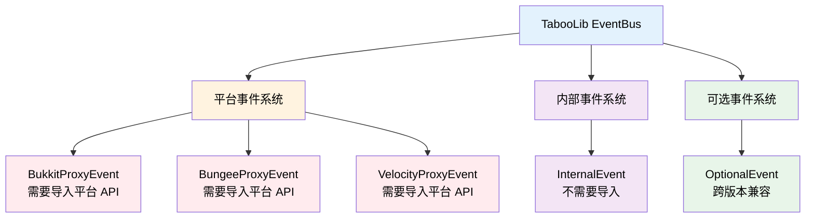

# 事件管理器

## 基本概念

事件管理器（EventBus）是 Minecraft 插件开发的核心内容之一，TabooLib 提供了强大的事件系统，支持多种平台和使用方式。

**核心优势：**
- 自动注册监听器，无需在主类中手动注册
- 支持跨平台事件（Bukkit、BungeeCord、Velocity 等）
- 提供独立的内部事件系统，无需依赖平台 API
- 支持动态注册和取消监听
- 支持事件优先级和取消机制

**事件系统架构：**



## 基础用法 - @SubscribeEvent

### 监听平台事件

使用 `@SubscribeEvent` 注解监听 Bukkit、BungeeCord 等平台的事件：

```kotlin
object MyListener {

    @SubscribeEvent
    fun onPlayerJoin(event: PlayerJoinEvent) {
        event.player.sendMessage("Hello, ${event.player.name}")
    }
}
```

**关键点：**
- 方法必须在 `object` 类中
- 使用 `@SubscribeEvent` 注解标记方法
- 方法必须有且只有一个参数，且参数类型为事件类型
- **无需手动注册**，TabooLib 会自动扫描并注册

**等价于传统写法：**

```kotlin
// Bukkit 原生写法
class MyListener : Listener {
    @EventHandler
    fun onPlayerJoin(event: PlayerJoinEvent) {
        event.player.sendMessage("Hello, ${event.player.name}")
    }
}

// 需要在主类中注册
Bukkit.getPluginManager().registerEvents(MyListener(), plugin)
```

### 注解参数详解

`@SubscribeEvent` 注解的完整签名：

```kotlin
annotation class SubscribeEvent(
    val priority: EventPriority = EventPriority.NORMAL,  // 事件优先级
    val ignoreCancelled: Boolean = false,                // 是否忽略已取消的事件
    val level: Int = -1,                                 // BungeeCord 专用优先级
    val postOrder: PostOrder = PostOrder.NORMAL,         // Velocity 专用优先级
    val bind: String = ""                                // OptionalEvent 绑定类
)
```

#### priority - 事件优先级

控制监听器的执行顺序：

```kotlin
@SubscribeEvent(priority = EventPriority.HIGHEST)
fun onPlayerJoin(event: PlayerJoinEvent) {
    // 最先执行
}

@SubscribeEvent(priority = EventPriority.LOWEST)
fun onPlayerJoinLate(event: PlayerJoinEvent) {
    // 最后执行
}
```

**优先级枚举：**

| 优先级 | Level 值 | 说明 |
|-------|---------|------|
| `LOWEST` | -64 | 最低优先级，最后执行 |
| `LOW` | -32 | 低优先级 |
| `NORMAL` | 0 | 正常优先级（默认） |
| `HIGH` | 32 | 高优先级 |
| `HIGHEST` | 64 | 最高优先级 |
| `MONITOR` | 128 | 监视器优先级，用于只读监听 |

**执行顺序：** HIGHEST → HIGH → NORMAL → LOW → LOWEST → MONITOR

#### ignoreCancelled - 忽略取消事件

是否在事件被取消后仍然执行：

```kotlin
@SubscribeEvent(ignoreCancelled = true)
fun onPlayerJoin(event: PlayerJoinEvent) {
    // 即使事件被其他插件取消，仍会执行
}

@SubscribeEvent(ignoreCancelled = false)
fun onPlayerJoinNotCancelled(event: PlayerJoinEvent) {
    // 如果事件被取消，则不会执行（默认行为）
}
```

**使用场景：**
- `ignoreCancelled = true`：统计、日志等不应受事件取消影响的功能
- `ignoreCancelled = false`（默认）：普通的业务逻辑

#### level - BungeeCord 优先级

仅在 BungeeCord 平台生效，指定事件优先级：

```kotlin
@SubscribeEvent(level = -64)  // BungeeCord 平台使用 level
fun onPlayerJoin(event: PlayerJoinEvent) {
    // BungeeCord 专用优先级
}
```

**说明：** 如果 `level != -1`，则使用 `level` 值；否则使用 `priority.level`。

#### postOrder - Velocity 优先级

仅在 Velocity 平台生效，指定事件执行顺序：

```kotlin
@SubscribeEvent(postOrder = PostOrder.FIRST)
fun onPlayerJoin(event: PlayerJoinEvent) {
    // Velocity 平台最先执行
}
```

**PostOrder 枚举：**

| 顺序 | 说明 |
|-----|------|
| `FIRST` | 最先执行 |
| `EARLY` | 较早执行 |
| `NORMAL` | 正常执行（默认） |
| `LATE` | 较晚执行 |
| `LAST` | 最后执行 |

#### bind - 可选事件绑定

用于监听可能不存在的事件类（跨版本兼容）：

```kotlin
@SubscribeEvent(bind = "org.bukkit.event.player.PlayerJumpEvent")
fun onPlayerJump(event: OptionalEvent) {
    val jumpEvent = event.get<Any>()
    println("玩家跳跃: $jumpEvent")
}
```

**使用场景：** 监听某些版本才有的事件，避免 ClassNotFoundException。

## 自定义事件

### 平台事件 - BukkitProxyEvent

创建自定义的 Bukkit 事件：

```kotlin
data class HelloEvent(
    val player: Player,
    var message: String
) : BukkitProxyEvent()
```

**触发事件：**

```kotlin
@SubscribeEvent
fun onPlayerJoin(event: PlayerJoinEvent) {
    val helloEvent = HelloEvent(event.player, "Hello, ${event.player.name}")

    // 触发事件
    if (helloEvent.call()) {
        // 事件未被取消
        event.player.sendMessage(helloEvent.message)
    }
}
```

**监听自定义事件：**

```kotlin
@SubscribeEvent
fun onHello(event: HelloEvent) {
    // 修改消息
    event.message = "&a${event.message}".colored()

    // 取消事件
    event.isCancelled = true
}
```

**BukkitProxyEvent 特性：**
- 继承自 Bukkit 的 `Event` 类
- 实现了 `Cancellable` 接口，支持取消
- 自动处理异步/同步事件
- 支持 Metadata 机制

### 平台事件 - BungeeProxyEvent

创建自定义的 BungeeCord 事件：

```kotlin
data class PlayerMessageEvent(
    val player: ProxiedPlayer,
    var message: String
) : BungeeProxyEvent()
```

**使用方法：**

```kotlin
// 触发事件
val event = PlayerMessageEvent(player, "Hello")
if (event.call()) {
    // 事件未被取消
    player.sendMessage(event.message)
}

// 监听事件
@SubscribeEvent
fun onMessage(event: PlayerMessageEvent) {
    event.message = event.message.uppercase()
}
```

### 平台事件 - VelocityProxyEvent

创建自定义的 Velocity 事件：

```kotlin
data class CustomEvent(
    val player: Player,
    var data: String
) : VelocityProxyEvent()
```

**使用方法：**

```kotlin
// 触发事件
val event = CustomEvent(player, "data")
if (event.call()) {
    // 事件未被取消
    println(event.data)
}

// 监听事件
@SubscribeEvent(postOrder = PostOrder.EARLY)
fun onCustom(event: CustomEvent) {
    event.data = event.data.uppercase()
}
```

### 禁止取消事件

某些事件不应该被取消，可以覆盖 `allowCancelled` 属性：

```kotlin
data class ImportantEvent(
    val player: Player
) : BukkitProxyEvent() {
    override val allowCancelled: Boolean
        get() = false
}
```

**效果：** 调用 `setCancelled(true)` 时会抛出异常，阻止事件被取消。

## 内部事件系统 - InternalEvent

TabooLib 提供了独立的内部事件系统，**无需导入任何平台 API**，可跨平台使用。

### 基本概念

**InternalEvent 与平台事件的区别：**

| 特性 | InternalEvent | 平台事件（如 BukkitProxyEvent） |
|-----|--------------|------------------------------|
| 导入依赖 | 无需导入平台 API | 需要导入 Bukkit/BungeeCord 等 API |
| 跨平台 | 完全跨平台 | 平台特定 |
| 性能 | 更轻量 | 与平台事件系统集成 |
| 适用场景 | 插件内部通信、模块解耦 | 与平台交互、监听游戏事件 |

### 创建内部事件

#### 普通内部事件

```kotlin
class DataLoadEvent(val data: Map<String, Any>) : InternalEvent()
```

**触发事件：**

```kotlin
val event = DataLoadEvent(mapOf("key" to "value"))
event.call()
```

**监听事件：**

```kotlin
@SubscribeEvent
fun onDataLoad(event: DataLoadEvent) {
    println("数据已加载: ${event.data}")
}
```

#### 可取消的内部事件

```kotlin
class PlayerAttackEvent(
    val player: Player,
    val target: Entity
) : CancelableInternalEvent()
```

**触发并检查取消：**

```kotlin
val event = PlayerAttackEvent(player, target)

// 触发事件并检查是否被取消
if (event.callIf()) {
    // 事件未被取消，执行攻击逻辑
    target.damage(10.0)
}
```

**监听并取消：**

```kotlin
@SubscribeEvent
fun onPlayerAttack(event: PlayerAttackEvent) {
    if (event.target is Player) {
        // 禁止攻击玩家
        event.isCancelled = true
    }
}
```

**CancelableInternalEvent 方法：**
- `call()`：触发事件
- `callIf()`：触发事件并返回 `!isCancelled`
- `isCancelled`：事件是否被取消

### 内部事件的优先级

使用 `@SubscribeEvent` 的 `priority` 参数控制优先级：

```kotlin
@SubscribeEvent(priority = EventPriority.HIGHEST)
fun onDataLoadFirst(event: DataLoadEvent) {
    println("最先执行")
}

@SubscribeEvent(priority = EventPriority.NORMAL)
fun onDataLoadNormal(event: DataLoadEvent) {
    println("正常执行")
}
```

### 内部事件的忽略取消

```kotlin
@SubscribeEvent(ignoreCancelled = true)
fun onPlayerAttackLog(event: PlayerAttackEvent) {
    // 即使事件被取消，仍然记录日志
    println("${event.player.name} 尝试攻击 ${event.target}")
}
```

## 动态监听器

### 手动注册 Bukkit 监听器

使用 `registerBukkitListener` 函数动态注册监听器：

```kotlin
val listener = registerBukkitListener(PlayerJoinEvent::class.java, EventPriority.NORMAL, false) { event ->
    event.player.sendMessage("Welcome!")
}
```

**函数签名：**

```kotlin
fun <T> registerBukkitListener(
    event: Class<T>,                          // 事件类
    priority: EventPriority = EventPriority.NORMAL,  // 优先级
    ignoreCancelled: Boolean = true,          // 是否忽略取消事件
    func: Closeable.(T) -> Unit               // 事件处理函数
): ProxyListener
```

**特性：**
- 返回 `ProxyListener` 对象，可用于取消监听
- Lambda 中的 `this` 是 `Closeable`，调用 `close()` 可取消监听

### 手动注册 BungeeCord 监听器

```kotlin
val listener = registerBungeeListener(PlayerDisconnectEvent::class.java, level = 0, ignoreCancelled = false) { event ->
    println("${event.player.name} 离开了服务器")
}
```

**函数签名：**

```kotlin
fun <T> registerBungeeListener(
    event: Class<T>,                          // 事件类
    level: Int = 0,                           // 优先级
    ignoreCancelled: Boolean = false,         // 是否忽略取消事件
    func: Closeable.(T) -> Unit               // 事件处理函数
): ProxyListener
```

### 手动注册 Velocity 监听器

```kotlin
val listener = registerVelocityListener(PlayerChatEvent::class.java, PostOrder.NORMAL) { event ->
    println("${event.player.username}: ${event.message}")
}
```

**函数签名：**

```kotlin
fun <T> registerVelocityListener(
    event: Class<T>,                          // 事件类
    postOrder: PostOrder = PostOrder.NORMAL,  // 执行顺序
    func: Closeable.(T) -> Unit               // 事件处理函数
): ProxyListener
```

### 手动注册内部事件监听器

使用 `InternalEventBus.listen` 注册内部事件：

```kotlin
val listener = InternalEventBus.listen<DataLoadEvent>(priority = 0, ignoreCancelled = false) { event ->
    println("数据加载: ${event.data}")
}
```

**函数签名：**

```kotlin
inline fun <reified T : InternalEvent> listen(
    priority: Int = 0,                        // 优先级（数值越小越先执行）
    ignoreCancelled: Boolean = false,         // 是否忽略取消事件
    noinline listener: (event: T) -> Unit     // 事件处理函数
): InternalListener
```

**注意：** 内部事件的优先级使用 `Int` 类型，数值越小优先级越高。

### 取消动态监听器

#### 方法 1：调用 close()

```kotlin
val listener = registerBukkitListener(PlayerJoinEvent::class.java) { event ->
    event.player.sendMessage("Welcome!")

    // 监听一次后自动取消
    close()
}
```

#### 方法 2：调用 unregisterListener()

```kotlin
val listener = registerBukkitListener(PlayerJoinEvent::class.java) { event ->
    event.player.sendMessage("Welcome!")
}

// 稍后取消监听
unregisterListener(listener)
```

#### 方法 3：InternalListener.cancel()

```kotlin
val listener = InternalEventBus.listen<DataLoadEvent> { event ->
    println("数据加载")
}

// 取消监听
listener.cancel()
```

## 可选事件 - OptionalEvent

OptionalEvent 用于监听可能不存在的事件类，实现跨版本兼容。

### 基础用法

```kotlin
@SubscribeEvent(bind = "org.bukkit.event.player.PlayerJumpEvent")
fun onPlayerJump(event: OptionalEvent) {
    // 使用反射获取事件
    val jumpEvent = event.get<Any>()
    println("玩家跳跃: $jumpEvent")
}
```

**工作原理：**
1. `bind` 参数指定要监听的事件类名
2. 如果事件类不存在（ClassNotFoundException），监听器不会注册
3. 如果事件类存在，事件会被包装为 `OptionalEvent`
4. 使用 `get<T>()` 获取原始事件对象

### OptionalEvent API

#### get() - 获取原始事件

```kotlin
@SubscribeEvent(bind = "com.example.CustomEvent")
fun onCustomEvent(event: OptionalEvent) {
    val customEvent = event.get<Any>()
    println(customEvent)
}
```

**泛型类型：** 使用 `get<T>()` 指定事件类型，通常使用 `Any` 或具体类型。

#### read() - 读取事件属性

使用反射读取事件的属性：

```kotlin
@SubscribeEvent(bind = "org.bukkit.event.player.PlayerJumpEvent")
fun onPlayerJump(event: OptionalEvent) {
    val player = event.read<Player>("player")
    println("玩家 ${player?.name} 跳跃了")
}
```

**函数签名：**

```kotlin
fun <T> read(name: String): T?
```

**返回值：** 读取失败或属性不存在时返回 `null`。

#### write() - 修改事件属性

使用反射修改事件的属性：

```kotlin
@SubscribeEvent(bind = "com.example.MessageEvent")
fun onMessage(event: OptionalEvent) {
    // 修改 message 属性
    event.write("message", "Modified message")
}
```

**函数签名：**

```kotlin
fun write(name: String, value: Any?)
```

### 跨版本兼容示例

监听 Minecraft 1.13+ 才有的 PlayerJumpEvent：

```kotlin
object JumpListener {

    @SubscribeEvent(bind = "org.bukkit.event.player.PlayerJumpEvent")
    fun onJump(event: OptionalEvent) {
        val player = event.read<Player>("player")
        player?.sendMessage("你跳跃了！")
    }
}
```

**效果：**
- 1.13+ 版本：正常监听跳跃事件
- 1.12 及以下：监听器不会注册，不会报错

## 判断事件是否被监听

使用 `isListened()` 扩展函数判断某个事件是否有监听器：

```kotlin
if (PlayerJoinEvent::class.java.isListened()) {
    println("PlayerJoinEvent 正在被监听")
}

if (DataLoadEvent::class.java.isListened()) {
    println("DataLoadEvent 正在被监听")
}
```

**函数签名：**

```kotlin
fun Class<*>.isListened(): Boolean
```

**用途：** 优化性能，避免触发没有监听器的事件。

## 最佳实践示例

### 示例 1：插件内部通信（使用 InternalEvent）

```kotlin
// 定义内部事件
class ConfigReloadEvent(val config: Configuration) : CancelableInternalEvent()

// 配置模块
object ConfigModule {

    @Config
    lateinit var config: Configuration

    @Awake(LifeCycle.ENABLE)
    fun onEnable() {
        config.onReload {
            val event = ConfigReloadEvent(config)
            if (event.callIf()) {
                info("配置已重载")
            } else {
                warning("配置重载被取消")
            }
        }
    }
}

// 其他模块监听配置重载
object FeatureModule {

    @SubscribeEvent
    fun onConfigReload(event: ConfigReloadEvent) {
        // 重新加载功能相关配置
        val enabled = event.config.getBoolean("feature.enabled", true)
        if (!enabled) {
            event.isCancelled = true
        }
    }
}
```

### 示例 2：自定义可取消事件

```kotlin
// 定义自定义事件
data class PlayerTeleportRequestEvent(
    val player: Player,
    val from: Location,
    val to: Location,
    var reason: String = ""
) : BukkitProxyEvent()

// 传送系统
object TeleportSystem {

    fun teleport(player: Player, to: Location) {
        val event = PlayerTeleportRequestEvent(player, player.location, to)

        // 触发事件
        if (event.call()) {
            // 事件未被取消，执行传送
            player.teleport(to)
            player.sendMessage("传送成功")
        } else {
            // 事件被取消
            player.sendMessage("传送被取消: ${event.reason}")
        }
    }
}

// 权限检查监听器
object PermissionChecker {

    @SubscribeEvent(priority = EventPriority.HIGHEST)
    fun onTeleport(event: PlayerTeleportRequestEvent) {
        if (!event.player.hasPermission("plugin.teleport")) {
            event.isCancelled = true
            event.reason = "没有传送权限"
        }
    }
}

// 冷却检查监听器
object CooldownChecker {

    private val cooldowns = mutableMapOf<UUID, Long>()

    @SubscribeEvent(priority = EventPriority.HIGH)
    fun onTeleport(event: PlayerTeleportRequestEvent) {
        val uuid = event.player.uniqueId
        val lastTeleport = cooldowns[uuid] ?: 0
        val now = System.currentTimeMillis()

        if (now - lastTeleport < 5000) {
            event.isCancelled = true
            event.reason = "传送冷却中"
        } else {
            cooldowns[uuid] = now
        }
    }
}
```

### 示例 3：动态监听器管理

```kotlin
object EventManager {

    private val listeners = mutableListOf<ProxyListener>()

    fun enableFeature() {
        // 注册监听器
        val listener1 = registerBukkitListener(PlayerJoinEvent::class.java) { event ->
            event.player.sendMessage("功能已启用")
        }

        val listener2 = registerBukkitListener(PlayerQuitEvent::class.java) { event ->
            println("${event.player.name} 退出了")
        }

        listeners += listener1
        listeners += listener2
    }

    fun disableFeature() {
        // 取消所有监听器
        listeners.forEach { unregisterListener(it) }
        listeners.clear()
    }
}
```

### 示例 4：一次性监听器

```kotlin
object OneTimeListener {

    fun waitForPlayerJoin(playerName: String, callback: (Player) -> Unit) {
        registerBukkitListener(PlayerJoinEvent::class.java) { event ->
            if (event.player.name == playerName) {
                callback(event.player)
                // 监听一次后自动取消
                close()
            }
        }
    }
}

// 使用
OneTimeListener.waitForPlayerJoin("Steve") { player ->
    player.sendMessage("欢迎回来，Steve！")
}
```

### 示例 5：内部事件优先级链

```kotlin
// 定义数据处理事件
class DataProcessEvent(var data: String) : CancelableInternalEvent()

object DataProcessor {

    @SubscribeEvent(priority = EventPriority.HIGHEST)
    fun validateData(event: DataProcessEvent) {
        if (event.data.isEmpty()) {
            event.isCancelled = true
            warning("数据为空")
        }
    }

    @SubscribeEvent(priority = EventPriority.HIGH)
    fun sanitizeData(event: DataProcessEvent) {
        // 清理数据
        event.data = event.data.trim()
    }

    @SubscribeEvent(priority = EventPriority.NORMAL)
    fun processData(event: DataProcessEvent) {
        // 处理数据
        event.data = event.data.uppercase()
    }

    @SubscribeEvent(priority = EventPriority.LOW)
    fun saveData(event: DataProcessEvent) {
        // 保存数据
        println("保存数据: ${event.data}")
    }
}

// 使用
val event = DataProcessEvent("  hello world  ")
if (event.callIf()) {
    println("处理完成: ${event.data}")  // 处理完成: HELLO WORLD
}
```

### 示例 6：跨版本事件兼容

```kotlin
object VersionCompatListener {

    // 监听 1.13+ 的玩家跳跃事件
    @SubscribeEvent(bind = "org.bukkit.event.player.PlayerJumpEvent")
    fun onJump(event: OptionalEvent) {
        val player = event.read<Player>("player")
        player?.sendMessage("你跳跃了！")
    }

    // 监听 1.9+ 的副手交换事件
    @SubscribeEvent(bind = "org.bukkit.event.player.PlayerSwapHandItemsEvent")
    fun onSwapHands(event: OptionalEvent) {
        val player = event.read<Player>("player")
        player?.sendMessage("你交换了手中的物品")
    }

    // 监听所有版本都有的事件
    @SubscribeEvent
    fun onPlayerJoin(event: PlayerJoinEvent) {
        event.player.sendMessage("欢迎！")
    }
}
```

## 常见问题

### @SubscribeEvent 监听器没有被调用？

检查以下几点：
1. 方法是否在 `object` 类中（不支持 `class`）
2. 方法是否有且只有一个参数
3. 参数类型是否正确
4. 插件是否正常加载

### 如何在事件中使用 close() 取消监听？

在 `registerBukkitListener` 等函数中，Lambda 的 `this` 是 `Closeable`：

```kotlin
registerBukkitListener(PlayerJoinEvent::class.java) { event ->
    event.player.sendMessage("Welcome!")
    close()  // 调用 this.close()
}
```

### InternalEvent 和 BukkitProxyEvent 有什么区别？

| 特性 | InternalEvent | BukkitProxyEvent |
|-----|--------------|------------------|
| 依赖 | 无需平台 API | 需要 Bukkit API |
| 跨平台 | 完全跨平台 | 仅 Bukkit 平台 |
| 性能 | 轻量级 | 与 Bukkit 集成 |
| 适用场景 | 插件内部通信 | 与 Bukkit 交互 |

**建议：**
- 插件内部模块通信：使用 `InternalEvent`
- 监听游戏事件或与其他插件交互：使用 `BukkitProxyEvent`

### 如何取消已注册的监听器？

三种方法：

```kotlin
// 方法 1：在 Lambda 中调用 close()
registerBukkitListener(PlayerJoinEvent::class.java) { event ->
    close()
}

// 方法 2：保存 ProxyListener 并调用 unregisterListener()
val listener = registerBukkitListener(PlayerJoinEvent::class.java) { event -> }
unregisterListener(listener)

// 方法 3：InternalListener 调用 cancel()
val listener = InternalEventBus.listen<DataLoadEvent> { event -> }
listener.cancel()
```

### 事件优先级如何工作？

优先级决定监听器的执行顺序：

**Bukkit/Bungee/Internal Event：**
```
HIGHEST (64) → HIGH (32) → NORMAL (0) → LOW (-32) → LOWEST (-64) → MONITOR (128)
```

**Velocity Event：**
```
FIRST → EARLY → NORMAL → LATE → LAST
```

数值越大/越靠前，越先执行（MONITOR 是特例，最后执行）。

### 如何监听可能不存在的事件？

使用 `OptionalEvent` 和 `bind` 参数：

```kotlin
@SubscribeEvent(bind = "org.bukkit.event.player.PlayerJumpEvent")
fun onJump(event: OptionalEvent) {
    val player = event.read<Player>("player")
}
```

如果事件类不存在，监听器不会注册，不会报错。

### ignoreCancelled 参数什么时候设置为 true？

- **false（默认）**：事件被取消后不执行，适合普通业务逻辑
- **true**：事件被取消后仍执行，适合日志、统计等功能

```kotlin
@SubscribeEvent(ignoreCancelled = true)
fun logPlayerJoin(event: PlayerJoinEvent) {
    // 即使事件被取消，仍记录日志
    println("${event.player.name} joined")
}
```

### 如何使用 @Ghost 注解？

`@Ghost` 用于抑制"事件类未找到"的警告：

```kotlin
@Ghost
@SubscribeEvent
fun onMaybeEvent(event: MaybeNotExistEvent) {
    // 如果 MaybeNotExistEvent 不存在，不会显示警告
}
```

### 动态监听器的性能如何？

动态监听器（`registerBukkitListener` 等）与注解式监听器（`@SubscribeEvent`）性能基本相同，都是通过 TabooLib 的事件系统注册。

**选择建议：**
- 静态监听：使用 `@SubscribeEvent`
- 动态监听：使用 `registerBukkitListener`

### 如何在不同平台使用相同的监听器？

使用 `InternalEvent` 或 `OptionalEvent`：

```kotlin
// 使用 InternalEvent（推荐）
class CustomEvent(val data: String) : InternalEvent()

@SubscribeEvent
fun onCustom(event: CustomEvent) {
    // 在所有平台都能运行
}

// 使用 OptionalEvent
@SubscribeEvent(bind = "org.bukkit.event.player.PlayerJoinEvent")
fun onJoin(event: OptionalEvent) {
    // 跨版本兼容
}
```
