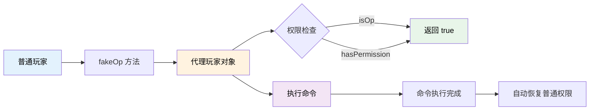

# 临时 OP 权限（Fake OP）

TabooLib 提供了一个轻量级的 Fake OP 功能，允许玩家在不实际给予 OP 权限的情况下，临时拥有 OP 权限执行特定命令。这对于需要调用需要 OP 权限的插件命令非常有用。

:::tip[为什么需要 Fake OP？]

某些插件的命令要求玩家必须是 OP 才能执行，但直接给予玩家 OP 权限会带来安全风险。Fake OP 通过字节码代理技术，让玩家在执行命令时**临时**拥有 OP 权限，执行完毕后立即恢复，既满足了需求又保证了安全。

:::

## 功能概览



**工作原理：**
- 使用 ByteBuddy 动态生成玩家代理类
- 代理类的 `isOp()`、`hasPermission()` 方法始终返回 `true`
- 其他方法委托给原始玩家对象
- 执行完命令后代理对象自动释放

## 快速开始

### 基础用法

让玩家以 OP 权限执行命令：

```kotlin title="基础示例" showLineNumbers
import org.bukkit.entity.Player
import taboolib.expansion.dispatchCommandAsOp

fun executeCommandAsOp(player: Player) {
    // highlight-next-line
    // 让玩家以 OP 权限执行命令
    val success = player.dispatchCommandAsOp("somecommand arg1 arg2")

    if (success) {
        player.sendMessage("§a命令执行成功")
    } else {
        player.sendMessage("§c命令执行失败")
    }
}
```

**代码说明：**
- `dispatchCommandAsOp()`: 扩展函数，让玩家以 OP 权限执行命令
- 方法执行期间玩家拥有 OP 权限
- 方法返回后权限自动恢复
- 返回值：命令是否执行成功

### 手动创建 Fake OP 对象

如果需要更细粒度的控制，可以手动创建 Fake OP 代理对象：

```kotlin title="手动创建代理" showLineNumbers
import org.bukkit.Bukkit
import taboolib.expansion.fakeOp

fun executeWithFakeOp(player: Player, command: String) {
    // highlight-start
    // 创建 Fake OP 代理对象
    val fakeOpPlayer = player.fakeOp()
    // highlight-end

    // 使用代理对象执行命令
    val success = Bukkit.dispatchCommand(fakeOpPlayer, command)

    player.sendMessage("命令执行结果: $success")
}
```

**代码说明：**
- `fakeOp()`: 返回玩家的 Fake OP 代理对象
- 代理对象的 `isOp()` 和 `hasPermission()` 始终返回 `true`
- 可以将代理对象传递给任何需要 OP 权限的 API

## 实战场景

### 场景 1：商店系统调用其他插件命令

让玩家购买商品后，使用 OP 权限执行给予物品的命令：

```kotlin title="商店系统示例" showLineNumbers
import org.bukkit.entity.Player
import taboolib.expansion.dispatchCommandAsOp
import taboolib.platform.compat.withdrawBalance

/**
 * 商店购买物品
 */
fun buyItemFromShop(player: Player, itemId: String, price: Double) {
    // 检查余额
    if (player.getBalance() < price) {
        player.sendMessage("§c余额不足！")
        return
    }

    // 扣款
    val response = player.withdrawBalance(price)
    if (!response.transactionSuccess()) {
        player.sendMessage("§c扣款失败")
        return
    }

    // highlight-start
    // 使用 OP 权限执行给予物品命令（假设某个物品插件需要 OP）
    val success = player.dispatchCommandAsOp("customitems give $itemId 1")
    // highlight-end

    if (success) {
        player.sendMessage("§a成功购买 $itemId！")
    } else {
        // 购买失败，退款
        player.depositBalance(price)
        player.sendMessage("§c购买失败，已退款")
    }
}
```

### 场景 2：任务系统奖励

完成任务后，使用 OP 权限执行奖励命令：

```kotlin title="任务奖励示例" showLineNumbers
import org.bukkit.entity.Player
import taboolib.expansion.dispatchCommandAsOp

data class Quest(
    val id: String,
    val name: String,
    val rewardCommands: List<String>  // 奖励命令列表
)

/**
 * 完成任务，发放奖励
 */
fun completeQuest(player: Player, quest: Quest) {
    player.sendMessage("§a恭喜完成任务：${quest.name}")

    // highlight-start
    // 执行所有奖励命令（可能需要 OP 权限）
    quest.rewardCommands.forEach { command ->
        // 替换占位符
        val finalCommand = command
            .replace("%player%", player.name)
            .replace("%uuid%", player.uniqueId.toString())

        // 以 OP 权限执行
        player.dispatchCommandAsOp(finalCommand)
    }
    // highlight-end

    player.sendMessage("§7奖励已发放")
}

// 使用示例
fun onPlayerCompleteQuest(player: Player) {
    val quest = Quest(
        id = "daily_login",
        name = "每日登录",
        rewardCommands = listOf(
            "eco give %player% 1000",      // 给予金币
            "give %player% diamond 5",     // 给予钻石
            "effect give %player% minecraft:speed 60 1"  // 给予速度效果
        )
    )

    completeQuest(player, quest)
}
```

### 场景 3：权限临时提升

让玩家临时拥有权限执行某些操作：

```kotlin title="临时权限提升" showLineNumbers
import org.bukkit.entity.Player
import taboolib.expansion.fakeOp

/**
 * VIP 玩家使用特殊传送功能
 */
fun vipTeleport(player: Player, targetWorld: String) {
    // 检查 VIP 权限
    if (!player.hasPermission("server.vip")) {
        player.sendMessage("§c此功能仅限 VIP 使用")
        return
    }

    // highlight-start
    // 创建 Fake OP 对象
    val fakeOpPlayer = player.fakeOp()

    // 使用 Essentials 的传送命令（可能需要 OP）
    Bukkit.dispatchCommand(fakeOpPlayer, "mvtp $targetWorld")
    // highlight-end

    player.sendMessage("§a正在传送到 $targetWorld...")
}
```

### 场景 4：管理员工具

为管理员提供快捷操作工具：

```kotlin title="管理工具示例" showLineNumbers
import org.bukkit.entity.Player
import taboolib.expansion.dispatchCommandAsOp

object AdminTools {

    /**
     * 批量给予玩家物品
     */
    fun giveItemToAll(operator: Player, itemCommand: String) {
        // 检查操作者权限
        if (!operator.hasPermission("admin.tools")) {
            operator.sendMessage("§c你没有权限使用此功能")
            return
        }

        var successCount = 0
        val onlinePlayers = Bukkit.getOnlinePlayers()

        onlinePlayers.forEach { target ->
            // highlight-start
            // 为每个玩家执行给予命令（使用 OP 权限）
            val command = itemCommand.replace("%player%", target.name)
            val success = operator.dispatchCommandAsOp(command)
            // highlight-end

            if (success) {
                successCount++
            }
        }

        operator.sendMessage("§a成功给予 $successCount/${onlinePlayers.size} 个玩家物品")
    }

    /**
     * 批量清理玩家背包
     */
    fun clearInventoryAll(operator: Player) {
        if (!operator.hasPermission("admin.tools")) {
            operator.sendMessage("§c你没有权限使用此功能")
            return
        }

        Bukkit.getOnlinePlayers().forEach { target ->
            operator.dispatchCommandAsOp("clear ${target.name}")
        }

        operator.sendMessage("§a已清空所有玩家背包")
    }

    /**
     * 批量治疗玩家
     */
    fun healAll(operator: Player) {
        if (!operator.hasPermission("admin.tools")) {
            operator.sendMessage("§c你没有权限使用此功能")
            return
        }

        Bukkit.getOnlinePlayers().forEach { target ->
            operator.dispatchCommandAsOp("heal ${target.name}")
            operator.dispatchCommandAsOp("feed ${target.name}")
        }

        operator.sendMessage("§a已治疗所有玩家")
    }
}

// 使用示例
fun onAdminCommand(operator: Player, args: Array<String>) {
    when (args[0].lowercase()) {
        "giveall" -> {
            // /admin giveall give %player% diamond 64
            val itemCommand = args.drop(1).joinToString(" ")
            AdminTools.giveItemToAll(operator, itemCommand)
        }
        "clearall" -> AdminTools.clearInventoryAll(operator)
        "healall" -> AdminTools.healAll(operator)
    }
}
```

### 场景 5：跨插件功能集成

集成其他需要 OP 权限的插件功能：

```kotlin title="跨插件集成" showLineNumbers
import org.bukkit.entity.Player
import taboolib.expansion.dispatchCommandAsOp

/**
 * 跨插件传送系统
 */
object CrossPluginTeleport {

    /**
     * 使用 Essentials 传送
     */
    fun essentialsTeleport(player: Player, target: Player) {
        player.dispatchCommandAsOp("tp ${target.name}")
        player.sendMessage("§a已传送到 ${target.displayName}")
    }

    /**
     * 使用 Multiverse 传送到世界
     */
    fun multiverseTeleport(player: Player, worldName: String) {
        val success = player.dispatchCommandAsOp("mvtp $worldName")
        if (success) {
            player.sendMessage("§a已传送到世界 $worldName")
        } else {
            player.sendMessage("§c传送失败，世界不存在")
        }
    }

    /**
     * 使用地标插件传送
     */
    fun warpTeleport(player: Player, warpName: String) {
        val success = player.dispatchCommandAsOp("warp $warpName")
        if (success) {
            player.sendMessage("§a已传送到地标 $warpName")
        } else {
            player.sendMessage("§c地标不存在")
        }
    }
}

/**
 * 跨插件经济系统
 */
object CrossPluginEconomy {

    /**
     * 使用 Essentials 给予金币
     */
    fun giveMoneyEssentials(operator: Player, target: Player, amount: Double) {
        operator.dispatchCommandAsOp("eco give ${target.name} $amount")
    }

    /**
     * 使用 PlayerPoints 给予点券
     */
    fun givePoints(operator: Player, target: Player, points: Int) {
        operator.dispatchCommandAsOp("points give ${target.name} $points")
    }
}

/**
 * 跨插件权限管理
 */
object CrossPluginPermission {

    /**
     * 使用 LuckPerms 添加权限组
     */
    fun addPermissionGroup(operator: Player, target: Player, group: String) {
        val success = operator.dispatchCommandAsOp("lp user ${target.name} parent add $group")
        if (success) {
            operator.sendMessage("§a已将 ${target.name} 添加到权限组 $group")
        }
    }

    /**
     * 使用 LuckPerms 临时给予权限
     */
    fun addTempPermission(operator: Player, target: Player, permission: String, duration: String) {
        operator.dispatchCommandAsOp("lp user ${target.name} permission settemp $permission true $duration")
    }
}
```

## 技术细节

### 工作原理

Fake OP 使用 ByteBuddy 字节码库动态生成玩家代理类：

```kotlin
// 伪代码，展示工作原理
class PlayerFakeOp(val originalPlayer: Player) : Player {

    // 始终返回 true
    override fun isOp(): Boolean = true

    // 始终返回 true
    override fun hasPermission(permission: String): Boolean = true

    override fun hasPermission(permission: Permission): Boolean = true

    // 其他方法委托给原始玩家对象
    override fun getName(): String = originalPlayer.name
    override fun getLocation(): Location = originalPlayer.location
    // ... 其他所有方法
}
```

**优势：**
- ✅ 不需要真正给予玩家 OP 权限
- ✅ 执行完命令后自动恢复
- ✅ 不影响权限插件的权限检查
- ✅ 线程安全

### 依赖说明

Fake OP 模块依赖 ByteBuddy 库：

```kotlin
@RuntimeDependency(
    value = "!net.bytebuddy:byte-buddy:1.14.9",
    relocate = ["!net.bytebuddy", "!net.bytebuddy_1_14_9"],
    transitive = false
)
```

TabooLib 会自动下载和加载依赖，无需手动配置。

## 常见问题

### Fake OP 是否影响真实的 OP 权限？

不会。Fake OP 只是创建一个临时的代理对象，不会修改玩家的实际 OP 状态：

```kotlin
val player: Player = ...

println("原始 OP 状态: ${player.isOp}")  // false

val fakeOpPlayer = player.fakeOp()
println("代理 OP 状态: ${fakeOpPlayer.isOp}")  // true
println("原始 OP 状态: ${player.isOp}")  // 依然是 false

// 代理对象使用完毕后
println("原始 OP 状态: ${player.isOp}")  // 依然是 false
```

### 是否支持所有命令？

支持大部分非原版命令。对于原版命令，由于 Minecraft 服务器的权限检查机制，Fake OP 可能无法正常工作。

```kotlin
// ✅ 支持插件命令
player.dispatchCommandAsOp("eco give Player 1000")  // Essentials 命令
player.dispatchCommandAsOp("lp user Player permission set some.perm true")  // LuckPerms 命令
player.dispatchCommandAsOp("warp spawn")  // 传送插件命令

// ❌ 原版命令可能不支持
player.dispatchCommandAsOp("gamemode creative")  // 可能无效
player.dispatchCommandAsOp("give @p diamond 64")  // 可能无效
```

:::warning[原版命令限制]

对于原版命令，建议使用 Bukkit API 直接操作：

```kotlin
// 推荐方式 - 使用 Bukkit API
player.gameMode = GameMode.CREATIVE
player.inventory.addItem(ItemStack(Material.DIAMOND, 64))
```

:::

### 如何检查命令是否执行成功？

`dispatchCommandAsOp()` 返回布尔值表示命令是否执行成功：

```kotlin
val success = player.dispatchCommandAsOp("somecommand")

if (success) {
    // 命令执行成功
    player.sendMessage("操作成功")
} else {
    // 命令执行失败（可能是命令不存在或参数错误）
    player.sendMessage("操作失败")
}
```

:::info[返回值说明]

`success = true` 表示命令被成功派发和执行，但不代表命令的业务逻辑执行成功。例如：
- `eco give Player 1000` 返回 `true` 表示命令被执行
- 但如果经济插件内部处理失败，返回值依然是 `true`

:::

### 是否线程安全？

是的。Fake OP 的代理对象是线程安全的，可以在异步线程中使用：

```kotlin
submit(async = true) {
    val fakeOpPlayer = player.fakeOp()

    // 在异步线程中使用（但要注意 Bukkit API 的线程安全性）
    Bukkit.getScheduler().runTask(plugin, Runnable {
        Bukkit.dispatchCommand(fakeOpPlayer, "somecommand")
    })
}
```

:::warning[Bukkit API 线程限制]

虽然 Fake OP 对象是线程安全的，但 Bukkit 的很多 API 要求在主线程调用。建议命令执行在主线程进行。

:::

### Fake OP 对性能有影响吗？

性能影响非常小。创建代理对象使用了字节码生成和类加载，但这些操作都会被缓存：

```kotlin
// 首次调用会生成代理类（稍慢）
val fakeOp1 = player.fakeOp()  // ~10ms

// 后续调用直接复用代理类（很快）
val fakeOp2 = player.fakeOp()  // ~0.1ms
```

**性能建议：**
- ✅ 正常使用无需担心性能
- ✅ 可以频繁调用 `fakeOp()`
- ⚠️ 避免在高频循环中创建大量代理对象

### 如何在权限插件中屏蔽 Fake OP？

如果你不希望 Fake OP 绕过权限插件的检查，可以在权限插件中检测玩家类型：

```kotlin
// 在权限插件的权限检查代码中
fun hasPermission(player: Player, permission: String): Boolean {
    // 检查是否是 Fake OP 代理对象
    if (player.javaClass.simpleName.contains("FakeOp")) {
        // 拒绝 Fake OP 的权限检查
        return false
    }

    // 正常权限检查
    return // ... 你的权限检查逻辑
}
```

:::tip[最佳实践]

1. **仅在必要时使用**：只在确实需要 OP 权限时使用 Fake OP
2. **权限检查**：在使用 Fake OP 前先检查玩家是否有权限使用该功能
3. **命令验证**：确保执行的命令是安全的，避免安全风险
4. **错误处理**：检查命令执行结果，处理失败情况
5. **日志记录**：记录 Fake OP 的使用情况，便于审计

:::

## 安全注意事项

### 验证玩家权限

在使用 Fake OP 前，务必检查玩家是否有权限使用该功能：

```kotlin
fun buyVIPItem(player: Player) {
    // highlight-start
    // 先检查玩家权限
    if (!player.hasPermission("shop.vip.buy")) {
        player.sendMessage("§c你没有权限购买 VIP 物品")
        return
    }
    // highlight-end

    // 使用 Fake OP 执行命令
    player.dispatchCommandAsOp("customitems give vip_item 1")
}
```

### 避免执行用户输入的命令

永远不要直接使用用户输入作为命令：

```kotlin
// ❌ 危险 - 用户可以输入任意命令
fun executeUserCommand(player: Player, userInput: String) {
    player.dispatchCommandAsOp(userInput)  // 非常危险！
}

// ✅ 安全 - 使用白名单
fun executeAllowedCommand(player: Player, commandName: String) {
    val allowedCommands = setOf("warp", "home", "back")

    if (commandName in allowedCommands) {
        player.dispatchCommandAsOp(commandName)
    } else {
        player.sendMessage("§c不允许执行该命令")
    }
}
```

### 记录关键操作

记录 Fake OP 的使用情况：

```kotlin
fun executeCommandWithLog(player: Player, command: String) {
    // 记录日志
    plugin.logger.info("玩家 ${player.name} 使用 Fake OP 执行命令: $command")

    val success = player.dispatchCommandAsOp(command)

    // 记录结果
    plugin.logger.info("命令执行结果: ${if (success) "成功" else "失败"}")
}
```

## 总结

TabooLib Fake OP 模块提供了：

✅ **安全的临时权限**：无需给予真实 OP，执行后自动恢复

✅ **简洁的 API**：`dispatchCommandAsOp()` 一行代码搞定

✅ **灵活的控制**：可手动创建代理对象精细控制

✅ **高性能**：字节码代理，性能损耗极小

✅ **跨插件兼容**：支持绝大多数插件命令

适用于商店系统、任务奖励、管理工具、跨插件集成等各种需要临时提权的场景！
