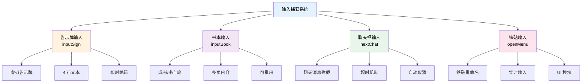

# 输入捕获

在插件开发中，我们经常需要玩家输入一些内容，比如点击按钮后让玩家输入名称、数量等信息。TabooLib 基于 Kotlin 的函数式编程风格，提供了多种便捷的输入捕获工具。

**涉及模块：**
- `BUKKIT_ALL` - 聊天和书本输入捕获
- `NMS` - 告示牌输入捕获
- `UI` - 铁砧输入捕获（需要 UI 模块）

## 核心概念解析

### 什么是输入捕获？

输入捕获是指通过特定的游戏界面（告示牌、书本、聊天框、铁砧等）让玩家输入内容，然后在代码中捕获并处理这些输入的功能。



### 四种输入方式对比

| 输入方式 | 优点 | 缺点 | 适用场景 |
|---------|------|------|----------|
| **告示牌** | 原生界面、简洁直观 | 最多 4 行、每行字数限制 | 简单输入（名称、数字） |
| **书本** | 支持多页、内容丰富 | 需要关闭书本触发、操作复杂 | 长文本输入（描述、配置） |
| **聊天框** | 输入方便、无字数限制 | 可能误触发、不够直观 | 快速输入（命令参数） |
| **铁砧** | 实时预览、美观友好 | 需要 UI 模块、版本限制 | 单行输入（重命名） |

## 告示牌输入 (inputSign)

使用虚拟告示牌让玩家输入内容，支持最多 4 行文本。

### 基础用法

```kotlin
import taboolib.module.nms.inputSign

// 基础示例：空白告示牌
player.inputSign { lines ->
    val input = lines[0]  // 获取第一行内容
    player.sendMessage("你输入了: $input")
}

// 带提示文本的告示牌
player.inputSign(arrayOf("", "", "", "请在第一行输入内容")) { lines ->
    val name = lines[0]
    player.sendMessage("输入的名称是: $name")
}
```

### 参数说明

```kotlin
fun Player.inputSign(
    lines: Array<String> = arrayOf(),      // 告示牌初始内容（最多 4 行）
    callback: (lines: Array<String>) -> Unit  // 回调函数，接收 4 行内容
)
```

**参数详解：**

| 参数 | 类型 | 默认值 | 说明 |
|------|------|--------|------|
| `lines` | Array&lt;String&gt; | 空数组 | 告示牌初始内容，不足 4 行会自动补齐 |
| `callback` | (Array&lt;String&gt;) -> Unit | 必填 | 玩家完成输入后的回调函数 |

**返回值：**
- `callback` 的参数 `lines` 是一个包含 4 行内容的数组，即使玩家只输入了部分行

### 实战示例

#### 示例 1：创建传送点

```kotlin
fun createWarpPoint(player: Player) {
    player.sendMessage("§a请在告示牌上输入传送点名称")

    player.inputSign(arrayOf("", "", "", "§7输入传送点名称")) { lines ->
        val warpName = lines[0].trim()

        // 验证输入
        if (warpName.isEmpty()) {
            player.sendMessage("§c传送点名称不能为空！")
            return@inputSign
        }

        if (warpName.length > 16) {
            player.sendMessage("§c传送点名称不能超过 16 个字符！")
            return@inputSign
        }

        // 保存传送点
        saveWarpPoint(warpName, player.location)
        player.sendMessage("§a成功创建传送点: $warpName")
    }
}
```

#### 示例 2：设置物品数量

```kotlin
fun setItemAmount(player: Player) {
    val item = player.inventory.itemInMainHand

    if (item.type.isAir) {
        player.sendMessage("§c请手持物品！")
        return
    }

    player.inputSign(arrayOf("§e输入数量", "", "", "§71-64")) { lines ->
        val input = lines[0]

        // 解析数字
        val amount = input.toIntOrNull()

        if (amount == null) {
            player.sendMessage("§c请输入有效的数字！")
            return@inputSign
        }

        if (amount !in 1..64) {
            player.sendMessage("§c数量必须在 1-64 之间！")
            return@inputSign
        }

        // 设置数量
        item.amount = amount
        player.sendMessage("§a已将物品数量设置为: $amount")
    }
}
```

#### 示例 3：多行输入（配置编辑）

```kotlin
fun editConfig(player: Player, key: String) {
    val currentValue = getConfig(key) ?: arrayOf("", "", "", "")

    player.sendMessage("§a请在告示牌上编辑配置（4 行）")

    player.inputSign(currentValue) { lines ->
        // 保存所有 4 行内容
        setConfig(key, lines)

        // 显示结果
        player.sendMessage("§a配置已更新:")
        lines.forEachIndexed { index, line ->
            if (line.isNotEmpty()) {
                player.sendMessage("  §7第 ${index + 1} 行: §f$line")
            }
        }
    }
}
```

### 注意事项

1. **行数限制**：告示牌固定为 4 行，传入的 `lines` 数组会自动调整到 4 行
2. **字符限制**：每行最多约 15 个字符（取决于字体宽度）
3. **虚拟告示牌**：使用的是虚拟告示牌，不会在世界中实际放置方块
4. **位置处理**：
   - 1.20+ 版本：在玩家脚下 2 格处显示
   - 1.20- 版本：在 y=0 处显示
5. **自动清理**：输入完成后虚拟告示牌会自动移除

## 书本输入 (inputBook)

向玩家发送一本可编辑的书本，捕获书本的编辑内容。

### 基础用法

```kotlin
import taboolib.platform.util.inputBook

// 基础示例：空白书本
player.inputBook("书本标题") { pages ->
    val firstPage = pages[0]
    player.sendMessage("第一页内容: $firstPage")
}

// 带初始内容的书本
player.inputBook("编辑说明", true, listOf("请在这里输入内容", "第二页")) { pages ->
    pages.forEachIndexed { index, content ->
        player.sendMessage("第 ${index + 1} 页: $content")
    }
}
```

### 参数说明

```kotlin
fun Player.inputBook(
    display: String,                     // 书本显示名称
    disposable: Boolean = true,          // 编辑后是否销毁
    content: List<String> = emptyList(), // 初始内容（每个元素是一页）
    catcher: (List<String>) -> Unit      // 回调函数
)
```

**参数详解：**

| 参数 | 类型 | 默认值 | 说明 |
|------|------|--------|------|
| `display` | String | 必填 | 书本的显示名称 |
| `disposable` | Boolean | true | 是否一次性使用（编辑后自动销毁） |
| `content` | List&lt;String&gt; | 空列表 | 初始内容，每个元素代表一页 |
| `catcher` | (List&lt;String&gt;) -> Unit | 必填 | 编辑完成后的回调函数 |

**返回值：**
- `catcher` 的参数是一个字符串列表，每个元素代表一页的内容（按行分割）

### 实战示例

#### 示例 1：创建公告

```kotlin
fun createAnnouncement(player: Player) {
    player.sendMessage("§a请在书本中编写公告")

    player.inputBook(
        display = "§6公告编辑器",
        disposable = true,  // 编辑后自动销毁
        content = listOf("在这里输入公告标题", "", "在这里输入公告内容...")
    ) { pages ->
        // 第一行是标题，其余是内容
        val title = pages.firstOrNull()?.trim() ?: "无标题"
        val content = pages.drop(1).joinToString("\n").trim()

        if (content.isEmpty()) {
            player.sendMessage("§c公告内容不能为空！")
            return@inputBook
        }

        // 保存公告
        saveAnnouncement(title, content, player.name)
        player.sendMessage("§a公告创建成功！")
        player.sendMessage("§7标题: §f$title")
    }
}
```

#### 示例 2：编辑物品 Lore

```kotlin
fun editItemLore(player: Player) {
    val item = player.inventory.itemInMainHand

    if (item.type.isAir) {
        player.sendMessage("§c请手持物品！")
        return
    }

    // 获取当前 Lore
    val currentLore = item.lore ?: emptyList()

    player.inputBook(
        display = "§e物品描述编辑器",
        disposable = false,  // 可重复使用
        content = if (currentLore.isEmpty()) {
            listOf("每行一条描述", "支持颜色代码 &a &c 等")
        } else {
            currentLore
        }
    ) { pages ->
        // 将所有页的内容合并为 Lore
        val newLore = pages.filter { it.isNotBlank() }

        if (newLore.isEmpty()) {
            player.sendMessage("§c描述不能为空！")
            return@inputBook
        }

        // 应用 Lore
        item.lore = newLore
        player.sendMessage("§a物品描述已更新！")
    }
}
```

#### 示例 3：任务日志系统

```kotlin
fun editQuestLog(player: Player, questId: String) {
    // 获取已有的任务日志
    val existingLog = getQuestLog(questId)

    player.inputBook(
        display = "§d任务日志 #$questId",
        disposable = false,  // 日志可以多次编辑
        content = existingLog
    ) { pages ->
        // 过滤空行
        val log = pages.filter { it.isNotBlank() }

        // 添加时间戳
        val timestamp = System.currentTimeMillis()
        val entry = "§8[${formatTime(timestamp)}] §7${player.name}:\n${log.joinToString("\n")}"

        // 保存日志
        appendQuestLog(questId, entry)
        player.sendMessage("§a任务日志已更新")
    }
}
```

#### 示例 4：规则书

```kotlin
fun createRuleBook(player: Player) {
    player.inputBook(
        display = "§c服务器规则",
        disposable = true,
        content = listOf(
            "§6§l第一章: 基本规则",
            "",
            "1. 禁止使用外挂",
            "2. 禁止恶意破坏",
            "",
            "§6§l第二章: 高级规则",
            "",
            "请在下方补充..."
        )
    ) { pages ->
        // 合并所有页面
        val fullContent = pages.joinToString("\n")

        // 验证内容长度
        if (fullContent.length < 50) {
            player.sendMessage("§c规则内容太短，请补充更多内容")
            return@inputBook
        }

        // 保存规则书
        saveRules(fullContent)
        player.sendMessage("§a规则书创建成功！")

        // 广播给所有在线玩家
        Bukkit.getOnlinePlayers().forEach {
            it.sendMessage("§e${player.name} 创建了新的服务器规则")
        }
    }
}
```

### 注意事项

1. **书本类型**：发送的是「书与笔」(WRITABLE_BOOK)，可以直接编辑
2. **页面分割**：`content` 列表中的每个元素会被写入同一页（使用 `\n` 换行）
3. **返回格式**：`catcher` 收到的是按行分割后的内容列表
4. **销毁机制**：
   - `disposable = true`：编辑后书本自动从背包移除
   - `disposable = false`：书本保留，可以多次编辑
5. **特殊 Lore**：书本会带有特殊 Lore 标记，用于识别是否为输入捕获的书本
6. **触发时机**：当玩家点击「完成」(Done) 按钮时触发回调

## 聊天框输入 (nextChat)

捕获玩家在聊天框输入的下一条消息。

### 基础用法

```kotlin
import taboolib.platform.util.nextChat
import taboolib.platform.util.nextChatInTick

// 基础示例：捕获下一条消息
player.nextChat { message ->
    player.sendMessage("你输入了: $message")
}

// 带超时的捕获
player.nextChatInTick(
    tick = 20 * 30,  // 30 秒超时
    func = { message ->
        player.sendMessage("你输入了: $message")
    },
    timeout = { player ->
        player.sendMessage("§c输入超时！")
    }
)
```

### API 说明

#### nextChat - 基础捕获

```kotlin
// 方式 1：简单捕获
fun Player.nextChat(function: (message: String) -> Unit)

// 方式 2：带重用回调
fun Player.nextChat(
    function: (message: String) -> Unit,
    reuse: (player: Player) -> Unit = {}
)
```

**参数说明：**

| 参数 | 类型 | 说明 |
|------|------|------|
| `function` | (String) -> Unit | 捕获到消息后的回调函数 |
| `reuse` | (Player) -> Unit | 如果玩家已有待处理的输入，执行此回调 |

#### nextChatInTick - 带超时的捕获

```kotlin
fun Player.nextChatInTick(
    tick: Long,                              // 超时时间（tick）
    func: (message: String) -> Unit,         // 输入回调
    timeout: (player: Player) -> Unit = {},  // 超时回调
    reuse: (player: Player) -> Unit = {}     // 重用回调
)
```

**参数说明：**

| 参数 | 类型 | 说明 |
|------|------|------|
| `tick` | Long | 超时时间（1 秒 = 20 tick） |
| `func` | (String) -> Unit | 捕获到消息后的回调函数 |
| `timeout` | (Player) -> Unit | 超时后的回调函数 |
| `reuse` | (Player) -> Unit | 如果玩家已有待处理的输入，执行此回调 |

#### cancelNextChat - 取消捕获

```kotlin
fun Player.cancelNextChat(execute: Boolean = true)
```

**参数说明：**

| 参数 | 类型 | 默认值 | 说明 |
|------|------|--------|------|
| `execute` | Boolean | true | 是否执行回调函数（传入空字符串） |

### 实战示例

#### 示例 1：快速输入名称

```kotlin
fun renameItem(player: Player) {
    val item = player.inventory.itemInMainHand

    if (item.type.isAir) {
        player.sendMessage("§c请手持物品！")
        return
    }

    player.sendMessage("§a请在聊天框输入新的名称")
    player.sendMessage("§7输入 'cancel' 取消操作")

    player.nextChat { message ->
        // 取消操作
        if (message.equals("cancel", ignoreCase = true)) {
            player.sendMessage("§7已取消重命名")
            return@nextChat
        }

        // 验证长度
        if (message.length > 32) {
            player.sendMessage("§c名称不能超过 32 个字符！")
            return@nextChat
        }

        // 应用名称
        item.modifyMeta<ItemMeta> {
            setDisplayName("§f$message")
        }
        player.sendMessage("§a物品已重命名为: §f$message")
    }
}
```

#### 示例 2：带超时的输入

```kotlin
fun askForPassword(player: Player) {
    player.sendMessage("§e请在 30 秒内输入密码")

    player.nextChatInTick(
        tick = 20 * 30,  // 30 秒
        func = { password ->
            // 验证密码
            if (verifyPassword(player, password)) {
                player.sendMessage("§a密码正确！")
                unlockFeature(player)
            } else {
                player.sendMessage("§c密码错误！")
            }
        },
        timeout = { player ->
            player.sendMessage("§c输入超时，请重新尝试")
        }
    )
}
```

#### 示例 3：防止重复输入

```kotlin
fun setBounty(player: Player, targetPlayer: Player) {
    player.sendMessage("§a请输入悬赏金额")

    player.nextChat(
        function = { amount ->
            val bounty = amount.toIntOrNull()

            if (bounty == null || bounty <= 0) {
                player.sendMessage("§c请输入有效的金额！")
                return@nextChat
            }

            // 扣除金币并设置悬赏
            if (takeMoney(player, bounty)) {
                setBountyAmount(targetPlayer, bounty)
                player.sendMessage("§a已对 ${targetPlayer.name} 设置 $bounty 金币的悬赏")
            } else {
                player.sendMessage("§c金币不足！")
            }
        },
        reuse = { player ->
            // 如果玩家已经有待处理的输入
            player.sendMessage("§c你已经有一个待输入的操作，请先完成")
        }
    )
}
```

#### 示例 4：多步骤输入

```kotlin
fun createGuild(player: Player) {
    player.sendMessage("§6=== 创建公会 ===")
    player.sendMessage("§a步骤 1/3: 请输入公会名称")

    player.nextChatInTick(
        tick = 20 * 60,  // 60 秒
        func = { guildName ->
            // 验证公会名称
            if (guildName.length < 3 || guildName.length > 16) {
                player.sendMessage("§c公会名称必须在 3-16 个字符之间")
                return@nextChatInTick
            }

            // 步骤 2：输入标签
            player.sendMessage("§a步骤 2/3: 请输入公会标签（3 个字符）")

            player.nextChatInTick(
                tick = 20 * 60,
                func = { tag ->
                    if (tag.length != 3) {
                        player.sendMessage("§c标签必须是 3 个字符")
                        return@nextChatInTick
                    }

                    // 步骤 3：输入描述
                    player.sendMessage("§a步骤 3/3: 请输入公会描述")

                    player.nextChatInTick(
                        tick = 20 * 60,
                        func = { description ->
                            // 创建公会
                            createGuild(guildName, tag, description, player)
                            player.sendMessage("§a公会创建成功！")
                            player.sendMessage("§7名称: §f$guildName")
                            player.sendMessage("§7标签: §f[$tag]")
                            player.sendMessage("§7描述: §f$description")
                        },
                        timeout = { player.sendMessage("§c输入超时") }
                    )
                },
                timeout = { player.sendMessage("§c输入超时") }
            )
        },
        timeout = { player ->
            player.sendMessage("§c输入超时，公会创建已取消")
        }
    )
}
```

#### 示例 5：手动取消输入

```kotlin
fun startQuiz(player: Player) {
    player.sendMessage("§e答题开始！")
    player.sendMessage("§7输入 'quit' 可以随时退出")

    fun askQuestion(questionIndex: Int) {
        if (questionIndex >= questions.size) {
            player.sendMessage("§a恭喜完成所有题目！")
            return
        }

        val question = questions[questionIndex]
        player.sendMessage("§6题目 ${questionIndex + 1}: ${question.text}")

        player.nextChat { answer ->
            // 检查是否退出
            if (answer.equals("quit", ignoreCase = true)) {
                player.cancelNextChat(execute = false)
                player.sendMessage("§c已退出答题")
                return@nextChat
            }

            // 检查答案
            if (answer.equals(question.correctAnswer, ignoreCase = true)) {
                player.sendMessage("§a正确！")
                askQuestion(questionIndex + 1)
            } else {
                player.sendMessage("§c错误！正确答案是: ${question.correctAnswer}")
            }
        }
    }

    askQuestion(0)
}
```

### 注意事项

1. **消息拦截**：捕获的消息不会被发送到聊天频道（会被自动取消）
2. **玩家退出**：玩家退出服务器时，待处理的输入会自动清除
3. **单一捕获**：每个玩家同时只能有一个待处理的输入
4. **异步事件**：回调函数在聊天事件中执行（AsyncPlayerChatEvent）
5. **超时机制**：使用 `nextChatInTick` 可以设置超时时间，超时后自动清除并执行回调
6. **手动取消**：使用 `cancelNextChat()` 可以手动取消输入捕获

## 铁砧输入 (openMenu)

使用铁砧界面让玩家输入内容，提供实时预览效果。

### 前置要求

铁砧输入需要 UI 模块支持。

```gradle
taboolib {
    install("module-ui")
}
```

### 基础用法

```kotlin
import taboolib.module.ui.openMenu
import taboolib.module.ui.type.Anvil

player.openMenu<Anvil>("请输入内容") {
    onRename { player, text, inventory ->
        player.sendMessage("你输入了: $text")
    }
}
```

### 完整示例

```kotlin
import taboolib.module.ui.openMenu
import taboolib.module.ui.type.Anvil

fun anvilInput(player: Player) {
    player.openMenu<Anvil>("§a输入物品名称") {
        // 设置默认文本（可选）
        // 通过设置铁砧第一个槽位的物品来显示默认文本
        slots {
            set(0, buildItem(XMaterial.PAPER) {
                name = "默认名称"
            })
        }

        // 当玩家重命名时触发
        onRename { player, newName, inventory ->
            // 验证输入
            if (newName.isBlank()) {
                player.sendMessage("§c名称不能为空！")
                return@onRename
            }

            if (newName.length > 32) {
                player.sendMessage("§c名称过长！")
                return@onRename
            }

            // 处理输入
            player.sendMessage("§a输入的名称: §f$newName")

            // 关闭界面（可选）
            player.closeInventory()
        }

        // 当界面关闭时触发（可选）
        onClose { player ->
            player.sendMessage("§7界面已关闭")
        }
    }
}
```

### 实战示例

#### 示例 1：快速搜索

```kotlin
fun searchItems(player: Player) {
    player.openMenu<Anvil>("§e搜索物品") {
        slots {
            set(0, buildItem(XMaterial.COMPASS) {
                name = "搜索..."
            })
        }

        onRename { player, keyword, inventory ->
            if (keyword.isBlank()) {
                return@onRename
            }

            // 搜索物品
            val results = searchItemsByName(keyword)

            if (results.isEmpty()) {
                player.sendMessage("§c未找到匹配的物品")
                return@onRename
            }

            // 显示搜索结果
            player.sendMessage("§a找到 ${results.size} 个物品:")
            results.take(10).forEach { item ->
                player.sendMessage("  §7- §f${item.name}")
            }
        }
    }
}
```

#### 示例 2：创建商店

```kotlin
fun createShopItem(player: Player, item: ItemStack) {
    player.openMenu<Anvil>("§6设置价格") {
        slots {
            set(0, buildItem(XMaterial.GOLD_INGOT) {
                name = "100"  // 默认价格
            })
        }

        onRename { player, priceText, inventory ->
            // 解析价格
            val price = priceText.toDoubleOrNull()

            if (price == null || price <= 0) {
                player.sendMessage("§c请输入有效的价格！")
                return@onRename
            }

            // 创建商店物品
            addShopItem(item, price)
            player.sendMessage("§a商品已上架，价格: $price")
            player.closeInventory()
        }
    }
}
```

#### 示例 3：改名卡功能

```kotlin
fun useRenameCard(player: Player) {
    player.openMenu<Anvil>("§d改名卡") {
        slots {
            // 设置当前名称
            set(0, buildItem(XMaterial.NAME_TAG) {
                name = player.displayName
            })
        }

        onRename { player, newName, inventory ->
            // 验证名称
            if (newName.length < 3 || newName.length > 16) {
                player.sendMessage("§c名称必须在 3-16 个字符之间")
                return@onRename
            }

            // 检查是否重名
            if (isNameTaken(newName)) {
                player.sendMessage("§c该名称已被使用")
                return@onRename
            }

            // 扣除改名卡
            if (!consumeRenameCard(player)) {
                player.sendMessage("§c改名卡不足")
                return@onRename
            }

            // 更改名称
            player.setDisplayName(newName)
            player.sendMessage("§a名称已更改为: §f$newName")
            player.closeInventory()
        }
    }
}
```

### 注意事项

1. **UI 模块依赖**：必须安装 `module-ui` 才能使用
2. **实时更新**：玩家每输入一个字符都会触发 `onRename` 回调
3. **默认文本**：通过设置第一个槽位的物品名称来显示默认文本
4. **版本兼容**：铁砧界面在所有版本都可用，但显示效果可能略有不同
5. **手动关闭**：在回调中使用 `player.closeInventory()` 手动关闭界面

## 最佳实践

### 1. 选择合适的输入方式

```kotlin
// ✅ 简单输入（名称、数字） - 使用告示牌
fun inputName(player: Player) {
    player.inputSign(arrayOf("", "", "", "输入名称")) { lines ->
        processName(lines[0])
    }
}

// ✅ 长文本输入（描述、配置） - 使用书本
fun inputDescription(player: Player) {
    player.inputBook("描述编辑器") { pages ->
        processDescription(pages.joinToString("\n"))
    }
}

// ✅ 快速输入（命令参数） - 使用聊天框
fun inputCommand(player: Player) {
    player.nextChat { message ->
        executeCommand(message)
    }
}

// ✅ 实时预览（搜索、过滤） - 使用铁砧
fun inputSearch(player: Player) {
    player.openMenu<Anvil>("搜索") {
        onRename { player, keyword, _ ->
            showSearchResults(player, keyword)
        }
    }
}
```

### 2. 输入验证

```kotlin
// ✅ 完善的输入验证
fun validateInput(player: Player) {
    player.nextChat { input ->
        // 1. 非空检查
        if (input.isBlank()) {
            player.sendMessage("§c输入不能为空")
            return@nextChat
        }

        // 2. 长度检查
        if (input.length > 32) {
            player.sendMessage("§c输入过长（最多 32 个字符）")
            return@nextChat
        }

        // 3. 格式检查
        if (!input.matches(Regex("[a-zA-Z0-9_]+"))) {
            player.sendMessage("§c只能包含字母、数字和下划线")
            return@nextChat
        }

        // 4. 业务逻辑检查
        if (isDuplicate(input)) {
            player.sendMessage("§c该名称已存在")
            return@nextChat
        }

        // 验证通过
        processInput(input)
    }
}
```

### 3. 超时处理

```kotlin
// ✅ 合理设置超时时间
fun inputWithTimeout(player: Player) {
    player.sendMessage("§a请在 30 秒内输入")

    player.nextChatInTick(
        tick = 20 * 30,  // 30 秒
        func = { input ->
            processInput(input)
        },
        timeout = { player ->
            player.sendMessage("§c输入超时，操作已取消")
            // 返还资源或执行清理操作
            refundResources(player)
        }
    )
}
```

### 4. 取消机制

```kotlin
// ✅ 提供取消选项
fun inputWithCancel(player: Player) {
    player.sendMessage("§a请输入内容")
    player.sendMessage("§7输入 'cancel' 取消操作")

    player.nextChat { input ->
        // 检查是否取消
        if (input.equals("cancel", ignoreCase = true)) {
            player.sendMessage("§7操作已取消")
            return@nextChat
        }

        processInput(input)
    }
}
```

### 5. 防重复提交

```kotlin
// ✅ 使用 reuse 参数防止重复提交
fun preventDuplicate(player: Player) {
    player.nextChat(
        function = { input ->
            processInput(input)
        },
        reuse = { player ->
            player.sendMessage("§c你已经有一个待处理的输入")
        }
    )
}
```

### 6. 多步骤输入

```kotlin
// ✅ 清晰的多步骤流程
fun multiStepInput(player: Player) {
    // 步骤 1
    player.sendMessage("§6步骤 1/3: 输入名称")
    player.nextChat { name ->
        if (!validateName(name)) {
            return@nextChat
        }

        // 步骤 2
        player.sendMessage("§6步骤 2/3: 输入描述")
        player.nextChat { description ->
            if (!validateDescription(description)) {
                return@nextChat
            }

            // 步骤 3
            player.sendMessage("§6步骤 3/3: 确认信息")
            player.sendMessage("  §7名称: §f$name")
            player.sendMessage("  §7描述: §f$description")
            player.sendMessage("§a输入 'yes' 确认, 'no' 取消")

            player.nextChat { confirm ->
                if (confirm.equals("yes", ignoreCase = true)) {
                    create(name, description)
                    player.sendMessage("§a创建成功！")
                } else {
                    player.sendMessage("§c已取消")
                }
            }
        }
    }
}
```

### 7. 错误处理

```kotlin
// ✅ 完善的错误处理
fun robustInput(player: Player) {
    try {
        player.nextChat { input ->
            try {
                // 处理输入
                val result = processInput(input)

                // 检查结果
                if (result.isSuccess) {
                    player.sendMessage("§a操作成功")
                } else {
                    player.sendMessage("§c操作失败: ${result.error}")
                }
            } catch (e: Exception) {
                player.sendMessage("§c处理输入时发生错误")
                e.printStackTrace()
            }
        }
    } catch (e: Exception) {
        player.sendMessage("§c设置输入捕获时发生错误")
        e.printStackTrace()
    }
}
```

## 常见问题

### Q1：告示牌输入为什么有字符限制？

**A**：这是 Minecraft 原生告示牌的限制。每行最多约 15 个字符（英文），中文会占用更多空间。如果需要输入更长的内容，请使用书本输入或聊天框输入。

### Q2：书本输入如何处理换行？

**A**：书本的 `content` 参数中，每个元素会写入同一页，使用 `\n` 换行。回调函数收到的是按行分割后的列表。

```kotlin
// 输入
content = listOf("第一行\n第二行\n第三行")

// 回调收到的
pages = listOf("第一行", "第二行", "第三行")
```

### Q3：聊天框输入会不会被其他玩家看到？

**A**：不会。使用 `nextChat` 捕获的消息会被自动拦截，不会发送到聊天频道。

### Q4：如何在输入捕获期间阻止其他操作？

**A**：你可以设置一个标记，在输入期间禁用其他操作：

```kotlin
val inputting = mutableSetOf<UUID>()

fun startInput(player: Player) {
    if (inputting.contains(player.uniqueId)) {
        player.sendMessage("§c请先完成当前的输入")
        return
    }

    inputting.add(player.uniqueId)

    player.nextChat { input ->
        processInput(input)
        inputting.remove(player.uniqueId)
    }
}
```

### Q5：铁砧输入为什么需要 UI 模块？

**A**：铁砧界面属于容器界面，需要 UI 模块来处理界面逻辑和事件监听。如果不想引入 UI 模块，可以使用其他三种输入方式。

### Q6：如何实现输入历史记录？

**A**：可以使用 Map 缓存玩家的历史输入：

```kotlin
val inputHistory = mutableMapOf<UUID, MutableList<String>>()

fun inputWithHistory(player: Player) {
    // 显示历史记录
    val history = inputHistory.getOrPut(player.uniqueId) { mutableListOf() }
    if (history.isNotEmpty()) {
        player.sendMessage("§7最近的输入:")
        history.takeLast(5).forEach {
            player.sendMessage("  §8- §7$it")
        }
    }

    player.nextChat { input ->
        // 保存到历史记录
        history.add(input)
        if (history.size > 10) {
            history.removeAt(0)  // 保持最多 10 条记录
        }

        processInput(input)
    }
}
```

## 总结

TabooLib 提供了四种强大的输入捕获方式，各有特点：

| 输入方式 | 特点 | 适用场景 |
|---------|------|----------|
| **告示牌** | 原生、直观、简单 | 短文本输入 |
| **书本** | 多页、丰富、可重用 | 长文本、配置 |
| **聊天框** | 快速、灵活、支持超时 | 命令参数、快速输入 |
| **铁砧** | 实时、美观、需要 UI 模块 | 搜索、过滤、重命名 |

**使用建议：**
- ✅ 根据场景选择合适的输入方式
- ✅ 始终进行输入验证
- ✅ 提供清晰的提示和反馈
- ✅ 设置合理的超时时间
- ✅ 提供取消机制
- ✅ 做好错误处理

掌握这些输入捕获技巧，能让你的插件交互更加友好和强大！
