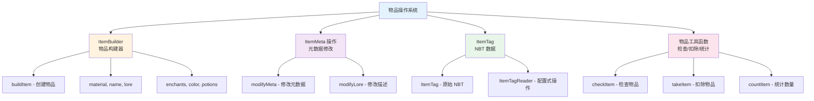

# 物品构建与操作

TabooLib 内置了一套完整的物品构建、编辑和 NBT 操作工具，涵盖了从基础物品构建到复杂 NBT 操作的全部功能。

**涉及模块：**
- `BUKKIT_ALL` - 物品构建和工具函数
- `NMS_UTIL` - NBT 操作（ItemTag）

## 核心概念解析

TabooLib 的物品操作系统由四个核心部分组成：



**关键概念：**
- **ItemBuilder**：DSL 风格的物品构建器，支持链式调用
- **ItemMeta 操作**：快速修改物品元数据（无需手动 get/set）
- **ItemTag**：跨版本的 NBT 操作封装，支持深度路径访问
- **工具函数**：简化背包物品的检查、扣除和统计操作

## 物品构建 (ItemBuilder)

ItemBuilder 是 TabooLib 提供的物品构建器，使用 DSL 风格让物品构建更加直观和简洁。

### 创建物品的三种方式

#### 方式一：从 XMaterial 创建

`XMaterial` 是 TabooLib 提供的跨版本材质类型，推荐使用。

```kotlin
val item = buildItem(XMaterial.APPLE) {
    name = "&d坏黑的大苹果"
    lore.add("&7这是一个坏黑的大苹果")
    colored()
}
```

**适用场景：** 需要跨版本兼容的物品创建

#### 方式二：从 Material 创建

直接使用 Bukkit 原生的 Material 类型。

```kotlin
val item = buildItem(Material.DIAMOND_SWORD) {
    name = "&b锋利的钻石剑"
    amount = 1
    colored()
}
```

**适用场景：** 不需要跨版本兼容，且确定材质名称的场景

#### 方式三：从现有物品创建

基于现有物品进行修改，保留原有属性。

```kotlin
val newItem = buildItem(existingItem) {
    // 在原有物品基础上修改
    name = "&e修改后的名称"
    lore.add("&7新增的描述")
    colored()
}
```

**适用场景：** 需要在现有物品基础上进行修改，例如给玩家物品添加标记

### 基础属性

ItemBuilder 提供了丰富的属性用于定义物品的基本信息：

| 属性名称 | 类型 | 说明 | 默认值 |
|---------|------|------|--------|
| material | Material | 物品材质 | - |
| amount | Int | 数量 | 1 |
| damage | Int | 附加值（损伤值） | 0 |
| name | String? | 展示名称 | null |
| itemName | String? | 物品名称（1.20.5+，不可被铁砧修改） | null |
| lore | MutableList\<String\> | 描述（Lore） | 空列表 |
| flags | MutableList\<ItemFlag\> | 物品标签 | 空列表 |
| enchants | MutableMap\<Enchantment, Int\> | 附魔 | 空映射 |
| isUnbreakable | Boolean | 无法破坏 | false |
| customModelData | Int | 自定义模型数据 | -1 |
| unique | Boolean | 唯一化（防止堆叠） | false |

**基础示例：**

```kotlin
val item = buildItem(XMaterial.DIAMOND_SWORD) {
    // 物品名称
    name = "&b&l传说之剑"

    // 物品描述
    lore.add("&7一把拥有神秘力量的剑")
    lore.add("&7传说中的武器")
    lore.add("")
    lore.add("&e左键攻击")

    // 数量
    amount = 1

    // 附魔
    enchants[Enchantment.DAMAGE_ALL] = 5
    enchants[Enchantment.FIRE_ASPECT] = 2

    // 无法破坏
    isUnbreakable = true

    // 隐藏附魔信息
    flags.add(ItemFlag.HIDE_ENCHANTS)

    // 上色（解析颜色代码）
    colored()
}
```

**代码说明：**
- `name`：物品的显示名称，支持颜色代码
- `lore`：物品的描述，每个元素是一行
- `enchants`：附魔映射，键为附魔类型，值为附魔等级
- `flags`：ItemFlag 用于隐藏特定信息（如附魔、属性等）
- `colored()`：解析 `&` 颜色代码，必须在设置 name/lore 后调用

### 特殊属性

除了基础属性，ItemBuilder 还支持各种特殊类型物品的专属属性：

#### 颜色（皮革盔甲、药水）

```kotlin
import org.bukkit.Color

val leatherArmor = buildItem(XMaterial.LEATHER_CHESTPLATE) {
    name = "&c红色皮甲"
    color = Color.RED
    colored()
}
```

**适用物品类型：**
- 皮革盔甲（`LEATHER_*`）
- 药水（`POTION`、`SPLASH_POTION`、`LINGERING_POTION`）

#### 药水效果

```kotlin
import org.bukkit.potion.PotionEffect
import org.bukkit.potion.PotionEffectType
import org.bukkit.potion.PotionData
import org.bukkit.potion.PotionType

val potion = buildItem(XMaterial.POTION) {
    name = "&d神奇药水"

    // 自定义药水效果
    potions.add(PotionEffect(PotionEffectType.SPEED, 600, 1))
    potions.add(PotionEffect(PotionEffectType.JUMP, 600, 1))

    // 基础药水类型（已过时，但仍可用）
    potionData = PotionData(PotionType.INSTANT_HEAL, false, true)

    // 药水颜色
    color = Color.PURPLE

    colored()
}
```

**代码说明：**
- `potions`：自定义药水效果列表
- `potionData`：基础药水类型（用于显示图标）
- `color`：药水颜色

#### 头颅

##### 玩家头颅

```kotlin
val playerHead = buildItem(XMaterial.PLAYER_HEAD) {
    name = "&6坏黑的头颅"
    skullOwner = "BadBlackBerry"
    colored()
}
```

##### 自定义材质头颅

需要依赖 `bukkit-xseries-skull` 模块：

```kotlin
val customHead = buildItem(XMaterial.PLAYER_HEAD) {
    name = "&a自定义头颅"
    skullTexture = SkullTexture("base64编码的材质字符串")
    colored()
}
```

**获取材质字符串：** 可以从 [minecraft-heads.com](https://minecraft-heads.com/) 等网站获取

#### 旗帜花纹

```kotlin
import org.bukkit.DyeColor
import org.bukkit.block.banner.Pattern
import org.bukkit.block.banner.PatternType

val banner = buildItem(XMaterial.WHITE_BANNER) {
    name = "&e自定义旗帜"

    patterns.add(Pattern(DyeColor.RED, PatternType.STRIPE_TOP))
    patterns.add(Pattern(DyeColor.BLUE, PatternType.STRIPE_BOTTOM))
    patterns.add(Pattern(DyeColor.YELLOW, PatternType.CIRCLE_MIDDLE))

    colored()
}
```

#### 刷怪蛋

```kotlin
import org.bukkit.entity.EntityType

val spawnEgg = buildItem(XMaterial.ZOMBIE_SPAWN_EGG) {
    name = "&c僵尸刷怪蛋"
    spawnType = EntityType.ZOMBIE
    colored()
}
```

#### 附魔书

附魔书会自动处理为 `EnchantmentStorageMeta`：

```kotlin
val enchantedBook = buildItem(XMaterial.ENCHANTED_BOOK) {
    name = "&5附魔书"

    // 附魔会自动存储为书本附魔
    enchants[Enchantment.PROTECTION_ENVIRONMENTAL] = 4
    enchants[Enchantment.MENDING] = 1

    colored()
}
```

### 便捷方法

ItemBuilder 提供了一些便捷方法简化常见操作：

#### colored() - 解析颜色代码

将 `&` 格式的颜色代码转换为 Minecraft 颜色。

```kotlin
buildItem(XMaterial.DIAMOND) {
    name = "&b&l钻石"
    lore.add("&7稀有的宝石")
    colored()  // 解析所有颜色代码
}
```

**重要提示：** `colored()` 必须在设置 `name` 和 `lore` 之后调用

#### shiny() - 使物品发光

为物品添加附魔光效，但隐藏附魔信息。

```kotlin
buildItem(XMaterial.STICK) {
    name = "&e魔法棒"
    shiny()  // 添加光效
}
```

**等价于：**
```kotlin
flags += ItemFlag.HIDE_ENCHANTS
enchants[Enchantment.LURE] = 1
```

#### hideAll() - 隐藏所有附加信息

隐藏所有物品标签信息（附魔、属性、无法破坏等）。

```kotlin
buildItem(XMaterial.DIAMOND_SWORD) {
    name = "&c神秘之剑"
    enchants[Enchantment.DAMAGE_ALL] = 10
    hideAll()  // 隐藏所有信息
}
```

**等价于：**
```kotlin
flags.addAll(ItemFlag.values())
```

#### unique() - 唯一化

使物品无法与其他物品堆叠，常用于菜单按钮。

```kotlin
buildItem(XMaterial.EMERALD) {
    name = "&a菜单按钮"
    unique()  // 防止堆叠
}
```

**原理：** 添加一个随机的属性修饰符，使每个物品都不同

**注意：** 在低版本（1.12 及以下）不可用

#### setMaterial() - 修改材质

支持使用 XMaterial 修改物品材质。

```kotlin
buildItem(XMaterial.STONE) {
    setMaterial(XMaterial.DIAMOND)  // 修改为钻石
    name = "&b钻石"
}
```

### 高级功能

#### originMeta - 保留原始元数据

当从现有物品创建时，`originMeta` 会保留原物品的所有元数据。

```kotlin
val item = buildItem(existingItem) {
    // originMeta 已自动设置为 existingItem 的 ItemMeta
    name = "&e修改名称"
    // 其他属性保持不变
}
```

#### finishing - 构建完成回调

在物品构建完成后执行额外的操作。

```kotlin
buildItem(XMaterial.DIAMOND_SWORD) {
    name = "&c终极之剑"

    finishing = { item ->
        // 在物品构建完成后执行
        item.addUnsafeEnchantment(Enchantment.DAMAGE_ALL, 100)
    }
}
```

**适用场景：** 需要在物品完全构建后进行特殊处理

### 1.20.5+ 新增功能

#### itemName - 物品名称

与 `name`（displayName）不同，`itemName` 不可被铁砧修改。

```kotlin
buildItem(XMaterial.DIAMOND_SWORD) {
    itemName = "&c传说之剑"  // 不可被铁砧修改
    name = "&e当前名称"      // 可被铁砧修改
}
```

#### tooltipStyle - 工具提示样式 (1.21.2+)

```kotlin
import org.bukkit.NamespacedKey

buildItem(XMaterial.DIAMOND) {
    tooltipStyle = NamespacedKey.minecraft("custom_style")
}
```

#### itemModel - 物品模型 (1.21.4+)

```kotlin
buildItem(XMaterial.STICK) {
    itemModel = NamespacedKey.minecraft("custom_model")
}
```

#### isHideTooltip - 隐藏工具提示

```kotlin
buildItem(XMaterial.BARRIER) {
    isHideTooltip = true  // 隐藏所有工具提示
}
```

## ItemMeta 操作

在 Bukkit 中，物品的职能通过 `ItemMeta` 进行拆分，比如可掉耐久的物品（`Damageable`）、书本（`BookMeta`）等都是 `ItemMeta` 的子类。

传统的修改方式需要先 `getItemMeta()`，修改后再 `setItemMeta()` 回去，而且得到的是副本，非常繁琐。

TabooLib 提供了 DSL 风格的 `modifyMeta` 和 `modifyLore` 方法，可以快速操作物品元数据。

### modifyMeta - 修改元数据

`modifyMeta` 允许你直接修改物品的 `ItemMeta`，无需手动获取和设置。

**函数签名：**
```kotlin
fun <T : ItemMeta> ItemStack.modifyMeta(func: T.() -> Unit): ItemStack
```

**基础示例：**

```kotlin
val item = ItemStack(Material.DIAMOND_SWORD)

// 修改耐久
item.modifyMeta<Damageable> {
    damage = 10
}
```

**代码说明：**
- 使用泛型 `<T : ItemMeta>` 指定 Meta 类型
- 在 lambda 中直接操作 Meta 属性
- 返回值为修改后的 ItemStack，支持链式调用

**常用 Meta 类型：**

| Meta 类型 | 适用物品 | 示例 |
|----------|---------|------|
| `Damageable` | 可掉耐久的工具/武器/盔甲 | 设置损坏值 |
| `BookMeta` | 书本 | 设置标题、作者、页面 |
| `SkullMeta` | 玩家头颅 | 设置头颅所有者 |
| `PotionMeta` | 药水 | 设置药水效果 |
| `LeatherArmorMeta` | 皮革盔甲 | 设置颜色 |
| `BannerMeta` | 旗帜 | 设置花纹 |
| `FireworkMeta` | 烟花 | 设置烟花效果 |
| `MapMeta` | 地图 | 设置地图信息 |

**进阶示例 - 书本：**

```kotlin
import org.bukkit.inventory.meta.BookMeta

val book = ItemStack(Material.WRITTEN_BOOK)

book.modifyMeta<BookMeta> {
    title = "我的书"
    author = "坏黑"
    addPage("第一页内容")
    addPage("第二页内容")
}
```

**进阶示例 - 皮革盔甲：**

```kotlin
import org.bukkit.Color
import org.bukkit.inventory.meta.LeatherArmorMeta

val armor = ItemStack(Material.LEATHER_CHESTPLATE)

armor.modifyMeta<LeatherArmorMeta> {
    setColor(Color.fromRGB(255, 0, 0))  // 红色
}
```

**链式调用：**

```kotlin
val item = ItemStack(Material.DIAMOND_SWORD)
    .modifyMeta<Damageable> { damage = 50 }
    .modifyLore { add("&c损坏的剑") }
```

### modifyLore - 修改描述

由于 Lore 是高频操作，TabooLib 将其单独提取为 `modifyLore` 方法。

**函数签名：**
```kotlin
fun ItemStack.modifyLore(func: MutableList<String>.() -> Unit): ItemStack
fun ItemMeta.modifyLore(func: MutableList<String>.() -> Unit): ItemMeta
```

**基础示例：**

```kotlin
val item = ItemStack(Material.DIAMOND)

item.modifyLore {
    add("&7这是一颗钻石")
    add("&7稀有的宝石")
    colored()
}
```

**常用操作：**

```kotlin
item.modifyLore {
    // 添加新行
    add("新的一行")

    // 添加多行
    addAll(listOf("第一行", "第二行", "第三行"))

    // 清空所有 Lore
    clear()

    // 插入到指定位置
    add(0, "插入到第一行")

    // 移除指定行
    removeAt(2)

    // 替换指定行
    set(1, "替换第二行")

    // 遍历修改
    indices.forEach { i ->
        this[i] = this[i].replace("旧文本", "新文本")
    }

    // 解析颜色代码
    colored()
}
```

**完整示例：**

```kotlin
val item = buildItem(XMaterial.DIAMOND_SWORD) {
    name = "&b传说之剑"
    colored()
}

// 后续添加 Lore
item.modifyLore {
    add("")
    add("&7▬▬▬▬▬▬▬▬▬▬▬▬▬▬▬▬▬▬▬▬▬▬▬▬▬")
    add("&7")
    add("&7伤害: &c+10")
    add("&7攻击速度: &a+15%")
    add("&7")
    add("&7▬▬▬▬▬▬▬▬▬▬▬▬▬▬▬▬▬▬▬▬▬▬▬▬▬")

    // 解析颜色
    indices.forEach { i ->
        this[i] = this[i].colored()
    }
}
```

### ItemMeta 辅助方法

除了 `modifyMeta` 和 `modifyLore`，TabooLib 还提供了一些辅助方法：

#### hasName - 检查名称

```kotlin
// 检查是否有名称
if (item.hasName()) {
    println("物品有名称")
}

// 检查是否包含特定文本
if (item.hasName("传说")) {
    println("物品名称包含'传说'")
}
```

#### hasLore - 检查描述

```kotlin
// 检查是否有描述
if (item.hasLore()) {
    println("物品有描述")
}

// 检查是否包含特定文本
if (item.hasLore("稀有")) {
    println("物品描述包含'稀有'")
}
```

#### replaceName - 替换名称

```kotlin
// 替换名称中的文本
item.replaceName("旧名称", "新名称")

// 批量替换
item.replaceName(mapOf(
    "{player}" to player.name,
    "{level}" to "100"
))
```

#### replaceLore - 替换描述

```kotlin
// 替换描述中的文本
item.replaceLore("旧文本", "新文本")

// 批量替换
item.replaceLore(mapOf(
    "{damage}" to "50",
    "{speed}" to "1.6"
))
```

**实战示例 - 动态物品：**

```kotlin
fun createPlayerWeapon(player: Player, level: Int): ItemStack {
    val damage = level * 5
    val speed = 1.0 + (level * 0.1)

    return buildItem(XMaterial.DIAMOND_SWORD) {
        name = "&6{player} 的武器 &8[&e等级 {level}&8]"
        lore.add("&7伤害: &c+{damage}")
        lore.add("&7攻击速度: &a{speed}")
        colored()
    }.replaceName(mapOf(
        "{player}" to player.name,
        "{level}" to level.toString()
    )).replaceLore(mapOf(
        "{damage}" to damage.toString(),
        "{speed}" to String.format("%.1f", speed)
    ))
}
```

## NBT 操作

TabooLib 对 NBT 进行了封装，提供了 `ItemTag` 类用于跨版本的 NBT 操作。本节作为入门教学，只介绍增删改查等基础操作。

### ItemTag 基础

`ItemTag` 是 TabooLib 对 Minecraft NBT 的封装，提供了类型安全的读写方法。

#### 获取 ItemTag

```kotlin
// 从物品获取 ItemTag
val itemTag = item.getItemTag()

// 获取时指定是否仅包含自定义数据（1.20.5+）
val itemTag = item.getItemTag(onlyCustom = true)
```

**参数说明：**
- `onlyCustom = true`（默认）：仅包含自定义 NBT 数据（1.20.5+ 有效）
- `onlyCustom = false`：包含物品的所有 NBT 数据（材质、数量等）

#### 基础操作

##### 读取数据

```kotlin
val itemTag = item.getItemTag()

// 获取数据
val data = itemTag["自定义节点"]

// 获取数据，不存在则返回默认值
val data = itemTag.getOrElse("自定义节点", ItemTagData("默认值"))
```

##### 写入数据

```kotlin
val itemTag = item.getItemTag()

// 写入数据
itemTag["自定义节点"] = "新的值"
itemTag["数字节点"] = 100
itemTag["布尔节点"] = true

// 保存到物品
itemTag.saveTo(item)
```

**重要提示：** 修改 ItemTag 后必须调用 `saveTo()` 才会生效

##### 删除数据

```kotlin
val itemTag = item.getItemTag()

// 删除数据
itemTag.remove("自定义节点")

// 保存到物品
itemTag.saveTo(item)
```

### 深度路径操作

ItemTag 支持使用 `.` 作为分层符，实现嵌套结构的深度访问。

#### 深度读取

```kotlin
val itemTag = item.getItemTag()

// 深度获取（支持多级路径）
val value = itemTag.getDeep("玩家数据.等级.当前等级")

// 深度获取，不存在则返回默认值
val value = itemTag.getDeepOrElse("玩家数据.等级.当前等级", ItemTagData(1))
```

**路径说明：**
- `"玩家数据.等级.当前等级"` 表示：`玩家数据` → `等级` → `当前等级`
- 每个 `.` 代表一层嵌套

#### 深度写入

```kotlin
val itemTag = item.getItemTag()

// 深度写入（自动创建不存在的路径）
itemTag.putDeep("玩家数据.等级.当前等级", 50)
itemTag.putDeep("玩家数据.等级.最大等级", 100)
itemTag.putDeep("玩家数据.名称", "坏黑")

// 保存到物品
itemTag.saveTo(item)
```

**自动创建路径：** 如果路径不存在，会自动创建所需的中间节点

#### 深度删除

```kotlin
val itemTag = item.getItemTag()

// 深度删除
itemTag.removeDeep("玩家数据.等级.当前等级")

// 保存到物品
itemTag.saveTo(item)
```

#### 数据类型转换

ItemTagData 提供了丰富的类型转换方法：

```kotlin
val itemTag = item.getItemTag()

// 字符串
val name = itemTag.getDeep("name")?.asString()

// 整数
val level = itemTag.getDeep("level")?.asInt()

// 双精度浮点数
val damage = itemTag.getDeep("damage")?.asDouble()

// 长整数
val timestamp = itemTag.getDeep("timestamp")?.asLong()

// 浮点数
val speed = itemTag.getDeep("speed")?.asFloat()

// 字节
val flag = itemTag.getDeep("flag")?.asByte()

// 列表
val list = itemTag.getDeep("items")?.asList()

// 复合标签
val compound = itemTag.getDeep("data")?.asCompound()
```

### ItemTagReader - 配置文件式操作

如果 NBT 节点数量多，使用 `ItemTag` 操作会略显繁琐。TabooLib 提供了 `ItemTagReader`，让你像操作配置文件一样操作 NBT。

#### 基础用法

```kotlin
item.itemTagReader {
    // 读取数据
    val name = getString("玩家数据.名称", "默认名称")
    val level = getInt("玩家数据.等级", 1)

    // 写入数据
    set("玩家数据.名称", "坏黑")
    set("玩家数据.等级", level + 1)
    set("玩家数据.经验", 1000)

    // 删除数据
    remove("旧数据")

    // 保存到物品（必须调用）
    write(item)
}
```

**代码说明：**
- 使用 `itemTagReader` DSL 进入操作环境
- 在 lambda 中进行读写操作
- **必须调用 `write(item)` 才会生效**

#### 读取方法

ItemTagReader 提供了类型安全的读取方法：

| 方法 | 返回类型 | 说明 |
|-----|---------|------|
| `getString(key, def)` | String | 获取字符串，支持默认值 |
| `getString(key)` | String? | 获取字符串，可能为 null |
| `getInt(key, def)` | Int | 获取整数 |
| `getInt(key)` | Int? | 获取整数，可能为 null |
| `getDouble(key, def)` | Double | 获取双精度浮点数 |
| `getDouble(key)` | Double? | 获取双精度浮点数，可能为 null |
| `getLong(key, def)` | Long | 获取长整数 |
| `getLong(key)` | Long? | 获取长整数，可能为 null |
| `getFloat(key, def)` | Float | 获取浮点数 |
| `getFloat(key)` | Float? | 获取浮点数，可能为 null |
| `getByte(key, def)` | Byte | 获取字节 |
| `getByte(key)` | Byte? | 获取字节，可能为 null |
| `getBoolean(key, def)` | Boolean | 获取布尔值 |
| `getBoolean(key)` | Boolean | 获取布尔值（默认 false） |
| `getUUID(key, def)` | UUID | 获取 UUID |
| `getUUID(key)` | UUID? | 获取 UUID，可能为 null |
| `getStringList(key)` | List\<String\> | 获取字符串列表 |
| `getDoubleList(key)` | List\<Double\> | 获取双精度浮点数列表 |

#### 写入方法

```kotlin
item.itemTagReader {
    // 基础类型
    set("name", "坏黑")
    set("level", 100)
    set("damage", 50.5)
    set("enabled", true)
    set("uuid", UUID.randomUUID())

    // 删除（写入 null）
    set("oldData", null)

    // 批量写入
    putAll(mapOf(
        "key1" to "value1",
        "key2" to 123,
        "key3" to true
    ))

    // 保存
    write(item)
}
```

#### 辅助方法

```kotlin
item.itemTagReader {
    // 获取所有键
    val keys = getKeys()
    val subKeys = getKeys("玩家数据")

    // 检查键是否存在
    if (containsKey("level")) {
        println("等级数据存在")
    }

    // 转换为 JSON
    val json = toJson()
    val formattedJson = formatJson()

    // 从 JSON 加载
    loadFormJson("""{"name":"坏黑","level":100}""")

    // 保存
    write(item)
}
```

### JSON 序列化

ItemTag 支持与 JSON 格式互相转换，方便数据存储和传输。

#### 物品转 JSON

```kotlin
// 转为 JSON 字符串（包含所有 NBT）
val json = ItemTag.toJson(item)

// 从 ItemTag 转为 JSON
val itemTag = item.getItemTag()
val json = itemTag.toJson()

// 格式化的 JSON
val formattedJson = itemTag.toJsonFormatted()
```

#### JSON 转物品

```kotlin
// 从 JSON 创建物品（1.20.5+ 需要包含材质等信息）
val item = ItemTag.toItem(json)

// 从 JSON 创建 ItemTag
val itemTag = ItemTag.fromJson(json)

// 应用到现有物品
itemTag.saveTo(existingItem)
```

### 实战示例

#### 示例 1：玩家绑定物品

```kotlin
fun bindItemToPlayer(item: ItemStack, player: Player) {
    item.itemTagReader {
        set("绑定数据.玩家UUID", player.uniqueId)
        set("绑定数据.玩家名称", player.name)
        set("绑定数据.绑定时间", System.currentTimeMillis())
        write(item)
    }
}

fun isItemBound(item: ItemStack, player: Player): Boolean {
    var isBound = false
    item.itemTagReader {
        val boundUUID = getUUID("绑定数据.玩家UUID")
        isBound = boundUUID == player.uniqueId
    }
    return isBound
}
```

#### 示例 2：物品等级系统

```kotlin
fun getItemLevel(item: ItemStack): Int {
    var level = 0
    item.itemTagReader {
        level = getInt("物品数据.等级", 1)
    }
    return level
}

fun upgradeItem(item: ItemStack) {
    item.itemTagReader {
        val currentLevel = getInt("物品数据.等级", 1)
        val newLevel = currentLevel + 1

        set("物品数据.等级", newLevel)
        set("物品数据.升级次数", getInt("物品数据.升级次数", 0) + 1)
        set("物品数据.最后升级时间", System.currentTimeMillis())

        write(item)
    }

    // 更新物品显示
    item.modifyLore {
        clear()
        add("&7等级: &e${getItemLevel(item)}")
        colored()
    }
}
```

#### 示例 3：物品使用次数限制

```kotlin
fun checkItemUsage(item: ItemStack): Boolean {
    var canUse = false
    item.itemTagReader {
        val maxUses = getInt("限制.最大使用次数", 10)
        val currentUses = getInt("限制.当前使用次数", 0)

        if (currentUses < maxUses) {
            set("限制.当前使用次数", currentUses + 1)
            write(item)
            canUse = true
        }
    }
    return canUse
}

fun getItemUsageInfo(item: ItemStack): Pair<Int, Int> {
    var info = Pair(0, 0)
    item.itemTagReader {
        val current = getInt("限制.当前使用次数", 0)
        val max = getInt("限制.最大使用次数", 10)
        info = Pair(current, max)
    }
    return info
}
```

## 书本构建

BookBuilder 是 ItemBuilder 的扩展类，专门用于构建和发送书本物品。它继承了 ItemBuilder 的所有功能，并添加了书本特有的属性和方法。

### 基本用法

TabooLib 提供了两种创建书本的方式：

```kotlin
// 方式 1：直接构建书本
val book = buildBook {
    title = "我的书"
    author = "玩家名"
    write("第一页的内容")
    write("第二页的内容")
}

// 方式 2：构建并直接发送给玩家
player.sendBook {
    title = "欢迎指南"
    author = "服务器"
    write("欢迎来到服务器！")
}
```

### 书本属性

BookBuilder 提供了以下专属属性：

| 属性 | 类型 | 默认值 | 说明 |
|------|------|--------|------|
| `title` | String | "untitled" | 书本标题 |
| `author` | String | "untitled" | 书本作者 |
| `bookPages` | ArrayList\<Text\> | 空列表 | 书本页面列表 |

```kotlin
val book = buildBook {
    title = "神秘日记"
    author = "未知作者"
    // 继承 ItemBuilder 的所有属性
    lore += listOf(
        "&7一本神秘的日记",
        "&7记录着古老的秘密"
    )
    colored()
}
```

### 页面写入方法

BookBuilder 提供了多种写入页面的方法，支持纯文本、富文本和 JSON 格式。

#### 1. write(text: String)

写入普通文本页面，支持颜色代码和换行符：

```kotlin
buildBook {
    title = "色彩测试"
    author = "测试员"

    // 写入带颜色的文本
    write("&c红色文本\n&a绿色文本\n&9蓝色文本")

    // 写入多页
    write("第二页")
    write("第三页")
}
```

#### 2. write(text: Source)

写入 Source 对象（TabooLib 文本组件），自动转换为富文本格式：

```kotlin
buildBook {
    title = "富文本书本"
    author = "系统"

    // 使用 Source 创建富文本页面
    write(Source.text("点击此处") {
        clickCommand("/help")
        hoverText("执行 /help 命令")
        color(NamedTextColor.GOLD)
    })
}
```

#### 3. write(text: RawMessage)

写入 RawMessage 对象（TabooLib 的 JSON 文本构建器）：

```kotlin
buildBook {
    title = "交互式书本"
    author = "管理员"

    // 使用 RawMessage 创建复杂交互
    write(RawMessage().also {
        it.append("§e点击这里").clickCommand("/spawn").hoverText("§7传送到主城")
        it.newLine()
        it.append("§a访问官网").clickOpenURL("https://example.com").hoverText("§7打开浏览器")
    })
}
```

#### 4. writeRaw(text: String)

直接写入原始 JSON 文本，适用于高级用户：

```kotlin
buildBook {
    title = "原始 JSON"
    author = "开发者"

    // 直接写入 JSON 格式的页面
    writeRaw("""
        {
            "text": "点击此处",
            "color": "gold",
            "clickEvent": {
                "action": "run_command",
                "value": "/help"
            },
            "hoverEvent": {
                "action": "show_text",
                "value": "执行帮助命令"
            }
        }
    """.trimIndent())
}
```

### 发送书本

TabooLib 提供了便捷的方法将书本发送给玩家，玩家会立即打开书本界面。

#### Player.sendBook(book: ItemStack)

发送已构建的书本：

```kotlin
val book = buildBook {
    title = "新手指南"
    author = "服务器"
    write("欢迎来到服务器！")
    write("这是第二页的内容")
}

player.sendBook(book)
```

#### Player.sendBook(builder: BookBuilder.() -> Unit)

构建并发送书本（推荐使用）：

```kotlin
player.sendBook {
    title = "动态内容"
    author = "系统"

    write("玩家: ${player.name}")
    write("等级: ${player.level}")
    write("金币: ${getPlayerMoney(player)}")
}
```

### 完整示例

#### 示例 1：新手教程书

```kotlin
fun sendTutorialBook(player: Player) {
    player.sendBook {
        title = "新手教程"
        author = "服务器团队"

        // 第一页：欢迎页
        write("""
            &6&l欢迎来到服务器！

            &7这本书将引导你
            &7了解基本操作

            &e点击下一页继续
        """.trimIndent())

        // 第二页：基础命令
        write(RawMessage().also {
            it.append("§6§l基础命令\n\n")
            it.append("§e/spawn §7- ").clickCommand("/spawn").hoverText("§a点击执行")
            it.append("回到主城\n")
            it.append("§e/help §7- ").clickCommand("/help").hoverText("§a点击执行")
            it.append("查看帮助\n")
            it.append("§e/tpa §7- ").clickCommand("/tpa ").hoverText("§a点击填充")
            it.append("传送请求")
        })

        // 第三页：规则说明
        write("""
            &6&l服务器规则

            &c1. 禁止使用外挂
            &c2. 禁止恶意破坏
            &c3. 尊重其他玩家

            &a遵守规则，快乐游戏！
        """.trimIndent())

        // 第四页：联系方式
        write(RawMessage().also {
            it.append("§6§l需要帮助？\n\n")
            it.append("§7官方网站：\n")
            it.append("§bexample.com").clickOpenURL("https://example.com").hoverText("§a点击访问")
            it.newLine().newLine()
            it.append("§7Discord：\n")
            it.append("§bdiscord.gg/xxx").clickOpenURL("https://discord.gg/xxx").hoverText("§a点击加入")
        })
    }
}
```

#### 示例 2：动态任务书

```kotlin
fun sendQuestBook(player: Player, questData: QuestData) {
    player.sendBook {
        title = "任务详情"
        author = "任务系统"

        // 第一页：任务概览
        write("""
            &6&l${questData.name}

            &7任务类型：&e${questData.type}
            &7难度：${getDifficultyColor(questData.difficulty)}${questData.difficulty}
            &7奖励：&a${questData.reward}金币
        """.trimIndent())

        // 第二页：任务描述
        write(questData.description)

        // 第三页：任务目标（动态生成）
        write(RawMessage().also { msg ->
            msg.append("§6§l任务目标\n\n")
            questData.objectives.forEach { objective ->
                val status = if (objective.completed) "§a✓" else "§c✗"
                msg.append("$status §7${objective.name}\n")
                msg.append("  §8进度: §e${objective.current}§7/§e${objective.required}\n")
            }
        })

        // 第四页：操作按钮
        write(RawMessage().also {
            it.append("\n\n\n")
            it.append("      §a§l[接受任务]").clickCommand("/quest accept ${questData.id}").hoverText("§7点击接受任务")
            it.newLine().newLine()
            it.append("      §c§l[放弃任务]").clickCommand("/quest abandon ${questData.id}").hoverText("§7点击放弃任务")
        })
    }
}

data class QuestData(
    val id: String,
    val name: String,
    val type: String,
    val difficulty: String,
    val reward: Int,
    val description: String,
    val objectives: List<Objective>
)

data class Objective(
    val name: String,
    val current: Int,
    val required: Int,
    val completed: Boolean
)
```

#### 示例 3：商店目录书

```kotlin
fun sendShopCatalog(player: Player, shopItems: List<ShopItem>) {
    player.sendBook {
        title = "商店目录"
        author = "商店系统"

        // 第一页：封面
        write("""
            &6&l═════════════
            &6&l  商店目录
            &6&l═════════════

            &7共有 &e${shopItems.size} &7件商品

            &e点击下一页浏览
        """.trimIndent())

        // 动态生成商品页面（每页显示 3 件商品）
        shopItems.chunked(3).forEach { pageItems ->
            write(RawMessage().also { msg ->
                pageItems.forEach { item ->
                    msg.append("§6● §e${item.name}\n")
                    msg.append("  §7价格: §a${item.price}金币\n")
                    msg.append("  §b[点击购买]")
                        .clickCommand("/shop buy ${item.id}")
                        .hoverText("§7点击购买 ${item.name}\n§7价格: §a${item.price}金币")
                    msg.append("\n\n")
                }
            })
        }

        // 最后一页：退出提示
        write("""
            &6&l感谢光临！

            &7使用 &e/shop &7命令
            &7可以随时打开商店
        """.trimIndent())
    }
}

data class ShopItem(
    val id: String,
    val name: String,
    val price: Int
)
```

### 注意事项

1. **版本兼容性**：`sendBook` 方法在不同版本的 Minecraft 中使用不同的实现方式，TabooLib 会自动处理兼容性问题

2. **页面长度**：每页书本的文本长度有限制（约 256 个字符），超出部分会被截断

3. **颜色代码**：使用 `write(String)` 时可以使用 `&` 颜色代码，但使用 `writeRaw` 时需要使用 JSON 格式的颜色定义

4. **交互限制**：书本中的点击事件仅支持 `run_command`、`suggest_command` 和 `open_url` 等基本操作

5. **自动转换**：使用 `write(Source)` 或 `write(RawMessage)` 时，TabooLib 会自动将对象转换为书本可用的 JSON 格式

## 背包工具函数

TabooLib 提供了一组实用的背包操作函数，用于检查、移除和统计背包中的物品。这些函数支持灵活的匹配规则，可以处理各种复杂的物品检查需求。

### 核心函数概览

| 函数 | 作用对象 | 主要功能 | 返回值 |
|------|---------|---------|--------|
| `checkItem` | Player / Inventory | 检查并可选移除特定物品 | Boolean |
| `hasItem` | Inventory | 检查是否有符合条件的物品 | Boolean |
| `takeItem` | Inventory | 移除符合条件的物品 | Boolean |
| `countItem` | Inventory | 统计符合条件的物品数量 | Int |

### checkItem - 检查特定物品

检查背包中是否有足够数量的特定物品，并可选择是否移除。

#### Player.checkItem

```kotlin
fun Player.checkItem(
    item: ItemStack,      // 要检查的物品
    amount: Int = 1,      // 检查数量，默认 1
    remove: Boolean = false // 是否移除，默认 false
): Boolean
```

**使用示例**：

```kotlin
// 示例 1：检查玩家是否有钻石
val diamond = buildItem(XMaterial.DIAMOND)
if (player.checkItem(diamond, 10)) {
    player.sendMessage("你拥有至少 10 个钻石")
}

// 示例 2：检查并消耗物品
if (player.checkItem(diamond, 5, remove = true)) {
    player.sendMessage("已消耗 5 个钻石")
    // 执行后续操作...
} else {
    player.sendMessage("钻石不足！需要 5 个钻石")
}

// 示例 3：检查特定 NBT 物品
val specialKey = buildItem(XMaterial.TRIPWIRE_HOOK) {
    name = "&6神秘钥匙"
    lore += "&7可以打开神秘宝箱"
    colored()
}

if (player.checkItem(specialKey, 1, remove = true)) {
    openMysteryChest(player)
} else {
    player.sendMessage("&c你需要一把神秘钥匙！")
}
```

#### Inventory.checkItem

```kotlin
fun Inventory.checkItem(
    item: ItemStack,
    amount: Int = 1,
    remove: Boolean = false
): Boolean
```

**使用示例**：

```kotlin
// 检查箱子中的物品
val chest = block.state as Chest
val requiredItem = buildItem(XMaterial.GOLD_INGOT)

if (chest.inventory.checkItem(requiredItem, 64, remove = true)) {
    println("已从箱子中移除 64 个金锭")
}
```

### hasItem - 自定义匹配检查

使用自定义匹配器检查背包中是否有符合条件的物品。

```kotlin
fun Inventory.hasItem(
    amount: Int = 1,                                  // 需要的数量
    matcher: (itemStack: ItemStack) -> Boolean        // 匹配规则
): Boolean
```

**使用示例**：

```kotlin
// 示例 1：检查是否有任意附魔的剑
val hasEnchantedSword = player.inventory.hasItem(1) { item ->
    item.type.name.endsWith("_SWORD") && item.enchantments.isNotEmpty()
}

// 示例 2：检查是否有特定 Lore 的物品
val hasVIPItem = player.inventory.hasItem(1) { item ->
    item.hasLore("&6VIP 专属")
}

// 示例 3：检查是否有高耐久度的物品
val hasDurableItem = player.inventory.hasItem(1) { item ->
    val meta = item.itemMeta as? Damageable ?: return@hasItem false
    val maxDurability = item.type.maxDurability.toInt()
    val damage = meta.damage
    val durability = maxDurability - damage
    durability > maxDurability * 0.8  // 耐久度大于 80%
}

// 示例 4：检查是否有带特定 NBT 的物品
val hasBindItem = player.inventory.hasItem(1) { item ->
    item.getItemTag()["PlayerBind"]?.asString() == player.name
}

// 示例 5：检查是否有足够数量的宝石（不同类型累加）
val gemTypes = listOf("EMERALD", "DIAMOND", "RUBY")
val hasEnoughGems = player.inventory.hasItem(10) { item ->
    gemTypes.any { item.type.name.contains(it) }
}
```

### takeItem - 移除物品

从背包中移除符合条件的物品，并可选记录被移除的物品列表。

```kotlin
fun Inventory.takeItem(
    amount: Int = 1,                                  // 要移除的数量
    takeList: MutableList<ItemStack> = mutableListOf(), // 记录被移除的物品
    matcher: (itemStack: ItemStack) -> Boolean        // 匹配规则
): Boolean
```

**使用示例**：

```kotlin
// 示例 1：移除所有剑类物品
val removedSwords = mutableListOf<ItemStack>()
val success = player.inventory.takeItem(
    amount = Int.MAX_VALUE,  // 移除所有匹配的物品
    takeList = removedSwords
) { item ->
    item.type.name.endsWith("_SWORD")
}

if (success) {
    player.sendMessage("已移除 ${removedSwords.sumOf { it.amount }} 把剑")
}

// 示例 2：移除并返回特定数量的物品
val takenItems = mutableListOf<ItemStack>()
if (player.inventory.takeItem(
    amount = 5,
    takeList = takenItems
) { it.type == XMaterial.DIAMOND.parseMaterial() }) {

    // 对移除的物品进行处理
    takenItems.forEach { item ->
        println("移除了 ${item.amount} 个 ${item.type}")
    }
}

// 示例 3：移除玩家绑定的物品
val bindItems = mutableListOf<ItemStack>()
player.inventory.takeItem(
    amount = Int.MAX_VALUE,
    takeList = bindItems
) { item ->
    item.getItemTag()["PlayerBind"]?.asString() == player.name
}

// 示例 4：移除并记录高级材料
val materials = mutableListOf<ItemStack>()
val rareMaterials = listOf("NETHERITE", "DIAMOND", "EMERALD")

player.inventory.takeItem(
    amount = 10,
    takeList = materials
) { item ->
    rareMaterials.any { rare -> item.type.name.contains(rare) }
}

// 将移除的物品存入数据库或其他容器
materials.forEach { saveMaterialToStorage(it) }
```

### countItem - 统计物品数量

统计背包中符合条件的物品总数量。

```kotlin
fun Inventory.countItem(
    matcher: (itemStack: ItemStack) -> Boolean        // 匹配规则
): Int
```

**使用示例**：

```kotlin
// 示例 1：统计所有工具的数量
val toolCount = player.inventory.countItem { item ->
    item.type.name.endsWith("_PICKAXE") ||
    item.type.name.endsWith("_AXE") ||
    item.type.name.endsWith("_SHOVEL") ||
    item.type.name.endsWith("_HOE")
}
player.sendMessage("你拥有 $toolCount 个工具")

// 示例 2：统计所有附魔物品的数量
val enchantedCount = player.inventory.countItem { item ->
    item.enchantments.isNotEmpty()
}

// 示例 3：统计特定 Lore 物品的数量
val vipItemCount = player.inventory.countItem { item ->
    item.hasLore("&6VIP")
}

// 示例 4：统计所有可修复物品的数量（耐久度 < 50%）
val damagedCount = player.inventory.countItem { item ->
    val meta = item.itemMeta as? Damageable ?: return@countItem false
    val maxDurability = item.type.maxDurability.toInt()
    if (maxDurability == 0) return@countItem false

    val damage = meta.damage
    val durability = maxDurability - damage
    durability < maxDurability * 0.5
}

// 示例 5：统计特定等级范围的物品
val highLevelItems = player.inventory.countItem { item ->
    val level = item.getItemTag()["物品数据.等级"]?.asInt() ?: 0
    level >= 10
}
player.sendMessage("你拥有 $highLevelItems 个 10 级以上的物品")
```

### 组合使用示例

这些工具函数可以组合使用，实现更复杂的背包管理逻辑。

#### 示例 1：背包整理系统

```kotlin
fun organizeInventory(player: Player) {
    val inventory = player.inventory

    // 1. 统计各类物品数量
    val weaponCount = inventory.countItem { it.type.name.endsWith("_SWORD") }
    val armorCount = inventory.countItem { it.type.name.contains("HELMET") ||
                                           it.type.name.contains("CHESTPLATE") ||
                                           it.type.name.contains("LEGGINGS") ||
                                           it.type.name.contains("BOOTS") }
    val toolCount = inventory.countItem { it.type.name.endsWith("_PICKAXE") ||
                                          it.type.name.endsWith("_AXE") }

    // 2. 检查是否有损坏的物品需要修复
    val needRepair = inventory.hasItem(1) { item ->
        val meta = item.itemMeta as? Damageable ?: return@hasItem false
        meta.damage > 0
    }

    // 3. 移除所有已损坏且无价值的物品
    val removedItems = mutableListOf<ItemStack>()
    inventory.takeItem(Int.MAX_VALUE, removedItems) { item ->
        val meta = item.itemMeta as? Damageable ?: return@takeItem false
        val maxDurability = item.type.maxDurability.toInt()
        if (maxDurability == 0) return@takeItem false

        val durability = maxDurability - meta.damage
        // 移除耐久度低于 10% 且没有附魔的物品
        durability < maxDurability * 0.1 && item.enchantments.isEmpty()
    }

    // 4. 显示整理结果
    player.sendMessage("&6&l背包整理完成！")
    player.sendMessage("&7武器: &e$weaponCount &7护甲: &e$armorCount &7工具: &e$toolCount")
    if (removedItems.isNotEmpty()) {
        player.sendMessage("&7已清理 &c${removedItems.sumOf { it.amount }} &7件损坏物品")
    }
    if (needRepair) {
        player.sendMessage("&e提示: 你有物品需要修复")
    }
}
```

#### 示例 2：交易验证系统

```kotlin
fun validateTrade(player: Player, requiredItems: List<TradeItem>): Boolean {
    val inventory = player.inventory

    // 检查所有必需物品
    for (required in requiredItems) {
        val hasEnough = when (required.matchType) {
            MatchType.EXACT -> {
                // 精确匹配（包括 NBT、Lore 等）
                inventory.checkItem(required.template, required.amount)
            }
            MatchType.TYPE_ONLY -> {
                // 仅匹配物品类型
                inventory.hasItem(required.amount) { it.type == required.template.type }
            }
            MatchType.CUSTOM -> {
                // 自定义匹配器
                inventory.hasItem(required.amount, required.matcher!!)
            }
        }

        if (!hasEnough) {
            player.sendMessage("&c缺少物品: ${required.displayName}")
            return false
        }
    }

    return true
}

fun executeTrade(player: Player, requiredItems: List<TradeItem>, rewards: List<ItemStack>) {
    if (!validateTrade(player, requiredItems)) {
        return
    }

    // 移除所有必需物品
    for (required in requiredItems) {
        val taken = mutableListOf<ItemStack>()
        when (required.matchType) {
            MatchType.EXACT -> {
                player.inventory.checkItem(required.template, required.amount, remove = true)
            }
            MatchType.TYPE_ONLY -> {
                player.inventory.takeItem(required.amount, taken) {
                    it.type == required.template.type
                }
            }
            MatchType.CUSTOM -> {
                player.inventory.takeItem(required.amount, taken, required.matcher!!)
            }
        }
    }

    // 给予奖励
    rewards.forEach { reward ->
        player.inventory.addItem(reward)
    }

    player.sendMessage("&a交易成功！")
}

data class TradeItem(
    val template: ItemStack,
    val amount: Int,
    val matchType: MatchType,
    val displayName: String,
    val matcher: ((ItemStack) -> Boolean)? = null
)

enum class MatchType {
    EXACT,        // 精确匹配
    TYPE_ONLY,    // 仅类型匹配
    CUSTOM        // 自定义匹配
}
```

#### 示例 3：背包限制系统

```kotlin
fun checkInventoryLimits(player: Player): List<String> {
    val warnings = mutableListOf<String>()
    val inventory = player.inventory

    // 1. 检查武器数量限制
    val weaponCount = inventory.countItem { it.type.name.endsWith("_SWORD") }
    if (weaponCount > 5) {
        warnings.add("武器数量超限！当前: $weaponCount/5")

        // 移除多余的普通武器（保留附魔武器）
        val excessCount = weaponCount - 5
        inventory.takeItem(excessCount) { item ->
            item.type.name.endsWith("_SWORD") && item.enchantments.isEmpty()
        }
    }

    // 2. 检查是否携带违禁物品
    val bannedItems = listOf("TNT", "BEDROCK", "COMMAND_BLOCK")
    val hasBanned = inventory.hasItem(1) { item ->
        bannedItems.any { banned -> item.type.name.contains(banned) }
    }

    if (hasBanned) {
        warnings.add("检测到违禁物品！")

        // 移除所有违禁物品
        val removed = mutableListOf<ItemStack>()
        inventory.takeItem(Int.MAX_VALUE, removed) { item ->
            bannedItems.any { banned -> item.type.name.contains(banned) }
        }

        removed.forEach { item ->
            warnings.add("已移除: ${item.type.name} x${item.amount}")
        }
    }

    // 3. 检查绑定物品是否属于该玩家
    val illegalBindItems = mutableListOf<ItemStack>()
    inventory.takeItem(Int.MAX_VALUE, illegalBindItems) { item ->
        val bindPlayer = item.getItemTag()["PlayerBind"]?.asString()
        bindPlayer != null && bindPlayer != player.name
    }

    if (illegalBindItems.isNotEmpty()) {
        warnings.add("检测到非法绑定物品！已移除 ${illegalBindItems.size} 件")
    }

    return warnings
}

// 定期检查
fun startInventoryMonitor(player: Player) {
    // 使用 TabooLib 的调度器每 30 秒检查一次
    val warnings = checkInventoryLimits(player)
    if (warnings.isNotEmpty()) {
        player.sendMessage("&c&l背包警告：")
        warnings.forEach { player.sendMessage("&7- $it") }
    }
}
```

### 注意事项

1. **空气检查**：`checkItem` 函数会在物品为空气时抛出异常，使用前需确保物品不为空

2. **数量计算**：所有函数都会累加匹配物品的数量，例如背包中有 2 组 32 个钻石，总数为 64

3. **匹配器性能**：使用自定义匹配器时，避免在匹配器中执行耗时操作，因为它会对背包中的每个物品执行

4. **移除顺序**：`takeItem` 按照背包槽位顺序移除物品，先移除的槽位会优先清空

5. **返回值**：
   - `checkItem` / `hasItem`：当找到足够数量时返回 `true`
   - `takeItem`：当成功移除至少一个物品时返回 `true`
   - `countItem`：返回匹配物品的总数量

6. **物品比较**：
   - `checkItem` 使用 `isSimilar` 比较物品，会检查类型、数据、NBT、附魔等
   - 自定义匹配器可以实现任意复杂的比较逻辑

7. **线程安全**：这些函数不是线程安全的，在异步环境中操作背包时需要切换到主线程
