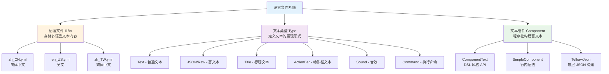
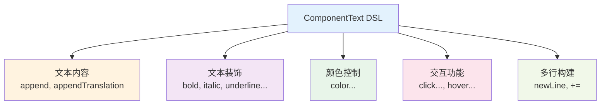

# 语言文件与文本组件

Language 模块是 TabooLib 提供的国际化（I18n）解决方案，支持多语言文本管理、富文本交互和动态文本组件。

## 核心概念解析

Language 模块由三个核心功能组成：



**关键概念：**
- **语言文件**：YAML 格式的多语言文本配置
- **语言节点**：语言文件中的键（key），用于引用文本
- **文本类型**：定义文本的展现方式（普通/富文本/标题等）
- **文本组件**：通过代码动态构建富文本

## 语言文件基础

### 文件结构

语言文件采用扁平化的 YAML 结构，存放在 `lang/` 目录下：

```
插件目录/
└── lang/
    ├── zh_CN.yml    # 简体中文
    ├── en_US.yml    # 英文
    └── zh_TW.yml    # 繁体中文
```

**语言代码标准：**
- `zh_CN`：简体中文
- `zh_TW`：繁体中文
- `en_US`：英文
- `ja_JP`：日文
- `ko_KR`：韩文

### 基础语法

#### 单行文本

```yaml
welcome: '欢迎来到服务器！'
goodbye: '再见，{0}！'
level-up: '恭喜你升级到 {0} 级！'
```

**代码说明：**
- 键值对格式：`节点名: '文本内容'`
- 使用 `{0}`、`{1}` 等占位符表示参数
- 文本内容需要用单引号包裹

#### 多行文本

```yaml
server-info:
  - '服务器名称：TabooLib 测试服'
  - '在线人数：{0}/{1}'
  - '运行时间：{2} 天'

rules:
  - '1. 不要破坏公共建筑'
  - '2. 不要恶意 PVP'
  - '3. 尊重其他玩家'
```

**代码说明：**
- 使用列表格式表示多行文本
- 每行前添加 `-` 符号
- 发送时自动换行

**注意事项：** 语言文件必须使用扁平化结构，不允许嵌套对象：

```yaml
# ✅ 正确 - 扁平化结构
ui-title: '商店'
ui-apple-name: '苹果'
ui-apple-lore: '一个新鲜的苹果'

# ❌ 错误 - 嵌套结构（不支持）
ui:
  title: '商店'
  apple:
    name: '苹果'
    lore: '一个新鲜的苹果'
```

### 参数替换

语言文本支持使用占位符传递动态参数：

```yaml
player-join: '玩家 {0} 加入了游戏'
player-money: '你的金币：{0}'
transfer-success: '你向 {0} 转账了 {1} 金币'
```

**使用方式：**

```kotlin
// 单个参数
player.sendLang("player-join", player.name)

// 多个参数
player.sendLang("transfer-success", targetPlayer.name, 100)
```

**执行效果：**
```
玩家 Steve 加入了游戏
你向 Alex 转账了 100 金币
```

### 颜色代码

语言文件支持 Minecraft 颜色代码：

```yaml
colored-text: '&a绿色文本 &b蓝色文本 &c红色文本'
gradient-text: '&x&f&f&0&0&0&0渐变色文本'
formatted-text: '&l&n加粗下划线'
```

**支持的颜色代码：**
- `&0` - `&9`、`&a` - `&f`：基础颜色
- `&l`：加粗
- `&m`：删除线
- `&n`：下划线
- `&o`：斜体
- `&k`：模糊
- `&r`：重置格式

### 基础使用示例

#### 定义语言文件

创建 `lang/zh_CN.yml`：

```yaml
# 基础消息
welcome-message: '&a欢迎 {0} 来到服务器！'
goodbye-message: '&c{0} 离开了服务器'

# 错误消息
error-no-permission: '&c你没有权限执行此操作'
error-player-not-found: '&c玩家 {0} 不在线'

# 成功消息
success-teleport: '&a传送成功！'
success-money-add: '&a你获得了 {0} 金币'

# 多行消息
help-message:
  - '&8[&3帮助&8] &7可用命令列表'
  - '&7/shop open - 打开商店'
  - '&7/shop buy <物品> - 购买物品'
  - '&7/shop sell <物品> - 出售物品'
```

#### 代码中使用

```kotlin
// 向玩家发送语言消息
@EventHandler
fun onPlayerJoin(event: PlayerJoinEvent) {
    val player = event.player

    // 发送单行消息（带参数）
    player.sendLang("welcome-message", player.name)

    // 发送多行消息
    player.sendLang("help-message")
}

// 在命令中使用
@CommandBody
val shop = subCommand {
    execute<Player> { sender, _, _ ->
        if (!sender.hasPermission("shop.use")) {
            sender.sendLang("error-no-permission")
            return@execute
        }

        // 打开商店逻辑...
        sender.sendLang("success-teleport")
    }
}
```

### 获取语言文本

除了直接发送，还可以获取语言文本用于其他用途：

```kotlin
// 获取单行文本
val title = player.asLangText("ui-title")
val itemName = player.asLangText("item-apple-name", "苹果")

// 获取多行文本
val lore = player.asLangTextList("item-apple-lore")

// 在菜单中使用
player.openMenu<Chest>(player.asLangText("shop-title")) {
    set('A', buildItem(XMaterial.APPLE) {
        name = player.asLangText("shop-apple-name")
        lore.addAll(player.asLangTextList("shop-apple-lore"))
        colored()
    })
}
```

**常用方法：**
- `sendLang(节点, 参数...)`：发送语言消息
- `asLangText(节点, 参数...)`：获取单行文本
- `asLangTextOrNull(节点, 参数...)`：获取文本（可能为 null）
- `asLangTextList(节点, 参数...)`：获取多行文本列表

### 设置语言

#### 设置玩家语言

通过事件监听器自定义玩家使用的语言：

```kotlin
@SubscribeEvent
fun onSelectLocale(event: PlayerSelectLocaleEvent) {
    // 从配置文件读取
    event.locale = config.getString("Lang", "zh_CN")!!

    // 或根据玩家客户端语言
    // event.locale 默认会自动读取玩家的客户端语言设置
}
```

#### 设置系统语言

控制台和系统消息使用的语言：

```kotlin
@SubscribeEvent
fun onSelectLocale(event: SystemSelectLocaleEvent) {
    event.locale = config.getString("Lang", "zh_CN")!!
}
```

**适用场景：**
- 强制所有玩家使用指定语言
- 根据玩家数据库设置个性化语言
- 提供语言切换命令

## 富文本与交互

### 复合文本模式

复合文本允许一个语言节点包含多种展现形式（文本、标题、音效、JSON 等）。

#### 文本类型 (Text)

最基础的文本展现：

```yaml
simple-message:
  - type: text
    text: '这是一条简单的文本消息'
```

**代码说明：**
- `type: text`：指定类型为普通文本
- `text`：文本内容

#### 标题类型 (Title)

在屏幕中央显示标题和副标题：

```yaml
welcome-title:
  - type: title
    title: '&a欢迎来到服务器'
    subtitle: '&7祝你玩得开心'
    fadein: 10      # 淡入时间（tick）
    stay: 40        # 停留时间（tick）
    fadeout: 10     # 淡出时间（tick）
```

**代码说明：**
- `title`：主标题文本
- `subtitle`：副标题文本
- `fadein`、`stay`、`fadeout`：动画时间（1 秒 = 20 tick）

**使用示例：**

```kotlin
@EventHandler
fun onPlayerJoin(event: PlayerJoinEvent) {
    val player = event.player

    // 发送标题
    player.sendLang("welcome-title", player.name)
}
```

#### 动作栏类型 (ActionBar)

在物品栏上方显示文本：

```yaml
actionbar-message:
  - type: actionbar
    text: '&e当前金币：{0}'
```

**使用示例：**

```kotlin
// 定时显示动作栏
submit(period = 20) {
    onlinePlayers.forEach { player ->
        val money = PlayerDataManager.getMoney(player.uniqueId.toString())
        player.sendLang("actionbar-message", money)
    }
}
```

#### 音效类型 (Sound)

播放音效：

```yaml
level-up-sound:
  - type: sound
    sound: entity.player.levelup   # 音效 ID
    volume: 1.0                     # 音量
    pitch: 1.0                      # 音调
```

**常用音效：**
- `entity.player.levelup`：升级音效
- `entity.experience_orb.pickup`：经验球拾取
- `block.note_block.pling`：叮当声
- `ui.button.click`：按钮点击

#### 命令类型 (Command)

执行命令：

```yaml
execute-command:
  - type: command
    command: 'give {0} diamond 1'
```

**注意事项：** 命令以控制台身份执行，不需要添加 `/` 前缀

#### JSON 类型 (JSON/Raw)

支持点击、悬浮等交互的富文本：

```yaml
clickable-message:
  - type: json
    text:
      - '[点击查看规则]'
    args:
      - hover: '&7点击打开规则说明'
        command: '/rules'
```

**代码说明：**
- `text`：文本内容，支持数组格式
- `args`：每个文本块对应的交互参数
- `hover`：鼠标悬停提示
- `command`：点击执行的命令

#### 组合使用

一个节点可以包含多种类型，按顺序执行：

```yaml
complete-notification:
  # 播放音效
  - type: sound
    sound: entity.player.levelup
    volume: 1.0
    pitch: 1.2

  # 显示标题
  - type: title
    title: '&6任务完成'
    subtitle: '&7获得 100 金币'
    fadein: 10
    stay: 40
    fadeout: 10

  # 发送可点击消息
  - type: json
    text: '&a恭喜完成任务！[点击领取奖励](hover=点击领取;command=/quest claim {0})'
```

**使用示例：**

```kotlin
fun completeQuest(player: Player, questId: String) {
    // 一次调用，多种效果
    player.sendLang("complete-notification", questId)
}
```

### SimpleComponent（行内文本）

SimpleComponent 是类似 MiniMessage 的行内富文本语法，允许在单行中定义交互效果。

#### 启用 SimpleComponent

在插件加载时启用该功能：

```kotlin
object ExamplePlugin : Plugin() {
    override fun onEnable() {
        // 启用 SimpleComponent
        Language.enableSimpleComponent = true
    }
}
```

#### 基础语法

使用 `[]` 框住需要操作的文本，在后面加上 `()` 配置参数：

```
[文本内容](参数1;参数2;参数3)
```

**参数分隔：** 多个参数使用 `;` 分隔

#### 文本装饰

```yaml
styled-text: 'TabooLib 真[牛逼](b;u)啊'
colored-text: '[红色文本](c=#ff0000)和[蓝色文本](c=#0000ff)'
formatted-text: '[加粗](b) [斜体](i) [删除线](s) [下划线](u)'
```

**装饰参数：**
- `b` / `bold`：加粗
- `i` / `italic`：斜体
- `s`：删除线
- `u`：下划线
- `o` / `obf`：模糊效果
- `r` / `reset`：重置所有格式

**渲染效果：**
```
TabooLib 真牛逼啊
         ──
        （加粗且下划线）
```

#### 交互功能

##### 点击命令

```yaml
clickable-text: '[点我](command=/stop;hover=关闭服务器)关服'
admin-panel: '[打开面板](cmd=/admin panel;h=点击打开管理面板)'
```

**参数说明：**
- `command` / `cmd`：点击执行命令
- `hover` / `h`：悬停提示文本

##### 悬浮提示

```yaml
hover-text: '[悬浮查看](hover=这是悬浮信息<br>支持多行<br>使用 <br> 换行)'
multiline-hover: '[查看详情](h=第一行||第二行||第三行)'
```

**换行方式：**
- 使用 `<br>` 换行
- 使用 `||` 换行

##### 建议命令

点击后在聊天框填入命令，但不执行：

```yaml
suggest-text: '[建议](suggest=喵喵喵！)输入内容'
command-hint: '[传送](suggest=/tp {0};hover=点击填入传送命令)到玩家'
```

##### 复制文本

点击后复制到剪贴板：

```yaml
copy-text: '[点击复制](copy=这段文本会被复制)'
server-ip: '服务器地址：[mc.example.com](copy=mc.example.com;hover=点击复制)'
```

##### 打开链接

```yaml
url-text: '[\[点击\]](url=https://tabooproject.org/)访问官网'
wiki-link: '[查看Wiki](url=https://github.com/TabooLib/taboolib/wiki)'
```

**注意事项：** 如果文本中包含 `[]` 符号，需要使用 `\` 转义

#### 颜色与渐变

##### 单色

```yaml
colored: '[我是粉色的](c=#e44b8d)'
hex-color: '[十六进制颜色](color=#00ff00)'
```

##### 渐变色

```yaml
gradient: '[||||||||||||||||||||](gradient=#f6d365,#fda085)'
rainbow: '[彩虹文本](g=#ff0000,#ff7f00,#ffff00,#00ff00,#0000ff,#8b00ff)'
```

**参数说明：**
- `gradient` / `g`：渐变色
- 支持多个颜色值，使用 `,` 分隔

#### 高级功能

##### 换行

```yaml
multiline: '坏黑，[](nl)我爱你！'
newline: '第一行[](br)第二行'
```

**参数：**
- `nl` / `br` / `newline`：换行

##### 字体

```yaml
custom-font: '[TabooLib](font=uniform)'
ascii-art: '[ASCII](f=minecraft:alt)'
```

##### 键位绑定

显示玩家当前的键位设置：

```yaml
jump-hint: '按下 [key.jump](key) 以跳跃'
sneak-hint: '使用 [key.sneak](keybind) 潜行'
```

##### 翻译文本

根据玩家语言显示译名：

```yaml
block-name: '我叫 [block.minecraft.diamond_block](trans)'
item-name: '这是 [item.minecraft.diamond_sword](translate)'
```

##### Shift 插入

按住 Shift 点击后插入文本：

```yaml
secret: '[&6按住 Shift 点我](insert=坏黑爱我)告诉你一个秘密'
```

#### 转义字符

需要显示 `[]()` 等特殊字符时，使用 `\` 转义：

```yaml
escaped: '[\[点我\]](command=/stop)关服'
brackets: '这是 \[方括号\] 和 \(圆括号\)'
```

**支持转义的字符：** `[` `]` `(` `)` `;` `=` `\`

#### 完整示例

```yaml
# 复杂的交互消息
shop-welcome: '欢迎来到[商店](c=#ffd700;b)！[查看商品](cmd=/shop list;hover=点击查看&7商品列表) 或 [购买物品](suggest=/shop buy ;h=输入物品名称)'

# 带渐变和多重交互
announcement: '[||||](g=#ff0000,#00ff00) [重要通知](b;u;c=#ffff00) [||||](g=#00ff00,#0000ff)<br>[点击查看详情](url=https://example.com;hover=打开网页)'

# 多功能消息
papi-install: '&7你必须安装 PAPI 拓展。[点击安装](cmd=/papi ecloud download {0};hover=&7点击下载拓展) 或 [手动下载](url=https://example.com;copy=https://example.com;hover=点击打开网页<br>或复制链接)'
```

### ComponentText（代码构建）

ComponentText 是 TabooLib 提供的富文本构建 DSL，允许你在代码中以链式调用的方式构建复杂的富文本消息。

#### 核心接口

ComponentText 提供了完整的 Minecraft 富文本功能支持：



#### 创建 ComponentText

有三种方式创建 ComponentText 实例：

```kotlin
// 1. 创建空白组件
val component = ComponentText.empty()

// 2. 创建带文本的组件
val component = ComponentText.of("欢迎来到服务器")

// 3. 从 JSON 原始数据解析
val component = ComponentText.raw("""{"text":"Hello","color":"red"}""")

// 4. 使用 Components 工具类（推荐）
val component = Components.text("欢迎来到服务器")
```

#### 添加文本内容

**普通文本：**

```kotlin
val component = Components.empty()
    .append("欢迎来到 ")  // 支持颜色代码
    .append("&c服务器", true)  // 第二个参数控制是否解析颜色

// 使用 += 操作符
component += "&a新玩家"
component += "&b已上线"
```

**翻译文本：**

显示 Minecraft 内置翻译键，根据玩家客户端语言显示：

```kotlin
// 显示方块/物品译名
component.appendTranslation("block.minecraft.diamond_block")
component.appendTranslation("item.minecraft.diamond_sword")

// 带参数的翻译
component.appendTranslation("commands.give.success", "钻石剑", "坏黑", 1)
```

**按键文本：**

显示玩家当前的按键绑定：

```kotlin
component.appendKeybind("key.jump")      // 显示跳跃键
component.appendKeybind("key.inventory") // 显示背包键
```

**其他特殊文本：**

```kotlin
// 分数文本（显示计分板分数）
component.appendScore("player_name", "objective_name")

// 选择器文本（显示选择器匹配的实体名称）
component.appendSelector("@p")  // 最近的玩家
component.appendSelector("@a")  // 所有玩家
```

#### 文本装饰

**基础装饰：**

```kotlin
val component = Components.text("重要消息")
    .bold()           // 加粗
    .underline()      // 下划线
    .italic()         // 斜体
    .strikethrough()  // 删除线
    .obfuscated()     // 混淆（随机跳动字符）
```

**移除装饰：**

```kotlin
component
    .unbold()          // 移除加粗
    .ununderline()     // 移除下划线
    .unitalic()        // 移除斜体
    .unstrikethrough() // 移除删除线
    .unobfuscated()    // 移除混淆
    .undecoration()    // 移除所有装饰
```

**自定义字体：**

```kotlin
component.font("minecraft:uniform")    // 等宽字体
component.font("minecraft:alt")        // 替代字体
component.unfont()                     // 移除字体设置
```

#### 颜色控制

**预定义颜色：**

```kotlin
import taboolib.module.chat.StandardColors

component.color(StandardColors.RED)        // 红色
component.color(StandardColors.GOLD)       // 金色
component.color(StandardColors.AQUA)       // 青色
component.uncolor()                        // 移除颜色
```

**自定义 RGB 颜色：**

```kotlin
import java.awt.Color

component.color(Color(255, 0, 0))        // RGB 红色
component.color(Color(0xFF, 0xD7, 0x00)) // 金色
```

#### 悬浮提示（Hover）

**显示文本：**

```kotlin
// 单行文本
component.hoverText("这是提示信息")

// 多行文本
component.hoverText(listOf(
    "&e提示标题",
    "&7这是第一行",
    "&7这是第二行"
))

// 显示另一个 ComponentText
val hoverContent = Components.text("&c警告").bold()
component.hoverText(hoverContent)
```

**显示物品：**

悬浮时显示物品详情：

```kotlin
// 显示钻石剑
component.hoverItem("minecraft:diamond_sword")

// 带 NBT 数据的物品
component.hoverItem(
    "minecraft:diamond_sword",
    """{"Enchantments":[{"id":"sharpness","lvl":5}]}"""
)
```

**显示实体：**

悬浮时显示实体信息：

```kotlin
// 基础实体
component.hoverEntity(
    id = "uuid-here",
    type = "minecraft:zombie",
    name = "僵尸王"
)

// 使用 ComponentText 作为实体名称
val entityName = Components.text("&c精英怪物").bold()
component.hoverEntity("uuid-here", "minecraft:zombie", entityName)
```

#### 点击交互（Click）

**执行命令：**

```kotlin
// 点击后执行命令（玩家执行）
component.clickRunCommand("/spawn")

// 点击后执行控制台命令
component.clickRunCommand("/say 玩家点击了消息")
```

**建议命令：**

点击后将命令填入聊天框但不执行：

```kotlin
component.clickSuggestCommand("/tell 坏黑 ")
```

**打开 URL：**

```kotlin
component.clickOpenURL("https://taboolib.org")
```

**复制文本：**

点击后复制到剪贴板：

```kotlin
component.clickCopyToClipboard("这段文本会被复制")
```

**插入文本：**

按住 Shift 点击后插入文本到聊天框：

```kotlin
component.clickInsertText("坏黑爱我")
```

**其他点击行为：**

```kotlin
// 打开文件（仅单人）
component.clickOpenFile("path/to/file.txt")

// 切换书本页码
component.clickChangePage(2)

// 使用通用方法
import taboolib.module.chat.ClickAction
component.click(ClickAction.RUN_COMMAND, "/spawn")
```

#### 多行文本构建

**换行：**

```kotlin
val component = Components.text("第一行")
    .newLine()
    .append("第二行")
    .newLine()
    .append("第三行")
```

**组合多个 ComponentText：**

```kotlin
val header = Components.text("===== 标题 =====").bold().color(StandardColors.GOLD)
val content = Components.text("这是内容")
val footer = Components.text("===== 结束 =====").bold().color(StandardColors.GOLD)

// 方法一：使用 append
val message = Components.empty()
    .append(header)
    .newLine()
    .append(content)
    .newLine()
    .append(footer)

// 方法二：使用 += 操作符
message += header
message.newLine()
message += content
```

#### 完整示例

**带悬浮和点击的欢迎消息：**

```kotlin
// highlight-start
val welcome = Components.text("欢迎来到 ")
    .append("&6TabooLib", true)
    .bold()
    .append(" 服务器！", true)
    .unbold()
    .newLine()
    .append("&7点击下方按钮了解更多：", true)
    .newLine()
    .append("[官网]", true)
    .color(StandardColors.GREEN)
    .clickOpenURL("https://taboolib.org")
    .hoverText(listOf("&a点击访问官网", "&7https://taboolib.org"))
    .append(" ", true)
    .append("[文档]", true)
    .color(StandardColors.AQUA)
    .clickOpenURL("https://docs.taboolib.org")
    .hoverText("&b查看开发文档")
// highlight-end

player.sendMessage(welcome)
```

**物品提示消息：**

```kotlin
val itemTip = Components.text("你获得了 ")
    .append("&e[钻石剑]", true)
    .bold()
    .hoverItem(
        "minecraft:diamond_sword",
        """{"Enchantments":[{"id":"sharpness","lvl":5}]}"""
    )
    .clickSuggestCommand("/give @s diamond_sword")
    .append("!", true)
    .unbold()

player.sendMessage(itemTip)
```

**交互式商店列表：**

```kotlin
val shop = Components.text("===== 商店 =====").bold().color(StandardColors.GOLD)
    .newLine()

val items = listOf(
    "钻石剑" to 100,
    "钻石镐" to 80,
    "附魔书" to 50
)

for ((itemName, price) in items) {
    shop.append("&f$itemName", true)
        .append(" - ", true)
        .append("&e$price 金币", true)
        .append(" ", true)
        .append("[购买]", true)
        .color(StandardColors.GREEN)
        .bold()
        .clickRunCommand("/shop buy $itemName")
        .hoverText(listOf(
            "&a点击购买 $itemName",
            "&7价格: &e$price 金币"
        ))
        .undecoration()
        .newLine()
}

player.sendMessage(shop)
```

**与语言文件结合：**

```kotlin
// 语言文件中定义基础文本
// zh_CN.yml:
// shop-welcome: "欢迎来到商店"
// shop-item-click: "点击购买"

val langText = player.asLangText("shop-welcome")
val component = Components.text(langText)
    .color(StandardColors.GOLD)
    .bold()
    .newLine()
    .append(player.asLangText("shop-item-click"), true)
    .clickRunCommand("/shop")
    .hoverText("&a打开商店界面")

player.sendMessage(component)
```

#### 转换为其他格式

**转换为原始 JSON：**

```kotlin
val component = Components.text("&cHello").bold()
val json = component.toRawMessage()  // 转为 Minecraft JSON 格式
```

**发送给玩家：**

```kotlin
import taboolib.platform.util.sendMessage

// 直接发送（TabooLib 会自动转换）
player.sendMessage(component)

// 或使用 BukkitProxyPlayer
(player as BukkitProxyPlayer).sendMessage(component)
```

#### SimpleComponent vs ComponentText

**SimpleComponent（行内语法）：**
- ✅ 适合在 YAML 配置文件中使用
- ✅ 语法简洁，易于非开发者编辑
- ✅ 支持参数替换和颜色代码
- ❌ 功能受限于预定义语法

**ComponentText（代码构建）：**
- ✅ 完整的 Minecraft 富文本 API
- ✅ 支持复杂的动态文本生成
- ✅ 类型安全，IDE 自动补全
- ❌ 需要在代码中编写

**推荐使用场景：**

```kotlin
// 场景 1: 静态消息 → 使用 SimpleComponent
// lang/zh_CN.yml
welcome: '欢迎 &6{0}&r！[点此](cmd=/help;hover=查看帮助)查看帮助'

// 场景 2: 动态生成 → 使用 ComponentText
val ranks = getRankedPlayers()  // 获取排行榜数据
val leaderboard = Components.text("===== 排行榜 =====").bold()
for ((index, playerData) in ranks.withIndex()) {
    leaderboard.newLine()
        .append("${index + 1}. ${playerData.name}", true)
        .append(" - ${playerData.score} 分", true)
        .hoverItem(playerData.headItem)  // 动态物品
        .clickRunCommand("/profile ${playerData.name}")
}

// 场景 3: 混合使用
val baseText = player.asLangText("shop-header")  // 从语言文件获取
val component = Components.text(baseText)
    .newLine()
    .append(generateDynamicItems())  // 动态生成商品列表
```

## 最佳实践与示例

### 项目结构建议

推荐的语言文件组织方式：

```
src/main/resources/
└── lang/
    ├── zh_CN.yml          # 简体中文（主要语言）
    ├── zh_TW.yml          # 繁体中文
    ├── en_US.yml          # 英文
    └── ja_JP.yml          # 日文
```

**初始化语言模块：**

```kotlin
@Awake(LifeCycle.ENABLE)
object LanguageLoader {

    fun init() {
        // 1. 设置默认语言
        Language.default = "zh_CN"

        // 2. 注册语言代码
        registerLanguage("zh_CN", "zh_TW", "en_US", "ja_JP")

        // 3. 启用 SimpleComponent（如果需要）
        Language.enableSimpleComponent = true

        // 4. 添加自定义文本转换器（可选）
        Language.textTransfer.add(MyCustomTransfer)
    }
}
```

### 完整的多语言系统示例

#### 1. 语言文件定义

**zh_CN.yml：**

```yaml
# 通用消息
prefix: '&8[&6MyPlugin&8] &r'
no-permission: '&c你没有权限执行此操作！'
player-only: '&c此命令只能由玩家执行！'
unknown-command: '&c未知命令！输入 &e/help &c查看帮助。'

# 欢迎消息（复合类型）
welcome:
  # @lang:welcome_title
  title: |-
    &6欢迎来到服务器
    &7祝你游戏愉快
  # @lang:welcome_message
  message: |-
    text:欢迎 &6{0} &r加入服务器！
    text:这是你第 &a{1} &r次进入服务器。
    text:[点击查看规则](command=/rules;hover=&7查看服务器规则)
  # @lang:welcome_sound
  sound: entity.player.levelup-1-1

# 商店系统
shop-title: '&6===== 商店 ====='
shop-item-format: '&f{0} &7- &e{1} 金币 [购买](cmd=/shop buy {0};hover=点击购买 {0})'
shop-buy-success: '&a成功购买 &e{0}&a！'
shop-buy-failed: '&c购买失败：{0}'
shop-insufficient-money: '金币不足'

# GUI 消息
gui-back-button: '[返回](hover=&7返回上一页)'
gui-next-page: '[下一页](hover=&7前往第 {0} 页)'
gui-prev-page: '[上一页](hover=&7返回第 {0} 页)'
```

**en_US.yml：**

```yaml
prefix: '&8[&6MyPlugin&8] &r'
no-permission: '&cYou don''t have permission to do this!'
player-only: '&cThis command can only be executed by players!'
unknown-command: '&cUnknown command! Type &e/help &cfor help.'

welcome:
  # @lang:welcome_title
  title: |-
    &6Welcome to the Server
    &7Have a great time
  # @lang:welcome_message
  message: |-
    text:Welcome &6{0}&r to the server!
    text:This is your &a{1}&r time joining.
    text:[View Rules](command=/rules;hover=&7View server rules)
  # @lang:welcome_sound
  sound: entity.player.levelup-1-1

shop-title: '&6===== Shop ====='
shop-item-format: '&f{0} &7- &e{1} coins [Buy](cmd=/shop buy {0};hover=Click to buy {0})'
shop-buy-success: '&aSuccessfully purchased &e{0}&a!'
shop-buy-failed: '&cPurchase failed: {0}'
shop-insufficient-money: 'Insufficient coins'

gui-back-button: '[Back](hover=&7Go back)'
gui-next-page: '[Next](hover=&7Go to page {0})'
gui-prev-page: '[Previous](hover=&7Go to page {0})'
```

#### 2. 扩展函数封装

创建通用的消息发送工具：

```kotlin
package com.example.plugin.util

import taboolib.common.platform.ProxyCommandSender
import taboolib.common.platform.ProxyPlayer
import taboolib.module.lang.sendLang
import taboolib.module.lang.asLangText
import taboolib.module.chat.Components
import taboolib.platform.util.sendMessage

/**
 * 发送带前缀的消息
 */
fun ProxyCommandSender.sendPrefixedLang(node: String, vararg args: Any) {
    val prefix = asLangText("prefix")
    val message = asLangText(node, *args)
    sendMessage("$prefix$message")
}

/**
 * 发送错误消息
 */
fun ProxyCommandSender.sendError(message: String) {
    val prefix = asLangText("prefix")
    sendMessage("$prefix&c$message")
}

/**
 * 发送成功消息
 */
fun ProxyCommandSender.sendSuccess(message: String) {
    val prefix = asLangText("prefix")
    sendMessage("$prefix&a$message")
}

/**
 * 检查权限并发送消息
 */
fun ProxyCommandSender.requirePermission(permission: String): Boolean {
    if (!hasPermission(permission)) {
        sendPrefixedLang("no-permission")
        return false
    }
    return true
}

/**
 * 检查是否为玩家
 */
fun ProxyCommandSender.requirePlayer(action: (ProxyPlayer) -> Unit) {
    if (this is ProxyPlayer) {
        action(this)
    } else {
        sendPrefixedLang("player-only")
    }
}
```

#### 3. 实战示例：商店系统

**商店命令：**

```kotlin
package com.example.plugin.command

import taboolib.common.platform.command.*
import taboolib.common.platform.function.adaptCommandSender
import taboolib.module.chat.Components
import taboolib.module.chat.StandardColors
import taboolib.module.lang.asLangText
import com.example.plugin.util.*

@CommandHeader("shop", ["商店"])
object ShopCommand {

    @CommandBody
    val main = mainCommand {
        execute<ProxyPlayer> { sender, _, _ ->
            sender.openShopGUI()
        }
    }

    @CommandBody
    val list = subCommand {
        execute<ProxyCommandSender> { sender, _, _ ->
            sender.showShopList()
        }
    }

    @CommandBody
    val buy = subCommand {
        dynamic("item") {
            suggestion<ProxyCommandSender> { _, _ ->
                ShopManager.items.map { it.name }
            }
            execute<ProxyPlayer> { sender, ctx, _ ->
                val itemName = ctx.argument(-1)
                sender.buyItem(itemName)
            }
        }
    }
}

// 显示商店列表
private fun ProxyCommandSender.showShopList() {
    val title = asLangText("shop-title")
    sendMessage(title)

    val items = Components.empty()
    for (item in ShopManager.items) {
        val itemLine = asLangText("shop-item-format", item.displayName, item.price)
        items.append(itemLine, true).newLine()
    }

    sendMessage(items)
}

// 购买物品
private fun ProxyPlayer.buyItem(itemName: String) {
    val item = ShopManager.findItem(itemName)
    if (item == null) {
        sendPrefixedLang("shop-buy-failed", asLangText("unknown-item"))
        return
    }

    val money = EconomyManager.getMoney(this)
    if (money < item.price) {
        sendPrefixedLang("shop-buy-failed", asLangText("shop-insufficient-money"))
        return
    }

    // 扣钱并给予物品
    EconomyManager.takeMoney(this, item.price)
    giveItem(item.itemStack)

    sendPrefixedLang("shop-buy-success", item.displayName)
}
```

**欢迎消息监听器：**

```kotlin
package com.example.plugin.listener

import taboolib.common.platform.event.SubscribeEvent
import taboolib.platform.BukkitPlugin
import org.bukkit.event.player.PlayerJoinEvent
import taboolib.module.lang.sendLang
import taboolib.module.configuration.Config
import taboolib.module.configuration.Configuration

object PlayerListener {

    @Config("player_data.yml")
    lateinit var playerData: Configuration

    @SubscribeEvent
    fun onJoin(event: PlayerJoinEvent) {
        val player = event.player.adaptCommandSender()
        val playerName = event.player.name

        // 获取登录次数
        val joinCount = playerData.getInt("players.$playerName.join-count", 0) + 1
        playerData.set("players.$playerName.join-count", joinCount)

        // 延迟发送欢迎消息
        BukkitPlugin.getInstance().server.scheduler.runTaskLater(
            BukkitPlugin.getInstance(),
            Runnable {
                player.sendLang("welcome", playerName, joinCount)
            },
            20L // 1 秒后
        )
    }
}
```

#### 4. 实战示例：排行榜系统

```kotlin
package com.example.plugin.feature

import taboolib.common.platform.ProxyPlayer
import taboolib.module.chat.Components
import taboolib.module.chat.StandardColors
import taboolib.module.lang.asLangText
import taboolib.platform.util.sendMessage
import java.awt.Color

object LeaderboardSystem {

    data class RankData(
        val rank: Int,
        val playerName: String,
        val score: Int,
        val uuid: String
    )

    /**
     * 显示排行榜
     */
    fun ProxyPlayer.showLeaderboard(type: String) {
        val ranks = getRankData(type)

        // 构建标题
        val title = Components.text("===== 排行榜 =====")
            .bold()
            .color(StandardColors.GOLD)

        // 构建排行榜内容
        val content = Components.empty()
        for (data in ranks.take(10)) {
            content.newLine()

            // 排名颜色
            val rankColor = when (data.rank) {
                1 -> Color(255, 215, 0)    // 金色
                2 -> Color(192, 192, 192)  // 银色
                3 -> Color(205, 127, 50)   // 铜色
                else -> Color(255, 255, 255) // 白色
            }

            // 构建排行条目
            content.append("${data.rank}. ", true)
                .color(rankColor)
                .append(data.playerName, false)
                .bold()
                .append(" - ${data.score} 分", false)
                .unbold()
                .hoverText(listOf(
                    "&e玩家: ${data.playerName}",
                    "&7分数: ${data.score}",
                    "&7排名: ${data.rank}",
                    "",
                    "&a点击查看详情"
                ))
                .clickRunCommand("/profile ${data.playerName}")
        }

        // 发送消息
        sendMessage(title)
        sendMessage(content)
    }

    /**
     * 获取排行数据
     */
    private fun getRankData(type: String): List<RankData> {
        // 实现从数据库或其他存储获取排行数据
        return emptyList()
    }
}
```

#### 5. 实战示例：交互式 GUI 文本

```kotlin
package com.example.plugin.gui

import taboolib.common.platform.ProxyPlayer
import taboolib.module.chat.Components
import taboolib.module.chat.StandardColors
import taboolib.module.lang.asLangText
import taboolib.platform.util.sendMessage

object TextBasedGUI {

    /**
     * 显示分页文本 GUI
     */
    fun ProxyPlayer.showPagedGUI(items: List<String>, page: Int = 1) {
        val itemsPerPage = 5
        val totalPages = (items.size + itemsPerPage - 1) / itemsPerPage
        val startIndex = (page - 1) * itemsPerPage
        val endIndex = minOf(startIndex + itemsPerPage, items.size)

        // 构建标题
        val header = Components.text("===== 列表 (${page}/${totalPages}) =====")
            .bold()
            .color(StandardColors.GOLD)

        // 构建内容
        val content = Components.empty()
        for (i in startIndex until endIndex) {
            content.newLine()
                .append("${i + 1}. ${items[i]}", true)
                .hoverText("&7点击选择")
                .clickRunCommand("/select ${items[i]}")
        }

        // 构建翻页按钮
        val navigation = Components.empty().newLine()

        // 上一页按钮
        if (page > 1) {
            val prevText = asLangText("gui-prev-page", page - 1)
            navigation.append(prevText, true)
                .color(StandardColors.GREEN)
                .clickRunCommand("/list ${page - 1}")
        } else {
            navigation.append("&8[上一页]", true)
        }

        navigation.append(" ", false)

        // 下一页按钮
        if (page < totalPages) {
            val nextText = asLangText("gui-next-page", page + 1)
            navigation.append(nextText, true)
                .color(StandardColors.GREEN)
                .clickRunCommand("/list ${page + 1}")
        } else {
            navigation.append("&8[下一页]", true)
        }

        navigation.append("  ", false)

        // 返回按钮
        val backText = asLangText("gui-back-button")
        navigation.append(backText, true)
            .color(StandardColors.RED)
            .clickRunCommand("/menu")

        // 发送所有内容
        sendMessage(header)
        sendMessage(content)
        sendMessage(navigation)
    }
}
```

### 性能优化建议

#### 1. 缓存语言文本

对于频繁使用的文本，建议缓存：

```kotlin
object MessageCache {
    private val cache = mutableMapOf<String, String>()

    fun ProxyCommandSender.getCachedLang(node: String, vararg args: Any): String {
        val locale = getLocale()
        val key = "$locale:$node:${args.joinToString(",")}"

        return cache.getOrPut(key) {
            asLangText(node, *args)
        }
    }

    fun clearCache() {
        cache.clear()
    }
}
```

#### 2. 避免频繁构建

不要在循环中重复构建相同的 ComponentText：

```kotlin
// ❌ 错误示例
for (player in players) {
    val message = Components.text("欢迎 $player").bold()
    player.sendMessage(message)
}

// ✅ 正确示例
val baseMessage = Components.text("欢迎 ")
for (player in players) {
    val message = Components.empty()
        .append(baseMessage)
        .append(player, false)
        .bold()
    player.sendMessage(message)
}
```

#### 3. 使用 SimpleComponent 处理静态文本

静态消息优先使用 SimpleComponent（在 YAML 中定义），动态内容才使用 ComponentText：

```yaml
# 静态消息 → 使用 SimpleComponent
static-welcome: '欢迎来到服务器！[查看规则](cmd=/rules;hover=点击查看)'
```

```kotlin
// 动态消息 → 使用 ComponentText
val dynamicMessage = Components.text("排行榜")
for (rank in ranks) {
    dynamicMessage.newLine().append("${rank.name} - ${rank.score}", true)
}
```

### 常见问题

#### Q1: 语言文件没有加载？

**解决方案：**

```kotlin
// 1. 检查语言代码是否注册
registerLanguage("zh_CN", "en_US")

// 2. 检查文件路径是否正确（默认为 lang/ 目录）
Language.path = "lang"

// 3. 手动重载语言文件
Language.reload()

// 4. 检查是否在正确的生命周期加载
@Awake(LifeCycle.ENABLE)
fun init() {
    registerLanguage("zh_CN")
}
```

#### Q2: SimpleComponent 语法无效？

**解决方案：**

```kotlin
// 确保启用了 SimpleComponent
Language.enableSimpleComponent = true
```

#### Q3: 颜色代码不生效？

**解决方案：**

```kotlin
// 1. 检查是否启用颜色转换
val component = Components.text("&cRed", color = true)  // 第二个参数必须为 true

// 2. 检查 ColorTransfer 是否已加载
if (!Language.textTransfer.contains(ColorTransfer)) {
    Language.textTransfer += ColorTransfer
}
```

#### Q4: 如何支持 PlaceholderAPI？

**解决方案：**

```kotlin
import me.clip.placeholderapi.PlaceholderAPI
import taboolib.common.platform.ProxyPlayer
import taboolib.module.lang.asLangText

fun ProxyPlayer.asLangTextWithPAPI(node: String, vararg args: Any): String {
    val rawText = asLangText(node, *args)
    return if (hasPAPI()) {
        PlaceholderAPI.setPlaceholders(getBukkitPlayer(), rawText)
    } else {
        rawText
    }
}
```

#### Q5: 如何处理超长文本？

**解决方案：**

```kotlin
// 使用换行分段显示
val longText = Components.text("很长的文本内容...")
    .newLine()
    .append("第二段内容...")
    .newLine()
    .append("第三段内容...")

// 或使用多行 hover 提示
val summary = Components.text("查看详情")
    .hoverText(listOf(
        "详细信息第一行",
        "详细信息第二行",
        "详细信息第三行"
    ))
```

### 调试技巧

#### 1. 打印语言节点

```kotlin
// 查看已加载的语言文件
Language.languageFile.forEach { (code, file) ->
    println("Language: $code")
    file.nodes.keys.forEach { node ->
        println("  - $node")
    }
}
```

#### 2. 测试 ComponentText 输出

```kotlin
val component = Components.text("&cTest").bold()
println(component.toRawMessage())  // 查看生成的 JSON
```

#### 3. 验证玩家语言

```kotlin
println("Player locale: ${player.getLocale()}")
println("Locale file: ${player.getLocaleFile()?.code}")
```

## 总结

TabooLib 的语言文件系统提供了从简单到复杂的完整解决方案：

1. **基础语言文件**：使用 YAML 配置多语言支持
2. **复合文本模式**：支持 Title、ActionBar、Sound 等多种消息类型
3. **SimpleComponent**：轻量级行内富文本语法，适合配置文件
4. **ComponentText**：完整的代码构建 API，适合动态富文本生成

通过合理组合这些工具，你可以构建出专业的多语言插件系统。

