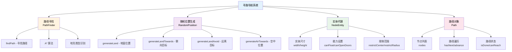

# 寻路导航系统

TabooLib 提供了一套基于 A* 算法的高级寻路导航系统，可以为 NPC、怪物或其他实体生成智能的移动路径，支持复杂地形、障碍物避让、随机位置生成等功能。

:::tip[为什么使用 TabooLib Navigation？]

- **智能寻路**：基于 A* 算法，自动避开障碍物
- **地形感知**：支持门、水、悬崖等复杂地形类型
- **随机生成**：提供多种随机位置生成策略
- **高度定制**：可自定义实体属性、路径代价等
- **性能优化**：缓存机制、可控搜索深度

:::

## 功能概览



## 核心概念

### NodeEntity（实体代理）

`NodeEntity` 代表一个需要寻路的实体，定义了实体的物理属性和寻路能力：

```kotlin
val entity = NodeEntity(
    location = npc.location,         // 实体当前位置
    height = 2.0,                    // 实体高度（格）
    width = 0.6,                     // 实体宽度（格）
    canPassDoors = true,             // 能否穿过门
    canOpenDoors = false,            // 能否打开门
    canFloat = true                  // 能否在水中游泳
)
```

### Path（路径）

`Path` 对象包含从起点到终点的完整路径节点列表：

```kotlin
val path: Path = pathFinder.findPath(targetLocation, distance = 50f)

// 路径包含的节点列表
path.nodes.forEach { node ->
    println("节点: ${node.x}, ${node.y}, ${node.z}")
}

// 路径是否可达目标
if (path.canReach()) {
    println("可以到达目标")
}
```

### PathFinder（路径查找器）

`PathFinder` 使用 A* 算法计算从当前位置到目标的最优路径。

## 快速开始

### 基础寻路示例

为 NPC 寻找到目标位置的路径：

```kotlin title="基础寻路示例" showLineNumbers
import org.bukkit.Location
import org.bukkit.entity.Villager
import taboolib.module.navigation.*

fun findPathToTarget(villager: Villager, target: Location) {
    // highlight-start
    // 1. 创建实体代理
    val entity = NodeEntity(
        location = villager.location,
        height = 2.0,    // 村民高度约 2 格
        width = 0.6      // 村民宽度约 0.6 格
    )
    // highlight-end

    // 2. 创建路径查找器
    val nodeReader = NodeReader(entity)
    val pathFinder = PathFinder(nodeReader)

    // highlight-start
    // 3. 寻找路径
    val path = pathFinder.findPath(
        position = target,
        distance = 50f,          // 最大搜索距离（格）
        distanceManhattan = 1,   // 曼哈顿距离阈值
        deep = 1f                // 搜索深度系数
    )
    // highlight-end

    if (path != null && path.canReach()) {
        println("找到路径，共 ${path.getNodeCount()} 个节点")
        // 使用路径...
    } else {
        println("无法到达目标位置")
    }
}
```

**代码说明：**
- `NodeEntity`: 创建实体的物理代理，定义尺寸和能力
- `NodeReader`: 负责读取和缓存地形信息
- `PathFinder`: 执行 A* 算法寻找路径
- `distance`: 最大搜索距离，越大越消耗性能
- `distanceManhattan`: 到达目标的曼哈顿距离阈值（通常为 1）
- `deep`: 搜索深度系数，影响性能和路径质量

## 路径查找

### 寻找到指定位置的路径

```kotlin title="寻找路径" showLineNumbers
import taboolib.module.navigation.*

fun navigateToLocation(npc: LivingEntity, target: Location) {
    val entity = NodeEntity(
        location = npc.location,
        height = npc.height,
        width = npc.width
    )

    val pathFinder = PathFinder(NodeReader(entity))

    // 寻找路径
    val path = pathFinder.findPath(target, distance = 100f)

    if (path != null) {
        // 遍历路径节点
        while (path.hasNext()) {
            val node = path.getNextNode()
            val nodePos = node.asBlockPos()

            println("下一个节点: ${nodePos.x}, ${nodePos.y}, ${nodePos.z}")

            // 移动到节点位置
            // npc.teleport(nodePos.toLocation(npc.world))

            path.advance()  // 前进到下一个节点
        }

        if (path.isDone()) {
            println("已到达目标！")
        }
    }
}
```

### 寻找到多个目标的路径

寻找到最近可达目标的路径：

```kotlin title="多目标寻路" showLineNumbers
fun findPathToNearestTarget(npc: LivingEntity, targets: List<Location>) {
    val entity = NodeEntity(
        location = npc.location,
        height = npc.height,
        width = npc.width
    )

    val pathFinder = PathFinder(NodeReader(entity))

    // 将 Location 转换为 Vector
    val targetVectors = targets.map { it.toVector() }.toSet()

    // 寻找到最近目标的路径
    val path = pathFinder.findPath(
        position = targetVectors,
        distance = 100f
    )

    if (path != null && path.canReach()) {
        println("找到最近目标的路径")
        println("目标位置: ${path.target}")
    }
}
```

### 设置搜索参数

调整搜索参数以平衡性能和效果：

```kotlin title="搜索参数调整"
// 近距离寻路（性能友好）
val nearPath = pathFinder.findPath(
    position = target,
    distance = 30f,    // 较小的搜索范围
    deep = 0.5f        // 较浅的搜索深度
)

// 远距离寻路（高质量）
val farPath = pathFinder.findPath(
    position = target,
    distance = 100f,   // 较大的搜索范围
    deep = 2.0f        // 较深的搜索深度
)

// 精确寻路（要求到达目标附近）
val precisePath = pathFinder.findPath(
    position = target,
    distance = 50f,
    distanceManhattan = 0  // 必须精确到达目标格子
)
```

**参数说明：**
- `distance`: 最大搜索距离，单位：格
  - 推荐值：近距离 20-50，远距离 50-100
  - 过大会严重影响性能
- `distanceManhattan`: 曼哈顿距离阈值
  - `0`: 必须到达目标格子
  - `1`: 到达相邻格子即可（推荐）
  - `2+`: 允许更大的误差
- `deep`: 搜索深度系数
  - `0.5`: 快速搜索，路径可能不是最优
  - `1.0`: 标准搜索（推荐）
  - `2.0`: 深度搜索，路径更优但更耗时

## NodeEntity 配置

### 基础属性配置

```kotlin title="实体属性配置" showLineNumbers
// 不同类型实体的配置
val villagerEntity = NodeEntity(
    location = villager.location,
    height = 2.0,
    width = 0.6,
    canPassDoors = true,
    canOpenDoors = false,
    canFloat = true
)

val zombieEntity = NodeEntity(
    location = zombie.location,
    height = 2.0,
    width = 0.6,
    canPassDoors = false,    // 僵尸不能穿过关闭的门
    canOpenDoors = true,     // 但可以破门
    canFloat = false         // 僵尸会沉入水底
)

val spiderEntity = NodeEntity(
    location = spider.location,
    height = 1.0,
    width = 1.4,             // 蜘蛛较宽
    canPassDoors = false,
    canOpenDoors = false,
    canFloat = false
)

// 飞行实体
val phantomEntity = NodeEntity(
    location = phantom.location,
    height = 1.0,
    width = 1.0,
    canFloat = true          // 可以在空中"游泳"
)
```

### 限制活动范围

为实体设置活动范围限制：

```kotlin title="限制范围示例" showLineNumbers
val entity = NodeEntity(
    location = npc.location,
    height = 2.0,
    width = 0.6
)

// highlight-start
// 限制实体在指定范围内活动
entity.restrictTo(
    pos = Vector(100, 64, 100),  // 中心点
    radius = 50                   // 半径（格）
)
// highlight-end

val pathFinder = PathFinder(NodeReader(entity))
val path = pathFinder.findPath(target, distance = 100f)

// 路径会避免超出限制范围
if (path != null && path.canReach()) {
    println("路径在限制范围内")
}
```

**适用场景：**
- NPC 守卫特定区域
- 宠物跟随范围限制
- 怪物巡逻区域

### 自定义路径代价

为不同地形类型设置移动代价：

```kotlin title="路径代价配置" showLineNumbers
val entity = NodeEntity(
    location = npc.location,
    height = 2.0,
    width = 0.6
)

// highlight-start
// 设置路径类型的移动代价（越高越不愿意经过）
entity.setPathfindingMalus(PathType.WATER, 8.0f)      // 不喜欢水
entity.setPathfindingMalus(PathType.DANGER_FIRE, 16.0f) // 非常害怕火
entity.setPathfindingMalus(PathType.DAMAGE_FIRE, -1.0f) // 绝对不走火焰
entity.setPathfindingMalus(PathType.DOOR_WOOD_CLOSED, 2.0f) // 稍微避开门
// highlight-end

val pathFinder = PathFinder(NodeReader(entity))
val path = pathFinder.findPath(target, distance = 50f)
```

**PathType 说明：**
- `WALKABLE`: 可行走的地面（默认代价 0）
- `WATER`: 水（默认代价 8）
- `LAVA`: 岩浆（默认代价 -1，不可通过）
- `DANGER_FIRE`: 火焰附近（危险）
- `DAMAGE_FIRE`: 火焰（造成伤害）
- `DOOR_WOOD_CLOSED`: 关闭的木门
- `FENCE`: 栅栏（默认不可通过）

**代价设置：**
- `0`: 无代价，优先选择
- `> 0`: 有代价，数值越大越避免
- `-1`: 不可通过

## 随机位置生成

`RandomPositionGenerator` 提供多种随机位置生成策略，适用于 AI 行为。

### 生成随机地面位置

```kotlin title="随机地面位置" showLineNumbers
import taboolib.module.navigation.RandomPositionGenerator

fun wanderRandomly(npc: LivingEntity) {
    val entity = NodeEntity(
        location = npc.location,
        height = 2.0,
        width = 0.6
    )

    // highlight-start
    // 在当前位置附近生成随机地面位置
    val randomPos = RandomPositionGenerator.generateLand(
        nodeEntity = entity,
        restrictX = 10,  // X/Z 方向的最大偏移（格）
        restrictY = 5    // Y 方向的最大偏移（格）
    )
    // highlight-end

    if (randomPos != null) {
        println("随机位置: ${randomPos.x}, ${randomPos.y}, ${randomPos.z}")

        // 寻找到该位置的路径
        val pathFinder = PathFinder(NodeReader(entity))
        val path = pathFinder.findPath(randomPos, distance = 30f)

        if (path != null && path.canReach()) {
            println("开始游荡到随机位置")
            // 移动到该位置...
        }
    }
}
```

### 生成朝向目标的位置

生成朝向特定目标方向的随机位置：

```kotlin title="朝向目标位置" showLineNumbers
fun approachTarget(npc: LivingEntity, target: Location) {
    val entity = NodeEntity(
        location = npc.location,
        height = 2.0,
        width = 0.6
    )

    // highlight-start
    // 生成朝向目标的随机位置
    val approachPos = RandomPositionGenerator.generateLandTowards(
        nodeEntity = entity,
        restrictX = 8,
        restrictY = 4,
        target = target.toVector()  // 目标位置
    )
    // highlight-end

    if (approachPos != null) {
        println("接近目标的位置: $approachPos")
        // 移动到该位置...
    }
}
```

**适用场景：**
- AI 接近玩家
- NPC 追逐目标
- 怪物围攻

### 生成远离目标的位置

生成远离特定目标的随机位置：

```kotlin title="远离目标位置" showLineNumbers
fun fleeFromDanger(npc: LivingEntity, danger: Location) {
    val entity = NodeEntity(
        location = npc.location,
        height = 2.0,
        width = 0.6
    )

    // highlight-start
    // 生成远离危险的随机位置
    val fleePos = RandomPositionGenerator.generateLandAvoid(
        nodeEntity = entity,
        restrictX = 10,
        restrictY = 5,
        start = danger.toVector()  // 危险位置
    )
    // highlight-end

    if (fleePos != null) {
        println("逃离位置: $fleePos")
        // 移动到该位置...
    }
}
```

**适用场景：**
- 村民逃离僵尸
- NPC 躲避危险
- 怪物逃离玩家

### 生成空中位置

生成朝向目标的空中位置（适用于飞行实体）：

```kotlin title="空中位置" showLineNumbers
fun flyTowardsTarget(phantom: LivingEntity, target: Location) {
    val entity = NodeEntity(
        location = phantom.location,
        height = 1.0,
        width = 1.0,
        canFloat = true  // 飞行实体
    )

    // highlight-start
    // 生成朝向目标的空中位置
    val airPos = RandomPositionGenerator.generateAirTowards(
        nodeEntity = entity,
        restrictX = 15,
        restrictY = 10,
        target = target.toVector()
    )
    // highlight-end

    if (airPos != null) {
        println("飞行目标位置: $airPos")
        // 飞向该位置...
    }
}
```

## Path 路径操作

### 遍历路径节点

```kotlin title="路径遍历" showLineNumbers
fun walkPath(npc: LivingEntity, path: Path) {
    println("路径共有 ${path.getNodeCount()} 个节点")

    // 方式 1：使用 hasNext() 和 advance()
    while (path.hasNext()) {
        val node = path.getNextNode()
        val position = node.asBlockPos().toLocation(npc.world)

        println("移动到节点: ${node.x}, ${node.y}, ${node.z}")

        // 移动 NPC
        npc.teleport(position)

        // 前进到下一个节点
        path.advance()

        // 延迟一段时间
        Thread.sleep(200)
    }

    if (path.isDone()) {
        println("已完成路径遍历")
    }
}
```

### 获取路径信息

```kotlin title="路径信息查询" showLineNumbers
fun analyzePathinfo(path: Path, entity: NodeEntity) {
    // 路径节点总数
    val nodeCount = path.getNodeCount()
    println("路径长度: $nodeCount 个节点")

    // 当前节点索引
    val currentIndex = path.getNextIndex()
    println("当前位置: 节点 $currentIndex")

    // 目标位置
    val target = path.target
    println("目标位置: $target")

    // 路径是否可达
    val canReach = path.canReach()
    println("是否可达: $canReach")

    // 距离目标的距离
    val distToTarget = path.distToTarget
    println("距离目标: $distToTarget 格")

    // 获取终点节点
    val endNode = path.getEndNode()
    println("终点: ${endNode?.x}, ${endNode?.y}, ${endNode?.z}")

    // 获取特定索引的节点
    val firstNode = path.getNode(0)
    println("起点: ${firstNode.x}, ${firstNode.y}, ${firstNode.z}")

    // 获取下一个节点位置（考虑实体尺寸）
    val nextPos = path.getNextEntityPos(entity)
    println("下一个位置（实体中心）: $nextPos")
}
```

### 路径修改

```kotlin title="路径修改"
// 截断路径（保留前 N 个节点）
path.truncateNode(5)  // 只保留前 5 个节点

// 替换特定节点
val newNode = Node(10, 64, 20)
path.replaceNode(index = 2, node = newNode)
```

## 完整示例

### NPC 巡逻系统

```kotlin title="NPCPatrolSystem.kt" showLineNumbers
import org.bukkit.Location
import org.bukkit.entity.LivingEntity
import taboolib.common.platform.function.submit
import taboolib.module.navigation.*

/**
 * NPC 巡逻系统
 */
class NPCPatrolSystem(val npc: LivingEntity, val patrolPoints: List<Location>) {

    private var currentPointIndex = 0
    private var currentPath: Path? = null
    private var isPatrolling = false

    /**
     * 开始巡逻
     */
    fun startPatrol() {
        if (isPatrolling) return
        isPatrolling = true

        println("${npc.name} 开始巡逻")
        goToNextPoint()
    }

    /**
     * 停止巡逻
     */
    fun stopPatrol() {
        isPatrolling = false
        currentPath = null
        println("${npc.name} 停止巡逻")
    }

    /**
     * 前往下一个巡逻点
     */
    private fun goToNextPoint() {
        if (!isPatrolling) return

        val target = patrolPoints[currentPointIndex]
        println("${npc.name} 前往巡逻点 $currentPointIndex: ${target.blockX}, ${target.blockY}, ${target.blockZ}")

        // 创建实体代理
        val entity = NodeEntity(
            location = npc.location,
            height = npc.height,
            width = npc.width,
            canPassDoors = true,
            canFloat = true
        )

        // 寻找路径
        val pathFinder = PathFinder(NodeReader(entity))
        val path = pathFinder.findPath(target, distance = 100f)

        if (path != null && path.canReach()) {
            currentPath = path
            followPath(entity, path)
        } else {
            println("${npc.name} 无法到达巡逻点 $currentPointIndex，跳过")
            nextPoint()
        }
    }

    /**
     * 沿着路径移动
     */
    private fun followPath(entity: NodeEntity, path: Path) {
        submit(period = 10L) {  // 每 0.5 秒移动一次
            if (!isPatrolling || currentPath != path) {
                cancel()
                return@submit
            }

            if (path.hasNext()) {
                // 获取下一个节点位置
                val nextPos = path.getNextEntityPos(entity)
                val nextLocation = nextPos.toLocation(npc.world)

                // 让 NPC 看向目标
                val direction = nextLocation.toVector().subtract(npc.location.toVector())
                npc.location.direction = direction.normalize()

                // 移动 NPC
                npc.teleport(nextLocation)

                // 前进到下一个节点
                path.advance()
            } else {
                // 路径完成
                cancel()
                println("${npc.name} 到达巡逻点 $currentPointIndex")

                // 等待 3 秒后前往下一个点
                submit(delay = 60L) {
                    nextPoint()
                }
            }
        }
    }

    /**
     * 切换到下一个巡逻点
     */
    private fun nextPoint() {
        currentPointIndex = (currentPointIndex + 1) % patrolPoints.size
        goToNextPoint()
    }
}

// 使用示例
fun setupNPCPatrol(npc: LivingEntity) {
    val patrolPoints = listOf(
        Location(npc.world, 100.0, 64.0, 100.0),
        Location(npc.world, 120.0, 64.0, 100.0),
        Location(npc.world, 120.0, 64.0, 120.0),
        Location(npc.world, 100.0, 64.0, 120.0)
    )

    val patrolSystem = NPCPatrolSystem(npc, patrolPoints)
    patrolSystem.startPatrol()
}
```

### AI 游荡与追逐系统

```kotlin title="NPCAISystem.kt" showLineNumbers
import org.bukkit.Location
import org.bukkit.entity.LivingEntity
import org.bukkit.entity.Player
import taboolib.common.platform.function.submit
import taboolib.module.navigation.*

/**
 * NPC AI 系统（游荡 + 追逐）
 */
class NPCAISystem(val npc: LivingEntity, val detectionRange: Double = 10.0) {

    private var currentPath: Path? = null
    private var isActive = true
    private var state = AIState.WANDERING

    enum class AIState {
        WANDERING,  // 游荡
        CHASING     // 追逐
    }

    /**
     * 启动 AI
     */
    fun start() {
        isActive = true

        // 每 2 秒更新一次 AI
        submit(period = 40L) {
            if (!isActive) {
                cancel()
                return@submit
            }

            update()
        }
    }

    /**
     * 停止 AI
     */
    fun stop() {
        isActive = false
        currentPath = null
    }

    /**
     * 更新 AI 状态
     */
    private fun update() {
        // 检测附近的玩家
        val nearbyPlayer = npc.world.players.find {
            it.location.distance(npc.location) < detectionRange && !it.hasMetadata("vanished")
        }

        when {
            nearbyPlayer != null -> {
                // 发现玩家，切换到追逐状态
                if (state != AIState.CHASING) {
                    state = AIState.CHASING
                    println("${npc.name} 发现目标: ${nearbyPlayer.name}")
                }
                chaseTarget(nearbyPlayer)
            }
            else -> {
                // 没有目标，游荡
                if (state != AIState.WANDERING) {
                    state = AIState.WANDERING
                    println("${npc.name} 失去目标，开始游荡")
                }
                wander()
            }
        }
    }

    /**
     * 游荡行为
     */
    private fun wander() {
        // 如果正在移动，不重新生成路径
        val path = currentPath
        if (path != null && !path.isDone()) {
            return
        }

        val entity = createEntity()

        // 生成随机位置
        val randomPos = RandomPositionGenerator.generateLand(
            nodeEntity = entity,
            restrictX = 15,
            restrictY = 5
        )

        if (randomPos != null) {
            // 寻找路径
            val pathFinder = PathFinder(NodeReader(entity))
            val newPath = pathFinder.findPath(randomPos, distance = 50f)

            if (newPath != null && newPath.canReach()) {
                currentPath = newPath
                followPath(entity, newPath)
            }
        }
    }

    /**
     * 追逐目标
     */
    private fun chaseTarget(target: Player) {
        val entity = createEntity()

        // 生成接近目标的位置
        val approachPos = RandomPositionGenerator.generateLandTowards(
            nodeEntity = entity,
            restrictX = 10,
            restrictY = 5,
            target = target.location.toVector()
        )

        if (approachPos != null) {
            val pathFinder = PathFinder(NodeReader(entity))
            val newPath = pathFinder.findPath(approachPos, distance = 30f)

            if (newPath != null && newPath.canReach()) {
                currentPath = newPath
                followPath(entity, newPath, speed = 1.5)  // 追逐时速度更快
            }
        }
    }

    /**
     * 沿路径移动
     */
    private fun followPath(entity: NodeEntity, path: Path, speed: Double = 1.0) {
        val period = (10L / speed).toLong()

        submit(period = period) {
            if (!isActive || currentPath != path) {
                cancel()
                return@submit
            }

            if (path.hasNext()) {
                val nextPos = path.getNextEntityPos(entity)
                val nextLocation = nextPos.toLocation(npc.world)

                // 让 NPC 看向目标
                val direction = nextLocation.toVector().subtract(npc.location.toVector())
                if (direction.lengthSquared() > 0) {
                    npc.location.direction = direction.normalize()
                }

                // 移动 NPC
                npc.teleport(nextLocation)
                path.advance()
            } else {
                cancel()
            }
        }
    }

    /**
     * 创建实体代理
     */
    private fun createEntity(): NodeEntity {
        return NodeEntity(
            location = npc.location,
            height = npc.height,
            width = npc.width,
            canPassDoors = true,
            canFloat = true
        )
    }
}

// 使用示例
fun setupNPCAI(npc: LivingEntity) {
    val aiSystem = NPCAISystem(npc, detectionRange = 15.0)
    aiSystem.start()
}
```

## 常见问题

### 寻路失败怎么办？

检查以下几点：

1. **距离参数是否合理**
   ```kotlin
   // ❌ 距离太小，可能搜索不到
   pathFinder.findPath(target, distance = 5f)

   // ✅ 适当的距离
   pathFinder.findPath(target, distance = 50f)
   ```

2. **目标是否可达**
   ```kotlin
   val path = pathFinder.findPath(target, distance = 50f)
   if (path == null) {
       println("无法生成路径（可能有障碍物）")
   } else if (!path.canReach()) {
       println("路径未完全到达目标")
   }
   ```

3. **实体尺寸是否正确**
   ```kotlin
   // 确保 width 和 height 符合实体实际尺寸
   val entity = NodeEntity(
       location = npc.location,
       height = 2.0,  // 检查高度
       width = 0.6    // 检查宽度
   )
   ```

### 如何优化寻路性能？

1. **限制搜索范围**
   ```kotlin
   // 近距离寻路
   pathFinder.findPath(target, distance = 30f, deep = 0.5f)
   ```

2. **降低搜索频率**
   ```kotlin
   // 不要每 tick 都寻路
   submit(period = 40L) {  // 每 2 秒更新一次
       val path = pathFinder.findPath(target, distance = 50f)
       // ...
   }
   ```

3. **复用 NodeReader**
   ```kotlin
   // ❌ 每次都创建新的（性能差）
   val pathFinder1 = PathFinder(NodeReader(entity))
   val pathFinder2 = PathFinder(NodeReader(entity))

   // ✅ 复用（性能好，但需要注意线程安全）
   val nodeReader = NodeReader(entity)
   val pathFinder = PathFinder(nodeReader)
   ```

4. **缓存路径**
   ```kotlin
   // 只有在必要时才重新寻路
   if (currentPath == null || currentPath.isDone()) {
       currentPath = pathFinder.findPath(target, distance = 50f)
   }
   ```

### 如何让 NPC 平滑移动？

使用 `Location.direction` 和渐进式移动：

```kotlin
fun smoothMove(npc: LivingEntity, targetLocation: Location) {
    val direction = targetLocation.toVector().subtract(npc.location.toVector())

    // 设置朝向
    npc.location.direction = direction.normalize()

    // 渐进移动
    val distance = direction.length()
    val step = 0.2  // 每次移动 0.2 格

    if (distance > step) {
        val movement = direction.normalize().multiply(step)
        npc.teleport(npc.location.add(movement))
    } else {
        npc.teleport(targetLocation)
    }
}
```

### 如何处理门和栅栏？

```kotlin
val entity = NodeEntity(
    location = npc.location,
    height = 2.0,
    width = 0.6,
    canPassDoors = true,      // 可以穿过门
    canOpenDoors = false      // 不能打开门
)

// 如果需要打开门
entity.canOpenDoors = true

// 如果需要避开门
entity.setPathfindingMalus(PathType.DOOR_WOOD_CLOSED, 10.0f)
```

### 随机位置生成失败怎么办？

```kotlin
val randomPos = RandomPositionGenerator.generateLand(entity, 10, 5)

if (randomPos == null) {
    // 1. 尝试更大的范围
    val largerPos = RandomPositionGenerator.generateLand(entity, 20, 10)

    if (largerPos == null) {
        // 2. 尝试不同的生成策略
        val abovePos = RandomPositionGenerator.generateLandAbove(entity, 15, 7)

        if (abovePos == null) {
            // 3. 使用固定位置或原地等待
            println("无法生成随机位置")
        }
    }
}
```

### 如何让实体避开危险区域？

```kotlin
val entity = NodeEntity(
    location = npc.location,
    height = 2.0,
    width = 0.6
)

// 设置危险类型的高代价
entity.setPathfindingMalus(PathType.DANGER_FIRE, 16.0f)  // 避开火焰附近
entity.setPathfindingMalus(PathType.DAMAGE_FIRE, -1.0f)  // 绝不通过火焰
entity.setPathfindingMalus(PathType.LAVA, -1.0f)         // 绝不通过岩浆
entity.setPathfindingMalus(PathType.DAMAGE_CACTUS, 8.0f) // 避开仙人掌
```

:::tip[性能优化建议]

1. **搜索距离**：近距离 20-50，远距离 50-100，不建议超过 150
2. **更新频率**：寻路操作建议间隔 1-2 秒（20-40 ticks）
3. **路径复用**：如果目标未移动，不需要重新寻路
4. **异步处理**：对于非关键寻路，考虑异步计算路径
5. **限制数量**：避免同时为大量实体寻路

:::

## 总结

TabooLib Navigation 模块提供了：

✅ **智能寻路**：基于 A* 算法的高效路径查找
✅ **地形感知**：支持门、水、悬崖等复杂地形
✅ **随机生成**：多种随机位置生成策略
✅ **高度定制**：可自定义实体属性和路径代价
✅ **性能优化**：缓存机制、可控搜索深度

适用于 NPC 巡逻、怪物追逐、宠物跟随、AI 游荡等各种场景！
