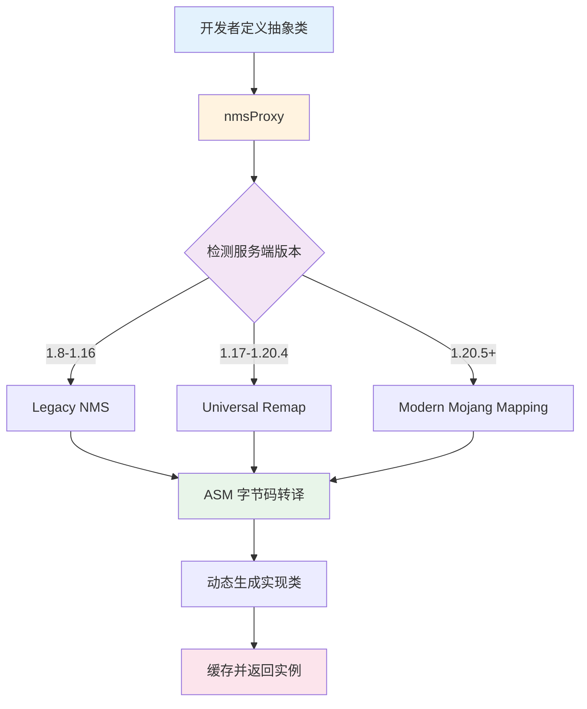

# NMS 代理系统 (nmsProxy)

TabooLib 的 NMS 代理系统（nmsProxy）是一个强大的跨版本 NMS 适配解决方案，通过 ASM 字节码转译和动态类加载技术，实现了一套代码适配多个 Minecraft 版本的目标。

**涉及模块：**
- `NMS` - NMS 代理核心功能
- `NMS_UTIL` - NMS 工具类实现

## 核心概念解析

### 什么是 nmsProxy？

nmsProxy 是 TabooLib 提供的 NMS（Net Minecraft Server）跨版本代理系统。它解决了 Minecraft 服务端在不同版本之间 NMS 包结构变化导致的兼容性问题。



### 为什么需要 nmsProxy？

**Minecraft 版本兼容性问题：**

1. **包路径变化**：
   - 1.16 及以下：`net.minecraft.server.v1_16_R3.PacketPlayOutChat`
   - 1.17-1.20.4：`net.minecraft.network.protocol.game.ClientboundChatPacket`（需要 Spigot 映射）
   - 1.20.5+：使用 Mojang 官方映射

2. **类结构重构**：不同版本的 NMS 类方法、字段、构造函数可能完全不同

3. **Paper 特殊处理**：Paper 服务端对 NMS 类进行了重定向和重映射

**nmsProxy 的解决方案：**

- 开发者只需编写一次抽象类定义
- TabooLib 在运行时自动转译和加载对应版本的实现类
- 通过缓存机制提升性能

## 使用场景

### 1. 跨版本 NMS 操作

当你需要使用 NMS 功能，但又希望支持多个 Minecraft 版本时：

```kotlin
// 定义抽象类
abstract class NMSMessage {
    abstract fun sendTitle(player: Player, title: String)

    companion object {
        val instance by unsafeLazy { nmsProxy<NMSMessage>() }
    }
}

// 实现类（会被 nmsProxy 自动转译）
class NMSMessageImpl : NMSMessage() {
    override fun sendTitle(player: Player, title: String) {
        // 使用当前版本的 NMS 类
        val packet = net.minecraft.network.protocol.game.ClientboundSetTitleTextPacket(...)
        player.sendPacket(packet)
    }
}
```

### 2. 封装复杂的版本差异

隐藏不同版本之间的 API 差异，提供统一的调用接口：

```kotlin
// TabooLib 内置的粒子系统
abstract class NMSParticle {
    abstract fun createParticlePacket(
        particle: Particle,
        location: Location,
        offset: Vector,
        speed: Double,
        count: Int,
        data: Any?
    ): Any
}

// 使用时无需关心版本差异
val packet = Particle.FLAME.createPacket(location)
player.sendPacket(packet)
```

### 3. 实现 Bukkit API 无法提供的功能

访问 Bukkit API 未暴露的底层功能：

```kotlin
// 发送原始 JSON 标题
fun Player.sendRawTitle(title: String?, subtitle: String?) {
    NMSMessage.instance.sendRawTitle(this, title, subtitle, 10, 70, 20)
}

// 设置 BossBar 的原始 JSON 标题
fun BossBar.setRawTitle(title: String) {
    NMSMessage.instance.setRawTitle(this, title)
}
```

### 4. TabooLib 内置的 NMS 代理

TabooLib 已经为常用功能提供了现成的 NMS 代理实现：

| 代理类 | 功能 | 使用示例 |
|--------|------|----------|
| `NMSMessage` | 发送原始 JSON 消息 | `player.sendRawTitle(...)` |
| `NMSParticle` | 创建粒子数据包 | `Particle.FLAME.createPacket(...)` |
| `NMSEntity` | 实体操作和生成 | `location.spawnEntity(...)` |
| `NMSItemTag` | ItemStack NBT 操作 | `item.getItemTag()` |
| `NMSSign` | 打开虚拟告示牌编辑 | 告示牌输入界面 |
| `NMSScoreboard` | 计分板操作 | 侧边栏显示 |
| `NMSTranslate` | 翻译键获取 | 获取物品本地化名称 |

## 基本用法

### 1. 定义抽象类

创建一个抽象类，定义你需要的跨版本功能：

```kotlin
// 定义抽象类
abstract class NMSPlayerHandler {

    /** 获取玩家 Ping 值 */
    abstract fun getPing(player: Player): Int

    /** 设置玩家飞行速度 */
    abstract fun setFlySpeed(player: Player, speed: Float)

    // highlight-start
    companion object {
        // 使用 nmsProxy 获取实例
        val instance by unsafeLazy { nmsProxy<NMSPlayerHandler>() }
    }
    // highlight-end
}
```

**关键要点：**

- 抽象类必须是 `abstract class`（不能是接口）
- 使用 `companion object` + `unsafeLazy` 延迟初始化（避免在类加载阶段出错）
- 通过 `nmsProxy<T>()` 泛型函数获取实例

### 2. 创建实现类

创建名为 `{抽象类名}Impl` 的实现类：

```kotlin
package com.example.plugin.nms

import org.bukkit.craftbukkit.v1_21_R3.entity.CraftPlayer
import org.bukkit.entity.Player

// 类名必须是 NMSPlayerHandlerImpl
class NMSPlayerHandlerImpl : NMSPlayerHandler() {

    override fun getPing(player: Player): Int {
        // 1.20.5+ 使用 Mojang 映射
        return if (MinecraftVersion.versionId >= 12005) {
            (player as CraftPlayer).handle.connection.latency
        }
        // 1.17+ 使用 Spigot 映射
        else if (MinecraftVersion.isUniversal) {
            (player as org.bukkit.craftbukkit.v1_17_R1.entity.CraftPlayer)
                .handle.b.latency
        }
        // 1.8-1.16 使用旧版 NMS
        else {
            (player as org.bukkit.craftbukkit.v1_12_R1.entity.CraftPlayer)
                .handle.ping
        }
    }

    override fun setFlySpeed(player: Player, speed: Float) {
        // 使用 Bukkit API（跨版本兼容）
        player.flySpeed = speed
    }
}
```

**命名规则：**

默认情况下，实现类名必须是 `{抽象类名}Impl`：
- 抽象类：`NMSPlayerHandler`
- 实现类：`NMSPlayerHandlerImpl`

### 3. 使用代理实例

在你的代码中调用代理实例：

```kotlin
// 获取玩家 Ping
val ping = NMSPlayerHandler.instance.getPing(player)
player.sendMessage("你的延迟: ${ping}ms")

// 设置飞行速度
NMSPlayerHandler.instance.setFlySpeed(player, 0.2f)
```

### 4. 完整示例：发送 ActionBar

```kotlin
// 1. 定义抽象类
abstract class NMSActionBar {
    abstract fun send(player: Player, message: String)

    companion object {
        val instance by unsafeLazy { nmsProxy<NMSActionBar>() }
    }
}

// 2. 实现类
class NMSActionBarImpl : NMSActionBar() {
    override fun send(player: Player, message: String) {
        // 使用 Spigot API（跨版本兼容）
        player.spigot().sendMessage(
            ChatMessageType.ACTION_BAR,
            *ComponentSerializer.parse("""{"text":"$message"}""")
        )
    }
}

// 3. 使用
NMSActionBar.instance.send(player, "欢迎来到服务器！")
```

## API 参考

### nmsProxy - 获取代理实例

```kotlin
// 泛型版本（推荐）
inline fun <reified T> nmsProxy(
    bind: String = "\{name}Impl",
    vararg parameter: Any
): T

// 带父类列表的版本
inline fun <reified T> nmsProxy(
    bind: String = "\{name}Impl",
    parent: List<String> = emptyList(),
    vararg parameter: Any
): T
```

**参数说明：**

| 参数 | 类型 | 默认值 | 说明 |
|------|------|--------|------|
| `bind` | String | "\{name}Impl" | 实现类名称模板 |
| `parameter` | Array&lt;Any&gt; | 空数组 | 构造函数参数 |
| `parent` | List&lt;String&gt; | 空列表 | 父类实现类名称列表 |

**返回值：**

返回转译后的实现类实例，类型为 `T`

**使用示例：**

```kotlin
// 示例 1：默认命名（NMSMessageImpl）
val message = nmsProxy<NMSMessage>()

// 示例 2：自定义实现类名
val custom = nmsProxy<NMSCustom>(bind = "NMSCustomHandler")

// 示例 3：传递构造函数参数
class NMSConfigImpl(val config: Configuration) : NMSConfig()

val configProxy = nmsProxy<NMSConfig>(parameter = arrayOf(myConfig))

// 示例 4：多个父类（先加载 NMSBaseImpl，再加载 NMSExtendedImpl）
val extended = nmsProxy<NMSExtended>(
    parent = listOf("NMSBaseImpl"),
    bind = "NMSExtendedImpl"
)
```

### nmsProxyClass - 获取代理类

如果你只需要获取转译后的 Class 对象而不是实例：

```kotlin
inline fun <reified T> nmsProxyClass(
    bind: String = "\{name}Impl",
    parent: List<String> = emptyList()
): Class<T>
```

**使用场景：**

```kotlin
// 获取代理类
val clazz = nmsProxyClass<NMSMessage>()

// 手动创建实例（可以使用自定义的构造参数）
val instance = clazz.getDeclaredConstructor(String::class.java)
    .newInstance("custom parameter")
```

## 进阶使用

### 1. 处理版本差异

在实现类中使用 `MinecraftVersion` 判断版本：

```kotlin
class NMSPacketImpl : NMSPacket() {

    override fun createChatPacket(message: String): Any {
        return when {
            // 1.19+
            MinecraftVersion.isHigherOrEqual(MinecraftVersion.V1_19) -> {
                val component = CraftChatMessage.fromJSON(message)
                ClientboundSystemChatPacket(component, false)
            }
            // 1.17-1.18
            MinecraftVersion.isUniversal -> {
                val component = net.minecraft.server.v1_17_R1.IChatBaseComponent
                    .ChatSerializer.a(message)
                net.minecraft.server.v1_17_R1.PacketPlayOutChat(
                    component,
                    net.minecraft.server.v1_17_R1.ChatMessageType.SYSTEM,
                    UUID.randomUUID()
                )
            }
            // 1.8-1.16
            else -> {
                val component = net.minecraft.server.v1_12_R1.IChatBaseComponent
                    .ChatSerializer.a(message)
                net.minecraft.server.v1_12_R1.PacketPlayOutChat(component)
            }
        }
    }
}
```

**版本判断方法：**

```kotlin
// 版本号判断
MinecraftVersion.versionId >= 12005  // 1.20.5+
MinecraftVersion.versionId >= 11903  // 1.19.3+

// 主版本判断
MinecraftVersion.major >= MinecraftVersion.V1_20

// 辅助方法
MinecraftVersion.isUniversal  // 1.17+
MinecraftVersion.isUniversalCraftBukkit  // Paper 重映射版本
MinecraftVersion.isHigherOrEqual(MinecraftVersion.V1_19)
MinecraftVersion.isLower(MinecraftVersion.V1_13)
```

### 2. 使用 Typealias 简化代码

为了让代码更清晰，建议使用 typealias 为 NMS 类创建别名：

```kotlin
class NMSMessageImpl : NMSMessage() {

    override fun fromJson(json: String): Any {
        return CraftChatMessage.fromJSON(json)
    }

    override fun sendTitle(player: Player, title: String) {
        if (MinecraftVersion.isUniversal) {
            player.sendPacket(NMSSetTitlePacket(CraftChatMessage.fromJSON(title)))
        } else {
            player.sendPacket(NMSPacketPlayOutTitle16(
                NMSEnumTitleAction16.TITLE,
                NMSChatSerializer16.a(title)
            ))
        }
    }
}

// 在文件末尾定义 typealias
private typealias NMSSetTitlePacket = net.minecraft.network.protocol.game.ClientboundSetTitleTextPacket
private typealias NMSChatSerializer16 = net.minecraft.server.v1_16_R3.IChatBaseComponent.ChatSerializer
private typealias NMSEnumTitleAction16 = net.minecraft.server.v1_16_R3.PacketPlayOutTitle.EnumTitleAction
private typealias NMSPacketPlayOutTitle16 = net.minecraft.server.v1_16_R3.PacketPlayOutTitle
```

### 3. 自定义实现类名称

默认情况下，nmsProxy 会查找 `{抽象类名}Impl`，但你可以自定义：

```kotlin
abstract class MyNMSHandler {
    companion object {
        // 使用自定义实现类名
        val instance by unsafeLazy {
            nmsProxy<MyNMSHandler>(bind = "CustomNMSHandlerImpl")
        }
    }
}

// 实现类名称为 CustomNMSHandlerImpl
class CustomNMSHandlerImpl : MyNMSHandler() {
    // ...
}
```

**bind 参数的占位符：**

- `\{name}` 会被替换为抽象类的完整包名+类名
- 示例：`com.example.MyHandler` → `com.example.MyHandlerImpl`

### 4. 传递构造函数参数

当实现类需要构造函数参数时：

```kotlin
abstract class NMSDatabase {
    abstract fun query(sql: String): List<Map<String, Any>>

    companion object {
        fun create(config: DatabaseConfig): NMSDatabase {
            return nmsProxy(parameter = arrayOf(config))
        }
    }
}

class NMSDatabaseImpl(private val config: DatabaseConfig) : NMSDatabase() {
    override fun query(sql: String): List<Map<String, Any>> {
        // 使用 config 连接数据库
        return emptyList()
    }
}

// 使用
val db = NMSDatabase.create(myConfig)
```

### 5. 内部类支持

nmsProxy 会自动转译抽象类的所有内部类：

```kotlin
abstract class NMSComplex {

    abstract class InnerHandler {
        abstract fun handle()
    }

    abstract fun getInnerHandler(): InnerHandler
}

class NMSComplexImpl : NMSComplex() {

    // 内部类也会被转译
    class InnerHandlerImpl : InnerHandler() {
        override fun handle() {
            println("Inner handler called")
        }
    }

    override fun getInnerHandler(): InnerHandler {
        return InnerHandlerImpl()
    }
}
```

### 6. 缓存机制

nmsProxy 会缓存转译后的类和实例，避免重复转译：

```kotlin
// 第一次调用：触发 ASM 转译
val instance1 = nmsProxy<NMSMessage>()  // ~10ms

// 后续调用：直接从缓存读取
val instance2 = nmsProxy<NMSMessage>()  // <1ms

// instance1 和 instance2 是同一个对象
assert(instance1 === instance2)
```

**缓存键规则：**

```kotlin
val key = "${抽象类完整名}:$bind:${构造参数类型列表}"

// 示例
"com.example.NMSMessage:\{name}Impl:"  // 无参数
"com.example.NMSDatabase:\{name}Impl:com.example.DatabaseConfig"  // 有参数
```

## 实战案例

### 案例 1：跨版本粒子效果

```kotlin
// 定义抽象类
abstract class NMSCustomParticle {
    abstract fun spawnColoredDust(
        location: Location,
        color: Color,
        size: Float
    ): Any

    companion object {
        val instance by unsafeLazy { nmsProxy<NMSCustomParticle>() }
    }
}

// 实现类
class NMSCustomParticleImpl : NMSCustomParticle() {

    override fun spawnColoredDust(location: Location, color: Color, size: Float): Any {
        // 1.13+ 使用 Particle.DustOptions
        return if (MinecraftVersion.isHigherOrEqual(MinecraftVersion.V1_13)) {
            val dustOptions = Particle.DustOptions(
                org.bukkit.Color.fromRGB(color.red, color.green, color.blue),
                size
            )
            Particle.REDSTONE.createPacket(location, data = dustOptions)
        }
        // 1.12- 不支持彩色粒子，使用普通红石粒子
        else {
            Particle.REDSTONE.createPacket(location)
        }
    }
}

// 使用
fun showColorfulEffect(player: Player) {
    val colors = listOf(
        Color.RED, Color.ORANGE, Color.YELLOW,
        Color.GREEN, Color.CYAN, Color.BLUE, Color.MAGENTA
    )

    colors.forEachIndexed { index, color ->
        val angle = (index * 360.0 / colors.size) * (Math.PI / 180.0)
        val location = player.location.add(
            Math.cos(angle) * 2,
            1.0,
            Math.sin(angle) * 2
        )

        val packet = NMSCustomParticle.instance.spawnColoredDust(location, color, 1.5f)
        player.sendPacket(packet)
    }
}
```

### 案例 2：获取实体 AI 目标

```kotlin
abstract class NMSAI {
    abstract fun getGoals(entity: LivingEntity): List<String>

    abstract fun clearGoals(entity: LivingEntity)

    companion object {
        val instance by unsafeLazy { nmsProxy<NMSAI>() }
    }
}

class NMSAIImpl : NMSAI() {

    override fun getGoals(entity: LivingEntity): List<String> {
        return if (MinecraftVersion.isUniversal) {
            val nmsEntity = (entity as CraftLivingEntity21).handle
            val goalSelector = nmsEntity.goalSelector

            goalSelector.getProperty<Any>("availableGoals")!!
                .invokeMethod<Collection<Any>>("stream")!!
                .map { it.getProperty<Any>("goal")!!.javaClass.simpleName }
                .toList()
        } else {
            val nmsEntity = (entity as CraftLivingEntity12).handle
            val goalSelector = nmsEntity.goalSelector

            goalSelector.getProperty<Set<Any>>("b")!!
                .map { it.getProperty<Any>("a")!!.javaClass.simpleName }
        }
    }

    override fun clearGoals(entity: LivingEntity) {
        if (MinecraftVersion.isUniversal) {
            val nmsEntity = (entity as CraftLivingEntity21).handle
            nmsEntity.goalSelector.getProperty<Any>("availableGoals")!!
                .invokeMethod<Void>("clear")
        } else {
            val nmsEntity = (entity as CraftLivingEntity12).handle
            nmsEntity.goalSelector.getProperty<Set<Any>>("b")!!.clear()
        }
    }
}

private typealias CraftLivingEntity21 = org.bukkit.craftbukkit.v1_21_R3.entity.CraftLivingEntity
private typealias CraftLivingEntity12 = org.bukkit.craftbukkit.v1_12_R1.entity.CraftLivingEntity

// 使用
fun analyzeEntity(entity: LivingEntity) {
    val goals = NMSAI.instance.getGoals(entity)
    println("实体 ${entity.name} 的 AI 目标：")
    goals.forEach { println("  - $it") }
}
```

### 案例 3：自定义背包界面

```kotlin
abstract class NMSInventory {
    abstract fun openCustomInventory(
        player: Player,
        title: String,
        size: Int
    ): Inventory

    companion object {
        val instance by unsafeLazy { nmsProxy<NMSInventory>() }
    }
}

class NMSInventoryImpl : NMSInventory() {

    override fun openCustomInventory(player: Player, title: String, size: Int): Inventory {
        // 使用 Bukkit API（跨版本兼容）
        val inventory = Bukkit.createInventory(null, size, title)
        player.openInventory(inventory)
        return inventory
    }
}

// 使用
fun openShop(player: Player) {
    val inv = NMSInventory.instance.openCustomInventory(
        player,
        "§6§l商店",
        54
    )

    // 添加商品
    inv.setItem(10, buildItem(XMaterial.DIAMOND) {
        name = "&b钻石"
        lore += "&7价格: &a100 金币"
        colored()
    })
}
```

## 注意事项与最佳实践

### 1. 必须使用 abstract class

```kotlin
// ✅ 正确
abstract class NMSHandler {
    abstract fun handle()
}

// ❌ 错误：不能使用 interface
interface NMSHandler {
    fun handle()
}
```

### 2. 使用 unsafeLazy 延迟初始化

```kotlin
// ✅ 正确：延迟初始化，避免类加载阶段出错
companion object {
    val instance by unsafeLazy { nmsProxy<NMSMessage>() }
}

// ❌ 错误：立即初始化可能导致类加载失败
companion object {
    val instance = nmsProxy<NMSMessage>()
}
```

### 3. 实现类命名规范

```kotlin
// 抽象类
abstract class NMSPlayerHandler { ... }

// ✅ 正确：NMSPlayerHandlerImpl
class NMSPlayerHandlerImpl : NMSPlayerHandler() { ... }

// ❌ 错误：名称不匹配
class PlayerHandlerImpl : NMSPlayerHandler() { ... }
class NMSPlayerHandlerImplementation : NMSPlayerHandler() { ... }
```

### 4. 优先使用 Bukkit API

能用 Bukkit API 解决的问题，不要使用 NMS：

```kotlin
// ✅ 推荐：使用 Bukkit API
player.sendMessage("消息")
player.health = 20.0

// ❌ 不推荐：没必要使用 NMS
val nmsPlayer = (player as CraftPlayer).handle
nmsPlayer.sendMessage(...)
```

### 5. 处理版本差异时要全面

```kotlin
override fun someMethod() {
    return when {
        // 1.20.5+
        MinecraftVersion.versionId >= 12005 -> handleModern()
        // 1.17-1.20.4
        MinecraftVersion.isUniversal -> handleUniversal()
        // 1.13-1.16
        MinecraftVersion.isHigherOrEqual(MinecraftVersion.V1_13) -> handleLegacyNew()
        // 1.8-1.12
        else -> handleLegacyOld()
    }
}
```

### 6. 使用 typealias 提升可读性

```kotlin
// ✅ 清晰易读
private typealias NMSPacket = net.minecraft.network.protocol.game.ClientboundChatPacket
private typealias NMSComponent = net.minecraft.network.chat.Component

fun send(player: Player) {
    val packet = NMSPacket(NMSComponent.literal("Hello"))
    player.sendPacket(packet)
}

// ❌ 难以维护
fun send(player: Player) {
    val packet = net.minecraft.network.protocol.game.ClientboundChatPacket(
        net.minecraft.network.chat.Component.literal("Hello")
    )
    player.sendPacket(packet)
}
```

### 7. 避免在主线程执行耗时的 NMS 操作

```kotlin
// ✅ 异步执行 AI 修改
fun modifyEntityAI(entity: LivingEntity) {
    CompletableFuture.runAsync {
        NMSAI.instance.clearGoals(entity)
    }.thenRun {
        // 在主线程完成后续操作
        submit { entity.remove() }
    }
}
```

### 8. 测试多个版本

确保在所有支持的版本上测试你的代码：

```text
建议测试的版本节点：
- 1.8.8   (旧版 NMS)
- 1.12.2  (旧版 NMS 最后版本)
- 1.16.5  (旧版 NMS + 现代 API)
- 1.17.1  (Universal Remap 开始)
- 1.19.4  (大量 API 变化)
- 1.20.4  (Mojang Mapping 前)
- 1.20.5+ (Mojang Mapping)
- 最新版本
```

### 9. 错误处理

```kotlin
override fun dangerousOperation(): Boolean {
    return try {
        // 执行可能失败的 NMS 操作
        performNMSOperation()
        true
    } catch (e: Exception) {
        e.printStackTrace()
        false
    }
}
```

### 10. 文档和注释

为你的 NMS 代理添加详细的注释：

```kotlin
/**
 * 跨版本的粒子效果处理器
 *
 * 支持版本：1.8 - 1.21+
 *
 * 版本差异：
 * - 1.13+ 支持彩色粒子
 * - 1.8-1.12 仅支持固定颜色
 */
abstract class NMSParticleHandler {

    /**
     * 生成彩色粉尘粒子
     *
     * @param location 粒子位置
     * @param color 粒子颜色（1.12 及以下版本会忽略此参数）
     * @param size 粒子大小（1.0 = 默认大小）
     * @return 粒子数据包对象
     */
    abstract fun spawnColoredDust(
        location: Location,
        color: Color,
        size: Float = 1.0f
    ): Any
}
```

## 常见问题

### Q1：为什么不能使用 interface？

**A**：nmsProxy 使用 ASM 字节码转译技术，需要转译的是具体的类定义。interface 在 Java/Kotlin 中没有字节码实现（它是纯抽象的），因此无法被 ASM 处理。

### Q2：提示 ClassNotFoundException 怎么办？

**A**：检查以下几点：
1. 实现类名是否符合 `{抽象类名}Impl` 规则
2. 实现类是否在编译后的 JAR 中（使用 `jar tf your-plugin.jar` 检查）
3. 包名是否正确
4. 是否使用了正确的 NMS 类路径（注意版本差异）

### Q3：如何调试 nmsProxy？

**A**：开启 TabooLib 的调试模式：

```kotlin
// 在插件 onEnable 中
taboolib.common.platform.function.debug(true)

// 会输出类似信息：
// [AsmClassTranslation] 转译 com.example.NMSMessageImpl，用时 12 毫秒。
// [AsmClassTranslation] 从缓存中加载 com.example.NMSMessageImpl，用时 1 毫秒。
```

### Q4：Paper 和 Spigot 有什么区别？

**A**：
- **Spigot**：使用 Spigot 映射（混淆的类名和方法名）
- **Paper 1.20.5+**：使用 Mojang 官方映射（可读的类名和方法名）

TabooLib 的 nmsProxy 会自动处理这些差异，你只需在实现类中使用对应版本的类即可。

### Q5：性能如何？

**A**：
- 首次调用：~10-50ms（ASM 转译 + 类加载）
- 后续调用：&lt;1ms（从缓存读取）
- 转译后的类会被缓存到磁盘，下次启动直接加载

### Q6：能否在其他平台（如 BungeeCord）使用？

**A**：nmsProxy 主要为 Bukkit/Spigot/Paper 设计。其他平台（BungeeCord、Velocity 等）没有 NMS 概念，但可以使用 nmsProxy 的基础机制来实现跨版本代理。

## 总结

nmsProxy 是 TabooLib 最核心的跨版本适配技术之一，它通过以下机制实现了强大的兼容性：

1. **ASM 字节码转译**：动态转换 NMS 类引用
2. **智能缓存**：避免重复转译，提升性能
3. **版本检测**：自动适配不同 Minecraft 版本
4. **简单易用**：开发者只需定义抽象类和实现类

**适用场景：**
- ✅ 需要使用 Bukkit API 未暴露的底层功能
- ✅ 需要支持多个 Minecraft 版本
- ✅ 需要封装复杂的版本差异逻辑

**不适用场景：**
- ❌ 能用 Bukkit API 解决的问题
- ❌ 仅支持单一版本的插件
- ❌ 不涉及 NMS 的功能

掌握 nmsProxy 的使用，能让你的插件轻松支持从 1.8 到最新版本的 Minecraft，极大提升插件的兼容性和可维护性。
