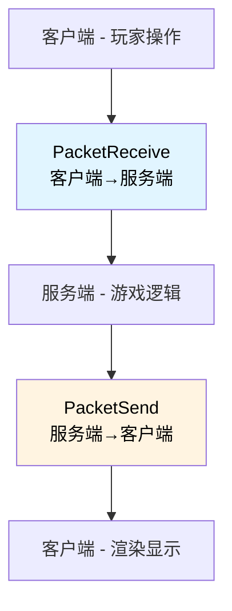
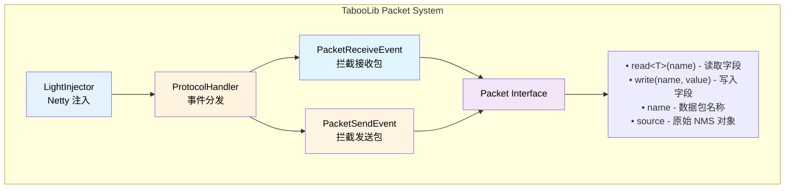
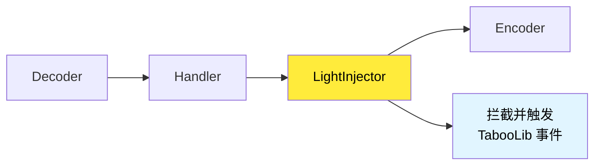

# 数据包篡改

## 核心概念解析

数据包（Packet）是 Minecraft 客户端与服务端之间通信的基本单位。通过拦截和篡改数据包，可以实现许多高级功能，如自定义显示、虚拟实体、假方块等。

### 什么是数据包？

在 Minecraft 中，所有客户端与服务端的交互都通过数据包完成：



**数据包流向：**

1. **PacketReceive（接收）**：客户端发送给服务端的数据包
   - 玩家移动、物品点击、聊天消息等

2. **PacketSend（发送）**：服务端发送给客户端的数据包
   - 实体生成、方块更新、标题显示等

### TabooLib 数据包系统架构

TabooLib 通过 **LightInjector** 实现数据包拦截，并提供了统一的事件 API：



**核心组件：**

- **LightInjector**：基于 Netty 的底层注入器，拦截所有数据包
- **ProtocolHandler**：协议处理器，管理数据包事件的分发和共享
- **Packet 接口**：对 NMS 数据包的封装，提供统一的读写 API
- **PacketSendEvent / PacketReceiveEvent**：可监听的数据包事件

### 底层实现原理

#### 1. Netty 管道注入

Minecraft 服务端使用 Netty 处理网络通信。TabooLib 通过向 Netty 的 Channel Pipeline 注入自定义 Handler 来拦截数据包：



#### 2. 多插件共享机制

为了避免资源浪费，TabooLib 6.2+ 实现了跨插件的数据包共享：

```kotlin
// 只有一个插件会注入 LightInjector
if (Exchanges.contains(PACKET_LISTENER)) {
    // 其他插件通过 OpenAPI 接收共享的事件
    Exchanges["packet_listener/plugin/$pluginId"] = true
} else {
    // 第一个插件负责注入
    instance = LightInjectorImpl(plugin)
}
```

**工作流程：**
1. 第一个使用数据包的 TabooLib 插件注入 LightInjector
2. 其他插件通过 `Exchanges` 标记需要接收数据包事件
3. 当第一个插件卸载时，自动由下一个插件接管

#### 3. 数据包封装

TabooLib 将原始的 NMS 数据包封装为 `Packet` 接口：

```kotlin
class PacketImpl(override var source: Any) : Packet() {
    override val name = source.javaClass.simpleName  // 简单类名
    override val fullyName = source.javaClass.name   // 完整类名

    // 通过反射读取字段
    override fun <T> read(name: String, remap: Boolean): T? {
        return source.getProperty<T>(name, remap = remap)
    }

    // 通过反射写入字段
    override fun write(name: String, value: Any?, remap: Boolean) {
        source.setProperty(name, value, remap = remap)
    }
}
```

**字段映射（remap）：**
- Paper 服务器使用 Mojang 映射（如 `slots`）
- Spigot 服务器使用混淆映射（如 `a`, `b`, `c`）
- `remap = true` 会自动处理映射转换

### 数据包类型概览

Minecraft 中常用的数据包类型：

**客户端→服务端（PacketReceive）：**

| 数据包名称 | 用途 | 常见用途 |
|-----------|------|---------|
| PacketPlayInUseItem | 使用物品 | 右键检测 |
| PacketPlayInBlockPlace | 放置方块 | 方块交互 |
| PacketPlayInWindowClick | 点击窗口 | GUI 拦截 |
| PacketPlayInChat | 聊天消息 | 聊天过滤 |
| PacketPlayInFlying | 移动数据 | 移动检测 |

**服务端→客户端（PacketSend）：**

| 数据包名称 | 用途 | 常见用途 |
|-----------|------|---------|
| PacketPlayOutEntityEquipment | 实体装备 | 自定义装备显示 |
| PacketPlayOutSpawnEntity | 生成实体 | 虚拟实体 |
| PacketPlayOutBlockChange | 方块变化 | 假方块 |
| PacketPlayOutChat | 聊天消息 | 自定义消息格式 |
| PacketPlayOutTitle | 标题显示 | 自定义标题 |
| PacketPlayOutWindowItems | 窗口物品 | 自定义 GUI |

### 关键概念

#### 拦截（Intercept）

通过监听数据包事件并设置 `isCancelled = true` 来阻止数据包继续传递：

```kotlin
@SubscribeEvent
fun onPacket(event: PacketSendEvent) {
    if (event.packet.name == "PacketPlayOutChat") {
        event.isCancelled = true  // 拦截此数据包
    }
}
```

**重要限制（6.2+）：**
- 一旦数据包被拦截（`isCancelled = true`），**无法再放行**
- 设置 `isCancelled = false` 不会恢复已拦截的数据包

#### 篡改（Modify）

在不拦截数据包的情况下，修改其字段值：

```kotlin
@SubscribeEvent
fun onPacket(event: PacketSendEvent) {
    if (event.packet.name == "PacketPlayOutChat") {
        // 读取原始消息
        val message = event.packet.read<String>("message")
        // 修改消息内容
        event.packet.write("message", "[$message]")
    }
}
```

#### 替换（Replace）

完全替换数据包为新的数据包对象：

```kotlin
@SubscribeEvent
fun onPacket(event: PacketSendEvent) {
    if (event.packet.name == "PacketPlayOutSpawnEntity") {
        // 创建新的数据包
        val newPacket = PacketPlayOutSpawnEntityLiving(customEntity)
        // 覆盖原数据包
        event.packet.overwrite(newPacket)
    }
}
```

### 性能考量

数据包操作对性能有一定影响，需要注意：

**高频数据包：**
- `PacketPlayInFlying` - 每 tick 发送（20次/秒）
- `PacketPlayOutEntity*` - 实体移动相关
- `PacketPlayOutMapChunk` - 区块加载

**优化建议：**
1. 只监听必要的数据包（通过 `packet.name` 过滤）
2. 避免在高频数据包中执行复杂逻辑
3. 使用缓存减少重复计算
4. 考虑使用条件判断提前返回

```kotlin
@SubscribeEvent
fun onPacket(event: PacketSendEvent) {
    // ✅ 好的做法：提前过滤
    if (event.packet.name != "PacketPlayOutEntityEquipment") return

    // 后续处理...
}
```

## 数据包拦截与篡改

### 监听数据包事件

TabooLib 提供了两个核心事件用于拦截数据包：

#### PacketSendEvent - 拦截发送包

监听服务端发送给客户端的数据包：

```kotlin
import taboolib.common.platform.event.SubscribeEvent
import taboolib.module.nms.PacketSendEvent

@SubscribeEvent
fun onPacketSend(event: PacketSendEvent) {
    val player = event.player  // 接收数据包的玩家
    val packet = event.packet  // 数据包对象

    // 检查数据包类型
    if (packet.name == "PacketPlayOutChat") {
        // 处理聊天数据包
    }
}
```

**事件参数：**
- `player: Player` - 接收数据包的玩家
- `packet: Packet` - 封装的数据包对象
- `isCancelled: Boolean` - 是否拦截此数据包

#### PacketReceiveEvent - 拦截接收包

监听客户端发送给服务端的数据包：

```kotlin
import taboolib.module.nms.PacketReceiveEvent

@SubscribeEvent
fun onPacketReceive(event: PacketReceiveEvent) {
    val player = event.player  // 发送数据包的玩家
    val packet = event.packet  // 数据包对象

    // 检查数据包类型
    if (packet.name == "PacketPlayInChat") {
        // 处理玩家聊天
    }
}
```

### 判断数据包类型

使用 `packet.name` 判断数据包类型，支持三种方式：

#### 1. 简单类名（推荐）

```kotlin
@SubscribeEvent
fun onPacket(event: PacketSendEvent) {
    // 使用简单类名（跨版本兼容性最好）
    when (event.packet.name) {
        "PacketPlayOutEntityEquipment" -> {
            // 处理实体装备包
        }
        "PacketPlayOutChat" -> {
            // 处理聊天包
        }
    }
}
```

#### 2. Spigot 译名（Paper 专用）

在 Paper 服务器上，可以使用 Spigot 混淆名称：

```kotlin
@SubscribeEvent
fun onPacket(event: PacketSendEvent) {
    // Paper 服务器上的 Spigot 译名
    if (event.packet.nameInSpigot == "PacketPlayOutEntityEquipment") {
        // 仅在 Paper 上生效
    }
}
```

#### 3. 完整类名

```kotlin
@SubscribeEvent
fun onPacket(event: PacketSendEvent) {
    // 使用完整类名
    if (event.packet.fullyName == "net.minecraft.network.protocol.game.PacketPlayOutChat") {
        // 精确匹配
    }
}
```

**版本兼容性建议：**
- ✅ 优先使用 `packet.name`（简单类名）
- ⚠️ 慎用 `nameInSpigot`（仅 Paper 可用）
- ❌ 避免使用 `fullyName`（版本间差异大）

### 拦截数据包

通过设置 `isCancelled = true` 可以阻止数据包发送给玩家：

```kotlin
@SubscribeEvent
fun onPacket(event: PacketSendEvent) {
    // 拦截所有聊天消息
    if (event.packet.name == "PacketPlayOutChat") {
        event.isCancelled = true  // 玩家不会收到此消息
    }
}
```

**重要限制（6.2+）：**

```kotlin
@SubscribeEvent
fun onPacket(event: PacketSendEvent) {
    if (event.packet.name == "PacketPlayOutChat") {
        event.isCancelled = true  // 拦截数据包

        // ❌ 错误：无法再放行已拦截的数据包！
        event.isCancelled = false  // 这不会生效
    }
}
```

一旦数据包被拦截，**无法通过再次设置 `isCancelled = false` 来恢复**。

### 篡改数据包

在不拦截数据包的情况下，可以修改其内部字段：

#### 基础篡改示例

```kotlin
@SubscribeEvent
fun onPacket(event: PacketSendEvent) {
    // 只处理实体装备数据包
    if (event.packet.name != "PacketPlayOutEntityEquipment") return

    // 读取装备列表
    val equipment = event.packet.read<List<Pair<*, ItemStack>>>("slots") ?: return

    // 修改装备（例如：给所有钻石剑添加附魔光效）
    val modifiedEquipment = equipment.map { (slot, item) ->
        if (item.type == Material.DIAMOND_SWORD) {
            // 添加附魔光效
            val meta = item.itemMeta
            meta?.addEnchant(Enchantment.DURABILITY, 1, true)
            item.itemMeta = meta
        }
        slot to item
    }

    // 写回数据包
    event.packet.write("slots", modifiedEquipment)
}
```

**关键方法：**
- `packet.read<T>(字段名)` - 读取数据包字段
- `packet.write(字段名, 值)` - 写入数据包字段

#### 复杂篡改示例（来自 PDF）

篡改实体装备数据包，将物品转换为自定义格式：

```kotlin
@SubscribeEvent
fun onPacketPlayOutEntityEquipment(event: PacketSendEvent) {
    // 过滤数据包类型
    if (event.packet.name != "PacketPlayOutEntityEquipment") {
        return
    }

    // 读取装备槽位列表（NMS 类型）
    val slots = event.packet.read<List<MoJangPair<EnumItemSlot, ItemStack>>>("slots") ?: return

    // 创建修改后的列表
    val modifiedSlots = mutableListOf<MoJangPair<EnumItemSlot, ItemStack>>()

    slots.forEach { pair ->
        // 将 NMS ItemStack 转换为 Bukkit ItemStack
        val bukkitItem = toBukkit(pair.second)

        // 触发自定义事件进行物品处理
        val customEvent = PacketReadItemEvent(event.player, bukkitItem)
        customEvent.call()

        // 将处理后的物品转回 NMS 格式
        val nmsItem = toNMSCopy(customEvent.itemStack)

        // 添加到新列表
        modifiedSlots.add(MoJangPair(pair.first, nmsItem))
    }

    // 写回修改后的装备列表
    event.packet.write("slots", modifiedSlots)
}
```

**代码说明：**
- `MoJangPair` - Mojang 的键值对类型
- `EnumItemSlot` - 装备槽位枚举（主手、副手、头盔等）
- `toBukkit()` - 将 NMS ItemStack 转换为 Bukkit ItemStack
- `toNMSCopy()` - 将 Bukkit ItemStack 转换为 NMS ItemStack

### 条件篡改

根据玩家或其他条件选择性篡改：

```kotlin
@SubscribeEvent
fun onPacket(event: PacketSendEvent) {
    // 只对 VIP 玩家篡改
    if (!event.player.hasPermission("vip.effect")) return

    if (event.packet.name == "PacketPlayOutEntityEquipment") {
        // VIP 玩家看到的所有装备都带光效
        val slots = event.packet.read<List<Pair<*, ItemStack>>>("slots") ?: return

        val enhanced = slots.map { (slot, item) ->
            val newItem = item.clone()
            val meta = newItem.itemMeta
            meta?.addEnchant(Enchantment.LUCK, 1, true)
            meta?.addItemFlags(ItemFlag.HIDE_ENCHANTS)
            newItem.itemMeta = meta
            slot to newItem
        }

        event.packet.write("slots", enhanced)
    }
}
```

### 玩家特定篡改

只对特定玩家篡改数据包：

```kotlin
// 存储需要隐藏装备的玩家
private val hiddenPlayers = mutableSetOf<UUID>()

@SubscribeEvent
fun onPacket(event: PacketSendEvent) {
    // 只对标记的玩家隐藏装备
    if (event.player.uniqueId !in hiddenPlayers) return

    if (event.packet.name == "PacketPlayOutEntityEquipment") {
        // 读取实体 ID
        val entityId = event.packet.read<Int>("entityId") ?: return

        // 如果是其他玩家的装备，替换为空气
        if (entityId != event.player.entityId) {
            val slots = event.packet.read<List<Pair<*, ItemStack>>>("slots") ?: return

            val hidden = slots.map { (slot, _) ->
                slot to ItemStack(Material.AIR)
            }

            event.packet.write("slots", hidden)
        }
    }
}

// 命令：切换装备隐藏
fun toggleEquipmentHidden(player: Player) {
    if (player.uniqueId in hiddenPlayers) {
        hiddenPlayers.remove(player.uniqueId)
        player.sendMessage("装备显示已恢复")
    } else {
        hiddenPlayers.add(player.uniqueId)
        player.sendMessage("装备显示已隐藏")
    }
}
```

### 批量处理数据包

当需要对多个数据包类型执行相同操作时：

```kotlin
@SubscribeEvent
fun onPacket(event: PacketSendEvent) {
    // 批量处理多种实体相关数据包
    when (event.packet.name) {
        "PacketPlayOutSpawnEntity",
        "PacketPlayOutSpawnEntityLiving",
        "PacketPlayOutNamedEntitySpawn" -> {
            handleEntitySpawn(event)
        }
    }
}

private fun handleEntitySpawn(event: PacketSendEvent) {
    // 统一的实体生成处理逻辑
    val entityId = event.packet.read<Int>("entityId") ?: return

    // 自定义处理...
}
```

### Handshake 数据包

对于握手阶段（玩家尚未完全登录）的数据包，使用 `Handshake` 子事件：

```kotlin
@SubscribeEvent
fun onHandshake(event: PacketSendEvent.Handshake) {
    val channel = event.channel  // Netty Channel
    val packet = event.packet    // 数据包对象

    // 处理登录阶段的数据包
}

@SubscribeEvent
fun onHandshake(event: PacketReceiveEvent.Handshake) {
    // 处理客户端握手数据包
}
```

**使用场景：**
- 自定义登录流程
- 服务器状态检测
- 反作弊检测（登录前验证）

## 发送数据包

除了拦截和篡改现有数据包，你还可以主动向玩家发送自定义数据包。

### 基础发送方法

TabooLib 提供了 `sendPacket` 扩展函数用于发送数据包：

```kotlin
import taboolib.module.nms.sendPacket
import org.bukkit.entity.Player

// 发送数据包给玩家（异步）
player.sendPacket(packet)
```

**特性：**
- 异步发送，不会阻塞主线程
- 自动处理玩家连接状态
- 返回 `CompletableFuture<Void>`

### 同步发送

如果需要同步发送数据包（阻塞主线程直到发送完成）：

```kotlin
import taboolib.module.nms.sendPacketBlocking

// 同步发送数据包
player.sendPacketBlocking(packet)
```

**使用场景：**
- 需要保证发送顺序的场景
- 在关键逻辑中需要确保数据包已发送

**性能提示：** 优先使用 `sendPacket`（异步），避免主线程阻塞。

### 构造数据包对象

发送数据包前，需要先构造 NMS 数据包对象。

#### 方法 1：直接构造（推荐）

使用 NMS 类的构造函数直接创建：

```kotlin
import net.minecraft.network.protocol.game.PacketPlayOutChat
import net.minecraft.network.chat.ChatComponentText

// 创建聊天数据包
val chatPacket = PacketPlayOutChat(
    ChatComponentText("Hello, World!"),
    ChatMessageType.SYSTEM,
    player.uniqueId
)

// 发送给玩家
player.sendPacket(chatPacket)
```

#### 方法 2：反射构造

当 NMS 类名跨版本变化时，使用反射构造：

```kotlin
import org.tabooproject.reflex.Reflex.Companion.invokeConstructor
import taboolib.common.reflect.ClassHelper

// 获取 NMS 类
val packetClass = ClassHelper.getClass("net.minecraft.network.protocol.game.PacketPlayOutTitle")

// 通过反射调用构造函数
val titlePacket = packetClass.invokeConstructor(
    /* 参数1 */ titleAction,
    /* 参数2 */ titleComponent,
    /* 参数3 */ fadeIn,
    /* 参数4 */ stay,
    /* 参数5 */ fadeOut
)

player.sendPacket(titlePacket)
```

### 发送虚拟方块

向玩家发送一个假的方块（实际不存在于服务器）：

```kotlin
import net.minecraft.core.BlockPosition
import net.minecraft.network.protocol.game.PacketPlayOutBlockChange
import net.minecraft.world.level.block.Blocks

// 创建方块位置
val blockPos = BlockPosition(x, y, z)

// 创建方块变化数据包
val packet = PacketPlayOutBlockChange(
    blockPos,
    Blocks.DIAMOND_BLOCK.defaultBlockState()  // 钻石块
)

// 发送给玩家
player.sendPacket(packet)
```

**特性：**
- 只有接收数据包的玩家能看到
- 服务器实际方块未改变
- 玩家重新加载区块后会恢复真实方块

**应用场景：**
- 预览建筑效果
- 临时标记位置
- 可视化区域选择

### 发送虚拟头颅方块（PDF 示例）

向玩家发送一个自定义贴图的头颅方块：

```kotlin
import net.minecraft.core.BlockPosition
import net.minecraft.nbt.MojangsonParser
import net.minecraft.network.protocol.game.PacketPlayOutTileEntityData

// 构造 NBT 数据（包含头颅贴图）
val nbt = MojangsonParser.parse("""
    {
        Owner: {
            Id: "014df015-7eba-4ad0-a0e0-83164b7a45f2",
            Properties: {
                textures: [{
                    Value: "自定义贴图 Base64"
                }]
            },
            Name: "自定义方块"
        },
        Rot: ${rot}b,
        x: ${x},
        y: ${y},
        z: ${z},
        id: "minecraft:skull",
        SkullType: 3b
    }
""".trimIndent())

// 创建方块实体数据包
val packet = PacketPlayOutTileEntityData(
    BlockPosition(loc.blockX, loc.blockY, loc.blockZ),
    4,  // 方块实体类型（4 = 头颅）
    nbt
)

// 发送给玩家
player.sendPacket(packet)
```

**代码说明：**
- `MojangsonParser.parse()` - 解析 NBT 格式字符串
- `PacketPlayOutTileEntityData` - 方块实体数据包
- `Value` - 头颅贴图的 Base64 编码

**获取贴图 Base64：**
1. 访问 [minecraft-heads.com](https://minecraft-heads.com/)
2. 选择头颅
3. 复制 `/give` 命令中的 Value 值

### 发送虚拟实体

生成一个只有特定玩家能看到的实体：

```kotlin
import net.minecraft.network.protocol.game.PacketPlayOutSpawnEntityLiving
import net.minecraft.world.entity.EntityTypes

// 创建实体生成数据包
val spawnPacket = PacketPlayOutSpawnEntityLiving().apply {
    // 设置实体 ID（自定义）
    write("entityId", 999999)
    // 设置实体类型
    write("type", EntityTypes.ZOMBIE)
    // 设置位置
    write("x", loc.x)
    write("y", loc.y)
    write("z", loc.z)
    // 设置旋转
    write("yaw", (loc.yaw * 256.0 / 360.0).toInt().toByte())
    write("pitch", (loc.pitch * 256.0 / 360.0).toInt().toByte())
}

// 发送给玩家
player.sendPacket(spawnPacket)
```

**实体类型示例：**
- `EntityTypes.ZOMBIE` - 僵尸
- `EntityTypes.ARMOR_STAND` - 盔甲架
- `EntityTypes.ITEM_FRAME` - 物品展示框

**后续操作：**
发送实体后，还需要发送其他数据包来完善实体：
- `PacketPlayOutEntityMetadata` - 实体元数据（名称、装备等）
- `PacketPlayOutEntityEquipment` - 实体装备
- `PacketPlayOutEntityTeleport` - 实体移动

### 发送标题

向玩家发送标题和副标题：

```kotlin
import net.minecraft.network.protocol.game.PacketPlayOutTitle
import net.minecraft.network.chat.ChatComponentText

// 创建标题数据包
val titlePacket = PacketPlayOutTitle(
    PacketPlayOutTitle.EnumTitleAction.TITLE,  // 标题类型
    ChatComponentText("&6主标题"),
    10,  // 淡入时间（tick）
    70,  // 停留时间（tick）
    20   // 淡出时间（tick）
)

// 创建副标题数据包
val subtitlePacket = PacketPlayOutTitle(
    PacketPlayOutTitle.EnumTitleAction.SUBTITLE,
    ChatComponentText("&7副标题")
)

// 发送给玩家
player.sendPacket(titlePacket)
player.sendPacket(subtitlePacket)
```

### 发送物品

更新玩家背包中的物品显示（不实际改变物品）：

```kotlin
import net.minecraft.network.protocol.game.PacketPlayOutSetSlot

// 创建物品槽位更新数据包
val packet = PacketPlayOutSetSlot(
    0,           // 窗口 ID（0 = 玩家背包）
    36,          // 槽位（36 = 主手槽位）
    nmsItemStack // NMS ItemStack
)

// 发送给玩家
player.sendPacket(packet)
```

**常用槽位：**
- `0-8` - 快捷栏（第 1-9 格）
- `9-35` - 主背包
- `36-39` - 盔甲槽
- `40` - 副手

### 批量发送数据包

向多个玩家发送相同数据包：

```kotlin
// 方法 1：逐个发送
players.forEach { player ->
    player.sendPacket(packet)
}

// 方法 2：使用 Bundle Packet（1.19.4+）
import taboolib.module.nms.PacketSender

val bundlePacket = PacketSender.createBundlePacket(listOf(
    packet1,
    packet2,
    packet3
))

if (bundlePacket != null) {
    players.forEach { it.sendPacket(bundlePacket) }
} else {
    // 不支持 Bundle Packet，逐个发送
    players.forEach { player ->
        player.sendPacket(packet1)
        player.sendPacket(packet2)
        player.sendPacket(packet3)
    }
}
```

**Bundle Packet 优势：**
- 减少网络开销
- 保证数据包顺序
- 仅 Minecraft 1.19.4+ 支持

### 延迟发送

延迟一段时间后发送数据包：

```kotlin
import taboolib.common.platform.function.submit

// 延迟 20 tick（1 秒）后发送
submit(delay = 20) {
    player.sendPacket(packet)
}

// 异步延迟发送
submit(async = true, delay = 20) {
    player.sendPacket(packet)
}
```

### 条件发送

根据条件决定是否发送：

```kotlin
// 只向有权限的玩家发送
if (player.hasPermission("custom.packet")) {
    player.sendPacket(packet)
}

// 向范围内的玩家发送
loc.world.players
    .filter { it.location.distance(loc) <= 50.0 }
    .forEach { it.sendPacket(packet) }
```

### 发送自定义数据包序列

实现复杂效果时，通常需要发送多个数据包：

```kotlin
/**
 * 向玩家展示虚拟实体并在 5 秒后移除
 */
fun showVirtualEntity(player: Player, loc: Location) {
    val entityId = Random.nextInt(100000, 999999)

    // 1. 生成实体
    val spawnPacket = PacketPlayOutSpawnEntityLiving().apply {
        write("entityId", entityId)
        write("type", EntityTypes.ARMOR_STAND)
        write("x", loc.x)
        write("y", loc.y)
        write("z", loc.z)
    }

    // 2. 设置实体元数据（隐身、发光等）
    val metadataPacket = PacketPlayOutEntityMetadata(
        entityId,
        listOf(
            // 设置隐身
            DataWatcher.Item(DataWatcherObject(0, DataWatcherRegistry.BYTE), 0x20.toByte()),
            // 设置自定义名称
            DataWatcher.Item(DataWatcherObject(2, DataWatcherRegistry.STRING), "虚拟实体")
        )
    )

    // 3. 发送数据包
    player.sendPacket(spawnPacket)
    player.sendPacket(metadataPacket)

    // 4. 5 秒后移除实体
    submit(delay = 100) {
        val destroyPacket = PacketPlayOutEntityDestroy(entityId)
        player.sendPacket(destroyPacket)
    }
}
```

## 实战示例

### 示例 1：假方块预览系统

实现一个建筑预览功能，玩家可以看到即将放置的方块，但不会真正改变世界：

```kotlin
import net.minecraft.core.BlockPosition
import net.minecraft.network.protocol.game.PacketPlayOutBlockChange
import net.minecraft.world.level.block.Blocks
import org.bukkit.Location
import org.bukkit.Material
import org.bukkit.entity.Player
import taboolib.module.nms.sendPacket
import taboolib.common.platform.function.submit
import java.util.concurrent.ConcurrentHashMap

object FakeBlockPreview {

    // 存储每个玩家的假方块位置
    private val playerFakeBlocks = ConcurrentHashMap<Player, MutableSet<Location>>()

    /**
     * 向玩家显示假方块
     */
    fun showFakeBlock(player: Player, location: Location, material: Material) {
        val blockPos = BlockPosition(location.blockX, location.blockY, location.blockZ)

        // 获取 NMS 方块状态
        val blockData = when (material) {
            Material.STONE -> Blocks.STONE.defaultBlockState()
            Material.DIAMOND_BLOCK -> Blocks.DIAMOND_BLOCK.defaultBlockState()
            Material.GLASS -> Blocks.GLASS.defaultBlockState()
            else -> Blocks.AIR.defaultBlockState()
        }

        // 创建方块变化数据包
        val packet = PacketPlayOutBlockChange(blockPos, blockData)
        player.sendPacket(packet)

        // 记录假方块位置
        playerFakeBlocks.computeIfAbsent(player) { mutableSetOf() }.add(location)
    }

    /**
     * 批量显示假方块（用于建筑预览）
     */
    fun showFakeStructure(player: Player, blocks: Map<Location, Material>) {
        blocks.forEach { (location, material) ->
            showFakeBlock(player, location, material)
        }

        player.sendMessage("§a预览已生成，共 ${blocks.size} 个方块")
    }

    /**
     * 清除玩家的所有假方块
     */
    fun clearFakeBlocks(player: Player) {
        val fakeBlocks = playerFakeBlocks[player] ?: return

        fakeBlocks.forEach { location ->
            // 发送真实方块数据包以恢复
            val blockPos = BlockPosition(location.blockX, location.blockY, location.blockZ)
            val realBlock = location.block

            // 发送真实方块状态
            val packet = PacketPlayOutBlockChange(blockPos, realBlock.blockData.toNMS())
            player.sendPacket(packet)
        }

        fakeBlocks.clear()
        playerFakeBlocks.remove(player)
        player.sendMessage("§e预览已清除")
    }

    /**
     * 自动清除（玩家退出时）
     */
    @SubscribeEvent
    fun onQuit(event: PlayerQuitEvent) {
        playerFakeBlocks.remove(event.player)
    }
}

// 使用示例
fun previewHouse(player: Player, corner: Location) {
    val blocks = mutableMapOf<Location, Material>()

    // 生成一个 5x5x5 的房子预览
    for (x in 0..4) {
        for (y in 0..4) {
            for (z in 0..4) {
                val loc = corner.clone().add(x.toDouble(), y.toDouble(), z.toDouble())

                // 墙壁和地板
                val material = when {
                    y == 0 -> Material.STONE  // 地板
                    x == 0 || x == 4 || z == 0 || z == 4 -> Material.GLASS  // 墙壁
                    else -> Material.AIR  // 内部空气
                }

                if (material != Material.AIR) {
                    blocks[loc] = material
                }
            }
        }
    }

    FakeBlockPreview.showFakeStructure(player, blocks)

    // 10 秒后自动清除
    submit(delay = 200) {
        FakeBlockPreview.clearFakeBlocks(player)
    }
}
```

**应用场景：**
- WorldEdit 风格的建筑预览
- 领地可视化
- 建筑蓝图系统

### 示例 2：自定义装备光效系统

给特定装备添加附魔光效，只有特定玩家可见：

```kotlin
import net.minecraft.world.entity.EnumItemSlot
import org.bukkit.enchantments.Enchantment
import org.bukkit.entity.Player
import org.bukkit.inventory.ItemFlag
import org.bukkit.inventory.ItemStack
import taboolib.common.platform.event.SubscribeEvent
import taboolib.module.nms.PacketSendEvent

object CustomEnchantGlow {

    // 存储拥有特殊权限的玩家
    private val glowPlayers = mutableSetOf<UUID>()

    /**
     * 启用光效视觉
     */
    fun enableGlow(player: Player) {
        glowPlayers.add(player.uniqueId)
        player.sendMessage("§a已启用装备光效显示")
    }

    /**
     * 禁用光效视觉
     */
    fun disableGlow(player: Player) {
        glowPlayers.remove(player.uniqueId)
        player.sendMessage("§e已禁用装备光效显示")
    }

    /**
     * 给物品添加光效
     */
    private fun addGlowEffect(item: ItemStack): ItemStack {
        val glowItem = item.clone()
        val meta = glowItem.itemMeta ?: return item

        // 添加附魔（创造光效）
        meta.addEnchant(Enchantment.LUCK, 1, true)
        // 隐藏附魔信息
        meta.addItemFlags(ItemFlag.HIDE_ENCHANTS)

        glowItem.itemMeta = meta
        return glowItem
    }

    /**
     * 检查物品是否应该发光
     */
    private fun shouldGlow(item: ItemStack): Boolean {
        // 检查物品 Lore 中是否有特殊标记
        val lore = item.itemMeta?.lore ?: return false
        return lore.any { it.contains("§6[传说]") || it.contains("§5[史诗]") }
    }

    @SubscribeEvent
    fun onPacketSend(event: PacketSendEvent) {
        // 只对启用光效的玩家生效
        if (event.player.uniqueId !in glowPlayers) return

        // 只处理装备数据包
        if (event.packet.name != "PacketPlayOutEntityEquipment") return

        // 读取装备槽位列表
        val slots = event.packet.read<List<Pair<EnumItemSlot, ItemStack>>>("slots") ?: return

        // 篡改装备，添加光效
        val modifiedSlots = slots.map { (slot, item) ->
            if (shouldGlow(item)) {
                slot to addGlowEffect(item)
            } else {
                slot to item
            }
        }

        // 写回数据包
        event.packet.write("slots", modifiedSlots)
    }
}

// 使用示例 - 命令
@CommandHeader("glow")
object GlowCommand {

    @CommandBody
    val toggle = mainCommand {
        execute<Player> { sender, _, _ ->
            if (sender.uniqueId in CustomEnchantGlow.glowPlayers) {
                CustomEnchantGlow.disableGlow(sender)
            } else {
                CustomEnchantGlow.enableGlow(sender)
            }
        }
    }
}
```

**特性：**
- 只对特定玩家显示光效
- 不修改实际物品数据
- 可根据物品 Lore 自动判断

### 示例 3：虚拟 NPC 系统

创建只有特定玩家能看到的 NPC：

```kotlin
import net.minecraft.network.protocol.game.*
import net.minecraft.world.entity.EntityTypes
import org.bukkit.Location
import org.bukkit.entity.Player
import taboolib.module.nms.sendPacket
import taboolib.common.platform.function.submit
import java.util.*
import kotlin.random.Random

data class VirtualNPC(
    val entityId: Int,
    val location: Location,
    val name: String,
    val viewers: MutableSet<UUID> = mutableSetOf()
)

object VirtualNPCManager {

    private val npcs = mutableMapOf<Int, VirtualNPC>()

    /**
     * 创建虚拟 NPC
     */
    fun createNPC(location: Location, name: String): Int {
        val entityId = Random.nextInt(100000, 999999)
        val npc = VirtualNPC(entityId, location, name)
        npcs[entityId] = npc
        return entityId
    }

    /**
     * 向玩家显示 NPC
     */
    fun showNPC(player: Player, entityId: Int) {
        val npc = npcs[entityId] ?: return

        // 1. 生成实体（盔甲架）
        val spawnPacket = PacketPlayOutSpawnEntityLiving().apply {
            write("entityId", npc.entityId)
            write("type", EntityTypes.ARMOR_STAND)
            write("x", npc.location.x)
            write("y", npc.location.y)
            write("z", npc.location.z)
            write("yaw", (npc.location.yaw * 256.0 / 360.0).toInt().toByte())
            write("pitch", 0.toByte())
        }

        // 2. 设置实体元数据
        val metadataPacket = PacketPlayOutEntityMetadata(
            npc.entityId,
            listOf(
                // 隐身
                DataWatcher.Item(DataWatcherObject(0, DataWatcherRegistry.BYTE), 0x20.toByte()),
                // 显示名称
                DataWatcher.Item(DataWatcherObject(2, DataWatcherRegistry.OPTIONAL_COMPONENT),
                    Optional.of(ChatComponentText(npc.name).toIChatBaseComponent())),
                // 始终显示名称
                DataWatcher.Item(DataWatcherObject(3, DataWatcherRegistry.BOOLEAN), true),
                // 小型盔甲架
                DataWatcher.Item(DataWatcherObject(15, DataWatcherRegistry.BYTE), 0x01.toByte())
            )
        )

        // 3. 发送数据包
        player.sendPacket(spawnPacket)
        player.sendPacket(metadataPacket)

        // 记录观看者
        npc.viewers.add(player.uniqueId)
    }

    /**
     * 隐藏 NPC
     */
    fun hideNPC(player: Player, entityId: Int) {
        val npc = npcs[entityId] ?: return

        // 发送实体销毁包
        val destroyPacket = PacketPlayOutEntityDestroy(entityId)
        player.sendPacket(destroyPacket)

        npc.viewers.remove(player.uniqueId)
    }

    /**
     * 移动 NPC
     */
    fun moveNPC(entityId: Int, newLocation: Location) {
        val npc = npcs[entityId] ?: return
        npc.location.apply {
            x = newLocation.x
            y = newLocation.y
            z = newLocation.z
            yaw = newLocation.yaw
            pitch = newLocation.pitch
        }

        // 向所有观看者发送传送包
        val teleportPacket = PacketPlayOutEntityTeleport().apply {
            write("entityId", entityId)
            write("x", newLocation.x)
            write("y", newLocation.y)
            write("z", newLocation.z)
            write("yaw", (newLocation.yaw * 256.0 / 360.0).toInt().toByte())
            write("pitch", (newLocation.pitch * 256.0 / 360.0).toInt().toByte())
        }

        npc.viewers.forEach { uuid ->
            Bukkit.getPlayer(uuid)?.sendPacket(teleportPacket)
        }
    }

    /**
     * 让 NPC 播放动画
     */
    fun playAnimation(entityId: Int, animation: Int) {
        val npc = npcs[entityId] ?: return

        val animationPacket = PacketPlayOutAnimation().apply {
            write("entityId", entityId)
            write("action", animation)  // 0=挥手, 1=受伤, 2=离开床, 3=暴击...
        }

        npc.viewers.forEach { uuid ->
            Bukkit.getPlayer(uuid)?.sendPacket(animationPacket)
        }
    }

    /**
     * 删除 NPC
     */
    fun removeNPC(entityId: Int) {
        val npc = npcs.remove(entityId) ?: return

        // 向所有观看者发送销毁包
        val destroyPacket = PacketPlayOutEntityDestroy(entityId)
        npc.viewers.forEach { uuid ->
            Bukkit.getPlayer(uuid)?.sendPacket(destroyPacket)
        }
    }
}

// 使用示例
fun createQuestNPC(player: Player, location: Location) {
    // 创建 NPC
    val npcId = VirtualNPCManager.createNPC(location, "§6任务 NPC")

    // 显示给玩家
    VirtualNPCManager.showNPC(player, npcId)

    // 2 秒后挥手
    submit(delay = 40) {
        VirtualNPCManager.playAnimation(npcId, 0)  // 挥手动画
    }

    // 5 秒后移动
    submit(delay = 100) {
        val newLoc = location.clone().add(2.0, 0.0, 0.0)
        VirtualNPCManager.moveNPC(npcId, newLoc)
    }

    // 10 秒后删除
    submit(delay = 200) {
        VirtualNPCManager.removeNPC(npcId)
    }
}
```

**功能特性：**
- 完全虚拟的 NPC（服务端无实体）
- 支持动画播放
- 支持移动
- 多玩家可见性控制

## 最佳实践

### 性能优化

#### 1. 提前过滤数据包类型

避免对所有数据包进行不必要的处理：

```kotlin
@SubscribeEvent
fun onPacket(event: PacketSendEvent) {
    // ✅ 好的做法：提前过滤
    if (event.packet.name != "PacketPlayOutEntityEquipment") return

    // 后续处理...
}

// ❌ 坏的做法：不过滤
@SubscribeEvent
fun onPacket(event: PacketSendEvent) {
    val slots = event.packet.read<List<*>>("slots")  // 每个包都尝试读取
    if (slots != null) {
        // 处理...
    }
}
```

#### 2. 缓存数据包构造

对于需要频繁发送的数据包，缓存构造结果：

```kotlin
object PacketCache {
    private val titlePacketCache = ConcurrentHashMap<String, Any>()

    fun getCachedTitlePacket(text: String): Any {
        return titlePacketCache.getOrPut(text) {
            PacketPlayOutTitle(
                PacketPlayOutTitle.EnumTitleAction.TITLE,
                ChatComponentText(text)
            )
        }
    }

    fun clearCache() {
        titlePacketCache.clear()
    }
}
```

#### 3. 批量操作优化

减少数据包发送次数：

```kotlin
// ✅ 好的做法：批量发送
fun sendFakeBlocks(player: Player, blocks: List<Location>) {
    // 1.19.4+ 使用 Bundle Packet
    val packets = blocks.map { createBlockPacket(it) }
    val bundle = PacketSender.createBundlePacket(packets)
    if (bundle != null) {
        player.sendPacket(bundle)
    } else {
        packets.forEach { player.sendPacket(it) }
    }
}

// ❌ 坏的做法：逐个发送且有延迟
fun sendFakeBlocks(player: Player, blocks: List<Location>) {
    blocks.forEachIndexed { index, loc ->
        submit(delay = index.toLong()) {
            player.sendPacket(createBlockPacket(loc))
        }
    }
}
```

#### 4. 避免在高频数据包中执行重操作

```kotlin
@SubscribeEvent
fun onPacket(event: PacketSendEvent) {
    // PacketPlayInFlying 每 tick 发送多次
    if (event.packet.name == "PacketPlayInFlying") {
        // ❌ 避免：数据库查询
        // val data = database.query("SELECT * FROM ...")

        // ✅ 推荐：使用缓存
        val cachedData = playerDataCache[event.player.uniqueId]
    }
}
```

### 内存管理

#### 1. 及时清理玩家数据

```kotlin
object DataManager {
    private val playerData = ConcurrentHashMap<UUID, MutableSet<Any>>()

    @SubscribeEvent
    fun onQuit(event: PlayerQuitEvent) {
        // 玩家退出时清理数据
        playerData.remove(event.player.uniqueId)
    }

    @SubscribeEvent
    fun onDisable(event: PluginDisableEvent) {
        // 插件卸载时清理所有数据
        playerData.clear()
    }
}
```

#### 2. 使用弱引用存储玩家对象

```kotlin
import java.lang.ref.WeakReference

object NPCManager {
    // 使用 WeakReference 避免内存泄漏
    private val npcViewers = mutableMapOf<Int, MutableSet<WeakReference<Player>>>()

    fun addViewer(npcId: Int, player: Player) {
        npcViewers.computeIfAbsent(npcId) { mutableSetOf() }
            .add(WeakReference(player))
    }

    fun getViewers(npcId: Int): List<Player> {
        return npcViewers[npcId]
            ?.mapNotNull { it.get() }  // 过滤已被 GC 的对象
            ?: emptyList()
    }
}
```

### 版本兼容性

#### 1. 使用简单类名而非完整路径

```kotlin
// ✅ 推荐：兼容性最好
if (event.packet.name == "PacketPlayOutEntityEquipment") {
    // ...
}

// ❌ 不推荐：版本间可能变化
if (event.packet.fullyName == "net.minecraft.network.protocol.game.ClientboundSetEquipmentPacket") {
    // ...
}
```

#### 2. 字段名映射处理

```kotlin
// 使用 remap 参数处理 Mojang/Spigot 映射
val slots = event.packet.read<List<*>>("slots", remap = true)  // 自动处理映射

// 或手动处理不同版本
val slots = try {
    event.packet.read<List<*>>("slots")  // 1.17+
} catch (e: Exception) {
    event.packet.read<List<*>>("b")  // 旧版本混淆名
}
```

#### 3. 反射兼容不同版本

```kotlin
import taboolib.common.reflect.ClassHelper

fun createPacketCompat(player: Player, message: String): Any {
    return if (MinecraftVersion.isHigherOrEqual(MinecraftVersion.V1_19)) {
        // 1.19+ 使用新 API
        val componentClass = ClassHelper.getClass("net.minecraft.network.chat.Component")
        val literalMethod = componentClass.getMethod("literal", String::class.java)
        val component = literalMethod.invoke(null, message)

        val packetClass = ClassHelper.getClass("net.minecraft.network.protocol.game.ClientboundSystemChatPacket")
        packetClass.getConstructor(componentClass, Boolean::class.javaPrimitiveType)
            .newInstance(component, false)
    } else {
        // 旧版本
        PacketPlayOutChat(ChatComponentText(message))
    }
}
```

### 线程安全

#### 1. 数据包操作应在主线程

```kotlin
@SubscribeEvent
fun onPacket(event: PacketSendEvent) {
    // 数据包事件本身在 Netty 线程触发

    // ❌ 错误：直接访问 Bukkit API
    val location = event.player.location  // 可能线程不安全

    // ✅ 正确：切换到主线程
    submit {
        val location = event.player.location
        // 处理逻辑...
    }
}
```

#### 2. 并发集合的使用

```kotlin
import java.util.concurrent.ConcurrentHashMap

object Manager {
    // ✅ 使用线程安全的集合
    private val data = ConcurrentHashMap<UUID, MutableSet<Location>>()

    // ❌ 避免使用普通 HashMap
    // private val data = HashMap<UUID, MutableSet<Location>>()
}
```

## 常见问题

### Q1: 数据包被拦截后无法放行？

**问题：**
```kotlin
event.isCancelled = true
// 尝试放行
event.isCancelled = false  // 无效！
```

**原因：** TabooLib 6.2+ 禁止放行已拦截的数据包。

**解决方案：**
使用条件判断，避免先拦截再尝试放行：

```kotlin
@SubscribeEvent
fun onPacket(event: PacketSendEvent) {
    if (event.packet.name == "PacketPlayOutChat") {
        val message = event.packet.read<String>("message") ?: return

        // ✅ 正确：直接判断是否需要拦截
        if (shouldBlock(message)) {
            event.isCancelled = true
        }
    }
}
```

### Q2: 如何查看数据包的所有字段？

**方法 1：使用调试输出**

```kotlin
@SubscribeEvent
fun onPacket(event: PacketSendEvent) {
    if (event.packet.name == "PacketPlayOutEntityEquipment") {
        // 获取源对象的所有字段
        event.packet.source.javaClass.declaredFields.forEach { field ->
            field.isAccessible = true
            println("${field.name} = ${field.get(event.packet.source)}")
        }
    }
}
```

**方法 2：反编译查看 NMS 源码**

1. 下载对应版本的服务端 JAR
2. 使用 JD-GUI 或 IntelliJ IDEA 反编译
3. 查看 `net.minecraft.network.protocol.game` 包下的数据包类

**方法 3：查看 Mojang 映射表**

Paper 服务器提供映射表：
- https://github.com/PaperMC/paperweight-test-plugin

### Q3: 读取字段时返回 null？

**可能原因：**

1. **字段名错误**
```kotlin
// ❌ 字段名拼写错误
val value = event.packet.read<Int>("enityId")  // 正确是 "entityId"

// ✅ 检查字段名
val value = event.packet.read<Int>("entityId")
```

2. **类型不匹配**
```kotlin
// ❌ 类型错误
val value = event.packet.read<String>("entityId")  // entityId 是 Int

// ✅ 使用正确类型
val value = event.packet.read<Int>("entityId")
```

3. **版本差异**
```kotlin
// 不同版本字段名可能不同
val value = event.packet.read<Int>("a")  // Spigot 混淆名
    ?: event.packet.read<Int>("entityId")  // Mojang 映射名
```

### Q4: 如何处理不同服务端核心的兼容性？

**策略 1：使用 remap 参数**

```kotlin
// TabooLib 会自动处理 Paper/Spigot 差异
val value = event.packet.read<Int>("entityId", remap = true)
```

**策略 2：版本检测**

```kotlin
import taboolib.module.nms.MinecraftVersion

if (MinecraftVersion.isUniversal) {
    // Paper 服务器（使用 Mojang 映射）
    val value = event.packet.read<Int>("entityId")
} else {
    // Spigot 服务器（使用混淆名）
    val value = event.packet.read<Int>("a")
}
```

**策略 3：异常捕获**

```kotlin
val value = try {
    event.packet.read<Int>("entityId")
} catch (e: Exception) {
    event.packet.read<Int>("a")  // 降级到混淆名
}
```

### Q5: 为什么虚拟实体/方块在玩家重新进入区块后消失？

**原因：** 当玩家重新加载区块时，服务端会发送真实的区块数据，覆盖虚拟数据包。

**解决方案 1：监听区块加载并重新发送**

```kotlin
@SubscribeEvent
fun onChunkLoad(event: PacketSendEvent) {
    if (event.packet.name == "PacketPlayOutMapChunk") {
        // 玩家加载区块时，重新发送虚拟方块
        submit(delay = 1) {  // 稍微延迟确保区块加载完成
            resendFakeBlocks(event.player)
        }
    }
}
```

**解决方案 2：持续追踪并更新**

```kotlin
object FakeEntityManager {
    private val entities = mutableMapOf<UUID, List<Int>>()

    fun trackEntity(player: Player, entityId: Int) {
        entities.computeIfAbsent(player.uniqueId) { mutableListOf() }
            .add(entityId)

        // 定时检查并重新发送
        submit(period = 100, async = true) {
            if (!player.isOnline) {
                entities.remove(player.uniqueId)
                return@submit
            }
            resendEntity(player, entityId)
        }
    }
}
```

### Q6: 数据包发送给玩家但没有效果？

**检查清单：**

1. **数据包构造是否正确**
```kotlin
// 确保所有必需字段都已设置
val packet = PacketPlayOutSpawnEntity().apply {
    write("entityId", id)
    write("uuid", UUID.randomUUID())
    write("type", EntityTypes.ZOMBIE)
    write("x", loc.x)
    write("y", loc.y)
    write("z", loc.z)
    // ... 其他必需字段
}
```

2. **数据包发送时机**
```kotlin
// ❌ 玩家尚未完全登录
@SubscribeEvent
fun onJoin(event: PlayerJoinEvent) {
    event.player.sendPacket(packet)  // 可能太早
}

// ✅ 延迟发送
@SubscribeEvent
fun onJoin(event: PlayerJoinEvent) {
    submit(delay = 20) {  // 1 秒后
        event.player.sendPacket(packet)
    }
}
```

3. **客户端版本兼容性**
```kotlin
// 确保数据包在目标版本上存在和有效
if (MinecraftVersion.majorLegacy >= 11900) {  // 1.19+
    player.sendPacket(newVersionPacket)
} else {
    player.sendPacket(oldVersionPacket)
}
```

### Q7: 如何调试数据包？

**方法 1：日志输出**

```kotlin
@SubscribeEvent
fun onPacket(event: PacketSendEvent) {
    println("Packet: ${event.packet.name}")
    println("Player: ${event.player.name}")
    println("Source: ${event.packet.source}")
}
```

**方法 2：拦截特定数据包进行测试**

```kotlin
@SubscribeEvent
fun onPacket(event: PacketSendEvent) {
    if (event.packet.name == "PacketPlayOutChat") {
        val message = event.packet.read<Any>("message")
        println("Chat Message: $message")
        println("Message Type: ${message?.javaClass}")
    }
}
```

**方法 3：使用 ProtocolLib**

如果需要更深入的调试，可以结合 ProtocolLib 使用：
- 查看完整的数据包结构
- 修改后对比差异

### Q8: 多个插件同时修改数据包会冲突吗？

**TabooLib 的处理机制：**

所有使用 TabooLib 6.2+ 的插件共享同一个数据包监听器，按插件加载顺序依次处理。

```kotlin
// 插件 A
@SubscribeEvent(priority = EventPriority.HIGH)
fun onPacket(event: PacketSendEvent) {
    // 优先级高，先执行
}

// 插件 B
@SubscribeEvent(priority = EventPriority.NORMAL)
fun onPacket(event: PacketSendEvent) {
    // 优先级普通，后执行
}
```

**避免冲突的建议：**
1. 使用事件优先级控制执行顺序
2. 只修改自己关心的字段
3. 避免拦截可能被其他插件需要的数据包

