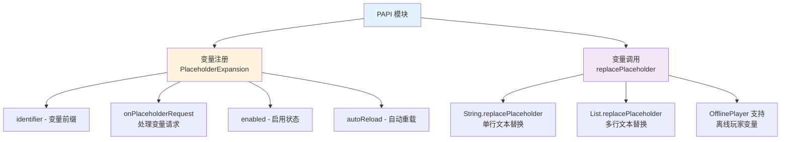

# PlaceholderAPI 变量

PlaceholderAPI (PAPI) 是 Bukkit 平台上广泛使用的变量系统，TabooLib 提供了快捷的 PAPI 变量注册与调用方法，让开发者无需关心底层实现细节。

## 核心概念解析

TabooLib 的 PAPI 模块由两个核心功能组成：



**关键概念：**
- **PlaceholderExpansion**：变量扩展接口，用于注册自定义变量
- **identifier**：变量前缀标识符，例如 `%identifier_参数%`
- **replacePlaceholder**：扩展函数，用于替换文本中的 PAPI 变量

## 变量注册

### 基础用法

通过继承 `PlaceholderExpansion` 接口并实现方法来注册变量：

```kotlin
import taboolib.platform.compat.PlaceholderExpansion
import org.bukkit.entity.Player

object ExamplePapiHook : PlaceholderExpansion {

    // 变量前缀（必须实现）
    override val identifier: String = "example"

    // 处理变量请求（必须实现）
    override fun onPlaceholderRequest(player: Player?, args: String): String {
        // player: 当前玩家（可能为 null）
        // args: 变量参数部分
        return when (args) {
            "name" -> player?.name ?: "未知玩家"
            "health" -> player?.health?.toInt()?.toString() ?: "0"
            "level" -> player?.level?.toString() ?: "0"
            else -> "未知变量"
        }
    }
}
```

**代码说明：**
- `identifier`：定义变量前缀为 `example`，使用时格式为 `%example_参数%`
- `onPlaceholderRequest`：处理变量请求，根据 `args` 参数返回对应的值
- `player` 参数可能为 `null`，需要进行空值检查

**变量使用示例：**
```
%example_name%    → 返回玩家名称
%example_health%  → 返回玩家生命值
%example_level%   → 返回玩家等级
```

### 高级配置

#### 启用控制

通过 `enabled` 属性控制变量是否注册：

```kotlin
object ExamplePapiHook : PlaceholderExpansion {

    override val identifier: String = "example"

    // 控制是否启用此变量扩展
    override val enabled: Boolean
        get() = ConfigManager.getBoolean("papi.enabled", true)

    override fun onPlaceholderRequest(player: Player?, args: String): String {
        return "Hello"
    }
}
```

**适用场景：** 根据配置文件动态启用或禁用 PAPI 变量

#### 自动重载

当 PlaceholderAPI 卸载扩展时自动重新注册：

```kotlin
object ExamplePapiHook : PlaceholderExpansion {

    override val identifier: String = "example"

    // 启用自动重载
    override val autoReload: Boolean = true

    override fun onPlaceholderRequest(player: Player?, args: String): String {
        return "Hello"
    }
}
```

**代码说明：**
- `autoReload = true`：当 PAPI 卸载此扩展时，TabooLib 会自动重新注册
- 默认值为 `false`，通常不需要开启

**适用场景：** 避免使用 `/papi reload` 后变量失效

#### 离线玩家支持

支持离线玩家的变量请求：

```kotlin
import org.bukkit.OfflinePlayer

object ExamplePapiHook : PlaceholderExpansion {

    override val identifier: String = "example"

    // 处理在线玩家请求
    override fun onPlaceholderRequest(player: Player?, args: String): String {
        return when (args) {
            "name" -> player?.name ?: "未知"
            "online" -> if (player?.isOnline == true) "在线" else "离线"
            else -> "未知变量"
        }
    }

    // 处理离线玩家请求
    override fun onPlaceholderRequest(player: OfflinePlayer?, args: String): String {
        return when (args) {
            "name" -> player?.name ?: "未知"
            "lastplayed" -> player?.lastPlayed?.toString() ?: "从未登录"
            "uuid" -> player?.uniqueId?.toString() ?: "未知"
            else -> {
                // 如果玩家在线，调用在线玩家方法
                if (player?.isOnline == true) {
                    return onPlaceholderRequest(player.player, args)
                }
                "未知变量"
            }
        }
    }
}
```

**代码说明：**
- 实现两个 `onPlaceholderRequest` 方法，分别处理在线和离线玩家
- 离线玩家方法可以调用在线玩家方法来复用逻辑
- 离线玩家可以获取 `lastPlayed`、`uuid` 等持久化数据

**适用场景：** 在计分板、GUI 中显示离线玩家数据

### 变量参数解析

#### 单参数

```kotlin
object ExamplePapiHook : PlaceholderExpansion {

    override val identifier: String = "example"

    override fun onPlaceholderRequest(player: Player?, args: String): String {
        // args 直接是参数内容
        // 例如：%example_name% → args = "name"
        return when (args) {
            "name" -> player?.name ?: "未知"
            "world" -> player?.world?.name ?: "未知"
            else -> "未知变量"
        }
    }
}
```

#### 多参数（带分隔符）

```kotlin
object ExamplePapiHook : PlaceholderExpansion {

    override val identifier: String = "stats"

    override fun onPlaceholderRequest(player: Player?, args: String): String {
        // 使用下划线分隔参数
        // 例如：%stats_player_kills% → args = "player_kills"
        val parts = args.split("_")

        return when {
            parts.size == 2 && parts[0] == "player" -> {
                when (parts[1]) {
                    "kills" -> getPlayerKills(player)
                    "deaths" -> getPlayerDeaths(player)
                    "kdr" -> getPlayerKDR(player)
                    else -> "未知统计"
                }
            }
            parts.size == 2 && parts[0] == "top" -> {
                val rank = parts[1].toIntOrNull() ?: return "无效排名"
                getTopPlayer(rank)
            }
            else -> "参数错误"
        }
    }

    private fun getPlayerKills(player: Player?): String {
        // 获取玩家击杀数的逻辑
        return "0"
    }

    private fun getPlayerDeaths(player: Player?): String {
        // 获取玩家死亡数的逻辑
        return "0"
    }

    private fun getPlayerKDR(player: Player?): String {
        // 获取 K/D 比率的逻辑
        return "0.0"
    }

    private fun getTopPlayer(rank: Int): String {
        // 获取排行榜玩家的逻辑
        return "玩家${rank}"
    }
}
```

**变量使用示例：**
```
%stats_player_kills%  → 玩家击杀数
%stats_player_deaths% → 玩家死亡数
%stats_player_kdr%    → K/D 比率
%stats_top_1%         → 排行榜第一名
%stats_top_10%        → 排行榜第十名
```

#### 数字参数

```kotlin
object ExamplePapiHook : PlaceholderExpansion {

    override val identifier: String = "rank"

    override fun onPlaceholderRequest(player: Player?, args: String): String {
        // 解析数字参数
        val rank = args.toIntOrNull()

        return if (rank != null) {
            // 返回排行榜第 N 名的玩家名称
            getRankPlayerName(rank)
        } else {
            "参数必须是数字"
        }
    }

    private fun getRankPlayerName(rank: Int): String {
        // 获取排行榜数据的逻辑
        return "排行${rank}玩家"
    }
}
```

**变量使用示例：**
```
%rank_1%   → 第一名玩家
%rank_10%  → 第十名玩家
```

## 变量调用

TabooLib 提供了扩展函数用于快速替换文本中的 PAPI 变量。

### 单行文本替换

```kotlin
import taboolib.platform.compat.replacePlaceholder
import org.bukkit.entity.Player

fun sendWelcome(player: Player) {
    // 替换字符串中的 PAPI 变量
    val message = "欢迎 %player_name% 来到服务器！".replacePlaceholder(player)
    player.sendMessage(message)
}
```

**代码说明：**
- `replacePlaceholder(player)` 方法会自动调用 PlaceholderAPI 替换变量
- 支持所有已注册的 PAPI 变量（包括 TabooLib 和其他插件注册的）
- 如果 PlaceholderAPI 未安装，返回原始文本

### 多行文本替换

```kotlin
import taboolib.platform.compat.replacePlaceholder
import org.bukkit.entity.Player

fun sendServerInfo(player: Player) {
    val lines = listOf(
        "===== 服务器信息 =====",
        "玩家名称：%player_name%",
        "当前世界：%player_world%",
        "玩家等级：%player_level%",
        "生命值：%player_health%/%player_max_health%",
        "======================"
    )

    // 批量替换列表中的 PAPI 变量
    val replaced = lines.replacePlaceholder(player)
    replaced.forEach { player.sendMessage(it) }
}
```

**代码说明：**
- `List<String>.replacePlaceholder(player)` 会对列表中每一行执行变量替换
- 返回新的 `List<String>`，不会修改原列表

### 离线玩家替换

```kotlin
import taboolib.platform.compat.replacePlaceholder
import org.bukkit.OfflinePlayer

fun getOfflinePlayerInfo(offlinePlayer: OfflinePlayer): String {
    // 支持离线玩家的变量替换
    val info = """
        玩家名称：%player_name%
        UUID：%player_uuid%
        最后登录：%player_lastplayed%
    """.trimIndent()

    return info.replacePlaceholder(offlinePlayer)
}
```

**代码说明：**
- 使用 `OfflinePlayer` 作为参数可以获取离线玩家数据
- 只有支持 `OfflinePlayer` 的变量才能正常工作

### 在配置文件中使用

```kotlin
import taboolib.module.configuration.Config
import taboolib.module.configuration.Configuration
import taboolib.platform.compat.replacePlaceholder
import org.bukkit.entity.Player

object MessageConfig {

    @Config("messages.yml")
    lateinit var config: Configuration

    fun sendConfigMessage(player: Player, path: String) {
        val message = config.getString(path) ?: return

        // 替换颜色代码和 PAPI 变量
        val replaced = message
            .replace("&", "§")
            .replacePlaceholder(player)

        player.sendMessage(replaced)
    }

    fun sendConfigMessages(player: Player, path: String) {
        val messages = config.getStringList(path)

        // 批量替换并发送
        messages
            .map { it.replace("&", "§") }
            .replacePlaceholder(player)
            .forEach { player.sendMessage(it) }
    }
}
```

**配置文件示例（messages.yml）：**
```yaml
welcome: "&a欢迎 %player_name% 来到服务器！"
player-info:
  - "&8[&6玩家信息&8]"
  - "&7名称：&f%player_name%"
  - "&7等级：&f%player_level%"
  - "&7生命：&c%player_health%&7/&c%player_max_health%"
  - "&7世界：&f%player_world%"
```

### 与语言文件集成

```kotlin
import taboolib.module.lang.sendLang
import taboolib.module.lang.asLangText
import taboolib.platform.compat.replacePlaceholder
import org.bukkit.entity.Player

// 语言文件支持 PAPI 变量
// lang/zh_CN.yml:
// welcome: "&a欢迎 %player_name% 来到 %server_name%！"
// player-stats: "你的统计数据：击杀 %stats_kills% 死亡 %stats_deaths%"

fun sendWelcomeWithPAPI(player: Player) {
    // 方法 1：先获取语言文本，再替换 PAPI 变量
    val text = player.asLangText("welcome")
    val replaced = text.replacePlaceholder(player)
    player.sendMessage(replaced)

    // 方法 2：创建扩展函数简化调用
    player.sendLangWithPAPI("player-stats")
}

// 扩展函数：同时处理语言文件和 PAPI
fun Player.sendLangWithPAPI(node: String, vararg args: Any) {
    val text = this.asLangText(node, *args)
    val replaced = text.replacePlaceholder(this)
    this.sendMessage(replaced)
}

fun Player.asLangTextWithPAPI(node: String, vararg args: Any): String {
    val text = this.asLangText(node, *args)
    return text.replacePlaceholder(this)
}
```

## 最佳实践示例

### 完整的玩家统计系统

```kotlin
package com.example.plugin.papi

import taboolib.platform.compat.PlaceholderExpansion
import org.bukkit.entity.Player
import org.bukkit.OfflinePlayer
import com.example.plugin.manager.StatsManager
import java.text.DecimalFormat

/**
 * 玩家统计 PAPI 变量
 * 变量前缀：stats
 */
object StatsPapiHook : PlaceholderExpansion {

    override val identifier: String = "stats"

    override val enabled: Boolean = true

    private val decimalFormat = DecimalFormat("0.00")

    override fun onPlaceholderRequest(player: Player?, args: String): String {
        if (player == null) return "0"

        val parts = args.split("_")

        return when {
            // %stats_kills%
            args == "kills" -> StatsManager.getKills(player).toString()

            // %stats_deaths%
            args == "deaths" -> StatsManager.getDeaths(player).toString()

            // %stats_kdr%
            args == "kdr" -> {
                val kills = StatsManager.getKills(player)
                val deaths = StatsManager.getDeaths(player)
                if (deaths == 0) kills.toString()
                else decimalFormat.format(kills.toDouble() / deaths)
            }

            // %stats_level%
            args == "level" -> StatsManager.getLevel(player).toString()

            // %stats_exp%
            args == "exp" -> StatsManager.getExp(player).toString()

            // %stats_rank%
            args == "rank" -> StatsManager.getRank(player).toString()

            // %stats_top_<排名>_<类型>%
            // 例如：%stats_top_1_kills% → 击杀榜第一名
            parts.size == 3 && parts[0] == "top" -> {
                val rank = parts[1].toIntOrNull() ?: return "无效排名"
                val type = parts[2]
                getTopPlayerValue(rank, type)
            }

            // %stats_topname_<排名>_<类型>%
            // 例如：%stats_topname_1_kills% → 击杀榜第一名的玩家名
            parts.size == 3 && parts[0] == "topname" -> {
                val rank = parts[1].toIntOrNull() ?: return "无效排名"
                val type = parts[2]
                getTopPlayerName(rank, type)
            }

            else -> "未知变量"
        }
    }

    override fun onPlaceholderRequest(player: OfflinePlayer?, args: String): String {
        // 离线玩家支持部分统计
        if (player == null) return "0"

        return when (args) {
            "kills" -> StatsManager.getKillsOffline(player.uniqueId).toString()
            "deaths" -> StatsManager.getDeathsOffline(player.uniqueId).toString()
            "level" -> StatsManager.getLevelOffline(player.uniqueId).toString()
            else -> {
                // 如果在线则调用在线方法
                if (player.isOnline) {
                    return onPlaceholderRequest(player.player, args)
                }
                "玩家离线"
            }
        }
    }

    private fun getTopPlayerValue(rank: Int, type: String): String {
        val topList = when (type) {
            "kills" -> StatsManager.getTopKills()
            "deaths" -> StatsManager.getTopDeaths()
            "level" -> StatsManager.getTopLevel()
            else -> return "未知类型"
        }

        return topList.getOrNull(rank - 1)?.value?.toString() ?: "0"
    }

    private fun getTopPlayerName(rank: Int, type: String): String {
        val topList = when (type) {
            "kills" -> StatsManager.getTopKills()
            "deaths" -> StatsManager.getTopDeaths()
            "level" -> StatsManager.getTopLevel()
            else -> return "未知类型"
        }

        return topList.getOrNull(rank - 1)?.playerName ?: "无"
    }
}
```

**变量使用示例：**
```yaml
# 在计分板中使用
scoreboard:
  title: "&6&l玩家统计"
  lines:
    - "&7击杀：&a%stats_kills%"
    - "&7死亡：&c%stats_deaths%"
    - "&7K/D：&e%stats_kdr%"
    - "&7等级：&b%stats_level%"
    - "&7排名：&6#%stats_rank%"
    - ""
    - "&6排行榜"
    - "&e1. &f%stats_topname_1_kills% &7- &a%stats_top_1_kills%"
    - "&e2. &f%stats_topname_2_kills% &7- &a%stats_top_2_kills%"
    - "&e3. &f%stats_topname_3_kills% &7- &a%stats_top_3_kills%"
```

### 经济系统集成

```kotlin
package com.example.plugin.papi

import taboolib.platform.compat.PlaceholderExpansion
import org.bukkit.entity.Player
import org.bukkit.OfflinePlayer
import com.example.plugin.manager.EconomyManager
import java.text.NumberFormat
import java.util.Locale

/**
 * 经济系统 PAPI 变量
 * 变量前缀：eco
 */
object EconomyPapiHook : PlaceholderExpansion {

    override val identifier: String = "eco"

    private val numberFormat = NumberFormat.getNumberInstance(Locale.CHINA)

    override fun onPlaceholderRequest(player: Player?, args: String): String {
        if (player == null) return "0"

        return when (args) {
            // %eco_balance% → 玩家余额
            "balance" -> {
                val balance = EconomyManager.getBalance(player)
                numberFormat.format(balance)
            }

            // %eco_balance_raw% → 玩家余额（原始数字）
            "balance_raw" -> EconomyManager.getBalance(player).toString()

            // %eco_balance_short% → 玩家余额（缩写，如 1.5K）
            "balance_short" -> formatShort(EconomyManager.getBalance(player))

            // %eco_bank% → 银行余额
            "bank" -> {
                val bank = EconomyManager.getBankBalance(player)
                numberFormat.format(bank)
            }

            // %eco_total% → 总资产（余额+银行）
            "total" -> {
                val total = EconomyManager.getBalance(player) +
                           EconomyManager.getBankBalance(player)
                numberFormat.format(total)
            }

            // %eco_rank% → 财富排名
            "rank" -> EconomyManager.getWealthRank(player).toString()

            else -> "0"
        }
    }

    override fun onPlaceholderRequest(player: OfflinePlayer?, args: String): String {
        if (player == null) return "0"

        return when (args) {
            "balance" -> {
                val balance = EconomyManager.getBalanceOffline(player.uniqueId)
                numberFormat.format(balance)
            }
            "balance_raw" -> EconomyManager.getBalanceOffline(player.uniqueId).toString()
            "balance_short" -> formatShort(EconomyManager.getBalanceOffline(player.uniqueId))
            else -> {
                if (player.isOnline) {
                    return onPlaceholderRequest(player.player, args)
                }
                "0"
            }
        }
    }

    private fun formatShort(value: Double): String {
        return when {
            value >= 1_000_000_000 -> String.format("%.1fB", value / 1_000_000_000)
            value >= 1_000_000 -> String.format("%.1fM", value / 1_000_000)
            value >= 1_000 -> String.format("%.1fK", value / 1_000)
            else -> value.toInt().toString()
        }
    }
}
```

**变量使用示例：**
```yaml
# GUI 物品显示
shop-item:
  material: DIAMOND
  name: "&b钻石"
  lore:
    - "&7价格：&e1000 金币"
    - "&7你的余额：&a%eco_balance%"
    - "&7购买后余额：&a%eco_balance_raw - 1000%"  # 需要配合其他插件实现计算
    - ""
    - "&e点击购买"
```

### 多语言 PAPI 变量

```kotlin
package com.example.plugin.papi

import taboolib.platform.compat.PlaceholderExpansion
import org.bukkit.entity.Player
import taboolib.module.lang.asLangText

/**
 * 多语言 PAPI 变量
 * 变量前缀：lang
 */
object LanguagePapiHook : PlaceholderExpansion {

    override val identifier: String = "lang"

    override fun onPlaceholderRequest(player: Player?, args: String): String {
        if (player == null) return ""

        // 将 PAPI 参数映射到语言节点
        // 例如：%lang_welcome% → 读取语言文件的 "welcome" 节点
        return player.asLangText(args)
    }
}
```

**用途说明：**

允许在不支持多语言的插件（如计分板插件）中使用 TabooLib 的语言文件：

```yaml
# DeluxeScoreboard 配置
scoreboard:
  title: "%lang_scoreboard_title%"
  lines:
    - "%lang_scoreboard_line1%"
    - "%lang_scoreboard_line2%"
    - "%lang_scoreboard_line3%"

# TabooLib 语言文件 lang/zh_CN.yml
scoreboard_title: "&6&l服务器计分板"
scoreboard_line1: "&7玩家：&f%player_name%"
scoreboard_line2: "&7金币：&e%eco_balance%"
scoreboard_line3: "&7等级：&b%stats_level%"

# TabooLib 语言文件 lang/en_US.yml
scoreboard_title: "&6&lServer Scoreboard"
scoreboard_line1: "&7Player: &f%player_name%"
scoreboard_line2: "&7Money: &e%eco_balance%"
scoreboard_line3: "&7Level: &b%stats_level%"
```

### 性能优化：缓存机制

```kotlin
package com.example.plugin.papi

import taboolib.platform.compat.PlaceholderExpansion
import org.bukkit.entity.Player
import taboolib.common.platform.function.submit
import java.util.UUID
import java.util.concurrent.ConcurrentHashMap

/**
 * 带缓存的 PAPI 变量
 * 适用于数据库查询等耗时操作
 */
object CachedPapiHook : PlaceholderExpansion {

    override val identifier: String = "cached"

    // 缓存数据
    private val cache = ConcurrentHashMap<UUID, PlayerData>()

    // 缓存有效期（毫秒）
    private const val CACHE_DURATION = 5000L

    data class PlayerData(
        val kills: Int,
        val deaths: Int,
        val level: Int,
        val timestamp: Long
    )

    init {
        // 定时清理过期缓存
        submit(async = true, period = 100L) {
            val now = System.currentTimeMillis()
            cache.entries.removeIf { (_, data) ->
                now - data.timestamp > CACHE_DURATION
            }
        }
    }

    override fun onPlaceholderRequest(player: Player?, args: String): String {
        if (player == null) return "0"

        // 获取或更新缓存
        val data = getOrUpdateCache(player)

        return when (args) {
            "kills" -> data.kills.toString()
            "deaths" -> data.deaths.toString()
            "level" -> data.level.toString()
            "kdr" -> {
                if (data.deaths == 0) data.kills.toString()
                else String.format("%.2f", data.kills.toDouble() / data.deaths)
            }
            else -> "0"
        }
    }

    private fun getOrUpdateCache(player: Player): PlayerData {
        val uuid = player.uniqueId
        val cached = cache[uuid]
        val now = System.currentTimeMillis()

        // 缓存有效
        if (cached != null && now - cached.timestamp < CACHE_DURATION) {
            return cached
        }

        // 从数据库加载数据（耗时操作）
        val data = PlayerData(
            kills = DatabaseManager.getKills(uuid),
            deaths = DatabaseManager.getDeaths(uuid),
            level = DatabaseManager.getLevel(uuid),
            timestamp = now
        )

        cache[uuid] = data
        return data
    }

    // 手动刷新缓存
    fun refreshCache(player: Player) {
        cache.remove(player.uniqueId)
    }
}

// 数据库管理器（示例）
object DatabaseManager {
    fun getKills(uuid: UUID): Int = 0
    fun getDeaths(uuid: UUID): Int = 0
    fun getLevel(uuid: UUID): Int = 0
}
```

**代码说明：**
- 使用 `ConcurrentHashMap` 缓存数据，避免频繁查询数据库
- 设置缓存有效期为 5 秒，过期后自动更新
- 定时清理过期缓存，防止内存泄漏

## 常见问题

### PlaceholderAPI 未安装怎么办？

TabooLib 的 `replacePlaceholder` 方法会自动检测 PlaceholderAPI 是否存在：

```kotlin
// PlaceholderExpansion.kt 源码
fun String.replacePlaceholder(player: Player): String {
    return try {
        PlaceholderAPI.setPlaceholders(player, this)
    } catch (ex: NoClassDefFoundError) {
        // PlaceholderAPI 不存在时返回原始文本
        this
    }
}
```

**结论：** 即使服务器未安装 PlaceholderAPI，代码也不会报错，只是不会替换变量。

### 如何调试 PAPI 变量？

```kotlin
import org.bukkit.command.Command
import org.bukkit.command.CommandSender
import org.bukkit.entity.Player
import taboolib.platform.compat.replacePlaceholder

// 创建测试命令
@CommandHeader("papitest")
object PapiTestCommand {

    @CommandBody
    val test = subCommand {
        dynamic("variable") {
            execute<Player> { sender, context, _ ->
                val variable = context.argument(-1)

                // 测试变量替换
                val original = "%$variable%"
                val replaced = original.replacePlaceholder(sender)

                sender.sendMessage("§7原始: §f$original")
                sender.sendMessage("§7结果: §f$replaced")

                // 检查是否替换成功
                if (original == replaced) {
                    sender.sendMessage("§c变量未被替换！可能的原因：")
                    sender.sendMessage("§c1. PlaceholderAPI 未安装")
                    sender.sendMessage("§c2. 变量不存在")
                    sender.sendMessage("§c3. 变量扩展未启用")
                } else {
                    sender.sendMessage("§a变量替换成功！")
                }
            }
        }
    }
}
```

**使用方式：**
```
/papitest example_name
→ 原始: %example_name%
→ 结果: Steve
→ 变量替换成功！
```

### 如何查看已注册的变量？

```kotlin
import me.clip.placeholderapi.PlaceholderAPIPlugin
import org.bukkit.command.CommandSender

fun listAllExpansions(sender: CommandSender) {
    val expansions = PlaceholderAPIPlugin.getInstance()
        .localExpansionManager
        .expansions

    sender.sendMessage("§6已注册的 PAPI 变量扩展：")
    expansions.forEach { expansion ->
        sender.sendMessage("§7- §f${expansion.identifier} §7(${expansion.author})")
    }
}
```

### 变量在某些插件中不工作？

**原因：** 部分插件会在服务器启动早期加载配置，此时 PlaceholderAPI 尚未注册变量。

**解决方案 1：** 使用 PAPI 的 `%papi_placeholder%` 格式

**解决方案 2：** 延迟加载配置

```kotlin
import taboolib.common.platform.Awake
import taboolib.common.LifeCycle
import taboolib.common.platform.function.submit

@Awake(LifeCycle.ENABLE)
fun delayLoad() {
    // 延迟 5 秒加载配置
    submit(delay = 100L) {
        // 重新加载配置
        reloadConfig()
    }
}
```

### 如何支持关系型变量？

关系型变量格式：`%rel_变量前缀_参数%`，用于显示两个玩家之间的关系。

```kotlin
import me.clip.placeholderapi.expansion.Relational

object RelationalPapiHook : PlaceholderExpansion {

    override val identifier: String = "relation"

    // 普通变量请求（兼容）
    override fun onPlaceholderRequest(player: Player?, args: String): String {
        return "不支持单玩家变量"
    }

    // 关系型变量需要实现 me.clip.placeholderapi.expansion.Relational
    // 注意：这需要直接继承 PAPI 的 PlaceholderExpansion 类
}

// 完整实现示例
import me.clip.placeholderapi.expansion.PlaceholderExpansion as PAPIExpansion

class RelationalExpansion : PAPIExpansion(), me.clip.placeholderapi.expansion.Relational {

    override fun getIdentifier(): String = "relation"
    override fun getAuthor(): String = "YourName"
    override fun getVersion(): String = "1.0.0"

    override fun onPlaceholderRequest(one: Player?, two: Player?, params: String): String {
        if (one == null || two == null) return ""

        return when (params) {
            "distance" -> one.location.distance(two.location).toInt().toString()
            "same_world" -> if (one.world == two.world) "是" else "否"
            else -> ""
        }
    }
}
```

**使用示例：**
```
%rel_relation_distance%   → 两个玩家之间的距离
%rel_relation_same_world% → 是否在同一世界
```

## 进阶技巧

### 动态注册变量

```kotlin
import taboolib.platform.compat.PlaceholderExpansion
import org.bukkit.entity.Player

class DynamicPapiHook(private val prefix: String) : PlaceholderExpansion {

    override val identifier: String = prefix

    private val handlers = mutableMapOf<String, (Player?) -> String>()

    override fun onPlaceholderRequest(player: Player?, args: String): String {
        return handlers[args]?.invoke(player) ?: "未知变量"
    }

    // 动态注册处理器
    fun register(arg: String, handler: (Player?) -> String) {
        handlers[arg] = handler
    }
}

// 使用示例
object CustomPapi {
    val hook = DynamicPapiHook("custom")

    init {
        hook.register("time") { player ->
            System.currentTimeMillis().toString()
        }

        hook.register("random") { player ->
            (1..100).random().toString()
        }
    }
}
```

### 与 Kether 集成

```kotlin
// 在 Kether 脚本中使用 PAPI 变量
import taboolib.module.kether.action.game.compat.ActionPlaceholder

// ActionPlaceholder.kt 源码
@KetherParser(["papi", "placeholder"])
fun actionPlaceholder() = scriptParser {
    val str = it.nextParsedAction()
    actionTake {
        run(str).str { s ->
            PlaceholderAPI.setPlaceholders(player().cast(), s)
        }
    }
}
```

**Kether 脚本示例：**
```yaml
# 在 Kether 脚本中使用 PAPI 变量
script:
  - papi "%player_name% 的等级是 %stats_level%"
  - tell &sender &action
```

## 总结

TabooLib 的 PlaceholderAPI 集成提供了：

1. **快捷注册**：通过接口实现即可自动注册变量
2. **扩展函数**：`replacePlaceholder` 简化变量替换
3. **自动检测**：无需担心 PlaceholderAPI 是否安装
4. **完整支持**：支持在线/离线玩家、自动重载等高级特性

通过合理使用 PAPI 变量，可以实现：
- 跨插件数据共享
- 动态文本显示
- 多语言支持
- 计分板、GUI 等功能的数据绑定
