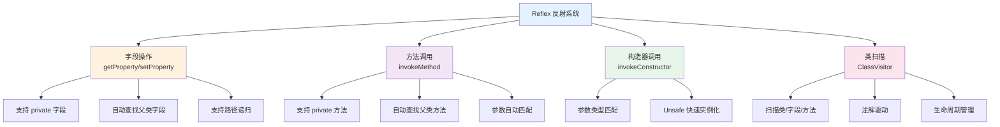

# 便捷的反射工具 (Reflex)

TabooLib 内置了专属的反射依赖库 **Reflex**（https://github.com/TabooLib/reflex），为 Kotlin 和 Java 提供强大且易用的反射功能。

**涉及模块：**
- `taboolib.library.reflex` - Reflex 反射库
- `COMMON` - 基础模块（包含 ClassVisitor）

## 核心概念解析

### 什么是 Reflex？

Reflex 是基于 Kotlin 语言开发的反射工具库，其与 Java 原生反射 API 及 kotlin-reflect 间最大区别在于：

**可无视软兼容性反射目标类中的 private 字段或方法**

简单来说，你无需关心以下问题：
- 字段或方法是 `private` 还是 `public`
- 字段或方法在父类还是子类中
- 是否需要调用 `setAccessible(true)`



### 为什么需要 Reflex？

**传统 Java 反射的痛点：**

```kotlin
// 传统 Java 反射方式
class Test {
    private var count = 0

    private fun say() {
        println("say")
    }
}

// 获取 private 字段需要大量代码
val field = Test::class.java.getDeclaredField("count")
field.isAccessible = true
val value = field.get(test) as Int

// 调用 private 方法也很麻烦
val method = Test::class.java.getDeclaredMethod("say")
method.isAccessible = true
method.invoke(test)
```

**使用 Reflex 后：**

```kotlin
import org.tabooproject.reflex.Reflex.Companion.getProperty
import org.tabooproject.reflex.Reflex.Companion.setProperty
import org.tabooproject.reflex.Reflex.Companion.invokeMethod

// 获取 private 字段 - 一行搞定
val value = test.getProperty<Int>("count")

// 修改 private 字段 - 一行搞定
test.setProperty("count", 10)

// 调用 private 方法 - 一行搞定
test.invokeMethod<Unit>("say")
```

## 基本用法

### 1. 获取字段值 (getProperty)

获取对象的字段值，包括 private 字段和父类字段。

**基础语法：**

```kotlin
import org.tabooproject.reflex.Reflex.Companion.getProperty

// 语法
object.getProperty<返回类型>("字段名")

// 示例
val value = test.getProperty<Int>("count")
```

**完整示例：**

```kotlin
class Player(private val name: String, private var level: Int)

val player = Player("Steve", 10)

// 获取 private 字段
val name = player.getProperty<String>("name")
println("玩家名称: $name")  // 输出: 玩家名称: Steve

// 获取并处理
val level = player.getProperty<Int>("level") ?: 1
println("玩家等级: $level")  // 输出: 玩家等级: 10
```

**类型不确定时使用 Any：**

```kotlin
// 如果不确定字段类型，使用 Any
val unknownValue = test.getProperty<Any>("someField")

// 然后进行类型判断
when (unknownValue) {
    is Int -> println("这是一个整数: $unknownValue")
    is String -> println("这是一个字符串: $unknownValue")
    else -> println("其他类型: ${unknownValue?.javaClass}")
}
```

**获取父类字段：**

```kotlin
open class Parent {
    private val parentField = "parent value"
}

class Child : Parent() {
    private val childField = "child value"
}

val child = Child()

// 自动查找父类字段（默认行为）
val parentValue = child.getProperty<String>("parentField")
println(parentValue)  // 输出: parent value

// 只在当前类查找（不查父类）
val localValue = child.getProperty<String>(
    "childField",
    findToParent = false
)
```

### 2. 设置字段值 (setProperty)

修改对象的字段值，包括 private 字段和 final 字段。

**基础语法：**

```kotlin
import org.tabooproject.reflex.Reflex.Companion.setProperty

// 语法
object.setProperty("字段名", 新值)

// 示例
test.setProperty("count", 100)
```

**完整示例：**

```kotlin
class GameConfig(private var maxPlayers: Int = 20) {
    private val serverName = "My Server"  // val 也能修改！
}

val config = GameConfig()

// 修改 var 字段
config.setProperty("maxPlayers", 50)
println(config.getProperty<Int>("maxPlayers"))  // 输出: 50

// 修改 val 字段（使用反射可以突破 final 限制）
config.setProperty("serverName", "New Server")
println(config.getProperty<String>("serverName"))  // 输出: New Server
```

**修改静态字段：**

```kotlin
class Config {
    companion object {
        private var globalSetting = "default"
    }
}

// 修改伴生对象的字段
Config::class.java.setProperty("globalSetting", "custom", isStatic = true)

// 或者直接操作伴生对象
Config.Companion.setProperty("globalSetting", "custom")
```

### 3. 调用方法 (invokeMethod)

调用对象的方法，包括 private 方法和父类方法。

**基础语法：**

```kotlin
import org.tabooproject.reflex.Reflex.Companion.invokeMethod

// 语法
object.invokeMethod<返回类型>("方法名", 参数1, 参数2, ...)

// 示例
val result = test.invokeMethod<String>("say", "Hello", 123)
```

**完整示例：**

```kotlin
class Calculator {
    private fun add(a: Int, b: Int): Int {
        return a + b
    }

    private fun multiply(a: Int, b: Int, c: Int): Int {
        return a * b * c
    }
}

val calc = Calculator()

// 调用无参方法
calc.invokeMethod<Unit>("reset")

// 调用带参数的方法
val sum = calc.invokeMethod<Int>("add", 10, 20)
println("10 + 20 = $sum")  // 输出: 10 + 20 = 30

// 调用多参数方法
val product = calc.invokeMethod<Int>("multiply", 2, 3, 4)
println("2 * 3 * 4 = $product")  // 输出: 2 * 3 * 4 = 24
```

**调用父类方法：**

```kotlin
open class Animal {
    private fun makeSound(): String {
        return "Some sound"
    }
}

class Dog : Animal() {
    private fun bark(): String {
        return "Woof!"
    }
}

val dog = Dog()

// 调用本类方法
val bark = dog.invokeMethod<String>("bark")
println(bark)  // 输出: Woof!

// 调用父类方法（默认会查找父类）
val sound = dog.invokeMethod<String>("makeSound")
println(sound)  // 输出: Some sound
```

**调用静态方法：**

```kotlin
class MathUtils {
    companion object {
        private fun square(x: Int): Int {
            return x * x
        }
    }
}

// 方法 1：直接在 Class 对象上调用
val result1 = MathUtils::class.java.invokeMethod<Int>(
    "square",
    16,
    isStatic = true
)

// 方法 2：在伴生对象上调用
val result2 = MathUtils.Companion.invokeMethod<Int>("square", 16)

println(result1)  // 输出: 256
```

### 4. 调用构造器 (invokeConstructor)

通过构造器创建对象实例，支持参数匹配。

**基础语法：**

```kotlin
import org.tabooproject.reflex.Reflex.Companion.invokeConstructor

// 语法
ClassName::class.java.invokeConstructor(参数1, 参数2, ...)
```

**完整示例：**

```kotlin
class User(val name: String, val age: Int, private val email: String) {
    // 多个构造器
    constructor(name: String) : this(name, 0, "unknown")
}

// 调用三参数构造器
val user1 = User::class.java.invokeConstructor("Alice", 25, "alice@example.com")
println(user1.name)  // 输出: Alice

// 调用单参数构造器
val user2 = User::class.java.invokeConstructor("Bob")
println(user2.name)  // 输出: Bob

// 无参构造器
class Empty

val empty = Empty::class.java.invokeConstructor()
```

**构造器参数类型匹配：**

```kotlin
class Item(val id: Int, val name: String)

// Reflex 会自动匹配参数类型
val item = Item::class.java.invokeConstructor(1, "Diamond Sword")

// 如果参数类型不匹配，会抛出 NoSuchMethodException
try {
    Item::class.java.invokeConstructor("wrong", 123)  // 参数顺序错误
} catch (e: NoSuchMethodException) {
    println("找不到匹配的构造器")
}
```

### 5. Unsafe 实例化 (unsafeInstance)

不通过构造函数创建实例（跳过初始化逻辑）。

**使用场景：**
- 创建没有无参构造器的类的实例
- 需要跳过构造器中的初始化逻辑
- 性能敏感的场景（避免构造器开销）

**基础语法：**

```kotlin
import org.tabooproject.reflex.Reflex.Companion.unsafeInstance

// 语法
val instance = ClassName::class.java.unsafeInstance()
```

**完整示例：**

```kotlin
class ExpensiveInit(val value: Int) {
    init {
        // 耗时的初始化操作
        Thread.sleep(1000)
        println("初始化完成")
    }
}

// 普通构造器调用 - 会执行 init 块
val normal = ExpensiveInit::class.java.invokeConstructor(10)
// 输出: 初始化完成 (等待 1 秒)

// Unsafe 实例化 - 跳过 init 块
val unsafe = ExpensiveInit::class.java.unsafeInstance() as ExpensiveInit
// 立即返回，不输出任何内容
// 注意：value 字段未被初始化，值为 0
```

**注意事项：**

```kotlin
class Counter(val count: Int = 100) {
    init {
        println("计数器初始化: $count")
    }
}

val counter = Counter::class.java.unsafeInstance() as Counter

// ⚠️ 警告：字段未被初始化
println(counter.count)  // 输出: 0 (而不是 100)

// ✅ 推荐：创建实例后手动设置字段
counter.setProperty("count", 100)
println(counter.count)  // 输出: 100
```

## 进阶用法

### 1. 路径递归访问

使用 `/` 符号递归获取嵌套对象的字段。

**语法：**

```kotlin
// 使用 "/" 分隔符递归访问
object.getProperty<Type>("对象字段/嵌套字段/深层字段")
```

**实战示例：**

```kotlin
class Address(private val city: String, private val zipCode: String)

class Company(private val address: Address)

class Employee(private val company: Company)

val employee = Employee(
    Company(
        Address("北京", "100000")
    )
)

// 递归获取：员工 -> 公司 -> 地址 -> 城市
val city = employee.getProperty<String>("company/address/city")
println("城市: $city")  // 输出: 城市: 北京

// 递归设置
employee.setProperty("company/address/zipCode", "100001")

// 验证
val newZip = employee.getProperty<String>("company/address/zipCode")
println("新邮编: $newZip")  // 输出: 新邮编: 100001
```

**Bukkit 实战示例：**

```kotlin
import org.bukkit.Bukkit
import org.bukkit.entity.Player
import org.tabooproject.reflex.Reflex.Companion.getProperty

// 获取服务器的内部字段
val minecraftServer = Bukkit.getServer().getProperty<Any>("console")

// 递归获取玩家连接的延迟
val player: Player = ...
val ping = player.getProperty<Int>("entity/playerConnection/latency")
println("玩家延迟: ${ping}ms")
```

### 2. 参数说明

Reflex 提供了丰富的参数来控制反射行为。

**getProperty / setProperty 参数：**

| 参数 | 类型 | 默认值 | 说明 |
|------|------|--------|------|
| `path` | String | 必填 | 字段名称，支持 `/` 递归 |
| `isStatic` | Boolean | false | 是否为静态字段 |
| `findToParent` | Boolean | true | 是否查找父类字段 |
| `remap` | Boolean | true | 是否应用重映射（用于混淆类） |
| `mode` | AnalyseMode | default | 分析模式（ASM/Reflection） |

**invokeMethod 参数：**

| 参数 | 类型 | 默认值 | 说明 |
|------|------|--------|------|
| `name` | String | 必填 | 方法名称 |
| `parameter` | Array&lt;Any?&gt; | 空数组 | 方法参数 |
| `isStatic` | Boolean | false | 是否为静态方法 |
| `findToParent` | Boolean | true | 是否查找父类方法 |
| `remap` | Boolean | true | 是否应用重映射 |
| `mode` | AnalyseMode | default | 分析模式 |

**使用示例：**

```kotlin
// 只在当前类查找字段（不查父类）
val value = obj.getProperty<Int>("field", findToParent = false)

// 获取静态字段
val staticField = MyClass::class.java.getProperty<String>(
    "CONSTANT",
    isStatic = true
)

// 调用静态方法（不查父类，不重映射）
val result = MyClass::class.java.invokeMethod<Int>(
    "calculate",
    10, 20,
    isStatic = true,
    findToParent = false,
    remap = false
)
```

### 3. 使用 ReflexClass

`ReflexClass` 是 Reflex 的核心类，提供了更底层的反射操作。

**创建 ReflexClass：**

```kotlin
import org.tabooproject.reflex.ReflexClass

// 从 Class 创建
val reflexClass = ReflexClass.of(MyClass::class.java)

// 指定分析模式
val reflexClassAsm = ReflexClass.of(MyClass::class.java, AnalyseMode.ASM_ONLY)
val reflexClassReflection = ReflexClass.of(MyClass::class.java, AnalyseMode.REFLECTION_ONLY)
```

**使用 ReflexClass 操作字段：**

```kotlin
class Target(private val name: String, private var count: Int)

val target = Target("test", 10)
val reflexClass = ReflexClass.of(Target::class.java)

// 获取字段对象
val nameField = reflexClass.getField("name")
val countField = reflexClass.getField("count")

// 读取字段
val nameValue = nameField.get(target) as String
println("name = $nameValue")  // 输出: name = test

// 修改字段
countField.set(target, 20)
println("count = ${countField.get(target)}")  // 输出: count = 20
```

**使用 ReflexClass 调用方法：**

```kotlin
class Calculator {
    private fun add(a: Int, b: Int): Int = a + b
}

val calc = Calculator()
val reflexClass = ReflexClass.of(Calculator::class.java)

// 获取方法对象（需要提供参数类型匹配）
val addMethod = reflexClass.getMethod("add", 10, 20)

// 调用方法
val result = addMethod.invoke(calc, 10, 20) as Int
println("10 + 20 = $result")  // 输出: 10 + 20 = 30
```

**单例和伴生对象检测：**

```kotlin
// 单例对象
object MySingleton {
    val value = "singleton"
}

// 伴生对象
class MyClass {
    companion object {
        val value = "companion"
    }
}

val singletonClass = ReflexClass.of(MySingleton::class.java)
val companionClass = ReflexClass.of(MyClass.Companion::class.java)

// 检测是否为单例
println("是单例: ${singletonClass.isSingleton()}")  // 输出: 是单例: true

// 检测是否为伴生对象
println("是伴生对象: ${companionClass.isCompanion()}")  // 输出: 是伴生对象: true

// 获取单例实例
val instance = singletonClass.getInstance()
println(instance?.getProperty<String>("value"))  // 输出: singleton
```

### 4. ClassVisitor 类扫描

`ClassVisitor` 用于在类加载时扫描和处理类、字段、方法，支持注解驱动。

**基本用法：**

```kotlin
import org.tabooproject.reflex.ReflexClass
import taboolib.common.LifeCycle
import taboolib.common.inject.ClassVisitor
import taboolib.common.platform.Awake

@Awake  // 标记为自动注册
class MyClassVisitor : ClassVisitor() {

    // 指定在什么生命周期执行扫描
    override fun getLifeCycle(): LifeCycle {
        return LifeCycle.ENABLE  // 在插件启用时扫描
    }

    // 当类开始加载时
    override fun visitStart(clazz: ReflexClass) {
        println("扫描类: ${clazz.name}")
    }

    // 当类结束加载时
    override fun visitEnd(clazz: ReflexClass) {
        println("完成扫描: ${clazz.name}")
    }

    // 当字段加载时
    override fun visit(field: ClassField, owner: ReflexClass) {
        println("  字段: ${field.name} (${field.fieldType.name})")
    }

    // 当方法加载时
    override fun visit(method: ClassMethod, owner: ReflexClass) {
        println("  方法: ${method.name}")
    }
}
```

**生命周期阶段：**

```kotlin
enum class LifeCycle {
    CONST,      // 常量初始化
    INIT,       // 初始化
    LOAD,       // 加载
    ENABLE,     // 启用
    ACTIVE,     // 激活
    DISABLE     // 禁用
}
```

## 实战案例

### 案例 1：扫描注解并自动注册

```kotlin
// 1. 定义注解
@Target(AnnotationTarget.CLASS)
@Retention(AnnotationRetention.RUNTIME)
annotation class AutoRegister(val value: String)

// 2. 定义接口
interface IHandler {
    fun handle(message: String)
}

// 3. 实现类
@AutoRegister("message")
class MessageHandler : IHandler {
    override fun handle(message: String) {
        println("处理消息: $message")
    }
}

@AutoRegister("command")
class CommandHandler : IHandler {
    override fun handle(message: String) {
        println("处理命令: $message")
    }
}

// 4. 扫描器
@Awake
class HandlerScanner : ClassVisitor() {

    companion object {
        val handlers = mutableMapOf<String, IHandler>()
    }

    override fun getLifeCycle(): LifeCycle {
        return LifeCycle.ENABLE
    }

    override fun visitStart(clazz: ReflexClass) {
        // 检查是否实现了 IHandler 接口
        if (!clazz.hasInterface(IHandler::class.java)) {
            return
        }

        // 检查是否有 @AutoRegister 注解
        if (!clazz.hasAnnotation(AutoRegister::class.java)) {
            return
        }

        // 获取注解值
        val annotation = clazz.getAnnotation(AutoRegister::class.java)
        val name = annotation.getProperty<String>("value")!!

        // 创建实例并注册
        val instance = clazz.newInstance() as IHandler
        handlers[name] = instance

        println("注册处理器: $name -> ${clazz.simpleName}")
    }
}

// 5. 使用
fun main() {
    // HandlerScanner 会自动扫描并注册所有处理器
    val handler = HandlerScanner.handlers["message"]
    handler?.handle("Hello World")  // 输出: 处理消息: Hello World
}
```

### 案例 2：动态修改配置

```kotlin
class ServerConfig {
    private val config = mutableMapOf<String, Any>()

    init {
        config["maxPlayers"] = 100
        config["port"] = 25565
        config["motd"] = "Welcome"
    }

    private fun reload() {
        println("配置已重载")
    }
}

fun modifyConfig() {
    val config = ServerConfig()

    // 获取内部配置 Map
    val configMap = config.getProperty<MutableMap<String, Any>>("config")!!

    // 动态修改配置
    configMap["maxPlayers"] = 200
    configMap["newSetting"] = "custom value"

    // 调用私有的 reload 方法
    config.invokeMethod<Unit>("reload")

    // 验证修改
    println("新的最大玩家数: ${configMap["maxPlayers"]}")  // 输出: 新的最大玩家数: 200
}
```

### 案例 3：获取 Bukkit 内部数据

```kotlin
import org.bukkit.Bukkit
import org.bukkit.entity.Player
import org.tabooproject.reflex.Reflex.Companion.getProperty

fun getServerInternals(player: Player) {
    // 获取 MinecraftServer 实例
    val minecraftServer = Bukkit.getServer().getProperty<Any>("console")
    println("MinecraftServer: $minecraftServer")

    // 获取玩家的 NMS 实体对象
    val nmsPlayer = player.getProperty<Any>("entity")
    println("NMS Player: $nmsPlayer")

    // 获取玩家连接对象
    val connection = nmsPlayer?.getProperty<Any>("playerConnection")
    println("Connection: $connection")

    // 获取玩家延迟
    val ping = connection?.getProperty<Int>("latency")
    println("Ping: ${ping}ms")

    // 或者使用路径递归（推荐）
    val pingDirect = player.getProperty<Int>("entity/playerConnection/latency")
    println("Ping (直接): ${pingDirect}ms")
}
```

### 案例 4：实现简易依赖注入

```kotlin
// 1. 定义注解
@Target(AnnotationTarget.FIELD)
@Retention(AnnotationRetention.RUNTIME)
annotation class Inject

// 2. 服务类
class DatabaseService {
    fun query(sql: String): List<String> {
        return listOf("result1", "result2")
    }
}

class LoggerService {
    fun log(message: String) {
        println("[LOG] $message")
    }
}

// 3. 使用依赖注入的类
class UserController {
    @Inject
    private var database: DatabaseService? = null

    @Inject
    private var logger: LoggerService? = null

    fun getUsers(): List<String> {
        logger?.log("查询用户列表")
        return database?.query("SELECT * FROM users") ?: emptyList()
    }
}

// 4. 依赖注入器
@Awake
class DependencyInjector : ClassVisitor() {

    companion object {
        private val services = mutableMapOf<Class<*>, Any>()

        init {
            // 注册服务
            services[DatabaseService::class.java] = DatabaseService()
            services[LoggerService::class.java] = LoggerService()
        }
    }

    override fun getLifeCycle(): LifeCycle {
        return LifeCycle.ENABLE
    }

    override fun visit(field: ClassField, owner: ReflexClass) {
        // 检查是否有 @Inject 注解
        if (!field.isAnnotationPresent(Inject::class.java)) {
            return
        }

        // 获取字段类型
        val fieldType = field.fieldType

        // 查找对应的服务
        val service = services[fieldType] ?: return

        // 获取实例（如果是单例或伴生对象）
        val instance = findInstance(owner) ?: return

        // 注入依赖
        field.set(instance, service)

        println("注入依赖: ${owner.simpleName}.${field.name} <- ${fieldType.simpleName}")
    }
}

// 5. 使用
fun main() {
    val controller = UserController()
    // DependencyInjector 会自动注入依赖

    val users = controller.getUsers()
    println("用户列表: $users")
}
```

### 案例 5：监控字段变化

```kotlin
class MonitoredObject {
    private var sensitiveData: String = "initial"
    private var counter: Int = 0
}

fun monitorFieldChanges() {
    val obj = MonitoredObject()
    val reflexClass = ReflexClass.of(MonitoredObject::class.java)

    // 获取字段
    val sensitiveField = reflexClass.getField("sensitiveData")
    val counterField = reflexClass.getField("counter")

    // 创建监控包装器
    class FieldMonitor(
        private val field: ClassField,
        private val instance: Any,
        private val fieldName: String
    ) {
        private var oldValue: Any? = field.get(instance)

        fun check() {
            val newValue = field.get(instance)
            if (oldValue != newValue) {
                println("字段 $fieldName 已变化: $oldValue -> $newValue")
                oldValue = newValue
            }
        }
    }

    val monitor1 = FieldMonitor(sensitiveField, obj, "sensitiveData")
    val monitor2 = FieldMonitor(counterField, obj, "counter")

    // 模拟修改
    obj.setProperty("sensitiveData", "modified")
    monitor1.check()  // 输出: 字段 sensitiveData 已变化: initial -> modified

    obj.setProperty("counter", 10)
    monitor2.check()  // 输出: 字段 counter 已变化: 0 -> 10

    obj.setProperty("counter", 10)
    monitor2.check()  // 无输出（值未变化）
}
```

## 注意事项与最佳实践

### 1. 性能考虑

```kotlin
// ❌ 不好：每次都进行反射查找
fun badExample(player: Player) {
    repeat(1000) {
        val ping = player.getProperty<Int>("entity/playerConnection/latency")
        println(ping)
    }
}

// ✅ 好：缓存 ReflexClass 和 ClassField
class PlayerHelper {
    private val reflexClass = ReflexClass.of(org.bukkit.craftbukkit.v1_21_R3.entity.CraftPlayer::class.java)
    private val pingField = reflexClass.getField("entity/playerConnection/latency")

    fun getPing(player: Player): Int? {
        return pingField.get(player) as? Int
    }
}

val helper = PlayerHelper()
repeat(1000) {
    val ping = helper.getPing(player)
    println(ping)
}
```

### 2. 异常处理

```kotlin
// ✅ 推荐：始终处理可能的异常
fun safeGetProperty(obj: Any, fieldName: String): Any? {
    return try {
        obj.getProperty<Any>(fieldName)
    } catch (e: NoSuchFieldException) {
        println("字段不存在: $fieldName")
        null
    } catch (e: Exception) {
        println("获取字段失败: ${e.message}")
        null
    }
}

// ✅ 推荐：使用 Kotlin 的 null 安全
val value = obj.getProperty<Int>("count") ?: 0  // 如果为 null 则使用默认值

// ✅ 推荐：使用 runCatching
val result = runCatching {
    obj.getProperty<String>("name")
}.getOrElse { "unknown" }
```

### 3. 类型安全

```kotlin
// ❌ 不安全：类型转换可能失败
val value = obj.getProperty<String>("count")  // count 实际是 Int
println(value.length)  // ClassCastException

// ✅ 安全：使用 Any 然后检查类型
val value = obj.getProperty<Any>("count")
when (value) {
    is Int -> println("数值: $value")
    is String -> println("长度: ${value.length}")
    else -> println("未知类型")
}

// ✅ 安全：使用 runCatching
val value = runCatching {
    obj.getProperty<String>("count")
}.getOrNull()
```

### 4. findToParent 的使用

```kotlin
open class Parent {
    private val parentField = "parent"
}

class Child : Parent() {
    private val childField = "child"
}

val child = Child()

// ✅ 查找父类字段（默认行为）
val parent = child.getProperty<String>("parentField")  // 成功

// ✅ 只在当前类查找
val local = child.getProperty<String>("childField", findToParent = false)  // 成功

// ❌ 在当前类查找父类字段会失败
try {
    child.getProperty<String>("parentField", findToParent = false)
} catch (e: NoSuchFieldException) {
    println("当前类中不存在该字段")
}
```

### 5. 静态字段和方法

```kotlin
class Utils {
    companion object {
        private const val VERSION = "1.0.0"

        private fun calculate(x: Int): Int {
            return x * 2
        }
    }
}

// ✅ 方式 1：在 Class 上调用（需要 isStatic = true）
val version1 = Utils::class.java.getProperty<String>("VERSION", isStatic = true)
val result1 = Utils::class.java.invokeMethod<Int>("calculate", 10, isStatic = true)

// ✅ 方式 2：在 Companion 对象上调用（推荐）
val version2 = Utils.Companion.getProperty<String>("VERSION")
val result2 = Utils.Companion.invokeMethod<Int>("calculate", 10)
```

### 6. Unsafe 实例化的风险

```kotlin
class Important(val data: String) {
    init {
        require(data.isNotEmpty()) { "data 不能为空" }
    }
}

// ❌ 危险：跳过验证逻辑
val unsafe = Important::class.java.unsafeInstance() as Important
println(unsafe.data)  // NPE 或未初始化的值

// ✅ 安全：使用普通构造器
val safe = Important::class.java.invokeConstructor("valid data")
println(safe.data)  // 输出: valid data
```

### 7. ClassVisitor 优先级

```kotlin
@Awake
class HighPriorityVisitor : ClassVisitor(0) {  // 优先级 0（最高）
    override fun getLifeCycle() = LifeCycle.ENABLE
    override fun visitStart(clazz: ReflexClass) {
        println("1. 高优先级扫描")
    }
}

@Awake
class LowPriorityVisitor : ClassVisitor(10) {  // 优先级 10（较低）
    override fun getLifeCycle() = LifeCycle.ENABLE
    override fun visitStart(clazz: ReflexClass) {
        println("2. 低优先级扫描")
    }
}

// 执行顺序：
// 1. 高优先级扫描
// 2. 低优先级扫描
```

### 8. 避免反射滥用

```kotlin
// ❌ 过度使用反射
class BadExample {
    private var count = 0

    fun increment() {
        this.setProperty("count", this.getProperty<Int>("count")!! + 1)
    }
}

// ✅ 合理使用反射（只在必要时使用）
class GoodExample {
    var count = 0  // 如果可以公开，就不要使用 private

    fun increment() {
        count++  // 直接访问，无需反射
    }
}

// ✅ 反射的合理使用场景
fun accessThirdPartyLibrary(obj: Any) {
    // 访问第三方库的 private 字段（无法修改源码）
    val internalState = obj.getProperty<String>("internalState")
}
```

### 9. 版本兼容性

```kotlin
// ✅ 处理不同版本的字段名差异
fun getServerTPS(): Double? {
    val server = Bukkit.getServer()

    return runCatching {
        // 尝试新版本字段名
        server.getProperty<Double>("console/recentTps")
    }.recoverCatching {
        // 回退到旧版本字段名
        server.getProperty<DoubleArray>("console/tps")?.get(0)
    }.getOrNull()
}
```

### 10. 文档和注释

```kotlin
/**
 * 获取玩家的真实延迟
 *
 * 通过反射访问 NMS 层的 playerConnection.latency 字段
 *
 * @param player Bukkit 玩家对象
 * @return 玩家延迟（毫秒），失败时返回 null
 *
 * @since 1.0.0
 * @see org.bukkit.entity.Player.getPing 推荐使用 Bukkit API（1.17+）
 */
fun getRealPing(player: Player): Int? {
    return try {
        player.getProperty<Int>("entity/playerConnection/latency")
    } catch (e: Exception) {
        null
    }
}
```

## 常见问题

### Q1：getProperty 返回 null 怎么办？

**A**：可能的原因：
1. 字段名拼写错误
2. 字段在父类中，但设置了 `findToParent = false`
3. 字段确实为 null

```kotlin
// 调试方法：打印所有字段
val reflexClass = ReflexClass.of(obj.javaClass)
reflexClass.structure.fields.forEach { field ->
    println("字段: ${field.name}, 类型: ${field.type.name}")
}
```

### Q2：invokeMethod 抛出 NoSuchMethodException？

**A**：可能的原因：
1. 方法名拼写错误
2. 参数类型不匹配
3. 方法在父类中，但设置了 `findToParent = false`

```kotlin
// 调试方法：打印所有方法
val reflexClass = ReflexClass.of(obj.javaClass)
reflexClass.structure.methods.forEach { method ->
    val params = method.parameters.joinToString { it.type.simpleName ?: "?" }
    println("方法: ${method.name}($params)")
}
```

### Q3：如何反射访问 Kotlin 的 private 属性？

**A**：Kotlin 的属性会生成 backing field，直接访问即可：

```kotlin
class MyClass(private val name: String)

val obj = MyClass("test")

// ✅ 正确：直接访问 backing field
val name = obj.getProperty<String>("name")
println(name)  // 输出: test
```

### Q4：ClassVisitor 没有被触发？

**A**：检查以下几点：
1. 是否添加了 `@Awake` 注解
2. `getLifeCycle()` 返回的生命周期是否正确
3. 类是否在插件的扫描路径中

### Q5：性能如何优化？

**A**：
1. **缓存 ReflexClass 和 ClassField/ClassMethod 对象**
2. 使用 `AnalyseMode.REFLECTION_ONLY` 避免 ASM 分析开销
3. 批量操作时避免重复反射

```kotlin
// ❌ 低效
repeat(1000) {
    obj.getProperty<Int>("count")
}

// ✅ 高效
val reflexClass = ReflexClass.of(obj.javaClass)
val countField = reflexClass.getField("count")
repeat(1000) {
    countField.get(obj)
}
```

### Q6：能否反射修改 final 静态常量？

**A**：可以，但不推荐（可能导致未定义行为）：

```kotlin
class Constants {
    companion object {
        const val MAX_VALUE = 100  // 编译时常量
    }
}

// 尝试修改（可能无效，因为编译器会内联常量）
Constants::class.java.setProperty("MAX_VALUE", 200, isStatic = true)

// ✅ 推荐：使用 val 而不是 const val
class BetterConstants {
    companion object {
        val MAX_VALUE = 100  // 运行时常量
    }
}

// 可以成功修改
BetterConstants::class.java.setProperty("MAX_VALUE", 200, isStatic = true)
```

## 总结

Reflex 是 TabooLib 提供的强大反射工具，它简化了 Java/Kotlin 反射操作，提供了以下核心能力：

**核心功能：**
- ✅ **字段操作**：getProperty / setProperty
- ✅ **方法调用**：invokeMethod
- ✅ **构造器调用**：invokeConstructor
- ✅ **Unsafe 实例化**：unsafeInstance
- ✅ **类扫描**：ClassVisitor

**主要优势：**
- 无需关心访问修饰符（private/public）
- 自动查找父类字段和方法
- 支持路径递归访问（使用 `/`）
- 提供类扫描和注解驱动功能
- 性能优化（缓存机制）

**使用场景：**
- ✅ 访问第三方库的私有字段
- ✅ 调用框架的私有方法
- ✅ 动态修改配置和状态
- ✅ 实现插件的依赖注入
- ✅ 自动扫描和注册组件
- ✅ 访问 NMS 内部数据

**最佳实践：**
- 缓存 ReflexClass 和 ClassField/Method 对象
- 始终处理可能的异常
- 避免过度使用反射
- 使用类型安全的操作
- 为反射代码添加详细注释

掌握 Reflex 的使用，能让你的插件开发更加灵活和强大，突破框架的限制，实现更多高级功能。
