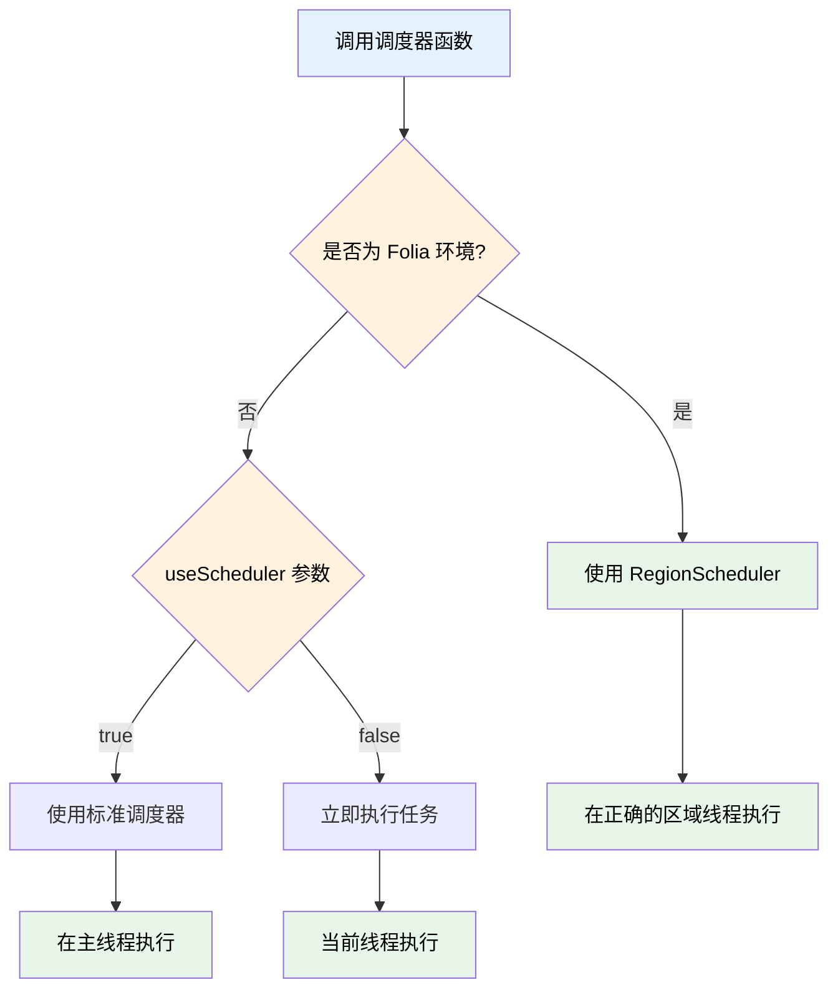

# 调度器 & 协程调度器

## 传统调度器

### Bukkit 原生写法

在传统的 Bukkit 开发中，创建调度任务需要通过 Scheduler 管理器：

```kotlin
Bukkit.getScheduler().runTask(BukkitPlugin.javaPlugin) {
    // TODO
}
```

这种写法需要获取 Scheduler 管理器，然后创建任务。TabooLib 简化了这一流程。

### TabooLib 基础写法

使用 `submit` 函数可以快速创建调度任务：

```kotlin
submit(period = 10, async = true, delay = 20) {
    // TODO
}
```

这样就创建了一个每 10 Tick 运行一次、异步执行、首次延迟 20 Tick 的调度器。

### 参数详解

`submit` 函数的完整签名：

```kotlin title="submit 函数签名"
fun submit(
    now: Boolean = false,     // 是否立即执行
    async: Boolean = false,   // 是否异步执行
    delay: Long = 0,          // 延迟执行时间（Tick）
    period: Long = 0,         // 重复执行间隔（Tick）
    executor: PlatformExecutor.PlatformTask.() -> Unit, // 任务逻辑
): PlatformExecutor.PlatformTask
```

**参数说明：**
- `now`：设置为 `true` 时立即执行，**此时任务不会重复执行**（忽略 `period` 参数）
- `async`：设置为 `true` 时在异步线程执行
- `delay`：首次执行前的延迟时间（单位：Tick，20 Tick = 1 秒）
- `period`：重复执行的时间间隔（单位：Tick，0 表示只执行一次）
- `executor`：任务的具体执行逻辑

**返回值：**
- `PlatformExecutor.PlatformTask`：可用于取消任务的任务对象

### 快捷异步调度器

对于简单的异步任务，可以使用 `submitAsync`：

```kotlin
submitAsync {
    // TODO
}
```

`submitAsync` 函数的完整签名：

```kotlin
fun submitAsync(
    now: Boolean = false,     // 是否立即执行
    delay: Long = 0,          // 延迟执行时间（Tick）
    period: Long = 0,         // 重复执行间隔（Tick）
    executor: PlatformExecutor.PlatformTask.() -> Unit, // 任务逻辑
): PlatformExecutor.PlatformTask
```

等价于 `submit(async = true, ...)`。

### 取消任务

调度任务返回 `PlatformTask` 对象，可以通过 `cancel()` 方法取消：

```kotlin
val task = submit(period = 20) {
    // TODO
}

// 取消任务
task.cancel()
```

### 注解式调度器

使用 `@Schedule` 注解可以自动注册周期性任务：

```kotlin
@Schedule(period = 20, async = true)
fun tick() {
    Bukkit.getOnlinePlayers().forEach {
        it.sendMessage("Hello super bee")
    }
}
```

**注解参数：**
- `async`：是否异步执行（默认 `false`）
- `delay`：首次执行前的延迟时间（默认 `0`）
- `period`：重复执行的时间间隔（默认 `0`，表示只执行一次）

**特性：**
- 自动注册，无需手动调用
- 适合固定周期的后台任务
- 支持异步执行

**适用场景：** 定时保存数据、定时检查状态、周期性广播等

## 协程调度器

### 基本认知

协程调度器是对 Kotlin Coroutine API 的封装，是一种简化异步编程的并发设计模式。

> 协程通过将复杂性放入库来简化异步编程。程序的逻辑可以在协程中顺序地表达，而底层库会为我们解决其异步性。该库可以将用户代码的相关部分包装为回调、订阅相关事件、在不同线程（甚至不同机器）上调度执行，而代码则保持如同顺序执行一样简单。

**核心特点：**
- 利用回调 (Callback) 和订阅 (Observer) 实现
- 代码保持顺序执行的简洁性
- 底层自动处理异步调度

**适用场景：** 需要按顺序执行多个异步操作并处理返回值的场景

### 基础用法

#### 入口

使用 `submitChain` 创建协程调度链：

```kotlin
submitChain {
    // TODO
}
```

`submitChain` 函数签名：

```kotlin
fun <R> submitChain(
    type: DispatcherType = ASYNC,           // 调度器类型（ASYNC 或 SYNC）
    block: suspend Chain<R>.() -> R         // 协程块
): CompletableFuture<R>
```

**参数说明：**
- `type`：默认为 `ASYNC`（异步），也可以设置为 `SYNC`（同步）
- `block`：协程逻辑块
- 返回值：`CompletableFuture<R>`，可以获取协程的最终返回值

#### 延迟任务

使用 `wait` 函数在协程中等待指定时间：

```kotlin
submitChain {
    // 等待 10 ticks
    wait(10)
    // 10 ticks 后继续执行
}
```

**wait 函数签名：**

```kotlin
suspend fun wait(value: Long, type: DurationType = MINECRAFT_TICK)
```

**参数说明：**
- `value`：等待时长
- `type`：时间类型
  - `MINECRAFT_TICK`（默认）：Minecraft Tick（1 Tick = 50ms）
  - `MILLIS`：毫秒

**示例：**

```kotlin
submitChain {
    wait(10)                              // 等待 10 ticks（500ms）
    wait(10, MINECRAFT_TICK)              // 等待 10 ticks（500ms）
    wait(500, MILLIS)                     // 等待 500 毫秒
}
```

#### 切换到同步线程

使用 `sync` 在主线程执行代码：

```kotlin
submitChain {
    sync {
        sender.sendMessage("Hello from Sync!")
    }
}
```

**使用场景：** 需要操作游戏 API（如修改方块、传送玩家等）时必须在主线程执行

#### 切换到异步线程

使用 `async` 在异步线程执行代码：

```kotlin
submitChain {
    async {
        // 执行耗时操作，不阻塞主线程
        performHeavyCalculation()
    }
}
```

**使用场景：** 执行耗时操作（如数据库查询、网络请求等）时避免阻塞主线程

### 获取返回值

协程调度器支持获取异步任务的返回值：

```kotlin
submitChain {
    // 在异步线程计算
    // highlight-start
    val value = async {
        1 + 2 + 3
    }
    // highlight-end
    // 切换到主线程使用结果
    sync {
        sender.sendMessage("Value: $value")
    }
}
```

**执行流程：**
1. 进入 `async` 块，在异步线程计算 `1 + 2 + 3`
2. 将结果赋值给 `value`
3. 切换到主线程，在 `sync` 块中发送消息

### 周期任务

在 `sync` 或 `async` 后添加 `period` 参数可创建周期性执行的任务：

```kotlin
submitChain {
    var index = 0

    val context = sync(period = 20L, delay = 0L) {
        index += 1
        sender.sendMessage("Sync: $index")

        if (index == 10) {
            sender.sendMessage("&cSync task cancelled.".colored())
            // highlight-next-line
            cancel()  // 取消周期任务
            "END"     // 返回值（仅在任务取消时应用）
        } else {
            "_"       // 任务未取消时返回值不生效
        }
    }
}
```

**周期任务函数签名：**

```kotlin
suspend fun <T> sync(
    period: Long,                          // 重复执行间隔（Tick）
    now: Boolean = false,                  // 是否立即执行
    delay: Long = 0L,                      // 首次执行延迟（Tick）
    block: Cancellable.() -> T             // 任务逻辑
): T

suspend fun <T> async(
    period: Long,                          // 重复执行间隔（Tick）
    now: Boolean = false,                  // 是否立即执行
    delay: Long = 0L,                      // 首次执行延迟（Tick）
    block: Cancellable.() -> T             // 任务逻辑
): T
```

**关键点：**
- `period`：重复执行的时间间隔（单位：Tick）
- `delay`：首次执行前的延迟时间（单位：Tick）
- `now`：是否立即执行（忽略 `delay`）
- `cancel()`：在 `Cancellable` 上下文中调用，取消周期任务
- 返回值：只有在调用 `cancel()` 后，返回值才会被应用到变量上

### 实际应用示例

#### 示例 1：异步查询后同步处理

```kotlin
submitChain {
    // 异步查询数据库
    val playerData = async {
        database.getPlayerData(player.uniqueId)
    }

    // 等待 5 ticks
    wait(5)

    // 同步更新玩家状态
    sync {
        player.health = playerData.health
        player.sendMessage("数据已加载")
    }
}
```

#### 示例 2：多步骤异步操作

```kotlin
submitChain {
    // 第一步：异步获取配置
    val config = async {
        loadConfigFromFile()
    }

    // 第二步：异步验证数据
    val isValid = async {
        validateConfig(config)
    }

    // 第三步：同步应用配置
    sync {
        if (isValid) {
            applyConfig(config)
            sender.sendMessage("配置已应用")
        } else {
            sender.sendMessage("配置无效")
        }
    }
}
```

#### 示例 3：带超时的周期检查

```kotlin
submitChain {
    var attempts = 0
    val maxAttempts = 10

    sync(period = 20L) {
        attempts++

        if (checkCondition()) {
            sender.sendMessage("条件满足")
            cancel()
            "Success"
        } else if (attempts >= maxAttempts) {
            sender.sendMessage("超时")
            cancel()
            "Timeout"
        } else {
            "_"
        }
    }
}
```

## Folia 区域调度器

:::tip[什么是 Folia？]
Folia 是 Paper 的多线程分支，采用区域化线程模型。在 Folia 环境下，传统的调度器无法安全地操作特定位置的游戏对象，必须使用 RegionScheduler 在正确的区域线程中执行任务。
:::

TabooLib 为常见的游戏对象提供了 Folia 安全的调度器扩展函数，自动检测运行环境并选择合适的调度器。

### 支持的对象类型

- **Location**：在指定位置执行任务
- **Entity**：在实体所在位置执行任务
- **Block**：在方块所在位置执行任务
- **Chunk**：在区块中心位置执行任务
- **World**：在指定世界坐标执行任务

### 基础用法

#### 在实体位置执行任务

```kotlin title="EntityTask.kt" showLineNumbers
import org.bukkit.entity.Entity
import taboolib.platform.util.runTask
import taboolib.platform.util.submit

fun teleportEntity(entity: Entity, target: Location) {
    // highlight-start
    // 立即在实体位置执行任务（Folia 安全）
    entity.runTask(Runnable {
        entity.teleport(target)
    })
    // highlight-end
}

fun delayedRemove(entity: Entity) {
    // highlight-start
    // 延迟 20 tick 后执行
    entity.submit(delay = 20) {
        entity.remove()
    }
    // highlight-end
}

fun periodicParticle(entity: Entity) {
    // highlight-start
    // 每 20 tick 重复执行
    entity.submit(period = 20) {
        entity.world.spawnParticle(
            Particle.FLAME,
            entity.location,
            10
        )
    }
    // highlight-end
}
```

**代码说明：**
- `runTask(Runnable)`：执行一次性任务
- `submit(delay, period)`：支持延迟和周期执行
- 自动适配 Folia 和传统服务端

#### 在方块位置执行任务

```kotlin title="BlockTask.kt" showLineNumbers
import org.bukkit.block.Block
import taboolib.platform.util.submit

fun breakBlockLater(block: Block) {
    // highlight-start
    // 在方块位置执行任务
    block.submit(delay = 10) {
        block.type = Material.AIR
    }
    // highlight-end
}

fun regenerateBlock(block: Block, originalType: Material) {
    // 10 秒后恢复方块
    block.submit(delay = 200) {
        block.type = originalType
    }
}
```

#### 在世界坐标执行任务

```kotlin title="WorldTask.kt" showLineNumbers
import org.bukkit.World
import taboolib.platform.util.runTask

fun createExplosion(world: World, x: Double, z: Double) {
    // highlight-start
    // 在指定世界坐标执行任务
    world.runTask(x, z, Runnable {
        world.createExplosion(x, 64.0, z, 4.0f)
    })
    // highlight-end
}

fun spawnMobAtLocation(world: World, x: Double, z: Double) {
    world.submit(x, z, delay = 20) {
        world.spawnEntity(
            Location(world, x, 64.0, z),
            EntityType.ZOMBIE
        )
    }
}
```

#### 在区块执行任务

```kotlin title="ChunkTask.kt" showLineNumbers
import org.bukkit.Chunk
import taboolib.platform.util.submit

fun processChunk(chunk: Chunk) {
    // highlight-start
    // 在区块中心位置执行任务
    chunk.submit(delay = 0) {
        // 处理区块数据...
        chunk.entities.forEach { entity ->
            // 安全地操作区块内的实体
            entity.remove()
        }
    }
    // highlight-end
}
```

### 参数说明

所有扩展函数都支持以下参数：

```kotlin
fun Location.submit(
    now: Boolean = false,          // 是否立即执行
    async: Boolean = false,         // 是否异步执行
    delay: Long = 0,                // 延迟执行时间（tick）
    period: Long = 0,               // 重复执行时间（tick，0 表示不重复）
    useScheduler: Boolean = true,   // 在非 Folia 环境下是否使用调度器
    executor: PlatformExecutor.PlatformTask.() -> Unit
): PlatformExecutor.PlatformTask
```

**参数说明：**
- `now = true`：立即在当前线程执行（忽略 delay 参数）
- `async = true`：异步执行，使用全局调度器（不受 Folia 区域限制）
- `useScheduler = false`：在非 Folia 环境下直接执行而不使用调度器
- `period > 0`：任务将按指定间隔重复执行

### 工作原理



### 实战示例

#### 技能系统

```kotlin title="SkillSystem.kt" showLineNumbers
import org.bukkit.entity.Player
import org.bukkit.entity.LivingEntity
import taboolib.platform.util.submit

object SkillSystem {

    fun fireballSkill(player: Player, target: LivingEntity) {
        // highlight-start
        // 在玩家位置生成火球
        player.submit {
            val fireball = player.world.spawn(
                player.eyeLocation,
                Fireball::class.java
            )
            fireball.direction = player.location.direction
        }
        // highlight-end

        // highlight-start
        // 在目标位置创建爆炸效果
        target.submit(delay = 20) {
            target.world.createExplosion(
                target.location,
                2.0f,
                false
            )
        }
        // highlight-end
    }

    fun aoeHeal(center: Location, radius: Double) {
        // highlight-start
        center.submit {
            // 在中心位置执行 AOE 治疗
            center.world.getNearbyEntities(center, radius, radius, radius)
                .filterIsInstance<Player>()
                .forEach { player ->
                    player.health = (player.health + 5.0).coerceAtMost(player.maxHealth)
                }
        }
        // highlight-end
    }
}
```

#### 方块再生系统

```kotlin title="BlockRegenSystem.kt" showLineNumbers
import org.bukkit.block.Block
import org.bukkit.Material
import taboolib.platform.util.submit

object BlockRegenSystem {

    fun breakWithRegen(block: Block, regenSeconds: Int) {
        val originalType = block.type
        val originalData = block.blockData.clone()

        // 立即破坏方块
        block.type = Material.AIR

        // highlight-start
        // 在方块位置执行再生任务
        block.submit(delay = regenSeconds * 20L) {
            block.type = originalType
            block.blockData = originalData
        }
        // highlight-end
    }

    fun temporaryBlock(location: Location, material: Material, seconds: Int) {
        // highlight-start
        location.submit {
            // 放置临时方块
            location.block.type = material
        }

        // 延迟移除
        location.submit(delay = seconds * 20L) {
            location.block.type = Material.AIR
        }
        // highlight-end
    }
}
```

#### 区域效果系统

```kotlin title="AreaEffectSystem.kt" showLineNumbers
import org.bukkit.World
import org.bukkit.Particle
import taboolib.platform.util.submit

object AreaEffectSystem {

    fun createProtectionZone(world: World, x: Double, z: Double, duration: Int) {
        val task = world.submit(x, z, period = 20) {
            // 每秒显示粒子效果
            for (i in 0..360 step 10) {
                val angle = Math.toRadians(i.toDouble())
                val offsetX = Math.cos(angle) * 5.0
                val offsetZ = Math.sin(angle) * 5.0

                world.spawnParticle(
                    Particle.BARRIER,
                    x + offsetX,
                    64.0,
                    z + offsetZ,
                    1
                )
            }
        }

        // 持续时间后取消任务
        world.submit(x, z, delay = duration * 20L) {
            task.cancel()
        }
    }
}
```

### 兼容性说明

:::info[环境检测]
这些扩展函数会自动检测当前服务端环境：
- **Folia 环境**：使用 `RegionScheduler` 在正确的区域线程执行
- **传统环境**：使用标准调度器或立即执行（取决于 `useScheduler` 参数）
:::

:::tip[最佳实践]
在操作游戏世界中的对象（实体、方块、区块）时，优先使用这些扩展函数而不是全局 `submit`。这样可以确保你的插件在 Folia 和传统服务端都能正常工作。
:::

:::warning[注意事项]
- 异步任务（`async = true`）不受 Folia 区域限制，但不能直接操作游戏世界
- `now = true` 会在当前线程立即执行，Folia 环境下可能不安全
- 尽量避免在异步任务中操作实体、方块等游戏对象
:::


## 常见问题

### 何时使用传统调度器，何时使用协程调度器？

- **传统调度器**：适合简单的定时任务、周期性任务
- **协程调度器**：适合需要按顺序执行多个异步操作并处理返回值的复杂场景

### 协程中的 sync 和 async 有什么区别？

- `sync`：在主线程执行，可以安全操作游戏 API
- `async`：在异步线程执行，适合耗时操作，不能直接操作游戏 API

### 如何取消正在执行的调度任务？

传统调度器：

```kotlin
val task = submit(period = 20) {
    // TODO
}
// 取消任务
task.cancel()
```

协程调度器（周期任务）：

```kotlin
sync(period = 20) {
    if (shouldStop) {
        cancel()
    }
}
```

### 协程调度器的返回值何时生效？

- **非周期任务**：返回值会自动应用到变量上
- **周期任务**：只有在调用 `cancel()` 后，返回值才会被应用

### now 参数为 true 时会发生什么？

在传统调度器中，当 `now = true` 时：
- 任务立即执行
- 任务**不会重复执行**，即使设置了 `period` 参数

### wait 函数的时间单位是什么？

`wait` 函数默认使用 Minecraft Tick 作为单位：
- `wait(10)` - 等待 10 ticks（500ms，因为 1 Tick = 50ms）
- `wait(10, MINECRAFT_TICK)` - 等待 10 ticks
- `wait(500, MILLIS)` - 等待 500 毫秒

### submitChain 默认是异步还是同步？

`submitChain` 默认是**异步**（`ASYNC`），如果需要同步执行：

```kotlin
submitChain(type = SYNC) {
    // 在主线程中执行
}
```

### 如何获取协程的返回值？

```kotlin
val future = submitChain {
    val result = async {
        calculateSomething()
    }
    result
}

// 获取最终结果
future.thenAccept { result ->
    println("Result: $result")
}
```
