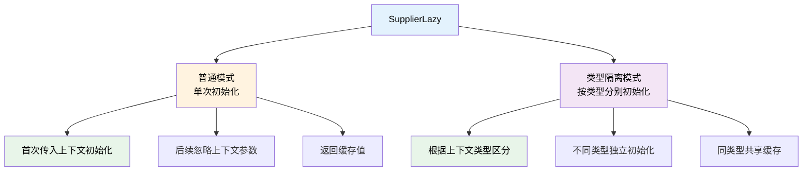
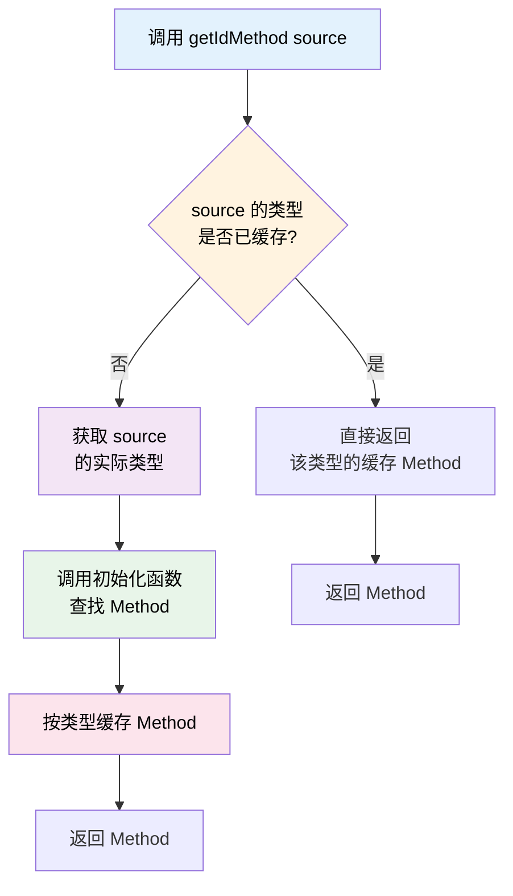

# SupplierLazy - 上下文延迟加载

SupplierLazy 是一个需要传入上下文对象才能初始化的延迟加载工具，支持类型隔离模式，特别适合缓存动态对象的反射方法等场景。

## 核心概念



**关键特性：**
- **上下文相关**：需要传入上下文对象才能初始化
- **类型隔离**：可选的类型隔离模式，为不同类型的上下文分别缓存
- **线程安全**：类型隔离模式使用 `ConcurrentHashMap`，线程安全
- **间接缓存**：虽然编译时不知道类型，但运行时根据实际类型自动缓存

## 核心场景：间接缓存反射方法

### 问题背景

在跨插件调用或动态对象处理中，你可能会遇到这样的情况：

```kotlin
class RemoteQuest(val remote: OpenContainer, val source: Any) : Quest {

    override fun getId(): String {
        // source 是 Any 类型，不知道具体类型
        // 每次调用都要重新查找 getId 方法，性能开销大
        return source.invokeMethod<String>("getId", remap = false)!!
    }
}
```

你想要调用 `source.getId()`，但 `source` 是 `Any` 类型，你不知道它的具体类型。如果直接使用 `invokeMethod`，每次调用都会重新查找方法，造成严重的性能开销。

### 解决方案

使用类型隔离的 `supplierLazy`，根据 `source` 的实际类型自动缓存对应的 Method：

**优化前（性能差）：**

```kotlin
override fun getId(): String {
    // 每次都要查找 getId 方法！
    return source.invokeMethod<String>("getId", remap = false)!!
}
```

**优化后（使用 SupplierLazy）：**

```kotlin
import taboolib.common.util.supplierLazy
import org.tabooproject.reflex.ClassMethod
import org.tabooproject.reflex.ReflexClass

companion object {
    // 使用类型隔离的 SupplierLazy
    val getIdMethod = supplierLazy<Any, ClassMethod>(typeIsolation = true) {
        ReflexClass.of(it.javaClass).getMethod("getId", remap = false)
    }
}

override fun getId(): String {
    // 首次调用：传入 source，根据实际类型查找并缓存 Method
    // 后续调用：直接使用缓存的 Method，无需重新查找
    return getIdMethod[source].invoke(source) as String
}
```

### 工作原理



**关键点：**

1. **类型隔离模式**：`typeIsolation = true` 根据传入对象的实际类型分别缓存
2. **间接缓存**：虽然编译时不知道类型，但运行时根据实际类型自动缓存对应的 Method
3. **一次查找，多次使用**：同一类型的对象共享同一份 Method 缓存

**性能对比：**

| 方式 | 首次调用 | 第 2 次调用 | 第 100 次调用 |
|------|---------|------------|--------------|
| **直接反射** | ~0.5ms | ~0.5ms | ~0.5ms |
| **SupplierLazy** | ~0.5ms | ~0.01ms | ~0.01ms |

## 基础用法

### 普通模式

创建延迟加载对象，首次传入上下文后初始化，后续返回缓存值：

```kotlin title="BasicSupplierLazy.kt" showLineNumbers
import taboolib.common.util.supplierLazy

// 创建延迟加载对象
val lazy = supplierLazy<String, String> { context ->
    "Hello $context"
}

// 首次调用，传入上下文初始化
val result1 = lazy["World"]  // "Hello World"

// 后续调用，返回缓存值（忽略新的上下文）
val result2 = lazy["Different"]  // "Hello World"

// 检查是否已初始化
if (lazy.isInitialized()) {
    println("已初始化")
}

// 重置状态
lazy.reset()
```

**代码说明：**
- 首次调用 `get(context)` 时执行初始化函数
- 后续调用直接返回缓存值，不会重新初始化
- `reset()` 可以清空缓存，下次调用时重新初始化

**适用场景：**
- 根据第一个上下文对象初始化单例
- 简单的上下文相关缓存

### 类型隔离模式

启用类型隔离，为不同类型的上下文分别缓存：

```kotlin title="TypeIsolationMode.kt" showLineNumbers
import taboolib.common.util.supplierLazy

// 启用类型隔离模式
val lazy = supplierLazy<Any, String>(typeIsolation = true) { context ->
    "Value: ${context::class.simpleName}-$context"
}

// 传入 String 类型，初始化 String 类型的缓存
val result1 = lazy["test"]  // "Value: String-test"

// 传入 Int 类型，初始化 Int 类型的缓存
val result2 = lazy[123]  // "Value: Int-123"

// 再次传入 String 类型，返回 String 类型的缓存
val result3 = lazy["different"]  // "Value: String-test"

// 再次传入 Int 类型，返回 Int 类型的缓存
val result4 = lazy[456]  // "Value: Int-123"
```

**代码说明：**
- `typeIsolation = true`：根据上下文对象的类型分别缓存
- 不同类型的上下文各自独立初始化和缓存
- 同一类型的上下文共享同一份缓存

**适用场景：**
- 缓存动态对象的反射方法
- 为不同类型对象创建不同的处理器
- 需要按类型区分的缓存场景

## 实战示例

### 示例 1：缓存动态对象的反射方法

最核心的使用场景，解决跨插件调用性能问题：

```kotlin title="DynamicMethodCache.kt" showLineNumbers
import taboolib.common.util.supplierLazy
import org.tabooproject.reflex.ClassMethod
import org.tabooproject.reflex.ReflexClass

class RemoteQuest(val remote: OpenContainer, val source: Any) : Quest {

    companion object {
        // 缓存 getId 方法
        val getIdMethod = supplierLazy<Any, ClassMethod>(typeIsolation = true) {
            ReflexClass.of(it.javaClass).getMethod("getId", remap = false)
        }

        // 缓存 getBlock 方法
        val getBlockMethod = supplierLazy<Any, ClassMethod>(typeIsolation = true) {
            ReflexClass.of(it.javaClass).getMethodByTypes(
                "getBlock",
                remap = false,
                parameter = arrayOf(String::class.java)
            )
        }

        // 缓存 indexOf 方法
        val indexOfMethod = supplierLazy<Any, ClassMethod>(typeIsolation = true) {
            ReflexClass.of(it.javaClass).getMethodByTypes(
                "indexOf",
                remap = false,
                parameter = arrayOf(Unknown::class.java)
            )
        }
    }

    override fun getId(): String {
        // 根据 source 的实际类型自动缓存 Method
        return getIdMethod[source].invoke(source) as String
    }

    override fun getBlock(label: String): Optional<Quest.Block> {
        // 根据 source 的实际类型自动缓存 Method
        val getBlock = getBlockMethod[source].invoke(source, label) as Optional<Any>
        // 处理返回值...
        return Optional.empty()
    }

    fun indexOf(action: ParsedAction<*>): Int {
        // 根据 source 的实际类型自动缓存 Method
        return indexOfMethod[source].invoke(source, action) as Int
    }
}
```

**代码说明：**
- 使用 `typeIsolation = true` 为不同类型的 source 分别缓存 Method
- 同一类型的 source 只查找一次方法，后续直接使用缓存
- 适用于跨插件调用、插件热重载、动态代理等场景

**性能提升：**
- 首次调用：正常反射查找（约 0.5ms）
- 后续调用：直接使用缓存（约 0.01ms）
- 在高频调用场景下，性能提升约 50 倍

### 示例 2：根据类型创建处理器

为不同类型的数据创建不同的处理器：

```kotlin title="HandlerFactory.kt" showLineNumbers
import taboolib.common.util.supplierLazy

interface DataHandler<T> {
    fun handle(data: T): String
}

class StringHandler : DataHandler<String> {
    override fun handle(data: String) = "String: $data"
}

class IntHandler : DataHandler<Int> {
    override fun handle(data: Int) = "Int: $data"
}

class ListHandler : DataHandler<List<*>> {
    override fun handle(data: List<*>) = "List with ${data.size} items"
}

object HandlerFactory {

    // 使用类型隔离模式，为不同类型创建不同的处理器
    private val handlerCache = supplierLazy<Any, DataHandler<*>>(typeIsolation = true) { context ->
        when (context) {
            is String -> StringHandler()
            is Int -> IntHandler()
            is List<*> -> ListHandler()
            else -> throw IllegalArgumentException("Unsupported type: ${context::class.simpleName}")
        }
    }

    fun <T> getHandler(data: T): DataHandler<T> {
        @Suppress("UNCHECKED_CAST")
        return handlerCache[data as Any] as DataHandler<T>
    }
}

// 使用示例
fun main() {
    // 获取 String 处理器（首次创建）
    val stringHandler = HandlerFactory.getHandler("test")
    println(stringHandler.handle("hello"))  // String: hello

    // 再次获取 String 处理器（返回缓存）
    val stringHandler2 = HandlerFactory.getHandler("world")
    println(stringHandler === stringHandler2)  // true

    // 获取 Int 处理器（首次创建）
    val intHandler = HandlerFactory.getHandler(123)
    println(intHandler.handle(456))  // Int: 456

    // 获取 List 处理器（首次创建）
    val listHandler = HandlerFactory.getHandler(listOf(1, 2, 3))
    println(listHandler.handle(listOf("a", "b")))  // List with 2 items
}
```

**代码说明：**
- 为每种数据类型创建一个专门的处理器实例
- 同一类型的数据共享同一个处理器
- 避免重复创建处理器对象

### 示例 3：配置加载器

根据配置文件类型选择不同的加载器：

```kotlin title="ConfigLoader.kt" showLineNumbers
import taboolib.common.util.supplierLazy
import java.io.File

interface ConfigLoader {
    fun load(file: File): Map<String, Any>
}

class YamlLoader : ConfigLoader {
    override fun load(file: File): Map<String, Any> {
        println("使用 YAML 加载器")
        // 实际的 YAML 加载逻辑
        return emptyMap()
    }
}

class JsonLoader : ConfigLoader {
    override fun load(file: File): Map<String, Any> {
        println("使用 JSON 加载器")
        // 实际的 JSON 加载逻辑
        return emptyMap()
    }
}

class TomlLoader : ConfigLoader {
    override fun load(file: File): Map<String, Any> {
        println("使用 TOML 加载器")
        // 实际的 TOML 加载逻辑
        return emptyMap()
    }
}

object ConfigManager {

    // 根据文件扩展名创建对应的加载器
    private val loaderCache = supplierLazy<String, ConfigLoader>(typeIsolation = true) { extension ->
        when (extension.lowercase()) {
            "yml", "yaml" -> YamlLoader()
            "json" -> JsonLoader()
            "toml" -> TomlLoader()
            else -> throw IllegalArgumentException("Unsupported config format: $extension")
        }
    }

    fun loadConfig(file: File): Map<String, Any> {
        val extension = file.extension
        val loader = loaderCache[extension]
        return loader.load(file)
    }
}

// 使用示例
fun main() {
    val config1 = ConfigManager.loadConfig(File("config.yml"))   // 使用 YAML 加载器
    val config2 = ConfigManager.loadConfig(File("settings.yml")) // 复用 YAML 加载器
    val config3 = ConfigManager.loadConfig(File("data.json"))    // 使用 JSON 加载器
}
```

### 示例 4：WrappedContext 高级用法

使用 `WrappedContext` 携带额外数据，同时保持类型隔离：

```kotlin title="WrappedContextUsage.kt" showLineNumbers
import taboolib.common.util.supplierLazy
import taboolib.common.util.WrappedContext

data class User(val id: Int, val name: String)
data class Product(val id: String, val price: Double)

class CacheService {

    // 使用 WrappedContext 携带额外数据
    private val dataCache = supplierLazy<WrappedContext<Any, String>, String>(typeIsolation = true) { ctx ->
        val obj = ctx.context
        val source = ctx.extra
        when (obj) {
            is User -> "User[${obj.name}] from $source"
            is Product -> "Product[${obj.id}] from $source"
            else -> "Unknown from $source"
        }
    }

    fun getInfo(obj: Any, source: String): String {
        val context = WrappedContext(obj, source)
        return dataCache[context]
    }
}

// 使用示例
fun main() {
    val service = CacheService()

    val user1 = User(1, "Alice")
    val user2 = User(2, "Bob")
    val product = Product("P001", 99.9)

    // 相同用户类型（User），但来源不同
    val info1 = service.getInfo(user1, "web")
    val info2 = service.getInfo(user2, "mobile")

    // 因为使用类型隔离，User 类型只初始化一次
    println(info1)  // User[Alice] from web
    println(info2)  // User[Alice] from web (返回缓存)

    // 不同类型（Product）会重新初始化
    val info3 = service.getInfo(product, "api")
    println(info3)  // Product[P001] from api
}
```

**代码说明：**
- `WrappedContext<C, E>`：包装上下文对象和额外数据
- 类型隔离模式下，根据 `context` 的类型决定缓存 key
- 适用于需要携带元数据但希望按主对象类型缓存的场景

## API 说明

### 创建 SupplierLazy

```kotlin
/**
 * 创建 SupplierLazy 对象
 *
 * @param C 上下文类型
 * @param T 值类型
 * @param typeIsolation 是否进行类型隔离
 * @param initializer 初始化函数，接收上下文对象并返回值
 * @return SupplierLazy 实例
 */
fun <C, T> supplierLazy(
    typeIsolation: Boolean = false,
    initializer: (C) -> T
): SupplierLazy<C, T>
```

### SupplierLazy 接口

```kotlin
interface SupplierLazy<C, T> {
    /**
     * 传入上下文对象获取值
     * 支持使用 [] 运算符
     *
     * @param context 上下文对象
     * @return 初始化后的值
     */
    operator fun get(context: C): T

    /**
     * 检查是否已初始化
     * - 普通模式：检查是否有缓存值
     * - 类型隔离模式：检查是否有任何类型已初始化
     *
     * @return true 表示已初始化
     */
    fun isInitialized(): Boolean

    /**
     * 重置状态，清空所有缓存
     * - 普通模式：清空单个缓存值
     * - 类型隔离模式：清空所有类型的缓存
     */
    fun reset()
}
```

### WrappedContext 数据类

```kotlin
/**
 * 包装上下文对象和额外数据
 * 在类型隔离模式下，仍按 context 的类型决定缓存 key
 *
 * @param C 上下文类型
 * @param E 额外数据类型
 * @param context 主上下文对象（决定缓存 key）
 * @param extra 额外数据（不影响缓存 key）
 */
data class WrappedContext<C: Any, E: Any>(
    val context: C,
    val extra: E
)
```

## 最佳实践

### 何时使用 SupplierLazy

**适合使用的场景：**

1. **缓存动态对象的反射方法**
   - 编译时不知道具体类型
   - 需要根据运行时类型缓存 Method/Field
   - 跨插件调用、动态代理

2. **根据类型创建处理器**
   - 为不同类型创建不同的处理器实例
   - 同一类型共享同一个处理器
   - 工厂模式、策略模式

3. **根据配置对象初始化资源**
   - 根据配置参数创建连接、加载器等
   - 同一配置复用同一个资源实例

**不适合使用的场景：**

1. **简单的单例** - 使用 `object` 或 `lazy`
2. **不需要上下文的延迟加载** - 使用 `lazy` 或 `unsafeLazy`
3. **需要每次都重新创建** - 不要使用缓存

### 普通模式 vs 类型隔离模式

| 特性 | 普通模式 | 类型隔离模式 |
|------|---------|-------------|
| **缓存策略** | 单个缓存，首次初始化后不变 | 按类型分别缓存 |
| **适用场景** | 单例场景，只需初始化一次 | 多类型场景，需要按类型区分 |
| **性能** | 稍快（无类型判断） | 稍慢（需要类型判断） |
| **线程安全** | 否（除非手动同步） | 是（ConcurrentHashMap） |
| **典型用例** | 根据首个配置初始化资源 | 缓存不同类型的反射方法 |

**选择建议：**
- 只需要根据第一个上下文初始化一次 → 使用普通模式
- 需要为不同类型分别初始化 → 使用类型隔离模式
- 需要线程安全 → 使用类型隔离模式

### 性能优化建议

1. **合理使用类型隔离**
   ```kotlin
   // ✅ 好的做法：需要按类型缓存
   val methodCache = supplierLazy<Any, ClassMethod>(typeIsolation = true) {
       ReflexClass.of(it.javaClass).getMethod("someMethod")
   }

   // ❌ 不好的做法：不需要类型隔离但开启了
   val config = supplierLazy<String, Config>(typeIsolation = true) {
       loadConfig(it)  // 所有 String 都会返回同一个 Config
   }
   ```

2. **避免在循环中创建 SupplierLazy**
   ```kotlin
   // ❌ 错误：每次循环都创建新的 SupplierLazy
   for (source in sources) {
       val lazy = supplierLazy<Any, Method> { /*...*/ }
       lazy[source]
   }

   // ✅ 正确：在外部创建一次
   val lazy = supplierLazy<Any, Method> { /*...*/ }
   for (source in sources) {
       lazy[source]
   }
   ```

3. **初始化函数尽量简单**
   ```kotlin
   // ✅ 好的做法：快速初始化
   val lazy = supplierLazy<Class<*>, String>(typeIsolation = true) {
       it.simpleName
   }

   // ❌ 不好的做法：耗时初始化
   val lazy = supplierLazy<File, String>(typeIsolation = true) {
       it.readText()  // 文件 I/O 操作，很慢
   }
   ```

### 与其他延迟加载的对比

| 特性 | lazy | unsafeLazy | resettableLazy | supplierLazy |
|------|------|-----------|---------------|-------------|
| **需要上下文** | ❌ | ❌ | ❌ | ✅ |
| **可重置** | ❌ | ❌ | ✅ | ✅ |
| **类型隔离** | ❌ | ❌ | ❌ | ✅（可选） |
| **线程安全** | ✅ | ❌ | ✅（可选） | ✅（类型隔离模式） |
| **性能** | 中 | 高 | 中 | 中 |
| **适用场景** | 常规延迟加载 | 单线程延迟加载 | 可重置的延迟加载 | 上下文相关的延迟加载 |

## 常见问题

### 1. 为什么我的缓存没有生效？

**问题：** 每次调用都重新初始化

**原因：** 可能没有开启类型隔离，或者传入的对象类型不同

```kotlin
// 问题代码
val lazy = supplierLazy<Any, String> { context ->
    println("初始化：${context::class.simpleName}")
    "Value: $context"
}

lazy["test"]    // 初始化：String
lazy[123]       // 不会初始化（返回缓存的 "Value: test"）
```

**解决方案：** 开启类型隔离

```kotlin
val lazy = supplierLazy<Any, String>(typeIsolation = true) { context ->
    println("初始化：${context::class.simpleName}")
    "Value: $context"
}

lazy["test"]    // 初始化：String
lazy[123]       // 初始化：Int（不同类型，重新初始化）
```

### 2. 如何清空缓存？

使用 `reset()` 方法清空所有缓存：

```kotlin
val lazy = supplierLazy<Any, String>(typeIsolation = true) { /*...*/ }

// 使用缓存
lazy["test"]
lazy[123]

// 清空所有缓存
lazy.reset()

// 重新初始化
lazy["test"]  // 会重新调用初始化函数
```

### 3. 类型隔离模式的类型 key 是什么？

类型隔离模式使用对象的 `Class` 作为 key，而不是对象本身：

```kotlin
val lazy = supplierLazy<Any, String>(typeIsolation = true) {
    "Type: ${it::class.simpleName}"
}

val user1 = User(1, "Alice")
val user2 = User(2, "Bob")

lazy[user1]  // 初始化：Type: User
lazy[user2]  // 返回缓存（user1 和 user2 类型相同）
```

### 4. WrappedContext 如何工作？

`WrappedContext` 允许你携带额外数据，但类型隔离仍按 `context` 的类型判断：

```kotlin
val lazy = supplierLazy<WrappedContext<Any, String>, String>(typeIsolation = true) { ctx ->
    "${ctx.context} from ${ctx.extra}"
}

val ctx1 = WrappedContext("test", "source1")
val ctx2 = WrappedContext("another", "source2")

lazy[ctx1]  // 初始化：test from source1
lazy[ctx2]  // 返回缓存（context 类型都是 String）
```

### 5. 如何在多线程环境下使用？

**类型隔离模式是线程安全的**（使用 `ConcurrentHashMap`）：

```kotlin
// ✅ 线程安全
val lazy = supplierLazy<Any, String>(typeIsolation = true) { /*...*/ }

// 多线程访问安全
thread { lazy["test"] }
thread { lazy[123] }
```

**普通模式不是线程安全的**，需要手动同步：

```kotlin
// ❌ 不线程安全
val lazy = supplierLazy<String, Config> { /*...*/ }

// ✅ 手动同步
val lock = Any()
synchronized(lock) {
    lazy["config"]
}
```

### 6. 与 Kotlin 的 lazy 有什么区别？

| 特性 | Kotlin lazy | SupplierLazy |
|------|------------|-------------|
| **需要上下文** | ❌ | ✅ |
| **可重置** | ❌ | ✅ |
| **类型隔离** | ❌ | ✅ |
| **使用方式** | `by lazy` 委托 | `val lazy = supplierLazy()` |

```kotlin
// Kotlin lazy：不需要上下文
val config by lazy {
    loadConfig()
}

// SupplierLazy：需要上下文
val loader = supplierLazy<File, Config> { file ->
    loadConfig(file)
}
val config = loader[File("config.yml")]
```

## 总结

SupplierLazy 是一个强大的上下文相关延迟加载工具：

✅ **核心优势：**
- 需要上下文对象才能初始化
- 支持类型隔离，为不同类型分别缓存
- 解决动态对象反射方法缓存问题
- 线程安全（类型隔离模式）

✅ **典型应用：**
- 缓存动态对象的反射方法
- 根据类型创建处理器
- 根据配置对象初始化资源

✅ **性能提升：**
- 避免重复的反射查找
- 在高频调用场景下性能提升约 50 倍

通过合理使用 SupplierLazy，可以显著提升跨插件调用、动态代理等场景的性能。
