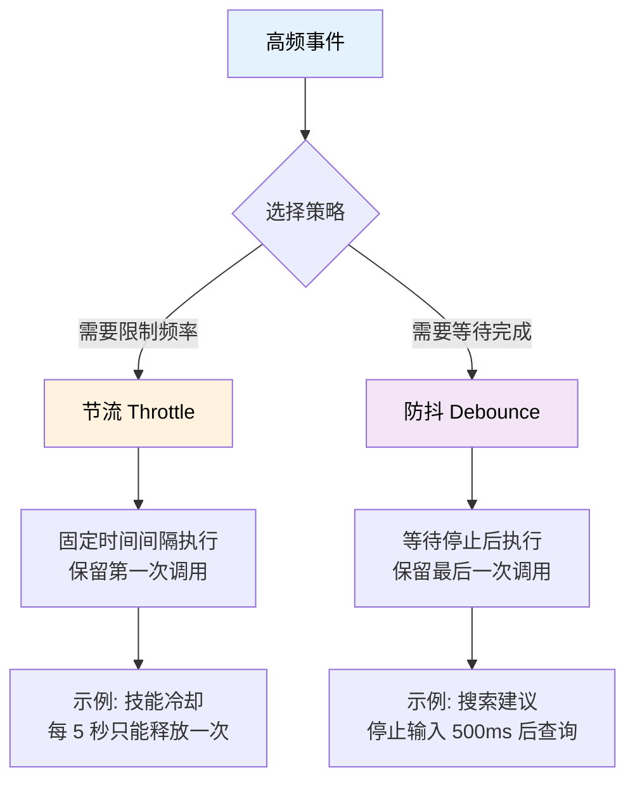

# 实用工具集

TabooLib 提供了丰富的实用工具函数，涵盖节流防抖、文件操作、字符串处理、集合操作、随机数生成等常用功能，帮助开发者提升开发效率。

## 核心概念解析

```mermaid
graph TB
    A[实用工具集] --> B[流量控制<br/>Throttle & Debounce]
    A --> C[文件操作<br/>File Utilities]
    A --> D[字符串工具<br/>String Utilities]
    A --> E[集合操作<br/>Collection Utilities]
    A --> F[数学工具<br/>Math Utilities]
    A --> G[随机数<br/>Random Utilities]
    A --> H[延迟加载<br/>Lazy Utilities]

    B --> B1[节流函数 throttle]
    B --> B2[防抖函数 debounce]

    C --> C1[文件复制 deepCopyTo]
    C --> C2[深度遍历 deep]
    C --> C3[数字签名 digest]

    D --> D1[GZIP 压缩 gzip]
    D --> D2[Z85 编码 encodeZ85]
    D --> D3[变量替换 replaceWithOrder]
    D --> D4[Unicode 解码]

    E --> E1[安全写入 setSafely]
    E --> E2[条件删除 removeAndBackIf]
    E --> E3[增强遍历 each]

    F --> F1[数字位数 length]
    F --> F2[数字拆分 digits]

    G --> G1[随机判断 random]
    G --> G2[随机整数]
    G --> G3[随机浮点数]

    H --> H1[非安全延迟 unsafeLazy]
    H --> H2[可重置延迟 resettableLazy]

    style A fill:#e3f2fd,color:#000000
    style B fill:#fff3e0,color:#000000
    style C fill:#f3e5f5,color:#000000
    style D fill:#e8f5e9,color:#000000
    style E fill:#fce4ec,color:#000000
    style F fill:#f1f8e9,color:#000000
    style G fill:#ffe0b2,color:#000000
    style H fill:#f8bbd0,color:#000000
```



## 流量控制

### 节流函数（Throttle）

节流函数用于**限制函数在指定时间间隔内的执行频率**，避免函数在短时间内重复触发。在时间窗口内，只有第一次调用会被执行。

#### 基础节流

创建与特定对象无关的节流操作：

```kotlin
import taboolib.common.function.throttle

// 创建一个 500 毫秒的节流函数
val throttledAction = throttle(500) {
    println("节流后输出")
}

// 高频使用场景
throttledAction() // 执行 ✅
throttledAction() // 被忽略 ❌
throttledAction() // 被忽略 ❌

// 等待 600 毫秒后
Thread.sleep(600)
throttledAction() // 重新激活 ✅

// 最终输出：
// 节流后输出
// 节流后输出
```

**代码说明：**
- `throttle(delay)`：创建节流函数，`delay` 为时间间隔（毫秒）
- 在 500ms 内多次调用只执行第一次
- 超过时间窗口后重新激活

**适用场景：**
- 限制按钮点击频率
- 防止重复提交表单
- 限制 API 调用频率

#### 对象绑定节流

针对特定类型对象（如 Player）的节流操作，不同对象独立计算时间窗口：

```kotlin
import taboolib.common.function.throttle
import org.bukkit.entity.Player

// 创建一个 500 毫秒的玩家节流函数
val playerThrottle = throttle<Player>(500) { player ->
    println("${player.name} 触发操作")
}

// 玩家 A 高频调用
playerThrottle(playerA) // 执行 ✅
playerThrottle(playerA) // 被忽略 ❌
playerThrottle(playerA) // 被忽略 ❌

// 玩家 B 首次调用（独立计时）
playerThrottle(playerB) // 执行 ✅

// 等待 600 毫秒后
Thread.sleep(600)
playerThrottle(playerA) // 重新激活 ✅

// 最终输出：
// playerA 触发操作
// playerB 触发操作
// playerA 触发操作
```

**代码说明：**
- `throttle<K>(delay)`：创建针对特定类型的节流函数
- 不同对象（playerA、playerB）各自独立计时
- 同一对象在时间窗口内只执行一次

**适用场景：**
- 玩家聊天冷却
- 技能冷却时间
- 玩家交互限制

#### 带参数节流

支持传递额外参数的节流实现，**保留首次调用参数**，忽略后续参数：

```kotlin
import taboolib.common.function.throttle
import org.bukkit.entity.Player

// 创建一个 500 毫秒的带参数节流函数
val messageThrottle = throttle<Player, String>(500) { player, msg ->
    println("${player.name}: $msg")
}

// 高频使用场景
messageThrottle(player, "我是坏黑") // 执行 ✅
messageThrottle(player, "我是奶龙") // 被忽略 ❌
messageThrottle(player, "我是Bkm016") // 被忽略 ❌

// 等待 600 毫秒后
Thread.sleep(600)
messageThrottle(player, "我是TabooLib") // 重新激活 ✅

// 最终输出：
// player: 我是坏黑
// player: 我是TabooLib
```

**代码说明：**
- `throttle<K, T>(delay)`：创建带参数的节流函数
- 在时间窗口内，只保留第一次调用的参数
- 后续调用即使参数不同也会被忽略

**适用场景：**
- 玩家发言冷却（记录首次发言内容）
- 带数据的操作限流

#### 节流对比表

| 特性 | 基础节流 | 对象绑定节流 | 带参数节流 |
|------|---------|-------------|-----------|
| **对象关联** | ❌ | ✅ | ✅ |
| **参数传递** | ❌ | ❌ | ✅ |
| **独立时间窗口** | 全局 | 按对象 | 按对象 |
| **适用场景** | 全局状态操作 | 玩家行为限制 | 带参数的行为限制 |

### 防抖函数（Debounce）

防抖函数用于**延迟函数执行直到特定时间段内没有新触发**，适用于处理高频事件中只需响应最后一次操作的场景。

#### 基础防抖

创建全局防抖操作，在最后一次调用后等待指定延迟执行动作：

```kotlin
import taboolib.common.function.debounce

// 创建一个 500 毫秒的防抖函数
val debouncedAction = debounce(500) {
    println("防抖后输出")
}

// 连续调用
debouncedAction() // 计时开始
debouncedAction() // 重置计时
debouncedAction() // 重置计时，延迟 500ms 后执行

// 等待 600ms
Thread.sleep(600)

// 最终输出：
// 防抖后输出
```

**代码说明：**
- `debounce(delay)`：创建防抖函数，`delay` 为延迟时间（毫秒）
- 每次调用都会重置计时器
- 只有在最后一次调用后 500ms 内无新调用时才执行

**适用场景：**
- 搜索框输入建议（等待用户停止输入）
- 窗口大小调整后重新布局
- 自动保存功能

#### 对象绑定防抖

针对特定对象（如玩家）使用，不同对象独立计时：

```kotlin
import taboolib.common.function.debounce
import org.bukkit.entity.Player

// 创建一个 500 毫秒的玩家防抖函数
val debouncedAction = debounce<Player>(500) { player ->
    println("玩家 ${player.name} 的防抖后输出")
}

// 连续调用
debouncedAction(player) // 计时开始
debouncedAction(player) // 重置计时
debouncedAction(player) // 重置计时，延迟 500ms 后执行

// 等待 600 毫秒
Thread.sleep(600)

// 最终输出：
// 玩家 player 的防抖后输出
```

**代码说明：**
- `debounce<K>(delay)`：创建针对特定类型的防抖函数
- 不同对象各自独立计时
- 在指定时间内只执行最后一次调用

**适用场景：**
- 玩家停止移动后触发检测
- 玩家输入完成后执行验证
- 延迟保存玩家数据

#### 带参数防抖

支持传递额外参数的防抖实现，**保留最后一次调用参数**：

```kotlin
import taboolib.common.function.debounce
import org.bukkit.entity.Player

// 创建一个 500 毫秒的带参数防抖函数
val debouncedAction = debounce<Player, String>(500) { player, message ->
    println("玩家 ${player.name} 的防抖后输出：$message")
}

// 连续调用
debouncedAction(player, "消息1") // 计时开始
debouncedAction(player, "消息2") // 重置计时
debouncedAction(player, "消息3") // 重置计时，延迟 500ms 后执行

// 等待 600 毫秒
Thread.sleep(600)

// 最终输出：
// 玩家 player 的防抖后输出：消息3
```

**代码说明：**
- `debounce<K, T>(delay)`：创建带参数的防抖函数
- 保留最后一次调用的参数
- 前面的调用会被取消

**适用场景：**
- 输入框自动完成（使用最新输入）
- 延迟发送聊天消息

#### 异步执行

防抖函数支持异步执行，避免阻塞主线程：

```kotlin
import taboolib.common.function.debounce

// async = true：在异步线程执行
val asyncDebounce = debounce(500, async = true) {
    // 耗时操作
    heavyTask()
}

// 默认根据当前线程判断是否异步
val autoDebounce = debounce(500) {
    // 如果在主线程调用，则同步执行
    // 如果在异步线程调用，则异步执行
    println("自动判断异步")
}
```

**参数说明：**
- `async = true`：强制在异步线程执行
- `async = false`：强制在主线程执行
- 默认值：根据当前线程自动判断

#### 防抖对比表

| 特性 | 基础防抖 | 对象绑定防抖 | 带参数防抖 |
|------|---------|-------------|-----------|
| **对象关联** | ❌ | ✅ | ✅ |
| **参数传递** | ❌ | ❌ | ✅ |
| **计时策略** | 全局重置 | 按对象重置 | 按对象重置 |
| **适用场景** | 全局延迟操作 | 玩家延迟操作 | 带数据的延迟操作 |

### 节流 vs 防抖



**核心区别：**
- **节流（Throttle）**：在时间窗口内**只执行第一次**，后续调用被忽略
- **防抖（Debounce）**：每次调用都**重置计时器**，只执行**最后一次**

**选择建议：**
- 需要**固定频率**执行 → 使用节流
- 需要**等待完成**再执行 → 使用防抖

## 文件操作工具

### 文件复制

深度复制文件或文件夹，包括所有子文件：

```kotlin
import taboolib.common.io.deepCopyTo
import java.io.File

// 复制单个文件
val sourceFile = File("source.txt")
val targetFile = File("target.txt")
sourceFile.deepCopyTo(targetFile)

// 复制整个文件夹
val sourceDir = File("sourceDir")
val targetDir = File("targetDir")
sourceDir.deepCopyTo(targetDir) // 递归复制所有子文件

// 链式调用
File("data.yml")
    .deepCopyTo(File("backup/data.yml"))
    .also { println("已复制到 ${it.absolutePath}") }
```

**代码说明：**
- `deepCopyTo(target)`：深度复制文件或文件夹
- 如果源是文件夹，会递归复制所有子文件
- 目标文件存在时会覆盖
- 返回源文件，支持链式调用

**适用场景：**
- 备份插件配置文件
- 复制资源文件
- 批量迁移数据

### 深度遍历

深度遍历文件或目录，支持自定义过滤条件：

```kotlin
import taboolib.common.io.deep
import java.io.File

// 获取所有子文件（不包括目录）
val allFiles = File("plugins/MyPlugin")
    .deep { it.isDirectory }

// 获取所有 .yml 文件
val ymlFiles = File("plugins/MyPlugin")
    .deep { file ->
        if (file.isDirectory) {
            // 排除特定目录
            !file.name.startsWith(".")
        } else {
            // 只保留 .yml 文件
            file.extension == "yml"
        }
    }

// 遍历并处理
ymlFiles.forEach { file ->
    println("找到配置文件: ${file.name}")
}
```

**代码说明：**
- `deep(directionMatcher)`：深度遍历文件树
- `directionMatcher`：过滤函数，返回 `true` 继续遍历
- 对于目录：判断是否进入该目录
- 对于文件：判断是否包含在结果中

**适用场景：**
- 查找特定类型的文件
- 遍历插件配置目录
- 递归扫描资源文件

### 文件检测

检测文件是否不存在：

```kotlin
import taboolib.common.io.notfound
import java.io.File

val configFile = File("config.yml")

if (configFile.notfound()) {
    println("配置文件不存在，正在创建...")
    configFile.createNewFile()
}

// 等价于
if (!configFile.exists()) {
    // ...
}
```

**代码说明：**
- `notfound()`：文件不存在时返回 `true`
- 语义化方法，提高代码可读性

### 数字签名

计算文件、字符串、字节数组的数字签名（MD5、SHA-1 等）：

```kotlin
import taboolib.common.io.digest
import java.io.File

// 计算文件的 SHA-1 签名
val fileHash = File("data.dat").digest("sha-1")
println("文件签名: $fileHash")

// 计算字符串的 MD5 签名
val stringHash = "Hello World".digest("md5")
println("字符串签名: $stringHash")

// 计算字节数组的 SHA-256 签名
val byteArrayHash = byteArrayOf(1, 2, 3).digest("sha-256")
println("字节数组签名: $byteArrayHash")

// 验证文件完整性
fun verifyFile(file: File, expectedHash: String): Boolean {
    val actualHash = file.digest("sha-1")
    return actualHash == expectedHash
}
```

**代码说明：**
- `digest(algorithm)`：计算数字签名
- 支持的算法：`md5`、`sha-1`、`sha-256` 等
- 默认使用 `sha-1`

**适用场景：**
- 验证文件完整性
- 生成文件唯一标识
- 检测文件是否被修改

## 字符串工具

### GZIP 压缩与解压

使用 GZIP 算法压缩和解压缩字符串或字节数组：

```kotlin
import taboolib.common5.util.gzip
import taboolib.common5.util.ungzip
import taboolib.common5.util.ungzipToString

// 压缩字符串
val originalText = "这是一段很长的文本内容，需要被压缩..."
val compressed = originalText.gzip()
println("压缩后大小: ${compressed.size} 字节")

// 解压缩为字符串
val decompressed = compressed.ungzipToString()
println("解压后内容: $decompressed")

// 压缩字节数组
val originalBytes = byteArrayOf(1, 2, 3, 4, 5)
val compressedBytes = originalBytes.gzip()

// 解压缩为字节数组
val decompressedBytes = compressedBytes.ungzip()

// 自定义缓冲区大小
val compressed2 = "大量数据".gzip(bufferSize = 2048)
val decompressed2 = compressed2.ungzipToString(bufferSize = 2048)
```

**代码说明：**
- `String.gzip()`：压缩字符串为字节数组（UTF-8 编码）
- `ByteArray.gzip()`：压缩字节数组
- `ByteArray.ungzip()`：解压缩字节数组
- `ByteArray.ungzipToString()`：解压缩为字符串（UTF-8 编码）
- `bufferSize`：可选的缓冲区大小，默认 1024 字节

**适用场景：**
- 压缩存储大量文本数据
- 网络传输数据压缩
- 日志文件压缩
- 减少内存占用

### Z85 编码与解码

Z85 是一种二进制到文本的编码方案，比 Base64 更高效（80% vs 75% 编码效率）：

```kotlin
import taboolib.common5.util.encodeZ85
import taboolib.common5.util.decodeZ85
import taboolib.common5.util.decodeZ85ToString
import taboolib.common5.util.encodeZ85Padded

// 基础编码（要求输入是 4 的倍数）
val data = byteArrayOf(1, 2, 3, 4) // 4 字节
val encoded = data.encodeZ85()
println("编码后: $encoded")

// 解码
val decoded = encoded.decodeZ85()

// 编码字符串
val text = "Test" // 4 字节
val encodedText = text.encodeZ85()
val decodedText = encodedText.decodeZ85ToString()

// 自动填充（输入不是 4 的倍数时）
val shortText = "Hi" // 2 字节
val encodedPadded = shortText.encodeZ85(autoPad = true) // 自动填充到 4 字节
val decodedPadded = encodedPadded.decodeZ85ToString(originalSize = 2)

// 或使用专门的填充方法
val encodedPadded2 = shortText.encodeZ85Padded()
val decodedPadded2 = encodedPadded2.decodeZ85Padded(2)
```

**代码说明：**
- `ByteArray.encodeZ85()`：将字节数组编码为 Z85 字符串
- `String.encodeZ85()`：将字符串编码为 Z85 字符串
- `String.decodeZ85()`：将 Z85 字符串解码为字节数组
- `String.decodeZ85ToString()`：将 Z85 字符串解码为字符串
- `autoPad = true`：自动填充输入到 4 的倍数
- `encodeZ85Padded()`：自动填充编码
- `decodeZ85Padded(originalSize)`：解码并移除填充

**特性：**
- 编码效率：80%（Base64 为 75%）
- 输入要求：字节数必须是 4 的倍数（或使用 `autoPad`）
- 输出长度：输入字节数 × 5 / 4
- 字符集：85 个可打印 ASCII 字符

**适用场景：**
- 二进制数据文本化存储
- 配置文件中存储二进制数据
- 比 Base64 更高效的编码需求
- UUID、哈希值等固定长度数据编码

**与 Base64 对比：**

| 特性 | Z85 | Base64 |
|------|-----|--------|
| **编码效率** | 80% | 75% |
| **输入要求** | 4 的倍数 | 任意长度 |
| **字符集大小** | 85 个 | 64 个 |
| **可读性** | 较差 | 较好 |
| **填充字符** | 无（需手动） | `=` |

**示例：压缩 + 编码**

```kotlin
import taboolib.common5.util.gzip
import taboolib.common5.util.ungzipToString
import taboolib.common5.util.encodeZ85Padded
import taboolib.common5.util.decodeZ85Padded

// 压缩并编码
val original = "这是一段需要压缩和编码的长文本..."
val compressed = original.gzip()
val encoded = compressed.encodeZ85Padded() // 自动填充

// 解码并解压
val decoded = encoded.decodeZ85Padded(compressed.size)
val decompressed = decoded.ungzipToString()

println("原始文本: $original")
println("压缩后大小: ${compressed.size} 字节")
println("编码后长度: ${encoded.length} 字符")
println("恢复文本: $decompressed")
```

### 变量替换

替换字符串中的变量占位符 `{0}`, `{1}` 等：

```kotlin
import taboolib.common.util.replaceWithOrder

// 基础替换
val message = "欢迎 {0} 来到服务器！".replaceWithOrder("坏黑")
// 结果: "欢迎 坏黑 来到服务器！"

// 多参数替换
val info = "玩家 {0} 在 {1} 世界的坐标是 ({2}, {3}, {4})"
    .replaceWithOrder("Steve", "world", 100, 64, 200)
// 结果: "玩家 Steve 在 world 世界的坐标是 (100, 64, 200)"

// 命名参数替换（使用 Pair）
val template = "商品 {name} 的价格是 {price} 金币"
    .replaceWithOrder(
        "钻石剑" to "name",
        100 to "price"
    )
// 结果: "商品 钻石剑 的价格是 100 金币"

// 混合使用
val mixed = "{0} 购买了 {item}，花费 {1} 金币"
    .replaceWithOrder(
        "坏黑",
        100,
        "钻石剑" to "item"
    )
// 结果: "坏黑 购买了 钻石剑，花费 100 金币"
```

**代码说明：**
- `replaceWithOrder(vararg args)`：替换占位符
- 数字占位符：`{0}`, `{1}`, `{2}`...
- 命名占位符：`{name}`, `{price}`...（使用 `Pair` 传递）
- 未找到对应参数时保留原占位符

**适用场景：**
- 语言文件参数替换
- 消息模板填充
- 动态文本生成

### Unicode 解码

解码字符串中的 Unicode 编码：

```kotlin
import taboolib.common.util.decodeUnicode

// 解码 Unicode
val encoded = "\\u4f60\\u597d" // \u4f60\u597d
val decoded = encoded.decodeUnicode()
println(decoded) // 输出: 你好

// 处理配置文件中的 Unicode
val configText = "name: \\u5742\\u9ed1"
val readable = configText.decodeUnicode()
// 结果: name: 坂黑
```

**代码说明：**
- `decodeUnicode()`：将 `\uXXXX` 格式转换为对应字符
- 常用于处理配置文件中的中文编码

**适用场景：**
- 解析 properties 文件
- 处理编码后的配置
- JSON 字符串解码

### 进度条工具

生成文本形式的进度条：

```kotlin
import taboolib.common5.util.createBar

val bar = createBar(
    empty: "◻︎"     // 空部分符号
    fill: "◼︎"      // 填充部分符号
    length: 10     // 进度条总长度
    percent: 0.65  // 完成百分比 (0.0 - 1.0)
)
// 结果: ◼◼◼◼◼◼◻◻◻◻
```

**代码说明：**
- `createBar(empty, fill, length, percent)`：生成进度条字符串
- 常用于显示进度信息

**适用场景：**
- 任务进度, 制作进度等显示

## 集合操作工具

### 对象转列表

将任意对象转换为字符串列表：

```kotlin
import taboolib.common.util.asList

// 数组转列表
val array = arrayOf("A", "B", "C")
val list1 = array.asList()
// 结果: ["A", "B", "C"]

// 可迭代对象转列表
val set = setOf(1, 2, 3)
val list2 = set.asList()
// 结果: ["1", "2", "3"]

// 其他对象转列表（按行分割）
val multiline = "第一行\n第二行\n第三行"
val list3 = multiline.asList()
// 结果: ["第一行", "第二行", "第三行"]
```

**代码说明：**
- `asList()`：将对象转换为字符串列表
- 数组/集合：每个元素转为字符串
- 其他对象：转为字符串后按行分割

### 安全写入列表

安全地向列表指定位置写入元素，自动填充空缺：

```kotlin
import taboolib.common.util.setSafely

val list = mutableListOf("A", "B")

// 正常写入
list.setSafely(1, "X", "?")
// 结果: ["A", "X"]

// 跨越空缺写入
list.setSafely(5, "Y", "?")
// 结果: ["A", "X", "?", "?", "?", "Y"]
```

**代码说明：**
- `setSafely(index, element, def)`：安全写入元素
- `index`：目标位置
- `element`：要写入的元素
- `def`：空缺位置的默认值

**适用场景：**
- 构建固定位置的列表
- 避免索引越界异常

### 安全插入列表

安全地向列表指定位置插入元素：

```kotlin
import taboolib.common.util.addSafely

val list = mutableListOf("A", "B")

// 跨越空缺插入
list.addSafely(5, "C", "?")
// 结果: ["A", "B", "?", "?", "?", "C"]
```

**代码说明：**
- `addSafely(index, element, def)`：安全插入元素
- 与 `setSafely` 类似，但使用插入而非替换

### 条件删除并返回

根据条件删除元素并返回被删除的元素列表：

```kotlin
import taboolib.common.util.removeAndBackIf

val players = mutableListOf("Steve", "Alex", "Notch", "Herobrine")

// 删除名字长度大于 4 的玩家
val removed = players.removeAndBackIf { it.length > 4 }

println("删除的玩家: $removed") // [Steve, Notch, Herobrine]
println("剩余玩家: $players")   // [Alex]
```

**代码说明：**
- `removeAndBackIf(condition)`：删除符合条件的元素并返回
- 返回被删除的元素列表
- 原集合会被修改

**适用场景：**
- 批量删除并记录
- 过滤并处理被移除的元素

### 增强遍历

支持中途退出的遍历方法：

```kotlin
import taboolib.common.util.each

val list = listOf("A", "B", "C", "D", "E")

// 普通遍历
list.each { index, item ->
    println("$index: $item")
}

// 中途退出（类似 break）
list.each { index, item ->
    if (item == "C") {
        close() // 结束遍历
    }
    println("$index: $item")
}
// 输出: 0: A, 1: B

// 指定范围遍历
list.each(start = 1, end = 4) { index, item ->
    println("$index: $item")
}
// 输出: 1: B, 2: C, 3: D

// 逆向遍历
list.each(reversed = true) { index, item ->
    println("$index: $item")
}
// 输出: 4: E, 3: D, 2: C, 1: B, 0: A
```

**代码说明：**
- `each(start, end, reversed)`：增强遍历
- `close()`：提前结束遍历
- `start`、`end`：指定遍历范围
- `reversed`：是否逆向遍历

**适用场景：**
- 需要 break 的遍历
- 部分遍历列表
- 逆向搜索

### 首个非空结果

从数组中获取第一个非空结果：

```kotlin
import taboolib.common.util.getFirst

val sources = arrayOf("source1", "source2", "source3")

// 从多个来源获取数据，返回第一个成功的
val data = sources.getFirst { source ->
    loadDataFrom(source) // 返回数据或 null
}

// 示例：查找可用的配置文件
val configFiles = arrayOf("config.yml", "settings.yml", "default.yml")
val config = configFiles.getFirst { fileName ->
    val file = File(fileName)
    if (file.exists()) file else null
}
```

**代码说明：**
- `getFirst(get)`：遍历数组，返回第一个非空结果
- 找到结果后立即返回，不继续遍历

**适用场景：**
- 查找第一个可用资源
- 尝试多个数据源
- 故障转移逻辑

## 数学工具

### 数字位数

获取整数的位数：

```kotlin
import taboolib.common.util.length

val num1 = 12345
println(num1.length()) // 输出: 5

val num2 = 0
println(num2.length()) // 输出: 1

val num3 = -9999L
println(num3.length()) // 输出: 4（忽略符号）
```

**代码说明：**
- `length()`：返回数字的位数
- 支持 `Int` 和 `Long`
- 负数忽略符号

**适用场景：**
- 格式化数字显示
- 判断数字范围

### 数字拆分

将整数拆分为每一位的数字列表：

```kotlin
import taboolib.common.util.digits

val num = 12345
val digits = num.digits()
println(digits) // 输出: [1, 2, 3, 4, 5]

// 遍历每一位
digits.forEach { digit ->
    println("数字: $digit")
}

// 计算数字之和
val sum = 12345.digits().sum()
println(sum) // 输出: 15 (1+2+3+4+5)
```

**代码说明：**
- `digits()`：返回每一位数字的列表
- 支持 `Int` 和 `Long`
- 从高位到低位排列

**适用场景：**
- 数字求和
- 逐位处理
- 数学计算

## 随机数工具

### 线程安全随机数

创建线程安全的随机数生成器：

```kotlin
import taboolib.common.util.random

// 创建随机数生成器
val rng = random()
val value = rng.nextInt(100)
```

**代码说明：**
- `random()`：返回 `ThreadLocalRandom` 实例
- 线程安全，性能优于 `Random()`

### 随机判断

根据概率返回布尔值：

```kotlin
import taboolib.common.util.random

// 50% 概率
if (random(0.5)) {
    println("触发了！")
}

// 80% 概率掉落物品
if (random(0.8)) {
    player.inventory.addItem(itemStack)
}

// 10% 概率暴击
if (random(0.1)) {
    damage *= 2
}
```

**代码说明：**
- `random(probability)`：概率判断
- `probability`：0-1 之间的概率值
- 返回 `true` 表示触发

**适用场景：**
- 物品掉落概率
- 技能触发概率
- 随机事件

### 随机整数

生成指定范围的随机整数：

```kotlin
import taboolib.common.util.random

// 0 到 99
val num1 = random(100)

// 10 到 20（包含）
val num2 = random(10, 20)

// 自动处理大小顺序
val num3 = random(20, 10) // 等价于 random(10, 20)
```

**代码说明：**
- `random(max)`：生成 0 到 max-1 的随机整数
- `random(min, max)`：生成 min 到 max 的随机整数（包含边界）
- 自动处理参数大小顺序

**适用场景：**
- 随机数量
- 随机索引
- 随机选择

### 随机浮点数

生成指定范围的随机浮点数：

```kotlin
import taboolib.common.util.random
import taboolib.common.util.randomDouble

// 0.0 到 1.0
val prob = randomDouble()

// 10.0 到 20.0
val value = random(10.0, 20.0)

// 自动处理大小顺序
val value2 = random(20.0, 10.0) // 等价于 random(10.0, 20.0)
```

**代码说明：**
- `randomDouble()`：生成 0.0 到 1.0 的随机浮点数
- `random(min, max)`：生成指定范围的随机浮点数
- 支持负数范围

**适用场景：**
- 随机坐标
- 随机速度
- 浮点数概率

## 延迟加载工具

### 非安全延迟加载

声明一个线程不安全的延迟加载对象，性能更高：

```kotlin
import taboolib.common.util.unsafeLazy

// 声明非安全延迟加载（线程不安全，性能更高）
val heavyObject by unsafeLazy {
    println("正在初始化...")
    ExpensiveObject() // 只在首次访问时初始化
}

// 首次访问时才初始化
println(heavyObject) // 输出: 正在初始化...

// 后续访问直接返回
println(heavyObject) // 不再初始化
```

**代码说明：**
- `unsafeLazy(initializer)`：声明延迟加载对象
- 线程不安全，适用于单线程环境
- 性能优于 `lazy()`

**适用场景：**
- 单线程插件初始化
- 性能敏感的延迟加载
- 确定不会多线程访问的对象

### 可重置延迟加载

声明一个允许重置的延迟加载对象：

```kotlin
import taboolib.common.util.resettableLazy
import taboolib.common.util.ResettableLazy

// 声明可重置延迟加载
val config by resettableLazy("config") {
    println("加载配置...")
    loadConfig()
}

// 首次访问
println(config) // 输出: 加载配置...

// 重置特定组
ResettableLazy.reset("config")

// 再次访问会重新初始化
println(config) // 输出: 加载配置...

// 声明多组
val data1 by resettableLazy("group1", "shared") { loadData1() }
val data2 by resettableLazy("group2", "shared") { loadData2() }

// 重置特定组
ResettableLazy.reset("group1") // 只重置 data1

// 重置共享组
ResettableLazy.reset("shared") // 重置 data1 和 data2

// 重置所有
ResettableLazy.reset("*")
```

**代码说明：**
- `resettableLazy(vararg groups)`：声明可重置延迟加载
- `ResettableLazy.reset(vararg groups)`：重置指定组
- `synchronized = true`：线程安全模式

**适用场景：**
- 配置文件重载
- 缓存刷新
- 动态数据更新

## 实战示例

### 玩家操作限流系统

综合使用节流和防抖实现完整的玩家操作限流：

```kotlin
import taboolib.common.function.throttle
import taboolib.common.function.debounce
import org.bukkit.entity.Player
import org.bukkit.event.player.PlayerChatEvent
import taboolib.common.platform.event.SubscribeEvent

object PlayerCooldownSystem {

    // 聊天冷却（节流）：每 3 秒只能发送一次
    val chatThrottle = throttle<Player>(3000) { player ->
        player.sendMessage("§a你可以发送消息了")
    }

    // 自动保存（防抖）：玩家停止操作 5 秒后保存
    val autoSave = debounce<Player>(5000, async = true) { player ->
        savePlayerData(player)
        player.sendMessage("§a数据已自动保存")
    }

    // 命令重复检测（防抖）：防止快速重复执行命令
    val commandDebounce = debounce<Player, String>(1000) { player, command ->
        player.sendMessage("§c请不要重复执行命令！")
    }

    @SubscribeEvent
    fun onChat(event: PlayerChatEvent) {
        val player = event.player

        // 检查聊天冷却
        chatThrottle(player)

        // 触发自动保存计时
        autoSave(player)
    }

    private fun savePlayerData(player: Player) {
        // 保存玩家数据的逻辑
    }
}
```

### 配置文件管理

使用文件工具和延迟加载管理配置：

```kotlin
import taboolib.common.util.resettableLazy
import taboolib.common.util.ResettableLazy
import taboolib.common.io.deepCopyTo
import taboolib.common.io.notfound
import java.io.File

object ConfigManager {

    private val configFile = File("plugins/MyPlugin/config.yml")

    // 可重置的配置加载
    val config by resettableLazy("config") {
        loadConfigFile()
    }

    private fun loadConfigFile(): Configuration {
        // 首次运行时复制默认配置
        if (configFile.notfound()) {
            val defaultConfig = File("resources/default-config.yml")
            defaultConfig.deepCopyTo(configFile)
        }

        return YamlConfiguration.loadConfiguration(configFile)
    }

    // 重载配置
    fun reload() {
        // 备份当前配置
        if (configFile.exists()) {
            configFile.deepCopyTo(File("plugins/MyPlugin/config.backup.yml"))
        }

        // 重置延迟加载，下次访问时重新加载
        ResettableLazy.reset("config")
    }

    // 查找所有配置文件
    fun findAllConfigs(): List<File> {
        return File("plugins/MyPlugin")
            .deep { file ->
                // 只遍历非隐藏目录
                file.isDirectory && !file.name.startsWith(".")
            }
            .filter { it.extension == "yml" }
    }
}
```

### 随机奖励系统

使用随机数工具实现奖励掉落：

```kotlin
import taboolib.common.util.random
import org.bukkit.entity.Player
import org.bukkit.inventory.ItemStack

object RewardSystem {

    data class Reward(
        val item: ItemStack,
        val probability: Double,
        val minAmount: Int,
        val maxAmount: Int
    )

    private val rewards = listOf(
        Reward(diamondItem, 0.05, 1, 3),   // 5% 钻石 1-3 个
        Reward(goldItem, 0.15, 2, 5),       // 15% 金锭 2-5 个
        Reward(ironItem, 0.30, 5, 10),      // 30% 铁锭 5-10 个
        Reward(coalItem, 0.50, 10, 20)      // 50% 煤炭 10-20 个
    )

    fun giveRandomReward(player: Player) {
        for (reward in rewards) {
            // 概率判断
            if (random(reward.probability)) {
                // 随机数量
                val amount = random(reward.minAmount, reward.maxAmount)

                // 克隆物品并设置数量
                val item = reward.item.clone()
                item.amount = amount

                // 给予玩家
                player.inventory.addItem(item)

                player.sendMessage("§a你获得了 ${item.type.name} x${amount}！")
                return // 只给一种奖励
            }
        }

        player.sendMessage("§c很遗憾，没有获得奖励")
    }

    // 随机传送
    fun randomTeleport(player: Player, radius: Double) {
        val location = player.location.clone()

        // 随机偏移
        location.x += random(-radius, radius)
        location.z += random(-radius, radius)

        player.teleport(location)
    }
}
```

### 字符串模板系统

使用字符串工具实现消息模板：

```kotlin
import taboolib.common.util.replaceWithOrder
import org.bukkit.entity.Player

object MessageTemplate {

    // 预定义模板
    private val templates = mapOf(
        "welcome" to "欢迎 {0} 来到服务器！这是你第 {1} 次进入。",
        "purchase" to "{0} 购买了 {item}，花费 {price} 金币",
        "teleport" to "已将 {0} 传送到 {1} ({2}, {3}, {4})",
        "levelup" to "恭喜 {player} 升级到 {level} 级！获得 {reward} 金币"
    )

    // 发送欢迎消息
    fun sendWelcome(player: Player, loginCount: Int) {
        val message = templates["welcome"]!!
            .replaceWithOrder(player.name, loginCount)

        player.sendMessage(message)
    }

    // 发送购买消息
    fun sendPurchase(player: Player, itemName: String, price: Int) {
        val message = templates["purchase"]!!
            .replaceWithOrder(
                player.name,
                itemName to "item",
                price to "price"
            )

        player.sendMessage(message)
    }

    // 发送传送消息
    fun sendTeleport(player: Player, worldName: String, x: Int, y: Int, z: Int) {
        val message = templates["teleport"]!!
            .replaceWithOrder(player.name, worldName, x, y, z)

        player.sendMessage(message)
    }

    // 发送升级消息
    fun sendLevelUp(player: Player, level: Int, reward: Int) {
        val message = templates["levelup"]!!
            .replaceWithOrder(
                player.name to "player",
                level to "level",
                reward to "reward"
            )

        player.sendMessage(message)
    }
}
```

## 常见问题

### 节流和防抖如何选择？

**使用节流的场景：**
- 需要固定时间间隔执行（如每 5 秒执行一次）
- 技能冷却、操作限流
- 示例：玩家聊天冷却、技能释放间隔

**使用防抖的场景：**
- 需要等待操作完成后执行（如停止输入后搜索）
- 自动保存、延迟处理
- 示例：输入完成后验证、停止移动后检测

### 如何清除节流/防抖记录？

```kotlin
import taboolib.common.function.throttle
import taboolib.common.function.ThrottleFunction

val playerThrottle = throttle<Player>(1000) { player ->
    println("${player.name} 触发")
}

// 移除特定玩家的记录
playerThrottle.removeKey(player)

// 清除所有记录
playerThrottle.clearAll()

// 获取所有节流函数并清除
ThrottleFunction.allThrottleFunctions.forEach { it.clearAll() }
```

### 为什么防抖时间不准确？

防抖函数使用 `submit(delay = delay / 50)` 实现，因为 TabooLib 的调度器以 tick 为单位（1 tick = 50ms）：

```kotlin
// delay = 500 毫秒
// 实际延迟 = 500 / 50 = 10 ticks = 500ms ✅

// delay = 550 毫秒
// 实际延迟 = 550 / 50 = 11 ticks = 550ms ✅

// delay = 525 毫秒
// 实际延迟 = 525 / 50 = 10 ticks = 500ms ⚠️ 误差 25ms
```

**建议：** 使用 50 的倍数作为延迟时间（50, 100, 500, 1000...）

### 如何在插件卸载时清理？

```kotlin
import taboolib.common.LifeCycle
import taboolib.common.platform.Awake
import taboolib.common.function.ThrottleFunction
import taboolib.common.function.DebounceFunction

@Awake(LifeCycle.DISABLE)
fun cleanup() {
    // 清除所有节流记录
    ThrottleFunction.allThrottleFunctions.forEach { it.clearAll() }

    // 取消所有防抖任务
    DebounceFunction.allDebounceFunctions.forEach { it.clearAll() }
}
```

### 文件操作失败怎么办?

```kotlin
import taboolib.common.io.deepCopyTo
import java.io.File

try {
    File("source.yml").deepCopyTo(File("target.yml"))
} catch (e: Exception) {
    println("复制失败: ${e.message}")
    // 备用方案
}

// 或使用 runCatching
val result = runCatching {
    File("source.yml").deepCopyTo(File("target.yml"))
}

if (result.isFailure) {
    println("复制失败: ${result.exceptionOrNull()?.message}")
}
```

## 总结

TabooLib 的实用工具集提供了完善的工具函数：

1. **流量控制**：节流和防抖函数，控制操作频率
2. **文件操作**：深度复制、遍历、签名计算
3. **字符串工具**：变量替换、Unicode 解码
4. **集合操作**：安全写入、条件删除、增强遍历
5. **数学工具**：数字位数、拆分
6. **随机数**：线程安全的随机数生成
7. **延迟加载**：非安全和可重置延迟加载

通过合理使用这些工具，可以大幅提升开发效率和代码质量。
