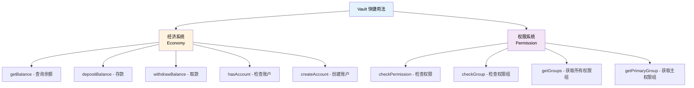
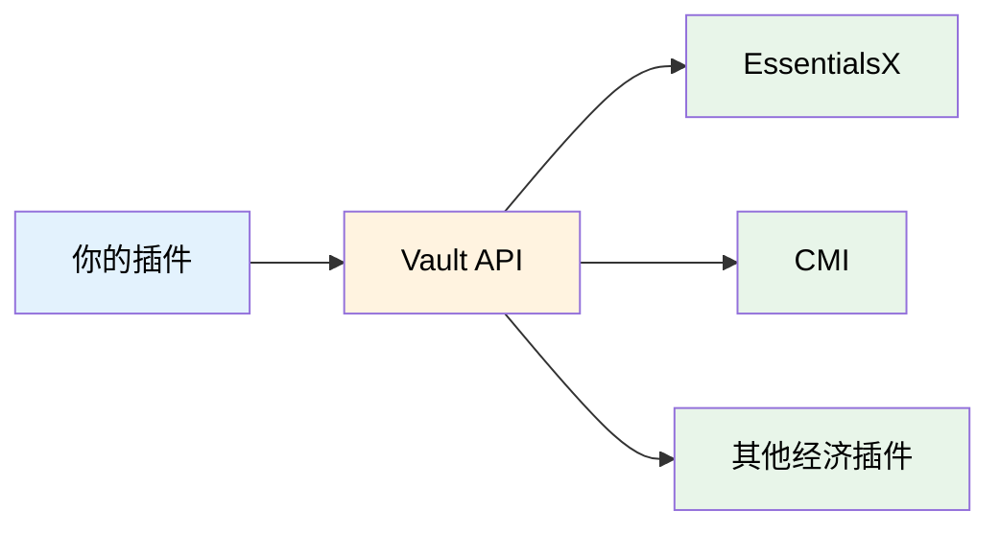

# Vault 快捷用法

TabooLib 为 Vault 插件提供了简洁易用的扩展函数，让你可以用更少的代码实现经济和权限操作。

:::info[什么是 Vault？]

[Vault](https://github.com/milkbowl/Vault) 是 Bukkit/Spigot 服务器最常用的经济和权限系统抽象层，它为各种经济插件（如 EssentialsX、CMI）和权限插件（如 LuckPerms、PermissionsEx）提供统一的 API 接口。

:::

## 功能概览

TabooLib 的 Vault 快捷用法提供以下功能：



## 前置准备

### 添加依赖

在你的插件中添加 Vault 依赖：

```kts title="plugin.kts" {3}
taboolib {
    description {
        dependencies {
            name("Vault")
        }
    }
}

```

### 检查 Vault 支持

在使用 Vault 功能前，建议先检查是否可用：

```kotlin title="检查 Vault 支持" showLineNumbers
import taboolib.platform.compat.isEconomySupported
import taboolib.platform.compat.isPermissionSupported

fun checkVaultSupport() {
    // 检查经济系统是否可用
    if (isEconomySupported) {
        println("经济系统已启用")
    } else {
        println("未检测到经济插件（需要 EssentialsX、CMI 等）")
    }

    // 检查权限系统是否可用
    if (isPermissionSupported) {
        println("权限系统已启用")
    } else {
        println("未检测到权限插件（需要 LuckPerms、PermissionsEx 等）")
    }
}
```

**代码说明：**
- `isEconomySupported`: 检查是否有经济插件（如 EssentialsX）注册到 Vault
- `isPermissionSupported`: 检查是否有权限插件（如 LuckPerms）注册到 Vault

:::warning[注意事项]

`isEconomySupported` 和 `isPermissionSupported` 仅检查 Vault 是否可用，不检查具体的经济/权限插件。确保服务器已安装支持 Vault 的经济/权限插件。

:::

## 经济系统

### 查询余额

获取玩家的当前余额：

```kotlin title="查询余额示例" showLineNumbers
import org.bukkit.entity.Player
import org.bukkit.OfflinePlayer
import taboolib.platform.compat.getBalance

fun checkPlayerBalance(player: Player) {
    // 获取玩家余额
    val balance = player.getBalance()
    player.sendMessage("你的余额: $balance 金币")
}

// 也支持离线玩家
fun checkOfflineBalance(offlinePlayer: OfflinePlayer) {
    val balance = offlinePlayer.getBalance()
    println("${offlinePlayer.name} 的余额: $balance")
}
```

**适用场景：**
- 商店系统查询玩家购买力
- 显示玩家财富排行榜
- 检查玩家是否有足够金币

### 存款

给玩家增加金币：

```kotlin title="存款示例" showLineNumbers
import taboolib.platform.compat.depositBalance

fun givePlayerMoney(player: Player, amount: Double) {
    // 给玩家存款
    val response = player.depositBalance(amount)

    // highlight-next-line
    if (response.transactionSuccess()) {
        player.sendMessage("§a成功存入 ${amount} 金币")
        player.sendMessage("§7当前余额: ${response.balance}")
    } else {
        player.sendMessage("§c存款失败: ${response.errorMessage}")
    }
}

// 任务奖励示例
fun giveQuestReward(player: Player) {
    val reward = 1000.0
    val response = player.depositBalance(reward)

    if (response.transactionSuccess()) {
        player.sendMessage("§6任务完成！获得 ${reward} 金币奖励")
    }
}
```

**代码说明：**
- `depositBalance(amount)`: 存入指定金额，返回 `EconomyResponse`
- `transactionSuccess()`: 检查交易是否成功
- `response.balance`: 交易后的余额
- `response.errorMessage`: 失败时的错误信息

### 取款

扣除玩家的金币：

```kotlin title="取款示例" showLineNumbers
import taboolib.platform.compat.withdrawBalance
import taboolib.platform.compat.getBalance

fun chargePlayer(player: Player, price: Double): Boolean {
    // 先检查余额是否足够
    if (player.getBalance() < price) {
        player.sendMessage("§c余额不足！需要 ${price} 金币，当前余额 ${player.getBalance()}")
        return false
    }

    // 扣款
    // highlight-next-line
    val response = player.withdrawBalance(price)

    if (response.transactionSuccess()) {
        player.sendMessage("§a成功扣除 ${price} 金币")
        player.sendMessage("§7剩余余额: ${response.balance}")
        return true
    } else {
        player.sendMessage("§c扣款失败: ${response.errorMessage}")
        return false
    }
}

// 商店购买示例
fun buyItem(player: Player, itemName: String, price: Double) {
    if (chargePlayer(player, price)) {
        player.sendMessage("§a成功购买 ${itemName}！")
        // 给予物品...
    }
}
```

**适用场景：**
- 商店购买物品
- 传送扣费
- 死亡惩罚

:::tip[最佳实践]

在扣款前务必先检查余额，避免出现负数余额：

```kotlin
if (player.getBalance() >= price) {
    val response = player.withdrawBalance(price)
    // 处理交易...
}
```

:::

### 账户管理

检查和创建玩家账户：

```kotlin title="账户管理示例" showLineNumbers
import taboolib.platform.compat.hasAccount
import taboolib.platform.compat.createAccount

fun ensurePlayerAccount(player: Player) {
    // 检查玩家是否有经济账户
    if (!player.hasAccount()) {
        player.sendMessage("§7正在为你创建经济账户...")

        // 创建账户
        if (player.createAccount()) {
            player.sendMessage("§a账户创建成功！")
        } else {
            player.sendMessage("§c账户创建失败")
        }
    }
}

// 玩家首次加入服务器时调用
fun onPlayerFirstJoin(player: Player) {
    ensurePlayerAccount(player)
    player.depositBalance(1000.0)  // 赠送新手金币
    player.sendMessage("§6欢迎来到服务器！赠送你 1000 金币")
}
```

**代码说明：**
- `hasAccount()`: 检查玩家是否有经济账户
- `createAccount()`: 为玩家创建经济账户

:::info[关于账户创建]

大多数经济插件会在玩家首次加入时自动创建账户，但某些插件可能需要手动创建。建议在玩家加入时检查账户是否存在。

:::

## 权限系统

### 检查权限

检查玩家是否拥有指定权限：

```kotlin title="检查权限示例" showLineNumbers
import taboolib.platform.compat.checkPermission

fun canUseVIP(player: Player): Boolean {
    // 检查玩家是否有 VIP 权限
    return player.checkPermission("server.vip")
}

fun onPlayerCommand(player: Player, command: String) {
    when (command) {
        "fly" -> {
            if (player.checkPermission("server.fly")) {
                player.allowFlight = true
                player.sendMessage("§a飞行已启用")
            } else {
                player.sendMessage("§c你没有飞行权限")
            }
        }
        "tp" -> {
            if (player.checkPermission("server.teleport")) {
                // 执行传送...
            } else {
                player.sendMessage("§c你没有传送权限")
            }
        }
    }
}
```

**适用场景：**
- 功能权限检查
- VIP 特权判断
- 命令执行前的权限验证

### 检查权限组

检查玩家是否属于某个权限组：

```kotlin title="检查权限组示例" showLineNumbers
import taboolib.platform.compat.checkGroup

fun getPlayerRank(player: Player): String {
    return when {
        player.checkGroup("admin") -> "§c管理员"
        player.checkGroup("vip") -> "§6VIP"
        player.checkGroup("default") -> "§7普通玩家"
        else -> "§7未知"
    }
}

fun showPlayerInfo(player: Player) {
    val rank = getPlayerRank(player)
    player.sendMessage("§7你的身份: $rank")

    // VIP 专属欢迎语
    if (player.checkGroup("vip")) {
        player.sendMessage("§6欢迎尊贵的 VIP 玩家！")
    }
}
```

**适用场景：**
- 显示玩家身份标签
- VIP 专属功能
- 权限组特殊待遇

### 获取权限组

获取玩家所属的所有权限组：

```kotlin title="获取权限组示例" showLineNumbers
import taboolib.platform.compat.getGroups
import taboolib.platform.compat.getPrimaryGroup

fun showPlayerGroups(player: Player) {
    // 获取所有权限组
    val groups = player.getGroups()
    player.sendMessage("§7你的权限组: ${groups.joinToString(", ")}")

    // 获取主权限组
    val primaryGroup = player.getPrimaryGroup()
    player.sendMessage("§7主权限组: $primaryGroup")
}

// 根据权限组给予不同奖励
fun giveGroupReward(player: Player) {
    val group = player.getPrimaryGroup()
    val reward = when (group.lowercase()) {
        "admin" -> 10000.0
        "vip" -> 5000.0
        "mvp" -> 2000.0
        else -> 1000.0
    }

    player.depositBalance(reward)
    player.sendMessage("§a根据你的身份组 [$group]，获得 $reward 金币奖励")
}
```

**代码说明：**
- `getGroups()`: 返回玩家所有权限组的列表
- `getPrimaryGroup()`: 返回玩家的主权限组名称

:::info[主权限组说明]

主权限组通常是权限插件中为玩家设置的默认组。不同权限插件的主权限组概念可能略有差异。

:::

## 完整示例

### 商店系统

```kotlin title="ShopSystem.kt" showLineNumbers
import org.bukkit.Material
import org.bukkit.entity.Player
import org.bukkit.inventory.ItemStack
import taboolib.platform.compat.*

/**
 * 商店物品
 */
data class ShopItem(
    val material: Material,
    val name: String,
    val price: Double,
    val vipPrice: Double,        // VIP 价格
    val requiredPermission: String? = null  // 所需权限
)

/**
 * 简单商店系统
 */
object ShopSystem {

    private val items = listOf(
        ShopItem(Material.DIAMOND, "钻石", 100.0, 80.0),
        ShopItem(Material.GOLDEN_APPLE, "金苹果", 50.0, 40.0),
        ShopItem(Material.ELYTRA, "鞘翅", 5000.0, 4000.0, "shop.elytra")
    )

    /**
     * 购买物品
     */
    fun buyItem(player: Player, itemName: String, amount: Int = 1): Boolean {
        // 检查经济系统是否可用
        if (!isEconomySupported) {
            player.sendMessage("§c经济系统未启用")
            return false
        }

        // 查找商品
        val shopItem = items.find { it.name == itemName }
        if (shopItem == null) {
            player.sendMessage("§c未找到商品: $itemName")
            return false
        }

        // 检查权限
        if (shopItem.requiredPermission != null) {
            if (!player.checkPermission(shopItem.requiredPermission)) {
                player.sendMessage("§c你没有购买此物品的权限")
                return false
            }
        }

        // 计算价格（VIP 享受折扣）
        val isVIP = isPermissionSupported && player.checkGroup("vip")
        val unitPrice = if (isVIP) shopItem.vipPrice else shopItem.price
        val totalPrice = unitPrice * amount

        // 检查余额
        if (player.getBalance() < totalPrice) {
            player.sendMessage("§c余额不足！需要 $totalPrice 金币")
            player.sendMessage("§7当前余额: ${player.getBalance()}")
            return false
        }

        // 扣款
        val response = player.withdrawBalance(totalPrice)
        if (!response.transactionSuccess()) {
            player.sendMessage("§c扣款失败: ${response.errorMessage}")
            return false
        }

        // 给予物品
        val item = ItemStack(shopItem.material, amount)
        player.inventory.addItem(item)

        // 成功消息
        player.sendMessage("§a成功购买 ${shopItem.name} x$amount")
        player.sendMessage("§7花费: $totalPrice 金币 ${if (isVIP) "§6(VIP 折扣)" else ""}")
        player.sendMessage("§7剩余余额: ${response.balance}")

        return true
    }

    /**
     * 显示商店列表
     */
    fun showShop(player: Player) {
        if (!isEconomySupported) {
            player.sendMessage("§c经济系统未启用")
            return
        }

        val isVIP = isPermissionSupported && player.checkGroup("vip")

        player.sendMessage("§6§l===== 商店 =====")
        player.sendMessage("§7你的余额: §e${player.getBalance()} 金币")
        if (isVIP) player.sendMessage("§6你是 VIP，享受 8 折优惠！")

        items.forEach { item ->
            val price = if (isVIP) item.vipPrice else item.price
            val canBuy = item.requiredPermission == null
                    || player.checkPermission(item.requiredPermission)

            val status = if (canBuy) "§a可购买" else "§c需要权限"
            player.sendMessage("§e${item.name} §7- §f${price} 金币 §7[$status§7]")
        }
    }
}

// 使用示例
fun onPlayerBuyCommand(player: Player, itemName: String, amount: Int) {
    ShopSystem.buyItem(player, itemName, amount)
}

fun onPlayerShopCommand(player: Player) {
    ShopSystem.showShop(player)
}
```

### 每日签到系统

```kotlin title="DailyReward.kt" showLineNumbers
import org.bukkit.entity.Player
import taboolib.platform.compat.*
import java.time.LocalDate
import java.time.temporal.ChronoUnit

/**
 * 每日签到系统
 */
object DailyRewardSystem {

    // 存储玩家上次签到日期（实际项目中应存储到数据库）
    private val lastSignIn = mutableMapOf<String, LocalDate>()

    // 存储连续签到天数
    private val streakDays = mutableMapOf<String, Int>()

    /**
     * 玩家签到
     */
    fun signIn(player: Player): Boolean {
        // 检查经济系统
        if (!isEconomySupported) {
            player.sendMessage("§c经济系统未启用")
            return false
        }

        val playerName = player.name
        val today = LocalDate.now()
        val lastDate = lastSignIn[playerName]

        // 检查今天是否已签到
        if (lastDate == today) {
            player.sendMessage("§c你今天已经签到过了！")
            return false
        }

        // 计算连续签到天数
        var streak = streakDays.getOrDefault(playerName, 0)
        if (lastDate != null) {
            val daysBetween = ChronoUnit.DAYS.between(lastDate, today)
            if (daysBetween == 1L) {
                // 连续签到
                streak++
            } else {
                // 断签，重置
                streak = 1
            }
        } else {
            // 首次签到
            streak = 1
        }

        // 计算奖励（连续签到奖励更多）
        val baseReward = 100.0
        val streakBonus = (streak - 1) * 10.0
        val vipBonus = if (isPermissionSupported && player.checkGroup("vip")) 50.0 else 0.0
        val totalReward = baseReward + streakBonus + vipBonus

        // 发放奖励
        val response = player.depositBalance(totalReward)
        if (!response.transactionSuccess()) {
            player.sendMessage("§c奖励发放失败: ${response.errorMessage}")
            return false
        }

        // 更新签到记录
        lastSignIn[playerName] = today
        streakDays[playerName] = streak

        // 显示签到信息
        player.sendMessage("§a§l签到成功！")
        player.sendMessage("§7连续签到: §e${streak} 天")
        player.sendMessage("§7基础奖励: §f${baseReward} 金币")
        if (streakBonus > 0) {
            player.sendMessage("§7连续奖励: §f+${streakBonus} 金币")
        }
        if (vipBonus > 0) {
            player.sendMessage("§6VIP 奖励: §f+${vipBonus} 金币")
        }
        player.sendMessage("§a共获得 §e${totalReward} §a金币")
        player.sendMessage("§7当前余额: §e${response.balance}")

        return true
    }

    /**
     * 查看签到信息
     */
    fun showInfo(player: Player) {
        val playerName = player.name
        val lastDate = lastSignIn[playerName]
        val streak = streakDays.getOrDefault(playerName, 0)

        player.sendMessage("§6§l===== 签到信息 =====")

        if (lastDate == null) {
            player.sendMessage("§7你还没有签到记录")
        } else {
            val today = LocalDate.now()
            val canSignToday = lastDate != today

            player.sendMessage("§7上次签到: §f$lastDate")
            player.sendMessage("§7连续天数: §e$streak 天")
            player.sendMessage(if (canSignToday) "§a今天可以签到" else "§c今天已签到")
        }

        // 显示今日奖励预览
        val baseReward = 100.0
        val streakBonus = streak * 10.0
        val vipBonus = if (isPermissionSupported && player.checkGroup("vip")) 50.0 else 0.0
        val nextReward = baseReward + streakBonus + vipBonus

        player.sendMessage("§7明日奖励预览: §e${nextReward} 金币")
    }
}

// 使用示例
fun onDailySignCommand(player: Player) {
    DailyRewardSystem.signIn(player)
}

fun onDailyInfoCommand(player: Player) {
    DailyRewardSystem.showInfo(player)
}
```

## 常见问题

### Vault 和经济插件的关系是什么？

Vault 是一个**中间层**，它本身不提供经济功能，而是为各种经济插件提供统一的 API：



**好处：** 你的插件只需要适配 Vault，就能兼容所有支持 Vault 的经济/权限插件。

### `isEconomySupported` 返回 false 怎么办？

可能的原因：

1. **未安装 Vault 插件**
   ```yaml
   # 在 plugin.yml 中添加依赖
   depend: [Vault]
   ```

2. **未安装经济插件**
   - 需要安装支持 Vault 的经济插件（如 EssentialsX、CMI）

3. **插件加载顺序问题**
   ```yaml
   # 使用 loadbefore 确保在 Vault 之后加载
   loadbefore: [Vault]
   ```

### 如何处理经济操作失败？

始终检查 `EconomyResponse` 的返回值：

```kotlin
val response = player.withdrawBalance(100.0)

if (response.transactionSuccess()) {
    // 成功
    player.sendMessage("交易成功")
} else {
    // 失败，处理错误
    when (response.type) {
        EconomyResponse.ResponseType.FAILURE -> {
            player.sendMessage("交易失败: ${response.errorMessage}")
        }
        EconomyResponse.ResponseType.NOT_IMPLEMENTED -> {
            player.sendMessage("当前经济插件不支持此操作")
        }
        else -> {}
    }
}
```

### 离线玩家能否进行经济操作？

可以，TabooLib 的 Vault 扩展支持 `OfflinePlayer`：

```kotlin
import org.bukkit.Bukkit

val offlinePlayer = Bukkit.getOfflinePlayer("PlayerName")

// 查询余额
val balance = offlinePlayer.getBalance()

// 存款
offlinePlayer.depositBalance(1000.0)

// 取款
offlinePlayer.withdrawBalance(500.0)
```

:::warning[注意事项]

对离线玩家的操作可能不会立即同步到数据库，具体取决于使用的经济插件实现。

:::

### 权限检查不生效怎么办？

1. **确认权限插件已安装**
   ```kotlin
   if (!isPermissionSupported) {
       println("未检测到权限插件")
   }
   ```

2. **检查权限节点是否正确**
   ```kotlin
   // 权限节点区分大小写
   player.checkPermission("server.vip")  // ✅
   player.checkPermission("Server.VIP")  // ❌ 可能不匹配
   ```

3. **使用正确的权限组名称**
   ```kotlin
   // 权限组名称应与权限插件中配置的一致
   player.checkGroup("vip")      // ✅
   player.checkGroup("VIP")      // ❌ 可能不匹配
   ```

### 如何在没有 Vault 的情况下测试？

使用条件检查和默认行为：

```kotlin
fun getPlayerBalance(player: Player): Double {
    return if (isEconomySupported) {
        player.getBalance()
    } else {
        // 测试环境默认余额
        10000.0
    }
}

fun hasVIPPermission(player: Player): Boolean {
    return if (isPermissionSupported) {
        player.checkGroup("vip")
    } else {
        // 测试环境下所有玩家都是 VIP
        true
    }
}
```

:::tip[最佳实践]

1. **始终检查可用性**: 在使用前检查 `isEconomySupported` 和 `isPermissionSupported`
2. **处理交易失败**: 使用 `transactionSuccess()` 检查交易结果
3. **余额验证**: 扣款前先检查余额是否足够
4. **友好的错误提示**: 向玩家显示清晰的错误信息
5. **异步操作**: 对于大量操作（如排行榜），考虑使用异步处理避免卡顿

:::
