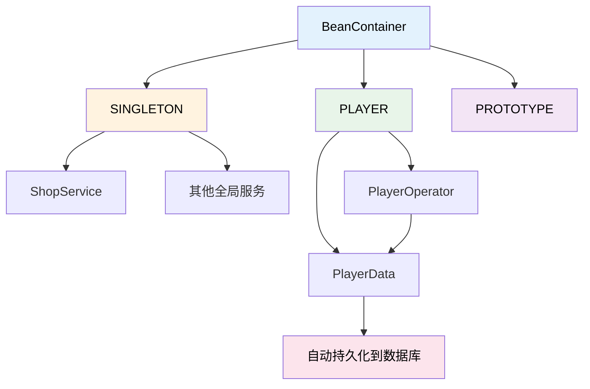
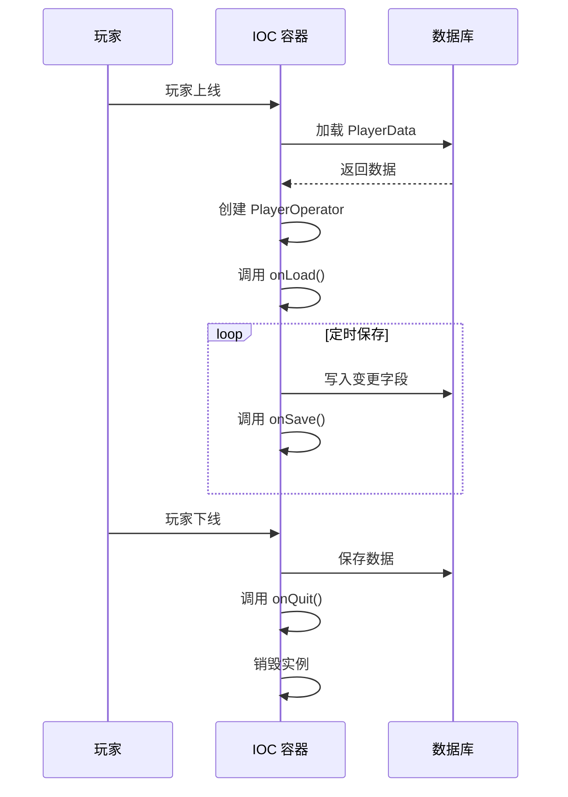

# Database IOC

Database IOC 是 TabooLib 提供的轻量级 IoC（控制反转）容器模块，专为 Minecraft 插件场景设计。它通过 `@Component` 注解自动管理 Bean 的创建、注入和生命周期，并与 PTC Object 深度集成，实现玩家数据的自动持久化。

## 安装模块

在 `build.gradle.kts` 中安装 `IOC` 模块（通常配合 `PtcObject` 一起使用）：

```kotlin title="build.gradle.kts"
taboolib {
    env {
        install(Database, PtcObject, IOC)
    }
}
```

## 核心概念

### 架构总览



IOC 提供三种 Bean 作用域：

| 作用域 | 说明 | 典型用途 |
|--------|------|----------|
| `SINGLETON` | 全局唯一实例，插件启动时创建 | 商店服务、全局管理器 |
| `PLAYER` | 每个玩家独立实例，上线创建、下线销毁 | 玩家数据、玩家管理器 |
| `PROTOTYPE` | 每次获取都创建新实例 | 临时对象 |

## 玩家数据（PlayerData）

继承 `PlayerData` 并标记 `@Component(scope = BeanScope.PLAYER)`，即可定义一个自动持久化的玩家数据类。`uuid` 字段由框架自动管理，无需手动处理。

```kotlin title="CurrencyData.kt"
@Component(scope = BeanScope.PLAYER)
class CurrencyData : PlayerData() {

    /** 钻石 */
    var diamond: Int = 0

    /** 绿宝石 */
    var emerald: Int = 0

    /** 嘻嘻币 */
    var xixiCoin: Int = 0
}
```

**代码说明：**
- `@Component(scope = BeanScope.PLAYER)`：声明为玩家作用域的 Bean，每个玩家拥有独立实例
- 继承 `PlayerData()`：框架自动管理 `uuid` 字段和数据库读写
- 所有 `var` 字段会自动映射为数据库列

## 玩家管理器（PlayerOperator）

`PlayerOperator<T>` 是对 `PlayerData` 的业务封装层。它持有对应玩家的数据实例（通过 `data` 属性访问），并提供选择性更新和排行榜等高级功能。

```kotlin title="CurrencyManager.kt"
@Component(scope = BeanScope.PLAYER)
class CurrencyManager : PlayerOperator<CurrencyData>() {

    /** 货币类型枚举 */
    enum class Type(val display: String) {
        DIAMOND("钻石"),
        EMERALD("绿宝石"),
        XIXI_COIN("嘻嘻币");

        companion object {
            fun fromName(name: String): Type? = entries.find {
                it.name.equals(name, true) || it.display == name
            }
        }
    }

    // ========== 查询 ==========

    fun get(type: Type): Int = when (type) {
        Type.DIAMOND -> data.diamond
        Type.EMERALD -> data.emerald
        Type.XIXI_COIN -> data.xixiCoin
    }

    // ========== 增减 ==========

    fun add(type: Type, amount: Int) {
        set(type, get(type) + amount)
    }

    fun take(type: Type, amount: Int): Boolean {
        if (get(type) < amount) return false
        set(type, get(type) - amount)
        return true
    }

    fun set(type: Type, value: Int) {
        when (type) {
            Type.DIAMOND -> {
                data.diamond = value
                update(CurrencyData::diamond)
            }
            Type.EMERALD -> {
                data.emerald = value
                update(CurrencyData::emerald)
            }
            Type.XIXI_COIN -> {
                data.xixiCoin = value
                update(CurrencyData::xixiCoin)
            }
        }
    }

    fun has(type: Type, amount: Int): Boolean = get(type) >= amount

    // ========== 排行榜 ==========

    fun topDiamond(limit: Int = 10) = top("diamond", limit)
    fun topEmerald(limit: Int = 10) = top("emerald", limit)
    fun topXixiCoin(limit: Int = 10) = top("xixiCoin", limit)

    // ========== 生命周期 ==========

    override fun onLoad() {
        // 玩家上线，数据已从数据库加载到 data 中
    }

    override fun onSave() {
        // 定时保存 / 退出前保存
    }

    override fun onQuit() {
        // 玩家退出后的清理逻辑
    }
}
```

**代码说明：**
- `PlayerOperator<CurrencyData>`：泛型参数指定关联的数据类，通过 `data` 属性访问
- `update(CurrencyData::diamond)`：选择性更新，只将变动的字段写入数据库，避免全量更新
- `top("diamond", limit)`：排行榜查询，按指定字段降序排列，返回前 N 条数据
- `onLoad()` / `onSave()` / `onQuit()`：生命周期回调，分别在数据加载完成、定时保存和玩家退出时触发

## 单例服务（Singleton）

不指定 `scope` 或使用默认值时，`@Component` 创建的是全局单例 Bean。配合 `@PostConstruct` 可在 Bean 初始化后执行逻辑。

```kotlin title="ShopItem.kt"
data class ShopItem(
    val id: String,
    val name: String,
    val price: Int,
    val currency: CurrencyManager.Type,
    val description: String = ""
)
```

```kotlin title="ShopService.kt"
@Component
class ShopService {

    private val items = mutableMapOf<String, ShopItem>()

    @PostConstruct
    fun init() {
        // 注册默认商品
        register(ShopItem("bread", "面包", 5, CurrencyManager.Type.DIAMOND, "恢复饥饿值"))
        register(ShopItem("sword", "铁剑", 20, CurrencyManager.Type.DIAMOND, "一把普通的铁剑"))
        register(ShopItem("bow", "弓", 15, CurrencyManager.Type.EMERALD, "远程武器"))
        register(ShopItem("arrow_x64", "箭矢x64", 8, CurrencyManager.Type.EMERALD, "64支箭"))
        register(ShopItem("lucky_box", "幸运宝箱", 100, CurrencyManager.Type.XIXI_COIN, "开出随机奖励"))
        register(ShopItem("pet_egg", "宠物蛋", 200, CurrencyManager.Type.XIXI_COIN, "孵化一只随机宠物"))
    }

    fun register(item: ShopItem) {
        items[item.id] = item
    }

    fun getItem(id: String): ShopItem? = items[id]

    fun listItems(): List<ShopItem> = items.values.toList()

    /**
     * 玩家购买商品
     * @return 购买结果描述
     */
    fun buy(player: Player, itemId: String): String {
        val item = items[itemId] ?: return "商品不存在: $itemId"
        val manager = player.ioc<CurrencyManager>() ?: return "数据未加载"
        if (!manager.has(item.currency, item.price)) {
            return "余额不足，需要 ${item.price} ${item.currency.display}，当前 ${manager.get(item.currency)}"
        }
        // 直接修改字段 + 选择性更新，只写入变动的那一列
        when (item.currency) {
            CurrencyManager.Type.DIAMOND -> {
                manager.data.diamond -= item.price
                manager.update(CurrencyData::diamond)
            }
            CurrencyManager.Type.EMERALD -> {
                manager.data.emerald -= item.price
                manager.update(CurrencyData::emerald)
            }
            CurrencyManager.Type.XIXI_COIN -> {
                manager.data.xixiCoin -= item.price
                manager.update(CurrencyData::xixiCoin)
            }
        }
        // 这里可以给玩家发放物品，demo 省略
        return "购买成功: ${item.name}，花费 ${item.price} ${item.currency.display}"
    }
}
```

**代码说明：**
- `@Component`：不指定 scope，默认为 `SINGLETON`，全局唯一实例
- `@PostConstruct`：Bean 创建后自动调用，用于初始化数据
- `player.ioc<CurrencyManager>()`：在单例服务中获取玩家作用域的 Bean

## 获取 Bean

IOC 提供两种方式获取 Bean：

### player.ioc&lt;T&gt;() — 获取玩家作用域 Bean

对于 `PLAYER` 作用域的 Bean，通过玩家实例的扩展函数获取：

```kotlin
val mgr = sender.ioc<CurrencyManager>()
if (mgr == null) {
    sender.sendMessage("§c数据未加载")
    return@execute
}
sender.sendMessage("§e=== 我的货币 ===")
CurrencyManager.Type.entries.forEach {
    sender.sendMessage("§7${it.display}: §f${mgr.get(it)}")
}
```

### BeanContainer.getBean() — 获取单例 Bean

对于 `SINGLETON` 作用域的 Bean，通过 `BeanContainer` 获取：

```kotlin
val service = BeanContainer.getBean(ShopService::class.java)
if (service == null) {
    sender.sendMessage("§c商店服务未初始化")
    return@execute
}
sender.sendMessage("§e=== 商店 ===")
service.listItems().forEach { item ->
    sender.sendMessage("§7[${item.id}] §f${item.name} §7- ${item.price} ${item.currency.display} §8${item.description}")
}
```

## 完整示例：命令系统集成

以下是一个完整的命令类，展示了如何在实际场景中使用 IOC 的各种功能：

```kotlin title="ShopCommand.kt"
@CommandHeader(name = "ioctest", aliases = ["it"], permission = "ioctest.use")
object ShopCommand {

    @CommandBody
    val main = mainCommand {
        createHelper()
    }

    /** 查看自己的货币余额 */
    @CommandBody
    val balance = subCommand {
        execute<Player> { sender, _, _ ->
            val mgr = sender.ioc<CurrencyManager>()
            if (mgr == null) {
                sender.sendMessage("§c数据未加载")
                return@execute
            }
            sender.sendMessage("§e=== 我的货币 ===")
            CurrencyManager.Type.entries.forEach {
                sender.sendMessage("§7${it.display}: §f${mgr.get(it)}")
            }
        }
    }

    /** 给自己添加货币（测试用） */
    @CommandBody(permission = "ioctest.admin")
    val give = subCommand {
        dynamic("货币类型") {
            suggestion<Player> { _, _ ->
                CurrencyManager.Type.entries.map { it.name.lowercase() }
            }
            int("数量") {
                execute<Player> { sender, context, _ ->
                    val type = CurrencyManager.Type.fromName(context["货币类型"])
                    if (type == null) {
                        sender.sendMessage("§c未知货币类型: ${context["货币类型"]}")
                        return@execute
                    }
                    val amount = context.int("数量")
                    val mgr = sender.ioc<CurrencyManager>() ?: return@execute
                    mgr.add(type, amount)
                    sender.sendMessage("§a已添加 $amount ${type.display}，当前: ${mgr.get(type)}")
                }
            }
        }
    }

    /** 查看商店列表 */
    @CommandBody
    val shop = subCommand {
        execute<Player> { sender, _, _ ->
            // highlight-next-line
            val service = BeanContainer.getBean(ShopService::class.java)
            if (service == null) {
                sender.sendMessage("§c商店服务未初始化")
                return@execute
            }
            sender.sendMessage("§e=== 商店 ===")
            service.listItems().forEach { item ->
                sender.sendMessage("§7[${item.id}] §f${item.name} §7- ${item.price} ${item.currency.display} §8${item.description}")
            }
        }
    }

    /** 购买商品 */
    @CommandBody
    val buy = subCommand {
        dynamic("商品ID") {
            suggestion<Player> { _, _ ->
                BeanContainer.getBean(ShopService::class.java)?.listItems()?.map { it.id } ?: emptyList()
            }
            execute<Player> { sender, context, _ ->
                val service = BeanContainer.getBean(ShopService::class.java) ?: return@execute
                val result = service.buy(sender, context["商品ID"])
                sender.sendMessage("§a$result")
            }
        }
    }

    /** 查看排行榜 */
    @CommandBody
    val top = subCommand {
        dynamic("货币类型") {
            suggestion<Player> { _, _ ->
                CurrencyManager.Type.entries.map { it.name.lowercase() }
            }
            execute<Player> { sender, context, _ ->
                val type = CurrencyManager.Type.fromName(context["货币类型"])
                if (type == null) {
                    sender.sendMessage("§c未知货币类型")
                    return@execute
                }
                val mgr = sender.ioc<CurrencyManager>() ?: return@execute
                val list = when (type) {
                    CurrencyManager.Type.DIAMOND -> mgr.topDiamond()
                    CurrencyManager.Type.EMERALD -> mgr.topEmerald()
                    CurrencyManager.Type.XIXI_COIN -> mgr.topXixiCoin()
                }
                sender.sendMessage("§e=== ${type.display}排行榜 ===")
                list.forEachIndexed { i, data ->
                    sender.sendMessage("§7#${i + 1} §f${data.uuid} §7- ${when (type) {
                        CurrencyManager.Type.DIAMOND -> data.diamond
                        CurrencyManager.Type.EMERALD -> data.emerald
                        CurrencyManager.Type.XIXI_COIN -> data.xixiCoin
                    }}")
                }
            }
        }
    }
}
```

**代码说明：**
- `sender.ioc<CurrencyManager>()`：获取当前玩家的货币管理器
- `BeanContainer.getBean(ShopService::class.java)`：获取全局单例的商店服务
- `context.int("数量")`：从命令上下文中获取整数参数
- `mgr.topDiamond()`：调用排行榜查询，底层使用 `top("diamond", limit)`

## 生命周期



### 注解生命周期

| 注解 | 触发时机 | 适用作用域 |
|------|----------|------------|
| `@PostConstruct` | Bean 创建并注入完成后 | 所有作用域 |
| `@PreDestroy` | Bean 销毁前 | 所有作用域 |

### PlayerOperator 生命周期

| 回调方法 | 触发时机 | 说明 |
|----------|----------|------|
| `onLoad()` | 玩家上线，数据从数据库加载完成后 | 可用于初始化计算字段 |
| `onSave()` | 定时保存或手动触发保存时 | 可用于保存前的数据处理 |
| `onQuit()` | 玩家退出服务器后 | 可用于清理临时资源 |

## API 速查

| API | 说明 |
|-----|------|
| `@Component` | 声明一个 Bean，可选 `scope` 参数 |
| `@Component(scope = BeanScope.PLAYER)` | 声明玩家作用域 Bean |
| `@PostConstruct` | Bean 初始化后回调 |
| `@PreDestroy` | Bean 销毁前回调 |
| `PlayerData` | 玩家数据基类，自动管理 `uuid` |
| `PlayerOperator<T>` | 玩家数据管理器基类 |
| `player.ioc<T>()` | 获取玩家作用域的 Bean 实例 |
| `BeanContainer.getBean(Class)` | 获取单例 Bean 实例 |
| `update(KProperty)` | 选择性更新单个字段到数据库 |
| `top(field, limit)` | 排行榜查询，按字段降序 |

:::tip[最佳实践]
将数据定义（`PlayerData`）和业务逻辑（`PlayerOperator`）分离，保持职责清晰。数据类只包含字段定义，管理器类负责增删改查和业务规则。
:::

:::warning[注意事项]
修改 `PlayerOperator` 中的 `data` 字段后，务必调用 `update(KProperty)` 通知框架哪些字段发生了变化，否则变更不会被持久化到数据库。
:::