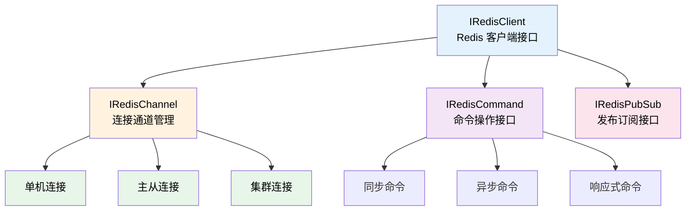

# Lettuce Redis

Lettuce Redis 模块是 TabooLib 提供的 Redis 客户端封装，基于 Lettuce Core 库实现，提供了简洁的 DSL 风格 API，支持单机、主从、哨兵和集群等多种 Redis 部署模式。

## 核心概念

Lettuce Redis 模块采用接口分层设计，将不同的功能职责拆分到独立的接口中：



- **IRedisClient**: Redis 客户端接口，负责客户端的启动和生命周期管理
- **IRedisChannel**: 连接通道管理接口，提供底层连接的获取和管理
- **IRedisCommand**: 命令操作接口，提供同步、异步和响应式的 Redis 命令执行
- **IRedisPubSub**: 发布订阅接口，提供 Redis 的 Pub/Sub 功能

## 快速开始

### 添加依赖

在你的 `build.gradle.kts` 中添加模块依赖：

```kotlin
taboolib {
    install("database-lettuce-redis")
}
```

### 单机模式

#### 配置文件

在配置文件中定义 Redis 连接信息：

```yaml
redis:
  # 基础连接配置
  host: localhost
  port: 6379
  password: your_password  # 可选
  ssl: false
  timeout: PT15S           # 超时时间 (Duration 格式)
  database: 0              # 数据库编号 0-15

  # 线程池配置
  ioThreadPoolSize: 0              # 0 表示自动识别
  computationThreadPoolSize: 0     # 0 表示自动识别

  # 连接选项
  autoReconnect: true                      # 自动重连
  pingBeforeActivateConnection: true       # 激活前 PING 测试

  # 连接池配置
  pool:
    lifo: true                # 后进先出
    fairness: false           # 公平锁
    maxTotal: 8               # 最大连接数
    maxIdle: 8                # 最大空闲连接
    minIdle: 0                # 最小空闲连接
    testOnBorrow: false       # 借出时测试
    maxWaitDuration: PT15S    # 最大等待时间
    blockWhenExhausted: true  # 耗尽时阻塞

  # 异步连接池配置
  asyncPool:
    maxTotal: 8
    maxIdle: 8
    minIdle: 0
```

:::tip[Duration 格式说明]
配置中的时间使用 Java Duration 格式：
- `PT20.345S` - 20.345 秒
- `PT15M` - 15 分钟
- `PT10H` - 10 小时
- `P2D` - 2 天
- `P2DT3H4M` - 2 天 3 小时 4 分钟
:::

#### 创建客户端

```kotlin
object RedisManager {

    // 加载配置
    val config = LettuceRedisConfig(
        configuration.getConfigurationSection("redis")!!
    )

    // 创建客户端
    val client = LettuceRedisClient(config)

    init {
        // 启动客户端 (异步)
        client.start().thenAccept {
            info("Redis 客户端启动成功")
        }.exceptionally {
            warning("Redis 客户端启动失败: ${it.message}")
            null
        }
    }
}
```

#### 基础操作

**同步命令：**

```kotlin
// SET/GET 操作
client.useCommands { commands ->
    // 设置值
    commands.set("key", "value")

    // 获取值
    val value = commands.get("key")
    println("Value: $value")

    // 设置过期时间 (秒)
    commands.setex("temp_key", 60, "temp_value")

    // 删除键
    commands.del("key")
}
```

**异步命令：**

```kotlin
// 异步 SET/GET 操作
client.useAsyncCommands { commands ->
    // 设置值
    commands.set("key", "value")

    // 获取值
    commands.get("key")
}.thenAccept { value ->
    println("Value: $value")
}.exceptionally { error ->
    warning("操作失败: ${error.message}")
    null
}
```

**响应式命令：**

```kotlin
// 使用响应式 API
client.useReactiveCommands { commands ->
    commands.set("key", "value")
        .then(commands.get("key"))
}.thenAccept { value ->
    println("Value: $value")
}
```

### 主从模式

主从模式下，写操作在主节点执行，读操作可以分散到从节点，提升读性能。

#### 配置文件

```yaml
redis:
  host: localhost
  port: 6379
  password: your_password
  ssl: false
  timeout: PT15S
  database: 0

  # 启用主从模式
  slaves:
    enable: true
    # 读取策略
    readFrom: nearest  # 优先从延迟最低的节点读取

    # 其他可选策略：
    # master - 只从主节点读取
    # masterPreferred - 优先从主节点读取，主节点不可用时从从节点读取
    # slave/replica - 只从从节点读取
    # slavePreferred/replicaPreferred - 优先从从节点读取，无可用从节点时从主节点读取
    # nearest/lowestLatency - 从延迟最低的节点读取
    # any - 从任何节点读取
    # anyReplica - 从任何从节点读取

  pool:
    maxTotal: 8
    maxIdle: 8
    minIdle: 0

  asyncPool:
    maxTotal: 8
    maxIdle: 8
    minIdle: 0
```

#### 使用方式

主从模式的使用方式与单机模式完全相同，只需要在配置中启用 `slaves.enable`，客户端会自动根据 `readFrom` 策略路由读写操作：

```kotlin
// 创建客户端 (配置启用了主从模式)
val client = LettuceRedisClient(config)
client.start().join()

// 写操作 - 自动路由到主节点
client.useCommands { commands ->
    commands.set("key", "value")
}

// 读操作 - 根据 readFrom 策略路由
client.useCommands { commands ->
    val value = commands.get("key")  // 可能从从节点读取
}
```

### 哨兵模式

哨兵模式提供 Redis 的高可用方案，当主节点故障时自动进行主从切换。

#### 配置文件

```yaml
redis:
  host: localhost      # 初始主节点地址 (用于首次连接)
  port: 6379
  password: your_password
  ssl: false
  timeout: PT15S
  database: 0

  # 启用哨兵模式
  sentinel:
    enable: true
    masterId: mymaster  # 主节点名称 (需与哨兵配置一致)
    nodes:              # 哨兵节点列表
      - "127.0.0.1:26379"
      - "127.0.0.2:26379"
      - "127.0.0.3:26379"

  pool:
    maxTotal: 8
    maxIdle: 8
    minIdle: 0

  asyncPool:
    maxTotal: 8
    maxIdle: 8
    minIdle: 0
```

#### 使用方式

```kotlin
// 创建客户端 (配置启用了哨兵模式)
val client = LettuceRedisClient(config)
client.start().join()

// 使用方式与单机模式相同
client.useCommands { commands ->
    commands.set("key", "value")
    val value = commands.get("key")
}
```

:::note
哨兵模式下，客户端会自动从哨兵获取当前的主节点地址，当主节点故障时会自动切换到新的主节点，对应用透明。
:::

### 集群模式

集群模式通过分片将数据分散到多个节点，提供水平扩展能力和高可用性。

#### 配置文件

```yaml
redis:
  # 集群配置
  cluster:
    # 节点配置 (在 clusters 目录下创建多个节点配置文件)
    # 例如：clusters/cluster0.yml, clusters/cluster1.yml

    # 拓扑刷新配置
    enablePeriodicRefresh: false         # 启用定期刷新
    refreshPeriod: PT60S                 # 刷新周期

    # 自适应刷新触发器
    enableAdaptiveRefreshTrigger:
      - MOVED_REDIRECT                   # MOVED 重定向时刷新
      - ASK_REDIRECT                     # ASK 重定向时刷新
      - PERSISTENT_RECONNECTS            # 持续重连时刷新
      - UNKNOWN_NODE                     # 未知节点时刷新
      - UNCOVERED_SLOT                   # 未覆盖槽时刷新

    adaptiveRefreshTriggersTimeout: PT30S  # 自适应刷新超时
    refreshTriggersReconnectAttempts: 5    # 重连尝试次数

    # 其他配置
    dynamicRefreshSources: true            # 动态刷新源
    closeStaleConnections: true            # 关闭过时连接
    maxRedirects: 5                        # 最大重定向次数
    validateClusterNodeMembership: true    # 验证节点成员关系

  # 连接池配置
  pool:
    maxTotal: 8
    maxIdle: 8
    minIdle: 0

  asyncPool:
    maxTotal: 8
    maxIdle: 8
    minIdle: 0
```

#### 集群节点配置

在 `clusters/` 目录下创建节点配置文件，例如 `clusters/cluster0.yml`：

```yaml
redis:
  host: 127.0.0.1
  port: 7000
  password: your_password
  ssl: false
  timeout: PT15S
  database: 0

  # 如果使用哨兵
  sentinel:
    enable: false
    masterId: mymaster
    nodes:
      - "127.0.0.1:26379"
```

#### 使用方式

```kotlin
// 创建集群客户端
val config = LettuceRedisConfig(
    configuration.getConfigurationSection("redis")!!
)
val client = LettuceClusterRedisClient(config)
client.start().join()

// 使用集群命令
client.useClusterCommands { commands ->
    // 基础操作
    commands.set("key", "value")
    val value = commands.get("key")

    // 跨槽操作需要注意
    commands.mget("key1", "key2", "key3")  // 如果键在不同槽会报错
}

// 使用异步集群命令
client.useAsyncClusterCommands { commands ->
    commands.set("key", "value")
}.thenAccept { result ->
    println("SET result: $result")
}
```

:::warning[集群操作注意事项]
Redis 集群使用哈希槽 (hash slot) 分片，部分操作要求所有键必须在同一个槽中：
- `MGET`, `MSET` 等批量操作
- 事务操作 (MULTI/EXEC)
- Lua 脚本操作

如需确保键在同一个槽，可以使用哈希标签：`{user:1000}.name`, `{user:1000}.age`
:::

## 常用操作

### 字符串操作

```kotlin
client.useCommands { commands ->
    // SET/GET
    commands.set("name", "TabooLib")
    val name = commands.get("name")

    // SETEX - 设置带过期时间的值
    commands.setex("session:token", 3600, "abc123")

    // SETNX - 仅当键不存在时设置
    val success = commands.setnx("lock:resource", "locked")

    // INCR/DECR - 数字增减
    commands.incr("counter")           // +1
    commands.incrby("counter", 10)     // +10
    commands.decr("counter")           // -1
    commands.decrby("counter", 5)      // -5

    // APPEND - 追加字符串
    commands.append("log", "new entry\n")

    // GETSET - 获取并设置新值
    val oldValue = commands.getset("config", "new_value")
}
```

### 哈希操作

```kotlin
client.useCommands { commands ->
    // HSET/HGET - 设置/获取单个字段
    commands.hset("user:1000", "name", "Steve")
    val name = commands.hget("user:1000", "name")

    // HMSET/HMGET - 批量设置/获取
    commands.hmset("user:1000", mapOf(
        "name" to "Steve",
        "age" to "25",
        "city" to "New York"
    ))
    val values = commands.hmget("user:1000", "name", "age")

    // HGETALL - 获取所有字段
    val userMap = commands.hgetall("user:1000")

    // HINCRBY - 字段值增加
    commands.hincrby("user:1000", "score", 10)

    // HDEL - 删除字段
    commands.hdel("user:1000", "temp_field")

    // HEXISTS - 检查字段是否存在
    val exists = commands.hexists("user:1000", "name")

    // HKEYS/HVALS - 获取所有键/值
    val keys = commands.hkeys("user:1000")
    val vals = commands.hvals("user:1000")
}
```

### 列表操作

```kotlin
client.useCommands { commands ->
    // LPUSH/RPUSH - 左侧/右侧添加
    commands.lpush("queue", "task1", "task2")
    commands.rpush("queue", "task3", "task4")

    // LPOP/RPOP - 左侧/右侧弹出
    val task = commands.lpop("queue")

    // LRANGE - 获取范围内元素
    val tasks = commands.lrange("queue", 0, -1)  // 获取所有

    // LLEN - 获取列表长度
    val length = commands.llen("queue")

    // LINDEX - 获取指定索引元素
    val element = commands.lindex("queue", 0)

    // LSET - 设置指定索引元素
    commands.lset("queue", 0, "new_task")

    // LTRIM - 保留指定范围元素
    commands.ltrim("queue", 0, 99)  // 保留前 100 个

    // BLPOP/BRPOP - 阻塞式弹出 (用于队列)
    val item = commands.blpop(10, "queue")  // 等待 10 秒
}
```

### 集合操作

```kotlin
client.useCommands { commands ->
    // SADD - 添加成员
    commands.sadd("tags", "java", "kotlin", "minecraft")

    // SMEMBERS - 获取所有成员
    val tags = commands.smembers("tags")

    // SISMEMBER - 检查成员是否存在
    val exists = commands.sismember("tags", "java")

    // SCARD - 获取集合大小
    val size = commands.scard("tags")

    // SREM - 删除成员
    commands.srem("tags", "kotlin")

    // SPOP - 随机弹出成员
    val randomTag = commands.spop("tags")

    // SINTER/SUNION/SDIFF - 交集/并集/差集
    val common = commands.sinter("tags1", "tags2")
    val all = commands.sunion("tags1", "tags2")
    val diff = commands.sdiff("tags1", "tags2")
}
```

### 有序集合操作

```kotlin
client.useCommands { commands ->
    // ZADD - 添加成员及分数
    commands.zadd("leaderboard", 100.0, "player1")
    commands.zadd("leaderboard", 200.0, "player2")
    commands.zadd("leaderboard", 150.0, "player3")

    // ZRANGE - 按排名获取 (升序)
    val topPlayers = commands.zrange("leaderboard", 0, 9)

    // ZREVRANGE - 按排名获取 (降序)
    val top10 = commands.zrevrange("leaderboard", 0, 9)

    // ZRANGEBYSCORE - 按分数范围获取
    val players = commands.zrangebyscore("leaderboard", 100.0, 200.0)

    // ZSCORE - 获取成员分数
    val score = commands.zscore("leaderboard", "player1")

    // ZRANK/ZREVRANK - 获取成员排名
    val rank = commands.zrank("leaderboard", "player1")  // 升序排名
    val revRank = commands.zrevrank("leaderboard", "player1")  // 降序排名

    // ZINCRBY - 增加成员分数
    commands.zincrby("leaderboard", 50.0, "player1")

    // ZREM - 删除成员
    commands.zrem("leaderboard", "player2")

    // ZCARD - 获取集合大小
    val size = commands.zcard("leaderboard")
}
```

### 键操作

```kotlin
client.useCommands { commands ->
    // DEL - 删除键
    commands.del("key1", "key2", "key3")

    // EXISTS - 检查键是否存在
    val exists = commands.exists("key")

    // EXPIRE/EXPIREAT - 设置过期时间
    commands.expire("key", 60)                    // 60 秒后过期
    commands.expireat("key", System.currentTimeMillis() / 1000 + 60)

    // TTL/PTTL - 获取剩余过期时间
    val ttl = commands.ttl("key")        // 秒
    val pttl = commands.pttl("key")      // 毫秒

    // PERSIST - 移除过期时间
    commands.persist("key")

    // KEYS/SCAN - 查找键 (生产环境推荐用 SCAN)
    val keys = commands.keys("user:*")

    // TYPE - 获取键的类型
    val type = commands.type("key")

    // RENAME - 重命名键
    commands.rename("old_key", "new_key")
}
```

## 发布订阅

### 发布消息

```kotlin
// 发布消息到频道
client.usePubSubCommands { commands ->
    val receivers = commands.publish("chat:global", "Hello, World!")
    println("消息已发送给 $receivers 个订阅者")
}
```

### 订阅频道

```kotlin
// 添加消息监听器
client.usePubSubCommands { commands ->
    commands.statefulConnection.addListener(object : RedisPubSubListener<String, String> {
        override fun message(channel: String, message: String) {
            println("收到消息 [$channel]: $message")
        }

        override fun message(pattern: String, channel: String, message: String) {
            println("收到匹配消息 [$pattern] [$channel]: $message")
        }

        override fun subscribed(channel: String, count: Long) {
            println("已订阅频道: $channel (当前订阅数: $count)")
        }

        override fun psubscribed(pattern: String, count: Long) {
            println("已订阅模式: $pattern (当前订阅数: $count)")
        }

        override fun unsubscribed(channel: String, count: Long) {
            println("已取消订阅: $channel (剩余订阅数: $count)")
        }

        override fun punsubscribed(pattern: String, count: Long) {
            println("已取消订阅模式: $pattern (剩余订阅数: $count)")
        }
    })

    // 订阅频道
    commands.subscribe("chat:global", "chat:trade")

    // 订阅模式 (支持通配符)
    commands.psubscribe("chat:*", "system:*")
}
```

### 取消订阅

```kotlin
client.usePubSubCommands { commands ->
    // 取消订阅频道
    commands.unsubscribe("chat:global")

    // 取消订阅模式
    commands.punsubscribe("chat:*")

    // 取消所有订阅
    commands.unsubscribe()  // 取消所有频道订阅
    commands.punsubscribe() // 取消所有模式订阅
}
```

## 最佳实践

### 连接管理

```kotlin
// ✅ 正确 - 使用单例客户端
object RedisManager {
    val client = LettuceRedisClient(config)

    init {
        client.start().join()
    }
}

// ❌ 错误 - 每次创建新客户端
fun getData(): String? {
    val client = LettuceRedisClient(config)  // 频繁创建连接
    client.start().join()
    return client.useCommands { it.get("key") }
}
```

### 异步操作

```kotlin
// ✅ 推荐 - 异步执行耗时操作
submit(async = true) {
    client.useCommands { commands ->
        val data = commands.get("large_data")
        // 处理数据

        // 在主线程中使用结果
        submit(async = false) {
            player.sendMessage("Data: $data")
        }
    }
}

// ❌ 不推荐 - 在主线程中执行
client.useCommands { commands ->
    val data = commands.get("large_data")  // 可能卡服
    player.sendMessage("Data: $data")
}
```

### 错误处理

```kotlin
// ✅ 正确 - 处理可能的 null
val value = client.useCommands { commands ->
    commands.get("key")
} ?: run {
    warning("Redis 操作失败")
    return@run "default_value"
}

// 异步操作的错误处理
client.useAsyncCommands { commands ->
    commands.get("key")
}.thenAccept { value ->
    // 处理结果
}.exceptionally { error ->
    warning("Redis 异步操作失败: ${error.message}")
    null
}
```

### 键命名规范

```kotlin
// ✅ 推荐的键命名规范
"user:${uuid}:data"              // 用户数据
"cache:player:${name}"           // 缓存
"lock:resource:${resourceId}"    // 锁
"session:${sessionId}"           // 会话
"leaderboard:money"              // 排行榜

// ❌ 不推荐
"data"                           // 太模糊
"u:${uuid}"                      // 可读性差
"player_data_${uuid}"            // 使用下划线不如冒号
```

## 迁移指南

### 从旧版本迁移

:::warning[破坏性变更]
TabooLib 6.2+ 对 Lettuce Redis 模块进行了全面重构，旧版本的代码需要迁移。
:::

#### 旧版用法

```kotlin
// 旧版
val redis = SingleClient(...)
redis.useCommands { commands ->
    commands.set("key", "value")
}
```

#### 新版用法

```kotlin
// 新版
val config = LettuceRedisConfig(configuration.getConfigurationSection("redis")!!)
val client = LettuceRedisClient(config)
client.start().join()

client.useCommands { commands ->
    commands.set("key", "value")
}
```

#### 主要变更

1. **客户端类变更**
   - `SingleClient` → `LettuceRedisClient`
   - `ClusterClient` → `LettuceClusterRedisClient`
   - `MasterSlaveClient` → 使用 `LettuceRedisClient` 并启用 `slaves` 配置

2. **接口重构**
   - 新增 `IRedisClient`、`IRedisChannel`、`IRedisCommand`、`IRedisPubSub` 接口
   - 使用接口分层设计，职责更清晰

3. **配置结构调整**
   - 连接池配置结构优化
   - 新增异步连接池配置
   - 集群配置项增加
   - 超时时间使用 Duration 格式

4. **依赖版本升级**
   - Lettuce Core 升级至 6.6.0
   - Apache Commons Pool2 升级至 2.12.1

#### 配置文件迁移

新版配置文件结构更加清晰，需要根据新的格式重新组织配置。详细配置示例请参考本文档的配置部分。

## 相关链接

- [Lettuce 官方文档](https://lettuce.io/)
- [Redis 命令参考](https://redis.io/commands/)
- [TabooLib 数据库模块](/docs/basic-tech/database/index.md)
