# TabooLib IoC 容器

TabooLib IoC 是为 TabooLib Bukkit 插件场景提供的轻量 IoC（控制反转）容器，支持组件标记、依赖注入、生命周期管理、AOP 切面编程、条件装配等完整的 IoC 能力。

## 核心架构

```mermaid
graph TB
    A[IoC 容器] --> B[组件扫描]
    A --> C[依赖注入]
    A --> D[生命周期管理]
    A --> E[AOP 代理]
    A --> F[条件装配]

    B --> B1["@Component / @Service<br/>@Repository / @Controller"]
    B --> B2["@Configuration + @Bean"]
    B --> B3["@ComponentScan"]

    C --> C1["构造函数注入"]
    C --> C2["字段注入 @Inject"]
    C --> C3["方法注入"]
    C --> C4["@Named / @Resource"]

    D --> D1["@PostConstruct"]
    D --> D2["@PostEnable"]
    D --> D3["@PreDestroy"]

    E --> E1["@Aspect"]
    E --> E2["@Before / @After / @Around"]

    F --> F1["@ConditionalOnClass"]
    F --> F2["@ConditionalOnBean"]
    F --> F3["@ConditionalOnProperty"]

    style A fill:#e3f2fd,color:#000
    style B fill:#fff3e0,color:#000
    style C fill:#e8f5e9,color:#000
    style D fill:#f3e5f5,color:#000
    style E fill:#fce4ec,color:#000
    style F fill:#f1f8e9,color:#000
```

IoC 容器提供以下核心能力：

- **组件扫描**：通过 `@Component`、`@Service`、`@Repository`、`@Controller` 标记组件，或通过 `@Configuration` + `@Bean` 声明
- **依赖注入**：支持构造函数、字段、方法三种注入方式，配合 `@Named` / `@Resource` 实现名称限定
- **生命周期管理**：`@PostConstruct` → `@PostEnable` → `@PreDestroy` 完整生命周期回调
- **AOP 代理**：基于 JDK 动态代理的切面编程，支持 `@Before`、`@After`、`@Around` 通知
- **条件装配**：根据运行时条件（类存在性、Bean 存在性、属性值）决定是否注册 Bean

## 功能一览

| 功能 | 说明 |
|------|------|
| 组件标记 | `@Component`、`@Service`、`@Repository`、`@Controller` |
| 依赖注入 | 构造函数、字段、方法注入 |
| 属性注入 | `@Value("\${property:default}")` 从配置文件或系统属性注入 |
| 名称限定 | `@Named`、`@Resource`、`@Primary` |
| 生命周期 | `@PostConstruct`、`@PostEnable`、`@PreDestroy` |
| 作用域 | singleton、`@Prototype`、`@ThreadScope`、`@RefreshScope`、自定义作用域 |
| 扫描控制 | `@ComponentScan` 限制扫描范围 |
| 懒加载 | `@Lazy`（类级别延迟初始化 + 字段/参数级别代理懒加载） |
| 排序控制 | `@Order` 控制 Bean 排序和 AOP Advisor 执行顺序 |
| 事件机制 | `EventBus` 监听 Bean 创建/销毁和容器生命周期事件 |
| 循环依赖 | singleton Bean 字段/方法循环依赖可解析，构造函数循环依赖输出依赖链 |
| Kotlin object | 自动注入 `object` 类中的 `@Inject`/`@Resource` 字段 |
| 容器查询 | `getBean`、`getBeansOfType`、`containsBean`、`getBeanNames` |
| AOP 支持 | `@Aspect`、`@Before`、`@After`、`@Around`、`@Pointcut`（JDK 动态代理） |
| 条件装配 | `@ConditionalOnClass`、`@ConditionalOnBean`、`@ConditionalOnProperty` 等 |
| Kotlin 扩展 | `bean<T>()`、`beanOrNull<T>()`、`beans<T>()` |
| Java Config | `@Configuration` + `@Bean` 方法声明 Bean |
| 配置文件 | `@PropertySource` 加载 `.properties` / `.yml` |
| 初始化顺序 | `@DependsOn` 显式声明依赖 |
| 可选注入 | `@Inject(required = false)` |
| 后处理器 | `BeanPostProcessor` 扩展点 |
