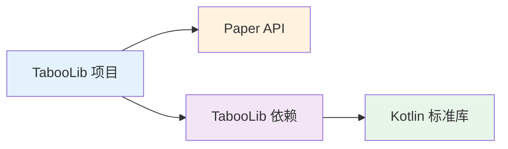
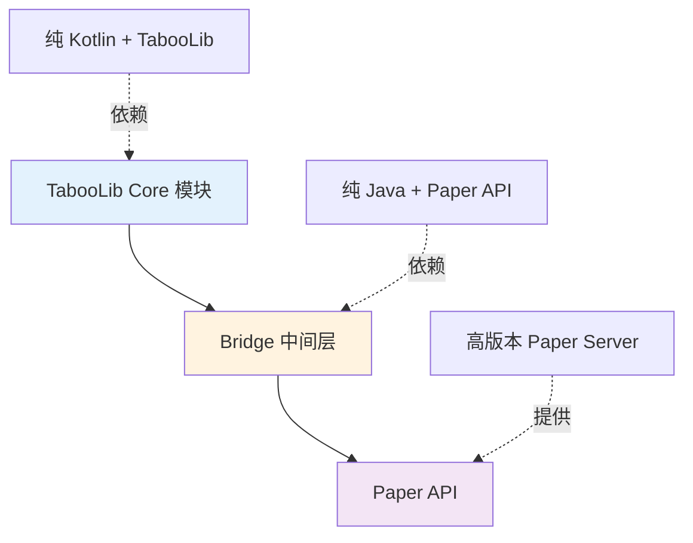
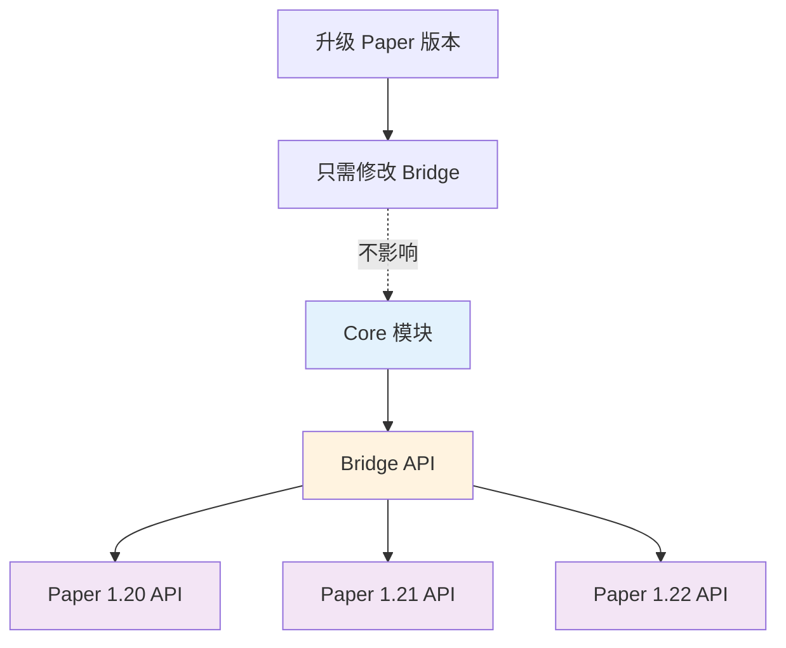

# 高版本 Paper 兼容

在使用 TabooLib 开发 Paper 插件时，你可能会遇到高版本 Paper API 与 TabooLib 的兼容性问题。本文将介绍如何通过 **Bridge 模块**（中间层）优雅地解决这个问题。

## 为什么需要 Bridge 模块？

### 问题背景



当你的项目同时依赖 TabooLib 和高版本 Paper API 时，可能会遇到以下问题：

1. **依赖冲突**：TabooLib 的 Kotlin 版本可能与你项目需要的版本不一致
2. **API 版本不兼容**：高版本 Paper API 的某些特性在 TabooLib 环境下无法直接使用
3. **构建复杂度**：需要处理 shade、relocate 等复杂的 Gradle 配置

### Bridge 模块解决方案



**Bridge 模块的优势：**
- ✅ **隔离依赖**：Bridge 使用纯 Java，无 Kotlin 依赖冲突
- ✅ **API 封装**：将 Paper API 封装成简单易用的接口
- ✅ **降低耦合**：Core 模块只需要依赖 Bridge，不直接依赖 Paper
- ✅ **易于维护**：Paper API 变更时只需修改 Bridge 模块

## 项目结构设计

### 双模块架构

```
PaperAndTaboo/
├── build/                          # 统一构建输出目录
│   └── libs/
│       ├── PaperAndTaboo-bridge-1.0.jar
│       └── PaperAndTaboo-core-1.0.jar
├── gradle/
│   └── libs.versions.toml         # Version Catalog（统一依赖管理）
├── bridge/                         # Bridge 模块（纯 Java）
│   ├── src/main/java/
│   │   └── top/maplex/paperandtaboo/
│   │       ├── PaperAndTabooBridge.java
│   │       └── BridgeAPI.java
│   ├── src/main/resources/
│   │   └── paper-plugin.yml
│   └── build.gradle.kts
├── core/                           # Core 模块（Kotlin + TabooLib）
│   ├── src/main/kotlin/
│   │   └── top/maplex/paperandtaboo/core/
│   │       └── PaperAndTabooCore.kt
│   └── build.gradle.kts
├── settings.gradle.kts
├── build.gradle.kts
└── gradle.properties
```

**模块说明：**
- **bridge**：使用纯 Java 编写，封装 Paper API，无 TabooLib 依赖
- **core**：使用 Kotlin + TabooLib，实现插件核心功能，依赖 bridge 模块

## 步骤 1：配置项目根目录

### 1.1 创建 settings.gradle.kts

```kotlin title="settings.gradle.kts" showLineNumbers
rootProject.name = "PaperAndTaboo"

// Plugin repositories for TabooLib
pluginManagement {
    repositories {
        gradlePluginPortal()
        mavenCentral()
        // highlight-next-line
        maven("https://repo.tabooproject.org/repository/releases/")
    }
}

// Include submodules
include("bridge")
include("core")
```

**配置说明：**
- `pluginManagement`：配置插件仓库，包含 TabooLib Gradle 插件仓库
- `include`：包含 bridge 和 core 两个子模块

### 1.2 创建 Version Catalog

创建 `gradle/libs.versions.toml` 统一管理依赖版本：

```toml title="gradle/libs.versions.toml" showLineNumbers
[versions]
# Kotlin
kotlin = "2.2.21"

# Minecraft & Paper
paper-api = "1.21.8-R0.1-SNAPSHOT"

# Plugins
shadow = "8.3.0"
taboolib-gradle = "2.0.27"

[libraries]
# Paper
paper-api = { module = "io.papermc.paper:paper-api", version.ref = "paper-api" }

[plugins]
kotlin-jvm = { id = "org.jetbrains.kotlin.jvm", version.ref = "kotlin" }
shadow = { id = "com.gradleup.shadow", version.ref = "shadow" }
// highlight-next-line
taboolib = { id = "io.izzel.taboolib", version.ref = "taboolib-gradle" }
```

:::tip[Version Catalog 优势]

使用 Version Catalog 可以：
- 在一个文件中统一管理所有依赖版本
- 避免版本冲突和重复定义
- 方便后续版本升级

:::

### 1.3 配置根项目 build.gradle.kts

```kotlin title="build.gradle.kts" showLineNumbers
plugins {
    alias(libs.plugins.kotlin.jvm) apply false
    alias(libs.plugins.shadow) apply false
}

group = "top.maplex"
version = "1.0"

// 配置所有子项目
subprojects {
    apply(plugin = "org.jetbrains.kotlin.jvm")

    repositories {
        mavenCentral()
        maven("https://repo.papermc.io/repository/maven-public/")
    }
}

// 统一构建任务
tasks.register("buildAll") {
    group = "build"
    description = "Build all subprojects"
    dependsOn(":bridge:build", ":core:build")
}

// 清理任务
tasks.register<Delete>("cleanAll") {
    group = "build"
    description = "Clean all build outputs"
    delete(layout.buildDirectory)
    subprojects {
        delete(layout.buildDirectory)
    }
}
```

**关键点：**
- `apply false`：在根项目中声明插件但不应用，由子项目按需应用
- `buildAll`：自定义任务，一次性构建所有模块
- `cleanAll`：清理所有构建输出

## 步骤 2：创建 Bridge 模块

### 2.1 Bridge 模块的 build.gradle.kts

```kotlin title="bridge/build.gradle.kts" showLineNumbers
plugins {
    java
    alias(libs.plugins.shadow)
}

group = "top.maplex"
version = "1.0"

repositories {
    mavenCentral()
    maven("https://repo.papermc.io/repository/maven-public/") {
        name = "papermc-repo"
    }
}

dependencies {
    // highlight-next-line
    compileOnly(libs.paper.api)
}

java {
    sourceCompatibility = JavaVersion.VERSION_21
    targetCompatibility = JavaVersion.VERSION_21
    toolchain {
        languageVersion.set(JavaLanguageVersion.of(21))
    }
}

tasks {
    shadowJar {
        // highlight-start
        archiveBaseName.set("PaperAndTaboo-bridge")
        archiveClassifier.set("")
        destinationDirectory.set(rootProject.layout.buildDirectory.dir("libs"))
        // highlight-end
    }

    build {
        dependsOn(shadowJar)
    }

    processResources {
        val props = mapOf("version" to version)
        inputs.properties(props)
        filteringCharset = "UTF-8"
        filesMatching("paper-plugin.yml") {
            expand(props)
        }
    }

    compileJava {
        options.encoding = "UTF-8"
    }
}
```

:::warning[只使用 Java]

Bridge 模块**不要**添加 Kotlin 插件和依赖，保持纯 Java 项目，避免依赖冲突。

:::

### 2.2 创建 Bridge 主类

```java title="bridge/src/main/java/top/maplex/paperandtaboo/PaperAndTabooBridge.java" showLineNumbers
package top.maplex.paperandtaboo;

import org.bukkit.plugin.java.JavaPlugin;

public class PaperAndTabooBridge extends JavaPlugin {

    private static PaperAndTabooBridge instance;
    private BridgeAPI bridgeAPI;

    @Override
    public void onEnable() {
        instance = this;
        // highlight-next-line
        bridgeAPI = new BridgeAPI(this);

        getLogger().info("PaperAndTaboo Bridge plugin enabled!");
    }

    @Override
    public void onDisable() {
        getLogger().info("PaperAndTaboo Bridge plugin disabled!");
    }

    public static PaperAndTabooBridge getInstance() {
        return instance;
    }

    // highlight-next-line
    public BridgeAPI getBridgeAPI() {
        return bridgeAPI;
    }
}
```

**代码说明：**
- `PaperAndTabooBridge`：标准的 Bukkit 插件主类
- `bridgeAPI`：API 实例，供 Core 模块调用
- `getInstance()`：单例模式，方便其他插件获取实例

### 2.3 创建 BridgeAPI 类

```java title="bridge/src/main/java/top/maplex/paperandtaboo/BridgeAPI.java" showLineNumbers
package top.maplex.paperandtaboo;

import org.bukkit.plugin.Plugin;

/**
 * Bridge API for PaperAndTaboo
 * This class exposes Paper API functionality to the core module
 */
public class BridgeAPI {

    private final PaperAndTabooBridge plugin;

    public BridgeAPI(PaperAndTabooBridge plugin) {
        this.plugin = plugin;
    }

    /**
     * Get the bridge plugin instance
     * @return Plugin instance
     */
    public Plugin getPlugin() {
        return plugin;
    }

    // 在这里添加你需要暴露给 Core 模块的 Paper API 方法
    // 示例：
    // public void sendActionBar(Player player, String message) {
    //     player.sendActionBar(Component.text(message));
    // }
}
```

**设计要点：**
- 封装 Paper API 的复杂调用
- 提供简单易用的接口给 Core 模块
- 可以添加任何你需要的 Paper 功能

### 2.4 配置 paper-plugin.yml

```yaml title="bridge/src/main/resources/paper-plugin.yml" showLineNumbers
name: PaperAndTaboo-Bridge
version: '${version}'
main: top.maplex.paperandtaboo.PaperAndTabooBridge
api-version: '1.21'
authors: [YourName]
website: www.example.com
description: PaperAndTaboo Bridge Module - Paper API Wrapper
```

## 步骤 3：创建 Core 模块

### 3.1 Core 模块的 build.gradle.kts

```kotlin title="core/build.gradle.kts" showLineNumbers
import io.izzel.taboolib.gradle.*
import org.jetbrains.kotlin.gradle.tasks.KotlinCompile

plugins {
    java
    alias(libs.plugins.kotlin.jvm)
    // highlight-next-line
    alias(libs.plugins.taboolib)
    alias(libs.plugins.shadow)
}

// highlight-start
taboolib {
    description {
        // 设置插件依赖（Paper 插件依赖）
        dependencies {
            name("PaperAndTaboo-Bridge")
        }
    }

    env {
        // 安装需要的 TabooLib 模块
        install(Basic)
        install(Bukkit)
        install(BukkitUI)
        install(BukkitUtil)
        install(BukkitNMSUtil)
        install(BukkitHook)
        install(CommandHelper)
        install(I18n)
        install(MinecraftChat)
        install(Database)
        install(DatabasePlayer)
        install(Kether)
    }

    version {
        taboolib = "6.2.3"
    }
}
// highlight-end

group = "top.maplex"
version = "1.0"

repositories {
    mavenCentral()
    maven("https://repo.papermc.io/repository/maven-public/") {
        name = "papermc-repo"
    }
}

dependencies {
    // Depend on bridge module
    // highlight-next-line
    compileOnly(project(":bridge"))

    // Paper API
    compileOnly(libs.paper.api)

    // Kotlin
    compileOnly(kotlin("stdlib"))
}

kotlin {
    jvmToolchain(21)
}

tasks {
    shadowJar {
        archiveBaseName.set("PaperAndTaboo-core")
        archiveClassifier.set("")
        destinationDirectory.set(rootProject.layout.buildDirectory.dir("libs"))
    }

    build {
        dependsOn(shadowJar)
    }

    withType<JavaCompile> {
        options.encoding = "UTF-8"
    }

    withType<KotlinCompile> {
        compilerOptions {
            jvmTarget.set(org.jetbrains.kotlin.gradle.dsl.JvmTarget.JVM_21)
            freeCompilerArgs.add("-Xjvm-default=all")
        }
    }
}

java {
    sourceCompatibility = JavaVersion.VERSION_21
    targetCompatibility = JavaVersion.VERSION_21
}
```

**关键配置：**
- `alias(libs.plugins.taboolib)`：应用 TabooLib Gradle 插件
- `taboolib { }`：TabooLib DSL 配置块
- `compileOnly(project(":bridge"))`：依赖 bridge 模块
- `dependencies { name("PaperAndTaboo-Bridge") }`：声明 Paper 插件依赖

### 3.2 创建 Core 主类

```kotlin title="core/src/main/kotlin/top/maplex/paperandtaboo/core/PaperAndTabooCore.kt" showLineNumbers
package top.maplex.paperandtaboo.core

import taboolib.common.platform.Plugin
import taboolib.common.platform.function.info
import taboolib.platform.BukkitPlugin
import top.maplex.paperandtaboo.BridgeAPI
import top.maplex.paperandtaboo.PaperAndTabooBridge

object PaperAndTabooCore : Plugin() {

    // highlight-next-line
    lateinit var bridgeAPI: BridgeAPI
        private set

    override fun onEnable() {
        // 获取 Bridge 插件的 API
        // highlight-start
        val bridgePlugin = BukkitPlugin.getInstance().server.pluginManager.getPlugin("PaperAndTaboo-Bridge")
        if (bridgePlugin is PaperAndTabooBridge) {
            bridgeAPI = bridgePlugin.bridgeAPI
            info("Successfully hooked into PaperAndTaboo-Bridge!")
        } else {
            error("Failed to hook into PaperAndTaboo-Bridge! Please ensure the bridge plugin is installed.")
        }
        // highlight-end

        info("PaperAndTaboo Core plugin enabled!")
    }

    override fun onDisable() {
        info("PaperAndTaboo Core plugin disabled!")
    }
}
```

**代码说明：**
- `object PaperAndTabooCore`：Kotlin 单例对象，TabooLib 插件主类
- `lateinit var bridgeAPI`：延迟初始化的 Bridge API 引用
- `getPlugin("PaperAndTaboo-Bridge")`：获取 Bridge 插件实例
- `bridgePlugin.bridgeAPI`：获取 Bridge 提供的 API

:::info[TabooLib 插件依赖]

TabooLib 会自动处理 `plugin.yml` 中的依赖声明，确保 Bridge 插件在 Core 插件之前加载。

:::

## 步骤 4：构建和使用

### 4.1 构建项目

在项目根目录执行：

```bash
# Windows
gradlew.bat buildAll

# macOS/Linux
./gradlew buildAll
```

构建完成后，在 `build/libs/` 目录下会生成两个 JAR 文件：

```
build/libs/
├── PaperAndTaboo-bridge-1.0.jar
└── PaperAndTaboo-core-1.0.jar
```

### 4.2 部署到服务器

将两个 JAR 文件复制到服务器的 `plugins/` 目录：

```
服务器目录/
├── plugins/
│   ├── PaperAndTaboo-bridge-1.0.jar    ← 必须安装
│   └── PaperAndTaboo-core-1.0.jar      ← 依赖 bridge
├── paper.jar
└── ...
```

:::danger[必须同时安装两个插件]

Core 插件依赖 Bridge 插件，**两个插件都必须安装**，否则 Core 插件无法启动！

:::

### 4.3 在 Core 中使用 Bridge API

```kotlin title="示例：使用 Bridge API" showLineNumbers
import taboolib.common.platform.command.CommandBody
import taboolib.common.platform.command.CommandHeader
import taboolib.expansion.createHelper
import top.maplex.paperandtaboo.core.PaperAndTabooCore

@CommandHeader("test")
object TestCommand {

    @CommandBody
    val main = createHelper {
        execute<Player> { sender, _, _ ->
            // highlight-start
            // 使用 Bridge API
            val bridge = PaperAndTabooCore.bridgeAPI
            val plugin = bridge.plugin
            // highlight-end

            sender.sendMessage("Bridge Plugin: ${plugin.name}")
            sender.sendMessage("Bridge Version: ${plugin.description.version}")
        }
    }
}
```

**使用流程：**
1. 通过 `PaperAndTabooCore.bridgeAPI` 获取 API 实例
2. 调用 Bridge API 提供的方法
3. Bridge 内部使用 Paper API 实现具体功能

## 最佳实践

### 扩展 Bridge API

根据你的需求，在 `BridgeAPI.java` 中添加方法：

```java title="BridgeAPI.java - 扩展示例" showLineNumbers
package top.maplex.paperandtaboo;

import net.kyori.adventure.text.Component;
import org.bukkit.entity.Player;
import org.bukkit.plugin.Plugin;

public class BridgeAPI {

    private final PaperAndTabooBridge plugin;

    public BridgeAPI(PaperAndTabooBridge plugin) {
        this.plugin = plugin;
    }

    public Plugin getPlugin() {
        return plugin;
    }

    // highlight-start
    /**
     * Send action bar to player
     * @param player Target player
     * @param message Message text
     */
    public void sendActionBar(Player player, String message) {
        player.sendActionBar(Component.text(message));
    }

    /**
     * Send title to player
     * @param player Target player
     * @param title Title text
     * @param subtitle Subtitle text
     */
    public void sendTitle(Player player, String title, String subtitle) {
        player.sendTitle(
            Component.text(title),
            Component.text(subtitle),
            10, 70, 20
        );
    }
    // highlight-end
}
```

然后在 Core 模块中使用：

```kotlin title="在 Core 中使用扩展的 API" showLineNumbers
@CommandBody
val title = createHelper {
    execute<Player> { sender, _, _ ->
        val bridge = PaperAndTabooCore.bridgeAPI

        // highlight-start
        // 使用 Bridge 封装的 Paper API
        bridge.sendActionBar(sender, "Action Bar 消息")
        bridge.sendTitle(sender, "标题", "副标题")
        // highlight-end
    }
}
```

### 版本隔离的优势



**当 Paper API 版本变更时：**
1. 只需修改 Bridge 模块的实现
2. Core 模块的代码无需改动
3. Bridge API 接口保持稳定

## 常见问题

### Core 插件无法加载？

**检查事项：**
1. ✅ Bridge 插件是否已安装
2. ✅ Bridge 插件是否成功启动
3. ✅ Core 的 `taboolib { }` 配置是否正确声明依赖

**解决方法：**

查看服务器日志，确认 Bridge 插件先于 Core 插件加载：

```log
[INFO] [PaperAndTaboo-Bridge] Enabling PaperAndTaboo-Bridge v1.0
[INFO] PaperAndTaboo Bridge plugin enabled!
[INFO] [PaperAndTaboo-Core] Enabling PaperAndTaboo-Core v1.0
[INFO] Successfully hooked into PaperAndTaboo-Bridge!
```

### 如何添加更多 Paper API？

直接在 `BridgeAPI.java` 中添加新方法：

```java
public void yourNewMethod(Player player) {
    // 使用 Paper API 实现功能
    player.sendPlainMessage("Hello!");
}
```

### Bridge 模块可以用 Kotlin 吗？

❌ **不推荐**。使用 Java 的主要原因：
- 避免 Kotlin 版本冲突
- 减少依赖体积
- 简化构建配置

Bridge 模块应保持简单、纯净，只封装 Paper API。

## 总结

通过 Bridge 模块设计，你可以：

✅ **解决依赖冲突**：Bridge 使用纯 Java，隔离 Kotlin 依赖
✅ **版本解耦**：Paper API 变更只需修改 Bridge
✅ **简化开发**：Core 模块专注业务逻辑，使用 TabooLib 的便利性
✅ **易于维护**：模块职责清晰，便于后期扩展

这种架构特别适合需要同时使用 TabooLib 和高版本 Paper API 的大型项目。

## 完整示例项目

想要查看完整的工作示例？访问我们的 GitHub 仓库：

:::tip[示例项目]

📦 **PaperAndTaboo** - 完整的 Bridge 模块示例项目

🔗 [https://github.com/FxRayHughes/PaperAndTaboo](https://github.com/FxRayHughes/PaperAndTaboo)

**项目特点：**
- ✅ 完整的双模块架构
- ✅ Bridge 模块（纯 Java）
- ✅ Core 模块（Kotlin + TabooLib）
- ✅ Version Catalog 统一依赖管理
- ✅ 开箱即用的构建配置

你可以 clone 这个仓库作为你的项目模板！

:::
