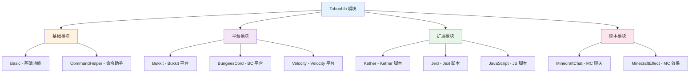

# 使用 TabooPlugin 插件创建

TabooPlugin 是 IntelliJ IDEA 的官方插件，提供了最便捷的项目创建方式。通过可视化界面，你可以在几分钟内创建一个完整配置的 TabooLib 项目。

## 什么是 TabooPlugin？

**TabooPlugin**（全名：Taboo Development）是专为 TabooLib 开发者设计的 IntelliJ IDEA 插件，提供以下功能：

- **项目模板**：一键创建完整的 TabooLib 项目结构
- **模块选择**：可视化选择需要的 TabooLib 模块
- **自动配置**：自动生成 Gradle 配置文件
- **开发辅助**：提供代码提示和快捷功能

:::tip[推荐使用]

TabooPlugin 是创建 TabooLib 项目最快速、最不容易出错的方式，强烈推荐新手使用！

:::

## 环境要求

- **IntelliJ IDEA** 2020.3 或更高版本（支持 Community 和 Ultimate 版本）
- **JDK 8** 或更高版本

## 安装插件

### 方式一：在线安装（推荐）

1. 打开 IntelliJ IDEA
2. 进入插件市场：
- **Windows/Linux**：`File` → `Settings` → `Plugins`
- **macOS**：`IntelliJ IDEA` → `Preferences` → `Plugins`
3. 切换到 **Marketplace** 标签
4. 在搜索框中输入 `taboo`
5. 找到 **Taboo Development** 插件
6. 点击 **Install** 按钮安装
7. 安装完成后点击 **Restart IDE** 重启 IDEA

<CImage id="2F30EAE3E2A2A435DC62BE19A6D7A05F" alt="插件市场搜索界面" />

:::info[插件链接]

你也可以直接访问插件页面：[Taboo Development - JetBrains Marketplace](https://plugins.jetbrains.com/plugin/25210-taboo-development)

:::

### 方式二：离线安装

如果你的 IDEA 无法连接到插件市场，可以手动下载安装：

1. 访问 [插件下载页面](https://plugins.jetbrains.com/plugin/25210-taboo-development/versions)
2. 下载与你的 IDEA 版本兼容的插件文件（`.zip` 格式）
3. 在 IDEA 中进入 `Settings` → `Plugins`
4. 点击齿轮图标 ⚙️ → `Install Plugin from Disk...`
5. 选择下载的插件文件
6. 重启 IDEA

## 创建项目

### 1. 打开新建项目向导

安装插件后，你可以通过以下方式创建新项目：

- 启动页面：点击 **New Project**
- 菜单栏：`File` → `New` → `Project`

<CImage id="d00479af-85d7-4db2-97b9-66ac5b029f9c" alt="新建项目" />

### 2. 选择 Taboo Development

在项目类型列表中找到并点击 **Taboo Development**。

**项目类型列表位置：**
```
新建项目
├── Java
├── Kotlin
├── Groovy
├── 空项目
├── Maven Archetype
├── Spring Boot
├── ...
├── Taboo Development    ← 选择这个
└── ...
```

:::tip[找不到选项？]

如果没有看到 Taboo Development 选项，请确认：
1. 插件已正确安装
2. IDEA 已重启
3. 你使用的是 IntelliJ IDEA（而不是 Android Studio 等其他 JetBrains IDE）

:::

<CImage id="495BECBD7138DAD0AE015267618BA592" alt="新建项目界面" zoom='50%' />

### 3. 配置项目基本信息

在右侧配置面板中，填写以下信息：

#### 3.1 项目名称 (Name)

- **说明**：你的插件项目名称
- **示例**：`MyFirstPlugin`、`AwesomeShop`
- **规则**：
- 不能包含空格和特殊字符
- 建议使用 PascalCase（首字母大写）
- 将作为项目文件夹名称

#### 3.2 项目位置 (Location)

- **说明**：项目文件保存的路径
- **示例**：`E:\Desktop\IDEA\MyFirstPlugin`
- **建议**：选择一个你容易找到的目录

#### 3.3 创建 Git 仓库（可选）

- 勾选 **创建 Git 仓库** 可以自动初始化 Git 版本控制
- 建议勾选，方便后续代码管理

<CImage id="44e7ccb0-fb84-462e-93b6-66aef2d6c2d7" alt="项目配置界面" zoom='50%' />

完成基本信息配置后，点击 **Next（下一步）** 继续。

### 4. 配置 TabooLib 项目

接下来进入 TabooLib 项目配置页面，这是最关键的步骤。

<CImage id="f01aa769-55c8-4b29-8f4c-ed902f8790ef" alt="TabooLib 项目配置界面" />

#### 4.1 插件名称 (Plugin name)

- **说明**：你的插件在游戏中显示的名称
- **示例**：`IDEAProj`（如截图所示）
- **用途**：
- 在 `/plugins` 命令中显示
- 在控制台日志中显示

**命名建议：**
- 使用有意义的英文名称
- 避免使用中文（可能导致兼容性问题）
- 建议与项目名称保持一致

#### 4.2 插件主类 (Plugin main class)

- **说明**：插件的主类完整包名
- **示例**：`org.example.ideaproj.IDEAProj`
- **格式**：`包名.类名`

**包名规范：**
```
com.yourname.pluginname     # 个人开发者
com.company.pluginname      # 公司/团队
org.example.pluginname      # 示例项目
```

**类名建议：**
- 使用 PascalCase（每个单词首字母大写）
- 通常与插件名称相同
- 例如：`MyPlugin`、`AwesomeShop`

:::warning[注意]

主类名必须与实际创建的 Kotlin/Java 类名完全一致，否则插件将无法加载！

:::

#### 4.3 插件版本 (Plugin version)

- **说明**：插件的初始版本号
- **默认**：`1.0-SNAPSHOT`
- **版本格式**：
- 开发版：`1.0-SNAPSHOT`
- 正式版：`1.0.0`、`1.0.1`

**版本号规范：**
```
主版本号.次版本号.修订号
   ↓        ↓       ↓
  1    .   0   .   0

主版本号：重大功能变更
次版本号：新增功能
修订号：Bug 修复
```

#### 4.4 模块选择 (Module Selection)

这是最重要的配置部分！选择你的插件需要使用的 TabooLib 模块。

<CImage id="fd988978-760c-42f2-ab90-d66277d7ad67" alt="模块选择界面" />


**界面说明：**

左侧：**Available Modules（可用模块）**
- 显示所有 TabooLib 提供的模块
- 按功能分类展示
- 可以展开分类查看详细模块

右侧：**Selected Modules（已选择的模块）**
- 显示你已选择的模块
- 这些模块将被添加到项目依赖中
- 可以点击 ❌ 移除不需要的模块

**模块分类：**



**常用模块推荐：**

| 模块分类 | 模块名称 | 说明 | 是否必需 |
|---------|---------|------|---------|
| **基础** | Basic | 基础功能（必选） | ✅ 必需 |
| | CommandHelper | 命令系统增强 | ⭐ 推荐 |
| **平台** | Bukkit | Bukkit/Spigot/Paper 支持 | ✅ 必需（Bukkit 插件）|
| | BungeesCord | BungeeCord 代理端支持 | 按需 |
| | Velocity | Velocity 代理端支持 | 按需 |
| **功能** | Kether | Kether 脚本引擎 | ⭐ 推荐 |
| | Jexl | Jexl 表达式引擎 | 按需 |
| | JavaScript | JavaScript 脚本支持 | 按需 |

**截图中的默认选择：**
```
✅ Basic              # 基础模块
✅ CommandHelper      # 命令助手
✅ Bukkit            # Bukkit 平台
✅ Kether            # Kether 脚本
✅ Jexl              # Jexl 脚本
✅ JavaScript        # JavaScript 脚本
```

:::tip[模块选择建议]

**新手推荐配置：**
- ✅ Basic（必选）
- ✅ CommandHelper（命令开发）
- ✅ Bukkit（Bukkit 插件开发）
- ✅ Kether（配置脚本）

**进阶配置：**
- 如果需要开发 BungeeCord 插件，选择 BungeesCord
- 如果需要使用 JavaScript，选择 JavaScript
- 如果需要粒子效果，选择 MinecraftEffect

:::

#### 4.5 完成配置

检查所有配置信息无误后，点击右下角：
- **上一步 (Previous)**：返回修改基本信息
- **下一步 (Next)** 或 **完成 (Finish)**：创建项目

:::info[创建过程]

点击完成后，IDEA 将：
1. 创建项目目录结构
2. 生成 Gradle 配置文件
3. 创建插件主类
4. 添加选定的 TabooLib 模块依赖
5. 自动初始化 Gradle 项目

首次创建时，Gradle 需要下载依赖，可能需要几分钟时间。

:::

## 项目结构

创建完成后，你将得到以下项目结构：

```
MyFirstPlugin/
├── .gradle/                    # Gradle 缓存目录
├── .idea/                      # IDEA 配置目录
├── gradle/                     # Gradle Wrapper
│   └── wrapper/
│       ├── gradle-wrapper.jar
│       └── gradle-wrapper.properties
├── src/
│   └── main/
│       ├── kotlin/            # Kotlin 源代码目录
│       │   └── org/example/pluginname/
│       │       └── MyPlugin.kt    # 插件主类
│       ├── java/              # Java 源代码目录（如果使用 Java）
│       └── resources/         # 资源文件目录
│           ├── plugin.yml     # 插件配置文件（自动生成）
│           └── config.yml     # 你的配置文件（可选）
├── build.gradle.kts           # Gradle 构建脚本
├── settings.gradle.kts        # Gradle 设置
├── gradlew                    # Gradle Wrapper（Unix）
├── gradlew.bat                # Gradle Wrapper（Windows）
└── .gitignore                 # Git 忽略文件
```

**关键文件说明：**

| 文件 | 说明 |
|------|------|
| `build.gradle.kts` | Gradle 构建配置，包含 TabooLib 模块和依赖 |
| `src/main/kotlin/` | Kotlin 源代码目录，你的代码放在这里 |
| `MyPlugin.kt` | 插件主类，继承自 `BukkitPlugin` |
| `plugin.yml` | 由 TabooLib 自动生成，无需手动编写 |

## 等待 Gradle 同步

项目创建后，IDEA 会自动开始 Gradle 同步。

**同步过程：**
1. 下载 Gradle Wrapper
2. 下载 TabooLib 依赖
3. 下载 Kotlin 标准库
4. 下载 Bukkit API
5. 索引项目文件

**同步状态查看：**
- 底部状态栏会显示：`Sync Gradle`
- 右下角可以看到进度通知

:::warning[首次同步可能较慢]

首次创建项目时，Gradle 需要下载大量依赖，可能需要 5-10 分钟。请耐心等待，不要中断同步过程。

**加速方法：**
- 配置 Gradle 镜像源（如阿里云）
- 使用稳定的网络连接
- 确保没有防火墙拦截

:::

## 验证项目

同步完成后，让我们验证项目是否创建成功。

### 1. 检查插件主类

打开 `src/main/kotlin/包名/主类.kt`，你应该看到类似这样的代码：

```kotlin title="src/main/kotlin/org/example/myplugin/MyPlugin.kt" showLineNumbers
package org.example.myplugin

import taboolib.common.platform.Plugin
import taboolib.platform.BukkitPlugin

// highlight-next-line
object MyPlugin : BukkitPlugin() {

    override fun onEnable() {
        logger.info("插件已启动！")
    }

    override fun onDisable() {
        logger.info("插件已关闭！")
    }
}
```

**代码说明：**
- `object MyPlugin`：Kotlin 单例对象，自动管理实例
- `: BukkitPlugin()`：继承 TabooLib 的 Bukkit 平台插件类
- `onEnable()`：插件启动时调用
- `onDisable()`：插件关闭时调用

### 2. 检查 Gradle 配置

打开 `build.gradle.kts`，确认 TabooLib 插件和模块配置正确：

```kotlin title="build.gradle.kts" showLineNumbers
import io.izzel.taboolib.gradle.*

plugins {
    java
    // highlight-next-line
    id("io.izzel.taboolib") version "2.0.27"
    kotlin("jvm") version "2.0.0"
}

// highlight-start
taboolib {
    // 你选择的模块
    install(Basic, CommandHelper, Bukkit, Kether, Jexl, JavaScript)

    // TabooLib 版本
    version {
        taboolib = "6.2.0"
    }
}
// highlight-end

repositories {
    mavenCentral()
}

dependencies {
    compileOnly(kotlin("stdlib"))
    compileOnly("ink.ptms.core:v12004:12004:mapped")
}
```

**关键配置：**
- `id("io.izzel.taboolib")`：TabooLib Gradle 插件
- `install(...)`：你在创建时选择的模块
- `version { taboolib = "..." }`：TabooLib 版本号

### 3. 构建项目

在 IDEA 右侧打开 **Gradle** 面板，执行构建任务：

```
MyPlugin
├── Tasks
│   └── build
│       └── jar    ← 双击这个
```

<CImage id="b3e76521-7d65-4fa7-ae20-42151136b80e" alt="Gradle 构建任务" />

或在终端执行：

```bash
# Windows
gradlew.bat jar

# macOS/Linux
./gradlew jar
```

**构建成功标志：**
```
BUILD SUCCESSFUL in 30s
```

构建完成后，在 `build/libs/` 目录下会生成插件 JAR 文件：
```
build/libs/
└── MyPlugin-1.0-SNAPSHOT.jar    # 你的插件文件
```

:::success[项目创建成功！]

如果能看到生成的 JAR 文件，说明项目已经成功创建并构建！🎉

:::

## 运行和测试

### 1. 部署到服务器

将生成的 JAR 文件复制到 Bukkit 服务器的 `plugins` 目录：

```
服务器目录/
├── plugins/
│   └── MyPlugin-1.0-SNAPSHOT.jar    ← 复制到这里
├── spigot.jar
└── ...
```

### 2. 启动服务器

启动你的 Bukkit/Spigot/Paper 服务器，观察控制台输出：

```log
[xx:xx:xx INFO]: [MyPlugin] 插件已启动！
[xx:xx:xx INFO]: [MyPlugin] Enabling MyPlugin v1.0-SNAPSHOT
```

### 3. 验证插件

在服务器控制台或游戏中执行：

```
/plugins
```

你应该能看到你的插件名称显示为绿色（表示已启用）。

## 常见问题

### 找不到 Taboo Development 选项？

**可能原因：**
1. 插件未正确安装
2. IDEA 未重启
3. IDEA 版本过低

**解决方法：**
1. 重新安装插件
2. 重启 IDEA
3. 更新 IDEA 到最新版本

### Gradle 同步失败？

**常见错误：**
```
Could not resolve all files for configuration
Connection timeout
```

**解决方法：**

#### 方法一：配置 Gradle 镜像源

在 `build.gradle.kts` 中添加国内镜像源：

```kotlin
repositories {
    maven("https://maven.aliyun.com/repository/public")  // 阿里云镜像
    mavenCentral()
}
```

#### 方法二：配置 IDEA HTTP 代理

如果你使用代理上网或需要通过代理访问 Maven 仓库，需要配置 IDEA 的 HTTP 代理。

**步骤 1：打开设置**

- **Windows/Linux**：`File` → `Settings` → `Appearance & Behavior` → `System Settings` → `HTTP Proxy`
- **macOS**：`IntelliJ IDEA` → `Preferences` → `Appearance & Behavior` → `System Settings` → `HTTP Proxy`

**步骤 2：选择代理类型**

根据你的网络环境选择：

1. **No proxy（无代理）**
   - 直接连接，不使用代理
   - 适合：直连网络、校园网等

2. **Auto-detect proxy settings（自动检测）**
   - IDEA 自动检测系统代理设置
   - 适合：使用系统代理的用户

3. **Manual proxy configuration（手动配置）**
   - 手动设置代理服务器
   - 适合：使用特定代理服务的用户

**步骤 3：手动配置代理（如果选择 Manual）**

填写代理信息：

```
HTTP:
  Host name: 127.0.0.1          # 代理服务器地址
  Port number: 7890             # 代理端口号

HTTPS:
  ☑ Use HTTP proxy settings    # 勾选此项，HTTPS 使用与 HTTP 相同的设置
```

**常见代理配置示例：**

| 代理类型 | Host | Port | 说明 |
|---------|------|------|------|
| Clash | `127.0.0.1` | `7890` | 默认配置 |
| V2rayN | `127.0.0.1` | `10809` | 默认配置 |
| Shadowsocks | `127.0.0.1` | `1080` | SOCKS 代理 |

:::warning[SOCKS 代理注意]

如果你的代理是 SOCKS 类型（如 Shadowsocks），需要：
1. 勾选 **SOCKS proxy**
2. 填写 SOCKS 代理地址和端口
3. 将协议设置为 **SOCKS5**

:::

**步骤 4：测试代理连接**

点击 **Check connection** 按钮，输入测试 URL：
```
https://repo.maven.apache.org/maven2/
```

如果显示 **Connection successful**，说明代理配置正确。

**步骤 5：应用设置**

点击 **Apply** → **OK** 保存设置。

**步骤 6：重新同步 Gradle**

- 点击 IDEA 右上角的 **Reload Gradle Project** 图标
- 或者在 Gradle 面板中右键点击项目 → **Reload Gradle Project**

#### 方法三：清除 Gradle 缓存

如果镜像源和代理都配置正确，但仍然失败，尝试清除缓存：

```bash
# 1. 删除项目的 .gradle 目录
# 在项目根目录执行
rm -rf .gradle          # macOS/Linux
rmdir /s .gradle        # Windows

# 2. 删除用户目录的 Gradle 缓存
# Windows: C:\Users\你的用户名\.gradle\caches
# macOS/Linux: ~/.gradle/caches
```

然后重新打开项目，让 Gradle 重新同步。

:::tip[推荐配置组合]

**国内用户最佳实践：**
1. ✅ 配置阿里云镜像源（build.gradle.kts）
2. ✅ 配置代理（如果有）
3. ✅ 检查防火墙设置

这样可以获得最佳的下载速度和成功率。

:::

### 插件无法加载？

**检查事项：**
1. 主类路径是否正确
2. TabooLib 版本是否兼容
3. 服务器版本是否支持
4. 是否缺少必要的依赖

**调试方法：**
- 查看服务器日志中的错误信息
- 确认 `plugin.yml` 配置正确
- 检查 Bukkit API 版本兼容性

### 如何添加更多模块？

如果创建项目后想添加新模块，编辑 `build.gradle.kts`：

```kotlin
taboolib {
    // 添加新模块到这里
    install(
        Basic,
        Bukkit,
        CommandHelper,
        // highlight-next-line
        MinecraftChat    // 新添加的模块
    )
}
```

然后点击 IDEA 右上角的 **Reload Gradle Project** 图标刷新。

<CImage id="8483B4C09F4B31698CFDD96A15A21964" alt="重新加载 Gradle 项目" />

## 获取帮助

如果遇到问题，欢迎寻求帮助：

- **插件问题**：[GitHub Issues](https://github.com/TabooLib/taboolib-gradle-plugin/issues)
- **TabooLib 问题**：[TabooLib Issues](https://github.com/TabooLib/taboolib/issues)
- **社区支持**：[QQ 群](https://qm.qq.com/q/i4Q9SFRqq4)
- **文档首页**：[返回首页](/docs/intro)

---

**最后更新：** 2025-01-03
