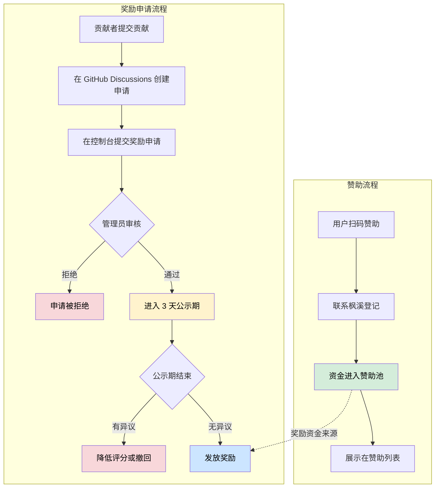

import SponsorList from '@site/src/components/SponsorList';

# 为爱发电 ❤️

感谢您访问 TabooWiki！本文档站点由个人维护，独立于 TabooLib 社区。

:::warning[重要说明]

**本文档站点的维护费用与 TabooLib 社区无关，属于个人收费项目。**

TabooLib 本身是完全免费、开源的项目。

:::

---

## 💰 现金支持

感谢以下赞助者的现金支持！

<SponsorList />

---

## 📋 赞助与奖励规则

### 法律声明与性质说明

:::danger[重要法律声明]

**奖励发放主体与性质：**

- 🙋‍♂️ **发放主体**：奖励由 **TabooWiki 维护者枫溪个人** 发放，非 TabooLib 社区官方行为
- 🎁 **法律性质**：接收奖励即视为接受 **个人无偿赠予**，不构成任何雇佣或委托关系
- 💻 **代码贡献性质**：所有代码贡献均为 **无偿开源贡献**，遵循 MIT 协议
- 🎯 **奖励定位**：奖励是对贡献者的 **个人感谢与鼓励**，不构成任何形式的报酬或对价

**请注意：**
- 提交贡献前请理解并同意以上性质说明
- 贡献者不得以获得奖励为由主张任何权利
- 贡献的代码归属于 TabooLib 项目（MIT 协议），不因奖励而改变归属

:::

### 赞助与奖励流程



### 社区监督机制

:::tip[保持社区风气]

为保证赞助池使用的公平透明，TabooWiki 建立了完善的监督机制：

**1. 申请公开透溯**
- 📝 所有贡献申请在 [GitHub Discussions](https://github.com/FxRayHughes/taboowiki/discussions/categories/%E8%B4%A1%E7%8C%AE%E7%94%B3%E8%AF%B7) 公开
- ♾️ 申请通过后 **永久保留，不会删除**，始终可追溯
- 👀 任何人都可以查看所有历史申请记录

**2. 公示期制度**
- ⏰ 奖励申请通过后进入 **3 天公示期**
- 🔍 社区成员可在公示期内提出异议
- ✅ 无异议后才会发放奖励

**3. 异议处理机制**
- 📢 任何人都可以在公示期内提出合理异议
- 🔎 管理员会认真审查异议内容
- ⚖️ 若异议成立，将采取以下措施：
  - 降低本次评分
  - 影响该贡献者下一次评分
  - 严重情况可能撤回奖励

**4. 透明度保障**
- 💵 每笔奖励详细记录在上方赞助列表
- 📊 包含贡献者、金额、时间等完整信息
- 🔄 确保赞助池使用透明公开

**我们相信，只有在阳光下运行，才能保持社区的健康发展。欢迎大家积极监督！**

:::

### 奖励评分机制

:::info[评分规则详解]

**评分范围：** 0 - 100 分

**奖励金额计算公式：**

```
奖励金额 = 赞助池余额 × (评分 / 100) × 调整系数
```

其中：
- **调整系数范围**：0.25% ~ 25%（即 0.0025 ~ 0.25）
- **当前调整系数**：根据贡献类型和质量由管理员评定
- **未来调整**：系数可能根据实际情况调整，调整前会公告

**评分影响因素：**

| 贡献类型 | 基础分数范围 | 评分考量 |
|---------|-------------|---------|
| 🐛 Bug 修复 | 20 - 80 | Bug 严重程度、修复难度、影响范围 |
| 📚 文档贡献 | 10 - 60 | 内容质量、完整性、实用性、可运行性 |
| 📢 推广贡献 | 15 - 70 | 平台影响力、内容质量、传播效果 |
| 🏆 重大贡献 | 50 - 100 | 创新性、影响力、技术难度 |

**评分流程：**
1. **自评**：贡献者提交申请时填写自评分（0-100）
2. **管理员复核**：管理员根据实际情况给出最终评分
3. **公示期**：评分在 3 天公示期内接受社区监督
4. **最终确定**：无异议后评分生效

**注意事项：**
- ⚠️ 奖励金额 **不固定**，取决于赞助池余额和评分
- 📉 赞助池余额不足时，可能需要等待新的赞助
- 🎯 评分越高，获得的奖励比例越大
- 📊 历史评分记录可在申请列表中查看

:::

### 如何赞助？

:::info[赞助渠道]

**扫码支持文档维护：**

<div style={{textAlign: 'center', margin: '20px 0'}}>


</div>

**赞助后请联系枫溪，添加到赞助列表。赞助金额将进入赞助池。**

赞助池用于奖励推动 TabooLib 发展的贡献者。

**关于留言：**
- 所有赞助者都可以留下一句话感言
- **300 元及以上** 的赞助者可以在留言中携带广告内容（如插件推荐、服务器宣传、个人网站等）
- **留言规范**：不得包含政治敏感、违法违规、色情低俗、人身攻击等不当内容，违规内容将不予展示

:::

### 如何获得推动支持奖励？

通过以下方式推动 TabooLib 发展，可申请赞助池奖励：

#### 1. 修复 TabooLib Bug 🐛

- 为 TabooLib 项目提交 Bug 修复的 Pull Request
- 修复经验证有效后，可申请奖励
- **评分考量**：Bug 严重程度、修复难度、影响范围

#### 2. 完善文档 📚

**编写可运行的示例：**
- ✅ 提供 GitHub 仓库链接
- ✅ 包含最小可执行 Demo
- ✅ 有清晰的 README 说明如何运行

**修复文档问题：**
- 🔴 修复文档严重问题：重大错误立即发放
- 🟡 修复文档小问题：累积到一定程度后发放

**评分考量**：内容质量、完整性、实用性、可运行性

#### 3. 推广 TabooLib 📢

在各个平台发布视频、文章、教学等内容，要求：

- ✅ 携带 TabooLib 的 [GitHub 仓库链接](https://github.com/TabooLib/taboolib)
- ✅ 携带本文档链接（TabooWiki）
- **评分考量**：平台影响力、内容质量、传播效果

#### 4. 重大贡献 🏆

- 引入新模块、新设计
- 推动 TabooLib 生态发展
- 解决与 TabooLib 相关的重大问题
- **评分考量**：创新性、影响力、技术难度

#### 申请步骤

1. **在 GitHub Discussions 创建贡献申请**
   - 访问 [贡献申请区](https://github.com/FxRayHughes/taboowiki/discussions/categories/%E8%B4%A1%E7%8C%AE%E7%94%B3%E8%AF%B7)
   - 使用申请模板创建详细申请
   - 填写贡献类型、描述、证明材料等

2. **在控制台提交奖励申请**
   - 登录 [控制台](/console)
   - 进入"我的奖励申请"
   - 填写申请表单，包含 GitHub Discussions 链接

3. **等待审核**
   - 管理员会在 3-7 个工作日内审核
   - 审核结果会在申请中显示

4. **公示与发放**
   - 通过后进入 3 天公示期
   - 公示期无异议后发放奖励

---

## 📚 关于本文档站点

TabooWiki 是一个 **个人维护** 的中文文档项目，致力于：

- 📖 **提供完善的中文文档**：系统化整理 TabooLib 的使用教程
- 📝 **编写实用的示例代码**：帮助开发者快速上手
- 🔄 **持续更新与维护**：跟进 TabooLib 版本更新
- 💡 **分享最佳实践**：总结实际开发经验

### 文档维护成本

维护高质量的中文文档需要投入：

- ⏰ **时间成本**：编写、校对、更新文档
- 💻 **服务器费用**：托管文档站点
- 🌐 **域名费用**：保持域名访问
- 🔧 **技术支持**：解答文档相关问题

### 其他支持方式

除了资金支持，您还可以：

- **反馈问题**：指出文档中的错误或不清楚的地方
- **提出建议**：建议增加哪些内容或改进哪些章节
- **分享文档**：向其他开发者推荐本文档

---

## 🔗 关于 TabooLib

TabooLib 是一个 **完全免费、开源** 的 Minecraft 插件开发框架：

- **GitHub**：[https://github.com/TabooLib/taboolib](https://github.com/TabooLib/taboolib)
- **官方 QQ 群**：[加入群聊](https://qm.qq.com/q/i4Q9SFRqq4)

如需支持 TabooLib 项目本身，请通过官方渠道联系。

---

## 📮 联系文档维护者

如有关于文档的问题或建议，欢迎联系：

- **GitHub Issues**：[提交问题](https://github.com/FxRayHughes/taboowiki/issues)
- **GitHub Discussions**：[参与讨论](https://github.com/FxRayHughes/taboowiki/discussions)
- **编辑建议**：在文档页面底部点击"编辑此页"

---

**感谢您的理解与支持！** 🙏
