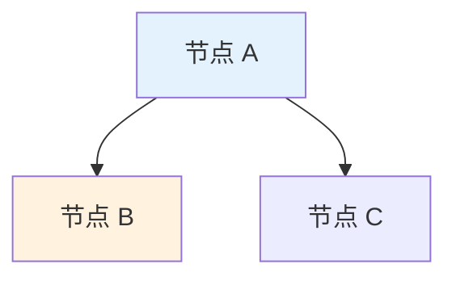
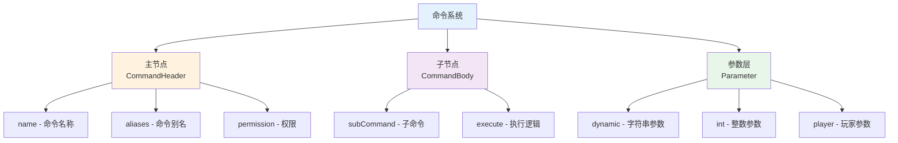
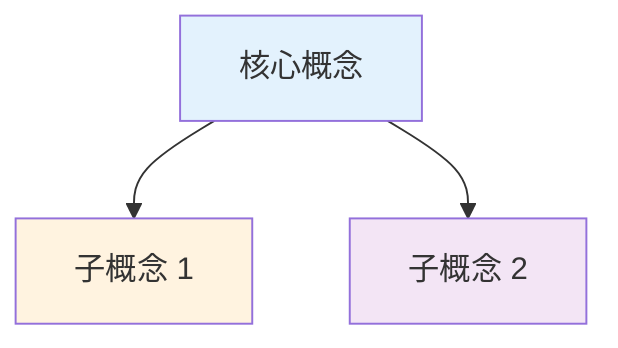

# TabooLib 文档编写规范

本文档总结了 TabooLib 文档的编写规范和最佳实践，用于保持文档风格的一致性。

## 文档技术栈与输出目录

文档使用 **Docusaurus** 技术栈编写，输出到 `E:\CodeWarehouse\TabooLib\taboolib\docs\taboowiki` 项目内。

**文档格式：** 使用 `.md` 或 `.mdx` 格式（MDX 支持在 Markdown 中使用 React 组件）。

**目录结构：**
```
taboowiki/
├── docs/              # 文档内容目录
│   ├── 模块名/
│   │   └── 功能.md
│   └── ...
├── blog/              # 博客目录（可选）
├── static/            # 静态资源（图片等）
├── docusaurus.config.js  # Docusaurus 配置
└── sidebars.js        # 侧边栏配置
```

## 基本原则

### Front Matter（文档元数据）

每个文档文件应在顶部使用 Front Matter 定义元数据：

```md
---
title: 页面标题           # 页面标题（必填，会显示在页面顶部和浏览器标签）
sidebar_label: 侧边栏标签 # 侧边栏显示的标签（可选，默认使用 title）
sidebar_position: 1       # 侧边栏位置（可选，用于排序）
description: 页面描述     # 页面描述，用于 SEO（推荐填写）
---
```

:::warning[关于 id 字段]

**不推荐使用自定义 `id` 字段**，应该让 Docusaurus 根据文件路径自动生成文档 ID。这样可以保持一致性并避免配置错误。

:::

#### 文件命名与文档 ID 规则

**推荐的文件结构：**

```
docs/
├── basic-tech/
│   ├── command/
│   │   └── index.md          # 文档 ID: basic-tech/command/index
│   └── config/
│       └── index.md          # 文档 ID: basic-tech/config/index
└── advanced-skills/
    ├── script-jexl/
    │   └── index.md          # 文档 ID: advanced-skills/script-jexl/index
    └── script-javascript/
        └── index.md          # 文档 ID: advanced-skills/script-javascript/index
```

**Front Matter 示例（推荐）：**

```md
---
title: JEXL 脚本引擎
sidebar_label: JEXL 脚本
sidebar_position: 1
description: TabooLib JEXL 脚本引擎的使用指南
---

# JEXL 脚本引擎

这里是正文内容...
```

**在 sidebars.js 中引用：**

```javascript
{
    type: 'category',
    label: '✨ 进阶技术',
    items: [
        'advanced-skills/script-jexl/index',        // 使用完整路径
        'advanced-skills/script-javascript/index'
    ],
}
```

**关键点：**
- ✅ 文件名统一使用 `index.md` 或 `index.mdx`
- ✅ Front Matter 中**不要**包含 `id` 字段
- ✅ 文档 ID 由目录结构自动生成：`目录路径/文件名（不含扩展名）`
- ✅ 在 `sidebars.js` 中使用完整的文档 ID 路径

### 遵循中文排版规范

基于 `docs/README.zh-Hans.md` 的排版指北：

1. **中英文之间需要增加空格**
   - ✅ 正确：`使用 @CommandHeader 注解`
   - ❌ 错误：`使用@CommandHeader注解`

2. **中文与数字之间需要增加空格**
   - ✅ 正确：`返回 5 个结果`
   - ❌ 错误：`返回5个结果`

3. **数字与单位之间需要增加空格**
   - ✅ 正确：`10 GB`
   - ❌ 错误：`10GB`
   - 例外：度数/百分比不加空格 `90°`、`15%`

4. **使用全角中文标点**
   - ✅ 正确：`你好，世界！`
   - ❌ 错误：`你好,世界!`

5. **数字使用半角字符**
   - ✅ 正确：`1000`
   - ❌ 错误：`１０００`

6. **专有名词使用正确的大小写**
   - ✅ 正确：`GitHub`、`TypeScript`
   - ❌ 错误：`github`、`GITHUB`、`Typescript`

7. **不重复使用标点符号**
   - ✅ 正确：`真的吗？！`
   - ❌ 错误：`真的吗？？！！`

## 文档结构

### 移除冗余内容

不要包含以下冗余章节：
- ❌ "总结" 章节
- ❌ "版本信息" 章节
- ❌ 过度的祝福语、鼓励语
- ❌ 不必要的"相关链接"（除非确实需要）

### 标题层级

使用清晰的标题层级，最多到三级标题：

```markdown
# 一级标题（模块名称）

## 二级标题（主要概念）

### 三级标题（具体细节）
```

## 内容编写

### 概念介绍

1. **使用可视化说明**

当解释复杂结构时，根据复杂度选择 ASCII 或 Mermaid 图表：

**复杂系统架构 - 推荐 Mermaid：**

```markdown
一个命令由主节点、子节点和参数层组成。以命令 `/taboolib give <user>` 为例：

```mermaid
graph LR
    A[/taboolib] --> B[give]
    B --> C["<user>"]

    A -->|主节点 Main| D[命令根节点<br/>通过 @CommandHeader 定义]
    B -->|子节点 Subcommand| E[固定指令]
    C -->|参数层 Parameter| F[动态参数<br/>运行时用户输入]

    style A fill:#e3f2fd
    style B fill:#fff3e0
    style C fill:#f3e5f5
```

- **主节点**: `/taboolib` - 命令的根节点，通过 `@CommandHeader` 定义
- **子节点**: `give` - 固定的子命令，通过 `@CommandBody` 定义
- **参数层**: `<user>` - 动态参数，在运行时由用户输入
```

**简单层级结构 - 可用 ASCII：**

```markdown
语言文件目录结构：

```
插件目录/
└── lang/
    ├── zh_CN.yml    # 简体中文
    ├── en_US.yml    # 英文
    └── zh_TW.yml    # 繁体中文
```
```

2. **先简后繁的讲解顺序**

先介绍基础概念，再深入细节：

```markdown
## 参数类型

### 字符串类型 (String)

最基础的参数类型，接受任意字符串输入。

[代码示例]

**适用场景：** 玩家名称、文本输入、路径等
```

### 代码示例

1. **完整且可运行的代码**

确保代码示例是完整的，可以直接使用：

```kotlin
// ✅ 好的示例 - 完整可用
@CommandHeader("taboolib", ["tl"], permission = "taboolib.command")
object TestCommand {
    @CommandBody
    val give = subCommand {
        dynamic("user") {
            execute<CommandSender> { sender, context, argument ->
                val user = context["user"]
                sender.sendMessage("Hello, $user")
            }
        }
    }
}

// ❌ 不好的示例 - 不完整
dynamic("user") {
    // ... 省略
}
```

2. **添加行内注释**

在关键代码处添加注释说明：

```kotlin
@CommandHeader(
    name = "taboolib",              // 主命令名称
    aliases = ["tl"],               // 命令别名
    description = "TabooLib 主命令", // 命令描述
    permission = "taboolib.command" // 所需权限
)
```

3. **代码后添加说明块**

使用 `**代码说明：**` 或 `**关键点：**` 进行解释：

```markdown
**代码说明：**
- `@CommandBody`：标记这是一个命令体
- `subCommand {}`：创建子命令的 DSL 函数
- `dynamic("user")`：创建一个名为 "user" 的动态字符串参数
```

4. **使用正确的 API**

确保示例代码使用的是 TabooLib 提供的正确 API：

```kotlin
// ✅ 正确 - 使用 TabooLib API
val player = context.player("目标玩家").cast<Player>()

// ❌ 错误 - 不必要的冗余代码
val player = Bukkit.getPlayer(context.player("目标玩家").uniqueId)
```

### 特性说明

使用 `**特性：**` 或 `**适用场景：**` 标注重要信息：

```markdown
**特性：**
- 自动约束输入必须为整数
- 输入非整数时自动提示错误
- 使用 `context.int()` 获取，返回 `Int` 类型

**适用场景：** 数量、等级、ID 等
```

### 对比说明

当需要对比时，使用清晰的标记：

```markdown
**与 `suggestion` 的区别：**
- `suggestion`：提供补全建议，可以不约束
- `restrict`：强制验证输入，不符合条件的输入会被拒绝
```

### 需求驱动的示例

在讲解复杂功能时，先说明需求，再给出实现：

```markdown
### 可选参数 - 实现命令省略

当你希望某个参数可以省略时，可以在同一层级定义多个 `execute`：

**需求示例：**
```
/taboolib give xxx  → 给 xxx 发送消息
/taboolib give      → 给命令执行者自己发送消息
```

**实现代码：**

[代码示例]

**执行流程：**
1. 输入 `/taboolib give Steve` → 匹配到 `dynamic("user")`，执行第一个 execute
2. 输入 `/taboolib give` → 没有参数，跳过 `dynamic("user")`，执行第二个 execute
```

## 最佳实践示例

### 提供完整的真实场景

在文档末尾提供完整的最佳实践示例：

```markdown
## 最佳实践示例

### 完整的商店插件命令

[完整的、可运行的代码示例]
```

### 示例要求

- 示例必须是真实可用的场景（如商店、传送、物品给予等）
- 代码必须完整，包含所有必要的导入和结构
- 展示多个功能的组合使用
- 体现最佳实践（如权限控制、参数验证等）

## 常见问题 (FAQ)

### 问题格式

使用清晰的问答格式：

```markdown
## 常见问题

### 如何获取参数的原始值？

使用 `context[参数名]` 获取字符串形式，或使用对应的类型方法：
- `context.int("参数名")` → Int
- `context.double("参数名")` → Double
- `context.bool("参数名")` → Boolean
- `context.player("参数名")` → ProxyPlayer
```

### 问题选择

FAQ 应该包含：
- 新手常见疑问
- 容易混淆的概念对比
- API 使用的常见错误
- 实际开发中的常见需求

## 代码块规范

### Kotlin 代码

使用 `kotlin` 标记，支持 Docusaurus 的高级代码块功能：

````markdown
```kotlin title="TestCommand.kt" showLineNumbers
@CommandHeader("taboolib")
object TestCommand {
    // ...
}
```
````

**支持的代码块功能：**

1. **代码标题** - 使用 `title` 属性：
   ````md
   ```kotlin title="/src/main/kotlin/TestCommand.kt"
   // 代码内容
   ```
   ````

2. **行号显示** - 使用 `showLineNumbers`：
   ````md
   ```kotlin showLineNumbers
   // 代码内容
   ```
   ````

3. **行高亮** - 使用行号范围 `{1,3-5}`：
   ````md
   ```kotlin {1,3-5}
   val name = "TabooLib"    // 高亮第 1 行
   val version = "6.0"
   val author = "坏黑"      // 高亮第 3 行
   val contributors = listOf("坏黑", "Arasple") // 高亮第 4 行
   val license = "MIT"      // 高亮第 5 行
   ```
   ````

4. **注释高亮** - 使用魔法注释（推荐）：
   ````md
   ```kotlin
   val name = "TabooLib"
   // highlight-next-line
   val version = "6.0"      // 这行会被高亮

   // highlight-start
   val author = "坏黑"
   val contributors = listOf("坏黑", "Arasple")
   // highlight-end
   // 这两行会被高亮
   ```
   ````

5. **组合使用**：
   ````md
   ```kotlin title="Example.kt" showLineNumbers {1,3-5}
   // 完整示例
   ```
   ````

### 纯文本或命令示例

使用无标记的代码块或单行代码：

````markdown
```
/taboolib give <user>
```
````

或行内代码：`` `context["user"]` ``

### 多语言代码块（Tabs）

使用 Tabs 组件展示多语言代码示例：

````markdown
import Tabs from '@theme/Tabs';
import TabItem from '@theme/TabItem';

<Tabs groupId="language">
<TabItem value="kotlin" label="Kotlin">

```kotlin
fun main() {
    println("Hello, Kotlin!")
}
```

</TabItem>
<TabItem value="java" label="Java">

```java
public class Main {
    public static void main(String[] args) {
        System.out.println("Hello, Java!");
    }
}
```

</TabItem>
</Tabs>
````

**注意：**
- 必须在代码块前后留空行
- 使用 `groupId` 可以同步多个 Tabs 的选择
- `import` 语句需要放在文件开头或 Front Matter 之后

### 注释规范

- 使用中文注释
- 注释要简洁明了
- 对关键参数进行注释
- 避免过度注释明显的代码

### 提示框（Admonitions）

Docusaurus 提供了美观的提示框语法，用于突出显示重要信息：

**基本语法：**

```md
:::note

这是一个普通提示。

:::

:::tip

这是一个技巧提示。

:::

:::info

这是一个信息提示。

:::

:::warning

这是一个警告提示。

:::

:::danger

这是一个危险警告。

:::
```

**自定义标题：**

```md
:::tip[最佳实践]

优先使用 TabooLib 提供的 API，而不是平台特定的 API。

:::

:::warning[注意]

此功能在 TabooLib 6.0 以下版本不可用。

:::
```

**嵌套提示框：**

```md
:::::info[父级提示]

这是外层提示。

::::warning[嵌套警告]

这是内层警告。

:::tip

甚至可以三层嵌套。

:::

::::

:::::
```

**使用场景：**
- `:::note` - 一般性说明
- `:::tip` - 最佳实践、技巧、建议
- `:::info` - 补充信息、参考资料
- `:::warning` - 注意事项、限制条件
- `:::danger` - 严重警告、破坏性变更

**示例：**

```md
:::tip[推荐做法]

使用 `@CommandHeader` 注解定义命令，而不是手动注册。

:::

:::warning[版本要求]

此功能需要 TabooLib 6.0.0 或更高版本。

:::

:::danger[破坏性变更]

在 TabooLib 6.1 中，`CommandBuilder` API 已被移除，请迁移到新的注解系统。

:::
```

### 图表绘制

根据图表复杂度选择合适的绘制方式：

#### 简单结构 - 使用 ASCII 字符绘图

适用于简单的树状结构、列表层级：

````markdown
```
插件目录/
└── lang/
    ├── zh_CN.yml    # 简体中文
    ├── en_US.yml    # 英文
    └── zh_TW.yml    # 繁体中文
```
````

````markdown
```
槽位索引：  0  1  2  3  4
         ┌──┬──┬──┬──┬──┐
第 1 行  │ A│ B│ C│ D│ E│
         └──┴──┴──┴──┴──┘
```
````

**适用场景：**
- ✅ 文件目录结构
- ✅ 简单的表格布局
- ✅ 线性的层级关系（少于 3 层）
- ✅ 配置文件结构展示

#### 复杂结构 - 使用 Mermaid 图表

Docusaurus 原生支持 Mermaid 图表，适用于复杂的系统架构、多重关系、数据流向：

:::info[Mermaid 支持]

Docusaurus 已集成 Mermaid，无需额外配置即可使用。只需在代码块中使用 `mermaid` 标记。

:::

````markdown

````

**适用场景：**
- ✅ 系统架构图（多模块交互）
- ✅ 数据流向图
- ✅ 类继承关系（多层级、多分支）
- ✅ 复杂的状态转换
- ✅ 需要颜色区分的概念关系

**Mermaid 使用规范：**

1. **图表类型选择**
   - `graph TB`：自上而下的层级结构（Top to Bottom）
   - `graph LR`：从左到右的流程图（Left to Right）
   - `graph TD`：同 TB，推荐使用 TB

2. **节点定义**
   - 方形节点：`A[文本]`
   - 圆角节点：`A(文本)`
   - 菱形节点：`A{文本}`
   - 使用 `<br/>` 进行节点内换行

3. **箭头类型**
   - 实线箭头：`-->`
   - 带文字箭头：`-->|文字|`
   - 实线连接：`---`

4. **样式规范**
   - 必须为关键节点添加颜色区分：`style A fill:#e3f2fd`
   - 推荐配色方案：
     - 蓝色系：`#e3f2fd`（主要概念）
     - 橙色系：`#fff3e0`（次要概念）
     - 紫色系：`#f3e5f5`（特殊概念）
     - 绿色系：`#e8f5e9`（操作/功能）
     - 粉色系：`#fce4ec`（扩展功能）
     - 黄绿系：`#f1f8e9`（辅助功能）

5. **subgraph 分组**
   - 用于展示模块分组或层级关系
   ```mermaid
   graph TB
       subgraph "模块 A"
           A1[功能 1]
           A2[功能 2]
       end
   ```

**完整示例：**

````markdown

````

**何时使用 Mermaid：**
- ✅ 展示系统架构、层级关系
- ✅ 说明数据流向、处理流程
- ✅ 可视化模块依赖关系
- ✅ 展示类继承结构
- ✅ 需要颜色区分的复杂概念

**何时使用 ASCII：**
- ✅ 简单的文件目录树
- ✅ 简单的表格布局
- ✅ 配置文件结构
- ✅ 线性的层级关系

## 术语一致性

### 统一术语

在整个文档中保持术语一致：

- ✅ 始终使用 "主节点"（不要混用 "根节点"、"主命令"）
- ✅ 始终使用 "子节点"（不要混用 "子命令"、"次级节点"）
- ✅ 始终使用 "参数层"（不要混用 "参数节点"、"动态参数"）

### API 术语

使用 TabooLib 官方术语：

- `ProxyPlayer` - 跨平台玩家对象
- `ProxyCommandSender` - 跨平台命令发送者
- `CommandContext` - 命令上下文
- `execute` - 执行逻辑
- `suggestion` - 补全建议
- `restrict` - 参数约束

## 格式检查清单

在完成文档后，检查以下项目：

**基础格式：**
- [ ] Front Matter 已正确配置（id、title、description 等）
- [ ] 中英文之间有空格
- [ ] 中文数字之间有空格
- [ ] 使用全角中文标点
- [ ] 专有名词大小写正确
- [ ] 没有冗余章节（如"总结"）
- [ ] 术语使用一致

**代码相关：**
- [ ] 代码示例完整可用
- [ ] 代码使用正确的 TabooLib API
- [ ] 代码块使用了适当的高级功能（title、showLineNumbers、高亮等）
- [ ] 有清晰的代码说明
- [ ] 提供了真实场景的最佳实践

**Docusaurus 特性：**
- [ ] 使用 Admonitions 突出显示重要信息
- [ ] 多语言代码使用 Tabs 组件
- [ ] 复杂概念使用 Mermaid 图表可视化
- [ ] Mermaid 图表添加了样式颜色
- [ ] 图表类型选择恰当（TB/LR）
- [ ] 简单结构使用 ASCII 图表，复杂结构使用 Mermaid

**内容质量：**
- [ ] FAQ 涵盖常见问题
- [ ] 提供了完整的示例代码
- [ ] 示例代码经过测试可以运行

## 文档模板

参考以下结构编写文档：

```markdown
---
id: module-name
title: 模块名称
sidebar_label: 简短名称
sidebar_position: 1
description: 模块的简短描述，用于 SEO
---

# [模块名称]

## [核心概念解析]

[使用 Mermaid 可视化图示说明核心概念]



- **概念 1**: 说明
- **概念 2**: 说明

## 基础用法

### [功能 1]

[简要说明]

```kotlin title="Example.kt" showLineNumbers
// 代码示例
```

**代码说明：**
- 关键点 1
- 关键点 2

:::tip[适用场景]

[说明使用场景]

:::

### [功能 2]

...

## [进阶功能]

### [高级特性 1]

**需求示例：**
[说明需求]

**实现代码：**

```kotlin
// 代码示例
```

**执行流程：**
[步骤说明]

## 最佳实践示例

### [场景 1：完整示例]

```kotlin title="CompleteExample.kt" showLineNumbers
// 完整可运行的代码
```

### [场景 2：完整示例]

```kotlin title="AnotherExample.kt" showLineNumbers
// 完整可运行的代码
```

## 常见问题

### [问题 1]？

[解答]

:::tip

[额外提示]

:::

### [问题 2]？

[解答]
```

## 注意事项

1. **不要假设读者的知识水平** - 即使是基础概念也要解释清楚
2. **代码优先** - 用代码说话，而不是长篇大论的文字描述
3. **实用性优先** - 提供可直接使用的示例，而不是抽象的理论
4. **保持更新** - 当 API 变化时及时更新文档
5. **验证代码** - 确保所有代码示例都经过测试，可以正常运行
6. **合理选择图表类型** - 简单结构用 ASCII，复杂结构用 Mermaid，不要过度使用或滥用

## Docusaurus 特殊注意事项

### MDX 特性

1. **导入组件** - 在使用 Tabs、Admonitions 等组件时，需要在文件开头导入：
   ```jsx
   import Tabs from '@theme/Tabs';
   import TabItem from '@theme/TabItem';
   ```

2. **空行要求** - MDX 对空行敏感，在组件前后必须留空行：
   ```markdown
   这是正文。

   <Tabs>
   <TabItem value="kotlin" label="Kotlin">

   ```kotlin
   // 代码
   ```

   </TabItem>
   </Tabs>

   这是后续内容。
   ```

3. **花括号转义** - MDX 会将 `{...}` 解析为 JSX 表达式，如需显示花括号本身需要转义：

   ````markdown
   <!-- ❌ 错误：会被解析为 JSX 表达式 -->
   默认值是 `{name}Impl`

   <!-- ✅ 正确：使用反斜杠转义 -->
   默认值是 `\{name}Impl`

   <!-- ✅ 正确：在代码块中的 Kotlin/Java 字符串插值无需转义 -->
   ```kotlin
   player.sendMessage("你的延迟: ${ping}ms")  // 这是正确的
   ```
   ````

   **转义规则：**
   - 在普通文本或行内代码中的 `{变量名}` 需要转义为 `\{变量名}`
   - 在代码块（` ``` `）中的 `${变量}` 属于编程语言语法，无需转义
   - 仅当花括号中是单个标识符时才会被解析为 JSX（如 `{name}`、`{value}`）
   - 包含空格或特殊字符的不会被解析（如 `{name}Impl` 中的整个字符串）

4. **Admonitions 与 Prettier** - 使用 Prettier 格式化时，提示框前后必须有空行：
   ```markdown
   正文内容。

   :::tip

   提示内容。

   :::

   后续内容。
   ```

### 文件组织

1. **文档路径** - 所有文档应放在 `docs/taboowiki/docs/` 目录下
2. **静态资源** - 图片等静态资源放在 `docs/taboowiki/static/` 目录
3. **侧边栏配置** - 在 `sidebars.js` 中配置文档的组织结构

### 链接引用

使用相对路径或文档 ID 引用其他文档：

```markdown
<!-- 使用相对路径 -->
查看 [命令系统](./command-system.md) 了解更多。

<!-- 使用文档 ID -->
查看 [命令系统](command-system) 了解更多。
```

**注意事项：**

1. **断链检查**：Docusaurus 默认会检查所有链接的有效性（`onBrokenLinks: 'throw'`）
2. **路径准确性**：确保所有链接指向存在的文档路径
3. **配置文件链接**：在 `docusaurus.config.js` 的 navbar 和 footer 中的链接要特别注意
4. **常见错误**：
   - ❌ `/docs/command` → 如果文档在 `docs/basic-tech/command/index.md`
   - ✅ `/docs/basic-tech/command/` → 正确的路径

### 版本控制

如果需要多版本文档支持，可以在 `docusaurus.config.js` 中配置版本控制。

## 常用 Docusaurus 功能速查

### Front Matter 常用字段

```yaml
---
id: unique-id              # 文档唯一标识
title: 显示标题             # 页面标题
sidebar_label: 侧边栏文字   # 侧边栏显示的文字
sidebar_position: 1        # 侧边栏排序
description: SEO 描述      # 用于搜索引擎
keywords: [关键词1, 关键词2] # SEO 关键词
---
```

### Admonitions 类型

| 类型 | 用途 | 示例 |
|------|------|------|
| `:::note` | 一般性说明 | 补充信息、说明性内容 |
| `:::tip` | 技巧建议 | 最佳实践、推荐做法 |
| `:::info` | 补充信息 | 额外参考、相关链接 |
| `:::warning` | 警告提醒 | 注意事项、限制条件 |
| `:::danger` | 严重警告 | 破坏性变更、危险操作 |

### 代码块功能

| 功能 | 语法 | 说明 |
|------|------|------|
| 标题 | `title="file.kt"` | 显示文件名 |
| 行号 | `showLineNumbers` | 显示行号 |
| 高亮 | `{1,3-5}` | 高亮指定行 |
| 魔法注释 | `// highlight-next-line` | 高亮下一行 |


